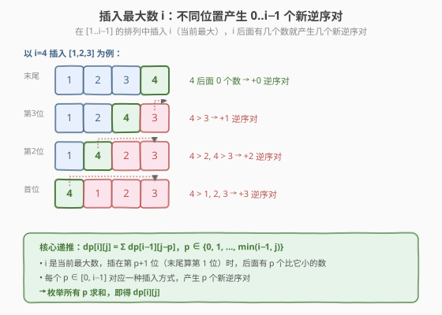
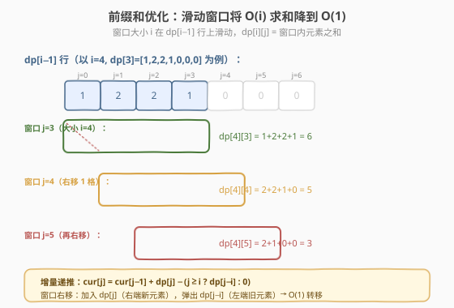
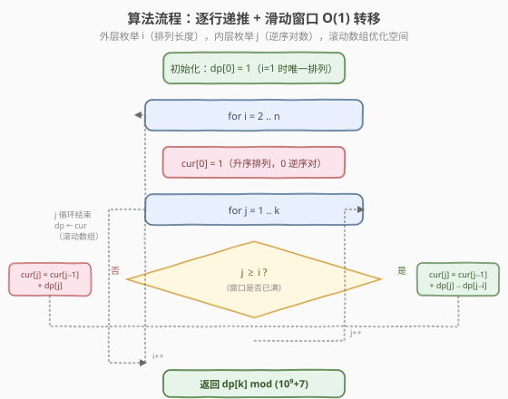
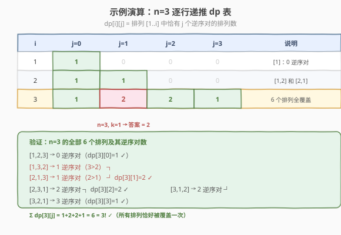

# LeetCode K个逆序对数组 题解

## 1. 题目概述

- **标题 / 题号**：K个逆序对数组（#629，hard）
- **链接**：https://leetcode.cn/problems/k-inverse-pairs-array/
- **难度**：困难
- **标签**：动态规划、前缀和

**题意**：对于一个整数数组 `nums`，**逆序对**是一对满足 `0 <= i < j < nums.length` 且 `nums[i] > nums[j]` 的整数对 `[i, j]`。给你两个整数 `n` 和 `k`，找出所有包含从 `1` 到 `n` 的数字、且恰好拥有 `k` 个逆序对的不同数组的个数。由于答案可能很大，只需返回对 $10^9 + 7$ 取余的结果。

**示例 1**：

```text
输入：n = 3, k = 0
输出：1
解释：只有数组 [1,2,3] 包含 1 到 3 的整数且恰好拥有 0 个逆序对。
```

**示例 2**：

```text
输入：n = 3, k = 1
输出：2
解释：数组 [1,3,2] 和 [2,1,3] 都有 1 个逆序对。
```

**约束**：

- $1 \le n \le 1000$
- $0 \le k \le 1000$

> 💡 本题是**计数型 DP**的经典难题。核心思想是「逐个插入最大数」——从 $[1..i-1]$ 的排列构造 $[1..i]$ 的排列时，插入位置决定新增逆序对数。裸递推是 $O(n^2 k)$，用**前缀和/滑动窗口**优化到 $O(nk)$。它与 [96. 不同的二叉搜索树](../0001-0100/96_不同的二叉搜索树.md)（卡塔兰数计数 DP）同属「按规模递推 + 累加转移」的范式，但新增了「滑动窗口优化求和」这一层技巧。

## 2. 解题思路

### 2.1 暴力思路：枚举所有排列统计逆序对

枚举 $1$ 到 $n$ 的全部 $n!$ 个排列，逐个计算逆序对数，统计恰好为 $k$ 的个数。$n=1000$ 时 $n!$ 是天文数字，**完全不可行**。

> ⚠️ 暴力法的浪费在于没有利用「排列之间存在递推结构」——$[1..i]$ 的排列可由 $[1..i-1]$ 的排列插入 $i$ 得到，且插入位置与新增逆序对数有一一对应关系。

### 2.2 核心观察：插入最大数 + 滑动窗口求和

**状态定义**：$dp[i][j]$ = 由 $1$ 到 $i$ 组成的排列中，恰好有 $j$ 个逆序对的排列个数。

**关键转化**：从 $[1..i-1]$ 的排列构造 $[1..i]$ 的排列时，把当前最大数 $i$ 插入到排列的某个位置。因为 $i$ 比所有已有数都大，所以**$i$ 后面有几个数，就产生几个新逆序对**。



具体来说，将 $i$ 插入长度为 $i-1$ 的排列，有 $i$ 个位置可选：

- 插在**末尾**：$i$ 后面 $0$ 个数 → 新增 $0$ 个逆序对
- 插在**倒数第 2 位**：$i$ 后面 $1$ 个数 → 新增 $1$ 个逆序对
- ……
- 插在**最前面**：$i$ 后面 $i-1$ 个数 → 新增 $i-1$ 个逆序对

设插入位置产生 $p$ 个新逆序对（$p \in [0, i-1]$），则：

$$dp[i][j] = \sum_{p=0}^{\min(i-1,\, j)} dp[i-1][j - p]$$

> 💡 **为什么是 $\min(i-1, j)$？** 当 $j < i-1$ 时，$p$ 最大只能取 $j$（否则 $j - p < 0$，$dp[i-1][\text{负数}] = 0$ 无意义）。这说明 $j$ 较小时窗口尚未「占满」$i$ 个格子。

**直接递推的复杂度**：每个状态求和最多 $i$ 项，总计 $O(n^2 k)$，$n = k = 1000$ 时约 $10^9$，**超时**。

**前缀和优化**：观察求和式——$dp[i][j]$ 是 $dp[i-1]$ 行上一段连续区间的和（窗口大小 $i$）。用**滑动窗口**：窗口右移一格，加入右端新元素 $dp[i-1][j]$，弹出左端旧元素 $dp[i-1][j-i]$，$O(1)$ 完成转移。



**增量递推式**（由滑动窗口直接推出）：

$$dp[i][j] = dp[i][j-1] + dp[i-1][j] - \begin{cases} dp[i-1][j-i], & j \ge i \\ 0, & j < i \end{cases}$$

- $dp[i][j-1]$：上一格的窗口和（窗口已含 $dp[i-1][j-1]$ 到 $dp[i-1][j-i]$）
- $+ dp[i-1][j]$：窗口右移，加入新的右端
- $- dp[i-1][j-i]$：窗口右移，弹出旧的左端（$j < i$ 时窗口未满，无需弹出）

> ⚠️ **取模注意事项**：减法可能产生负数，需 `(cur[j] - dp[j-i] + MOD) % MOD` 修正。这是计数 DP 取模的常见陷阱。

### 2.3 算法流程图



**完整步骤**：

1. **初始化**：`dp[0] = 1`（$i=1$ 时唯一排列 `[1]`，$0$ 个逆序对）
2. **外层循环** $i$ **从 2 到** $n$：
   - 新建 `cur` 数组，`cur[0] = 1`（升序排列 $[1, 2, \ldots, i]$ 恒有 $0$ 个逆序对）
   - **内层循环** $j$ **从 1 到** $k$：
     - `cur[j] = (cur[j-1] + dp[j]) % MOD`（窗口加入右端）
     - 若 $j \ge i$：`cur[j] = (cur[j] - dp[j-i] + MOD) % MOD`（窗口弹出左端）
   - `dp = cur`（滚动数组，进入下一轮）
3. **返回** `dp[k]`

> 💡 **滚动数组**：$dp[i][j]$ 只依赖 $dp[i-1]$ 行和当前行 $cur$ 的前驱，因此用两个一维数组 `dp`（上一行）和 `cur`（当前行）即可，空间 $O(k)$。

### 2.4 示例演算

以 $n = 3$ 为例，逐行递推 $dp$ 表：



| $i$ | $j=0$ | $j=1$ | $j=2$ | $j=3$ | 说明 |
|-----|-------|-------|-------|-------|------|
| 1 | **1** | 0 | 0 | 0 | `[1]`：0 个逆序对 |
| 2 | **1** | **1** | 0 | 0 | `[1,2]` 和 `[2,1]` |
| 3 | **1** | **2** | **2** | **1** | 全部 6 个排列 |

**递推过程详解**（$i=3$，依赖 $dp[2] = [1, 1, 0, 0]$）：

- $cur[0] = 1$（升序排列 `[1,2,3]`）
- $cur[1] = cur[0] + dp[1] = 1 + 1 = 2$（$j=1 < i=3$，不弹出）→ 对应 `[1,3,2]`、`[2,1,3]`
- $cur[2] = cur[1] + dp[2] = 2 + 0 = 2$（$j=2 < 3$，不弹出）→ 对应 `[2,3,1]`、`[3,1,2]`
- $cur[3] = cur[2] + dp[3] - dp[0] = 2 + 0 - 1 = 1$（$j=3 \ge 3$，弹出 $dp[0]$）→ 对应 `[3,2,1]$

验证：$\sum dp[3][j] = 1+2+2+1 = 6 = 3!$ ✓（所有排列恰好被覆盖一次）

> 💡 注意 $cur[3]$ 的计算中弹出了 $dp[0]=1$：窗口大小为 $i=3$，求和区间从 $dp[1]$ 到 $dp[3]$，$dp[0]$ 已滑出窗口。这正是「窗口已满，右移需弹出左端」的体现。

## 3. 参考代码

### C++

```cpp
// K个逆序对数组.cpp —— 滑动窗口优化的计数 DP
// 编译: g++ -O2 -std=c++17 K个逆序对数组.cpp -o kinverse
class Solution {
  public:
    int kInversePairs(int n, int k) {
        const int MOD = 1e9 + 7;
        vector<int> dp(k + 1, 0);   // 上一行 dp[i-1]
        dp[0] = 1;                   // i=1: [1] 有 0 个逆序对
        for (int i = 2; i <= n; ++i) {
            vector<int> cur(k + 1, 0);
            cur[0] = 1;              // 升序排列 [1..i]，恒有 0 个逆序对
            for (int j = 1; j <= k; ++j) {
                cur[j] = (cur[j - 1] + dp[j]) % MOD;       // 窗口加入右端
                if (j >= i) {
                    cur[j] = (cur[j] - dp[j - i] + MOD) % MOD; // 窗口弹出左端
                }
            }
            dp = move(cur);          // 滚动数组
        }
        return dp[k];
    }
};
```

### Python

```python
class Solution:
    def kInversePairs(self, n: int, k: int) -> int:
        MOD = 10**9 + 7
        dp = [0] * (k + 1)           # 上一行 dp[i-1]
        dp[0] = 1                     # i=1: [1] 有 0 个逆序对
        for i in range(2, n + 1):
            cur = [0] * (k + 1)
            cur[0] = 1                # 升序排列 [1..i]，恒有 0 个逆序对
            for j in range(1, k + 1):
                cur[j] = (cur[j - 1] + dp[j]) % MOD        # 窗口加入右端
                if j >= i:
                    cur[j] = (cur[j] - dp[j - i]) % MOD    # 窗口弹出左端
            dp = cur                  # 滚动数组
        return dp[k]
```

> 💡 **Python 的取模技巧**：Python 的 `%` 对负数返回非负结果，所以 `(cur[j] - dp[j-i]) % MOD` 天然正确，无需像 C++ 那样 `+ MOD` 修正。

> 💡 **为什么 `cur[0] = 1` 而不用递推？** 对任意 $i$，升序排列 $[1, 2, \ldots, i]$ 恰有 $0$ 个逆序对，且这是唯一的 $0$ 逆序对排列。因此 $dp[i][0] = 1$ 恒成立，直接赋值比走递推（$j=0$ 时 $j-1 = -1$ 越界）更简洁。

## 4. 复杂度分析

| 维度 | 朴素递推 | 前缀和/滑动窗口优化 |
|------|---------|-------------------|
| **时间复杂度** | $O(n^2 k)$ | $O(nk)$ |
| **空间复杂度** | $O(nk)$（二维表） | $O(k)$（滚动数组） |
| **$n=k=1000$** | $\sim 10^9$，超时 | $\sim 10^6$，通过 |
| **推荐度** | ❌ 仅作理解 | ✅ 面试/竞赛首选 |

> ⚠️ 朴素递推每个状态求和最多 $i$ 项，总 $O(n^2 k)$；滑动窗口把每次转移降到 $O(1)$，总 $O(nk)$。空间上 $dp[i]$ 只依赖 $dp[i-1]$，用两个一维数组滚动即可 $O(k)$。

## 5. 扩展：前缀和显式写法

上面的增量递推 `cur[j] = cur[j-1] + dp[j] - dp[j-i]` 隐式利用了前缀和。也可以**显式维护前缀数组**，思路更直观：

```text
prefix[j] = dp[0] + dp[1] + … + dp[j]    （dp 上一行的前缀和）
dp[i][j] = prefix[j] - prefix[j - i]      （窗口 [j-i+1, j] 的和，j < i 时下界取 0）
```

### C++

```cpp
class Solution {
  public:
    int kInversePairs(int n, int k) {
        const int MOD = 1e9 + 7;
        vector<int> dp(k + 1, 0);
        dp[0] = 1;
        for (int i = 2; i <= n; ++i) {
            // 显式前缀和
            vector<int> prefix(k + 1, 0);
            prefix[0] = dp[0];
            for (int j = 1; j <= k; ++j)
                prefix[j] = (prefix[j - 1] + dp[j]) % MOD;
            // 窗口求和
            vector<int> cur(k + 1, 0);
            for (int j = 0; j <= k; ++j) {
                if (j < i)
                    cur[j] = prefix[j];                       // 窗口未满
                else
                    cur[j] = (prefix[j] - prefix[j - i] + MOD) % MOD; // 窗口已满
            }
            dp = move(cur);
        }
        return dp[k];
    }
};
```

> 💡 **两种写法等价**：增量递推是滑动窗口的「增量版」（每步加减一个元素），显式前缀和是「快照版」（先算前缀再作差）。前者少一个内循环，常数更优；后者逻辑更清晰，适合面试时先写再优化。

## 6. 面试要点

1. **为什么用「插入最大数」来递推，而不是其他方式？**

   > 因为 $i$ 是当前最大的数，插入任何位置后，它后面的数都比它小，产生的逆序对数恰好等于「后面的元素个数」。这种一一对应使得插入位置 $p$ 与新增逆序对数 $p$ 完美挂钩，递推关系简洁。若插入非最大数，新增逆序对数取决于后面比它小的数有几个，无法简单枚举。

2. **滑动窗口优化的原理是什么？**

   > $dp[i][j] = \sum_{t=\max(0, j-i+1)}^{j} dp[i-1][t]$ 是一段长度为 $i$ 的连续区间和。当 $j$ 递增 1 时，窗口右移：加入 $dp[i-1][j]$、弹出 $dp[i-1][j-i]$，$O(1)$ 更新。这把每个状态 $O(i)$ 的求和降到 $O(1)$，总复杂度从 $O(n^2 k)$ 降到 $O(nk)$。

3. **$j < i$ 时为什么不减 $dp[j-i]$？**

   > $j < i$ 时窗口尚未占满 $i$ 个格子，求和区间从 $dp[i-1][0]$ 到 $dp[i-1][j]$，左端没有元素需要弹出。等价地看，$j - i < 0$ 时 $dp[i-1][j-i]$ 不存在（视为 0），不减即可。

4. **取模时减法出现负数怎么处理？**

   > C++ 中 `(a - b) % MOD` 可能为负，需 `(a - b + MOD) % MOD` 修正。Python 的 `%` 对负数天然返回非负结果，直接写 `(a - b) % MOD` 即可。这是所有计数 DP 的通用陷阱。

5. **如何验证答案的正确性？**

   > 利用 $\sum_{j=0}^{k_{\max}} dp[i][j] = i!$（所有排列恰好被覆盖一次）。如 $n=3$ 时 $1+2+2+1=6=3!$。小规模用例也可暴力枚举排列对照。

> 💡 **一句话总结**：$dp[i][j]$ = $[1..i]$ 排列中 $j$ 个逆序对的个数，递推靠「插入最大数 $i$，位置决定新增逆序对数」，滑动窗口把 $O(i)$ 求和优化到 $O(1)$，总 $O(nk)$ 时间、$O(k)$ 空间。

## 同类练习题

| # | 题目 | 与本题的关联 |
|---|------|-------------|
| 96 | [不同的二叉搜索树](https://leetcode.cn/problems/unique-binary-search-trees/)（[题解](../0001-0100/96_不同的二叉搜索树.md)） | 同为「按规模递推 + 累加转移」的计数 DP（卡塔兰数），对照无窗口优化版 |
| 920 | [播放列表数量](https://leetcode.cn/problems/number-of-music-playlists/) | 计数 DP + 两维状态递推，同样需要找「最后一步」的转移结构 |
| 1987 | [不同的好子序列数目](https://leetcode.cn/problems/number-of-unique-good-subsequences/) | 计数 DP + 取模，状态定义与转移需仔细设计 |
| 2360 | [图中的最长环](https://leetcode.cn/problems/longest-cycle-in-a-graph/) | 虽非计数 DP，但同样需要「逐节点递推」的思维 |
