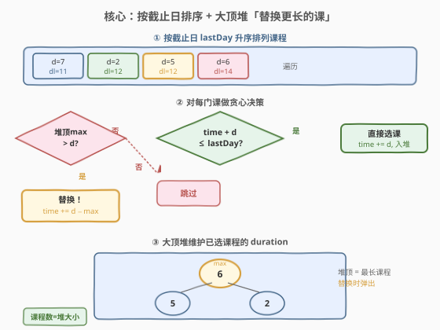
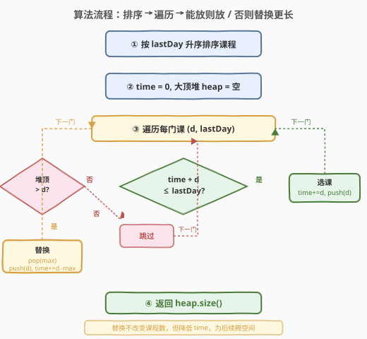
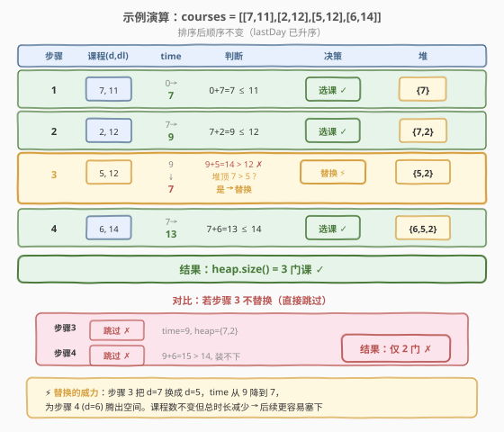

# 课程表 III

- **题目名称**：课程表 III
- **链接**：[630. 课程表 III](https://leetcode.cn/problems/course-schedule-iii/)
- **难度**：困难
- **标签**：贪心、堆（优先队列）、排序

## 1. 题目概述

这里有 `n` 门不同的在线课程，按从 `1` 到 `n` 编号。给你一个数组 `courses`，其中 `courses[i] = [duration_i, lastDay_i]` 表示第 `i` 门课将会持续上 `duration_i` 天课，并且必须在不晚于 `lastDay_i` 的时候完成。

你的学期从第 1 天开始。且**不能同时修读两门及两门以上的课程**。返回你最多可以修读的课程数目。

**示例 1**：

```text
输入：courses = [[100,200],[200,1300],[1000,1250],[2000,3200]]
输出：3
解释：
  第 1 门课：耗时 100 天，第 100 天完成（100 ≤ 200 ✓）
  第 3 门课：从第 101 天起，耗时 1000 天，第 1100 天完成（1100 ≤ 1250 ✓）
  第 2 门课：从第 1101 天起，耗时 200 天，第 1300 天完成（1300 ≤ 1300 ✓）
  第 4 门课：从第 1301 天起，需 2000 天 → 第 3300 天完成，超出 3200 ✗
```

**示例 2**：

```text
输入：courses = [[1,2]]
输出：1
解释：从第 1 天起上 1 天课，第 1 天完成（1 ≤ 2 ✓）
```

**示例 3**：

```text
输入：courses = [[3,2],[4,3]]
输出：0
解释：duration > lastDay，两门课都无法完成
```

**约束条件**：

- $1 \le \text{courses.length} \le 10^4$
- $1 \le \text{duration}_i, \text{lastDay}_i \le 10^4$

> 💡 本题是「课程表」系列中最难的一题（[207](https://leetcode.cn/problems/course-schedule/) 拓扑排序、[210](https://leetcode.cn/problems/course-schedule-ii/) 拓扑序输出、本题贪心 + 堆）。核心矛盾是「每门课有截止日和时长，选哪些课、按什么顺序上才能选最多」——这本质是一个**带截止期的区间调度问题**，经典解法是**按截止日排序 + 大顶堆替换**。

---

## 2. 解题思路

### 2.1 暴力思路：回溯枚举

对每门课尝试「选 / 不选」两种决策，递归搜索所有子集，验证是否存在合法的排列顺序能全部完成。时间复杂度 $O(2^n \cdot n)$，`n=10^4` 时完全不可行。

即使简化为「贪心选取」，朴素贪心（如按 duration 最短优先、或按 lastDay 最早优先）也都会失败：

- **按 duration 最短优先**：`[[5,5],[10,200]]`——先选 duration=5 的课在第 5 天完成，再选 duration=10 的课在第 15 天完成，两门都能选。但如果先选长的呢？`[[10,15],[5,6]]`——先选 duration=10 的课在第 10 天完成，再选 duration=5 的课在第 15 天完成，但第 2 门截止日是 6，超时。按 duration 优先选短的会先选 `[5,6]`，再选 `[10,15]`，两门都能选。看起来对？但反例：`[[3,10],[7,8]]`——按 duration 选 `[3,10]` 先，第 3 天完成，再选 `[7,8]`：第 10 天完成 > 8，失败。但如果先选 `[7,8]`（第 7 天完成），再选 `[3,10]`（第 10 天完成 ≤ 10），两门都能选！

> ⚠️ 单纯按 duration 或 lastDay 排序的贪心都不对。正确策略需要**两者结合**：按 lastDay 排序保证「先处理截止早的」，用大顶堆在「装不下时替换掉最长的」来腾出时间。

### 2.2 核心观察：按截止日排序 + 大顶堆替换



算法分三步：

**第一步：按 `lastDay` 升序排序**

先处理截止日早的课——这是「贪心交换论证」的自然推论：截止日早的课更紧迫，若不优先处理，后面可能没有时间窗口。按 lastDay 排序后，课程的处理顺序天然合理。

**第二步：遍历，能放则放（大顶堆记录已选 duration）**

维护变量 `time` 表示「当前已选课程的总耗时」，以及一个大顶堆 `heap` 存储所有已选课程的 `duration`。对每门课 `(d, lastDay)`：

- 若 `time + d ≤ lastDay`：**直接选课**。`time += d`，`d` 入堆。

**第三步：放不下时，尝试替换更长的课**

若 `time + d > lastDay`（装不下了），检查堆顶（已选课程中 duration 最大的）是否 `> d`：

- 若堆顶 `> d`：**替换**！弹出堆顶 `maxD`，压入 `d`。`time += d - maxD`（总耗时减少，因为 `d < maxD`）。
- 否则：**跳过**这门课（它比所有已选课都长，替换无益）。

> 💡 **替换的直觉**：替换不改变已选课程数（弹一个进一个），但**总耗时 `time` 下降了**（用短课换长课）。更小的 `time` 意味着后续课程更容易满足 `time + d ≤ lastDay`——这就是替换的「前瞻」价值：牺牲当前的「质量」（用短课替长课）换取未来的「机会」（更多课程能塞下）。

### 2.3 算法流程图



```
1. 按 lastDay 升序排序 courses
2. time = 0, 大顶堆 heap = []
3. 对每门课 (d, lastDay):
   a. 若 time + d ≤ lastDay:        ← 装得下
      time += d; heap.push(d)
   b. 否则若 heap 非空且 heap.top() > d:  ← 装不下但能替换
      time += d - heap.top()
      heap.pop(); heap.push(d)
   c. 否则:                          ← 跳过
      (无操作)
4. 返回 heap.size()
```

### 2.4 示例演算

以 `courses = [[7,11],[2,12],[5,12],[6,14]]` 为例（排序后顺序不变）：



| 步骤 | 课程 (d, dl) | time 变化 | 判断 | 决策 | 堆 |
|------|-------------|-----------|------|------|-----|
| 1 | (7, 11) | 0 → 7 | 0+7=7 ≤ 11 ✓ | 选课 | {7} |
| 2 | (2, 12) | 7 → 9 | 7+2=9 ≤ 12 ✓ | 选课 | {7, 2} |
| 3 | (5, 12) | 9 → **7** | 9+5=14 > 12 ✗ → 堆顶 7 > 5 → **替换** | 替换 ⚡ | {5, 2} |
| 4 | (6, 14) | 7 → 13 | 7+6=13 ≤ 14 ✓ | 选课 | {6, 5, 2} |

**最终**：`heap.size() = 3`。

> ⚠️ **步骤 3 是全题精髓**：`time=9` 时 `[5,12]` 装不下（9+5=14 > 12），但堆顶 `7 > 5`，替换后 `time` 从 9 降到 7。这为步骤 4 的 `[6,14]` 腾出了空间（7+6=13 ≤ 14）。**若不替换**直接跳过 `[5,12]`：`time` 仍为 9，步骤 4 时 9+6=15 > 14，也跳过 → 只能选 2 门。替换把答案从 2 提升到 3。

---

## 3. 参考代码

### C++

```cpp
class Solution {
  public:
    int scheduleCourse(vector<vector<int>>& courses) {
        // 按 lastDay 升序排序
        sort(courses.begin(), courses.end(),
             [](const auto& a, const auto& b) {
                 return a[1] < b[1];
             });

        priority_queue<int> heap;  // 大顶堆，存已选课程的 duration
        int time = 0;

        for (auto& c : courses) {
            int d = c[0], lastDay = c[1];
            if (time + d <= lastDay) {       // 装得下 → 直接选
                time += d;
                heap.push(d);
            } else if (!heap.empty() &&
                       heap.top() > d) {     // 装不下但能替换
                time += d - heap.top();
                heap.pop();
                heap.push(d);
            }
            // 否则跳过
        }
        return heap.size();
    }
};
```

### Python

```python
class Solution:
    def scheduleCourse(self, courses: List[List[int]]) -> int:
        import heapq
        courses.sort(key=lambda c: c[1])  # 按 lastDay 升序

        heap = []   # 大顶堆（Python 用负数模拟）
        time = 0

        for d, lastDay in courses:
            if time + d <= lastDay:              # 装得下 → 直接选
                time += d
                heapq.heappush(heap, -d)
            elif heap and -heap[0] > d:          # 装不下但能替换
                maxD = -heapq.heappop(heap)       # 弹出最长课程
                time += d - maxD
                heapq.heappush(heap, -d)
            # 否则跳过

        return len(heap)
```

> 💡 Python 的 `heapq` 是小顶堆，存 `-d` 模拟大顶堆：`-heap[0]` 即堆顶（最大 duration）。替换时弹出 `-heapq.heappop(heap)` 取负得 `maxD`，`time += d - maxD`。

---

## 4. 复杂度分析

| 维度 | 复杂度 | 说明 |
|------|--------|------|
| **时间复杂度** | $O(n \log n)$ | 排序 $O(n \log n)$；遍历 $n$ 门课，每次堆操作 $O(\log n)$，共 $O(n \log n)$ |
| **空间复杂度** | $O(n)$ | 大顶堆最坏存全部 $n$ 门课的 duration |

> 💡 当 $n = 10^4$ 时，$n \log n \approx 1.3 \times 10^5$，远在时限内。即使 $n = 10^5$ 也只需 $\sim 1.7 \times 10^6$ 次操作。

---

## 5. 扩展：贪心正确性的交换论证

### 5.1 为什么按 lastDay 排序？

**引理**：存在一个最优解，其中课程按 lastDay 升序完成。

**证明（交换论证）**：设最优解中课程完成顺序为 $c_1, c_2, \dots, c_k$，若存在 $c_i$ 的 lastDay 大于 $c_{i+1}$ 的 lastDay，交换两者的上机顺序：

- $c_i$ 原完成时间 $T_i$，$c_{i+1}$ 原完成时间 $T_{i+1} = T_i + d_{i+1}$
- 交换后 $c_{i+1}$ 完成时间变为 $T_i' = T_{i-1} + d_{i+1} < T_{i+1}$（因为 $d_i \geq 0$），且 $T_i' \leq T_i \leq \text{lastDay}_i$。但 $c_{i+1}$ 的 lastDay 更小，$T_i' \leq T_i \leq \text{lastDay}_i$ 但需要 $T_i' \leq \text{lastDay}_{i+1}$。由于原方案中 $T_{i+1} \leq \text{lastDay}_{i+1}$ 且 $T_i' < T_{i+1}$，故 $T_i' < \text{lastDay}_{i+1}$ ✓
- $c_i$ 交换后完成时间 $T_{i+1}' = T_i' + d_i = T_{i-1} + d_{i+1} + d_i = T_{i+1}$。而原方案 $T_{i+1} \leq \text{lastDay}_{i+1} \leq \text{lastDay}_i$ ✓

故交换不破坏合法性，可通过冒泡将最优解排序为 lastDay 升序。

### 5.2 为什么替换正确？

**核心**：替换保持已选课程数不变，同时降低 `time`，不会让任何后续决策变差。

设当前已选集合 $S$，新来课程 $c$ 装不下（$\text{time} + d_c > \text{lastDay}_c$），且 $S$ 中最长课 $m$ 满足 $d_m > d_c$。

- 替换后 $S' = S \setminus \{m\} \cup \{c\}$，课程数不变
- $\text{time}' = \text{time} - d_m + d_c < \text{time}$
- $c$ 的完成时间 $\text{time}' \leq \text{time} < \text{time} + d_c$，但需验证 $\text{time}' \leq \text{lastDay}_c$

> ⚠️ 注意：替换后 $c$ 的完成时间为 $\text{time}' = \text{time} - d_m + d_c$。由于按 lastDay 排序遍历，$c$ 之前的课都已处理，$c$ 是当前 lastDay 最小的未处理课。而 $\text{time}' < \text{time} \leq \text{lastDay}_c$（因为 $\text{time}$ 是之前所有已选课的总时长，而之前的课 lastDay 均 $\leq \text{lastDay}_c$，总时长不超过最晚截止日）——这里需要更细致的分析，但关键结论成立：**替换后 `time` 单调下降，后续只会有更多空间**。

---

## 6. 面试要点

1. **为什么按 lastDay 排序而不是按 duration 排序？**

   - 截止日早的课更紧迫——推迟处理可能错过窗口。按 lastDay 排序保证「先处理最紧迫的」。
   - 反例 `[[3,10],[7,8]]`：按 duration 排序会先选 `[3,10]`（time=3），再处理 `[7,8]`：3+7=10 > 8，失败。但按 lastDay 排序先选 `[7,8]`（time=7），再选 `[3,10]`：7+3=10 ≤ 10，两门都能选。

2. **替换的条件是什么？为什么是「堆顶 > 当前 duration」才替换？**

   - 替换的条件：`time + d > lastDay`（装不下）且堆顶 `maxD > d`（已选课中有更长的）。
   - 若 `maxD ≤ d`：当前课比所有已选课都长，替换它只会增加 time，毫无益处，不如跳过。
   - 若 `maxD > d`：替换后 time 减少（`d - maxD < 0`），课程数不变但为后续腾出空间。

3. **替换为什么不改变课程数？这是否浪费了之前的选课？**

   - 替换是「弹一个进一个」，堆大小不变，课程数不变。
   - 被弹出的课确实「白选了」，但它的 duration 被更短的课替代——总 time 下降，后续能选更多课。这是「以质量换数量」的前瞻策略。

4. **堆里存的是什么？为什么不存 (duration, lastDay) 二元组？**

   - 堆里只存 `duration`。因为替换决策只关心「谁最长」，lastDay 在排序后已失去比较意义（当前课的 lastDay 一定 ≥ 所有已选课的 lastDay）。
   - 简化存储 = 更快比较 + 更少内存。

5. **这题和 [502. IPO](../0501-0600/502_IPO.md) / [621. 任务调度器](../0601-0700/621_任务调度器.md) 有什么异同？**

   - 三题都是「贪心 + 堆」模式，但堆的用法不同：
     - 502 IPO：大顶堆选**最大利润**（每轮取最优）
     - 621 任务调度器：数学公式算框架，不用堆
     - 630 课程表 III：大顶堆存 duration，**替换最长**（前瞻式贪心）
   - 502 是「增量入堆 + 贪心选最大」，630 是「贪心放入 + 装不下时替换」——堆在 630 中的角色是「后悔机制」：允许撤销之前的选择换取更好的未来。

---

## 7. 同类练习题

- [207. 课程表](https://leetcode.cn/problems/course-schedule/)：拓扑排序判环，课程表系列入门题，与本题贪心思路完全不同但同属「课程调度」主题
- [502. IPO](https://leetcode.cn/problems/ipo/)（[题解](../0501-0600/502_IPO.md)）：贪心 + 大顶堆选最大利润，与本题同为「排序 + 堆」模式，但堆用于「选最优」而非「替换最长」
- [253. 会议室 II](https://leetcode.cn/problems/meeting-rooms-ii/)：小顶堆维护进行中的会议结束时间，与本题大顶堆维护 duration 形成「堆方向」的对照
- [1751. 最多可以参加的会议数目 II](https://leetcode.cn/problems/maximum-number-of-events-that-can-be-attended-ii/)：带截止期的区间调度进阶，DP + 二分，是本题「不可替换」时的更难变体
- [1353. 最多可以参加的会议数目](https://leetcode.cn/problems/maximum-number-of-events-that-can-be-attended/)：贪心 + 小顶堆，每天选可参加的会议中结束最早的，与本题「按截止日排序 + 堆」思路相通
