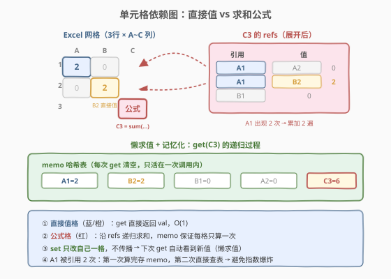
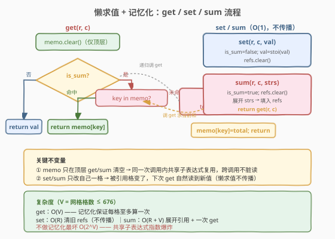
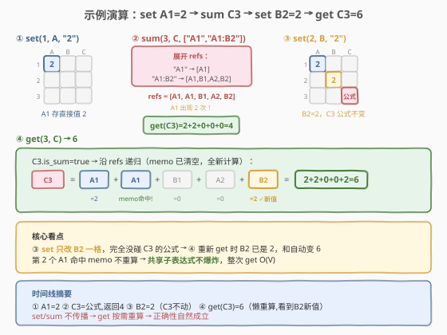

# LeetCode 设计 Excel 求和公式 题解

## 1. 题目概述

- **标题 / 题号**：设计 Excel 求和公式（#631，hard）
- **链接**：https://leetcode.cn/problems/design-excel-sum-formula/
- **难度**：困难
- **标签**：设计、图、记忆化搜索、递归

**题意**：设计一个简化版 Excel 电子表格，支持单元格**设值**、**取值**与**求和公式**。关键难点：当某个单元格被 `sum` 引用后，**被引用的单元格发生变化时，求和结果要自动更新**——和真实 Excel 一样。

需实现以下接口：

- `Excel(int H, char W)`：初始化 `H` 行、列 `A` 到 `W` 的网格，所有单元格初始为 `0`
- `void set(int r, char c, string val)`：将单元格 `(r, c)` 设为 `val` 表示的整数值，**清除原有公式**
- `int get(int r, char c)`：返回单元格 `(r, c)` 的当前值
- `int sum(int r, char c, string[] strs)`：将单元格 `(r, c)` 设为一个**求和公式**，内容为 `strs` 中所有引用的单元格值之和；返回计算出的和

**引用格式**：

- 单个单元格：`"A1"`（列 A，行 1）
- 矩形区间：`"A1:B2"`（从 A1 到 B2 的所有单元格，含端点）

> ⚠️ 同一个单元格可能在 `strs` 中被引用多次（如 `["A1", "A1:B2"]`，A1 既单独出现又在区间内），此时它的值被**多次累加**。

**示例 1**：

```text
输入：
  Excel(3, 'C')                                  // 3行 × 列A~C
  set(1, 'A', "2")                               // A1 = 2
  sum(3, 'C', ["A1", "A1:B2"])                   // C3 = A1 + (A1+B1+A2+B2)
                                                  //     = 2 + (2+0+0+0) = 4
  set(2, 'B', "2")                               // B2 = 2（C3 应自动更新）
  get(3, 'C')                                    // → 6 = 2 + (2+0+2+0)
输出：[null, null, 4, null, 6]
```

**示例 2**：

```text
输入：
  Excel(5, 'E')
  set(1, 'A', "5")                               // A1 = 5
  sum(2, 'A', ["A1", "A1:A1"])                   // A2 = A1 + A1 = 10
  set(1, 'A', "10")                              // A1 变为 10
  get(2, 'A')                                    // → 20 = 10 + 10
输出：[null, null, 10, null, 20]
```

**约束**：

- `1 <= H <= 26`
- `'A' <= W <= 'Z'`（最多 26×26 = 676 个单元格）
- `1 <= r <= H`
- `strs` 中每个引用长度 2-5，区间两端为有效单元格
- 最多调用 `1000` 次操作
- **保证不产生循环引用**

> 💡 难点不在"算一次和"，而在"被引用的单元格变了，和怎么自动更新"。朴素法每次 `get` 重新递归求和虽正确，但遇到共享子表达式会指数爆炸。核心是**记忆化**把每次 `get` 的代价压到 $O(V)$。

## 2. 解题思路

### 2.1 暴力思路

最直观的方案：每个单元格要么存一个**直接值**，要么存一个**引用列表**（`sum` 展开后的所有单元格坐标）。`get` 时如果是直接值就返回，如果是引用列表就**递归求每个被引用单元格的 `get`**再累加。

这套思路完全正确，但有一个隐藏陷阱：**共享子表达式导致指数爆炸**。考虑下面的依赖链——

```
A = sum(B, B)          // B 被引用 2 次
B = sum(C, C)          // C 被引用 2 次
C = sum(D, D)          // ...
...（链深 N 层）
```

`get(A)` 会展开成 $2^N$ 次 `get` 调用。虽然网格只有 676 格、链深有限，但 $2^{676}$ 远超时间限制。

> ⚠️ 问题本质：依赖图是一张 **DAG**（保证无环），`get` 就是在 DAG 上做**子树求和**。朴素递归把同一个节点重复算了多次。解法是**记忆化**——每个单元格在一次 `get` 中只算一次。

### 2.2 核心观察：懒求值 + 记忆化



关键洞察有两层：

**第一层：懒求值（lazy evaluation）**

不在 `set`/`sum` 时传播更新，而是**把更新推迟到 `get` 时按需计算**。每个单元格只存"自己的配方"（直接值 or 引用列表），`get` 时沿引用链递归展开。这样 `set` 是 $O(1)$（只改自己一格），`get` 按需计算。被引用格变了？下次 `get` 自然看到新值——**不需要维护反向依赖、不需要传播**。

**第二层：记忆化（memoization）**

一次 `get` 调用中，同一个单元格可能被多个上层公式反复引用（共享子表达式）。用一张哈希表 `memo` 记录"本次 `get` 中已经算过的格子的值"，第二次遇到直接查表。这样每个格子在一次 `get` 中**至多计算一次**，代价从指数级降到 $O(V)$（$V$ = 网格大小）。

> 💡 `memo` 的生命周期是**单次顶层 `get`/`sum` 调用**——调用开始时清空，调用结束即丢弃。因为格子值在 `set`/`sum` 后会变，跨调用复用 memo 会导致脏读。

##### 单元格的三种状态

| 状态 | `is_sum` | `val` | `refs` | 含义 |
|------|----------|-------|--------|------|
| 直接值 | `false` | 整数 | 空 | `set` 设定的值，`get` 直接返回 |
| 求和公式 | `true` | 不用 | 非空 | `sum` 展开后的引用列表，`get` 递归求和 |
| 初始/已清空 | `false` | `0` | 空 | 初始状态，值为 0 |

##### 引用展开

`strs` 中的每个字符串要么是 `"A1"`（单格），要么是 `"A1:B2"`（区间）。区间需要展开成矩形内所有单元格的坐标：

```
"A1"    → (row=1, col=1)
"A1:B2" → (1,1), (1,2), (2,1), (2,2)    // 4 格
```

> ⚠️ 展开后存的是**扁平的坐标列表**而非原始字符串——这样 `get` 时不需再解析，直接遍历累加。

### 2.3 算法流程



```
set(r, c, val):
    cells[r][c].is_sum = false
    cells[r][c].val = stoi(val)
    cells[r][c].refs.clear()            // 清除旧公式

sum(r, c, strs):
    cells[r][c].is_sum = true
    cells[r][c].refs.clear()
    for s in strs:
        expand s into (row, col) pairs   // 单格 or 区间
        add each pair to cells[r][c].refs
    memo.clear()
    return get(r, c)                     // 立即返回当前和

get(r, c):                               // 带 memo 的递归
    if not cells[r][c].is_sum:
        return cells[r][c].val           // 直接值，O(1)
    key = r * 27 + c
    if key in memo:
        return memo[key]                 // 本次已算过，直接返回
    total = 0
    for (rr, cc) in cells[r][c].refs:
        total += get(rr, cc)             // 递归求被引用格的值
    memo[key] = total                    // 记忆化
    return total
```

**关键不变量**：

- `memo` 在每次**顶层** `get`/`sum` 调用入口清空，保证不读到过期的缓存值。
- 递归 `get` 内部不清空 `memo`（只在顶层清），这样共享子表达式在同一次调用内被正确复用。
- `set`/`sum` 只修改**被操作的那一格**，不传播——正确性由 `get` 的懒求值保证。
- 保证无循环引用（题意约束），所以递归不会死循环。

### 2.4 示例演算

以示例 1 为例，网格 3 行 × 列 A~C，操作序列：`set(1,A,"2")` → `sum(3,C,["A1","A1:B2"])` → `set(2,B,"2")` → `get(3,C)`。



| 步骤 | 操作 | 网格状态 | 说明 |
|------|------|----------|------|
| ① | `set(1,A,"2")` | A1=2（直接值） | A1 存直接值 2，其余格为 0 |
| ② | `sum(3,C,...)` | C3=公式：refs=[A1, A1, B1, A2, B2] | 展开 `["A1","A1:B2"]`：A1 单独 1 次 + 区间 4 格（A1,B1,A2,B2）= 5 个引用，A1 出现 2 次 |
| ②' | 返回值 | `get(C3)` = 2+2+0+0+0 = **4** | 递归求和：A1=2, A1=2, B1=0, A2=0, B2=0 |
| ③ | `set(2,B,"2")` | B2=2（直接值），C3 公式不变 | `set` 只改 B2，不碰 C3 的公式 |
| ④ | `get(3,C)` | `get(C3)` = 2+2+0+0+2 = **6** | 同样的公式，但 B2 现在是 2 → 自动反映新值 |

> 💡 第 ③ 步是核心：`set(2,B,"2")` 只改了 B2 一格，**完全没动 C3**。但第 ④ 步 `get(C3)` 重新递归求和时，B2 的值已经是 2，所以和自动变成 6——这就是**懒求值**的威力：不需要维护反向依赖、不需要传播更新，正确性自然成立。

## 3. 参考代码

### C++

```cpp
class Excel {
    struct Cell {
        int val = 0;
        vector<pair<int, int>> refs;   // 展开后的引用坐标列表
        bool is_sum = false;
    };
    vector<vector<Cell>> cells;        // cells[r][c], 1-indexed
    unordered_map<int, int> memo;      // key = r*27+c, 每次 get/sum 清空

    int get(int r, int c) {
        Cell& cell = cells[r][c];
        if (!cell.is_sum) return cell.val;
        int key = r * 27 + c;
        auto it = memo.find(key);
        if (it != memo.end()) return it->second;
        int total = 0;
        for (auto& [rr, cc] : cell.refs)
            total += get(rr, cc);
        memo[key] = total;
        return total;
    }

    // 解析 "A1" 或 "A1:B2"，展开为坐标对列表
    vector<pair<int, int>> expand(const string& s) {
        vector<pair<int, int>> res;
        auto colon = s.find(':');
        if (colon == string::npos) {
            res.push_back({stoi(s.substr(1)), s[0] - 'A' + 1});
        } else {
            int r1 = stoi(s.substr(1, colon - 1)), c1 = s[0] - 'A' + 1;
            int r2 = stoi(s.substr(colon + 2)), c2 = s[colon + 1] - 'A' + 1;
            for (int r = r1; r <= r2; ++r)
                for (int c = c1; c <= c2; ++c)
                    res.push_back({r, c});
        }
        return res;
    }

public:
    Excel(int H, char W) : cells(H + 1, vector<Cell>(W - 'A' + 2)) {}

    void set(int r, char c, string val) {
        Cell& cell = cells[r][c - 'A' + 1];
        cell.is_sum = false;
        cell.val = stoi(val);
        cell.refs.clear();
    }

    int get(int r, char c) {
        memo.clear();
        return get(r, c - 'A' + 1);
    }

    int sum(int r, char c, vector<string>& strs) {
        Cell& cell = cells[r][c - 'A' + 1];
        cell.is_sum = true;
        cell.refs.clear();
        for (auto& s : strs) {
            auto refs = expand(s);
            for (auto& p : refs)
                cell.refs.push_back(p);
        }
        memo.clear();
        return get(r, c - 'A' + 1);
    }
};
```

### Python

```python
class Excel:
    def __init__(self, H: int, W: str):
        self.H = H
        self.W = ord(W) - ord('A') + 1
        self.val = [[0] * (self.W + 1) for _ in range(H + 1)]          # 直接值
        self.refs = [[None] * (self.W + 1) for _ in range(H + 1)]      # 引用列表（非 None 表示是公式格）
        self.memo = {}

    def _expand(self, s: str):
        """解析 'A1' 或 'A1:B2'，展开为 (row, col) 坐标列表"""
        res = []
        if ':' not in s:
            col = ord(s[0]) - ord('A') + 1
            row = int(s[1:])
            res.append((row, col))
        else:
            tl, br = s.split(':')
            c1, r1 = ord(tl[0]) - ord('A') + 1, int(tl[1:])
            c2, r2 = ord(br[0]) - ord('A') + 1, int(br[1:])
            for r in range(r1, r2 + 1):
                for c in range(c1, c2 + 1):
                    res.append((r, c))
        return res

    def set(self, r: int, c: str, val: str) -> None:
        col = ord(c) - ord('A') + 1
        self.val[r][col] = int(val)
        self.refs[r][col] = None          # 清除公式

    def _get(self, r: int, c: int) -> int:
        if self.refs[r][c] is None:
            return self.val[r][c]         # 直接值
        key = r * 27 + c
        if key in self.memo:
            return self.memo[key]         # 记忆化命中
        total = 0
        for rr, cc in self.refs[r][c]:
            total += self._get(rr, cc)
        self.memo[key] = total
        return total

    def get(self, r: int, c: str) -> int:
        col = ord(c) - ord('A') + 1
        self.memo.clear()                 # 每次顶层调用清空 memo
        return self._get(r, col)

    def sum(self, r: int, c: str, strs: List[str]) -> int:
        col = ord(c) - ord('A') + 1
        refs = []
        for s in strs:
            refs.extend(self._expand(s))
        self.refs[r][col] = refs          # 设为公式格
        self.memo.clear()
        return self._get(r, col)
```

> 💡 代码结构要点：① `get` 分两层——公开接口 `get(r, c)` 清 memo 后调内部 `_get(r, col)`，`_get` 递归不清 memo（保证共享子表达式复用）；② `expand` 把区间展开成扁平坐标列表，`get` 时无需再解析字符串；③ `set`/`sum` 只改自己一格，不传播。

## 4. 复杂度分析

| 维度 | 复杂度 | 说明 |
|------|--------|------|
| `set` 时间 | $O(R)$ | 清除旧 `refs`（$R$ = 旧引用数，最多 676）+ 写一个整数。不传播更新。 |
| `sum` 时间 | $O(R + V)$ | 展开引用 $O(R)$（$R$ = 展开后总引用数）+ 一次 `get` $O(V)$。 |
| `get` 时间 | $O(V)$ | 记忆化保证每格至多算一次，$V$ = 网格大小 $\leq 676$。引用列表遍历总次数受 $V$ 约束（每格的 `refs` 总和上界 $V^2$，但记忆化下实际为 $O(V + E)$，$E \leq V^2$）。 |
| 空间 | $O(V)$ | 网格 $V$ 格 + `memo` 最多 $V$ 条 + 递归栈深 $\leq V$。 |

> ⚠️ 如果不做记忆化，最坏情况 `get` 是 $O(2^V)$（共享子表达式指数爆炸）。记忆化是本题从"超时"到"通过"的关键。

## 5. 扩展： eager 传播——维护反向依赖

懒求值的 `get` 是 $O(V)$。如果 `get` 极频繁而 `set`/`sum` 较少，可改用**即时传播（eager propagation）**把 `get` 降到 $O(1)$：

- 额外维护**反向依赖图** `dependents[r][c]`：记录哪些格子的 `refs` 中包含 `(r, c)`。
- `set`/`sum` 时更新本格值后，沿 `dependents` **BFS 传播**：所有依赖本格的格子重新计算缓存值。
- `get` 直接返回缓存值，$O(1)$。

```
set(r, c, v):
    旧 refs → 从各引用格的 dependents 中删除 (r,c)
    更新 cells[r][c] = {v, 无 refs}
    传播：BFS 从 (r,c) 出发，重算所有 dependents 链上的格子
```

**代价**：`set`/`sum` 从 $O(R)$ 涨到 $O(V + E)$（需传播所有传递依赖者），代码复杂度显著上升（要维护正反向边、处理边的增删）。

| 方案 | `get` | `set`/`sum` | 代码复杂度 | 适用场景 |
|------|-------|-------------|------------|----------|
| 懒求值 + memo（本文） | $O(V)$ | $O(R)$ / $O(R+V)$ | 低 | `get`/`set` 均衡 |
| eager 传播 | $O(1)$ | $O(V+E)$ | 高 | `get` 远多于 `set` |

> 💡 本题网格极小（$V \leq 676$）、操作 $\leq 1000$，懒求值总开销 $\leq 6.8 \times 10^5$，完全足够。eager 方案更适合 `get` 极高频的大规模场景。

## 6. 面试要点

1. **为什么 `set`/`sum` 不需要传播更新？**

   - 采用**懒求值**：单元格只存"配方"（直接值 or 引用列表），`get` 时才沿引用链递归计算。`set` 改了某格后，下次 `get` 自然读到新值——正确性由"按需计算"保证，不需要主动通知依赖者。

2. **为什么需要记忆化？不做会怎样？**

   - 依赖图是 DAG，多个上层公式可能引用同一个格子（共享子表达式）。朴素递归会把同一格算多次，最坏 $O(2^V)$。记忆化让每格在一次 `get` 中只算一次，降到 $O(V)$。

3. **`memo` 为什么每次 `get`/`sum` 都要清空？**

   - `memo` 缓存的是"当前这一刻"各格的值。`set`/`sum` 后格子值变了，旧缓存失效。如果不清，`get` 会返回过期的值。清空时机是**顶层调用入口**，递归内部不清（保证同一次调用内共享子表达式复用）。

4. **区间引用怎么展开？同一个格被引用多次怎么办？**

   - `"A1:B2"` 展开为矩形内所有坐标：$(r_1,c_1)$ 到 $(r_2,c_2)$ 的双重循环。展开后存**扁平坐标列表**，同一个格出现多次就多次累加——这和 Excel `SUM(A1, A1:B2)` 的语义一致（A1 被算两遍）。

5. **如果题目不保证无环怎么办？**

   - 加**循环检测**：递归 `get` 时维护一个"当前调用栈上的格子集合"，如果某格已在栈上则说明有环，可抛异常或返回 0。本题保证无环，所以不需要。

## 同类练习题

| # | 题目 | 与本题的关联 |
|---|------|-------------|
| 146 | [LRU 缓存](https://leetcode.cn/problems/lru-cache/)（[题解](../0101-0200/146_LRU缓存.md)） | 同为"设计 + 数据结构组合"的 Hard 设计题，对照哈希+双向链表 vs 懒求值+记忆化两种设计范式 |
| 690 | [员工的重要性](https://leetcode.cn/problems/employee-importance/) | 给定员工层级（树 / DAG），求某员工及其所有下属的重要性之和——本质是同样的递归求和，无 memo 也会爆 |
| 399 | [除法求值](https://leetcode.cn/problems/evaluate-division/) | 变量间的除法关系构成图，查询时沿图路径计算——同为"图上按需递归计算"的思路 |
| 207 | [课程表](https://leetcode.cn/problems/course-schedule/)（[题解](../0201-0300/207_课程表.md)） | 拓扑排序判断 DAG 是否有环——本题保证无环，但若取消该约束就需要拓扑排序来检测 |
