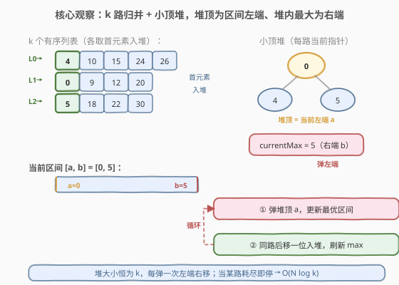
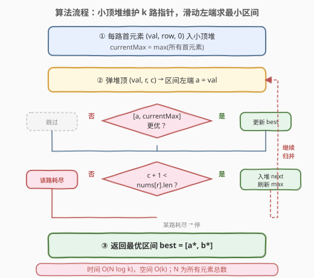
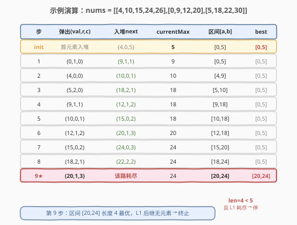

# LeetCode 最小区间 题解

## 1. 题目概述

- **标题 / 题号**：最小区间（#632，hard）
- **链接**：https://leetcode.cn/problems/smallest-range-covering-elements-from-k-lists/
- **难度**：困难
- **标签**：堆、多路归并、滑动窗口、贪心

**题意**：你有 `k` 个 **非递减排列** 的整数列表。找到一个 **最小** 区间，使得 `k` 个列表中的每个列表至少有一个数包含在其中。

定义：若 `b-a < d-c`，或在 `b-a == d-c` 时 `a < c`，则区间 `[a,b]` 比 `[c,d]` 小。

**示例 1**：

```text
输入：nums = [[4,10,15,24,26],[0,9,12,20],[5,18,22,30]]
输出：[20,24]
解释：
列表 1：[4, 10, 15, 24, 26]，24 在区间 [20,24] 中。
列表 2：[0, 9, 12, 20]，20 在区间 [20,24] 中。
列表 3：[5, 18, 22, 30]，22 在区间 [20,24] 中。
```

**示例 2**：

```text
输入：nums = [[1,2,3],[1,2,3],[1,2,3]]
输出：[1,1]
```

**约束**：

- `nums.length == k`
- `1 <= k <= 3500`
- `1 <= nums[i].length <= 50`
- `-10^5 <= nums[i][j] <= 10^5`
- `nums[i]` 按非递减顺序排列

> ⚠️ 关键性质：每个列表**本身有序**。这把问题从「在 $N = \sum n_i$ 个数里搜区间」降为「k 路归并式滑动」——和 [378. 有序矩阵中第 K 小的元素](../0301-0400/378_有序矩阵中第K小的元素.md) 共享同一骨架。

## 2. 解题思路

### 2.1 暴力思路

枚举所有可能的区间端点组合（每个端点取自某个列表中的某个值），共 $O(N^2)$ 个候选区间；对每个候选检查是否覆盖所有 `k` 个列表需 $O(N)$。总时间 $O(N^3)$，`k=3500` 时显然不可行。

稍优的暴力：把所有数拍平排序后用双指针找最短「覆盖 k 个不同来源」的窗口（即第 5 节的滑动窗口解法），$O(N \log N)$ 时间 $O(N)$ 空间，能 AC 但**未利用每路有序**这一性质，空间偏大。

### 2.2 核心观察：小顶堆 k 路归并 + 滑动左端



把 `k` 个有序列表看成 `k` 条有序链表，问题转化为经典的 **k 路归并**（与 [23. 合并 K 个升序链表](../0001-0100/23_合并K个升序链表.md) 同骨架），但目标不是「合并输出」而是「在归并过程中维护一个覆盖每路的区间」。

**核心不变式**：维护一个大小恒为 `k` 的小顶堆，堆里**每路恰好存一个当前指针元素**。于是：

- **堆顶** = 当前 `k` 路候选中的**全局最小**，作为区间**左端 `a`**；
- **堆内最大值** = 当前 `k` 路候选中的**最大**，作为区间**右端 `b`**（用单独变量 `currentMax` 维护，每次入堆时刷新）；
- 此时区间 `[a, b]` **天然覆盖所有 `k` 路**（每路都有一个数落在 `[a, b]` 内），是一个合法候选。

**如何让区间更小？** 弹出堆顶（左端），把**该路下一个元素**入堆并刷新 `currentMax`——相当于把左端「右移」一步，得到一个新的合法区间。不断重复，沿途记录**最优区间**，直到某路耗尽（没有下一个元素可补）为止。

> 💡 **为什么弹出左端能让区间更优？** 当前区间 `[a, b]` 的左端 `a` 已经是堆中最小，任何「不弹 `a`」的区间左端都 $\ge a$，长度不会更短。弹掉 `a` 后左端才有可能右移到更大的值，从而可能缩短 `b - a`。这是**贪心**的精髓：左端能右移就右移，右端只能单调不降。

### 2.3 算法流程图



**关键点**：

1. **初始化**：每路首元素 `(nums[i][0], i, 0)` 入堆，`currentMax = max(所有首元素)`，`best = [堆顶, currentMax]`。
2. **循环**：弹堆顶 `(val, r, c)`。若 `[val, currentMax]` 比当前 `best` 更优则更新 `best`。
3. **终止**：若 `c + 1 == nums[r].size()`，说明第 `r` 路已耗尽，**无法再构成覆盖所有路的区间**，直接 `break`（再弹下去这路就缺席了）。否则把 `nums[r][c+1]` 入堆并刷新 `currentMax`。

> ⚠️ **为什么「某路耗尽」就必须停？** 堆里每路必须恰好有一个代表，区间才合法。一旦某路没有后续元素可补，下一次弹堆后该路就「缺席」了，区间不再覆盖所有 `k` 路。因此终止条件是「弹出的元素已是其所在路的最后一个」。

### 2.4 示例演算

以 `nums = [[4,10,15,24,26],[0,9,12,20],[5,18,22,30]]`（示例 1）为例：



| 步 | 弹出 (val,r,c) | 入堆 next | currentMax | 区间 [a,b] | best |
|----|----------------|-----------|------------|------------|------|
| init | 首元素入堆 | {4,0,5} | 5 | [0,5] | [0,5] |
| 1 | (0,1,0) | (9,1,1) | 9 | [0,5] | [0,5] |
| 2 | (4,0,0) | (10,0,1) | 10 | [4,9] | [0,5] |
| 3 | (5,2,0) | (18,2,1) | 18 | [5,10] | [0,5] |
| 4 | (9,1,1) | (12,1,2) | 18 | [9,18] | [0,5] |
| 5 | (10,0,1) | (15,0,2) | 18 | [10,18] | [0,5] |
| 6 | (12,1,2) | (20,1,3) | 20 | [12,18] | [0,5] |
| 7 | (15,0,2) | (24,0,3) | 24 | [15,20] | [0,5] |
| 8 | (18,2,1) | (22,2,2) | 24 | [18,24] | [0,5] |
| 9★ | (20,1,3) | L1 耗尽 → 停 | 24 | **[20,24]** | **[20,24]** |

第 9 步：弹出 `(20,1,3)` 后区间 `[20,24]` 长度 4 `< 5`，更新 `best`；同时 `c+1=4 == nums[1].size()=4`，第 1 路耗尽，**终止**。最终返回 `[20,24]`。

> 💡 注意第 1 步弹出 `(0,1,0)` 后区间仍是 `[0,5]` 而非 `[0,9]`——因为「区间左端 = 本次弹出的 val」，而本次弹出的是 `0`，`currentMax` 此时还是入堆前的 `5`（入堆的 `9` 在弹出之后才参与刷新）。**先评估区间、再入堆补位**，顺序不能颠倒。

## 3. 参考代码

### 方法一：小顶堆 k 路归并（推荐）

### C++

```cpp
class Solution {
  public:
    vector<int> smallestRange(vector<vector<int>>& nums) {
        int k = nums.size();
        // 小顶堆：元素为 (值, 行号, 列号)
        auto cmp = [](const auto& a, const auto& b) { return a[0] > b[0]; };
        priority_queue<array<int, 3>, vector<array<int, 3>>, decltype(cmp)> pq(cmp);

        int currentMax = INT_MIN;
        for (int r = 0; r < k; ++r) {
            pq.push({nums[r][0], r, 0});
            currentMax = max(currentMax, nums[r][0]);
        }

        // 初始最优区间
        int bestL = pq.top()[0], bestR = currentMax;

        while (!pq.empty()) {
            auto [val, r, c] = pq.top();
            pq.pop();
            // 评估当前区间 [val, currentMax]
            if (currentMax - val < bestR - bestL ||
                (currentMax - val == bestR - bestL && val < bestL)) {
                bestL = val;
                bestR = currentMax;
            }
            // 该路耗尽 → 无法再覆盖所有 k 路，终止
            if (c + 1 == (int)nums[r].size()) break;
            // 同路后移一位入堆，刷新 currentMax
            int nxt = nums[r][c + 1];
            pq.push({nxt, r, c + 1});
            currentMax = max(currentMax, nxt);
        }

        return {bestL, bestR};
    }
};
```

### Python

```python
class Solution:
    def smallestRange(self, nums: List[List[int]]) -> List[int]:
        k = len(nums)
        # 小顶堆：元素为 (值, 行号, 列号)
        heap = [(nums[r][0], r, 0) for r in range(k)]
        heapq.heapify(heap)

        current_max = max(nums[r][0] for r in range(k))
        best_l, best_r = heap[0][0], current_max

        while heap:
            val, r, c = heapq.heappop(heap)
            # 评估当前区间 [val, current_max]
            if (current_max - val < best_r - best_l or
                (current_max - val == best_r - best_l and val < best_l)):
                best_l, best_r = val, current_max
            # 该路耗尽 → 无法再覆盖所有 k 路，终止
            if c + 1 == len(nums[r]):
                break
            # 同路后移一位入堆，刷新 current_max
            nxt = nums[r][c + 1]
            heapq.heappush(heap, (nxt, r, c + 1))
            current_max = max(current_max, nxt)

        return [best_l, best_r]
```

> ⚠️ **顺序陷阱**：必须**先用 `currentMax`（入堆前的最大值）评估区间，再入堆刷新** `currentMax`。若先刷新再评估，会把刚入堆的「新最大」算进当前区间，导致区间右端被错误放大（第 1 步会算成 `[0,9]` 而非 `[0,5]`）。

## 4. 复杂度分析

| 维度 | 复杂度 | 说明 |
|------|--------|------|
| 时间复杂度 | $O(N \log k)$ | 共至多弹出 $N = \sum n_i$ 次，每次出/入堆为 $O(\log k)$（堆大小恒为 $k$） |
| 空间复杂度 | $O(k)$ | 堆中始终存放每路一个代表元素，即 $k$ 个 |

> 💡 本题甜区：`k ≤ 3500`、每路 `≤ 50`，故 $N \le 1.75 \times 10^5$，$O(N \log k) \approx 2 \times 10^6$ 次操作，远低于时限。堆大小恒为 `k` 是关键——这把「在 $N$ 个数里找区间」降为「$N$ 步归并 + 每步 $O(\log k)$」。

## 5. 扩展：滑动窗口法（拍平 + 双指针）

若不利用每路有序，可把所有数拍平为 `(值, 来源列表 id)` 并按值排序，问题转化为：**在有序数组上找一个最短窗口，使窗口内的来源 id 覆盖所有 `k` 路**——与 [76. 最小覆盖子串](../0001-0100/76_最小覆盖子串.md) 完全同骨架，只是把「字符频次」换成「来源 id 频次」。

**算法**：

1. 收集所有 `(nums[r][c], r)` 拍平并按值排序；
2. 双指针 `left`/`right` 扫描排序后数组，用哈希表 `cnt` 维护窗口内各来源 id 的计数，`covered` 记录已覆盖的路数；
3. 当 `covered == k` 时尝试收缩 `left`，记录最优区间 `[arr[left].val, arr[right].val]`。

```cpp
class Solution {
  public:
    vector<int> smallestRange(vector<vector<int>>& nums) {
        int k = nums.size();
        vector<pair<int, int>> arr; // (值, 来源列表 id)
        for (int r = 0; r < k; ++r)
            for (int v : nums[r])
                arr.push_back({v, r});
        sort(arr.begin(), arr.end());

        unordered_map<int, int> cnt;
        int covered = 0, left = 0;
        int bestL = arr[0].first, bestR = arr.back().first;

        for (int right = 0; right < (int)arr.size(); ++right) {
            if (cnt[arr[right].second]++ == 0) ++covered;
            while (covered == k) {
                int l = arr[left].first, r = arr[right].first;
                if (r - l < bestR - bestL ||
                    (r - l == bestR - bestL && l < bestL)) {
                    bestL = l;
                    bestR = r;
                }
                if (--cnt[arr[left].second] == 0) --covered;
                ++left;
            }
        }
        return {bestL, bestR};
    }
};
```

| 解法 | 时间 | 空间 | 适用 |
|------|------|------|------|
| 小顶堆 k 路归并 | $O(N \log k)$ | $O(k)$ | 每路有序（本题），空间最优 |
| 拍平 + 滑动窗口 | $O(N \log N)$ | $O(N)$ | 不要求每路有序，泛化性强 |

> 💡 两种解法的**本质同构**：堆解法是「按归并顺序天然有序地滑动左端」，窗口解法是「显式排序后滑动左端」。前者利用了每路有序免去全局排序，且堆只存 `k` 个代表，空间从 $O(N)$ 降到 $O(k)$。这正是**「利用问题结构降维」**的典型范例。

## 6. 面试要点

1. **为什么堆大小恒为 `k`？**
   - 每路在堆里**至多存一个代表**（当前指针元素）。弹出后立即从同路补一位，堆大小始终等于「尚未耗尽的路数」，初始即 `k`。这是 $O(\log k)$ 单次操作的前提。

2. **`currentMax` 为什么用一个普通变量就够，不必每次扫堆？**
   - `currentMax` 只在「入堆新元素」时刷新：`currentMax = max(currentMax, nxt)`。新元素若比当前最大还大才更新，否则不变。无需扫堆，$O(1)$ 维护。

3. **为什么「某路耗尽」就必须终止，不能继续？**
   - 堆里每路必须恰好有一个代表，区间才合法。一旦某路没有后续元素可补，下一次弹堆后该路就「缺席」，区间不再覆盖所有 `k` 路。此时再继续得到的区间都不合法，故直接 `break`。

4. **区间评估和入堆刷新的顺序为什么不能颠倒？**
   - 当前区间 `[val, currentMax]` 的右端是**入堆前**的 `currentMax`。若先入堆刷新 `currentMax` 再评估，会把刚入堆的「新最大」算进区间，导致右端被错误放大（见 2.4 第 1 步的 `[0,9]` 陷阱）。**先评估、后刷新**是正确顺序。

5. **堆解法 vs 滑动窗口解法如何取舍？**
   - 都对。堆解法利用每路有序，时间 $O(N \log k)$、空间 $O(k)$，**本题首选**；滑动窗口时间 $O(N \log N)$、空间 $O(N)$，但**不依赖每路有序**，泛化到「无序多源找最短覆盖区间」时仍可用。面试中先讲堆解法展示对结构的利用，再提滑动窗口作为泛化方案。

6. **和 [378. 有序矩阵中第 K 小](../0301-0400/378_有序矩阵中第K小的元素.md) 的同与异？**
   - 同：都是「k 路有序 + 小顶堆归并」骨架，堆里每路存一个代表，弹出后从同路补位。
   - 异：378 求「第 k 小」（单点），本题求「最短覆盖区间」（双端，需额外维护 `currentMax` 当右端）。同一骨架，结算目标不同。

## 同类练习题

| # | 题目 | 与本题的关联 |
|---|------|-------------|
| 23 | [合并 K 个升序链表](https://leetcode.cn/problems/merge-k-sorted-lists/)（[题解](../0001-0100/23_合并K个升序链表.md)） | k 路归并鼻祖题，堆中存链表节点指针，与本题同骨架 |
| 378 | [有序矩阵中第 K 小的元素](https://leetcode.cn/problems/kth-smallest-element-in-a-sorted-matrix/)（[题解](../0301-0400/378_有序矩阵中第K小的元素.md)） | 行有序矩阵找第 k 小，k 路归并 + 小顶堆，结算目标不同 |
| 76 | [最小覆盖子串](https://leetcode.cn/problems/minimum-window-substring/)（[题解](../0001-0100/76_最小覆盖子串.md)） | 滑动窗口找最短覆盖子串，与本题滑动窗口解法同模板 |
| 373 | [查找和最小的 K 对数字](https://leetcode.cn/problems/find-k-pairs-with-smallest-sums/) | 两数组各取一个组对求和最小 k 对，多路归并 + 小顶堆 |
| 1439 | [有序矩阵中的第 k 个最小数组和](https://leetcode.cn/problems/find-the-kth-smallest-sum-of-a-matrix-with-sorted-rows/) | 每行有序求第 k 小数组和，多路归并 + 堆的困难版延伸 |
