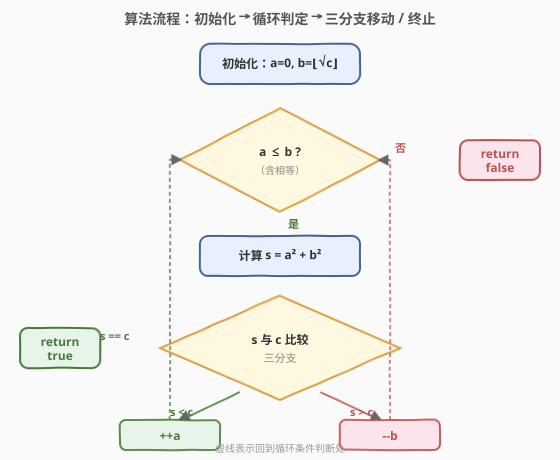
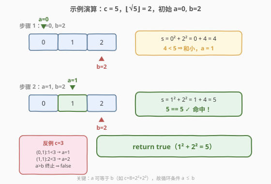

# LeetCode 平方数之和 题解

## 1. 题目概述

- **标题 / 题号**：平方数之和（#633，medium）
- **链接**：https://leetcode.cn/problems/sum-of-square-numbers/
- **难度**：中等
- **标签**：数学、双指针、二分查找

**题意**：给定一个**非负整数** $c$，判断是否存在两个整数 $a$ 和 $b$，使得 $a^2 + b^2 = c$。

**示例 1**：

```text
输入：c = 5
输出：true
解释：1² + 2² = 1 + 4 = 5
```

**示例 2**：

```text
输入：c = 3
输出：false
解释：不存在两个整数满足 a² + b² = 3
```

**示例 3**：

```text
输入：c = 4
输出：true
解释：0² + 2² = 0 + 4 = 4（a 或 b 可以为 0）
```

**约束**：

- `0 <= c <= 2^31 - 1`

> 💡 本题是「**有序空间双指针判定**」的招牌题——把 $a$ 和 $b$ 的取值区间 $[0, \lfloor\sqrt{c}\rfloor]$ 视作一个天然有序的数组，问题立刻退化成 [167. 两数之和 II - 输入有序数组](../0101-0200/167_两数之和%20II%20-%20输入有序数组.md) 的判定版本：**找两个数之和等于定值**。它和同目录的 [611. 有效三角形的个数](./611_有效三角形的个数.md) 形成「判定 vs 计数」的镜像——同骨架异灵魂，对照练习效果最佳。

## 2. 解题思路

### 2.1 暴力思路：枚举 a + 判断平方数

最直观的做法：枚举 $a \in [0, \lfloor\sqrt{c}\rfloor]$，对每个 $a$ 检查 $c - a^2$ 是否是完全平方数。

```text
for a in 0..sqrt(c):
    rem = c - a*a
    if is_perfect_square(rem):
        return true
return false
```

判断完全平方数有两种方式：

- 用内置 `sqrt` 函数：`int(b) ** 2 == rem`，$O(1)$ 但题目隐含「不依赖浮点」的偏好
- 用 [69. x 的平方根](../0001-0100/69_x的平方根.md) 的二分模板手写 `is_perfect_square`，$O(\log c)$

整体时间 $O(\sqrt{c})$ 或 $O(\sqrt{c} \log c)$，对 $c \le 2^{31}-1$（即 $\sqrt{c} \le 46341$）完全可以接受。

> ⚠️ 暴力法的瓶颈不在时间而在**思路结构**——它把问题切成「外层枚举 + 内层验证」两段，缺少对**整体单调性**的利用。破局思路：注意到 $a$ 和 $b$ 同时变化时 $a^2 + b^2$ 具有双向单调性，可把内外两层合并为一次双指针扫描。

### 2.2 核心观察：有序区间上的双指针

**关键转换**：由于 $a, b$ 都是非负整数且 $a^2, b^2 \le c$，所以 $a, b \in [0, \lfloor\sqrt{c}\rfloor]$。把这段整数区间视为一个**升序数组**，问题等价于：

> 在有序数组 $[0, 1, 2, \dots, \lfloor\sqrt{c}\rfloor]$ 中找两个数（允许相同、允许其中一个为 0），使它们的平方和等于 $c$。

这正是一个标准的**两数之和**问题，套用经典双指针模板即可。

![核心观察：a、b 同在 [0, ⌊√c⌋] 上，a²+b² 随 a 增大而增大、随 b 减小而减小，构成双向单调性](../images/squares_sum_concept.svg)

**双指针移动规则**（`a = 0`，`b = floor(sqrt(c))`）：

- 若 $a^2 + b^2 = c$：命中，返回 `true`
- 若 $a^2 + b^2 < c$：和太小，`a++`（换一个更大的 $a$）
- 若 $a^2 + b^2 > c$：和太大，`b--`（换一个更小的 $b$）

**循环条件**：`a <= b`（注意是 `<=` 不是 `<`，因为 $a$ 可以等于 $b$——例如 $c = 8$ 时 $2^2 + 2^2 = 8$，二者相等也是合法解）。

> 💡 **为什么双指针不会漏解？** 设真实解为 $(a^*, b^*)$ 且 $a^* \le b^*$。初始时 $a = 0 \le a^*$，$b = \lfloor\sqrt{c}\rfloor \ge b^*$。每次比较后：
> - 若当前和 $< c$，说明 $a$ 还太小，**$a^*$ 必在当前 $a$ 的右侧**（因为若 $a^* \le$ 当前 $a$，则真实解的 $a^{*2} + b^{*2} \le a^2 + b^2 < c$，矛盾）。`a++` 不会跳过 $a^*$。
> - 若当前和 $> c$，对称地，`b--` 不会跳过 $b^*$。
>
> 因此双指针始终把真实解夹在区间 $[a, b]$ 内，直到相遇或命中。

> ⚠️ **与 [611. 有效三角形的个数](./611_有效三角形的个数.md) 的本质区别**：611 是「**计数型**双指针」——找到分界线后按区间长度 `right - left` 一次性计数；本题是「**判定型**双指针」——找到一对即返回，找不到则按单调性移动一个指针。两者骨架相同（排序/有序 + 左右双指针 + 单调移动），但终点动作截然不同：611 是累加，633 是布尔返回。

### 2.3 算法流程图



**完整步骤**：

1. **初始化**：`a = 0`，`b = floor(sqrt(c))`（`b` 是不超过 $\sqrt{c}$ 的最大整数）
2. **循环** `while a <= b`：
   - 计算 `sum = a*a + b*b`（注意用 `long long` 防溢出）
   - `sum == c`：返回 `true`
   - `sum < c`：`++a`
   - `sum > c`：`--b`
3. **终止**：循环自然结束未命中，返回 `false`

### 2.4 示例演算

以 $c = 5$ 为例（$\lfloor\sqrt{5}\rfloor = 2$，初始 `a=0, b=2`）：



| 步骤 | a | b | a² + b² | 与 c=5 比较 | 动作 |
|------|---|---|---------|-------------|------|
| 1 | 0 | 2 | 0 + 4 = 4 | 4 < 5 | 和太小，`a = 1` |
| 2 | 1 | 2 | 1 + 4 = 5 | 5 == 5 ✓ | 命中，返回 `true` |

再以 $c = 3$ 为例（$\lfloor\sqrt{3}\rfloor = 1$，初始 `a=0, b=1`）：

| 步骤 | a | b | a² + b² | 与 c=3 比较 | 动作 |
|------|---|---|---------|-------------|------|
| 1 | 0 | 1 | 0 + 1 = 1 | 1 < 3 | 和太小，`a = 1` |
| 2 | 1 | 1 | 1 + 1 = 2 | 2 < 3 | 和太小，`a = 2` |
| 3 | 2 | 1 | — | a > b | 终止，返回 `false` |

> 💡 **关键观察**：第 2 步 `a == b == 1` 时仍然进入循环——这正是循环条件写成 `a <= b` 而非 `a < b` 的原因。若用 `<`，会漏掉 $a = b$ 这种「两数相同」的合法解（如 $c = 8$ 时 $2^2 + 2^2 = 8$）。

> ⚠️ **边界 $c = 0$**：$\lfloor\sqrt{0}\rfloor = 0$，初始 `a = b = 0`，`0² + 0² = 0 == c`，返回 `true`。代码无需特判。

## 3. 参考代码

### C++

```cpp
// 平方数之和.cpp —— 有序区间双指针判定
// 编译: g++ -O2 -std=c++17 平方数之和.cpp -o squares
#include <cmath>
class Solution {
  public:
    bool judgeSquareSum(int c) {
        long long a = 0, b = (long long)std::sqrt((double)c);
        while (a <= b) {
            long long s = a * a + b * b; // long long 防 2^31 量级溢出
            if (s == c) return true;
            else if (s < c) ++a;
            else --b;
        }
        return false;
    }
};
```

### Python

```python
import math

class Solution:
    def judgeSquareSum(self, c: int) -> bool:
        a, b = 0, int(math.isqrt(c))   # isqrt 返回整数平方根，无浮点误差
        while a <= b:
            s = a * a + b * b
            if s == c:
                return True
            elif s < c:
                a += 1
            else:
                b -= 1
        return False
```

> ⚠️ **三个易错点**：
> 1. **溢出**：$c$ 可达 $2^{31}-1$，$b \approx 46341$，$b^2 \approx 2.15 \times 10^9$ 已超 32 位 `int` 上界。C++ 中 `a*a + b*b` 必须用 `long long`，否则溢出为负数会让 `s == c` 误判。Python 无此问题。
> 2. **`sqrt` 的浮点精度**：`std::sqrt((double)c)` 在 $c = 2^{31}-1$ 时返回的浮点数可能因精度误差落在 `46340.999...` 上，转 `int` 后变 `46340` 而非正确的 `46341`。**更稳妥**的做法是用二分模板手算 `isqrt`，或 Python 直接用 `math.isqrt`（整数精确）。若坚持用 `std::sqrt`，可加 `+1e-9` 微调再取整。
> 3. **循环条件**：必须 `a <= b` 而非 `a < b`，否则漏解 $a = b$（如 $c = 0, 2, 8, 18, \dots$）。

## 4. 复杂度分析

| 维度 | 复杂度 | 说明 |
|------|--------|------|
| **时间复杂度** | $O(\sqrt{c})$ | 双指针在 $[0, \lfloor\sqrt{c}\rfloor]$ 上单调移动，最多 $\lfloor\sqrt{c}\rfloor + 1$ 步 |
| **空间复杂度** | $O(1)$ | 仅用常数额外变量 |
| **最优时间** | $O(\sqrt{c})$ | 双指针已是最优；费马定理法同为 $O(\sqrt{c})$ 量级（见第 5 节） |

> 💡 **为什么双指针是 $O(\sqrt{c})$ 而非 $O(\log c)$？** 二分查找是 $O(\log n)$ 因为每次把候选空间**折半**；双指针每次只移动一端一步，候选空间**线性收缩**，所以是 $O(\text{区间长度}) = O(\sqrt{c})$。本题无法套用二分是因为「和等于定值」不像「平方小于等于」那样有清晰的二段性分界——双指针通过双向单调移动来逼近，没有折半的可能。

## 5. 扩展：费马平方和定理（数论解法）

本题还有一种基于**数论**的优雅解法，体现「判定可表示为两数平方和」的本质特征。

**费马平方和定理**：一个正整数 $n$ 可以表示为两个整数平方和（$n = a^2 + b^2$）的**充要条件**是——在 $n$ 的质因数分解中，每一个形如 $4k + 3$ 的质数出现的幂次都是**偶数**。

**算法**：

1. 对 $c$ 做质因数分解，从 $p = 2$ 开始枚举到 $\sqrt{c}$
2. 对每个质因数 $p$，统计其在 $c$ 中的幂次 $\text{cnt}$
3. 若 $p \equiv 3 \pmod 4$ 且 $\text{cnt}$ 为奇数，返回 `false`
4. 全部检查通过，返回 `true`

```python
class Solution:
    def judgeSquareSum(self, c: int) -> bool:
        # 费马平方和定理：4k+3 型质因数的幂次必须为偶数
        i = 2
        while i * i <= c:
            cnt = 0
            while c % i == 0:
                cnt += 1
                c //= i
            if i % 4 == 3 and cnt % 2 == 1:
                return False
            i += 1
        # 剩下的 c 若 > 1，则它本身是 > sqrt(原c) 的质因数
        return c % 4 != 3
```

> 💡 **最后一句 `c % 4 != 3` 的含义**：循环结束后剩下的 $c$（如果 $> 1$）是原数的一个质因数，幂次为 $1$（奇数）。若它是 $4k+3$ 型，则违反定理，返回 `false`；否则合法。

| 解法 | 时间 | 空间 | 思路 |
|------|------|------|------|
| 暴力枚举 + 二分判平方数 | $O(\sqrt{c} \log c)$ | $O(1)$ | 枚举 $a$，二分验证 $c - a^2$ 是完全平方数 |
| **双指针** | $O(\sqrt{c})$ | $O(1)$ | 有序区间 $[0, \sqrt{c}]$ 上双向移动 |
| 费马平方和定理 | $O(\sqrt{c})$ | $O(1)$ | 质因数分解 + $4k+3$ 幂次奇偶判定 |

> 💡 **面试建议**：先讲暴力枚举 $O(\sqrt{c} \log c)$，再优化为双指针 $O(\sqrt{c})$——这条路径自然且容易写对。若面试官追问「$O(\log n)$ 能否做到」或对数论感兴趣，再抛出费马定理作为升华。注意费马定理在工业面试中属加分项，不强制掌握。

## 6. 面试要点

1. **为什么双指针能工作？单调性体现在哪？**

   - $a$ 增大时 $a^2 + b^2$ 增大，$b$ 减小时 $a^2 + b^2$ 减小——这是双向单调性。
   - 因此当前和偏小时只能增大 $a$（增大 $b$ 会让 $b$ 超出初始上界，非法），偏大时只能减小 $b$。每次移动都朝真实解逼近一步，不漏不重。

2. **循环条件为什么是 `a <= b` 而不是 `a < b`？**

   - 题目允许 $a = b$（如 $c = 8 = 2^2 + 2^2$、$c = 0 = 0^2 + 0^2$）。用 `<` 会在 $a = b$ 时提前退出，漏掉这类「两数相同」的合法解。
   - 这是一个高频踩坑点，与 [167. 两数之和 II](../0101-0200/167_两数之和%20II%20-%20输入有序数组.md) 中 `left < right` 的写法对照——167 题要求**下标不同**所以用 `<`，本题允许 $a = b$ 所以用 `<=`。差异源自题意，不是模板不一致。

3. **`b` 的初始值为什么是 $\lfloor\sqrt{c}\rfloor$？**

   - 因为 $b^2 \le c$（否则 $a^2 + b^2 \ge b^2 > c$，矛盾）。所以 $b \le \sqrt{c}$，取整数部分即可。
   - 这是把搜索空间从 $[0, c]$ 压缩到 $[0, \sqrt{c}]$ 的关键，让 $O(c)$ 直接降到 $O(\sqrt{c})$。

4. **`a*a + b*b` 为什么会溢出？如何处理？**

   - $c \le 2^{31}-1$，$b \le 46341$，$b^2 \le 2147488281 > 2^{31}-1 = 2147483647$，已超 32 位 `int` 上界。两数相加更甚。
   - C++ 必须用 `(long long)a * a + (long long)b * b`；Python 整数无上限无此问题。

5. **用 `std::sqrt` 取 $b$ 有什么坑？**

   - `std::sqrt((double)c)` 是浮点运算，$c = 2^{31}-1$ 时返回值可能是 `46340.999...`，强制转 `int` 后变成 `46340` 而非正确的 `46341`，导致漏解（虽然本题双指针会兜底，但不优雅）。
   - 推荐用 Python 的 `math.isqrt`（整数精确）或 C++ 的二分模板手算 $\lfloor\sqrt{c}\rfloor$；若坚持用 `std::sqrt`，可 `(int)(std::sqrt((double)c) + 1e-9)` 微调。

> 💡 **一句话总结**：平方数之和是「判定型双指针」的招牌题——把 $a, b$ 视作有序区间 $[0, \sqrt{c}]$ 上的两个游标，按 $a^2 + b^2$ 与 $c$ 的比较结果双向移动，命中即返回。它与 611 有效三角形同骨架异灵魂：611 是计数型按区间长度累加，633 是判定型找到即返回。掌握这个「判定 vs 计数」的对照，双指针家族就打通了一半。

## 同类练习题

| # | 题目 | 与本题的关联 |
|---|------|-------------|
| 167 | [两数之和 II - 输入有序数组](https://leetcode.cn/problems/two-sum-ii-input-array-is-sorted/) | 有序数组双指针找两数之和等于定值，本题的「数组版母题」，循环条件用 `<`（下标必须不同） |
| 611 | [有效三角形的个数](https://leetcode.cn/problems/valid-triangle-number/) | 同目录计数型双指针招牌题，对照练习「判定 vs 计数」的差异（[题解](./611_有效三角形的个数.md)） |
| 69 | [x 的平方根](https://leetcode.cn/problems/sqrtx/) | 二分答案求 $\lfloor\sqrt{x}\rfloor$，是本题 $b$ 初始值的来源模板 |
| 367 | [有效的完全平方数](https://leetcode.cn/problems/valid-perfect-square/) | 二分判断 $n$ 是否完全平方数，是暴力解法中 `is_perfect_square` 的模板 |
| 204 | [计数质数](https://leetcode.cn/problems/count-primes/) | 质数筛法，是费马平方和定理解法中质因数分解的前置知识 |
