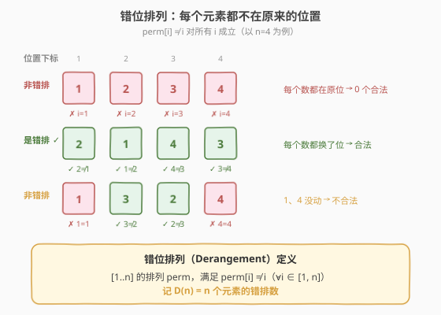
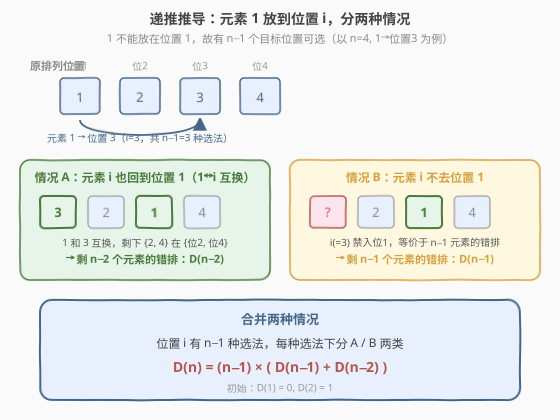
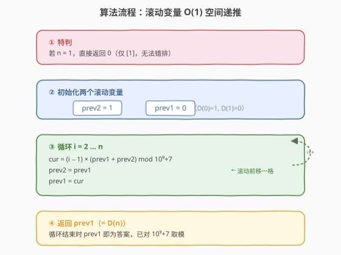
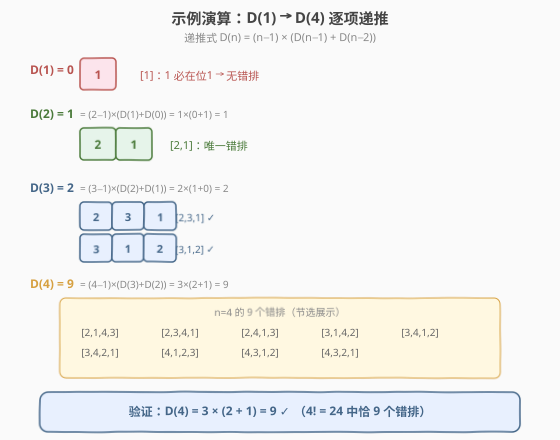

# 寻找数组的错位排列

- **题目名称**：寻找数组的错位排列
- **链接**：[634. 寻找数组的错位排列](https://leetcode.cn/problems/find-the-derangement-of-an-array/)
- **难度**：中等
- **标签**：动态规划、数学、组合计数

## 1. 题目概述

给定一个整数 `n`，求 `[1, 2, ..., n]` 的**错位排列**（derangement）个数。错位排列是指排列中**没有任何一个元素出现在它的原始位置**上，即对排列 `p` 满足 `p[i] != i`（对所有 `1 <= i <= n`）。由于结果可能很大，返回对 $10^9 + 7$ 取模的值。

**示例 1**：

```text
输入：n = 3
输出：2
解释：[1,2,3] 的错排有两个：[2,3,1] 和 [3,1,2]。
      [1,3,2] 不是错排，因为 1 仍在位 1；[3,2,1] 也不是，因为 2 仍在位 2。
```

**示例 2**：

```text
输入：n = 2
输出：1
解释：[1,2] 的唯一错排是 [2,1]。
```

**示例 3**：

```text
输入：n = 1
输出：0
解释：[1] 只有一种排列，且 1 必在位 1，无法错排。
```

**约束条件**：

- `1 <= n <= 10^6`



> 💡 本题是**计数 DP**的经典题——错排数 $D(n)$ 有优美的二阶递推 $D(n) = (n-1) \times (D(n-1) + D(n-2))$，只需两个滚动变量即可 $O(n)$ 时间、$O(1)$ 空间完成。它和 [629. K个逆序对数组](./629_K个逆序对数组.md) 同属「排列计数 DP」家族，但 629 需要二维状态 + 滑动窗口优化，本题只需一维递推，结构更简洁，适合作为 629 的前置入门。

---

## 2. 解题思路

### 2.1 暴力思路：枚举所有排列

枚举 $[1..n]$ 的全部 $n!$ 个排列，逐个检查是否满足 `p[i] != i`（∀i），统计满足条件的个数。

```text
count = 0
for each permutation p of [1..n]:
    if all(p[i] != i for i in 1..n):
        count += 1
return count % MOD
```

$n = 10^6$ 时 $n!$ 是天文数字，**完全不可行**。即便 $n = 20$，$20! \approx 2.4 \times 10^{18}$ 也已爆表。

> ⚠️ 暴力法的浪费在于没有利用「排列之间的递推结构」——$n$ 个元素的错排数可由 $n-1$ 和 $n-2$ 个元素的错排数直接推出，无需逐个枚举排列。

### 2.2 核心观察：错排递推公式

**状态定义**：$D(n)$ = $[1..n]$ 的错位排列个数。

**关键转化**：考虑元素 $1$ 的去向。$1$ 不能留在位置 $1$，所以它只能放到位置 $2, 3, \dots, n$ 中的某一个——共 $n - 1$ 种选择。设 $1$ 放到了位置 $i$（$i \in [2, n]$），此时分两种情况：



**情况 A**：元素 $i$ **恰好回到位置 1**（即 $1$ 与 $i$ 互换位置）。

此时位置 $1$ 和位置 $i$ 都已确定，剩下 $n - 2$ 个元素需要安排在剩下的 $n - 2$ 个位置上，且每个元素都不能在自己的原位——这恰是 $n - 2$ 个元素的错排，有 $D(n-2)$ 种。

**情况 B**：元素 $i$ **不放到位置 1**。

此时位置 $i$ 已被 $1$ 占据。剩下的 $n - 1$ 个元素（包括 $i$）要安排在剩下的 $n - 1$ 个位置（包括位置 $1$）上。关键观察：**元素 $i$ 现在不能去位置 $1$**（情况 B 的前提），而其余元素 $j$（$j \neq 1, i$）本来就不能去位置 $j$。于是这 $n - 1$ 个元素各自有一个「禁入位置」，等价于 $n - 1$ 个元素的错排，有 $D(n-1)$ 种。

> 💡 **情况 B 的等价视角**：把位置 $1$ 想象成元素 $i$ 的「新原位」——因为情况 B 要求 $i$ 不能去位置 $1$，就像原本 $i$ 不能去位置 $i$ 一样。于是剩下的 $n-1$ 个元素 + $n-1$ 个位置（位置 $1$ 替换了位置 $i$）构成一个标准的 $n-1$ 元素错排问题。

**合并**：位置 $i$ 有 $n-1$ 种选法，每种选法下分 A/B 两类，故：

$$\boxed{D(n) = (n - 1) \times \big( D(n-1) + D(n-2) \big)}$$

**初始条件**：

- $D(1) = 0$：`[1]` 只有一种排列，1 必在位 1，无错排。
- $D(0) = 1$：空排列视为唯一的「平凡错排」（这是为了让 $D(2) = 1 \times (0 + 1) = 1$ 成立而约定的）。
- $D(2) = 1$：`[2, 1]` 是唯一错排。

> ⚠️ **$D(0) = 1$ 的约定**：这看似反直觉（空集怎么会有错排？），但它是组合数学中的标准约定，保证递推在 $n = 2$ 时自洽。可以理解为「空排列天然满足所有元素都不在原位（因为没有元素）」，空真命题为真。

### 2.3 算法流程图



**完整步骤**：

1. **特判**：若 `n == 1`，直接返回 `0`。
2. **初始化**：`prev2 = 1`（$D(0)$），`prev1 = 0`（$D(1)$）。
3. **循环** `i` **从 2 到** `n`：
   - `cur = (i - 1) * (prev1 + prev2) % MOD`
   - `prev2 = prev1`
   - `prev1 = cur`（滚动前移一格）
4. **返回** `prev1`（循环结束时即为 $D(n)$）。

> 💡 **为什么只需两个变量？** $D(n)$ 只依赖 $D(n-1)$ 和 $D(n-2)$ 两个前驱，用 `prev1` 和 `prev2` 滚动即可，无需数组。这是**滚动数组**的极致——退化到 $O(1)$ 空间，与 [509. 斐波那契数](../0501-0600/509_斐波那契数.md) 的滚动优化同构。

### 2.4 示例演算

以 $n = 4$ 为例，逐项递推 $D$ 值：



| $n$ | 递推计算 | $D(n)$ | 说明 |
|-----|---------|--------|------|
| 0 | （约定） | 1 | 空排列的平凡错排 |
| 1 | （基例） | 0 | `[1]` 无法错排 |
| 2 | $1 \times (0 + 1)$ | 1 | `[2,1]` |
| 3 | $2 \times (1 + 0)$ | 2 | `[2,3,1]`、`[3,1,2]` |
| 4 | $3 \times (2 + 1)$ | 9 | $4! = 24$ 中恰 9 个错排 |

**递推过程详解**（$n = 4$，依赖 $D(3) = 2$、$D(2) = 1$）：

- `cur = (4 - 1) * (D(3) + D(2)) = 3 * (2 + 1) = 9`
- 滚动：`prev2 = D(3) = 2`，`prev1 = 9`
- 循环结束，返回 `prev1 = 9`

验证：$[1..4]$ 共 $4! = 24$ 个排列，其中 $9$ 个是错排（即每个元素都换位），占比 $\approx 37.5\%$，接近渐近值 $1/e \approx 36.8\%$。

> 💡 **渐近行为**：由容斥原理可知 $D(n) = n! \sum_{k=0}^{n} \frac{(-1)^k}{k!}$，当 $n \to \infty$ 时 $D(n) / n! \to 1/e \approx 0.3679$。这意味着**大规模排列中约有 36.8% 是错排**——一个优美的数论常数。

---

## 3. 参考代码

### C++

```cpp
// 寻找数组的错位排列.cpp —— 错排递推 O(n) O(1)
// 编译: g++ -O2 -std=c++17 寻找数组的错位排列.cpp -o derange
class Solution {
  public:
    int findDerangement(int n) {
        const long long MOD = 1e9 + 7;
        if (n == 1) return 0;          // D(1) = 0
        long long prev2 = 1;            // D(0) = 1（约定）
        long long prev1 = 0;            // D(1) = 0
        for (int i = 2; i <= n; ++i) {
            long long cur = ((long long)(i - 1) * (prev1 + prev2)) % MOD;
            prev2 = prev1;
            prev1 = cur;
        }
        return (int)prev1;
    }
};
```

### Python

```python
class Solution:
    def findDerangement(self, n: int) -> int:
        MOD = 10**9 + 7
        if n == 1:
            return 0                   # D(1) = 0
        prev2, prev1 = 1, 0            # D(0)=1, D(1)=0
        for i in range(2, n + 1):
            cur = (i - 1) * (prev1 + prev2) % MOD
            prev2, prev1 = prev1, cur
        return prev1
```

> ⚠️ **两个易错点**：
> 1. **溢出**：C++ 中 `(i - 1) * (prev1 + prev2)` 在 $n = 10^6$ 时，`prev1 + prev2` 可达 $2 \times 10^9$，乘以 $i - 1 \approx 10^6$ 后约 $2 \times 10^{15}$，超 32 位 `int` 但在 `long long` 范围内。因此必须用 `long long` 做中间运算，最后再转 `int` 返回。Python 无此问题。
> 2. **$n = 1$ 特判**：若不特判，循环不执行，直接返回 `prev1 = 0`——恰好正确！但显式特判更清晰，也避免对 $D(0) = 1$ 这一约定的隐式依赖引发疑惑。实际上 $n = 1$ 不特判也能 AC，这里写出是为了可读性。

> 💡 **Python 的 `%` 天然处理负数**：本题递推只做加法和乘法，不涉及减法，故无负数取模问题。若使用第 5 节的替代公式 $D(n) = n \cdot D(n-1) + (-1)^n$，则需注意 $(-1)^n$ 的符号——但用 `(n & 1)` 判断奇偶即可，不引入负数。

---

## 4. 复杂度分析

| 维度 | 复杂度 | 说明 |
|------|--------|------|
| **时间复杂度** | $O(n)$ | 单层循环 $n - 1$ 次，每次 $O(1)$ 乘加取模 |
| **空间复杂度** | $O(1)$ | 仅用 `prev2`、`prev1`、`cur` 三个变量滚动 |
| **最优时间** | $O(n)$ | 递推已是 $O(n)$，无法低于线性（至少要读入 $n$） |

> 💡 **能否 $O(\log n)$？** 错排数没有类似快速幂的 $O(\log n)$ 递推结构（递推系数 $(n-1)$ 随 $n$ 变化，不是常数），故 $O(n)$ 已是最优。不过若只需 $D(n) \bmod p$ 且 $n$ 极大，可用容斥公式 $D(n) = n! \sum_{k=0}^{n} \frac{(-1)^k}{k!} \bmod p$ 配合阶乘预处理，但仍为 $O(n)$。

---

## 5. 扩展：容斥原理与替代递推

### 5.1 容斥原理直接计数

错排数有一个闭式公式（容斥原理）：

$$D(n) = n! \sum_{k=0}^{n} \frac{(-1)^k}{k!} = n! \left( \frac{1}{0!} - \frac{1}{1!} + \frac{1}{2!} - \frac{1}{3!} + \cdots + \frac{(-1)^n}{n!} \right)$$

**直觉**：从全部 $n!$ 个排列出发，减去「至少 1 个元素在原位」的排列数（$\binom{n}{1}(n-1)!$），加回「至少 2 个元素在原位」的排列数（$\binom{n}{2}(n-2)!$），依此容斥。化简后 $\binom{n}{k}(n-k)! = \frac{n!}{k!}$，得到上式。

> 💡 这也解释了渐近极限 $D(n)/n! \to \sum_{k=0}^{\infty} \frac{(-1)^k}{k!} = e^{-1} = 1/e$。

### 5.2 替代递推：$D(n) = n \cdot D(n-1) + (-1)^n$

从容斥公式可推出另一个一阶递推：

$$D(n) = n \cdot D(n-1) + (-1)^n$$

验证：

- $D(2) = 2 \times 0 + (-1)^2 = 1$ ✓
- $D(3) = 3 \times 1 + (-1)^3 = 2$ ✓
- $D(4) = 4 \times 2 + (-1)^4 = 9$ ✓

```python
class Solution:
    def findDerangement(self, n: int) -> int:
        MOD = 10**9 + 7
        if n == 1:
            return 0
        prev = 0                       # D(1) = 0
        for i in range(2, n + 1):
            sign = -1 if (i & 1) else 1   # (-1)^i
            cur = (i * prev + sign) % MOD
            prev = cur
        return prev
```

| 解法 | 时间 | 空间 | 说明 |
|------|------|------|------|
| **二阶递推** $D(n)=(n-1)(D(n{-}1)+D(n{-}2))$ | $O(n)$ | $O(1)$ | **推荐**，思路直观、组合意义清晰 |
| 一阶递推 $D(n)=n \cdot D(n{-}1)+(-1)^n$ | $O(n)$ | $O(1)$ | 只需一个前驱，但 $(-1)^n$ 的来源需容斥解释 |
| 容斥公式 $n! \sum (-1)^k/k!$ | $O(n)$ | $O(1)$ | 适合解释渐近行为，编程不如递推简洁 |

> 💡 **面试建议**：先讲二阶递推 $D(n) = (n-1)(D(n-1) + D(n-2))$，配合「元素 1 放到位置 i，分交换/不交换两类」的组合论证，路径自然且容易写对。若面试官追问渐近行为或数论背景，再抛出容斥公式 $D(n)/n! \to 1/e$ 作为升华。

---

## 6. 面试要点

1. **递推公式 $D(n) = (n-1)(D(n-1) + D(n-2))$ 的组合含义是什么？**

   > 考虑元素 $1$ 的去向：它不能留在位置 $1$，故有 $n-1$ 个目标位置可选。设 $1$ 去位置 $i$。若 $i$ 回到位置 $1$（互换），则剩 $n-2$ 个元素错排，贡献 $D(n-2)$；若 $i$ 不去位置 $1$，则把位置 $1$ 视作 $i$ 的「新禁位」，剩 $n-1$ 个元素错排，贡献 $D(n-1)$。合计 $(n-1)(D(n-1) + D(n-2))$。

2. **为什么 $D(0) = 1$？**

   > 这是组合数学的标准约定，保证递推在 $n = 2$ 时自洽：$D(2) = 1 \times (D(1) + D(0)) = 1 \times (0 + 1) = 1$。可理解为「空排列天然满足所有元素都不在原位（没有元素），空真命题为真」。这与 [96. 不同的二叉搜索树](../0001-0100/96_不同的二叉搜索树.md) 中 $C(0) = 1$（空树视为一种 BST）的约定同源。

3. **$n = 1$ 为什么返回 0？不特判会怎样？**

   > $n = 1$ 时只有排列 `[1]`，1 必在位 1，无错排，故 $D(1) = 0$。不特判时循环不执行（`range(2, 2)` 为空），直接返回 `prev1 = 0`——恰好正确。但显式特判让 $D(0) = 1$ 的约定不暴露在主流程中，可读性更好。

4. **C++ 中为什么会溢出？如何处理？**

   > $n = 10^6$ 时，`prev1 + prev2` 可达 $2 \times 10^9$（取模前可能更大），乘以 $i - 1 \approx 10^6$ 后约 $2 \times 10^{15}$，超 32 位 `int`（$\approx 2.1 \times 10^9$）但在 `long long`（$\approx 9.2 \times 10^{18}$）范围内。故中间变量须声明为 `long long`，取模后再赋值。Python 整数无上限无需关心。

5. **错排数的渐近行为是什么？**

   > $D(n) / n! \to 1/e \approx 0.3679$（$e$ 为自然常数）。这意味着大规模排列中约 36.8% 是错排。由容斥公式 $D(n) = n! \sum_{k=0}^{n} \frac{(-1)^k}{k!}$ 直接看出，当 $n \to \infty$ 时求和部分趋近 $e^{-1}$。

> 💡 **一句话总结**：错排数 $D(n) = (n-1)(D(n-1) + D(n-2))$，组合含义是「元素 1 去位置 i 后，i 回不回位置 1 决定剩 n-2 还是 n-1 个元素继续错排」。两个滚动变量 $O(n)$ 时间 $O(1)$ 空间搞定，是计数 DP 中最优雅的一阶家族成员。

---

## 7. 同类练习题

- [629. K个逆序对数组](https://leetcode.cn/problems/k-inverse-pairs-array/)（[题解](./629_K个逆序对数组.md)）：同属「排列计数 DP」家族，二维状态 + 滑动窗口优化，本题是其前置入门
- [96. 不同的二叉搜索树](https://leetcode.cn/problems/unique-binary-search-trees/)（[题解](../0001-0100/96_不同的二叉搜索树.md)）：卡塔兰数计数 DP，同为「按规模递推 + 累加转移」范式，对照 $D(0)=1$ 与 $C(0)=1$ 的空集约定
- [509. 斐波那契数](https://leetcode.cn/problems/fibonacci-number/)（[题解](../0501-0600/509_斐波那契数.md)）：最经典的一阶递推 + 滚动变量，与本题 $O(1)$ 空间优化同构
- [70. 爬楼梯](https://leetcode.cn/problems/climbing-stairs/)（[题解](../0001-0100/70_爬楼梯.md)）：斐波那契变体，$f(n) = f(n-1) + f(n-2)$，对照本题递推系数 $(n-1)$ 的非常数差异
- [31. 下一个排列](https://leetcode.cn/problems/next-permutation/)：排列枚举家族，提供「排列」的基础操作视角，与计数类排列题互补
