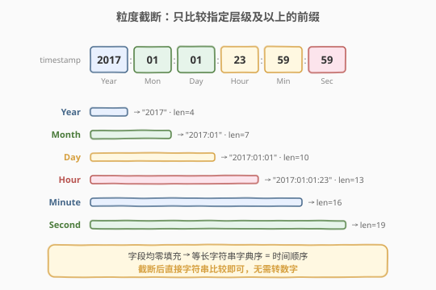
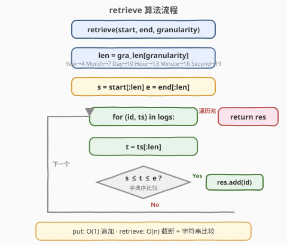
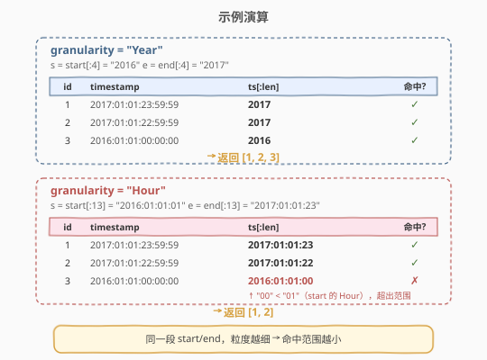

# LeetCode 设计日志存储系统 题解

## 1. 题目概述

- **标题 / 题号**：设计日志存储系统（#635，medium）
- **链接**：https://leetcode.cn/problems/design-log-storage-system/
- **难度**：中等
- **标签**：设计、哈希表、字符串

**题意**：设计一个日志存储系统，每条日志包含一个唯一 `id` 和一个时间戳 `timestamp`。时间戳格式固定为 `Year:Month:Day:Hour:Minute:Second`，例如 `"2017:01:01:23:59:59"`，**所有字段均为零填充的十进制数**。

需实现以下接口：

- `LogSystem()`：初始化日志系统。
- `void put(int id, string timestamp)`：将日志 `(id, timestamp)` 存入系统。
- `List<Integer> retrieve(string start, string end, string granularity)`：返回时间戳落在**闭区间** `[start, end]` 内的日志 id 列表。比较时只考虑 `granularity` 指定层级**及以上**的字段，**忽略更低层级的字段**。

`granularity` 可取 `"Year"`、`"Month"`、`"Day"`、`"Hour"`、`"Minute"`、`"Second"` 之一。例如 `granularity = "Day"` 时，只比较 Year、Month、Day 三个字段，忽略 Hour、Minute、Second。

**示例 1**：

```text
输入：
["LogSystem", "put", "put", "put", "retrieve", "retrieve"]
[[], [1, "2017:01:01:23:59:59"], [2, "2017:01:01:22:59:59"], [3, "2016:01:01:00:00:00"],
 ["2016:01:01:01:01:01","2017:01:01:23:00:00","Year"],
 ["2016:01:01:01:01:01","2017:01:01:23:00:00","Hour"]]
输出：[null, null, null, null, [1, 2, 3], [1, 2]]

解释：
put(1, "2017:01:01:23:59:59")   // 存入日志 1
put(2, "2017:01:01:22:59:59")   // 存入日志 2
put(3, "2016:01:01:00:00:00")   // 存入日志 3
retrieve("2016:01:01:01:01:01","2017:01:01:23:00:00","Year")  → [1,2,3]
retrieve("2016:01:01:01:01:01","2017:01:01:23:00:00","Hour")  → [1,2]
```

> 💡 同样的 `start`/`end`，`"Year"` 粒度命中全部 3 条（2016、2017 都在 `[2016, 2017]` 内），而 `"Hour"` 粒度只剩 2 条——日志 3 的 Hour 为 `00`，小于 `start` 的 Hour `01`，被排除。

**约束**：

- `1 <= id <= 500`
- `2000 <= Year <= 2017`
- 所有时间戳均为合法格式，各字段取值有效
- `put` 和 `retrieve` 的总调用次数不超过 `300`

## 2. 解题思路

### 2.1 暴力思路

最直观的方案：用一个列表存所有 `(id, timestamp)`。`retrieve` 时逐条检查日志的时间戳是否落在 `[start, end]` 区间内。

难点在于「比较时忽略低于 `granularity` 的字段」。一种朴素做法是：把时间戳按 `:` 切分成 6 个整数域 `(year, month, day, hour, minute, second)`，再按 `granularity` 决定比较到第几个域，逐域数值比较。这能工作，但切分、转整数、逐域比较的代码冗长且易错。

> ⚠️ 问题的关键不是「怎么比较时间」，而是「怎么优雅地处理粒度」。如果能避免逐域拆分与数值转换，代码会简洁很多。

### 2.2 核心观察：粒度截断 + 字典序比较



关键洞察有两层：

**第一层：粒度 = 前缀长度**

时间戳格式固定为 `YYYY:MM:DD:HH:MM:SS`，每个域的字符数固定（Year 4 位，其余各 2 位），冒号位置也固定。因此每种粒度对应一个确定的前缀长度：

| 粒度 | 前缀长度 | 截断后示例 |
|------|----------|------------|
| `Year` | 4 | `"2017"` |
| `Month` | 7 | `"2017:01"` |
| `Day` | 10 | `"2017:01:01"` |
| `Hour` | 13 | `"2017:01:01:23"` |
| `Minute` | 16 | `"2017:01:01:23:59"` |
| `Second` | 19 | `"2017:01:01:23:59:59"` |

> 💡 规律：Year 占 4 字符，之后每升一级多 3 字符（2 位数字 + 1 个冒号）。所以 `len = 4 + 3 × 层级偏移`，或直接用哈希表存这 6 个映射。

**第二层：零填充 → 等长字符串字典序 = 数值序**

所有域都是**零填充**的（如 1 月写成 `01` 而非 `1`），这意味着截断后的前缀字符串**长度相同**。对于等长字符串，**字典序比较与数值比较结果完全一致**：`"2016" < "2017"`，`"00" < "01"`，`"2016:01:01:00" < "2016:01:01:01"`。

因此，**把 `start`、`end`、每条日志的 `timestamp` 都截断到 `len` 长度后，直接用字符串的 `<=` 比较即可**——无需拆分、无需转整数、无需逐域比较。

> ⚠️ 零填充是这套方法成立的前提。如果月份写成 `"1"` 而非 `"01"`，字符串 `"2017:1"` 与 `"2017:01"` 长度不同，字典序就会失真（`"2017:1" > "2017:01"` 因为 `'1' > '0'`）。本题保证零填充，所以安全。

### 2.3 算法流程



```
put(id, timestamp):
    logs.append((id, timestamp))           // 直接追加，O(1)

retrieve(start, end, granularity):
    len = gra_len[granularity]             // 查前缀长度
    s = start.substr(0, len)               // 截断 start
    e = end.substr(0, len)                 // 截断 end
    res = []
    for (id, ts) in logs:
        t = ts.substr(0, len)              // 截断日志时间戳
        if s <= t and t <= e:              // 字典序比较（= 数值序）
            res.append(id)
    return res
```

**关键不变量**：

- 截断是对 `start`、`end`、**每条日志**三者统一执行，保证三者长度一致、比较语义正确。
- 比较是**闭区间** `s <= t <= e`（题目要求 `[start, end]` 含端点）。
- `put` 不维护任何顺序，`retrieve` 线性扫描全部日志。

### 2.4 示例演算



以示例 1 为例，存入 3 条日志后，执行两次 `retrieve`：

**第一次：`granularity = "Year"`（len=4）**

- `s = "2016"`，`e = "2017"`
- 日志 1：`"2017:01:01:23:59:59"[:4]` = `"2017"` → `"2016" ≤ "2017" ≤ "2017"` ✓
- 日志 2：`"2017"` → ✓
- 日志 3：`"2016"` → `"2016" ≤ "2016" ≤ "2017"` ✓
- 返回 `[1, 2, 3]`

**第二次：`granularity = "Hour"`（len=13）**

- `s = "2016:01:01:01"`，`e = "2017:01:01:23"`
- 日志 1：`"2017:01:01:23"` → `"2016:01:01:01" ≤ "2017:01:01:23" ≤ "2017:01:01:23"` ✓
- 日志 2：`"2017:01:01:22"` → `"2016:01:01:01" ≤ "2017:01:01:22" ≤ "2017:01:01:23"` ✓
- 日志 3：`"2016:01:01:00"` → `"2016:01:01:00" < "2016:01:01:01"`（Hour `00` < `01`）✗
- 返回 `[1, 2]`

> 💡 日志 3 在 Year 粒度下命中（2016 ∈ [2016, 2017]），但在 Hour 粒度下被排除——截断到 Hour 后 `"2016:01:01:00"` 比区间左端 `"2016:01:01:01"` 小。这正是「粒度越细，忽略的字段越少，约束越紧」的体现。

## 3. 参考代码

### C++

```cpp
class LogSystem {
    unordered_map<string, int> gra_len = {
        {"Year", 4}, {"Month", 7}, {"Day", 10},
        {"Hour", 13}, {"Minute", 16}, {"Second", 19}
    };
    vector<pair<int, string>> logs;   // (id, timestamp)

public:
    LogSystem() {}

    void put(int id, string timestamp) {
        logs.emplace_back(id, timestamp);
    }

    vector<int> retrieve(string start, string end, string granularity) {
        int len = gra_len[granularity];
        string s = start.substr(0, len);
        string e = end.substr(0, len);
        vector<int> res;
        for (auto& [id, ts] : logs) {
            string t = ts.substr(0, len);
            if (t >= s && t <= e)
                res.push_back(id);
        }
        return res;
    }
};
```

### Python

```python
class LogSystem:
    def __init__(self):
        self.gra_len = {"Year": 4, "Month": 7, "Day": 10,
                        "Hour": 13, "Minute": 16, "Second": 19}
        self.logs = []                  # list of (id, timestamp)

    def put(self, id: int, timestamp: str) -> None:
        self.logs.append((id, timestamp))

    def retrieve(self, start: str, end: str, granularity: str) -> List[int]:
        length = self.gra_len[granularity]
        s = start[:length]
        e = end[:length]
        return [id for id, ts in self.logs
                if s <= ts[:length] <= e]
```

> 💡 代码极其简洁的核心在于：把「粒度」问题转化为「前缀长度」问题，再利用零填充保证字符串比较的正确性——全程不拆分、不转整数、不逐域比较。`gra_len` 这张 6 项映射表是整个设计的「杠杆点」。

## 4. 复杂度分析

| 维度 | 复杂度 | 说明 |
|------|--------|------|
| `put` 时间 | $O(1)$ | 列表尾部追加 |
| `retrieve` 时间 | $O(n \cdot L)$ | 遍历全部 $n$ 条日志，每条截断 $O(L)$ + 字典序比较 $O(L)$，$L$ 为前缀长度（$\leq 19$，常数级），实际为 $O(n)$ |
| 空间 | $O(n)$ | 存储所有 `(id, timestamp)` |

其中 $n \leq 300$，单次 `retrieve` 最多约 $300 \times 19 \approx 5700$ 次字符操作，完全在时限内。

> ⚠️ 若调用次数与日志量显著增大（如 $n = 10^5$），$O(n)$ 的线性扫描会成为瓶颈，需改用第 5 节的有序存储 + 二分方案。

## 5. 扩展：有序存储 + 二分加速

当 `retrieve` 频繁而 `put` 相对较少时，线性扫描 $O(n)$ 可优化为 $O(\log n + k)$（$k$ 为命中数）。

**核心观察：截断是单调的**

如果两个完整时间戳 $A \leq B$（字典序），那么截断后 $\text{trunc}(A) \leq \text{trunc}(B)$ 仍然成立——因为截断只取前缀，前缀的相对顺序与完整字符串一致。因此，**若日志按完整时间戳排序，则任意粒度下的截断值也天然有序**，可直接二分。

**方案**：

- `put` 时将 `(timestamp, id)` 插入一个按 `timestamp` 排序的结构（如 C++ `set<pair<string,int>>`，或维护有序数组）。
- `retrieve` 时，构造虚拟下界 `lo = start[:len]` 补全到 19 位（低位填 `":00"` 使其成为完整时间戳），在有序结构上 `lower_bound(lo)` 定位起点；同理用 `end[:len]` 补全为上界，`upper_bound` 定位终点；遍历 `[lo, hi)` 区间收集 id 并逐条验证截断值是否仍在 `[s, e]` 内（避免补全带来的边界误差）。

> ⚠️ 补全低位时需注意：`end` 的截断值补全应填**最大值**（如 `"59"`）以保证 `upper_bound` 包含同前缀的所有日志；`start` 补全填**最小值**（`"00"`）。这比直接对截断字符串二分更稳健，因为有序结构是按完整时间戳排序的。

| 方案 | `put` | `retrieve` | 适用场景 |
|------|-------|------------|----------|
| 线性扫描（本文） | $O(1)$ | $O(n)$ | 日志量小（$n \leq 300$），实现极简 |
| 有序存储 + 二分 | $O(\log n)$ | $O(\log n + k)$ | 日志量大、`retrieve` 高频 |

> 💡 本题 $n \leq 300$，线性扫描完全足够。二分方案的价值在于「当数据规模放大时，同一个截断 + 字典序的核心思路仍然成立，只需把线性扫描换成二分」——思路的延展性比单题的常数优化更重要。

## 6. 面试要点

1. **为什么截断后可以直接用字符串比较？**

   - 时间戳格式固定且所有域**零填充**（`01` 而非 `1`），截断后的前缀字符串**等长**。等长字符串的字典序与数值序一致，因此 `<=` 直接等价于时间先后比较，无需拆分转整数。

2. **`granularity` 到前缀长度的映射规律是什么？**

   - Year 占 4 字符（`"2017"`），之后每升一级多 3 字符（2 位数字 + 1 个冒号）：Month=7、Day=10、Hour=13、Minute=16、Second=19。用一个 6 项的哈希表存映射即可，清晰且不易错。

3. **如果时间戳不保证零填充怎么办？**

   - 字典序会失真（`"2017:1" > "2017:01"` 因为 `'1' > '0'`）。此时需改用逐域数值比较：按 `:` 切分，转整数，按粒度逐域比较。本题保证零填充，所以前缀截断法是最优解。

4. **截断是对哪些字符串做的？为什么三者都要截断？**

   - 对 `start`、`end`、**每条日志的 `timestamp`** 三者统一截断到 `len`。三者等长才能保证字典序比较的语义正确——若只截断 `start`/`end` 而不截断日志，则比较的是不等长字符串，字典序可能失真。

5. **如何把 `retrieve` 从 $O(n)$ 优化到 $O(\log n + k)$？**

   - 日志按完整时间戳排序后，截断的单调性保证任意粒度的截断值也有序。用 `lower_bound`/`upper_bound` 二分定位区间起点终点，再收集区间内 id。详见第 5 节。

## 同类练习题

| # | 题目 | 与本题的关联 |
|---|------|-------------|
| 981 | [基于时间的键值存储](https://leetcode.cn/problems/time-based-key-value-store/)（[题解](../0901-1000/981_基于时间的键值存储.md)） | 同为「时间戳 + 设计」题，利用时间戳严格递增的有序性做二分——对照本题的「零填充有序性做字典序比较」，体会不同有序性的用法 |
| 631 | [设计 Excel 求和公式](https://leetcode.cn/problems/design-excel-sum-formula/)（[题解](./631_设计Excel求和公式.md)） | 同为 600+ 设计题，对照懒求值 + 记忆化 vs 本题的截断 + 字典序，体会设计题的多样性 |
| 208 | [实现 Trie](https://leetcode.cn/problems/implement-trie-prefix-tree/)（[题解](../0201-0300/208_实现Trie.md)） | 前缀匹配的经典设计题——本题也用了「前缀」思想（前缀长度截断），对照 Trie 的前缀树形匹配 |
| 1146 | [快照数组](https://leetcode.cn/problems/snapshot-array/) | 版本化检索的设计题，按 `snap_id` 二分取版本——与本题扩展方案的「按时间戳二分取区间」思路同构 |
