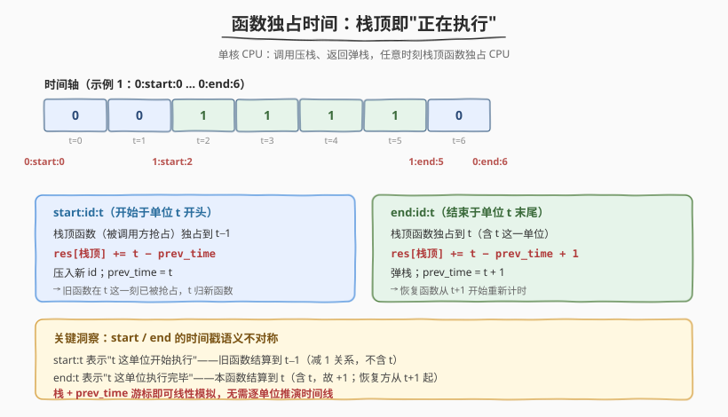
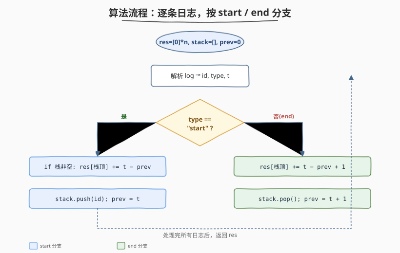

# 函数的独占时间

- **题目名称**：函数的独占时间
- **链接**：[636. 函数的独占时间](https://leetcode.cn/problems/exclusive-time-of-functions/)
- **难度**：中等
- **标签**：栈、数组、模拟

## 1. 题目概述

在一个**单核 CPU**上运行 `n` 个函数（编号 `0` 到 `n-1`）。CPU 同一时刻只能执行一个函数。函数可以调用其他函数（甚至递归调用自己），调用时当前函数被**暂停**，被调函数执行完毕后再**恢复**。

给定按时间戳升序排列的日志列表 `logs`，每条日志形如 `"function_id:start:timestamp"` 或 `"function_id:end:timestamp"`：

- `start:timestamp` 表示该函数在 `timestamp` 这一单位**开始**执行；
- `end:timestamp` 表示该函数在 `timestamp` 这一单位**末尾**结束执行（即 `timestamp` 这一单位也算它的执行时间）。

求每个函数的**独占时间**（exclusive time）——即它真正在 CPU 上执行的时间单位总数（被调用方抢占的暂停时间不算）。

**示例 1**：

```text
输入：n = 2, logs = ["0:start:0","1:start:2","1:end:5","0:end:6"]
输出：[3, 4]
解释：
函数 0 在时间 0 开始执行，到时间 2 被函数 1 调用暂停；
函数 1 在时间 2-5 执行（共 4 单位）后返回；
函数 0 恢复，在时间 6 执行（共 1 单位）后结束。
函数 0 独占时间 = 2 + 1 = 3，函数 1 独占时间 = 4。
```

**示例 2**：

```text
输入：n = 1, logs = ["0:start:0","0:start:2","0:end:5","0:start:6","0:end:6","0:end:10"]
输出：[12]
解释：函数 0 递归调用自身，全程只有它执行，独占时间 = 全部时间单位 = 12。
```

**约束条件**：

- `1 <= n <= 100`
- `1 <= logs.length <= 500`
- `0 <= function_id < n`
- `0 <= timestamp <= 10^9`
- 日志按时间戳非降序排列，同一时刻不会有两个 `start` 或两个 `end`。
- 任意时刻恰好有一个函数在执行（栈顶函数）。

> 💡 难点在于理解 `start` 与 `end` 时间戳的**不对称语义**，以及在嵌套/递归调用下如何正确归算每个函数的执行区间。用**栈**模拟调用链即可线性解决。

---

## 2. 解题思路

### 2.1 暴力思路

把时间线展开成 `[0, max_timestamp]` 的每个单位，逐单位记录"当前在执行哪个函数"，最后统计每个函数占了多少单位。时间 `O(T)`，`T` 为最大时间戳——但时间戳可达 $10^9$，**不可行**。

> ⚠️ 暴力法的问题：时间跨度极大但日志只有几百条，绝大多数时间单位都处于"同一个函数在跑"，没必要逐个计数。

### 2.2 核心观察：栈 + prev_time 游标



关键观察有三点：

1. **栈顶 = 当前正在执行的函数**。`start` 即压栈（调用方被暂停），`end` 即弹栈（被调方结束、调用方恢复）。这天然对应函数调用栈。
2. **无需逐单位推演**：相邻两条日志之间的整段时间，都归当时栈顶函数所有。只需用一个 `prev_time` 游标记录"上一次结算到的位置"。
3. **start / end 的时间戳语义不对称**——这是本题唯一的坑：
   - `start:t` 表示函数在 `t` 这一单位**开头**开始执行，因此被抢占的旧函数只执行到 `t−1`，结算区间为 `[prev_time, t-1]`，长度 $= t - \text{prev\_time}$（不含 $t$）。
   - `end:t` 表示函数在 `t` 这一单位**末尾**结束，因此 $t$ 这一单位也归它，结算区间为 `[prev_time, t]`，长度 $= t - \text{prev\_time} + 1$（含 $t$），而恢复的函数从 $t+1$ 起重新计时。

> 💡 把 `start` 看成"区间的左闭端点"，`end` 看成"区间的右闭端点"，就能统一理解：每次结算的是一段**闭区间**的长度，而 `prev_time` 始终指向"下一个待分配单位的起点"。

### 2.3 算法流程图



具体步骤：

1. 初始化 `res = [0] * n`、空栈 `stack`、`prev_time = 0`。
2. 逐条解析日志得到 `(id, type, t)`：
   - **若 `type == "start"`**：
     - 若栈非空，`res[stack.top()] += t - prev_time`（旧函数结算到 $t-1$）；
     - `stack.push(id)`；
     - `prev_time = t`（新函数从 $t$ 开始占用）。
   - **若 `type == "end"`**：
     - `res[stack.top()] += t - prev_time + 1`（本函数结算到 $t$，含 $t$）；
     - `stack.pop()`；
     - `prev_time = t + 1`（恢复的函数从 $t+1$ 起重新计时）。
3. 处理完所有日志后返回 `res`。

> ⚠️ 注意 `end` 分支里 `prev_time = t + 1` 而不是 `t`——因为 $t$ 这一单位已经被结束的函数"吃掉"了，下一个待分配的是 $t+1$。漏掉这个 `+1` 是最常见的错误。

### 2.4 示例演算

以示例 1 `logs = ["0:start:0","1:start:2","1:end:5","0:end:6"]` 为例：

![四条日志逐步推进，最终得到 [3, 4]](../images/exclusive_time_walkthrough.svg)

| 日志 | 栈顶结算 | 栈 | prev_time | res |
|------|----------|------|-----------|------|
| `0:start:0` | 栈空，无结算 | `[0]` | 0 | `[0, 0]` |
| `1:start:2` | `res[0] += 2-0 = 2` | `[0,1]` | 2 | `[2, 0]` |
| `1:end:5` | `res[1] += 5-2+1 = 4` | `[0]` | 6 | `[2, 4]` |
| `0:end:6` | `res[0] += 6-6+1 = 1` | `[]` | 7 | `[3, 4]` |

最终 `res = [3, 4]`，与示例一致。

> 💡 示例 2（递归调用）中，函数 0 会多次出现在栈中（如 `[..., 0, 0]`），但算法无需特殊处理——栈顶始终是当前执行的实例，弹栈后自动恢复到外层实例，结算逻辑完全相同。

---

## 3. 参考代码

### C++

```cpp
class Solution {
  public:
    vector<int> exclusiveTime(int n, vector<string>& logs) {
        vector<int> res(n, 0);
        stack<int> st;
        int prev_time = 0;
        for (const string& log : logs) {
            int id, t;
            char type[8];
            sscanf(log.c_str(), "%d:%7[^:]:%d", &id, type, &t);
            if (type[0] == 's') {
                if (!st.empty()) res[st.top()] += t - prev_time;
                st.push(id);
                prev_time = t;
            } else {
                res[st.top()] += t - prev_time + 1;
                st.pop();
                prev_time = t + 1;
            }
        }
        return res;
    }
};
```

### Python

```python
class Solution:
    def exclusiveTime(self, n: int, logs: List[str]) -> List[int]:
        res = [0] * n
        st = []
        prev_time = 0
        for log in logs:
            id_str, typ, t_str = log.split(':')
            fid, t = int(id_str), int(t_str)
            if typ == 'start':
                if st:
                    res[st[-1]] += t - prev_time
                st.append(fid)
                prev_time = t
            else:
                res[st.pop()] += t - prev_time + 1
                prev_time = t + 1
        return res
```

> 💡 代码极简：单趟遍历 + 一个栈 + 一个游标。核心就是两条分支各一行结算公式，差别只在 `start` 不含 $t$、`end` 含 $t$（故 `+1`）。

---

## 4. 复杂度分析

| 维度 | 复杂度 | 说明 |
|------|--------|------|
| 时间复杂度 | $O(L)$ | $L$ 为日志条数，逐条解析 + 常数操作 |
| 空间复杂度 | $O(n)$ | 栈最深 $n$（全部函数嵌套调用）；结果数组 $O(n)$ |

> 💡 与时间戳范围 $10^9$ 无关——这正是用栈 + 游标代替逐单位模拟的优势：只在实际发生事件的位置结算区间，跳过中间的连续执行段。

---

## 5. 扩展：日志解析与鲁棒性

题目保证日志格式规范且按时间戳有序，因此 `split(':')` 即可。若面试官追问"日志可能乱序"或"格式可能不规范"：

- **乱序**：按 `timestamp` 升序排序后再套用本算法（注意 `end` 与 `start` 同时间戳时按 `end` 在前处理，避免歧义）。
- **格式鲁棒**：用正则 `(\d+):(start|end):(\d+)` 校验并捕获，非法日志跳过或报错。
- **并发模型**：本题是单核协作式调用；若改为抢占式（可被任意打断），则需结合抢占点日志分段结算，模型更接近操作系统线程调度。

---

## 6. 面试要点

1. **为什么 start 结算不用 +1，而 end 要 +1？**

   - `start:t` 表示函数在 $t$ 单位的**开头**开始执行，$t$ 这一单位归新函数，旧函数只占 $[prev, t-1]$，长度 $t - prev$（不含 $t$）。
   - `end:t` 表示函数在 $t$ 单位的**末尾**结束，$t$ 这一单位归结束的函数，它占 $[prev, t]$，长度 $t - prev + 1$（含 $t$）。
   - 二者本质都是一段闭区间的长度，区别在于时间戳落在区间的哪一端。

2. **prev_time 在 end 之后为什么设成 t+1 而不是 t？**

   - `end:t` 已经把 $t$ 这一单位计给了结束的函数，下一个待分配的单位是 $t+1$。
   - 若设成 $t$，恢复的函数会把 $t$ 重复计一次，导致结果偏大。

3. **递归调用（函数调用自身）时栈里会出现重复 id，算法还成立吗？**

   - 成立。栈存的是"调用实例"而非"函数 id 的去重集合"，递归时栈会出现 `[..., 0, 0]`，栈顶仍是当前执行的实例。
   - 弹栈后自动恢复到外层实例，每个实例各自结算自己的执行段，最终 `res[0]` 是所有实例的累加——正是"独占时间"的定义。

4. **为什么不需要逐单位模拟时间线？**

   - 相邻两条日志之间没有任何事件发生，整段时间都归当时的栈顶函数。
   - 只需在每条日志处用"当前时间戳 − prev_time"一次性结算这段连续执行时间，跳过中间的所有单位。时间戳可达 $10^9$ 但日志只有几百条，这正是区间结算法的价值。

5. **如果同一时刻既有 start 又有 end，怎么处理？**

   - 题目保证同一时刻不会有两个 `start` 或两个 `end`，但 `start` 与 `end` 可能同时间戳（如 `A:end:5` 与 `B:start:5`）。
   - 本题日志已按时间戳有序给出，直接按给定顺序处理即可：`A:end:5` 先结算 $A$ 到 $5$（含），`prev=6`；`B:start:5` 后到，但 $t=5 < prev=6$ 会导致负数——这说明题目数据不会出现这种冲突。若需自定义排序，约定**同时间戳时 end 在 start 之前**处理最自然。

---

## 7. 同类练习题

- [232. 用栈实现队列](https://leetcode.cn/problems/implement-queue-using-stacks/)：双栈模拟，栈的基本运用
- [224. 基本计算器](https://leetcode.cn/problems/basic-calculator/)：用栈处理括号嵌套与一元符号，同样是"嵌套结构 + 栈"模式
- [739. 每日温度](https://leetcode.cn/problems/daily-temperatures/)：单调栈，用栈维护"待结算"的元素，结算时机思路相通
- [946. 验证栈序列](https://leetcode.cn/problems/validate-stack-sequences/)：栈模拟判定压栈/弹栈序列合法性，栈操作训练
