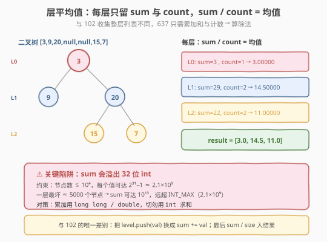
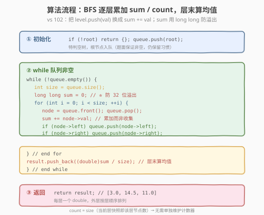
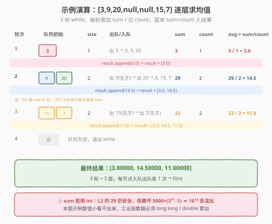

# 二叉树的层平均值

- **题目名称**：二叉树的层平均值
- **链接**：[637. 二叉树的层平均值](https://leetcode.cn/problems/average-of-levels-in-binary-tree/)
- **难度**：简单
- **标签**：树、二叉树、广度优先搜索（BFS）

## 1. 题目概述

给定一个非空二叉树的根节点 `root`，返回其节点值的**每一层的平均值**组成的数组。即对每一层，把该层所有节点值求和、再除以该层节点数，得到一个 `double`，按层自顶向下排列。答案与标准答案误差在 $10^{-5}$ 以内即视为正确。

**示例 1**：

```text
输入：root = [3,9,20,null,null,15,7]
          3
         / \
        9  20
          /  \
         15   7
输出：[3.00000,14.50000,11.00000]
解释：第 0 层均值 = 3 / 1 = 3；第 1 层 = (9 + 20) / 2 = 14.5；第 2 层 = (15 + 7) / 2 = 11。
```

**示例 2**：

```text
输入：root = [3,9,20,15,null,null,7]
          3
         / \
        9  20
       /     \
      15      7
输出：[3.00000,14.50000,11.00000]
```

**约束条件**：

- 树中节点数目在范围 `[1, 10^4]` 内
- $-2^{31} \le \text{Node.val} \le 2^{31} - 1$

> 💡 这是 [102. 二叉树的层序遍历](../0101-0200/102_二叉树的层序遍历.md) 的「聚合版」——102 把每层节点值**收集成列表**，637 只要每层的**均值**。既然只要均值，就不必存整层列表，每层只需累加一个 `sum`、数一个 `count`，层末做一次除法即可。唯一的坑是：`sum` 会**溢出 32 位 int**，这是 637 与 102 最关键的差别，也是面试高频追问点。

---

## 2. 解题思路

### 2.1 暴力思路：DFS 记录每层节点后求均值

用 DFS 递归遍历，传入当前层数 `depth`，把节点值存入 `values[depth]` 列表。遍历完后，对每一层列表求和除以长度：

```text
dfs(node, depth):
    if node == null: return
    values[depth].append(node.val)
    dfs(node.left, depth+1)
    dfs(node.right, depth+1)
// 遍历结束后
for level in values:
    result.append(sum(level) / len(level))
```

DFS 能得到正确结果，但有两个问题：① 需要额外维护 `depth` 参数；② 把整层节点值都存下来，**空间浪费**——算均值只要和与个数，根本不必保留每个值。更自然且省空间的方式是 **BFS 队列 + 逐层累加**。

> ⚠️ DFS 方案的空间是 `O(n)`（要存所有节点值），而 BFS 方案每层只留 `sum`/`count`，聚合结果只需 `O(L)`（`L` 为层数）。题目只要均值，存原始列表是多余开销。

### 2.2 核心观察：BFS + 逐层累积 sum / count

把 102 的层序模板拿过来：仍是 `while(队列非空) + for(size)` 骨架。区别在于 for 循环体里**不做 `level.push_back(node.val)`，改做 `sum += node.val`**。处理完一整层后，`size` 本身就是该层节点数（即 `count`），直接 `sum / size` 就是均值。



**两个要点**：

1. **`count = size`，无需单独维护计数器**。for 循环开始前 `size = queue.size()` 已锁定本层节点数，循环跑 `size` 次恰好处理一整层，所以 `count` 就是 `size`。
2. **`sum` 必须用 `long long`（C++）**，这是本题唯一的陷阱。约束给出节点数 $\le 10^4$、每个值可达 $2^{31}-1 \approx 2.1\times 10^9$。一层最坏约 $5000$ 个节点，`sum` 可达 $5000 \times 2.1\times 10^9 \approx 10^{13}$，远超 `INT_MAX`（$2.1\times 10^9$）。用 `int` 累加会**静默溢出**，得到错误均值且不报错——这是最危险的 bug。

> 💡 **为什么 102 没有溢出问题？** 因为 102 只是把每个 `node.val` 原样塞进 `vector<int>`，没有做加法聚合。任何「求和聚合」都要警惕累加溢出，这是从「存储」升级到「聚合」时必须同步升级的数据类型。

### 2.3 算法流程图



**完整步骤**：

1. **特判**：`root == null` 返回空列表（题面保证非空，保留习惯性特判）
2. **初始化**：队列 `queue = [root]`，结果 `result = []`
3. **while 队列非空**：
   - `size = queue.size()`（当前层节点数快照，同时充当 `count`）
   - `sum = 0`（用 `long long` / `double`）
   - `for i in 0..size`：
     - `node = queue.pop_front()`
     - `sum += node.val`
     - 子节点入队：`if node.left: queue.push_back(node.left)`；`if node.right: queue.push_back(node.right)`
   - `result.append((double)sum / size)`（层末算均值）
4. 返回 `result`

### 2.4 示例演算

以示例 1 的树 `[3,9,20,null,null,15,7]` 为例：



| 轮次 | 队列初始 | size | 出队 / 入队 | sum | count | avg = sum / count | result |
|------|---------|------|------------|-----|-------|-------------------|--------|
| 1 | [3] | 1 | 出 3 → 入 9, 20 | 3 | 1 | 3 / 1 = 3.0 | [3.0] |
| 2 | [9, 20] | 2 | 出 9(无子) → 出 20 → 入 15, 7 | 29 | 2 | 29 / 2 = 14.5 | [3.0, 14.5] |
| 3 | [15, 7] | 2 | 出 15(无子) → 出 7(无子) | 22 | 2 | 22 / 2 = 11.0 | [3.0, 14.5, 11.0] |
| 4 | [] | — | 队列空，结束 | — | — | — | — |

最终 `result = [3.00000, 14.50000, 11.00000]`。

> 💡 注意第 2 轮：队列 `[9, 20]`，`size=2`。出 9（无子）、出 20（入队 15、7）。for 循环只跑 `size=2` 次，所以 15 和 7 **不参与本轮 `sum`**——它们留到第 3 轮才累加。这正是 `size` 快照的「层边界锁定」作用，与 102 一脉相承。示例数值小看不出溢出，但工业级数据 `sum` 必须用宽类型。

---

## 3. 参考代码

### C++

```cpp
// 二叉树的层平均值.cpp —— BFS + 逐层累加 sum/count，sum 用 long long 防溢出
// 编译: g++ -O2 -std=c++17 二叉树的层平均值.cpp -o avglevels
#include <vector>
#include <queue>
using namespace std;

struct TreeNode {
    int val;
    TreeNode* left;
    TreeNode* right;
    TreeNode() : val(0), left(nullptr), right(nullptr) {
    }
    TreeNode(int x) : val(x), left(nullptr), right(nullptr) {
    }
    TreeNode(int x, TreeNode* l, TreeNode* r) : val(x), left(l), right(r) {
    }
};

class Solution {
  public:
    vector<double> averageOfLevels(TreeNode* root) {
        vector<double> result;
        if (root == nullptr)
            return result; // 特判空树

        queue<TreeNode*> q;
        q.push(root);

        while (!q.empty()) {
            int size = q.size();      // ① 当前层节点数快照（即 count）
            long long sum = 0;        // ② ⭐ 用 long long 防 32 位溢出
            for (int i = 0; i < size; ++i) { // ③ 恰好处理一整层
                TreeNode* node = q.front();
                q.pop();
                sum += node->val;     // ④ 累加而非收集
                if (node->left)
                    q.push(node->left);
                if (node->right)
                    q.push(node->right);
            }
            result.push_back((double)sum / size); // ⑤ 层末算均值
        }
        return result;
    }
};
```

### Python

```python
from collections import deque

class Solution:
    def averageOfLevels(self, root: TreeNode | None) -> list[float]:
        result = []
        if not root:
            return result

        queue = deque([root])          # deque 比 list 做 queue 更高效

        while queue:
            size = len(queue)          # 当前层节点数（即 count）
            total = 0                  # Python int 任意精度，无溢出
            for _ in range(size):      # 恰好处理一整层
                node = queue.popleft() # O(1) 出队
                total += node.val
                if node.left:
                    queue.append(node.left)
                if node.right:
                    queue.append(node.right)
            result.append(total / size)  # 真除法，直接得 float
        return result
```

> 💡 **语言差异**：C++ 的 `int` 是 32 位定宽，累加溢出会**静默回绕**，必须显式用 `long long`；Python 的 `int` 是**任意精度**，天然不溢出，`/` 还是真除法直接得 `float`，代码更简洁。面试时若用 C++，务必主动说出「`sum` 用 `long long` 防溢出」，这是加分项。

---

## 4. 复杂度分析

| 维度 | 复杂度 | 说明 |
|------|--------|------|
| **时间复杂度** | `O(n)` | 每个节点恰好入队 / 出队 1 次，累加 `O(1)`；层末一次除法 `O(1)` |
| **空间复杂度** | `O(n)` | 队列最多存一层节点（满二叉树末层 `n/2`）；结果列表存 `L` 个 double（`L` = 层数，`L ≤ n`） |

> ⚠️ **空间比 DFS 暴力更优**：DFS 暴力要存全部 `n` 个节点值（`O(n)` 额外空间），BFS 聚合版每层只留 `sum`/`count`，聚合结果仅 `O(L)`。但 BFS 队列本身仍是 `O(n)`（满二叉树末层 `n/2` 个节点同时在队），这是 BFS 的固有开销。若只看「输出以外」的辅助空间：DFS 存值 `O(n)` vs BFS 队列 `O(n)`，量级相同，但 BFS 不留中间值、语义更贴题。

---

## 5. 扩展：聚合型层序遍历与溢出对策

### 5.1 层序遍历家族的「聚合」分支

637 引出了层序家族的另一条支线——**不收集列表，只做聚合**。102/107/103 都是「收集每层全部值」，而聚合分支只要每层的一个统计量：

| 题目 | 聚合量 | 与 637 的关系 |
|------|--------|--------------|
| 637 层平均值 | 均值 = sum / count | 母题 |
| 515 每行最大值 | max | 把 `sum += val` 换成 `max = max(max, val)`，无溢出问题 |
| 257 二叉树的所有路径 | 路径字符串 | 回到「收集」分支，但按路径而非按层 |

> 💡 **聚合分支的统一改法**：for 循环体里把「收集」换成「更新统计量」。求和 → `sum += val`；求最大 → `max = max(max, val)`；求出现次数 → 频率表 `++freq[val]`。骨架不变，只换一行。

### 5.2 溢出对策的通用清单

「多个 int 求和」是经典溢出场景，637 只是一例。通用对策：

| 场景 | 对策 |
|------|------|
| `n` 个 `int` 求和（`n` 较大） | 累加器用 `long long`（C++）/ `int64`（Go）/ 任意精度（Python） |
| 求均值避免精度损失 | 先 `long long` 求和再转 `double` 除，**不要边加边除** |
| 乘积累加（如阶乘、组合数） | 取模运算（数论题常见），或用大整数 |
| 前缀和数组 | `prefix` 数组用 `long long`，防 `a[i]` 全正时前缀和溢出 |

> ⚠️ **静默溢出最危险**：C++ 有符号整数溢出是**未定义行为**，但绝大多数实现表现为「回绕」（wrap-around），程序不报错、返回一个看似合理的错误答案。本题若用 `int sum`，示例因数值小能过，但提交到大规模用例会 WA——本地测不出，只在judge 上炸。养成「聚合即升级类型」的肌肉记忆。

---

## 6. 面试要点

1. **637 和 102 的区别是什么？**

   - 102 收集每层**全部节点值**成子列表；637 只要每层**均值**一个数。
   - 改动极小：for 体里 `level.push_back(val)` → `sum += val`，层末 `sum / size` 入结果。骨架（`while + for(size)`）完全相同。

2. **`sum` 为什么要用 `long long`？最大能到多少？**

   - 约束：节点 $\le 10^4$，每个值可达 $2^{31}-1 \approx 2.1\times 10^9$。
   - 一层最坏约 $5000$ 个节点（满二叉树末层），`sum` 可达 $5000 \times 2.1\times 10^9 \approx 10^{13}$，远超 `INT_MAX`（$2.1\times 10^9$）。
   - 用 `int` 会静默回绕，得错误均值且不报错。`long long`（64 位，上限 $\approx 9.2\times 10^{18}$）绰绰有余。

3. **`count` 需要单独维护吗？**

   - 不需要。`size = queue.size()` 已经是当前层节点数，for 循环跑 `size` 次处理一整层，所以 `count = size`。这是 `size` 快照的「一石二鸟」：既锁层边界，又当计数器。

4. **为什么 DFS 暴力不如 BFS？**

   - DFS 要把整层节点值存进列表（`O(n)` 额外空间），算均值时再遍历求和——多一遍遍历、多 `O(n)` 空间。
   - BFS 边遍历边累加，每层只留 `sum`/`count`，聚合结果 `O(L)`，无需中间列表。语义上 BFS 天然按层，与「层均值」直接对应。

5. **答案允许 $10^{-5}$ 误差，用 `double` 还是 `float`？**

   - 用 `double`。`float` 只有约 7 位有效数字，大 `sum` 除以 `size` 时可能丢精度；`double` 约 15 位，足够。`(double)sum / size` 先把 `long long` 转 `double` 再除，精度最佳。

> 💡 **一句话总结**：637 是 102 的「聚合版」——把「收集列表」换成「累加 sum / 数 count」，层末做除法。骨架纹丝不动，唯一新增的考点是**`sum` 必须用 `long long` 防 32 位溢出**。这反映了从「存储」到「聚合」时必须同步升级数据类型这一通用原则，是面试中区分「能写出来」与「能写对」的关键细节。

---

## 7. 同类练习题

- [102. 二叉树的层序遍历](https://leetcode.cn/problems/binary-tree-level-order-traversal/)（[题解](../0101-0200/102_二叉树的层序遍历.md)）：637 的母题，BFS 收集整层列表，无聚合无溢出
- [107. 二叉树的层序遍历 II](https://leetcode.cn/problems/binary-tree-level-order-traversal-ii/)（[题解](../0101-0200/107_二叉树的层序遍历II.md)）：自底向上 BFS，与 637 同一套 `size` 快照模板
- [515. 在每个树行中找最大值](https://leetcode.cn/problems/find-largest-value-in-each-tree-row/)：聚合分支兄弟题，把 `sum += val` 换成 `max = max(max, val)`，无溢出
- [199. 二叉树右视图](https://leetcode.cn/problems/binary-tree-right-side-view/)：BFS 取每层最右节点，同一套 `size` 快照模板
- [429. N 叉树的层序遍历](https://leetcode.cn/problems/n-ary-tree-level-order-traversal/)：二叉树 → N 叉树，子节点入队改成遍历 `children`
