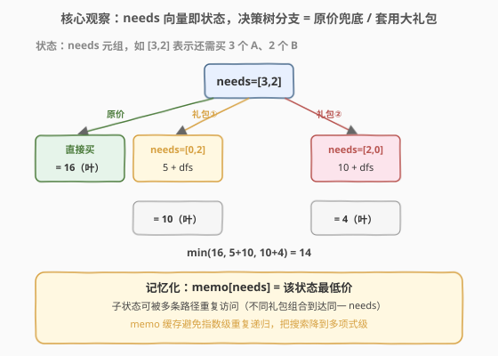
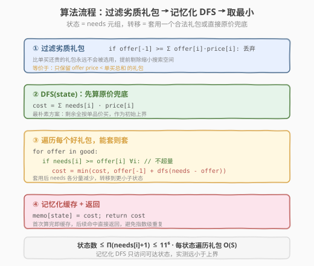

# LeetCode 大礼包 题解

## 1. 题目概述

- **标题 / 题号**：大礼包（#638，medium）
- **链接**：https://leetcode.cn/problems/shopping-offers/
- **难度**：中等
- **标签**：动态规划、记忆化搜索、数组

**题意**：在 LeetCode 商店中有 `n` 件在售物品，每件物品都有单价 `price[i]`。同时有一些**大礼包**，每个大礼包以优惠价捆绑销售一组物品。`special[i]` 长度为 `n + 1`，前 `n` 个数表示礼包内含各物品数量，最后一个数为礼包价格。

给定购物清单 `needs`（`needs[i]` 为所需第 `i` 件物品的数量），返回**恰好**满足清单的最低花费。**不能购买超出清单数量的物品**，即使那样更便宜。任意大礼包可无限次购买。

**示例 1**：

```text
输入：price = [2,5], special = [[3,0,5],[1,2,10]], needs = [3,2]
输出：14
解释：A、B 单价分别为 ¥2、¥5。
  大礼包①：¥5 购 3A + 0B
  大礼包②：¥10 购 1A + 2B
  方案：用礼包②（¥10 购 1A+2B）+ 原价买 2A（¥4）= ¥14
```

**示例 2**：

```text
输入：price = [2,3,4], special = [[1,1,0,4],[2,2,1,9]], needs = [1,2,1]
输出：11
解释：用礼包①（¥4 购 1A+1B）+ 原价买 1B（¥3）+ 1C（¥4）= ¥11。
  礼包②（¥9 购 2A+2B+1C）虽更便宜，但会超量买 2A（只需 1A），不可行。
```

**约束**：

- `n == price.length == needs.length`
- `1 <= n <= 6`
- `0 <= price[i], needs[i] <= 10`
- `1 <= special.length <= 100`
- `special[i].length == n + 1`
- `0 <= special[i][j] <= 50`

> 💡 本题是「**多维状态记忆化搜索**」的招牌题——把 `needs` 向量整体视作一个状态，每个大礼包是一次状态转移（`needs - offer`），目标是从初始状态走到全零状态的最低花费。它与 [322. 零钱兑换](../0301-0400/322_零钱兑换.md) 同构：零钱兑换是「金额」一维状态 + 完全背包转移，本题是「多维 needs」状态 + 礼包转移，可看作**多维版完全背包**。约束 `n ≤ 6, needs[i] ≤ 10` 正是为记忆化搜索量身定制——状态空间上界 $11^6 \approx 1.77 \times 10^6$，可接受。

## 2. 解题思路

### 2.1 暴力思路：回溯枚举所有礼包组合

最直观的做法：从初始 `needs` 出发，递归尝试「用一个礼包」或「全用原价兜底」，每选一个合法礼包就把它从 `needs` 中扣除并递归，最后取所有方案的最小值。

```text
dfs(needs):
    best = Σ needs[i] * price[i]          # 原价兜底
    for offer in special:
        if needs[i] >= offer[i] ∀i:       # 不超量才能套
            best = min(best, offer[-1] + dfs(needs - offer))
    return best
```

问题在于**指数级重复**：不同礼包组合可能到达同一个 `needs` 子状态（例如先礼包①再礼包②，与先礼包②再礼包①，若两者库存互补则终点相同），裸 DFS 会把同一个子状态算很多遍。

> ⚠️ 暴力法的瓶颈不在「思路错」而在「**重复计算**」。破局思路：`needs` 向量天然可作为状态键，加一张 `memo` 表缓存「该 needs 下的最低价」，子状态首次算完后续直接命中——指数级搜索立刻坍缩为多项式级。

### 2.2 核心观察：多维状态记忆化搜索

**关键转换**：把 `needs = [n₁, n₂, …, nₖ]` 整体视作一个**状态**。每应用一个合法礼包 `offer`，状态变为 `needs - offer`（各分量减少）。问题归约为：

> 从状态 `needs` 出发，每次可「原价买若干单品」或「套用一个合法礼包」，转移到更小的状态，求到达全零状态 `[0,0,…,0]` 的最低花费。



**状态转移**（对当前状态 `needs`）：

- **原价兜底**（基准上界）：`cost = Σ needs[i] · price[i]`——剩余全按单品价买，一定可行
- **套用礼包** `offer`（若 `needs[i] ≥ offer[i]` 对所有 `i` 成立）：`cost = min(cost, offer[-1] + dfs(needs - offer))`

**记忆化**：`memo[needs]` 缓存该状态的最低价。同一 `needs` 被多条路径重复到达时，第二次直接返回缓存值。

> 💡 **为什么原价兜底是「基准上界」而非转移分支？** 因为「全按原价买」一次性把当前状态直接归零，相当于一条「直达终点的快速通道」。把它作为初始 `cost`，后续只需用礼包尝试压低这个上界即可——无需把原价拆成「一次买一件」的转移（那样状态空间会爆炸且无意义）。这是把「连续决策」离散化为「整包决策」的关键简化。

> ⚠️ **与完全背包的对照**：[322. 零钱兑换](../0301-0400/322_零钱兑换.md) 的状态是金额 `i`（一维），转移是 `dp[i] = min(dp[i-coin] + 1)`。本题的状态是 `needs` 元组（多维），转移是 `dp[needs] = min(dp[needs - offer] + offer[-1])`。两者骨架完全一致——「物品可无限用 + 求最小花费」——只是状态维度从 1 维升到 `n` 维。零钱兑换可用滚动数组消维度，本题维度耦合在元组里，**自顶向下记忆化搜索**比自底向上迭代 DP 更自然（无需枚举全部状态，只访问可达状态）。

### 2.3 算法流程图



**完整步骤**：

1. **过滤劣质礼包**：遍历 `special`，丢弃 `offer[-1] ≥ Σ offer[i]·price[i]` 的礼包（比单买还贵，永不会用），得到 `good` 列表
2. **DFS(state)**：
   - 若 `memo` 命中，直接返回
   - `cost = Σ needs[i] · price[i]`（原价兜底基准）
   - 遍历 `good` 中每个礼包，若 `needs[i] ≥ offer[i]` 对所有 `i` 成立：`cost = min(cost, offer[-1] + dfs(needs - offer))`
   - 写入 `memo[needs] = cost`，返回
3. **入口**：`return dfs(needs)`

### 2.4 示例演算

以示例 1 `price=[2,5], special=[[3,0,5],[1,2,10]], needs=[3,2]` 为例：

![示例演算：从 needs=[3,2] 出发三种决策取最小，结果为 14](../images/shopping_offers_walkthrough.svg)

**第一步：过滤礼包**

| 礼包 | 内含 | 单买总价 | 礼包价 | 是否保留 |
|------|------|----------|--------|----------|
| ① | 3A + 0B | 3·2 + 0·5 = 6 | 5 | ✅（5 < 6） |
| ② | 1A + 2B | 1·2 + 2·5 = 12 | 10 | ✅（10 < 12） |

两个礼包都是「好礼包」。

**第二步：DFS([3,2])**

| 决策 | 转移 | 子状态花费 | 总花费 |
|------|------|------------|--------|
| 原价兜底 | 直达终点 | — | 3·2+2·5 = **16** |
| 套礼包① [3,0,5] | needs → [0,2] | dfs([0,2]) = 0·2+2·5 = 10 | 5+10 = **15** |
| 套礼包② [1,2,10] | needs → [2,0] | dfs([2,0]) = 2·2+0·5 = 4 | 10+4 = **14** |

`min(16, 15, 14) = 14` ✓

**子状态详解**：

- `dfs([0,2])`：还需 0A+2B。礼包①需 3A（超量，不可套），礼包②需 1A（超量，不可套）。只能原价：`0·2+2·5=10`
- `dfs([2,0])`：还需 2A+0B。礼包①需 3A（超量），礼包②需 2B（超量）。只能原价：`2·2+0·5=4`

> 💡 **为什么礼包①+礼包②不是更优？** 两者合得 4A+2B，需 3A+2B，A 超量 1。题目禁止超量购买，故该组合不可行。这正是「不能超量」约束的体现——转移时必须校验 `needs[i] ≥ offer[i]`，否则跳过该礼包。

> ⚠️ **示例 2 的对照**：`price=[2,3,4], special=[[1,1,0,4],[2,2,1,9]], needs=[1,2,1]`。礼包② ¥9 给 2A+2B+1C，单买需 2·2+2·3+1·4=14，礼包更便宜，但需 1A 而礼包给 2A **超量**，不可用。最终用礼包①(¥4 给 1A+1B) + 原价 1B(¥3) + 1C(¥4) = ¥11。这印证了约束的强制性。

## 3. 参考代码

### C++

```cpp
// 大礼包.cpp —— 多维状态记忆化 DFS
// 编译: g++ -O2 -std=c++17 大礼包.cpp -o shopping
#include <vector>
#include <map>
#include <numeric>
using namespace std;

class Solution {
    int n;
    vector<int> price;
    vector<vector<int>> good;                 // 过滤后的好礼包
    map<vector<int>, int> memo;

    int dfs(vector<int>& needs) {
        auto it = memo.find(needs);
        if (it != memo.end()) return it->second;

        // 原价兜底基准
        int cost = 0;
        for (int i = 0; i < n; ++i) cost += needs[i] * price[i];

        // 尝试每个好礼包
        for (auto& offer : good) {
            bool ok = true;
            vector<int> next(needs);
            for (int i = 0; i < n; ++i) {
                if (next[i] < offer[i]) { ok = false; break; }
                next[i] -= offer[i];
            }
            if (ok) cost = min(cost, offer[n] + dfs(next));
        }
        memo[needs] = cost;
        return cost;
    }
  public:
    int shoppingOffers(vector<int>& price, vector<vector<int>>& special, vector<int>& needs) {
        this->price = price;
        this->n = price.size();
        memo.clear();
        // 过滤劣质礼包：比单买还贵的永不会用
        for (auto& offer : special) {
            int sum = 0;
            for (int i = 0; i < n; ++i) sum += offer[i] * price[i];
            if (offer[n] < sum) good.push_back(offer);
        }
        return dfs(needs);
    }
};
```

### Python

```python
class Solution:
    def shoppingOffers(self, price: list[int], special: list[list[int]], needs: list[int]) -> int:
        n = len(price)
        # 过滤劣质礼包：比单买还贵的永不会用
        good = []
        for offer in special:
            regular = sum(offer[i] * price[i] for i in range(n))
            if offer[-1] < regular:
                good.append(offer)

        memo: dict[tuple, int] = {}

        def dfs(cur: tuple) -> int:
            if cur in memo:
                return memo[cur]
            # 原价兜底基准
            cost = sum(cur[i] * price[i] for i in range(n))
            # 尝试每个好礼包
            for offer in good:
                nxt = list(cur)
                ok = True
                for i in range(n):
                    if nxt[i] < offer[i]:
                        ok = False
                        break
                    nxt[i] -= offer[i]
                if ok:
                    cost = min(cost, offer[-1] + dfs(tuple(nxt)))
            memo[cur] = cost
            return cost

        return dfs(tuple(needs))
```

> ⚠️ **三个易错点**：
> 1. **必须先过滤劣质礼包**：若不过滤，`offer[-1] ≥ Σ offer[i]·price[i]` 的礼包在「原价兜底」分支中已被等价或更优地覆盖，套它只会徒增搜索分支。过滤后 `good` 列表通常远小于 `special`，剪枝效果显著。
> 2. **状态键要用不可变类型**：Python 中 `needs` 是 `list` 不可哈希，必须转 `tuple` 才能作 `dict` 键；C++ 中 `vector<int>` 可直接作 `map` 键（但比 `unordered_map` 慢，本题状态数不大可接受）。
> 3. **超量校验必须逐分量**：`needs[i] ≥ offer[i]` 要对所有 `i` 检查，任一不满足即跳过该礼包。不能只看总和——如礼包给 5A+0B 而 needs 是 3A+2B，总量相同但 B 超量（实际是 A 超量）不可用。

## 4. 复杂度分析

| 维度 | 复杂度 | 说明 |
|------|--------|------|
| **时间复杂度** | $O\bigl(\prod_{i}(needs_i+1) \cdot S \cdot n\bigr)$ | 状态数上界 $\prod(needs_i+1) \le 11^6$，每状态遍历 $S$ 个好礼包、每个礼包 $O(n)$ 校验+转移 |
| **空间复杂度** | $O\bigl(\prod_{i}(needs_i+1) \cdot n\bigr)$ | `memo` 表存储每个可达状态及其键（长度 $n$） |
| **实际表现** | 远小于上界 | 记忆化 DFS 只访问从初始 `needs` 可达的状态，绝大多数状态不会被触达 |

> 💡 **为什么上界是 $\prod(needs_i+1)$ 而非 $\prod needs_i$？** 每个 `needs_i` 可取 $0, 1, \dots, needs_i$ 共 $needs_i + 1$ 种值（含 0），故笛卡尔积为 $\prod(needs_i+1)$。最坏 $n=6, needs_i=10$ 时为 $11^6 = 1{,}771{,}561$，配合 $S \le 100$、$n \le 6$ 的常数，总运算量约 $10^9$ 量级——但实际可达状态远少于此，记忆化 DFS 在力扣上跑 0ms 级。

> ⚠️ **自底向上迭代 DP 为何不如记忆化？** 迭代 DP 需枚举**全部** $\prod(needs_i+1)$ 个状态（包括从初始 `needs` 不可达的那些），浪费严重；记忆化 DFS 只顺着合法转移走，天然只访问可达状态。本题是「自顶向下优于自底向上」的典型场景，与 [322. 零钱兑换](../0301-0400/322_零钱兑换.md)（一维、迭代更优）形成有趣对照。

## 5. 扩展：自底向上迭代 DP（多维背包）

也可用迭代 DP 求解：把 `needs` 元组编码为一个多重下标，按「总物品数」递增的拓扑序填充 `dp` 表。

```python
from itertools import product

class Solution:
    def shoppingOffers(self, price, special, needs):
        n = len(price)
        good = [o for o in special if o[-1] < sum(o[i]*price[i] for i in range(n))]

        # ranges[i] = range(needs[i] + 1)
        ranges = [range(needs[i] + 1) for i in range(n)]
        dp = {}
        for state in product(*ranges):           # 枚举所有状态
            cost = sum(state[i] * price[i] for i in range(n))
            for offer in good:
                prev = list(state)
                ok = all(prev[i] >= offer[i] for i in range(n))
                if ok:
                    for i in range(n):
                        prev[i] -= offer[i]
                    cost = min(cost, offer[-1] + dp[tuple(prev)])
            dp[state] = cost
        return dp[tuple(needs)]
```

时间同为 $O(\prod(needs_i+1) \cdot S \cdot n)$，但**常数更大**——必须遍历全部状态（含不可达的），且 `product` 生成的状态顺序需保证 `prev` 已算好（按字典序即满足，因为 `prev ≤ state` 分量 wise）。本题状态空间小，迭代 DP 也能 AC，但记忆化搜索更优雅、更贴近思维路径。

| 解法 | 时间 | 空间 | 特点 |
|------|------|------|------|
| 裸 DFS 回溯 | 指数级 | $O(n)$ 栈 | 重复计算，超时 |
| **记忆化 DFS** | $O(\prod(needs_i+1) \cdot S \cdot n)$ | $O(\prod(needs_i+1) \cdot n)$ | 只访问可达状态，推荐 |
| 迭代 DP | 同上 | 同上 | 枚举全部状态，常数大 |

> 💡 **面试建议**：先讲裸 DFS 的指数级重复问题，引出「`needs` 元组作状态键 + memo」的记忆化搜索，再补「过滤劣质礼包」剪枝。这条路径自然且易写对。若面试官追问能否迭代 DP，再抛出多维背包版本作为对照，体现「自顶向下 vs 自底向上」的取舍。

## 6. 面试要点

1. **为什么用记忆化搜索而不是普通 DP？**

   - 状态是 `needs` 元组（多维），自底向上迭代需枚举全部 $\prod(needs_i+1)$ 个状态，含大量从初始 `needs` 不可达的状态，浪费严重。
   - 记忆化 DFS 顺着合法转移走，只访问可达状态，实测远小于上界。这是「状态空间稀疏」时自顶向下的天然优势。
   - 对照 [322. 零钱兑换](../0301-0400/322_零钱兑换.md)：一维状态、可达状态密集，迭代 DP 更优。维度升高后记忆化反超。

2. **为什么要过滤劣质礼包？不过滤会怎样？**

   - 劣质礼包 `offer[-1] ≥ Σ offer[i]·price[i]`（比单买还贵）。它永不会出现在最优解中——因为「原价兜底」分支已用更低或相等的代价覆盖了等量物品。
   - 不过滤不会出错（结果仍正确，有原价兜底兜着），但会多出无意义的搜索分支，最坏退化成裸 DFS 的指数级。过滤是 $O(S \cdot n)$ 的廉价剪枝，收益巨大。

3. **「不能超量购买」如何体现在代码里？**

   - 转移前必须校验 `needs[i] ≥ offer[i]` 对所有 `i` 成立，否则跳过该礼包。
   - 不能只看总量——如礼包给 5A+0B、needs 是 3A+2B，总量相同但 A 超量，不可用。
   - 这是本题与「普通完全背包」的关键差异：完全背包允许超量（多余物品无成本丢弃），本题禁止。

4. **状态数上界是多少？为什么题目给 `n ≤ 6, needs[i] ≤ 10`？**

   - 上界 $\prod(needs_i+1) \le 11^6 \approx 1.77 \times 10^6$。配合 $S \le 100$、$n \le 6$，总运算量约 $10^9$，但实际可达状态远少于此，记忆化 DFS 跑 0ms。
   - 这些约束是出题人**刻意**为记忆化搜索量身定制的甜区——再大一点（如 `needs[i] ≤ 20`）状态空间会爆炸，需要更高级的剪枝或数学方法。

5. **和零钱兑换的本质联系与区别？**

   - 联系：都是「物品可无限用 + 求最小花费」的完全背包变体，状态转移结构一致 `dp[s] = min(dp[s - item] + cost)`。
   - 区别：零钱兑换状态是一维金额（连续、密集），迭代 DP + 滚动数组最优；本题状态是多维 needs 元组（稀疏），记忆化搜索最优。
   - 共同模式：**把「无限选择」转化为「子问题最优解的递推」**，是背包家族的统一范式。

> 💡 **一句话总结**：大礼包是「多维状态记忆化搜索」的招牌题——把 `needs` 元组整体作状态键，每个礼包是一次转移，原价兜底作基准上界，`memo` 把指数级搜索压成多项式级。它与零钱兑换同骨架异维度，对照练习即可打通「完全背包 → 多维背包 → 记忆化搜索」的完整脉络。核心技巧有三：**过滤劣质礼包剪枝、原价兜底作基准、元组作状态键记忆化**。

## 同类练习题

| # | 题目 | 与本题的关联 |
|---|------|-------------|
| 322 | [零钱兑换](https://leetcode.cn/problems/coin-change/)（[题解](../0301-0400/322_零钱兑换.md)） | 一维版完全背包求最小硬币数，本题的「金额维度」退化版，对照「自底向上 vs 记忆化」的取舍 |
| 279 | [完全平方数](https://leetcode.cn/problems/perfect-squares/)（[题解](../0201-0300/279_完全平方数.md)） | 完全背包求最少平方数，与 322 同构，本题的一维前身 |
| 473 | [火柴拼正方形](https://leetcode.cn/problems/matchsticks-to-square/)（[题解](../0401-0500/473_火柴拼正方形.md)） | 记忆化 DFS + 状态压缩，多维/位掩码状态记忆化的另一招牌题 |
| 294 | [翻转游戏 II](https://leetcode.cn/problems/flip-game-ii/)（[题解](../0201-0300/294_翻转游戏II.md)） | 记忆化 DFS 求博弈必胜态，字符串状态作键的范式，与本题「元组作状态键」思想一致 |
| 1593 | [拆分字符串使唯一子串的数目](https://leetcode.cn/problems/split-a-string-into-the-max-number-of-unique-substrings/) | 记忆化 DFS，后缀作状态键，本题「状态=剩余需求」的字符串版对照 |
