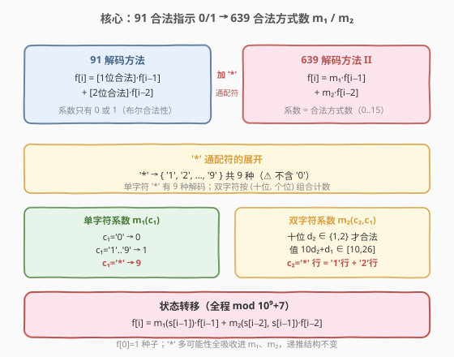
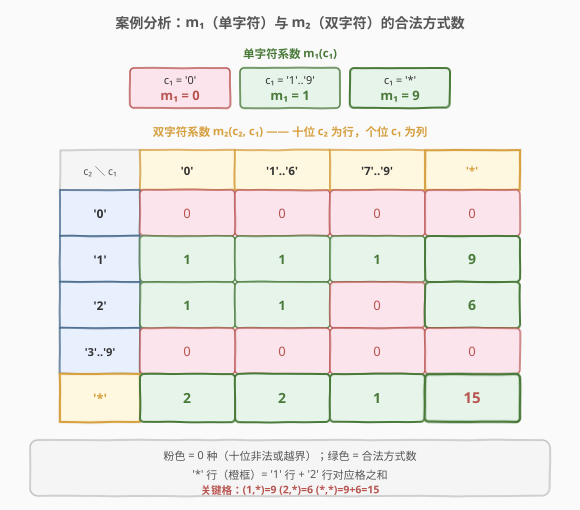
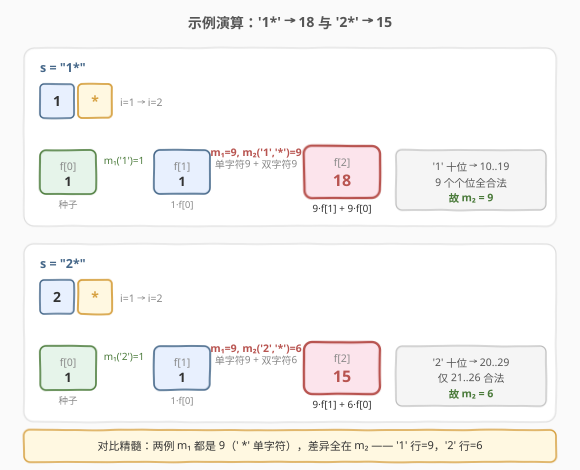

# 解码方法 II

- **题目名称**：解码方法 II
- **链接**：[639. 解码方法 II](https://leetcode.cn/problems/decode-ways-ii/)
- **难度**：困难
- **标签**：动态规划、字符串

## 1. 题目概述

沿用 [91. 解码方法](../0001-0100/91_解码方法.md) 的编码方案：`'A' -> "1"`、`'B' -> "2"`、…、`'Z' -> "26"`。给定一个由**数字字符**和 `'*'` 组成的字符串 `s`，其中 `'*'` 可以表示 `'1'` 到 `'9'` 中的**任意一位**（**不包括 `'0'`**）。返回解码 `s` 的方法总数，答案对 $10^9 + 7$ 取模。

> ⚠️ `'*'` 不代表 `'0'`，这是与普通数字字符的关键区别——单字符 `'0'` 不映射字母，而 `'*'` 恒有 9 种单字符解码。

**示例 1**：

```text
输入：s = "*"
输出：9
解释：'*' 可表示 "1".."9"，分别解码为 "A".."I"，共 9 种。
```

**示例 2**：

```text
输入：s = "1*"
输出：18
解释：'*' 使串展开为 "11".."19" 共 9 条消息，每条都有 2 种解码
      （如 "11"→"AA"/"K"），合计 9 × 2 = 18。
```

**示例 3**：

```text
输入：s = "2*"
输出：15
解释：展开为 "21".."29"。其中 "21".."26" 各 2 种解码（共 6×2=12），
      "27".."29" 各 1 种（共 3×1=3），合计 12 + 3 = 15。
```

**约束条件**：

- $1 \leq \text{s.length} \leq 10^5$
- `s[i]` 为 `'0'`–`'9'` 的数字字符或 `'*'`

> 💡 长度可达 $10^5$，答案极大必须取模——这是与 91 题（$n \leq 100$、免取模）最大的工程差异。骨架仍是 91 的「爬楼梯 + 合法性」递推，难点全部集中在：**当字符是 `'*'` 时，单字符/双字符的「合法方式数」从 0/1 变成了一个需要分类讨论的乘法系数**。

---

## 2. 解题思路

### 2.1 暴力思路：枚举 `'*'` 的所有展开

把每个 `'*'` 替换成 `'1'`..`'9'` 共 9 种可能，对每个展开后的纯数字串套用 91 题的 DP 计数，最后求和。若有 $k$ 个 `'*'`，需跑 $9^k$ 次 91 题 DP，$k$ 稍大即指数爆炸。

> ⚠️ 暴力法的浪费在于「先展开再分别计数」——其实不同展开共享同一递推骨架，完全可以**把 `'*'` 的多种可能折叠成一个「乘法系数」**，在一次扫描里同步累加。

### 2.2 核心观察：91 递推 + `'*'` 折叠成乘法系数



91 题的递推是 $f[i] = [\text{1 位合法}] \cdot f[i-1] + [\text{2 位合法}] \cdot f[i-2]$，其中方括号是 0/1 指示函数。639 把「是否合法」升级为「**有几种合法方式**」：

- **单字符 $c_1$**：若 $c_1$ 是数字，合法方式数非 0 即 1（与 91 完全一致）；若 $c_1 = \text{'\*'}$，则可代表 `'1'`..`'9'` 共 **9** 种单字符解码。记此系数为 $m_1(c_1)$。
- **双字符 $c_2 c_1$**（$c_2$ 为十位、$c_1$ 为个位，值 $10 d_2 + d_1 \in [10, 26]$）：当 $c_2$ 或 $c_1$ 是 `'*'` 时，合法的 $(d_2, d_1)$ 组合可能不止 1 种。记此系数为 $m_2(c_2, c_1)$。

于是递推升级为：

$$f[i] = m_1(s[i-1]) \cdot f[i-1] + m_2(s[i-2],\, s[i-1]) \cdot f[i-2] \pmod{10^9+7}$$

> 💡 **关键洞察**：`'*'` 的「多可能性」被吸收进 $m_1$、$m_2$ 两个系数，递推结构本身一行没变。这正是 91 → 639 的升级本质——**从「布尔合法性」到「计数合法性」**，对应 91 解法中的 `if (合法) f[i] += f[i-1]` 变成 `f[i] += m_1 * f[i-1]`。

> ⚠️ `'*'` **不含 `'0'`**，所以 $c_2 = \text{'\*'}$ 时十位取 $1$..$9$，天然排除前导零，无需像 91 那样特判 `s[i-2] != '0'`。但 $c_2$ 为普通数字 `'0'` 时仍非法（值 $< 10$），需在 $m_2$ 中归零。

### 2.3 案例分析：$m_1$ 与 $m_2$ 取值表

本题的全部难度就在这张表。先看单字符系数 $m_1$：

| $c_1$ | $m_1$ | 说明 |
|-------|-------|------|
| `'0'` | 0 | `'0'` 不映射任何字母 |
| `'1'`..`'9'` | 1 | 自身即唯一合法单字符 |
| `'*'` | 9 | 可代表 `'1'`..`'9'`，9 种 |

双字符系数 $m_2(c_2, c_1)$ 需对 $c_2, c_1$ 是否为 `'*'` / 取值范围分类。核心约束：十位 $d_2 \neq 0$ 且 $10 \leq 10 d_2 + d_1 \leq 26$。展开后只有 **十位 $\in \{1, 2\}$** 才可能合法（$\geq 3$ 则值 $\geq 30$ 越界，$=0$ 则值 $< 10$ 越界）。



逐格推导 $m_2$：

- **$c_2 = \text{'1'}$**：值 $10 d_2 + d_1 = 10 + d_1 \in [10, 19]$，恒合法。
  - $c_1$ 为数字 → 1 种；$c_1 = \text{'\*'}$ → 个位 $1$..$9$ 共 **9** 种。
- **$c_2 = \text{'2'}$**：值 $20 + d_1$，合法当 $d_1 \leq 6$（即 $20$..$26$）。
  - $c_1$ 为数字：$c_1 \in \text{'0'}..\text{'6'}$ → 1 种；$c_1 \in \text{'7'}..\text{'9'}$ → 0 种。
  - $c_1 = \text{'\*'}$ → 个位 $1$..$6$ 共 **6** 种。
- **$c_2 = \text{'0'}$ 或 $c_2 \geq \text{'3'}$**：十位非法，$m_2 = 0$（无论 $c_1$ 是什么）。
- **$c_2 = \text{'\*'}$**：十位取 $1$..$9$，但只有 $1$、$2$ 能产生合法值，故等价于「$c_2 = \text{'1'}$ 的情况」+「$c_2 = \text{'2'}$ 的情况」相加：
  - $c_1$ 为数字 $\in \text{'0'}..\text{'6'}$：十位 1 合法 + 十位 2 合法 → **2** 种。
  - $c_1$ 为数字 $\in \text{'7'}..\text{'9'}$：仅十位 1 合法 → **1** 种。
  - $c_1 = \text{'\*'}$：十位 1（个位 1-9，9 种）+ 十位 2（个位 1-6，6 种）→ **15** 种。

> 💡 **记忆窍门**：$c_2 = \text{'\*'}$ 的那一行，恰好是 $c_2 = \text{'1'}$ 行与 $c_2 = \text{'2'}$ 行对应位置之和——因为 `'*'` 在十位时合法取值就是 $\{1, 2\}$ 的并集。记牢 `1` 行和 `2` 行，`'*'` 行现算即可。

### 2.4 算法流程

递推骨架与 91 题完全同构（参见 [91 题流程图](../0001-0100/91_解码方法.md)），仅把「0/1 累加」换成「乘系数累加」并全程取模：

1. 令 $n = \text{len}(s)$。初始化 $f[0] = 1$（空串种子，与 91 同理）。
2. $f[1] = m_1(s[0])$（首字符只能单字符解码；若 $s[0] = \text{'0'}$ 自然得 0）。
3. 对 $i$ 从 $2$ 到 $n$：
   - $c_1 = s[i-1]$，$c_2 = s[i-2]$；
   - $f[i] = \big(m_1(c_1) \cdot f[i-1] + m_2(c_2, c_1) \cdot f[i-2]\big) \bmod (10^9+7)$。
4. 返回 $f[n]$。

> 💡 由于 $f[i]$ 仅依赖前两项，可用两个变量 `prev2`/`prev1` 滚动，空间 $O(1)$——$n = 10^5$ 时数组版 $O(n)$ 空间也能过，但滚动版更省、常数更小，是 $n \leq 10^5$ 规模下的首选。

### 2.5 示例演算

以 `s = "2*"` 与 `s = "1*"` 对照演算，体会 $m_2$ 的差异：



**`s = "2*"`**（$n=2$）：

| 步骤 | 字符 | $m_1$ | $m_2$ | $f[i]$ 计算 | 结果 |
|------|------|-------|-------|-------------|------|
| $f[0]$ | — | — | — | 种子 | 1 |
| $i=1$ | `'2'` | 1 | — | $1 \cdot f[0]$ | 1 |
| $i=2$ | `'*'` | 9 | $m_2(\text{'2'},\text{'\*'})=6$ | $9 \cdot f[1] + 6 \cdot f[0] = 9 + 6$ | **15** ⭐ |

**`s = "1*"`**（$n=2$）：

| 步骤 | 字符 | $m_1$ | $m_2$ | $f[i]$ 计算 | 结果 |
|------|------|-------|-------|-------------|------|
| $f[0]$ | — | — | — | 种子 | 1 |
| $i=1$ | `'1'` | 1 | — | $1 \cdot f[0]$ | 1 |
| $i=2$ | `'*'` | 9 | $m_2(\text{'1'},\text{'\*'})=9$ | $9 \cdot f[1] + 9 \cdot f[0] = 9 + 9$ | **18** ⭐ |

> 💡 **对比精髓**：两题 $i=2$ 时单字符系数 $m_1$ 都是 9（`'*'` 的 9 种单字符），差别全在 $m_2$——`'1*'` 的 `'1'` 十位让 9 个个位（1-9）全合法（$m_2=9$），而 `'2*'` 的 `'2'` 十位只接纳个位 1-6（$m_2=6$）。这正是「`'2'` 开头只到 26」这一编码规则的直接体现。

---

## 3. 参考代码

### C++

```cpp
class Solution {
  public:
    int numDecodings(string s) {
        const long MOD = 1e9 + 7;
        int n = s.size();
        // m1(c): 单字符 c 的合法解码方式数
        auto m1 = [](char c) -> long {
            if (c == '*') return 9;       // '1'..'9'
            if (c == '0') return 0;       // '0' 不映射字母
            return 1;                     // '1'..'9'
        };
        // m2(c2, c1): 双字符 (c2 十位, c1 个位) 的合法解码方式数
        auto m2 = [](char c2, char c1) -> long {
            if (c2 == '*') {              // 十位取 1 或 2 才合法
                if (c1 == '*') return 15; // 9 (十位1) + 6 (十位2)
                if (c1 <= '6') return 2;  // 十位 1、2 均合法
                return 1;                 // 仅十位 1 合法 (c1: 7,8,9)
            }
            if (c2 == '1') {              // 10..19 全合法
                if (c1 == '*') return 9;  // 个位 1..9
                return 1;                 // 任意数字个位
            }
            if (c2 == '2') {              // 20..26 合法
                if (c1 == '*') return 6;  // 个位 1..6
                if (c1 <= '6') return 1;  // '0'..'6'
                return 0;                 // '7','8','9'
            }
            return 0;                     // c2 == '0' 或 c2 >= '3'
        };
        long prev2 = 1, prev1 = m1(s[0]); // f[0]=1, f[1]=m1(s[0])
        for (int i = 2; i <= n; ++i) {
            char c1 = s[i - 1], c2 = s[i - 2];
            long cur = (m1(c1) * prev1 + m2(c2, c1) * prev2) % MOD;
            prev2 = prev1;
            prev1 = cur;
        }
        return (int)prev1;
    }
};
```

### Python

```python
class Solution:
    def numDecodings(self, s: str) -> int:
        MOD = 10**9 + 7

        def m1(c: str) -> int:
            if c == '*': return 9
            if c == '0': return 0
            return 1

        def m2(c2: str, c1: str) -> int:
            if c2 == '*':
                if c1 == '*': return 15
                return 2 if c1 <= '6' else 1
            if c2 == '1':
                return 9 if c1 == '*' else 1
            if c2 == '2':
                if c1 == '*': return 6
                return 1 if c1 <= '6' else 0
            return 0

        prev2, prev1 = 1, m1(s[0])           # f[0]=1, f[1]=m1(s[0])
        for i in range(2, len(s) + 1):
            c1, c2 = s[i - 1], s[i - 2]
            cur = (m1(c1) * prev1 + m2(c2, c1) * prev2) % MOD
            prev2, prev1 = prev1, cur
        return prev1 % MOD
```

> ⚠️ **易错点**：
> - **$c_2 = \text{'\*'}$ 行别整体套用 $c_2 = \text{'1'}$ 的结果**。它应是「$c_2 = \text{'1'}$」与「$c_2 = \text{'2'}$」两行之和，而非简单复制。常见 bug 是把 $c_2 = \text{'\*'}, c_1 = \text{'\*'}$ 算成 9（漏加十位 2 的 6 种）。
> - **$c_1 = \text{'0'}$ 时 $m_2$ 不一定是 0**。例如 $c_2 = \text{'1'}, c_1 = \text{'0'}$ 表示 `"10"` = J，合法，$m_2 = 1$；$c_2 = \text{'\*'}, c_1 = \text{'0'}$ 表示十位 1 或 2（`"10"`/`"20"`），$m_2 = 2$。别把「$c_1 = \text{'0'}$」和「单字符 `'0'` 非法」混淆——双字符里个位为 0 完全合法。
> - **全程取模**。$n = 10^5$ 时中间值极大，每步 `% MOD` 不可省。C++ 用 `long` 承载乘积（$9 \times 10^9 < 2^{63}$）后再取模，避免溢出。
> - **首字符为 `'0'`**。`prev1 = m1(s[0])` 直接得 0，循环正常推进，最终返回 0，无需特判。

---

## 4. 复杂度分析

| 维度 | 复杂度 | 说明 |
|------|--------|------|
| 时间复杂度 | $O(n)$ | 一次遍历，每个位置 $O(1)$ 的系数查表 + 两次乘法 |
| 空间复杂度 | $O(1)$ | 仅 `prev2`/`prev1` 两个滚动变量 |

> 💡 $n \leq 10^5$，$O(n)$ 时间、$O(1)$ 空间稳过。若改用数组版 $f$，空间升至 $O(n)$（约 800KB），仍可通过但无必要——递推只依赖前两项，滚动是天然而自然的选择。

---

## 5. 扩展：从 91 到 639 的「系数化」思想

本题与 91 题的递推骨架完全一致，差异仅在于把「合法指示函数 $[\cdot] \in \{0,1\}$」推广为「合法方式数 $m \in \mathbb{N}$」。这种**把不确定性的枚举折叠成乘法系数**的手法在计数 DP 中极为常用：

- **91 题**：$f[i] = [s[i-1] \neq \text{'0'}] \cdot f[i-1] + [10 \leq \text{val} \leq 26] \cdot f[i-2]$，系数非 0 即 1。
- **639 题**：把 `'*'` 的 9 种可能折叠进 $m_1$、$m_2$，避免 $9^k$ 次重复枚举。

> 💡 **抽象一层**：凡遇到「某些位置有多个候选、需对所有组合计数」的 DP，优先考虑把候选数吸收为转移系数，而非外层枚举。例如 [935. 骑士拨号器](https://leetcode.cn/problems/knight-dialer/) 也是同源思路——把「骑士可跳的多个目标」作为转移系数矩阵，做矩阵快速幂。

若把状态定义改成自顶向下记忆化，写法同样简洁（Python `@lru_cache`），但 $n = 10^5$ 时递归深度可能触及默认栈上限，递推版更稳妥。

---

## 6. 面试要点

1. **639 与 91 的核心区别是什么？**

   > 递推骨架同为 $f[i] = (\text{1 位贡献}) + (\text{2 位贡献})$。区别仅在「合法性」的刻画：91 用 0/1 布尔指示（合法则累加 $f[i-1]$），639 因 `'*'` 引入多可能性，需用「合法方式数」$m_1$、$m_2$ 作乘法系数（累加 $m \cdot f[i-1]$）。此外 $n$ 升到 $10^5$，必须全程取模。

2. **`'*'` 在十位和个位时分别意味着什么？**

   > `'*'` 恒代表 `'1'`..`'9'`（**不含 `'0'`**）。在**个位** $c_1$ 时，它给单字符带来 9 种可能（$m_1 = 9$），给双字符的个位带来 1..9 共 9 个候选。在**十位** $c_2$ 时，它能取 1..9，但仅 1、2 产生 $\leq 26$ 的合法值，故 $c_2 = \text{'\*'}$ 行 = $c_2 = \text{'1'}$ 行 + $c_2 = \text{'2'}$ 行。

3. **为什么 $m_2(\text{'\*'}, \text{'\*'}) = 15$？**

   > 十位 $d_2 \in \{1, 2\}$、个位 $d_1 \in \{1..9\}$ 的合法组合数：$d_2 = 1$ 时 $10 d_2 + d_1 = 11..19$ 全合法（9 种）；$d_2 = 2$ 时仅 $d_1 \leq 6$ 合法即 $21..26$（6 种）。合计 $9 + 6 = 15$。

4. **`s = "10"`、`s = "0*"`、`s = "*0"` 各返回多少？**

   > `"10"`：$f[1] = m_1(\text{'1'}) = 1$；$f[2] = m_1(\text{'0'}) \cdot f[1] + m_2(\text{'1'},\text{'0'}) \cdot f[0] = 0 \cdot 1 + 1 \cdot 1 = 1$（`"10"`=J）。`"0*"`：$f[1] = m_1(\text{'0'}) = 0$，首字符即断，最终 0。`"*0"`：$f[1] = 9$；$f[2] = m_1(\text{'0'}) \cdot 9 + m_2(\text{'\*'},\text{'0'}) \cdot 1 = 0 + 2 = 2$（`"10"`=J、`"20"`=T）。注意 `"*0"` 体现了「个位为 0 在双字符里合法」。

5. **为什么用滚动数组而非显式 $f$ 数组？**

   > $f[i]$ 只依赖 $f[i-1]$、$f[i-2]$，两个变量即可滚动，空间 $O(1)$。$n = 10^5$ 下数组版 $O(n)$ 空间虽也能过，但滚动版更省内存、缓存更友好，且代码不比数组版长——没有理由不用。

> 💡 **一句话总结**：639 = 91 的递推骨架 + `'*'` 折叠成的乘法系数 $m_1$、$m_2$ + 全程取模。把 $m_2$ 的 4×4 案例表记牢（重点是 `'1'` 行、`'2'` 行，`'*'` 行为二者之和），代码就是一次扫描 + 滚动变量。

---

## 7. 同类练习题

- [91. 解码方法](https://leetcode.cn/problems/decode-ways/)（[题解](../0001-0100/91_解码方法.md)）：本题的**无通配符原型**，先掌握 $f[i] = [\text{合法}] \cdot f[i-1] + \cdots$ 的 0/1 系数递推，再加 `'*'` 升级为乘法系数
- [70. 爬楼梯](https://leetcode.cn/problems/climbing-stairs/)：解码方法族的**无约束源头**，$f[i] = f[i-1] + f[i-2]$，理解 91/639 的递推骨架
- [935. 骑士拨号器](https://leetcode.cn/problems/knight-dialer/)：同为「多候选折叠成转移系数」的计数 DP，候选数变成转移矩阵，配合矩阵快速幂
- [1414. 和为 K 的最少斐波那契数字数目](https://leetcode.cn/problems/find-the-minimum-number-of-fibonacci-numbers-whose-sum-is-k/)：虽非同骨架，但同样涉及「枚举候选 vs 折叠系数」的思维取舍
