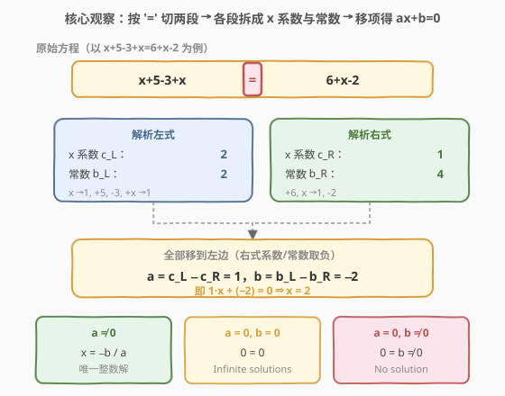
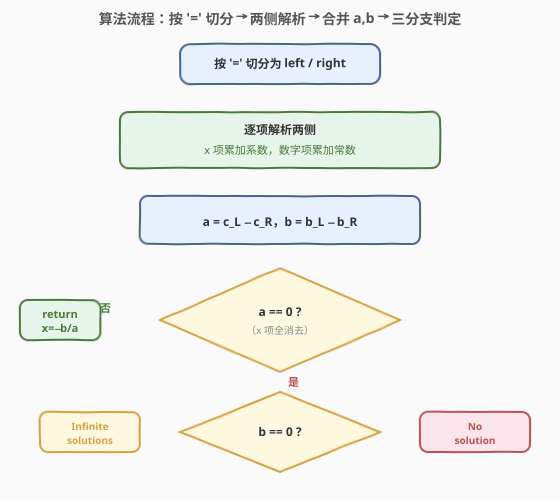
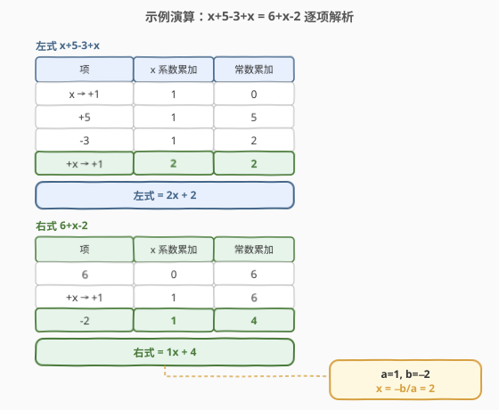

# 求解方程

- **题目名称**：求解方程
- **链接**：[640. 求解方程](https://leetcode.cn/problems/solve-the-equation/)
- **难度**：中等
- **标签**：字符串、数学、模拟

## 1. 题目概述

求解一个给定的**一元一次方程**，将 $x$ 以字符串 `"x=#value"` 的形式返回。方程仅包含 `'+'`、`'-'` 操作、变量 $x$ 及其对应系数、整数常数。

- 若方程**无解**，返回 `"No solution"`。
- 若方程有**无限多解**，返回 `"Infinite solutions"`。
- 题目保证：若方程只有一个解，则 $x$ 的值是一个**整数**（无需处理分数）。

**示例 1**：

```text
输入：equation = "x+5-3+x=6+x-2"
输出："x=2"
解释：左式 x+5-3+x = 2x+2，右式 6+x-2 = x+4；移项得 x-2=0，故 x=2
```

**示例 2**：

```text
输入：equation = "x=x"
输出："Infinite solutions"
解释：移项后 0·x = 0，x 取任意值均成立
```

**示例 3**：

```text
输入：equation = "2x=x"
输出："x=0"
解释：移项后 x=0
```

**约束条件**：

- `3 <= equation.length <= 1000`
- `equation` 恰好有一个 `'='`
- 方程由绝对值在 $[0, 100]$ 范围内且**无前导零**的整数和变量 $x$ 组成

> 💡 本题本质是一道**字符串表达式解析**题：把形如 `x+5-3+x` 的代数式扫描一遍，拆成「$x$ 的系数」与「常数项」两组累加器，再在等号两侧做一次减法，就退化成最朴素的 $ax + b = 0$ 求解。难点不在数学而在**解析的边界**：`x` 单独出现系数是 1、`-x` 系数是 $-1$、符号要随项走。

---

## 2. 解题思路

### 2.1 暴力思路

最直觉的做法是借助语言内置的表达式求值：把 $x$ 视作一个「待定变量」，代入两个不同的值（比如 $x=0$ 和 $x=1$）算出等号两侧的值，再用「两点定直线」解出 $x$。

这个思路数学上成立（一元一次式确是直线），但工程上别扭：

- 需要手写一个支持 `+`/`-` 与变量 `x` 的表达式求值器，复杂度不亚于直接解析；
- 代入 $x=0$ 时还要处理 `x` 作为 $0$ 时的系数归零、`-x` 变成 $0$ 等细节；
- 无法直接区分「无解」与「无限解」——需要两次代入后比较斜率与截距，逻辑绕。

> ⚠️ 真正干净的突破口是**不要去「求值」，而要去「收集」**：每段代数式都可以被拆成若干个**项**（term），每个项要么贡献到 $x$ 的系数、要么贡献到常数。把两侧的系数与常数分别累加，问题就归约成了 $ax+b=0$。

### 2.2 核心观察：按项分类累加 → 移项归约

**关键转换**：一元一次方程的等号两侧都是「若干 $x$ 项与常数项的代数和」。对任意一段形如 `±cx ± d ± ex ...` 的代数式，扫描一遍即可得到两个数：

- $c_{\text{式}}$：该式中所有 $x$ 项的**系数之和**；
- $b_{\text{式}}$：该式中所有常数项的**代数和**。

于是整个方程 $\text{left} = \text{right}$ 等价于：

$$
c_L \cdot x + b_L \;=\; c_R \cdot x + b_R
$$

把右式整体移到左边（右式系数/常数取负）：

$$
\underbrace{(c_L - c_R)}_{a}\,x + \underbrace{(b_L - b_R)}_{b} = 0
$$



至此问题变成最原始的 $ax + b = 0$，分三种情况：

| 条件 | 含义 | 结论 |
|------|------|------|
| $a \ne 0$ | $x$ 的系数非零，唯一解 | $x = -b / a$（题意保证为整数） |
| $a = 0,\ b = 0$ | $0\cdot x = 0$ 恒成立 | `"Infinite solutions"` |
| $a = 0,\ b \ne 0$ | $0 = b \ne 0$ 矛盾 | `"No solution"` |

> 💡 **解析单个项的规则**（处理边界的关键）：扫描一个项时，先读一串数字（可能没有），再看其后是否紧跟 `x`：
> - 项形如 `2x` / `-3x`：数字部分 `2` / `3` 即系数（带上当前符号）；
> - 项形如 `x` / `-x` / `+x`：**没有数字**，此时系数按 $\pm 1$ 处理——这是最高频的踩坑点；
> - 项形如 `5` / `-2`：不含 `x`，整段当作常数累加（带上当前符号）。
>
> 符号的处理采用「**遇 `+`/`-` 先刷新符号，再读项**」的模式：扫描到 `+` 置 `sign=+1`、`-` 置 `sign=-1`，随后读取的项统一乘上 `sign`。这样无需把符号粘到项字符串里再解析，逻辑最简。

### 2.3 算法流程图



**完整步骤**：

1. **切分**：以 `'='` 为界把 `equation` 拆成 `left` 与 `right` 两段字符串。
2. **解析**：对每段调用同一个 `parse(s)`，扫描一遍得到 `(coeff_x, const)`。
   - 维护 `sign`（初始 $+1$）、`coeff`、`con` 三个累加器；
   - 遇 `+`/`-` 仅更新 `sign`；否则读取数字串（可能为空），再判断下一个字符是否 `x`：
     - 是 `x` → `coeff += sign * (有数字 ? num : 1)`，跳过 `x`；
     - 否则 → `con += sign * num`。
3. **合并**：`a = cL - cR`，`b = bL - bR`。
4. **判定**：按上表三种情况返回结果，唯一解时输出 `"x=" + (-b/a)`。

### 2.4 示例演算

以 `equation = "x+5-3+x=6+x-2"` 为例，逐项解析两侧：



**左式 `x+5-3+x`**：

| 项 | 符号 | 解读 | x 系数累加 | 常数累加 |
|----|------|------|------------|----------|
| `x` | $+1$ | 无数字，系数 $+1$ | 1 | 0 |
| `+5` | $+1$ | 常数 $+5$ | 1 | 5 |
| `-3` | $-1$ | 常数 $-3$ | 1 | 2 |
| `+x` | $+1$ | 无数字，系数 $+1$ | **2** | **2** |

得到 $c_L = 2,\ b_L = 2$，即左式 $= 2x + 2$。

**右式 `6+x-2`**：

| 项 | 符号 | 解读 | x 系数累加 | 常数累加 |
|----|------|------|------------|----------|
| `6` | $+1$ | 常数 $+6$ | 0 | 6 |
| `+x` | $+1$ | 无数字，系数 $+1$ | 1 | 6 |
| `-2` | $-1$ | 常数 $-2$ | **1** | **4** |

得到 $c_R = 1,\ b_R = 4$，即右式 $= x + 4$。

**合并求解**：$a = 2 - 1 = 1$，$b = 2 - 4 = -2$，$a \ne 0$ 故 $x = -b/a = -(-2)/1 = 2$，输出 `"x=2"`。

> 💡 **边界自检**：
> - `x=x`：$c_L=c_R=1,\ b_L=b_R=0$ → $a=0,b=0$ → `"Infinite solutions"`；
> - `2x=x`：$a=1,b=0$ → `x=0`；
> - `x=x+2`：$c_L=1,c_R=1 \Rightarrow a=0$；$b_L=0,b_R=2 \Rightarrow b=-2 \ne 0$ → `"No solution"`；
> - `-x=-1`：$c_L=-1,b_L=0;\ c_R=0,b_R=-1$ → $a=-1,b=1$ → $x=-1/(-1)=1$（即 $-x=-1 \Rightarrow x=1$）。

---

## 3. 参考代码

### C++

```cpp
// 求解方程.cpp —— 按项分类累加 + 移项归约
// 编译: g++ -O2 -std=c++17 求解方程.cpp -o solveeq
#include <string>
#include <cctype>
using namespace std;

class Solution {
  public:
    string solveEquation(string equation) {
        auto eq = equation.find('=');
        int cL, bL, cR, bR;
        parse(equation.substr(0, eq), cL, bL);
        parse(equation.substr(eq + 1), cR, bR);
        int a = cL - cR, b = bL - bR;
        if (a == 0) return b == 0 ? "Infinite solutions" : "No solution";
        return "x=" + to_string(-b / a);   // 题意保证 a 整除 b，截断除法即精确解
    }
  private:
    static void parse(const string& s, int& coeff, int& con) {
        coeff = 0; con = 0;
        int i = 0, n = s.size(), sign = 1;
        while (i < n) {
            if (s[i] == '+') { sign = 1; i++; }
            else if (s[i] == '-') { sign = -1; i++; }
            else {
                int num = 0; bool has = false;
                while (i < n && isdigit((unsigned char)s[i])) {
                    num = num * 10 + (s[i] - '0');
                    i++; has = true;
                }
                if (i < n && s[i] == 'x') {            // x 项：无数字则系数为 1
                    coeff += sign * (has ? num : 1);
                    i++;
                } else {                               // 常数项
                    con += sign * num;
                }
            }
        }
    }
};
```

### Python

```python
class Solution:
    def solveEquation(self, equation: str) -> str:
        def parse(s: str):
            coeff = con = 0
            i, n, sign = 0, len(s), 1
            while i < n:
                ch = s[i]
                if ch == '+':
                    sign, i = 1, i + 1
                elif ch == '-':
                    sign, i = -1, i + 1
                else:
                    num, has = 0, False
                    while i < n and s[i].isdigit():
                        num = num * 10 + int(s[i])
                        i, has = i + 1, True
                    if i < n and s[i] == 'x':          # x 项：无数字则系数为 1
                        coeff += sign * (num if has else 1)
                        i += 1
                    else:                              # 常数项
                        con += sign * num
            return coeff, con

        left, right = equation.split('=')
        cL, bL = parse(left)
        cR, bR = parse(right)
        a, b = cL - cR, bL - bR
        if a == 0:
            return "Infinite solutions" if b == 0 else "No solution"
        return f"x={-b // a}"          # a 整除 b，地板除即精确解
```

> ⚠️ **四个易错点**：
> 1. **`x` 与 `-x` 的系数**：项中**没有数字**时系数按 $\pm 1$，不能当 $0$。`has` 标志位专门区分「读了数字」与「没读数字」，没读数字且紧跟 `x` 就用 `1` 乘上 `sign`。漏掉这一条会让 `x=x` 误判为 `0=0` 之外的各种错误。
> 2. **符号随项走**：遇到 `+`/`-` **只更新 `sign` 不读项**，把符号的语义推迟到紧随其后的项中再乘上去。这样 `+5`、`-3`、`+x` 共用同一套读取逻辑，无需把符号粘进字符串。
> 3. **除法方向**：题意保证 $a \mid b$（$a$ 整除 $b$），所以 C++ 截断除法 `-b / a` 与 Python 地板除 `-b // a` 都等于真实商——对**精确整除**而言两种除法结果一致。切勿用浮点除法再转 int，避免精度踩坑。
> 4. **顺序**：必须先 `split('=')` 再解析，不要边扫等号边解析——等号两侧的项互不相干，分开解析逻辑最清晰，也便于复用同一个 `parse`。

---

## 4. 复杂度分析

| 维度 | 复杂度 | 说明 |
|------|--------|------|
| **时间复杂度** | $O(n)$ | 对长度为 $n$ 的字符串各扫一遍（左式 + 右式合起来恰好一遍），每字符 $O(1)$ |
| **空间复杂度** | $O(n)$ | C++ `substr` 拷出左右两段；Python `split` 同理。若改为传起始下标可降到 $O(1)$ |
| **最优空间** | $O(1)$ | 不拷贝子串，直接在原串上用 `[l, r)` 下标区间调用 `parse`，仅常数变量 |

> 💡 $n \le 1000$，时间毫无压力。本题考点完全在**解析正确性**：能否统一处理 `2x`/`x`/`-x` 三种项、能否把符号与项解耦、能否正确区分三种解的情形。

---

## 5. 扩展：正则切词版解析

上面的手写扫描把「符号」与「项」解耦得最干净，但需要自己控制下标。若语言支持正则，可以用**切词**思路把每个带符号的项一次性抽出来，主循环更短：

```python
import re

class Solution:
    def solveEquation(self, equation: str) -> str:
        def parse(s: str):
            coeff = con = 0
            # 匹配「可选符号 + 一段非符号字符」，如 +5 / -3 / x / -x / +2x
            for tok in re.findall(r'[+-]?[^+-]+', s):
                if tok.endswith('x'):                      # x 项
                    c = tok[:-1]                           # 去掉末尾 x，剩下纯系数串
                    coeff += int(c + '1') if c in ('', '+', '-') else int(c)
                else:                                      # 常数项
                    con += int(tok)
            return coeff, con

        left, right = equation.split('=')
        cL, bL = parse(left)
        cR, bR = parse(right)
        a, b = cL - cR, bL - bR
        if a == 0:
            return "Infinite solutions" if b == 0 else "No solution"
        return f"x={-b // a}"
```

> 💡 **正则 `[+-]?[^+-]+` 的含义**：一个可选的 `+`/`-` 后跟「一个或多个非 `+`/`-` 字符」。它能把 `"x+5-3+x"` 干净切成 `["x", "+5", "-3", "+x"]`，`"-x+2"` 切成 `["-x", "+2"]`，首项的符号也被可选 `[+-]?` 捕获。
>
> **系数串的归一**：去掉末尾 `x` 后，`"2x"→"2"`、`"-3x"→"-3"` 直接 `int()`；但 `"x"→""`、`"+x"→"+"`、`"-x"→"-"` 是空/纯符号串，`int()` 会抛错，此时补一个 `'1'` 再转：`int(''+'1')=1`、`int('+'+'1')=1`、`int('-'+'1')=-1`，正好对应系数 $\pm 1$。

| 解法 | 时间 | 空间 | 思路 |
|------|------|------|------|
| **手写扫描（主解）** | $O(n)$ | $O(n)$/可降到 $O(1)$ | 下标推进，符号与项解耦，边界最显式 |
| 正则切词 | $O(n)$ | $O(n)$ | `findall` 一次性抽带符号项，主循环更短但依赖正则引擎 |

> 💡 **面试建议**：先讲清「按项分类累加 → 移项归约」的数学骨架，再选手写扫描落地——它最能体现对边界的掌控（`x`/`-x` 系数 $\pm1$、符号随项走）。若面试官追问「能否更短」，再抛出正则切词版作为对照。两种解法的**判定部分完全一致**，差异只在解析这一段。

---

## 6. 面试要点

1. **为什么把右式整体移到左边，而不是分别求两侧的值？**

   - 求值需要先知道 $x$，而 $x$ 正是未知量；移项则把「求值」转成「收集系数」，每段代数式只贡献两个数（$x$ 系数和、常数和），不依赖 $x$ 的具体取值。这是把「方程求解」归约成「$ax+b=0$」的关键一步。

2. **`x` 和 `-x` 的系数为什么是 $\pm1$？怎么在代码里体现？**

   - 代数约定：单独的 $x$ 即 $1\cdot x$，`-x` 即 $-1\cdot x$。代码里用一个 `has` 布尔标志记录「这一项是否读到了数字」——若没读到数字且项以 `x` 结尾，就按 `1` 作为系数再乘当前 `sign`。漏掉这条会让 `x=x` 这类输入全部算错。

3. **符号 `+`/`-` 为什么单独处理，而不是和项串在一起解析？**

   - 把符号解耦成「先刷新 `sign`，再读项」的模式，能让 `+5`、`-3`、`+x`、`-2x` 共用同一套读取逻辑（读数字串 → 判 `x` → 乘 `sign` 累加），无需处理 `"-3"`、`"+x"` 这类带前缀字符串的 `int()` 解析。代码更短、边界更少。

4. **如何区分「无解」与「无限解」？**

   - 移项后看 $a$ 和 $b$：$a=0$ 说明 $x$ 项全部抵消，方程退化为 $0=b$。此时 $b=0$ 即 $0=0$ 恒成立 → 无限解；$b\ne0$ 即 $0=\text{非零}$ 矛盾 → 无解。$a\ne0$ 则唯一解 $x=-b/a$。三者互斥且完备。

5. **`-b / a` 在 C++ 和 Python 里安全吗？**

   - 题目保证唯一解时 $x$ 是整数，即 $a \mid b$。C++ 整数除法向零截断、Python `//` 向负无穷取整，但对**精确整除**两者结果都等于真实商。只要不用浮点除法转 int，就不会出精度问题。若担心可读性，可显式断言 `b % a == 0`。

> 💡 **一句话总结**：求解方程是「字符串代数式解析」的招牌题——不求值、只收集，把等号两侧各扫一遍拆成 $x$ 系数与常数，移项归约成 $ax+b=0$ 后三分支判定。核心技巧是「符号随项走」与「无数字则系数为 $\pm1$」两条解析规则，掌握它们，任何一元一次方程的字符串形式都能一遍扫过。

---

## 7. 同类练习题

- [227. 基本计算器 II](https://leetcode.cn/problems/basic-calculator-ii/)（[题解](../0201-0300/227_基本计算器II.md)）：字符串四则运算表达式求值，同为「按项扫描 + 符号驱动」的解析套路，用栈处理乘除优先级
- [224. 基本计算器](https://leetcode.cn/problems/basic-calculator/)（[题解](../0201-0300/224_基本计算器.md)）：含括号的 `+`/`-` 表达式求值，本题解析思路的进阶（栈处理括号嵌套）
- [8. 字符串转换整数 (atoi)](https://leetcode.cn/problems/string-to-integer-atoi/)（[题解](../0001-0100/8_字符串转换整数atoi.md)）：规则驱动的字符串解析 + 边界处理，DFA 思路与本题「符号随项走」异曲同工
- [165. 比较版本号](https://leetcode.cn/problems/compare-version-numbers/)（[题解](../0101-0200/165_比较版本号.md)）：字符串切分 + 逐段解析比较，另一种「按分隔符切词」的解析形态
- [13. 罗马数字转整数](https://leetcode.cn/problems/roman-to-integer/)（[题解](../0001-0100/13_罗马数字转整数.md)）：按规则扫描字符串并累加，规则驱动的字符串解析入门题
