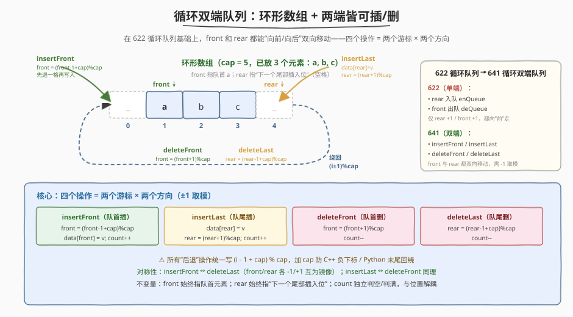
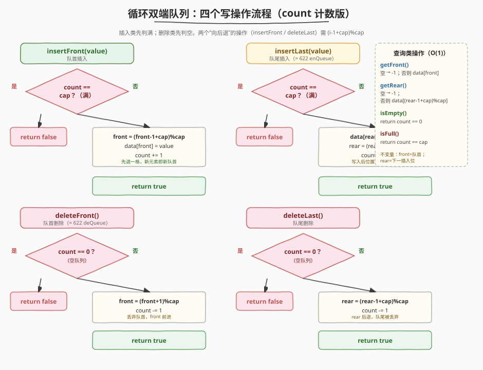
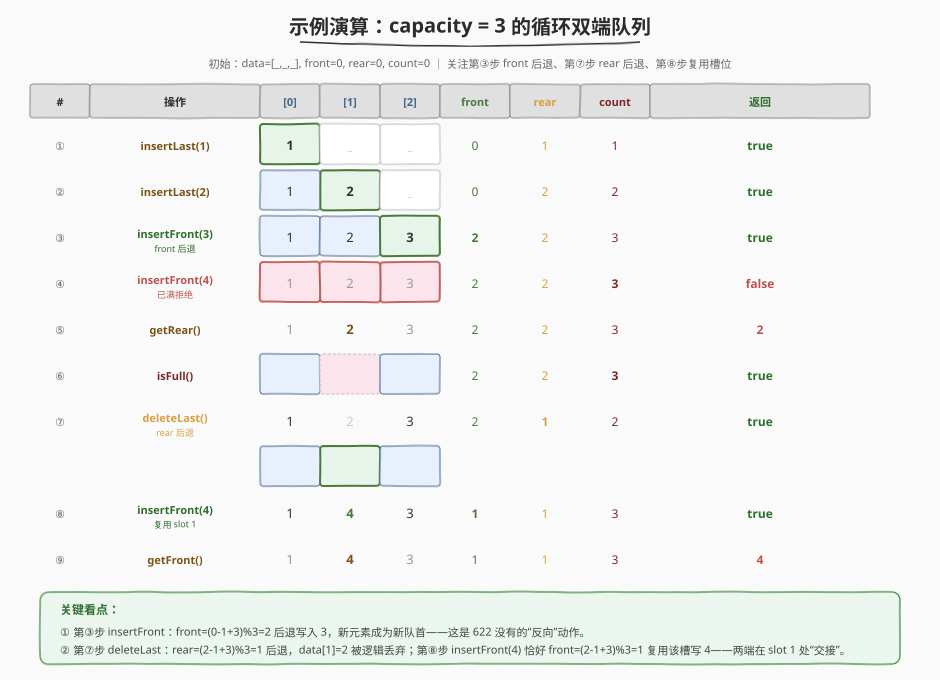

# LeetCode 设计循环双端队列 题解

## 1. 题目概述

- **标题 / 题号**：设计循环双端队列（#641，medium）
- **链接**：https://leetcode.cn/problems/design-circular-deque/
- **难度**：中等
- **标签**：设计、队列、数组、双端队列

**题意**：设计一个**循环双端队列**（circular deque）：在 [622 循环队列](../0601-0700/622_设计循环队列.md)「环形数组 + 空间复用」的基础上，**两端都能插入和删除**。即队首（front）和队尾（rear）各自支持入队/出队，共 4 个写操作。

需实现以下接口：

- `MyCircularDeque(k)`：以容量 `k` 初始化双端队列
- `boolean insertFront(value)`：向队首插入元素，成功返回 `true`；已满返回 `false`
- `boolean insertLast(value)`：向队尾插入元素，成功返回 `true`；已满返回 `false`
- `boolean deleteFront()`：从队首删除一个元素，成功返回 `true`；为空返回 `false`
- `boolean deleteLast()`：从队尾删除一个元素，成功返回 `true`；为空返回 `false`
- `int getFront()`：获取队首元素；为空返回 `-1`
- `int getRear()`：获取队尾元素；为空返回 `-1`
- `boolean isEmpty()`：是否为空
- `boolean isFull()`：是否已满

**示例 1**：

```text
输入：
  MyCircularDeque(3);
  insertLast(1);     // true
  insertLast(2);     // true
  insertFront(3);    // true
  insertFront(4);    // false，已满
  getRear();         // 2
  isFull();          // true
  deleteLast();      // true
  insertFront(4);    // true，复用刚腾出的尾部槽位
  getFront();        // 4
输出：[null, true, true, true, false, 2, true, true, true, 4]
```

**约束**：

- `1 <= k <= 1000`
- `0 <= value <= 1000`
- 最多调用 `2000` 次

> 💡 本题是 622 的「双端版」：622 只能 `rear 入 / front 出`（两个游标都 `+1` 前进），641 让 `front` 和 `rear` **各自能前进/后退**。新增的全部难度就在「后退」这一步——下标怎么从 `0` 退到 `cap - 1`。

## 2. 解题思路

### 2.1 暴力思路

用一个 `deque`/双链表直接存：两端插删都是 `O(1)`。但题目要求体现「**固定容量 + 环形数组复用空间**」的设计语义（这也是 622 的考点延续），用语言自带的 `deque` 等于没设计。或者用普通数组 + 搬移：`insertFront` 把全体后移一格再写首格，`O(n)`；不符合双端队列 `O(1)` 的接口契约。

> ⚠️ 暴力法的问题：要么借助现成结构跳过设计，要么 `insertFront` 退化成 `O(n)`。循环双端队列的存在意义是**在固定容量下，两端插删都 `O(1)` 且空间零浪费**。

### 2.2 核心观察：环形数组 + count 计数 + 双向游标



承接 622 的「环形数组 + `front`/`rear`/`count`」三件套，关键洞察是：**下标既能 `+1` 前进，也能 `-1` 后退**，只要对 `cap` 取模就始终落在合法范围。于是四个写操作恰好是「两个游标 × 两个方向」的笛卡尔积：

| 操作 | 游标 | 方向 | 表达式 |
|------|------|------|--------|
| `insertLast`  | `rear`  | 前进 `+1` | 先写 `data[rear]`，再 `rear = (rear + 1) % cap` |
| `deleteFront` | `front` | 前进 `+1` | `front = (front + 1) % cap` |
| `insertFront` | `front` | **后退 `-1`** | 先 `front = (front - 1 + cap) % cap`，再写 `data[front]` |
| `deleteLast`  | `rear`  | **后退 `-1`** | `rear = (rear - 1 + cap) % cap` |

##### 为什么「后退」要 `+ cap` 再取模？

下标 `i` 后退一步本应是 `i - 1`，但当 `i == 0` 时 `i - 1 = -1`：C++ 中下标不能为负（未定义行为），Python 虽会自动取到末尾但跨语言不一致。统一写成 `(i - 1 + cap) % cap`：`+ cap` 把负数扳回正区间，`% cap` 再绕到合法范围。`i == 0` 时得 `cap - 1`（绕回数组末尾），正是「环」的体现。

##### 三个状态量（与 622 完全一致）

| 变量 | 含义 |
|------|------|
| `front` | 指向**当前队首**元素的下标 |
| `rear`  | 指向**下一个待插入**尾部位置的下标（队尾元素的后一位） |
| `count` | 队内元素个数（独立于 `front`/`rear` 位置关系，专司判空判满） |

##### 区分「空」与「满」——沿用 622 的 `count` 方案

循环队列里 `front == rear` 在「空」和「满」时**都成立**，单看位置无法区分。和 622 一样选 `count` 计数：空 `count == 0`，满 `count == cap`。判空判满都不依赖位置，逻辑清晰不易错；双端操作只是让 `front`/`rear` 的移动更自由，但**不影响 `count` 的判空判满逻辑**——这是 `count` 方案在双端场景下相比「牺牲一槽位」版的额外优势（位置关系在双端下来回横跳，更难用单一条件判满）。

> 💡 对称性记忆法：`insertFront` ↔ `deleteLast` 是一对镜像（`front` 后退写入 vs `rear` 后退丢弃），`insertLast` ↔ `deleteFront` 是另一对镜像（`rear` 前进写入 vs `front` 前进丢弃）。记住「前进 `+1`」和「后退 `-1+cap`」两个原语，四个操作可两两配对推出，无需死记。

### 2.3 算法流程



```
insertFront(value):                       insertLast(value):
    if count == cap: return false              if count == cap: return false
    front = (front - 1 + cap) % cap            data[rear] = value
    data[front] = value                        rear = (rear + 1) % cap
    count += 1                                 count += 1
    return true                                return true

deleteFront():                            deleteLast():
    if count == 0: return false               if count == 0: return false
    front = (front + 1) % cap                 rear = (rear - 1 + cap) % cap
    count -= 1                                 count -= 1
    return true                                return true

getFront():  return count == 0 ? -1 : data[front]
getRear():   return count == 0 ? -1 : data[(rear - 1 + cap) % cap]
isEmpty():   return count == 0
isFull():    return count == cap
```

**关键不变量**：

- `insertFront` 必须**先后退再写入**：因为 `front` 指向当前队首，新元素要插在队首「前面」，即 `front - 1` 那一格；先写后退还可用，但语义上「写入位置 = 新 front」更直观，且和 `insertLast`（先写后前进）形成对称：**插入 = 先定位写入格 → 写 → 游标移开**。
- `deleteLast` 只需**后退 `rear`**：`rear` 指向「下一个待插入位」，它「前一位」就是当前队尾；后退一格相当于把队尾丢弃。数据未清，但 `count` 减 1 后该槽不再算有效，下次插入可覆盖。
- `getRear` 与 622 完全一致：取 `data[(rear - 1 + cap) % cap]`——`rear` 的「前一位」才是队尾。
- `count` 与位置解耦：双端操作下 `front`/`rear` 谁前谁后根本不重要，判空判满只看计数。

### 2.4 示例演算

以 `capacity = 3` 为例，走官方示例的 9 步：`insertLast(1), insertLast(2), insertFront(3), insertFront(4)→false, getRear()→2, isFull()→true, deleteLast, insertFront(4), getFront()→4`。



| 看点 | 步骤 | 说明 |
|------|------|------|
| **front 后退** | ③ `insertFront(3)` | `front = (0-1+3)%3 = 2`，写入 `data[2]=3`——这是 622 没有的「反向」动作，新元素成为新队首 |
| **满则拒绝** | ④ `insertFront(4)` | `count == cap == 3`，返回 `false`，不动任何状态 |
| **getRear 取前一位** | ⑤ `getRear()` | `rear==2`，取 `data[(2-1+3)%3] = data[1] = 2` ✓ |
| **rear 后退** | ⑦ `deleteLast()` | `rear = (2-1+3)%3 = 1`，`data[1]=2` 被逻辑丢弃（粉色虚线格，数据未清但不再有效） |
| **两端交接复用** | ⑧ `insertFront(4)` | `front = (2-1+3)%3 = 1`，恰好写入 ⑦ 腾出的 `data[1]`——**队尾刚丢的槽位被队首插队复用**，空间零浪费 |
| **getFront 直取** | ⑨ `getFront()` | `data[front] = data[1] = 4` ✓ |

> 💡 逻辑队列顺序验证（⑨ 之后）：`front=1` 指向 `data[1]=4`，沿环 `data[2]=3 → data[0]=1`，即队首到队尾为 `4, 3, 1`。`getFront()` 返回 `4`、`getRear()` 会返回 `1`，双端语义完全正确——尽管数据在物理数组里看似「乱序」排布。

## 3. 参考代码

### C++

```cpp
class MyCircularDeque {
    vector<int> data;
    int cap;
    int front = 0;
    int rear = 0;
    int count = 0;

  public:
    MyCircularDeque(int k) : cap(k), data(k) {}

    bool insertFront(int value) {
        if (count == cap) return false;
        front = (front - 1 + cap) % cap;
        data[front] = value;
        ++count;
        return true;
    }

    bool insertLast(int value) {
        if (count == cap) return false;
        data[rear] = value;
        rear = (rear + 1) % cap;
        ++count;
        return true;
    }

    bool deleteFront() {
        if (count == 0) return false;
        front = (front + 1) % cap;
        --count;
        return true;
    }

    bool deleteLast() {
        if (count == 0) return false;
        rear = (rear - 1 + cap) % cap;
        --count;
        return true;
    }

    int getFront() {
        if (count == 0) return -1;
        return data[front];
    }

    int getRear() {
        if (count == 0) return -1;
        return data[(rear - 1 + cap) % cap];
    }

    bool isEmpty() {
        return count == 0;
    }

    bool isFull() {
        return count == cap;
    }
};
```

### Python

```python
class MyCircularDeque:
    def __init__(self, k: int):
        self.cap = k
        self.data = [0] * k
        self.front = 0
        self.rear = 0
        self.count = 0

    def insertFront(self, value: int) -> bool:
        if self.count == self.cap:
            return False
        self.front = (self.front - 1 + self.cap) % self.cap
        self.data[self.front] = value
        self.count += 1
        return True

    def insertLast(self, value: int) -> bool:
        if self.count == self.cap:
            return False
        self.data[self.rear] = value
        self.rear = (self.rear + 1) % self.cap
        self.count += 1
        return True

    def deleteFront(self) -> bool:
        if self.count == 0:
            return False
        self.front = (self.front + 1) % self.cap
        self.count -= 1
        return True

    def deleteLast(self) -> bool:
        if self.count == 0:
            return False
        self.rear = (self.rear - 1 + self.cap) % self.cap
        self.count -= 1
        return True

    def getFront(self) -> int:
        if self.count == 0:
            return -1
        return self.data[self.front]

    def getRear(self) -> int:
        if self.count == 0:
            return -1
        return self.data[(self.rear - 1 + self.cap) % self.cap]

    def isEmpty(self) -> bool:
        return self.count == 0

    def isFull(self) -> bool:
        return self.count == self.cap
```

> 💡 代码与 622 的差异极小：`insertLast`/`deleteFront`/`Front`/`Rear`/`isEmpty`/`isFull` 六个方法**逐字相同**；只新增 `insertFront` 和 `deleteLast` 两个「后退」操作，表达式都是 `(i - 1 + cap) % cap`。把 622 的模板背下来，641 几乎是免费送分。

## 4. 复杂度分析

| 维度 | 复杂度 | 说明 |
|------|--------|------|
| 时间复杂度 | $O(1)$ | 所有 8 个操作都是常数次下标读写与取模，无循环 |
| 空间复杂度 | $O(k)$ | 固定大小数组 `data[k]` + 三个整数游标，无额外结构 |

> ⚠️ 双端相比单端没有引入任何额外空间或时间开销——`front`/`rear` 的双向移动只是取模方向不同，仍是 $O(1)$。这正是环形数组实现的优雅之处。

## 5. 扩展：双链表实现 vs 环形数组实现

双端队列的另一种经典实现是**带头尾哨兵的双向链表**：

```cpp
struct Node { int val; Node *prev, *next; };
class MyCircularDeque {
    int cap, count = 0;
    Node *head, *tail;   // 哨兵，不存数据
    // insertFront: 在 head->next 前插；insertLast: 在 tail->prev 后插
    // deleteFront: 删 head->next；deleteLast: 删 tail->prev
};
```

| 维度 | 环形数组 | 双向链表 |
|------|----------|----------|
| 插/删两端 | $O(1)$ | $O(1)$ |
| 随机访问 `data[i]` | $O(1)$ | $O(n)$ |
| 空间额外开销 | 仅 3 个整数 | 每个元素 2 个指针（`16` 字节/元素 @ 64-bit） |
| 缓存友好性 | 高（连续内存） | 低（节点分散） |
| 容量是否固定 | 固定 `k`，超限拒绝 | 可动态扩容（本题要求固定 `k`，优势不显现） |

> 💡 在**固定容量**场景下，环形数组几乎全面优于双链表：空间紧凑、缓存友好、无指针维护开销。Linux 内核 `kfifo`、DPDK rte_ring 等高性能环形缓冲区都采用此设计。双链表的优势在「容量可动态增长」时才体现——但那已不是本题的「循环」语义。

## 6. 面试要点

1. **641 和 622 的核心区别是什么？**

   - 622 是单端队列：只允许 `rear 入`（`enQueue`）/ `front 出`（`deQueue`），`front` 和 `rear` 都只**前进 `+1`**。
   - 641 是双端队列：两端都能插删，`front` 和 `rear` 各自能**前进 `+1` 或后退 `-1`**。新增的全部代码就是 `insertFront` 和 `deleteLast` 两个「后退」操作，表达式统一为 `(i - 1 + cap) % cap`。

2. **「后退」操作为什么写 `(i - 1 + cap) % cap` 而不是 `(i - 1) % cap`？**

   - 当 `i == 0` 时 `i - 1 = -1`：C++ 中负下标是未定义行为，Python 虽然 `-1` 会自动取末尾恰好正确，但跨语言不一致、可读性差。
   - `+ cap` 把负数扳回 `[0, 2*cap)` 区间，再 `% cap` 落到 `[0, cap)`——`i == 0` 时得 `cap - 1`，正好绕回数组末尾，体现「环」。这是循环缓冲区代码的通用安全写法。

3. **`insertFront` 为什么是「先后退再写入」，而不是「先写入再后退」？**

   - 约定 `front` 始终指向**当前队首元素**。新元素要插在队首「前面」（即 `front - 1` 那一格），所以必须先把 `front` 后退到该空格，再写入——写入位置就是新 `front`。
   - 若改成「先写 `data[front]` 再 `front` 后退」，会**覆盖当前队首**，逻辑错误。和 `insertLast`（先写 `data[rear]` 再 `rear` 前进）对照看：两者的共同模式是「**先定位写入格 → 写 → 游标移开**」，只是 `insertFront` 的「定位」是后退一步、`insertLast` 的「定位」是原地。

4. **`count` 方案在双端场景下相比「牺牲一槽位」有什么额外优势？**

   - 双端操作让 `front`/`rear` 在环上**来回横跳**，相对位置关系（谁在前谁在后）随操作序列不断翻转。「牺牲一槽位」版靠 `(rear + 1) % cap == front` 判满，在双端下这个条件的方向（`+1` 加在 `rear` 还是 `front`、判满还是判空）极易写反。
   - `count` 版判空判满**只看整数计数**，与位置完全解耦——双端的复杂性被 `count` 隔离在「游标移动」这一层，判空判满逻辑和单端完全一样。这就是本文选 `count` 版的根本理由。

5. **能否用两个栈实现双端队列？**

   - 可以：两个栈 `L`（管队首端）、`R`（管队尾端），`insertFront` 压 `L`、`insertLast` 压 `R`、`deleteFront` 弹 `L`、`deleteLast` 弹 `R`。当一端空而另一端非空时，把非空端「倒一半」到空端（参考 [232 用栈实现队列](../0201-0300/232_用栈实现队列.md) 的双栈倒换思想）。
   - 但这是**摊还 $O(1)$**（倒换时 $O(n)$），且空间不固定（栈动态增长），不满足本题「固定容量 + 严格 $O(1)$」的要求。环形数组才是本题的预期解法。

## 同类练习题

| # | 题目 | 与本题的关联 |
|---|------|-------------|
| 622 | [设计循环队列](https://leetcode.cn/problems/design-circular-queue/)（[题解](../0601-0700/622_设计循环队列.md)） | 本题的单端前身，共享同一套环形数组 + count 模板；先做 622 再做 641 几乎零增量 |
| 232 | [用栈实现队列](https://leetcode.cn/problems/implement-queue-using-stacks/)（[题解](../0201-0300/232_用栈实现队列.md)） | 另一种「用别的东西实现队列」的对照，体会双栈倒换（摊还 $O(1)$）与环形数组（严格 $O(1)$ + 固定容量）的差异 |
| 146 | [LRU 缓存](https://leetcode.cn/problems/lru-cache/)（[题解](../0101-0200/146_LRU缓存.md)） | 同为「固定容量 + $O(1)$ 入/出」的设计题，对照哈希+双向链表 vs 环形数组两种底层选择 |
| 1670 | [设计前中后队列](https://leetcode.cn/problems/design-front-middle-back-queue/) | 双端队列的进一步扩展（多了 `middle` 操作），可用两个双端队列拼接实现，承接 641 的双端原语 |
