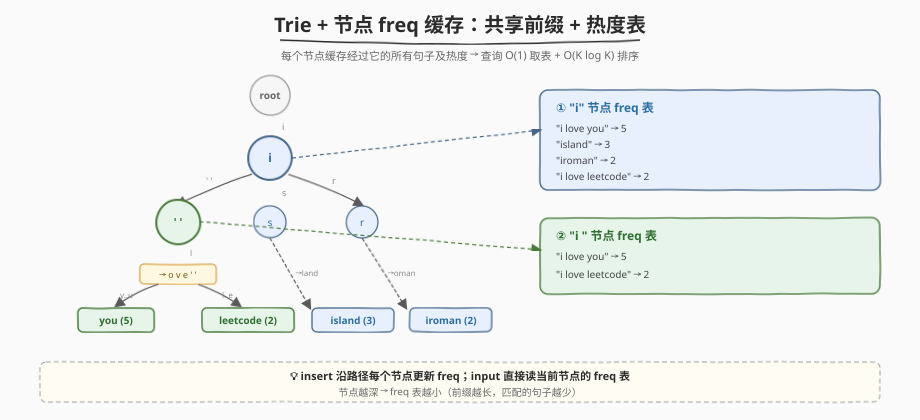
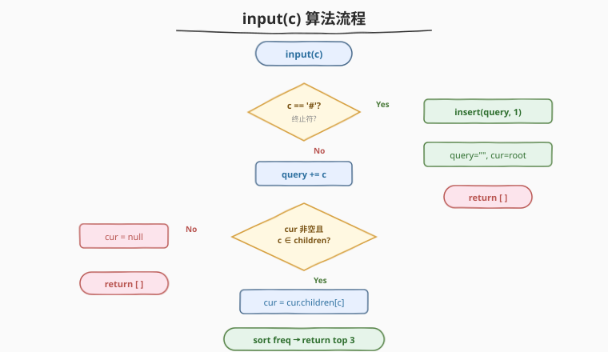
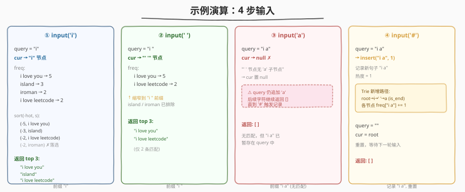

# LeetCode 设计搜索自动补全系统 题解

## 1. 题目概述

- **标题 / 题号**：设计搜索自动补全系统（#642，hard）
- **链接**：https://leetcode.cn/problems/design-search-autocomplete-system/
- **难度**：困难
- **标签**：字典树、设计、哈希表、字符串

**题意**：为搜索引擎设计一个**搜索自动补全系统**。用户逐字符输入句子（最多 100 字符，由小写字母、空格、数字组成），系统实时返回**与当前输入共享前缀**的历史热句中**热度最高的 3 条**。

规则：

- **热度** = 句子被完整输入的次数
- **同热度**时按 ASCII 码序排序（小的在前）
- 返回**至多 3 条**
- 输入 `'#'` 表示句子输入结束：系统记录该句（已存在则热度 +1，否则新建热度 1），并返回空数组

接口：

- `AutocompleteSystem(sentences, times)`：构造器，`sentences[i]` 的初始热度为 `times[i]`
- `input(c)`：用户输入字符 `c`，返回当前前缀的 top 3 热句；若 `c == '#'` 则记录句子并返回 `[]`

**示例**：

```text
AutocompleteSystem(["i love you","island","iroman","i love leetcode"], [5,3,2,2])

input('i')  → ["i love you","island","i love leetcode"]   // top 3：5, 3, 2（iroman 同为 2 但字典序更大）
input(' ')  → ["i love you","i love leetcode"]             // 前缀 "i "，只剩这两条
input('a')  → []                                            // 前缀 "i a" 无匹配
input('#')  → []                                            // 记录 "i a" 热度 1，重置输入
```

**约束**：

- `1 <= sentences.length <= 100`
- `1 <= times[i] <= 1000`
- `1 <= sentences[i].length <= 100`
- `sentences[i]` 由可打印 ASCII 字符组成（不含 `'#'`）
- 最多调用 `input` 5000 次

> 💡 这是 [208. 实现 Trie](../0201-0300/208_实现Trie.md) 的工程级扩展——不再只做 insert/search/startsWith，而是要在**每个前缀节点上缓存热度信息**，支持流式逐字符查询与增量更新。核心考点是「以空间换时间」的 Trie 节点设计。

## 2. 解题思路

### 2.1 暴力思路：哈希表 + 逐次扫描

维护一个哈希表 `freq` 记录 `句子 → 热度`。每次 `input(c)`（非 `'#'`）：

1. 将 `c` 追加到当前前缀 `prefix`
2. 遍历 `freq` 中**所有**句子，筛出以 `prefix` 开头的
3. 按 `(-热度, 句子)` 排序，取前 3 条

`input('#')` 时直接 `freq[prefix] += 1`，重置前缀。

时间：每次 input 需 $O(N \cdot L + K \log K)$（$N$ 个句子各做一次 $O(L)$ 前缀比较，再对 $K$ 条匹配结果排序）。$N=100$、$L=100$、5000 次调用下约 $5 \times 10^7$，能过但偏慢。

> ⚠️ 瓶颈：每次输入字符都要扫描**全体**句子做前缀匹配——大量无关句子被重复检查。Trie 的价值正在于此：**按前缀组织数据，只需走一条路径就能定位所有匹配句子**。

### 2.2 核心观察：Trie + 节点 freq 缓存



关键洞察：在 Trie 的**每个节点**上缓存一份 `freq` 表，记录**所有经过此节点的句子及其热度**。这样：

- **insert**：沿句子路径逐字符走，在**每个途径节点**的 `freq` 表中更新该句的热度
- **input(c)**：沿前缀走一步到达当前节点，直接读取该节点的 `freq` 表 → 排序 → 取 top 3

> 💡 这本质是**以空间换时间**：把"前缀匹配"从 $O(N \cdot L)$ 的线性扫描降到 $O(1)$ 的指针跳转 + $O(K \log K)$ 的排序（$K$ = 匹配句子数）。每个节点的 `freq` 表是该前缀下所有句子的"缓存视图"。

三个设计要点：

| 要点 | 说明 |
|------|------|
| **freq 表挂在每个节点上** | 而非只在叶节点。因为任意前缀（如 "i"、"i "）都可能被查询，对应中间节点也需快速返回匹配句子 |
| **insert 沿途更新** | 插入 "i love you" 时，root→i→' '→l→...→u 路径上**每个节点**的 freq 都要加入这条句子 |
| **cur 游标保持位置** | `input` 是逐字符调用的，用 `cur` 指针记住当前在 Trie 中的位置，每次只需走一步，无需从头遍历前缀 |

### 2.3 算法流程图



```
input(c):
  if c == '#':
      insert(query, 1)         // 记录当前句子，热度 +1
      query = ""               // 重置输入
      cur = root               // 重置游标
      return []

  query += c                   // 追加字符
  if cur == null or c not in cur.children:
      cur = null               // 标记"无匹配"状态
      return []                // 后续字符直到 '#' 都返回空

  cur = cur.children[c]        // 走一步
  // 从 cur.freq 排序取 top 3
  candidates = [(-hot, s) for s, hot in cur.freq]
  sort(candidates)
  return [s for _, s in candidates[:3]]

insert(sentence, hot):
  node = root
  for c in sentence:
      if c not in node.children:
          node.children[c] = new TrieNode()
      node = node.children[c]
      node.freq[sentence] += hot   // 每个途径节点都更新
```

**关键不变量**：

- `cur` 始终指向当前前缀在 Trie 中的对应节点。一旦某字符无匹配，`cur` 置 `null`，后续字符继续追加到 `query` 但返回空，直到 `'#'` 触发记录和重置。
- `'#'` 时 `query` 是用户输入的**完整句子**（不含 `'#'`），被 `insert` 记录。

### 2.4 示例演算



以构造 `AutocompleteSystem(["i love you","island","iroman","i love leetcode"], [5,3,2,2])` 后的 4 次输入为例：

| 步骤 | 输入 | query | cur 节点 | freq 表内容 | 返回 |
|------|------|-------|----------|-------------|------|
| ① | `'i'` | `"i"` | i 节点 | {i love you:5, island:3, iroman:2, i love leetcode:2} | `["i love you","island","i love leetcode"]` |
| ② | `' '` | `"i "` | ' ' 节点 | {i love you:5, i love leetcode:2} | `["i love you","i love leetcode"]` |
| ③ | `'a'` | `"i a"` | null（' ' 节点无 'a' 子节点） | — | `[]` |
| ④ | `'#'` | — | insert("i a", 1), 重置 | — | `[]` |

**步骤①详解**：`cur` 从 root 走到 `i` 节点，该节点 `freq` 缓存了所有以 "i" 开头的句子。排序：`(-5,"i love you") < (-3,"island") < (-2,"i love leetcode") < (-2,"iroman")`（同热度 $-2$ 时 "i love leetcode" 字典序更小），取 top 3。

**步骤③详解**：`' '` 节点下只有 `l` 子节点（通向 "love..."），无 `'a'`，`cur` 置 `null`。但 `query` 仍追加为 `"i a"`，等 `'#'` 时完整记录。

> 💡 **排序技巧**：用 `(-hot, sentence)` 作为排序键——取负热度使热度大的排前，同热度时句子按 ASCII 升序。一个 `sort` 搞定双关键字排序，无需自定义比较器。

## 3. 参考代码

### C++

```cpp
struct TrieNode {
    unordered_map<char, TrieNode*> children;
    unordered_map<string, int> freq;  // 该前缀下所有句子 → 热度
};

class AutocompleteSystem {
    TrieNode* root;
    TrieNode* cur;
    string query;

    void insert(const string& sentence, int hot) {
        TrieNode* node = root;
        for (char c : sentence) {
            if (!node->children.count(c))
                node->children[c] = new TrieNode();
            node = node->children[c];
            node->freq[sentence] += hot;  // 每个途径节点都缓存
        }
    }

  public:
    AutocompleteSystem(vector<string>& sentences, vector<int>& times) {
        root = new TrieNode();
        cur = root;
        for (int i = 0; i < sentences.size(); ++i)
            insert(sentences[i], times[i]);
    }

    vector<string> input(char c) {
        if (c == '#') {
            insert(query, 1);
            query.clear();
            cur = root;
            return {};
        }
        query += c;
        if (!cur || !cur->children.count(c)) {
            cur = nullptr;
            return {};
        }
        cur = cur->children[c];
        vector<pair<int, string>> cand;
        for (auto& [s, hot] : cur->freq)
            cand.push_back({-hot, s});
        sort(cand.begin(), cand.end());
        vector<string> res;
        for (int i = 0; i < min(3, (int)cand.size()); ++i)
            res.push_back(cand[i].second);
        return res;
    }
};
```

### Python

```python
class TrieNode:
    def __init__(self):
        self.children = {}       # char → TrieNode
        self.freq = {}           # sentence → hot（该前缀下的缓存）


class AutocompleteSystem:
    def __init__(self, sentences: list[str], times: list[int]):
        self.root = TrieNode()
        self.cur = self.root
        self.query = ""
        for s, t in zip(sentences, times):
            self._insert(s, t)

    def _insert(self, sentence: str, hot: int):
        node = self.root
        for c in sentence:
            if c not in node.children:
                node.children[c] = TrieNode()
            node = node.children[c]
            node.freq[sentence] = node.freq.get(sentence, 0) + hot

    def input(self, c: str) -> list[str]:
        if c == '#':
            self._insert(self.query, 1)
            self.query = ""
            self.cur = self.root
            return []
        self.query += c
        if not self.cur or c not in self.cur.children:
            self.cur = None
            return []
        self.cur = self.cur.children[c]
        cand = [(-hot, s) for s, hot in self.cur.freq.items()]
        cand.sort()
        return [s for _, s in cand[:3]]
```

> 💡 **C++ 细节**：`unordered_map<char, TrieNode*>` 支持任意字符（空格、数字等），无需像纯小写字母 Trie 那样用 `children[26]` 数组。`freq` 用 `unordered_map<string, int>` 直接缓存句子字符串，省去额外的索引映射。

## 4. 复杂度分析

| 维度 | 复杂度 | 说明 |
|------|--------|------|
| **构造** | $O(N \cdot L)$ | $N$ 个句子，每个长 $L$，沿路径在 $L$ 个节点更新 freq |
| **input（非 #）** | $O(K \log K)$ | 走一步 $O(1)$ + 对 $K$ 条匹配句子排序；$K \le N$ |
| **input（#）** | $O(L)$ | 插入句子，沿 $L$ 个节点更新 freq |
| **空间** | $O(N \cdot L^2)$ | 每个句子在 $L$ 个节点的 freq 表中各存一份字符串（$L$ 字符），共 $N$ 句 |

> ⚠️ **空间优化**：可将 freq 表存 `(sentence_id, hot)` 而非完整字符串，sentence 存在全局数组中——空间降到 $O(N \cdot L)$。本题 $N \le 100$、$L \le 100$，$10^6$ 级别可接受，不做此优化代码更直白。

## 5. 扩展：哈希表线性扫描解法

Trie 并非唯一解法。用一个全局哈希表 `freq: sentence → hot`，每次 input 线性扫描全体句子做前缀匹配：

```python
class AutocompleteSystem:
    def __init__(self, sentences: list[str], times: list[int]):
        self.freq = {}
        for s, t in zip(sentences, times):
            self.freq[s] = self.freq.get(s, 0) + t
        self.query = ""

    def input(self, c: str) -> list[str]:
        if c == '#':
            self.freq[self.query] = self.freq.get(self.query, 0) + 1
            self.query = ""
            return []
        self.query += c
        cand = [(-hot, s) for s, hot in self.freq.items() if s.startswith(self.query)]
        cand.sort()
        return [s for _, s in cand[:3]]
```

| 解法 | input 时间 | 空间 | 适用场景 |
|------|-----------|------|----------|
| 哈希表扫描 | $O(N \cdot L + K \log K)$ | $O(N \cdot L)$ | $N$ 小、代码简单 |
| **Trie + freq 缓存** | $O(K \log K)$ | $O(N \cdot L^2)$ | $N$ 大、查询快 |

> 💡 本题 $N \le 100$，两种解法都能 AC。面试中先讲哈希表暴力（$O(N \cdot L)$）再优化到 Trie（$O(K \log K)$），体现渐进优化思路——与 [692. 前 K 个高频单词](692_前K个高频单词.md) 的「全排序 → 最小堆」优化路径同构。

## 6. 面试要点

1. **为什么 Trie 的每个节点都要挂 freq 表？只在叶节点挂不行吗？**

   - 用户可能在任意前缀处查询（如只输入 "i" 或 "i "），对应的 Trie 节点在中间而非叶节点。若只在叶节点存 freq，中间节点查询时需 DFS 收集子树所有叶节点——退化为 $O(\text{子树大小})$。在每个节点缓存 freq 表，使任意前缀查询都是 $O(1)$ 取表 + $O(K \log K)$ 排序。

2. **cur 游标为什么不能每次从 root 重新走？**

   - 可以，但每次 input 需 $O(|query|)$ 从头遍历前缀。用 `cur` 游标记住当前位置，每次只走一步 $O(1)$——这对 5000 次调用的累积效果显著（从 $O(\sum |query_i|^2)$ 降到 $O(\sum |query_i|)$）。
   - 注意：一旦 `cur` 置 `null`（无匹配），后续字符仍追加到 `query` 但不再尝试走 Trie，直到 `'#'` 重置。

3. **排序键 `(-hot, sentence)` 为什么有效？**

   - Python / C++ 的 `sort` 默认升序。`-hot` 使热度大的排前（如 $-5 < -2$）；同热度时 `sentence` 按 ASCII 升序（如 "i love leetcode" < "iroman"）。一个键搞定双关键字排序，无需自定义比较器。

4. **`'#'` 输入时，句子是否包含 '#'？**

   - 不包含。`'#'` 是终止符，`query` 在追加 `'#'` 之前就已包含完整句子。`input('#')` 的处理是：`insert(query, 1)` 记录 `query`（不含 `'#'`），然后清空 `query` 并重置 `cur`。

5. **与 208（实现 Trie）的异同？**

   - 208 的 Trie 只做 insert/search/startsWith，节点存 `is_end` 标记。本题在此基础上：① 节点额外挂 `freq` 表（缓存该前缀下所有句子及热度）；② `input` 是逐字符流式调用，用 `cur` 游标保持位置；③ `'#'` 触发增量插入（热度 +1）。本质是 Trie 的「带权前缀缓存」扩展。

## 同类练习题

| # | 题目 | 与本题的关联 |
|---|------|-------------|
| 208 | [实现 Trie (前缀树)](https://leetcode.cn/problems/implement-trie-prefix-tree/) | Trie 基础模板，insert/search/startsWith，本题的前置知识 |
| 211 | [添加与搜索单词 - 数据结构设计](https://leetcode.cn/problems/design-add-and-search-words-data-structure/) | Trie + 通配符 `.` 匹配，节点结构的变体 |
| 648 | [单词替换](https://leetcode.cn/problems/replace-words/) | Trie 前缀匹配的最短词根，同属「前缀驱动查询」系列 |
| 692 | [前 K 个高频单词](https://leetcode.cn/problems/top-k-frequent-words/) | 同款 `(-freq, word)` 排序键，Trie 换成哈希表的 Top-K 问题 |
| 1268 | [搜索推荐系统](https://leetcode.cn/problems/search-suggestions-system/) | 排序 + 双指针/二分的前缀推荐，与本题同语义不同数据结构 |
