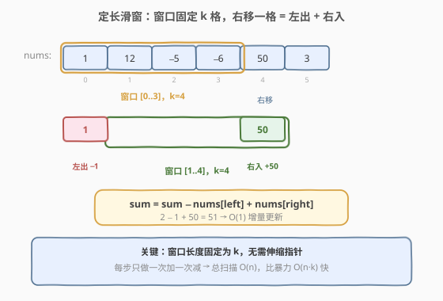
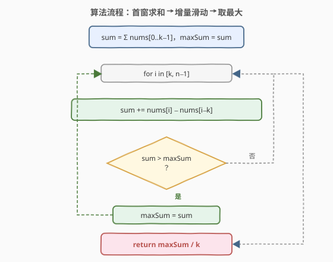
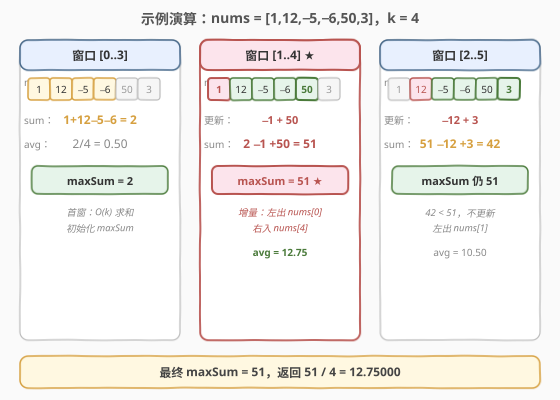

# LeetCode 子数组最大平均数 I 题解

## 1. 题目概述

- **标题 / 题号**：子数组最大平均数 I（#643，easy）
- **链接**：https://leetcode.cn/problems/maximum-average-subarray-i/
- **难度**：简单
- **标签**：数组、滑动窗口

**题意**：给定一个由 $n$ 个整数组成的数组 `nums` 和一个整数 `k`，找出**长度为 $k$ 的连续子数组**中**平均数最大**的那个，返回该最大平均数。答案误差不超过 $10^{-5}$ 即视为正确。

**示例 1**：

```text
输入：nums = [1,12,-5,-6,50,3], k = 4
输出：12.75000
解释：最大平均数 (12 - 5 - 6 + 50) / 4 = 51 / 4 = 12.75
```

**示例 2**：

```text
输入：nums = [5], k = 1
输出：5.00000
```

**约束**：

- $n == \text{nums.length}$
- $1 \leq k \leq n \leq 10^5$
- $-10^4 \leq \text{nums[i]} \leq 10^4$

> 💡 **关键点**：子数组长度**固定**为 $k$，不是「至多 $k$」也不是「至少 $k$」。固定长度意味着窗口无需伸缩，只需整体平移——这是滑动窗口的最简单形态。

## 2. 解题思路

### 2.1 暴力思路

枚举每个长度为 $k$ 的窗口起点 $i$（$0 \leq i \leq n-k$），逐个累加 $k$ 个元素求和，取最大值。每个窗口求和 $O(k)$，共 $O(n-k+1)$ 个窗口，总复杂度 $O(n \cdot k)$。当 $n = 10^5$、$k = n/2$ 时约 $5 \times 10^9$ 次运算，必然超时。

### 2.2 核心观察：固定长度 → 增量滑窗



窗口长度固定为 $k$，相邻两个窗口仅差**首尾两个元素**：窗口从 $[i, i+k-1]$ 右移到 $[i+1, i+k]$ 时，只**移出** `nums[i]`、**移入** `nums[i+k]`，中间 $k-1$ 个元素完全不变。

因此无需重新求和，只需做**一次加一次减**的增量更新：

$$\text{sum}_{\text{新}} = \text{sum}_{\text{旧}} - \text{nums}[i] + \text{nums}[i+k]$$

每个窗口的更新代价从 $O(k)$ 降为 $O(1)$，总复杂度 $O(n)$。

> 💡 **与 [209. 长度最小的子数组](../0201-0300/209_长度最小的子数组.md) 的对比**：209 是**变长滑窗**（左缩右扩，窗口长度不固定）；643 是**定长滑窗**（窗口长度恒为 $k$，整体平移）。定长滑窗更简单——不需要 `while` 循环收缩，只需每步固定「一进一出」。

### 2.3 算法流程图



维护变量：

- `sum`：当前窗口内 $k$ 个元素之和；
- `maxSum`：已扫过的所有窗口中最大的 `sum`。

**步骤**：

1. 先对首窗 `nums[0..k-1]` 求和，令 `sum = maxSum` = 该和（$O(k)$ 初始化）。
2. 从 `i = k` 到 `n-1` 遍历：
   - `sum += nums[i] - nums[i-k]`（移出左端旧元素，移入右端新元素）；
   - 若 `sum > maxSum`，更新 `maxSum = sum`。
3. 返回 `maxSum / k`（注意用浮点除法）。

> ⚠️ **精度提示**：不要在循环中每次除以 $k$ 比较平均数——多一次除法且引入浮点误差累积。应全程维护整数和 `maxSum`，**最后只做一次除法**，既快又准。

### 2.4 示例演算

以 `nums = [1,12,-5,-6,50,3], k = 4` 为例：



| 窗口 | 元素 | 增量更新 | sum | avg | maxSum |
|------|------|----------|-----|-----|--------|
| [0..3] | 1, 12, −5, −6 | 首窗求和 | 2 | 0.50 | 2 |
| [1..4] | 12, −5, −6, 50 | −1 + 50 | 51 | 12.75 | 51 ★ |
| [2..5] | −5, −6, 50, 3 | −12 + 3 | 42 | 10.50 | 51 |

最终 `maxSum = 51`，返回 $51 / 4 = 12.75000$。

## 3. 参考代码

### C++

```cpp
class Solution {
  public:
    double findMaxAverage(vector<int>& nums, int k) {
        int sum = 0;
        for (int i = 0; i < k; ++i) sum += nums[i];   // 首窗求和
        int maxSum = sum;
        for (int i = k; i < (int)nums.size(); ++i) {
            sum += nums[i] - nums[i - k];             // 增量更新：一进一出
            if (sum > maxSum) maxSum = sum;
        }
        return (double)maxSum / k;                    // 仅最后做一次除法
    }
};
```

### Python

```python
class Solution:
    def findMaxAverage(self, nums: List[int], k: int) -> float:
        s = sum(nums[:k])                  # 首窗求和
        max_sum = s
        for i in range(k, len(nums)):
            s += nums[i] - nums[i - k]     # 增量更新：一进一出
            if s > max_sum:
                max_sum = s
        return max_sum / k                 # 仅最后做一次除法
```

## 4. 复杂度分析

| 维度 | 复杂度 | 说明 |
|------|--------|------|
| 时间复杂度 | $O(n)$ | 首窗求和 $O(k)$ + 滑动 $n-k$ 步每步 $O(1)$，合计 $O(n)$ |
| 空间复杂度 | $O(1)$ | 仅用 `sum`/`maxSum` 两个变量，与输入规模无关 |

## 5. 扩展：前缀和写法

若用前缀和数组 `prefix[i] = nums[0..i-1]` 之和，则窗口 `[i, i+k-1]` 的和为 `prefix[i+k] - prefix[i]`，遍历所有 $i$ 取最大。本质与增量滑窗等价，但多开了一个 $O(n)$ 的前缀和数组，空间从 $O(1)$ 退化为 $O(n)$，**不推荐**——仅当题目同时需要查询任意区间和时才值得。

```cpp
double findMaxAverage(vector<int>& nums, int k) {
    int n = nums.size();
    vector<int> p(n + 1, 0);
    for (int i = 0; i < n; ++i) p[i + 1] = p[i] + nums[i];
    int maxSum = INT_MIN;
    for (int i = 0; i <= n - k; ++i)
        maxSum = max(maxSum, p[i + k] - p[i]);
    return (double)maxSum / k;
}
```

> 💡 本题 $n \leq 10^5$，元素范围 $[-10^4, 10^4]$，窗口和最大约 $10^9$，`int` 足够容纳（`INT_MAX ≈ 2.1 \times 10^9`）。若数据范围更大则需用 `long long`。

## 6. 面试要点

1. **为什么全程维护整数和、最后才除以 k？**
   - 浮点除法比整数加减慢；且多次除法引入舍入误差累积。维护整数和 `maxSum` 到最后只做一次除法，既高效又精确。

2. **定长滑窗和变长滑窗的区别？**
   - 定长滑窗窗口大小恒为 $k$，每步固定「左出一个、右入一个」，无需 `while` 收缩；变长滑窗（如 209）窗口大小可变，需要据条件判断扩缩方向。定长是变长的特例，更简单。

3. **为什么增量更新是 `nums[i] - nums[i-k]` 而非 `nums[i] - nums[i-1]`？**
   - 窗口长度为 $k$，从 `[i-k, i-1]` 滑到 `[i-k+1, i]`，移出的是左端 `nums[i-k]`，移入的是右端 `nums[i]`，二者相距 $k$ 格而非相邻。

4. **如果 k 很大（接近 n）会怎样？**
   - 窗口几乎覆盖整个数组，滑动步数 $n - k \approx 0$，但仍正确——首窗求和后几乎不滑。复杂度始终 $O(n)$。

5. **能否用 C++ `accumulate` 简化首窗求和？**
   - 可以：`int sum = accumulate(nums.begin(), nums.begin() + k, 0);`，等价于手写循环。面试中写哪种都行，手写更显基本功。

## 同类练习题

| # | 题目 | 与本题的关联 |
|---|------|-------------|
| 209 | [长度最小的子数组](https://leetcode.cn/problems/minimum-size-subarray-sum/)（[题解](../0201-0300/209_长度最小的子数组.md)） | 变长滑窗模板，对比定长 vs 变长的指针移动逻辑 |
| 239 | [滑动窗口最大值](https://leetcode.cn/problems/sliding-window-maximum/)（[题解](../0201-0300/239_滑动窗口最大值.md)） | 同样是定长 $k$ 滑窗，但求的是窗口内最大值而非和，需单调队列 |
| 713 | [乘积小于 K 的子数组](https://leetcode.cn/problems/subarray-product-less-than-k/) | 变长滑窗，把「和」换成「乘积」，对比增量更新的差异 |
| 346 | [数据流中的移动平均值](https://leetcode.cn/problems/moving-average-from-data-stream/) | 定长滑窗的数据流版本，一模一样的「一进一出」增量更新思路 |
