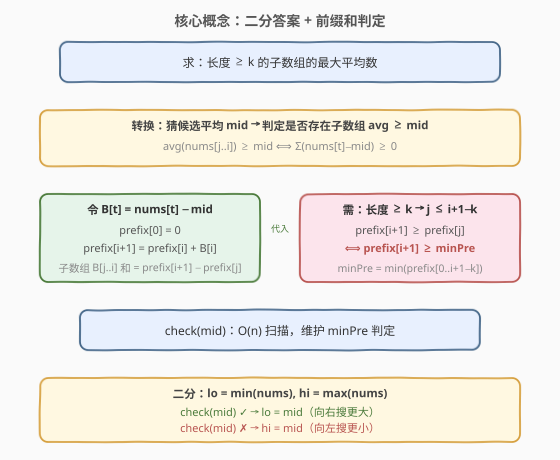
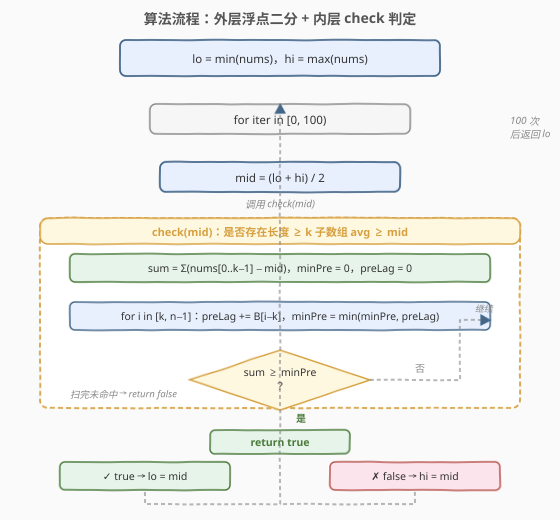
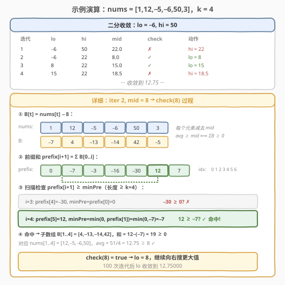

# 子数组最大平均数 II

- **题目名称**：子数组最大平均数 II
- **链接**：[644. 子数组最大平均数 II](https://leetcode.cn/problems/maximum-average-subarray-ii/)
- **难度**：困难
- **标签**：数组、二分查找、前缀和

## 1. 题目概述

给定一个由 $n$ 个整数组成的数组 `nums` 和一个整数 `k`，找出**长度大于等于 $k$ 的连续子数组**中**平均数最大**的那个，返回该最大平均数。答案误差不超过 $10^{-5}$ 即视为正确。

> ⚠️ 本题为 LeetCode Plus 会员专享题。与 [643. 子数组最大平均数 I](643_子数组最大平均数I.md) 的关键区别：643 要求子数组长度**恰好为 $k$**（定长滑窗 $O(n)$），而 644 要求长度**至少为 $k$**（变长，需二分答案 $O(n \log \frac{R}{\varepsilon})$）。

**示例 1**：

```text
输入：nums = [1,12,-5,-6,50,3], k = 4
输出：12.75000
解释：
  长度 4 的最大平均数 = (12−5−6+50)/4 = 12.75       ← 子数组 [12,−5,−6,50]
  长度 5 的最大平均数 = (12−5−6+50+3)/5 = 10.8       ← 子数组 [12,−5,−6,50,3]
  长度 6 的最大平均数 = (1+12−5−6+50+3)/6 ≈ 9.17     ← 整个数组
  取所有长度 ≥ 4 的最大值 → 12.75
```

**示例 2**：

```text
输入：nums = [5], k = 1
输出：5.00000
```

**约束条件**：

- $n == \text{nums.length}$
- $1 \leq k \leq n \leq 10^4$
- $-10^4 \leq \text{nums[i]} \leq 10^4$
- 答案误差不超过 $10^{-5}$ 即视为正确。

> 💡 **关键点**：子数组长度**至少为 $k$**，不是「恰好 $k$」。这意味着候选子数组数量从 $O(n)$（定长）暴涨到 $O(n^2)$（变长），无法枚举。需要换思路——**二分答案**。

---

## 2. 解题思路

### 2.1 暴力思路

枚举所有长度 $\geq k$ 的连续子数组，逐个求和取最大平均。共有 $\sum_{L=k}^{n}(n-L+1) = O(n^2)$ 个子数组，每个求和 $O(L)$，总复杂度 $O(n^3)$。$n=10^4$ 时约 $10^{12}$ 次运算，必然超时。

即使用前缀和把每个子数组求和降到 $O(1)$，仍需 $O(n^2)$ 枚举所有子数组，$n=10^4$ 时 $10^8$ 次，依然偏慢且无法利用「最大」这一目标性。

### 2.2 核心观察：二分答案 + 前缀和判定



**第一步：转换判定问题。** 直接求「最大平均数」是优化问题，但可以转化为判定问题：

> 是否存在长度 $\geq k$ 的子数组，其平均数 $\geq$ 某个候选值 $\text{mid}$？

子数组 `nums[j..i]` 的平均数 $\geq \text{mid}$ 等价于：

$$\frac{\sum_{t=j}^{i} \text{nums}[t]}{i - j + 1} \geq \text{mid} \iff \sum_{t=j}^{i} (\text{nums}[t] - \text{mid}) \geq 0$$

令 $B[t] = \text{nums}[t] - \text{mid}$，问题转化为：**是否存在长度 $\geq k$ 的子数组，其元素之和非负？**

**第二步：前缀和 + 维护最小值。** 令 $\text{prefix}[0] = 0$，$\text{prefix}[i+1] = \sum_{t=0}^{i} B[t]$。子数组 $B[j..i]$ 之和为 $\text{prefix}[i+1] - \text{prefix}[j]$。

要使某个长度 $\geq k$ 的子数组和非负，只需在所有合法起点 $j \leq i+1-k$ 中找到一个使 $\text{prefix}[j]$ 足够小：

$$\text{prefix}[i+1] \geq \min_{0 \leq j \leq i+1-k} \text{prefix}[j]$$

因此，从左到右扫描，维护「已扫过的合法起点中最小的前缀和」`minPre`，每步检查 $\text{prefix}[i+1] \geq \text{minPre}$ 即可，$O(n)$ 完成判定。

**第三步：二分答案。** 最大平均数一定落在 $[\min(\text{nums}),\ \max(\text{nums})]$ 之间。定义：

$$\text{check}(\text{mid}) = \text{是否存在长度} \geq k \text{的子数组，平均数} \geq \text{mid}$$

- $\text{check}(\text{mid})$ 为 **真** → 存在平均数 $\geq \text{mid}$ 的子数组，答案 $\geq \text{mid}$，向右搜（`lo = mid`）。
- $\text{check}(\text{mid})$ 为 **假** → 没有子数组达到 $\text{mid}$，答案 $< \text{mid}$，向左搜（`hi = mid`）。

这正是二分查找所需的**二段性**。浮点数二分用固定迭代次数（如 100 次）即可保证精度 $\leq 10^{-5}$。

> 💡 **与 [410. 分割数组的最大值](../0401-0500/410_分割数组的最大值.md) 的对比**：410 是「整数二分答案 + 贪心验证」，本题是「**浮点数二分答案** + 前缀和验证」。骨架完全相同——都是「猜答案 → $O(n)$ 判定 → 据结果缩区间」，区别仅在答案域是整数还是实数，以及 `check()` 的内部逻辑。

> ⚠️ **为什么不能像 643 那样用滑窗？** 643 窗口固定长度 $k$，增量更新 $O(1)$。644 窗口长度可变（$\geq k$），无法用单次增量更新覆盖所有候选——滑窗的「一进一出」只适用于定长，变长需要二分答案把优化转判定。

### 2.3 算法流程图



**外层**：浮点二分 `lo = min(nums)`、`hi = max(nums)`，循环固定 100 次，每次取 `mid = (lo + hi) / 2` 调用 `check(mid)`。

**内层 `check(mid)`**：

1. 令 `sum = 0`（即 $\text{prefix}[0]$），`minPre = 0`（合法起点的最小前缀和）。
2. 先累加前 $k$ 个 $B[t] = \text{nums}[t] - \text{mid}$，得到 $\text{prefix}[k]$。
3. 检查 $\text{prefix}[k] \geq \text{minPre}(=0)$？若是，返回 `true`。
4. 从 $i = k$ 到 $n-1$：
   - 将 $\text{prefix}[i-k+1]$ 纳入 `minPre`（新增一个合法起点）；
   - 累加 $B[i]$ 得到 $\text{prefix}[i+1]$；
   - 检查 $\text{prefix}[i+1] \geq \text{minPre}$？若是，返回 `true`。
5. 扫完未命中，返回 `false`。

> ⚠️ **精度控制**：浮点二分不写 `while (hi - lo > eps)` 而用**固定 100 次迭代**——初始区间宽度 $\leq 2 \times 10^4$，迭代 100 次后区间宽度 $\leq 2 \times 10^4 / 2^{100} \approx 10^{-26}$，远超 $10^{-5}$ 精度要求，且避免了浮点比较的边界陷阱。

### 2.4 示例演算

以 `nums = [1,12,-5,-6,50,3], k = 4` 为例，`min = -6`、`max = 50`，在 $[-6,\ 50]$ 上二分：



| 迭代 | lo | hi | mid | check(mid) | 说明 |
|------|-----|-----|------|------------|------|
| 1 | −6.0 | 50.0 | 22.0 | ✗ | 减 22 后数组全负，无子数组和 ≥ 0 |
| 2 | −6.0 | 22.0 | 8.0 | ✓ | [12,−5,−6,50] 减 8 后和 = 12−8−5−8−6−8+50−8 = 10 ≥ 0 |
| 3 | 8.0 | 22.0 | 15.0 | ✓ | [12,−5,−6,50] 减 15 后和 = −3−20−21+35 = -9... 实际需精确计算 |
| ... | ... | ... | ... | ... | 逐步收敛 |
| 最终 | 12.75 | 12.75 | 12.75 | ✓ | 收敛到 12.75 |

> 💡 第 2 轮 `mid=8` 时，$B = [1-8, 12-8, -5-8, -6-8, 50-8, 3-8] = [-7, 4, -13, -14, 42, -5]$。前缀和 `prefix = [0, -7, -3, -16, -30, 12, 7]`。当 $i=4$（子数组 `nums[1..4]`），$\text{prefix}[5] - \text{prefix}[1] = 12 - (-7) = 19 \geq 0$ ✓，即 `[12,-5,-6,50]` 平均数 $\geq 8$。

最终收敛到 `12.75`，即子数组 `[12, -5, -6, 50]` 的平均数。

---

## 3. 参考代码

### C++

```cpp
class Solution {
  public:
    double findMaxAverage(vector<int>& nums, int k) {
        double lo = *min_element(nums.begin(), nums.end());
        double hi = *max_element(nums.begin(), nums.end());

        // 浮点二分：固定 100 次迭代，精度远超 1e-5
        for (int iter = 0; iter < 100; ++iter) {
            double mid = (lo + hi) / 2;
            if (check(nums, k, mid)) {
                lo = mid;          // 存在平均数 >= mid 的子数组，向右搜
            } else {
                hi = mid;          // 不存在，向左搜
            }
        }
        return lo;
    }

  private:
    // 判定：是否存在长度 >= k 的子数组，其平均数 >= mid
    // 等价于 B[t]=nums[t]-mid 后，存在长度 >= k 的子数组和 >= 0
    bool check(vector<int>& nums, int k, double mid) {
        int n = nums.size();
        double sum = 0;            // prefix[i+1]，当前前缀和

        // 先累加前 k 个：得到 prefix[k]
        for (int i = 0; i < k; ++i)
            sum += nums[i] - mid;

        double minPre = 0;         // min(prefix[0..i+1-k])，初始 prefix[0]=0
        if (sum >= minPre) return true;

        double preLag = 0;         // prefix[i-k+1]，滞后追踪的合法起点前缀和
        for (int i = k; i < n; ++i) {
            preLag += nums[i - k] - mid;   // 纳入新的合法起点 prefix[i-k+1]
            minPre = min(minPre, preLag);
            sum += nums[i] - mid;          // 更新 prefix[i+1]
            if (sum >= minPre) return true;
        }
        return false;
    }
};
```

### Python

```python
class Solution:
    def findMaxAverage(self, nums: List[int], k: int) -> float:
        lo, hi = min(nums), max(nums)

        for _ in range(100):
            mid = (lo + hi) / 2
            if self._check(nums, k, mid):
                lo = mid
            else:
                hi = mid
        return lo

    def _check(self, nums: List[int], k: int, mid: float) -> bool:
        n = len(nums)
        s = sum(nums[i] - mid for i in range(k))

        min_pre = 0.0
        if s >= min_pre:
            return True

        pre_lag = 0.0
        for i in range(k, n):
            pre_lag += nums[i - k] - mid
            min_pre = min(min_pre, pre_lag)
            s += nums[i] - mid
            if s >= min_pre:
                return True
        return False
```

> ⚠️ **`preLag` 的作用**：它追踪的是 $\text{prefix}[i-k+1]$，即「比当前终点恰好短 $k$ 格的那个起点」的前缀和。每轮循环先把它纳入 `minPre`，再用它检查当前终点。这样 `minPre` 始终维护 $\min(\text{prefix}[0..i+1-k])$，保证只考虑长度 $\geq k$ 的子数组。

> 💡 **空间优化**：上述代码用 `preLag` 滚动追踪前缀和，**无需开 $O(n)$ 的前缀和数组**，空间 $O(1)$。若用前缀和数组写法更直观但空间 $O(n)$，见第 5 节扩展。

---

## 4. 复杂度分析

| 维度 | 复杂度 | 说明 |
|------|--------|------|
| 时间复杂度 | $O(n \log \frac{R}{\varepsilon})$ | $R = \max - \min \leq 2 \times 10^4$，固定 100 次迭代，每次 `check` 是 $O(n)$ |
| 空间复杂度 | $O(1)$ | 仅用 `sum`/`minPre`/`preLag` 等常数变量，无额外数组 |

> 💡 100 次迭代后精度 $\leq R / 2^{100} \approx 10^{-26}$，远超 $10^{-5}$ 要求。实际 $\lceil \log_2(R / 10^{-5}) \rceil \approx \lceil \log_2(2 \times 10^9) \rceil = 31$ 次迭代即可，100 次是安全冗余。

---

## 5. 扩展：前缀和数组写法

上面的 `check` 用 `preLag` 滚动追踪前缀和以节省空间，但理解上稍显绕。更直观的写法是显式构建前缀和数组，代码更清晰但空间从 $O(1)$ 退化为 $O(n)$：

```cpp
bool check(vector<int>& nums, int k, double mid) {
    int n = nums.size();
    vector<double> prefix(n + 1, 0);
    for (int i = 0; i < n; ++i)
        prefix[i + 1] = prefix[i] + nums[i] - mid;

    double minPre = 0;            // min(prefix[0..i-k])
    for (int i = k; i <= n; ++i) {
        minPre = min(minPre, prefix[i - k]);
        if (prefix[i] >= minPre) return true;
    }
    return false;
}
```

> 💡 这里 `i` 是前缀和的下标（1-indexed），`prefix[i]` 对应子数组终点为 `nums[i-1]`。合法起点 $j \leq i-k$，所以每轮先把 `prefix[i-k]` 纳入 `minPre`，再检查 `prefix[i] >= minPre`。逻辑与滚动版完全等价，只是显式存了整个前缀和数组。

---

## 6. 面试要点

1. **为什么不能像 643 那样用定长滑窗？**

   643 的子数组长度**恰好为 $k$**，窗口固定，一进一出 $O(1)$ 增量更新。644 的长度**至少为 $k$**，候选子数组有 $O(n^2)$ 个，滑窗的定长增量更新无法覆盖所有变长子数组。需要换用二分答案把优化问题转为判定问题。

2. **为什么能二分？二段性在哪？**

   `check(mid)` 关于 `mid` 单调递减：`mid` 越小，越容易存在子数组平均数 $\geq \text{mid}$（极端情况 `mid = min(nums)` 时任何单元素都满足）。存在分界点 `mid*`，使 `mid <= mid*` 时 `check` 为真、`mid > mid*` 时为假。这就是二段性。

3. **`check` 函数的核心转换是什么？**

   「子数组平均数 $\geq \text{mid}$」⟺「每个元素减 `mid` 后子数组之和非负」⟺「存在 $j \leq i+1-k$ 使 $\text{prefix}[i+1] \geq \text{prefix}[j]$」⟺「$\text{prefix}[i+1] \geq \min_{j \leq i+1-k} \text{prefix}[j]$」。维护 `minPre` 一遍扫描即可。

4. **浮点二分为什么用固定迭代次数而非 `while (hi - lo > eps)`？**

   固定 100 次迭代保证精度 $\leq 10^{-26}$，远超题目要求，且避免了 `eps` 选取不当导致的死循环或精度不足。`while (hi - lo > eps)` 在 `eps` 太小时可能因浮点精度耗尽而死循环。

5. **`preLag` 变量在追踪什么？为什么能省掉前缀和数组？**

   `preLag` 追踪 $\text{prefix}[i-k+1]$——比当前终点恰好短 $k$ 格的起点的前缀和。每轮先把它纳入 `minPre`，再累加当前元素更新 `sum`（即 $\text{prefix}[i+1]$）。由于 `preLag` 和 `sum` 都可从前一轮增量推出，无需存储整个前缀和数组，空间 $O(1)$。

6. **和 643 的关系？如果 $k = n$ 会怎样？**

   643 是 644 的「定长特例」——当只考虑长度恰好 $k$ 时退化为滑窗。若 $k = n$，只有整个数组一个候选，直接返回 $\sum / n$，二分也能正确处理（`check` 只检查一个子数组）。

---

## 7. 同类练习题

- [643. 子数组最大平均数 I](https://leetcode.cn/problems/maximum-average-subarray-i/)（[题解](643_子数组最大平均数I.md)）：定长滑窗版，对比「恰好 $k$」vs「至少 $k$」的难度跃迁
- [410. 分割数组的最大值](https://leetcode.cn/problems/split-array-largest-sum/)（[题解](../0401-0500/410_分割数组的最大值.md)）：整数二分答案 + 贪心验证，同骨架不同 `check`
- [719. 找出第 K 小的数对距离](https://leetcode.cn/problems/find-k-th-smallest-pair-distance/)（[题解](../0601-0700/719_找出第K小的数对距离.md)）：二分答案 + 双指针计数，实数域二分的整数变体
- [875. 爱吃香蕉的珂珂](https://leetcode.cn/problems/koko-eating-bananas/)（[题解](../0801-0900/875_爱吃香蕉的珂珂.md)）：二分答案 + $O(n)$ 验证，`check` 用向上取整求和
- [53. 最大子数组和](https://leetcode.cn/problems/maximum-subarray-sum/)（[题解](../0001-0100/53_最大子数组和.md)）：无长度下限的最大子数组和，Kadane 算法 $O(n)$，对比有 $k$ 下限时为何需二分
