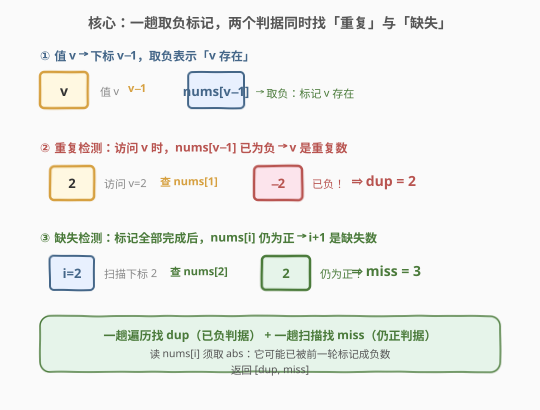
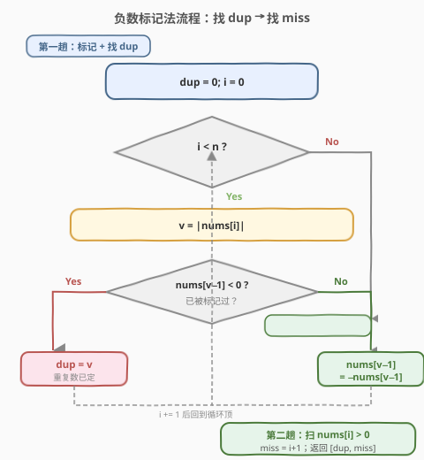
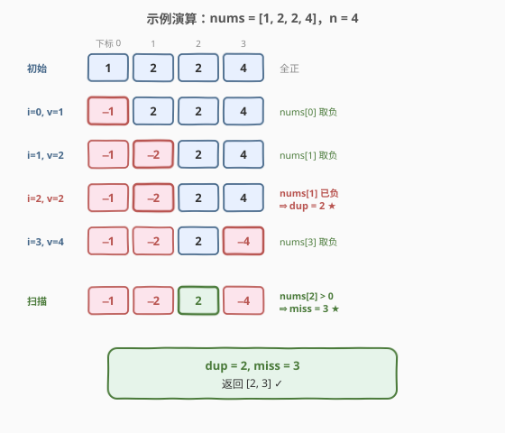

# LeetCode 错误的集合 题解

## 1. 题目概述

- **标题 / 题号**：错误的集合（#645，easy）
- **链接**：https://leetcode.cn/problems/set-mismatch/
- **难度**：简单
- **标签**：数组、原地哈希、原地标记、数学

**题意**：集合 `s` 包含从 $1$ 到 $n$ 的整数。因为数据错误，集合里某一个数字被**复制**成了集合里另外一个数字的值，导致集合**丢失了一个数字**且**有一个数字重复**。

给定代表错误后结果的数组 `nums`，请找出**重复出现的整数**和**丢失的整数**，以数组 `[重复数, 丢失数]` 形式返回。

**示例 1**：

```text
输入：nums = [1,2,2,4]
输出：[2,3]
解释：n = 4，原本应为 {1,2,3,4}，3 被复制成了 2，故重复 2、缺失 3。
```

**示例 2**：

```text
输入：nums = [1,1]
输出：[1,2]
解释：n = 2，原本应为 {1,2}，2 被复制成了 1，故重复 1、缺失 2。
```

**约束**：

- $2 \leq \text{nums.length} \leq 10^4$
- $1 \leq \text{nums}[i] \leq 10^4$
- $\text{nums.length} = n$，且 `nums` 恰由 $[1, n]$ 中 $n$ 个数构成（一数重复、一数缺失）

> 💡 **关键前提**：值域恰好为 $[1, n]$，与下标域 $[0, n-1]$ 长度相同——这正是「下标当哈希键」能用上的根本原因，与 [448. 找到所有数组中消失的数字](../0401-0500/448_找到所有数组中消失的数字.md) 同源。本题更进一步：**一趟标记同时找出重复与缺失**。

## 2. 解题思路

### 2.1 暴力思路

- **哈希集合**：把所有数放进 `set`，遍历时第一次「已存在」即为重复；再遍历 $1 \sim n$ 查谁不在 `set` 中即为缺失。时间 $O(n)$，但集合占 $O(n)$ 额外空间。
- **计数数组**：开长度 $n+1$ 的 `count[]` 统计出现次数，`count[v] == 2` 即重复，`count[v] == 0` 即缺失。同样 $O(n)$ 空间。

> ⚠️ 两种朴素做法都败在「外部容器占 $O(n)$ 空间」。突破口是利用数组自身当哈希表——既然值域恰好是 $[1, n]$，一个值 $v$ 天然对应下标 $v-1$，可以在原数组上「打标记」同时记录存在性。

### 2.2 核心观察：下标当哈希键，一趟标记同时找重复与缺失



关键观察有两点，分别对应「重复」与「缺失」：

1. **重复检测——「已负」判据**：遍历时对每个值 $v = |\text{nums}[i]|$，去检查下标 $v-1$ 处。若 `nums[v-1]` **已为负数**，说明值 $v$ 在此之前已经被标记过一次——那「之前那次」与「当前这次」是两个相同的 $v$，故 $v$ 就是**重复数**。
2. **缺失检测——「仍正」判据**：标记全部完成后，再扫一遍。若下标 $i$ 处 `nums[i]` **仍为正数**，说明没有任何一个值 $i+1$ 来标记过它——即值 $i+1$ **从未出现**，就是**缺失数**。

> 💡 **与 448 的关系**：448 只需找「缺失」（仍正判据）；本题多了一个「重复」（已负判据）。两个判据共用同一趟标记，无需额外遍历——这是把 448 模板「升级」一步即可解决的综合题。模板相同，多记一行判据之差。

### 2.3 算法流程图



算法分两趟：

**第一趟——标记并找重复**：

1. 初始化 `dup = 0`，`i` 从 $0$ 扫到 $n-1$。
2. 令 $v = |\text{nums}[i]|$（取绝对值还原原始值）。
3. 若 `nums[v - 1] < 0`：说明 $v$ 之前已标记过 → `dup = v`。
4. 否则：`nums[v - 1] = -nums[v - 1]`（标记 $v$ 存在）。

**第二趟——找缺失**：

5. `i` 从 $0$ 扫到 $n-1$。
6. 若 `nums[i] > 0`：说明值 $i+1$ 从未被标记 → `miss = i + 1`。
7. 返回 `[dup, miss]`。

> ⚠️ 第一趟的「已负」判据只在**首次重复**时触发记录；若重复值出现第三次以上，`nums[v-1]` 早已为负，判据仍会再次成立——但题目保证恰有一个重复数，最多被访问两次，无需担心覆盖。第二趟只看正负号定位缺失，与第一趟记录的 `dup` 互不干扰。

### 2.4 示例演算

以 `nums = [1, 2, 2, 4]`，$n = 4$ 为例：



| 步骤 | i | \|nums[i]\| | 判据 | 数组状态 | 结论 |
|------|---|-------------|------|----------|------|
| 初始 | — | — | — | [1, 2, 2, 4] | 全正 |
| 1 | 0 | 1 | nums[0] > 0 → 取负 | [**−1**, 2, 2, 4] | 标记值 1 存在 |
| 2 | 1 | 2 | nums[1] > 0 → 取负 | [−1, **−2**, 2, 4] | 标记值 2 存在 |
| 3 | 2 | 2 | nums[1] < 0 → 已负 | [−1, −2, 2, 4] | **dup = 2** ★ |
| 4 | 3 | 4 | nums[3] > 0 → 取负 | [−1, −2, 2, **−4**] | 标记值 4 存在 |
| 扫描 | 2 | — | nums[2] > 0 → 仍正 | [−1, −2, **2**, −4] | **miss = 3** ★ |

最终结果为 **[2, 3]** ✓。下标 2 仍为正数，对应值 3 从未出现；下标 1 在第 3 步被发现已负，对应值 2 重复。

## 3. 参考代码

### C++

```cpp
class Solution {
  public:
    vector<int> findErrorNums(vector<int>& nums) {
        int n = nums.size();
        int dup = 0;
        for (int i = 0; i < n; ++i) {
            int v = abs(nums[i]);
            if (nums[v - 1] < 0) {
                dup = v;                       // 已负 → v 是重复数
            } else {
                nums[v - 1] = -nums[v - 1];   // 取负标记 v 存在
            }
        }
        int miss = 0;
        for (int i = 0; i < n; ++i) {
            if (nums[i] > 0) {                 // 仍正 → i+1 是缺失数
                miss = i + 1;
                break;
            }
        }
        return {dup, miss};
    }
};
```

### Python

```python
class Solution:
    def findErrorNums(self, nums: List[int]) -> List[int]:
        n = len(nums)
        dup = 0
        for i in range(n):
            v = abs(nums[i])
            if nums[v - 1] < 0:
                dup = v                       # 已负 → v 是重复数
            else:
                nums[v - 1] = -nums[v - 1]   # 取负标记 v 存在
        miss = next(i + 1 for i in range(n) if nums[i] > 0)  # 仍正 → i+1 缺失
        return [dup, miss]
```

> 💡 与 [448](../0401-0500/448_找到所有数组中消失的数字.md) 的代码对比：仅多了一行 `if nums[v-1] < 0: dup = v`（已负判据）。448 只收集「仍正」的缺失数；645 额外记录「已负」的重复数。同模板、同复杂度，多一行判据之差。

## 4. 复杂度分析

| 维度 | 复杂度 | 说明 |
|------|--------|------|
| 时间复杂度 | $O(n)$ | 第一趟标记 $n$ 次 + 第二趟扫描最坏 $n$ 次，每次 $O(1)$，合计 $2n$ |
| 空间复杂度 | $O(1)$ | 仅用 `dup`/`miss` 常数变量，原地修改输入数组；返回数组不计入额外空间 |

> 💡 本题最优解：时间已达下界 $O(n)$（必须至少看一遍所有元素），空间为常数。代价是**破坏原数组**（值被取负，仅保留正负号信息）。若面试官要求「不能修改输入」，见第 5 节的数学法与异或法。

## 5. 扩展：不修改数组的两种解法

原地标记法虽优，但会破坏输入。若题目加「不可修改数组」约束（如 [287. 寻找重复数](../0201-0300/287_寻找重复数.md) 那样），可用以下两种 $O(n)$ 时间、$O(1)$ 空间且**不修改数组**的解法。

### 5.1 数学法：求和 + 平方和

设重复数为 $d$、缺失数为 $m$。利用等差求和公式列出两个方程：

$$
\begin{cases}
\text{sum(nums)} - \dfrac{n(n+1)}{2} = d - m & \text{(求和差)} \\[6pt]
\text{sum}(x^2) - \dfrac{n(n+1)(2n+1)}{6} = d^2 - m^2 & \text{(平方和差)}
\end{cases}
$$

由 $d^2 - m^2 = (d - m)(d + m)$，令 $\Delta_1 = d - m$、$\Delta_2 = d^2 - m^2$，则：

$$
d + m = \dfrac{\Delta_2}{\Delta_1}, \qquad
d = \dfrac{\Delta_1 + \Delta_2 / \Delta_1}{2}, \qquad
m = d - \Delta_1
$$

```python
class Solution:
    def findErrorNums(self, nums: List[int]) -> List[int]:
        n = len(nums)
        s_exp = n * (n + 1) // 2
        s2_exp = n * (n + 1) * (2 * n + 1) // 6
        s_act = sum(nums)
        s2_act = sum(x * x for x in nums)
        d1 = s_act - s_exp              # d - m
        d2 = s2_act - s2_exp            # d^2 - m^2
        d = (d1 + d2 // d1) // 2        # d = (d1 + d2/d1) / 2
        m = d - d1
        return [d, m]
```

> ⚠️ **溢出风险**：$n = 10^4$ 时，平方和最大约 $10^4 \times (10^4)^2 = 10^{12}$，超出 32 位 `int`（约 $2.1 \times 10^9$）。C++ 须用 `long long`；Python 整数无限精度无此问题。这是数学法相对于异或法的唯一短板。

### 5.2 异或法：不修改数组、无溢出风险

把 `nums` 全体与 $1 \sim n$ 全体异或，所有「正常数」出现两次互相抵消，只剩下 $d \oplus m$（重复数出现三次抵消两次剩一次，缺失数出现零次剩一次）：

$$
\text{xor} = \bigoplus_{i=0}^{n-1} \text{nums}[i] \oplus \bigoplus_{i=1}^{n} i = d \oplus m
$$

接下来套用 [260. 只出现一次的数字 III](https://leetcode.cn/problems/single-number-iii/) 的分组异或法：取 `xor` 的任一为 1 的位（如最低位 `lowbit = xor & -xor`），按该位把 `nums` 与 $1 \sim n$ 分成两组分别异或，得到两个数 $a, b$——其一为 $d$、另一为 $m$。最后扫一遍 `nums` 判定哪个是重复数（出现在数组中的那个即 $d$）。

```python
class Solution:
    def findErrorNums(self, nums: List[int]) -> List[int]:
        n = len(nums)
        xor = 0
        for x in nums:
            xor ^= x
        for i in range(1, n + 1):
            xor ^= i               # xor = d ^ m
        lowbit = xor & -xor        # 任一区分位
        a = b = 0
        for x in nums:
            if x & lowbit:
                a ^= x
            else:
                b ^= x
        for i in range(1, n + 1):
            if i & lowbit:
                a ^= i
            else:
                b ^= i
        # a, b 是 d 与 m，但顺序未知：出现在 nums 中的是重复数
        for x in nums:
            if x == a:
                return [a, b]
        return [b, a]
```

> 💡 **三种解法对比**：
>
> | 解法 | 时间 | 空间 | 修改数组 | 溢出风险 | 实现难度 |
> |------|------|------|----------|----------|----------|
> | 负数标记 | $O(n)$ | $O(1)$ | 是 | 无 | 低 |
> | 数学求和 | $O(n)$ | $O(1)$ | 否 | 有（C++ 需 `long long`） | 低 |
> | 异或分组 | $O(n)$ | $O(1)$ | 否 | 无 | 中 |
>
> 默认推荐负数标记法（最简洁、与 448 同模板）；若要求不改数组，优先异或法（无溢出、普适）。

## 6. 面试要点

1. **为什么遍历时读 `nums[i]` 要取 `abs`？**
   - `nums[i]` 可能在前几轮被别的值标记成负数（如值 3 标记了 `nums[2]`，之后遍历到下标 2 时读到负数）。直接用负数去算 `v-1` 会越界。取 `abs` 还原原始值才能正确定位标记位置。

2. **「已负」判据为什么能准确找到重复数？**
   - 一个值 $v$ 第一次被访问时，`nums[v-1]` 为正，我们取负标记。若 $v$ 是重复数，它会被第二次访问——此时 `nums[v-1]` 已为负，触发 `dup = v`。题目保证恰有一个重复数，故该判据恰好触发一次。

3. **「仍正」判据为什么能准确找到缺失数？**
   - 若值 $m$ 缺失，则没有任何一次访问会去标记 `nums[m-1]`（因为没人会取到 $v = m$）。故 `nums[m-1]` 全程保持正数，扫描时被「仍正」判据捕获。

4. **数学法为什么要用平方和？只用求和不行吗？**
   - 只用求和只能得到 $d - m$ 一个方程，两个未知数无法定解。再加平方和得到 $d^2 - m^2$ 第二个方程，两式联立即可解出 $d$ 与 $m$。本质是用两个独立约束消元。

5. **异或法为什么最后还要扫一遍判定 a/b 谁是 dup？**
   - 分组异或只能得出「这两个数是 $d$ 和 $m$」，但无法区分谁是谁。因为 $d$ 出现在 `nums` 中而 $m$ 不出现，所以扫一遍看 $a$ 是否在 `nums` 中即可定序。

## 同类练习题

| # | 题目 | 与本题的关联 |
|---|------|-------------|
| 448 | [找到所有数组中消失的数字](https://leetcode.cn/problems/find-all-numbers-disappeared-in-an-array/)（[题解](../0401-0500/448_找到所有数组中消失的数字.md)） | 本题的母题，同模板只找「缺失」（仍正判据），645 在其基础上加一行「已负」判据找重复 |
| 442 | [数组中重复的数据](https://leetcode.cn/problems/find-all-duplicates-in-an-array/) | 448 的对偶，同模板只找「重复」（已负判据），645 = 448 + 442 的合体 |
| 287 | [寻找重复数](https://leetcode.cn/problems/find-the-duplicate-number/)（[题解](../0201-0300/287_寻找重复数.md)） | 只找一个重复数且**不可修改数组**， Floyd 快慢指针判环法，对比第 5 节异或法的适用场景 |
| 268 | [丢失的数字](https://leetcode.cn/problems/missing-number/) | 只找一个缺失数，异或法或求和法的最简热身版 |
| 260 | [只出现一次的数字 III](https://leetcode.cn/problems/single-number-iii/) | 分组异或法的招牌题，第 5.2 节异或解法直接套用其模板 |
