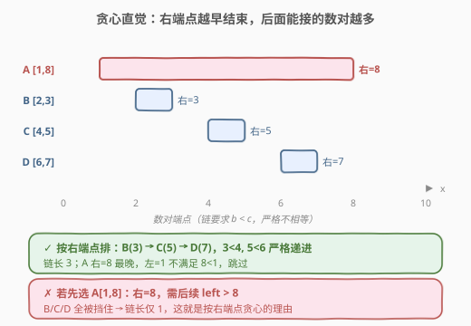
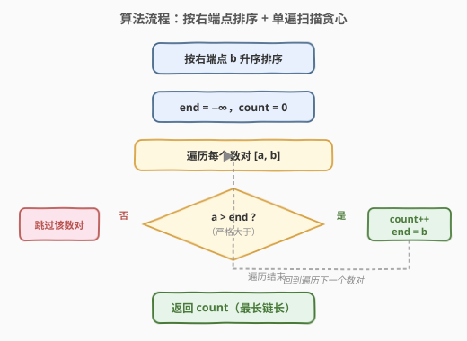
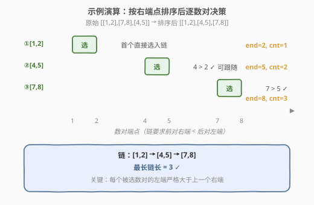

# 最长数对链

- **题目名称**：最长数对链
- **链接**：[646. 最长数对链](https://leetcode.cn/problems/maximum-length-of-pair-chain/)
- **难度**：中等
- **标签**：贪心、区间调度、排序、动态规划

## 1. 题目概述

给定 `n` 个数对 `pairs`，其中 `pairs[i] = [left_i, right_i]` 且 `left_i < right_i`。定义**跟随**关系：数对 `p2 = [c, d]` 可以跟在 `p1 = [a, b]` 后面，当且仅当 `b < c`（**严格小于**）。用这种关系构造**数对链**，返回能形成的**最长数对链的长度**。

不需要用到所有数对，可以**以任何顺序**选择其中的一些数对来构造链。

**示例 1**：

```text
输入：pairs = [[1,2], [2,3], [3,4]]
输出：2
解释：最长数对链是 [1,2] -> [3,4]。
      注意 [1,2] -> [2,3] 不合法，因为 2 < 2 不成立（严格小于）。
```

**示例 2**：

```text
输入：pairs = [[1,2], [7,8], [4,5]]
输出：3
解释：最长数对链是 [1,2] -> [4,5] -> [7,8]，长度为 3。
```

**约束条件**：

- `n == pairs.length`
- `1 <= n <= 1000`
- `-1000 <= left_i < right_i <= 1000`

> 💡 这道题是经典的**区间调度问题**（Interval Scheduling）——求「最多互不冲突的区间数」。它和 [435. 无重叠区间](../0401-0500/435_无重叠区间.md) 是一枚硬币的两面：435 求「最少移除多少」= `n - 最长链`，646 直接求「最长链」。但有一个**关键细节差异**：435 视端点相触为不重叠（`[1,2]` 与 `[2,3]` 可共存），而 646 要求**严格** `b < c`（`[1,2]` 与 `[2,3]` **不能**链）。这一字之差，把代码里的 `>=` 变成了 `>`。

---

## 2. 解题思路

### 2.1 暴力思路

由于可以任意重排数对、任选子集，最暴力的做法是枚举所有数对的排列（$n!$ 个），对每个排列贪心地从头扫描能接多少接多少，取最长。$n=1000$ 时 $n!$ 是天文数字，完全不可行。

退一步：先**按右端点排序**把数对变成一个序列，然后枚举子集（$2^n$ 个）判断是否能成链。仍然指数级。

> ⚠️ 指数爆炸的根源在于「子集选择」。破局思路：利用**贪心选择性质**——是否存在一个「先选谁一定不亏」的策略？答案是：**右端点越小的越先选**。

### 2.2 核心观察：按右端点排序，结束早的先选



直觉：每个被选入链的数对都会「占用」一段右端空间，要求后续数对的左端**严格大于**它。**右端点越靠左**，对后续的约束越宽松，能接上的数对就越多。

- 若选了一个**结束很晚**的数对（如 `[1,8]`），它要求后续左端 $> 8$，几乎挡住所有数对；
- 若选一个**结束早**的数对（如 `[2,3]`），后面 `[4,5]`、`[6,7]` 都还能接上。

> 💡 **关键转化**：把所有数对按**右端点升序**排序，然后从左到右扫描，只要当前数对的左端 `a > end`（`end` 为链尾的右端）就**选入链**并更新 `end = b`；否则**跳过**。这样选出来的一定是「最长链」。

> ⚠️ **为什么是 `a > end` 而非 `a >= end`？** 因为题目要求严格 `b < c`，即前对右端**严格小于**后对左端。这正是 646 与 435 的唯一代码差异——435 端点相触算不重叠用 `>=`，646 端点相触不能链用 `>`。这个细节是本题最易踩的坑。

### 2.3 算法流程图



维护状态：

- `end`：当前链尾的右端点（初始为 $-\infty$，保证第一个数对必被选入）；
- `count`：链长计数（初始为 0）。

按右端点升序排序后，逐个数对 `[a, b]` 判断 `a > end`：

- **成立**（可跟随）：选入链，`count += 1`，`end = b`；
- **不成立**（不能跟随）：跳过该数对。

> 💡 **跳过谁**：当 `a <= end` 时跳过的是**当前数对**（它的右端 `b >= end`，因为按右端排序）。保留链尾那个、丢掉当前这个对后续最有利——这正是「早结束优先」的体现，与 435 同构。

### 2.4 示例演算

以 `pairs = [[1,2], [7,8], [4,5]]` 为例，按右端点排序后为 `[[1,2], [4,5], [7,8]]`：



| 步骤 | 数对 | a 与 end 比较 | 决策 | end 更新 | count |
|------|------|---------------|------|----------|-------|
| 0 | [1,2] | —（首个，直接选入） | 选入 | 2 | 1 |
| 1 | [4,5] | 4 > 2 ✓ | 选入 | 5 | 2 |
| 2 | [7,8] | 7 > 5 ✓ | 选入 | 8 | 3 |

最终 `count = 3`，与示例 2 一致 ✓。链为 `[1,2] -> [4,5] -> [7,8]`。

**对照示例 1** `[[1,2], [2,3], [3,4]]`（已按右端排序）：选 `[1,2]`（end=2）；`[2,3]` 中 `2 > 2` 不成立，**跳过**；`[3,4]` 中 `3 > 2` 成立，选入（end=4）。链长 `2` ✓。这一步清楚地展示了严格 `>` 与 435 的 `>=` 的区别——若误用 `>=`，`[2,3]` 会被错误选入，得到长度 3 的错误答案。

> 💡 **一句话记法**：646 = 435 把 `>=` 改成 `>`，再直接返回保留数（而非 `n - 保留数`）。

---

## 3. 参考代码

### C++

```cpp
// 最长数对链.cpp —— 按右端点排序 + 贪心选链
// 编译: g++ -O2 -std=c++17 最长数对链.cpp -o pairchain
#include <vector>
#include <algorithm>
#include <climits>
using namespace std;

class Solution {
  public:
    int findLongestChain(vector<vector<int>>& pairs) {
        // 按右端点 b 升序排序
        sort(pairs.begin(), pairs.end(),
             [](const auto& a, const auto& b) { return a[1] < b[1]; });
        int end = INT_MIN;   // 链尾右端，初值 -∞ 保证首个必选
        int count = 0;
        for (const auto& p : pairs) {
            if (p[0] > end) {        // 严格大于，对应 b < c
                ++count;
                end = p[1];
            }
        }
        return count;
    }
};
```

### Python

```python
class Solution:
    def findLongestChain(self, pairs: list[list[int]]) -> int:
        # 按右端点 b 升序排序
        pairs.sort(key=lambda x: x[1])
        end = float('-inf')     # 链尾右端，初值 -∞ 保证首个必选
        count = 0
        for a, b in pairs:
            if a > end:          # 严格大于，对应 b < c
                count += 1
                end = b
        return count
```

> ⚠️ 比较条件是 `>` 而非 `>=`：`[1,2]` 与 `[2,3]` 不能成链（需 `2 < 2`，不成立）。写成 `>=` 会把相触数对误判为可跟随，导致答案偏大。这是与 435 最容易混淆的点。

---

## 4. 复杂度分析

| 维度 | 复杂度 | 说明 |
|------|--------|------|
| **时间复杂度** | $O(n \log n)$ | 排序主导；扫描部分为 $O(n)$ |
| **空间复杂度** | $O(\log n)$ | 排序的递归调用栈（快排）；额外仅常数变量 |
| **最优时间** | $O(n \log n)$ | 已知最优解；排序下界无法突破 |

> 💡 这是该题的最优解。$n=1000$ 时约 $10^4$ 次运算，毫无压力。

---

## 5. 扩展：动态规划视角（LIS 同构）

贪心虽然最优，但面试官常追问「能不能用 DP？」。把数对看成 LIS 里的「元素」，把「可跟随」关系看成「递增」关系，646 就是一个**二维 LIS**。

**DP 定义**：先按右端点（或左端点）排序，设 $dp[i]$ = 以 `pairs[i]` 结尾的最长链长度。

**转移**：

$$
dp[i] = 1 + \max_{\substack{j < i \\ pairs[j][1] < pairs[i][0]}} dp[j]
$$

若没有满足条件的 $j$，则 $dp[i] = 1$（自身成链）。

**答案**：$\max_i dp[i]$。

```python
class Solution:
    def findLongestChain(self, pairs: list[list[int]]) -> int:
        pairs.sort(key=lambda x: x[0])   # 按左端排序，DP 不依赖排序键
        n = len(pairs)
        dp = [1] * n
        for i in range(n):
            for j in range(i):
                if pairs[j][1] < pairs[i][0]:   # 严格可跟随
                    dp[i] = max(dp[i], dp[j] + 1)
        return max(dp)
```

时间 $O(n^2)$，空间 $O(n)$。$n=1000$ 时约 $10^6$ 次运算，可接受但不如贪心优雅。

> 💡 **与 [300. 最长递增子序列](../0201-0300/300_最长递增子序列.md) 的同构**：LIS 的转移是 $dp[i] = 1 + \max_{j<i, nums[j]<nums[i]} dp[j]$，本题把「$nums[j] < nums[i]$」换成「$pairs[j][1] < pairs[i][0]$」——元素从「标量」变成「数对」，比较从「值小于」变成「右端小于左端」。LIS 能用贪心+二分优化到 $O(n \log n)$，本题的贪心正是其对应物：用「按右端排序 + 维护最小链尾」把 $O(n^2)$ 压成 $O(n \log n)$。

| 解法 | 时间 | 空间 | 思路 |
|------|------|------|------|
| 暴力枚举子集 | $O(2^n)$ | $O(n)$ | 枚举所有子集判链 |
| **DP** | $O(n^2)$ | $O(n)$ | 排序 + $dp[i]$ 转移，LIS 同构 |
| **贪心** | $O(n \log n)$ | $O(\log n)$ | 按右端排序 + 单遍扫描选入 |

> 💡 **面试建议**：先讲贪心 $O(n \log n)$（主解法），再用 DP $O(n^2)$ 展示与 LIS 的同构关系，最后点出与 435 的「`>` vs `>=`」差异。三步串起「区间调度 + LIS + 细节辨析」，是面试加分项。

---

## 6. 面试要点

1. **这题和 435 无重叠区间是什么关系？**

   - 互为对偶：435 求「最少移除」= $n - $ 最长链，646 直接求「最长链」。算法骨架完全相同——按右端点排序 + 单遍扫描贪心保留。
   - **唯一差异**：435 端点相触算不重叠（`start >= end`），646 要求严格 `b < c`（`start > end`）。一个字符的差别，决定了 `[1,2]` 与 `[2,3]` 能否共存。

2. **为什么按右端点排序，而不是左端点？**

   - 按左端点会被「长数对」欺骗：`[1,8]` 左端最小却挡住一切。按右端点排序保证每步选的都是「对后续约束最小的数对」，留出最大剩余空间——这是贪心选择性质的来源，与 435 的交换论证同构。

3. **贪心为什么是最优的？**

   - 用**交换论证**：设排序后第一个数对为 $I_1$（右端最小），任取最优解 $S$，若 $I_1 \notin S$，把 $S$ 中右端最小的换成 $I_1$：$I_1$ 右端更小，不会与 $S$ 中其他数对产生新的冲突（结束更早只会更「安全」），替换后仍最优且包含 $I_1$。对剩余数对递归该论证即得全局最优。

4. **`end` 初值为什么是 $-\infty$？**

   - 保证第一个数对的左端 `a > end` 必成立（即便 `a` 是 $-1000$ 的最小值），从而被选入链。若初值设为 `pairs[0][1]` 则需特判首个，$-\infty$ 更简洁通用。

5. **能否用 $O(n \log n)$ 的 DP（LIS 二分优化）？**

   - 可以。维护 `tails[k]` = 长度为 $k+1$ 的链中**最小的链尾右端**，对每个数对二分找最大的可跟随长度。但实现比贪心复杂且不更快——贪心本身就是该 DP 的「压缩版」。面试中能说出思路即可，不必手写。

> 💡 **一句话总结**：最长数对链是区间调度问题的「最长链」版，与 435 同骨架异细节——按右端点排序后单遍扫描，`a > end` 即选入。它与 LIS 同构（数对版递增子序列），贪心正是 LIS 二分优化的对应物。掌握「`>` vs `>=`」这一字之差，就能在 435/646/300 三题间自由切换。

---

## 7. 同类练习题

- [435. 无重叠区间](https://leetcode.cn/problems/non-overlapping-intervals/)（[题解](../0401-0500/435_无重叠区间.md)）：同一区间贪心家族，求「最少移除」= $n - $ 最长链；端点相触用 `>=`，对比本题的 `>`
- [300. 最长递增子序列](https://leetcode.cn/problems/longest-increasing-subsequence/)（[题解](../0201-0300/300_最长递增子序列.md)）：本题 DP 的同构母题，把「值递增」换成「右端 < 左端」
- [354. 俄罗斯套娃信封问题](https://leetcode.cn/problems/russian-doll-envelopes/)：二维 LIS，排序 + 一维 LIS 二分，本题的「升维」变体
- [252. 会议室](https://leetcode.cn/problems/meeting-rooms/)（Premium）：判断区间是否互不冲突，本题的判定版
- [1288. 删除被覆盖区间](https://leetcode.cn/problems/remove-covered-intervals/)：区间排序 + 单遍扫描判包含，同为「排序 + 贪心」套路
