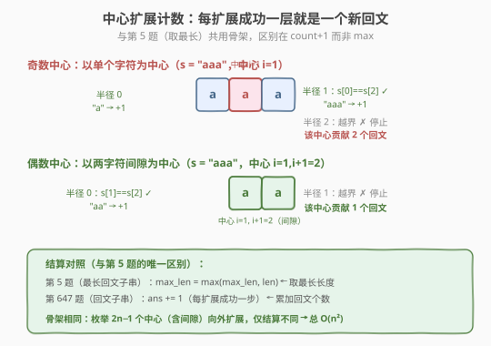
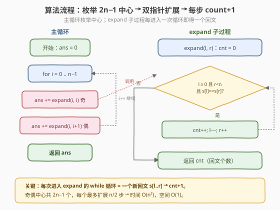

# LeetCode 回文子串 题解

## 1. 题目概述

- **标题 / 题号**：回文子串（#647，medium）
- **链接**：https://leetcode.cn/problems/palindromic-substrings/
- **难度**：中等
- **标签**：字符串、动态规划、中心扩展

**题意**：给你一个字符串 `s`，请你统计并返回 `s` 中**回文子串的数目**。回文串是正读和反读都相同的字符串。具有不同开始位置或结束位置的子串，即使是由相同的字符组成，也会被视作不同的子串。

**示例 1**：

```text
输入：s = "abc"
输出：3
解释：三个回文子串: "a", "b", "c"。
```

**示例 2**：

```text
输入：s = "aaa"
输出：6
解释：6 个回文子串: "a", "a", "a", "aa", "aa", "aaa"。
```

**约束**：

- `1 <= s.length <= 1000`
- `s` 由小写英文字母组成

> 💡 这是**中心扩展法的计数变体**。它与 [5. 最长回文子串](../0001-0100/5_最长回文子串.md) 共用同一套「枚举 `2n-1` 个中心向外扩展」的骨架，区别只在结算：第 5 题取**最长长度**（`max`），本题累加**回文个数**（`count`）。掌握这个「同骨架、不同结算」的对照，就能秒杀回文计数、回文分割判定等一整类题。此外本题也可用 [516. 最长回文子序列](../0501-0600/516_最长回文子序列.md) 的区间 DP 思路求解（把「最长长度」换成「是否为回文」），是理解回文 DP 的另一把钥匙。

## 2. 解题思路

### 2.1 暴力思路：枚举所有子串判回文

双重循环枚举所有子串 `s[i..j]`，逐个判断是否回文（反转比较或双指针），累计回文个数。

```text
ans = 0
for i in 0..n:
    for j in i..n:
        if s[i..j] 是回文:
            ans += 1
```

时间复杂度 `O(n³)`（`O(n²)` 个子串 × `O(n)` 判断回文），`n=1000` 时约 `10^9`，**超时**。

> ⚠️ 暴力法的问题在于**重复判断**：`s[i..j]` 是回文与 `s[i+1..j-1]` 强相关（回文的子串也是回文），但暴力每次从头比较，没有利用回文「从中心对称」的结构。

### 2.2 核心观察：中心扩展计数

**关键性质**：回文串以中心为轴对称。确定一个中心后，用双指针向两端扩展，**每扩展成功一步，就得到一个新的回文子串**。



**两种中心**（与第 5 题完全一致）：

- **奇数长度回文**：中心是单个字符，如 `"aba"` 以 `b` 为中心
- **偶数长度回文**：中心是两个相邻字符之间，如 `"aa"` 以两个 `a` 之间为中心

字符串长度 `n`，共有 `2n-1` 个中心（`n` 个字符中心 + `n-1` 个间隙中心）。

**与第 5 题的唯一区别——结算方式**：

| | 第 5 题 最长回文子串 | 第 647 题 回文子串 |
|------|---------------------|--------------------|
| 骨架 | 枚举 `2n-1` 中心向外扩展 | 枚举 `2n-1` 中心向外扩展 |
| 结算 | `max_len = max(max_len, len)` | `ans += 1`（每扩展成功一步） |
| 目标 | 取**最长**长度 | 累加**总数** |

> 💡 **为什么每扩展成功一步就 `+1`？** 以中心 `c` 向外扩展，半径 `r = 0, 1, 2, ...`，每个半径对应一个回文 `s[c-r..c+r]`（偶数中心则是 `s[c-r+1..c+r]`）。半径 `0` 是单字符回文，半径 `1` 是再大一层的回文……因此扩展 `k` 步恰好产生 `k` 个回文，逐一计数既不重复也不遗漏。

> ⚠️ **偶数中心绝不能漏**：只枚举字符中心会漏掉所有偶数长度回文（如 `"aaa"` 中的 `"aa"`）。把「间隙」也当作中心 `expand(i, i+1)`，`2n-1` 个中心才能覆盖所有回文。这是本题最易错的点。

### 2.3 算法流程图



**完整步骤**：

1. **初始化**：`ans = 0`
2. **枚举中心** `i` **从 0 到 n-1**：
   - **奇数中心**：`ans += expand(i, i)`
   - **偶数中心**：`ans += expand(i, i+1)`
3. **扩展函数** `expand(left, right)`：`cnt = 0`；`while left >= 0 且 right < n 且 s[left] == s[right]`：`cnt++, left--, right++`；返回 `cnt`
4. 返回 `ans`

> 💡 `expand` 直接返回「以该中心为轴的回文个数」——每次 `while` 成功进入循环，就意味着 `s[left..right]` 是一个新回文，`cnt+1`。把奇偶中心的返回值累加，即为答案。

### 2.4 示例演算

以 `s = "aaa"` 为例，`n = 3`，共 `2n-1 = 5` 个中心（外加 1 个会越界的偶数中心 `(2,3)`，贡献 0）：


| 中心 | 类型 | 扩展过程 | 计得回文 | 累计 `ans` |
|------|------|----------|----------|------------|
| `(0,0)` | 奇数 | r=0：`"a"` ✓；r=1：`s[-1]` 越界 ✗ | `"a"` | 1 |
| `(0,1)` | 偶数 | r=0：`s[0]==s[1]` `"aa"` ✓；r=1：`s[-1]` 越界 ✗ | `"aa"` | 2 |
| `(1,1)` | 奇数 | r=0：`"a"` ✓；r=1：`s[0]==s[2]` `"aaa"` ✓；r=2：越界 ✗ | `"a"`,`"aaa"` | 4 |
| `(1,2)` | 偶数 | r=0：`s[1]==s[2]` `"aa"` ✓；r=1：`s[0]`,`s[3]` 越界 ✗ | `"aa"` | 5 |
| `(2,2)` | 奇数 | r=0：`"a"` ✓；r=1：`s[3]` 越界 ✗ | `"a"` | 6 |
| `(2,3)` | 偶数 | `right=3` 越界，循环不进入 | — | 6 |

最终 `ans = 6`，对应 `"a"`,`"a"`,`"a"`,`"aa"`,`"aa"`,`"aaa"`（注意 3 个单字符 `"a"`、2 个 `"aa"` 因起止下标不同分别计数）。

> 💡 注意中心 `(1,1)` 贡献了 2 个回文：半径 0 的 `"a"` 和半径 1 的 `"aaa"`。这正是「每扩展成功一步 `+1`」的体现——一个中心可以产生多个不同半径的回文。

## 3. 参考代码

### C++

```cpp
// 回文子串.cpp —— 中心扩展计数
// 编译: g++ -O2 -std=c++17 回文子串.cpp -o palsub
class Solution {
  public:
    int countSubstrings(string s) {
        int n = s.size(), ans = 0;
        for (int i = 0; i < n; ++i) {
            ans += expand(s, i, i);     // 奇数中心
            ans += expand(s, i, i + 1); // 偶数中心
        }
        return ans;
    }

  private:
    // 返回以 (left, right) 为中心扩展出的回文个数
    int expand(const string& s, int left, int right) {
        int cnt = 0;
        while (left >= 0 && right < (int)s.size() && s[left] == s[right]) {
            ++cnt;      // s[left..right] 是一个新回文
            --left;
            ++right;
        }
        return cnt;
    }
};
```

### Python

```python
class Solution:
    def countSubstrings(self, s: str) -> int:
        n = len(s)
        ans = 0

        def expand(left: int, right: int) -> int:
            cnt = 0
            while left >= 0 and right < n and s[left] == s[right]:
                cnt += 1        # s[left..right] 是一个新回文
                left -= 1
                right += 1
            return cnt

        for i in range(n):
            ans += expand(i, i)       # 奇数中心
            ans += expand(i, i + 1)   # 偶数中心
        return ans
```

> 💡 **与第 5 题代码的对照**：第 5 题的 `expand` 返回**最长长度** `right - left - 1`，外层 `max`；本题 `expand` 返回**回文个数** `cnt`，外层 `+=`。除了这两处结算，函数体几乎一字不差。

## 4. 复杂度分析

| 维度 | 中心扩展 | 区间 DP | Manacher |
|------|---------|---------|----------|
| **时间复杂度** | `O(n²)` | `O(n²)` | `O(n)` |
| **空间复杂度** | `O(1)` | `O(n²)` | `O(n)` |
| **推荐度** | ✅ 面试首选 | 易理解，可迁移到 516 | 竞赛级，面试少考 |

> ⚠️ 中心扩展 `O(n²)`：共 `2n-1` 个中心，每个最多扩展 `n/2` 步，总 `O(n²)`。最坏情况如 `"aaaaa"`（全相同字符），每个中心都扩展到两端；但空间仅 `O(1)`，优于区间 DP 的 `O(n²)`，是面试首选。

## 5. 扩展：区间 DP 判定法

本题也可用 [516. 最长回文子序列](../0501-0600/516_最长回文子序列.md) 的区间 DP 思路求解，只是把「最长长度」换成「是否为回文」的布尔判定。

**定义**：`dp[i][j]` = 子串 `s[i..j]`（闭区间）是否为回文。

**转移**：

```text
dp[i][j] = (s[i] == s[j]) 且 (j - i < 2 或 dp[i+1][j-1])
```

- `j - i < 2`（长度 1 或 2）时，只要两端字符相同即是回文，无需看内部。
- 更长的区间要求「两端相同 且 内部 `s[i+1..j-1]` 也是回文」。

**答案**：所有 `dp[i][j] == True` 的个数。

### C++

```cpp
// 回文子串_区间DP.cpp —— dp[i][j] 表示 s[i..j] 是否回文
// 编译: g++ -O2 -std=c++17 回文子串_区间DP.cpp -o palsub_dp
class Solution {
  public:
    int countSubstrings(string s) {
        int n = s.size();
        vector<vector<char>> dp(n, vector<char>(n, 0));
        int ans = 0;
        for (int i = n - 1; i >= 0; --i) {        // i 倒序
            for (int j = i; j < n; ++j) {         // j 正序
                if (s[i] == s[j] && (j - i < 2 || dp[i + 1][j - 1])) {
                    dp[i][j] = 1;
                    ++ans;
                }
            }
        }
        return ans;
    }
};
```

### Python

```python
class Solution:
    def countSubstrings(self, s: str) -> int:
        n = len(s)
        dp = [[False] * n for _ in range(n)]
        ans = 0
        for i in range(n - 1, -1, -1):          # i 倒序
            for j in range(i, n):               # j 正序
                if s[i] == s[j] and (j - i < 2 or dp[i + 1][j - 1]):
                    dp[i][j] = True
                    ans += 1
        return ans
```

> ⚠️ **填表顺序**：`dp[i][j]` 依赖更短的内部区间 `dp[i+1][j-1]`，因此 `i` 必须倒序、`j` 正序，保证算大区间时小区间已就绪——与 516 区间 DP 的填表顺序完全一致。

> 💡 **与 516 的对照**：516 的 `dp[i][j]` 存「最长长度」，两端不同时取 `max(左缩, 右缩)`；本题存「是否回文」，两端相同时还要看内部是否回文。两者共享「`i` 倒序、`j` 正序、按区间长度递推」的区间 DP 框架，是回文 DP 的两类典型定义。

### Manacher 算法（O(n) 进阶）

中心扩展的瓶颈是不同中心的扩展有**重复比较**。Manacher 利用回文对称性，用已知回文半径跳过已覆盖区域，把 `O(n²)` 降到 `O(n)`。它与 [5. 最长回文子串](../0001-0100/5_最长回文子串.md) 用的是同一个 Manacher 模板，只是把「最大半径」改成「所有半径之和」。`n ≤ 1000` 时 `O(n²)` 完全够用，面试极少要求手写 Manacher，知道其 `O(n)` 复杂度即可。

## 6. 面试要点

1. **本题和第 5 题「最长回文子串」有什么区别？**

   > 骨架完全相同——都枚举 `2n-1` 个中心（含字符中心与间隙中心）向外扩展。区别只在结算：第 5 题取**最长长度**（`max`），本题累加**回文个数**（`count`）。掌握这一对照就能在两题间无缝切换。

2. **为什么每次 `while` 扩展成功就 `+1`，而不是按长度算？**

   > 以中心 `c` 扩展，半径 `r = 0, 1, 2, ...` 各对应一个回文 `s[c-r..c+r]`（偶数中心 `s[c-r+1..c+r]`）。半径 0 是单字符回文，半径 1 是再大一层的回文……扩展 `k` 步恰好产生 `k` 个回文，逐一计数不重不漏。一个中心可贡献多个回文（如 `"aaa"` 的中心 `(1,1)` 贡献 `"a"` 和 `"aaa"` 两个）。

3. **偶数中心为什么不能漏？只枚举字符中心会怎样？**

   > 只枚举字符中心会漏掉所有偶数长度回文（如 `"aa"`、`"abba"`）——偶数回文的中心不在任何字符上，而在两字符「之间」。把间隙也当中心 `expand(i, i+1)`，`2n-1` 个中心才覆盖全部。这是本题最易错点，面试常被追问。

4. **区间 DP 解法的转移方程是什么？和 516 有何异同？**

   > `dp[i][j] = s[i]==s[j] && (j-i<2 || dp[i+1][j-1])`，按 `i` 倒序、`j` 正序填表，统计 `True` 个数。与 516 共享「区间 DP、`i` 倒序 `j` 正序、两端向内缩」的框架，区别是 516 存「最长长度」、两端不同时取 `max`，本题存「是否回文」的布尔值。

5. **时间复杂度为什么是 O(n²)？**

   > 共 `2n-1` 个中心，每个最多扩展 `n/2` 步，总 `O(n²)`。最坏情况是全相同字符（如 `"aaaaa"`），每个中心都扩展到两端。但空间仅 `O(1)`，优于区间 DP 的 `O(n²)`，因此面试首选中心扩展。

> 💡 **一句话总结**：回文子串是中心扩展法的计数变体——与第 5 题「取最长」共用「枚举 `2n-1` 个中心向外扩展」的骨架，只需把结算从 `max` 换成「每扩展成功一步 `count+1`」，时间 `O(n²)`、空间 `O(1)`。也可用与 516 同源的区间 DP（`dp[i][j]` 表示是否回文）求解。掌握「同骨架、不同结算」的对照，就能迁移到回文分割判定（131/132）等所有回文类问题。

## 同类练习题

| # | 题目 | 与本题的关联 |
|---|------|-------------|
| 5 | [最长回文子串](https://leetcode.cn/problems/longest-palindromic-substring/)（[题解](../0001-0100/5_最长回文子串.md)） | 同骨架中心扩展，对照「取 max vs 计数」的结算差异 |
| 516 | [最长回文子序列](https://leetcode.cn/problems/longest-palindromic-subsequence/)（[题解](../0501-0600/516_最长回文子序列.md)） | 区间 DP 模板，本题区间 DP 解法与之同源 |
| 131 | [分割回文串](https://leetcode.cn/problems/palindrome-partitioning/)（[题解](../0101-0200/131_分割回文串.md)） | 回溯 + 回文判断，可用中心扩展预判回文 |
| 132 | [分割回文串 II](https://leetcode.cn/problems/palindrome-partitioning-ii/) | 区间 DP 判断回文 + 一维 DP 求最少分割次数 |
| 1216 | [验证回文串 III](https://leetcode.cn/problems/valid-palindrome-iii/) | 最多删 `k` 个字符使串仍回文，区间 DP 进阶 |
