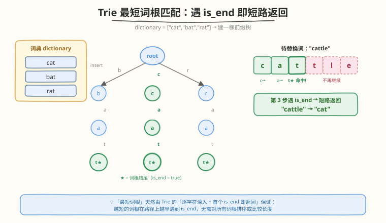
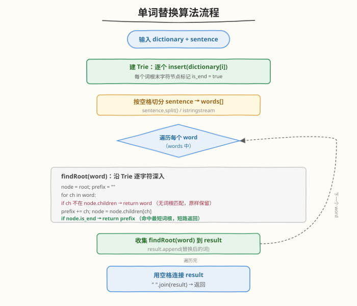
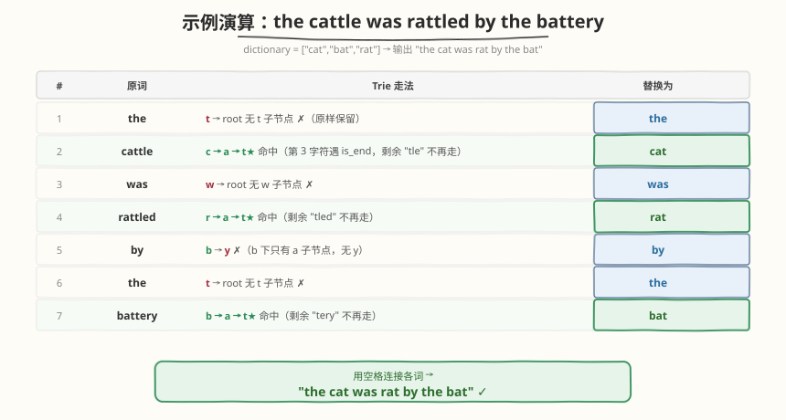

# 单词替换

- **题目名称**：单词替换
- **链接**：[648. 单词替换](https://leetcode.cn/problems/replace-words/)
- **难度**：中等
- **标签**：字典树、数组、哈希表、字符串

## 1. 题目概述

在英语中，**词根（root）** 可以在后面添加一些字母组成更长的**衍生词**。例如词根 `"help"` 加上 `"ful"` 可得到 `"helpful"`。

现给定一个由许多词根组成的词典 `dictionary` 和一个用空格分隔单词的句子 `sentence`。需要将句子中所有**衍生词**用**词根**替换掉。如果一个衍生词有多个词根能形成它，则用**最短**的词根替换。输出替换后的句子。

**示例 1**：

```text
输入：dictionary = ["cat","bat","rat"], sentence = "the cattle was rattled by the battery"
输出："the cat was rat by the bat"
解释：
  "cattle"  以 "cat" 开头 → 替换为 "cat"
  "rattled" 以 "rat" 开头 → 替换为 "rat"
  "battery" 以 "bat" 开头 → 替换为 "bat"
  其余单词不以任何词根开头，原样保留
```

**示例 2**：

```text
输入：dictionary = ["a","b","c"], sentence = "aadsfasf absbs bbab cadsfafs"
输出："a a b c"
解释：每个单词的首字符都恰好是某个长度为 1 的词根，故全被替换为单字符。
```

**约束条件**：

- $1 \le \text{dictionary.length} \le 1000$
- $1 \le \text{dictionary[i].length} \le 100$
- `dictionary[i]` 仅由小写字母组成
- $1 \le \text{sentence.length} \le 10^6$
- `sentence` 仅由小写字母和空格组成
- `sentence` 中单词的总量在 $[1, 1000]$ 范围内
- `sentence` 中每个单词的长度在 $[1, 1000]$ 范围内
- 单词之间由一个空格隔开，无前导或尾随空格

> 💡 本题是 [208. 实现 Trie (前缀树)](../0201-0300/208_实现Trie.md) 的直接应用：把词根插入 Trie 后，对句子每个单词「沿 Trie 逐字符深入，遇到第一个 `is_end` 就短路返回当前前缀」。这道「遇词根即停」的短路机制，正是 Trie 在**批量前缀匹配**场景下相对哈希集合的核心优势——一次遍历同时覆盖所有词根。

---

## 2. 解题思路

### 2.1 暴力思路：逐词枚举所有词根

对句子中的每个单词 `word`，遍历整个 `dictionary`，检查 `word` 是否以某个词根 `root` 开头（`word.startswith(root)`），在所有匹配的词根里挑**最短**的来替换。

```text
ans = []
for word in sentence.split():
    best = word                      # 默认原样保留
    for root in dictionary:
        if word.startswith(root) and len(root) < len(best):
            best = root
    ans.append(best)
return " ".join(ans)
```

时间复杂度 $O(W \cdot D \cdot L)$：$W$ 个句子单词 × $D$ 个词根 × 每次前缀比较 $O(L)$（$L$ 为词长上界）。最坏 $W=1000$、$D=1000$、$L=1000$ 时约 $10^9$ 次字符比较，**超时**。

> ⚠️ 暴力的根本低效在于：**没有复用词根之间的共享前缀**。`cat`、`bat`、`rat` 都以不同首字母开头，但若词典里有许多同前缀的词根（如 `app`、`apple`、`apply`），对同一个单词会反复比较相同的头部字符。

### 2.2 核心观察：Trie 前缀树 + 短路匹配



把所有词根**插入一棵 Trie**，每个词根末字符节点标记 `is_end = true`。然后对句子中的每个单词，从 `root` 出发逐字符深入：

- **走不通**：当前字符不在子节点中 → 该单词没有任何词根作为前缀，**原样返回** `word`。
- **遇 `is_end`**：走到某个词根的结尾 → 这就是能匹配的**最短词根**，**立即返回**当前累积的前缀 `prefix`，不再继续深入。
- **走完整个单词仍未遇 `is_end`**：单词本身比所有候选词根都短，**原样返回** `word`。

> 💡 **为什么「首个 `is_end`」就是最短词根？** Trie 的路径长度 = 词根长度。沿单词逐字符深入时，越短的词根在路径上越早结束、越早标记 `is_end`。遇到第一个 `is_end` 立即返回，自然取到最短者——**无需对词根排序、无需比较长度**。这是 Trie 共享前缀结构带来的「一次遍历覆盖全部词根」红利。

> ⚠️ 注意 `is_end` 的判定放在**「前进一格之后」**：先 `prefix += ch; node = node.children[ch]`，再检查 `node.is_end`。若把检查放在前进之前，会漏掉长度为 1 的词根（首字符即词根结尾）。

### 2.3 算法流程图



完整步骤：

1. **建 Trie**：遍历 `dictionary`，对每个词根调用 `insert`，末字符节点置 `is_end = true`。
2. **切分句子**：按空格拆分 `sentence` 得到 `words[]`（题目保证单空格分隔、无前后导空格）。
3. **逐词替换**：对每个 `word` 调用 `findRoot(word)`：
   - 从 `root` 开始，`prefix = ""`；
   - 对 `word` 的每个字符 `ch`：若无对应子节点 → 返回 `word`；否则 `prefix += ch`，走到子节点，若 `is_end` → 返回 `prefix`；
   - 循环正常结束（走完 `word`）→ 返回 `word`。
4. **拼接返回**：把所有替换后的词用单个空格连接。

### 2.4 示例演算

以示例 1 为例，`dictionary = ["cat","bat","rat"]`，Trie 形如 `root → {b,c,r} → a → t★`（三条分支共享 `a→t` 的形状，各自末尾 `t` 标 `is_end`）。对句子 `"the cattle was rattled by the battery"` 七个单词逐一匹配：



| 单词 | Trie 走法 | 结果 |
|------|-----------|------|
| `the` | `t` 不在 `root` 子节点 → 中断 | `the` |
| `cattle` | `c → a → t★` 命中（剩余 `tle` 不走） | `cat` |
| `was` | `w` 不在 `root` 子节点 → 中断 | `was` |
| `rattled` | `r → a → t★` 命中 | `rat` |
| `by` | `b` 存在，但下一字符 `y` 不在 `b` 的子节点（只有 `a`）→ 中断 | `by` |
| `the` | 同第 1 行 | `the` |
| `battery` | `b → a → t★` 命中 | `bat` |

> 💡 注意 `by` 这一行：`b` 是 `root` 的合法子节点（因为有词根 `bat`），所以会**继续深入一层**，但第二个字符 `y` 走不通，于是返回原词。这说明 Trie 不会「首字符命中就误替换」，替换只发生在**完整走到某个 `is_end`** 时。

最终用空格连接得 `"the cat was rat by the bat"`。

---

## 3. 参考代码

### C++（数组版 Trie，26 叉）

```cpp
class Solution {
    struct TrieNode {
        TrieNode* children[26] = {nullptr};
        bool is_end = false;
    };

    TrieNode* root_ = new TrieNode();

    void insert(const string& word) {
        TrieNode* node = root_;
        for (char ch : word) {
            int idx = ch - 'a';
            if (!node->children[idx]) {
                node->children[idx] = new TrieNode();
            }
            node = node->children[idx];
        }
        node->is_end = true;
    }

    // 沿 Trie 深入：遇 is_end 即返回当前前缀（最短词根）；
    // 走不通或走完仍未命中则原样返回 word
    string findRoot(const string& word) {
        TrieNode* node = root_;
        string prefix;
        for (char ch : word) {
            int idx = ch - 'a';
            if (!node->children[idx]) {
                return word;          // 无匹配词根，原样保留
            }
            prefix += ch;
            node = node->children[idx];
            if (node->is_end) {
                return prefix;        // 命中最短词根，短路返回
            }
        }
        return word;                  // word 走完仍未遇 is_end
    }

  public:
    string replaceWords(vector<string>& dictionary, string sentence) {
        for (const string& root : dictionary) {
            insert(root);
        }
        istringstream iss(sentence);
        string word, result;
        while (iss >> word) {
            if (!result.empty()) {
                result += ' ';
            }
            result += findRoot(word);
        }
        return result;
    }
};
```

### Python（dict 版 Trie，按需开子节点）

```python
class TrieNode:
    __slots__ = ("children", "is_end")
    def __init__(self):
        self.children: dict[str, "TrieNode"] = {}
        self.is_end = False


class Solution:
    def replaceWords(self, dictionary: list[str], sentence: str) -> str:
        root = TrieNode()
        for w in dictionary:
            node = root
            for ch in w:
                node = node.children.setdefault(ch, TrieNode())
            node.is_end = True

        def find_root(word: str) -> str:
            node = root
            prefix = []
            for ch in word:
                if ch not in node.children:
                    return word              # 无匹配词根，原样保留
                prefix.append(ch)
                node = node.children[ch]
                if node.is_end:
                    return "".join(prefix)   # 命中最短词根，短路返回
            return word                      # word 走完仍未遇 is_end

        return " ".join(find_root(w) for w in sentence.split())
```

> ⚠️ **易错点**：
> - **`is_end` 检查时机**：必须在「前进到子节点之后」检查，否则会漏掉长度为 1 的词根（如示例 2 的 `"a"`/`"b"`/`"c"`，首字符即结尾）。
> - **走完单词的兜底**：`for` 循环正常结束（未在中间 `return`）说明单词本身不比任何词根长且未命中，必须 `return word` 原样保留，不能返回 `prefix`（此时 `prefix == word` 但语义上是无匹配）。
> - **空格处理**：题目保证单词间单空格、无前后导空格，故 Python 直接 `split()` + `" ".join(...)` 即可；C++ 用 `istringstream >> word` 天然按空白切分。

---

## 4. 复杂度分析

| 维度 | 复杂度 | 说明 |
|------|--------|------|
| 时间复杂度 | $O\bigl(\sum_i \|\text{dict}_i\| + \sum_j \|\text{word}_j\|\bigr)$ | 建 Trie 走过所有词根字符一次；每个句子单词沿 Trie 至多走自身长度（遇 `is_end` 即停，实际更短），总字符遍历量 = 词典总字符数 + 句子总字符数 |
| 空间复杂度 | $O\bigl(\sum_i \|\text{dict}_i\| \cdot \|\Sigma\|\bigr)$ | Trie 节点数 $\le \sum_i \|\text{dict}_i\|$，C++ 数组版每节点 26 个指针（$\|\Sigma\|=26$）；Python `dict` 版仅存出现字符，常数更小。输出串不计入 |

> 💡 本题瓶颈在「句子长度 $\le 10^6$」，但**单词总数 $\le 1000$** 且每词长 $\le 1000$。Trie 对每个单词最多走 1000 步、总计 $\le 10^6$ 步，且多数单词在前几个字符就短路返回，实际远低于上界。建 Trie 侧 $\sum|\text{dict}_i| \le 1000 \times 100 = 10^5$，可忽略。

---

## 5. 扩展：哈希集合前缀枚举法

若不想手写 Trie，可把词根放入哈希集合，对每个单词**从短到长枚举前缀**，命中即返回：

### Python

```python
class Solution:
    def replaceWords(self, dictionary: list[str], sentence: str) -> str:
        roots = set(dictionary)            # 哈希集合

        def find_root(word: str) -> str:
            for i in range(1, len(word) + 1):
                if word[:i] in roots:      # 从最短前缀开始枚举
                    return word[:i]
            return word

        return " ".join(find_root(w) for w in sentence.split())
```

### C++

```cpp
string replaceWords(vector<string>& dictionary, string sentence) {
    unordered_set<string> roots(dictionary.begin(), dictionary.end());
    istringstream iss(sentence);
    string word, result;
    while (iss >> word) {
        string picked = word;
        for (int i = 1; i <= (int)word.size(); ++i) {
            if (roots.count(word.substr(0, i))) {
                picked = word.substr(0, i);
                break;                      // 最短前缀优先
            }
        }
        if (!result.empty()) result += ' ';
        result += picked;
    }
    return result;
}
```

| 对比维度 | Trie 短路匹配 | 哈希集合前缀枚举 |
|----------|---------------|-------------------|
| 单词匹配复杂度 | $O(L)$（沿 Trie 走，共享前缀） | $O(L^2)$（每个前缀 `substr` + 哈希） |
| 实现难度 | 需手写 Trie 节点 | 极简，10 行核心 |
| 常数 | 小，字符级指针跳转 | 较大，每次 `substr` 拷贝子串 |
| 适用场景 | 面试推荐，展示前缀树功底 | 快速 AC / 词长很小时 |

> 💡 哈希法「从短到长枚举前缀」天然保证最短：第一个命中的前缀长度最短。但每个前缀都要 `substr`（拷贝）+ 哈希查询，词长 $L=1000$ 时单词最多 $1000$ 次子串构造，总计 $10^6$ 次拷贝；Trie 则是一次指针遍历，无子串拷贝。本题两种写法都能通过，Trie 是更「正统」的解法。

---

## 6. 面试要点

1. **为什么 Trie 能保证取到「最短」词根？需要预先按长度排序词典吗？**

   > 不需要排序。Trie 的路径长度即词根长度，沿单词逐字符深入时，**越短的词根越早在路径上标记 `is_end`**。遇到第一个 `is_end` 立即返回，自然就是最短者。这是「逐字符深入 + 首个结束即停」的固有性质，与插入顺序无关。

2. **如果词典里一个词根是另一个的前缀（如 `"a"` 和 `"aa"`）会怎样？**

   > 两者都会被插入并各自标记 `is_end`。匹配单词 `"aaa"` 时，走完第 1 个字符 `a` 就遇到 `"a"` 的 `is_end`，立即返回 `"a"`——即取到更短者，正确。即使先插入 `"aa"` 再插入 `"a"` 也不影响，因为 `is_end` 标记是累加的，不覆盖。

3. **`is_end` 检查为什么必须在「前进到子节点之后」？**

   > 词根长度可能为 1（如 `"a"`），其 `is_end` 标在首字符对应的子节点上。若在前进之前检查（看当前 `node` 是否 `is_end`），会因为初始 `root` 的 `is_end=false` 漏掉单字符词根。正确顺序是：取子节点 → 累积字符 → 检查该子节点的 `is_end`。

4. **Trie 法相比哈希集合前缀枚举的优势在哪？**

   > 一次 Trie 遍历同时匹配**所有共享前缀的词根**。例如词典含 `app`/`apple`/`apply`，对单词 `"applex"`，Trie 走 `a→p→p`（遇 `app` 的 `is_end`）即停，3 个字符；哈希法要枚举 `a`/`ap`/`app` 三个前缀各做一次 `substr`+哈希，也是 3 次但每次带子串拷贝。词长越大、共享前缀越多，Trie 的常数优势越明显。

5. **句子长达 $10^6$ 时有哪些工程注意事项？**

   > 不要对整句反复 `substr` 拷贝。C++ 用 `istringstream >> word` 流式取词，每个单词独立处理；Python 用 `sentence.split()` 一次性拆分（单词数 $\le 1000$，内存可控）。拼接结果时用 `+=` 或 `" ".join(...)`，避免 `O(n^2)` 的字符串相加。Trie 节点用数组或 `dict` 按需开辟，避免预分配过大空间。

> 💡 **一句话总结**：单词替换是 Trie 在「批量前缀匹配」场景的招牌题——把词根插入 Trie，对每个句子单词逐字符深入、遇首个 `is_end` 即短路返回，天然取最短词根。时间 $O(\text{词典字符数} + \text{句子字符数})$，空间 $O(\text{词典字符数})$。与 [208. 实现 Trie](../0201-0300/208_实现Trie.md) 共用同一套节点结构，是 Trie 模板的最直接应用。

---

## 7. 同类练习题

- [208. 实现 Trie (前缀树)](https://leetcode.cn/problems/implement-trie-prefix-tree/)（[题解](../0201-0300/208_实现Trie.md)）：Trie 基础模板，`insert`/`search`/`startsWith` 三件套，本题直接复用其节点结构与 `insert`
- [472. 连接词](https://leetcode.cn/problems/concatenated-words/)（[题解](../0401-0500/472_连接词.md)）：Trie + 记忆化 DFS 判定「能否由更短词拼成」，对比 Trie 在「批量查询」与「逐词判定」两种用法
- [212. 单词搜索 II](https://leetcode.cn/problems/word-search-ii/)（[题解](../0201-0300/212_单词搜索II.md)）：Trie + DFS 回溯在二维网格中批量搜词，同样是「一次建树、多处查询」的典型场景
- [139. 单词拆分](https://leetcode.cn/problems/word-break/)（[题解](../0101-0200/139_单词拆分.md)）：字符串能否由字典拼成，可用 Trie 优化内层 `substr` 匹配，与本题的「前缀匹配」思想互通
- [14. 最长公共前缀](https://leetcode.cn/problems/longest-common-prefix/)（[题解](../0001-0100/14_最长公共前缀.md)）：前缀类问题的入门题，对照「纵向扫描」与本题「Trie 共享前缀路径」两种前缀处理范式
