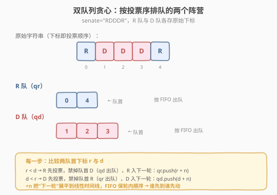
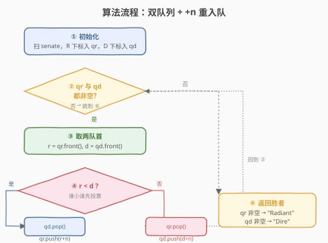
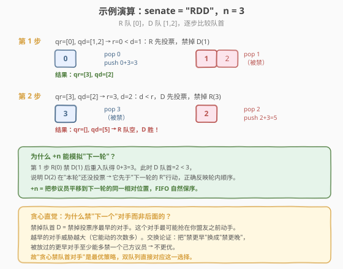

# LeetCode Dota2 参议院 题解

## 1. 题目概述

- **标题 / 题号**：Dota2 参议院（#649，medium）
- **链接**：https://leetcode.cn/problems/dota2-senate/
- **难度**：中等
- **标签**：贪心、队列、模拟

**题意**：Dota2 的世界里有两个阵营：`Radiant`（天辉，记 `'R'`）和 `Dire`（夜魇，记 `'D'`）。参议院由两派参议员组成，按给定字符串 `senate` 的顺序（下标即投票顺序）进行**轮为过程**的投票。每一轮中，每位**仍有权利**的参议员按顺序行使两项权利中的**一项**：

- **剥夺权利**：使另一名（对方阵营的）参议员在本轮及所有后续轮次中失去所有权利。
- **宣布胜利**：若发现仍有权利投票的参议员都来自**同一阵营**，可宣布胜利。

所有失去权利的参议员在过程中被跳过。假设每位参议员都足够聪明、为己方政党做出最优策略，预测哪一方最终宣布胜利。返回 `"Radiant"` 或 `"Dire"`。

**示例 1**：

```text
输入：senate = "RD"
输出："Radiant"
解释：第 1 轮，R(0) 使用第一项权利剥夺 D(1) 的权利。本轮 D(1) 被跳过。
      第 2 轮，只剩 R(0) 有权利，宣布胜利。
```

**示例 2**：

```text
输入：senate = "RDD"
输出："Dire"
解释：第 1 轮，R(0) 剥夺 D(1) 的权利；D(1) 被跳过；D(2) 剥夺 R(0) 的权利。
      第 2 轮，只剩 D(2) 有权利，宣布胜利。
```

**约束**：

- `n == senate.length`
- `1 <= n <= 10^4`
- `senate[i]` 为 `'R'` 或 `'D'`

> 💡 难点不在"模拟一轮投票"本身，而在两点：**① 跨轮的循环顺序**（一轮投完接下一轮，位置要绕回开头）；**② 贪心策略**——禁掉哪个对手最优？直觉是"禁掉投票序最早的对手"，因为它最可能抢在你盟友之前动手。把这两点合起来，**双队列 + `+n` 重入队**就能干净地一次模拟到底，无需显式维护"当前第几轮"。

## 2. 解题思路

### 2.1 暴力模拟思路：逐轮标记

最直白的做法是显式模拟"一轮"：用一个 `banned` 布尔数组标记失去权利的参议员，每轮从头扫到尾，遇到仍有权利的参议员就让他禁掉**本轮后面第一个**有权利的对方参议员（找不到则禁下一轮的，即绕回开头找）。一轮结束后检查是否只剩单一阵营，是则宣布胜利，否则进入下一轮。

```text
banned = [False] * n
while True:
    本轮扫一遍，每个有权利者禁掉下一个有权利的对方
    若只剩单一阵营 → 返回
```

> ⚠️ 暴力法的问题：**每轮都要 O(n) 扫描**，而最坏情况（双方势均力敌、交替禁人）可能要 `O(n)` 轮，总复杂度退化到 `O(n²)`。`n=10^4` 时勉强可过但常数大、不优雅。更麻烦的是"禁掉下一个对手"要在环形结构上查找，边界处理容易出错。

### 2.2 核心观察：双队列 + `+n` 重入队



把"跨轮的环形投票"展平成**一条线性时间线**，用一个数轴表示"第几个投票机会"：

- **初始化**：扫一遍 `senate`，把所有 `R` 的下标入队 `qr`，所有 `D` 的下标入队 `qd`。下标本身代表"第几轮的第几位"，天然是投票顺序。
- **每一步**：比较两队首 `r = qr.front()` 与 `d = qd.front()`。**较小的那个先投票**（因为它在时间线上更靠前），行使"剥夺权利"禁掉对方队首，然后自己 **`+n` 后重新入队**（表示它本轮投完票后，要等到**下一轮同一相对位置**才能再投）。
  - `r < d`：R 先投，禁掉队首 D → `qd.pop()`；R 进下一轮 → `qr.pop(); qr.push(r + n)`。
  - `d < r`：D 先投，禁掉队首 R → `qr.pop()`；D 进下一轮 → `qd.pop(); qd.push(d + n)`。
- **终止**：某一队为空，另一队所属阵营获胜。

##### 为什么 `+n` 能模拟"下一轮"？

设原始串长 `n`。第 1 轮的下标范围是 `[0, n-1]`，第 2 轮是 `[n, 2n-1]`，依此类推。把一个参议员下标 `+n` 重入队，等价于把它**平移到下一轮的同一相对位置**。由于队列 FIFO 保序，同一轮内的相对顺序不会乱；跨轮时 `+n` 保证了"下一轮的位置一定大于本轮所有剩余位置"，从而**时间线全局单调**——比较两个队首的大小，就是在比较"谁下一个行动"。

##### 贪心正确性：为什么禁"队首对手"是最优？

禁掉**投票序最早的**对方参议员（即对方队首）等价于"消灭对自己威胁最大的对手"——越早的对手在本轮及后续轮次能动手的次数越多。**交换论证**：假设某最优策略在某步禁了一个"非队首"的对手 `x`，而队首对手 `y` 在 `x` 之前。把这一步改成禁 `y` 而放过 `x`，由于 `y` 比 `x` 更早行动，`y` 至少能做 `x` 能做的事（且可能多做），所以放 `y` 活着不比放 `x` 更差，反之禁 `y` 不比禁 `x` 更差。故贪心禁队首对手不劣于任意策略。

> ⚠️ **易错点**：不是"禁掉字符串里紧接着自己的下一个对手"，而是"禁掉**时间线上下一个**会行动的对手"。在跨轮时这两者可能不同。双队列通过"比较队首 + `+n` 重入队"自然实现了后者——比较的是展平后的全局时间戳，而非原始下标的相邻关系。

### 2.3 算法流程图



**完整步骤**：

1. **初始化**：`qr`, `qd` 为空队列；遍历 `senate`，`'R'` 下标入 `qr`，`'D'` 下标入 `qd`。
2. **循环**：当 `qr` 与 `qd` 均非空时：
   - `r = qr.front()`, `d = qd.front()`。
   - 若 `r < d`：`qr.pop(); qd.pop(); qr.push(r + n)`（R 禁 D，R 进下一轮）。
   - 否则：`qd.pop(); qr.pop(); qd.push(d + n)`（D 禁 R，D 进下一轮）。
3. **返回**：`qr` 非空返回 `"Radiant"`，否则返回 `"Dire"`。

> 💡 关键不变式：**任何时刻两队首中较小者就是下一个行动的参议员**。因为它要么是本轮还未投的下标最小者，要么是某轮 `+n` 后的位置——而 `+n` 总大于本轮剩余位置，所以"较小者先动"和真实轮次顺序完全一致。

### 2.4 示例演算

以 `senate = "RDD"`，`n = 3` 为例：



| 步骤 | qr | qd | 比较 | 行动 |
|------|----|----|------|------|
| 初始 | `[0]` | `[1, 2]` | — | — |
| 1 | `[]` | `[2]` | `r=0 < d=1` | R(0) 禁 D(1)，R 重入队 `0+3=3` → `qr=[3]` |
| 2 | `[]` | `[5]` | `r=3, d=2`，`d<r` | D(2) 禁 R(3)，D 重入队 `2+3=5` → `qd=[5]` |
| 终止 | `[]` | `[5]` | qr 空 | D 阵营获胜 → `"Dire"` |

对照示例 2 的解释：第 1 轮 R(0) 禁 D(1)，D(1) 被跳过，D(2) 禁 R(0)；第 2 轮只剩 D(2) → `"Dire"`。与双队列演算完全吻合。

> 💡 注意第 2 步 `r=3, d=2`：R(0) 虽然"原始下标"是 0，但它已经 `+n=3` 表示"下一轮的位置"，而 D(2) 还在本轮（位置 2 < 3），所以 D(2) 先于"下一轮的 R(0)"行动——这正是 `+n` 把跨轮顺序正确展平的体现。

## 3. 参考代码

### C++

```cpp
// Dota2参议院.cpp —— 双队列贪心 + +n 重入队
// 编译: g++ -O2 -std=c++17 Dota2参议院.cpp -o dota2
class Solution {
  public:
    string predictPartyVictory(string senate) {
        int n = senate.size();
        queue<int> qr, qd;
        for (int i = 0; i < n; ++i) {
            if (senate[i] == 'R') qr.push(i);
            else qd.push(i);
        }
        while (!qr.empty() && !qd.empty()) {
            int r = qr.front(); qr.pop();
            int d = qd.front(); qd.pop();
            if (r < d) qr.push(r + n);   // R 先动，禁 D，R 进下一轮
            else        qd.push(d + n);  // D 先动，禁 R，D 进下一轮
        }
        return qr.empty() ? "Dire" : "Radiant";
    }
};
```

### Python

```python
class Solution:
    def predictPartyVictory(self, senate: str) -> str:
        from collections import deque
        n = len(senate)
        qr = deque(i for i, c in enumerate(senate) if c == 'R')
        qd = deque(i for i, c in enumerate(senate) if c == 'D')
        while qr and qd:
            r = qr.popleft()
            d = qd.popleft()
            if r < d:
                qr.append(r + n)   # R 先动，禁 D，R 进下一轮
            else:
                qd.append(d + n)   # D 先动，禁 R，D 进下一轮
        return "Radiant" if qr else "Dire"
```

> 💡 代码极简：两个队列 + 一行 `+n` 重入队，把"跨轮环形投票"压成一条线性时间线，比较队首即可决定谁先动。无需显式判断"是否只剩单一阵营"——某队空了自然退出循环。

## 4. 复杂度分析

| 维度 | 复杂度 | 说明 |
|------|--------|------|
| 时间复杂度 | $O(n)$ | 每次循环必有一个参议员被禁（某队出队后不重入队），总共至多 $n$ 次禁人，循环至多 $n$ 次；每次 `O(1)` 队列操作 |
| 空间复杂度 | $O(n)$ | 两个队列共存放 $n$ 个下标 |

> ⚠️ **为什么是 $O(n)$ 而非 $O(n^2)$？** 关键不变式：**每轮循环必禁掉一人**（败方的队首出队后不重入队）。初始共 $n$ 人，所以循环至多 $n$ 次一定结束。对比暴力模拟法每轮 $O(n)$ 扫描 + 可能 $O(n)$ 轮的 $O(n^2)$，双队列把"逐轮扫描"换成"按时间线逐步推进"，每步 $O(1)$。

## 5. 扩展：变长 +n 的通用化与"天选之人"变体

##### 多阵营推广

若题目改为 $k$ 个阵营（而非 2 个），双队列思路可推广为 $k$ 个队列，每步取所有非空队列队首中最小者行动，禁掉"时间线上下一个不同阵营的队首"。复杂度随 $k$ 略升（可用最小堆维护队首），但 $k=2$ 时双队列已是最简。

##### "天选之人"变体

若规则改为"被禁的参议员在**本轮剩余时间内仍可发言一次**才失效"（即禁令延迟到本轮结束生效），则贪心策略变化：禁令不影响本轮后续，需区分"本轮已发言"与"本轮待发言"。此时双队列仍可用，但要给每个入队元素加一个"本轮是否已发言"的标记，逻辑更复杂——属于面试追问的延伸场景，了解即可。

## 6. 面试要点

1. **为什么用两个队列而不是一个队列加标记？**

   > 一个队列也能模拟，但要遍历找"下一个对方阵营的参议员"，每次 $O(n)$，总 $O(n^2)$。两个队列按阵营分流后，**两队首直接就是"下一个 R"和"下一个 D"**，比较一次 $O(1)$ 就知道谁先动、禁谁。分流的本质是"用空间换查找效率"。

2. **`+n` 里的 `n` 为什么是字符串长度？能换成别的数吗？**

   > `n` 是一轮的参议员数（即字符串长度），`+n` 表示"平移到下一轮同一相对位置"。换成任何**严格大于当前最大未投下标**的增量都能保证"下一轮位置 > 本轮剩余位置"，但用 `n` 最自然且足以保证单调（下一轮起点正好接在本轮终点之后）。换成更小的数可能破坏跨轮顺序，换成更大的数虽不破坏单调但语义不清晰。

3. **贪心"禁队首对手"为什么最优？**

   > 队首对手是时间线上最早会行动的对方参议员，威胁最大（能动次数最多）。交换论证：把"禁队首 $y$"换成"禁更后的 $x$"而放过 $y$，由于 $y$ 比 $x$ 更早行动，$y$ 至少能做 $x$ 能做的事，所以放 $y$ 不比放 $x$ 更差——故禁 $y$ 不劣于禁 $x$。每步禁队首即全局最优。

4. **时间复杂度为什么是 $O(n)$？**

   > 每次循环必禁一人（败方队首出队后不重入队），初始 $n$ 人，循环至多 $n$ 次，每次 $O(1)$ 队列操作，总 $O(n)$。对比暴力模拟的 $O(n^2)$，双队列把"逐轮扫描全串"换成"时间线逐步推进"。

5. **"禁掉字符串里紧接着自己的下一个对手"对吗？**

   > 不完全对。要禁的是**时间线上下一个会行动的对手**，跨轮时它未必是字符串里紧接着自己的下一个。例如 `senate="RDDD"`，R(0) 禁的应是 D(1)（下一个行动的 D），这恰是相邻；但若 R 已 `+n` 进下一轮而某 D 还在本轮，"下一个对手"是本轮那个 D 而非字符串里 R 之后的——双队列按时间戳比较队首，自然处理了这种跨轮情况。

> 💡 **一句话总结**：Dota2 参议院的精髓是**把环形跨轮投票展平成线性时间线**——两个队列分别存 R/D 的下标，每步比较队首决定谁先动，胜方 `+n` 重入队模拟"进入下一轮同一位置"。`+n` 保证全局时间戳单调，FIFO 保轮内顺序，循环至多 $n$ 次（每次必禁一人），总 $O(n)$。贪心"禁队首对手"由交换论证保证最优。

## 同类练习题

| # | 题目 | 与本题的关联 |
|---|------|-------------|
| 2073 | [买票需要的时间](https://leetcode.cn/problems/time-needed-to-buy-tickets/) | 单队列模拟"轮为过程"，每轮每人买 1 张票，与本题"轮为投票"同源但无禁人、更简单 |
| 1700 | [无法吃午餐的学生数量](https://leetcode.cn/problems/number-of-students-unable-to-eat-lunch/) | 队列模拟 + 栈顶匹配，计数优化到 $O(n)$，对照"队列模拟何时能跳过逐轮" |
| 950 | [按递增顺序显示卡牌](https://leetcode.cn/problems/reveal-cards-in-increasing-order/) | 队列模拟"翻一张、放一张到底"的环形过程，逆向构造输入，双队列思维的逆向应用 |
| 387 | [字符串中的第一个唯一字符](https://leetcode.cn/problems/first-unique-character-in-a-string/) | 队列 + 计数延迟弹出，与本题"队列维护待处理元素"的思路同构 |
