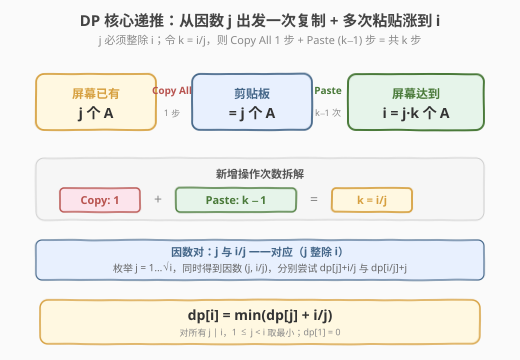
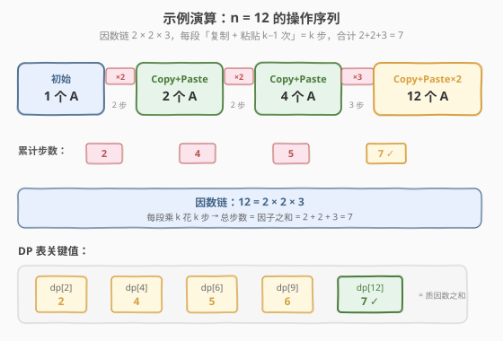
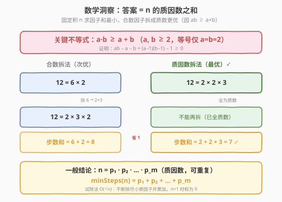

# LeetCode 两个键的键盘 题解

## 1. 题目概述

- **标题 / 题号**：两个键的键盘（#650，medium）
- **链接**：https://leetcode.cn/problems/2-keys-keyboard/
- **难度**：中等
- **标签**：动态规划、数学

**题意**：最初记事本上只有一个字符 `'A'`。每次可以进行两种操作：

- **Copy All（复制全部）**：复制记事本中的**所有**字符（不允许只复制部分）。
- **Paste（粘贴）**：粘贴**上一次**复制的字符。

给定数字 `n`，求使用最少的操作次数，在记事本上输出**恰好** `n` 个 `'A'`。

**示例 1**：

```text
输入：n = 3
输出：3
解释：
最初, 只有一个字符 'A'。
第 1 步, 使用 Copy All 操作。
第 2 步, 使用 Paste 操作来获得 'AA'。
第 3 步, 使用 Paste 操作来获得 'AAA'。
```

**示例 2**：

```text
输入：n = 1
输出：0
```

**约束**：

- `1 <= n <= 1000`

> 💡 本题有两层魅力：① 一个**因数分解型 DP**——把「凑到 $i$ 个 A」看作从某个因数 $j$ 出发一次「复制 + 多次粘贴」；② 一个优美的数学结论——**答案就是 $n$ 的所有质因数之和**，把 $O(n\sqrt n)$ 的 DP 压成 $O(\sqrt n)$。面试中先讲 DP、再亮数学，能体现「暴力→优化→数学」的完整思维链，与 [343. 整数拆分](../0301-0400/343_整数拆分.md) 是同构的母女题。

## 2. 解题思路

### 2.1 暴力思路：BFS 枚举操作序列

把「屏幕 A 数量 + 剪贴板 A 数量」当作状态 `(screen, clip)`，从 `(1, 0)` 出发 BFS，每次扩展两个动作：Copy All → `(screen, screen)`，Paste → `(screen+clip, clip)`（要求 `clip>0`），首次到达 `screen == n` 即返回步数。

> ⚠️ 状态空间是 $O(n^2)$（`screen`、`clip` 都不超过 $n$），BFS 可行但不优雅。真正的问题是：**我们并不关心剪贴板里有多少，只关心「上一次复制时的基数」**——而那次复制发生在某个屏幕值 $j$ 处，之后每粘贴一次就 $+j$。所以从 $j$ 涨到 $i$ 必须 $j \mid i$。这个观察直接把状态压成一维。

### 2.2 核心观察：DP —— 因数分解

**关键事实**：剪贴板里永远是「某一次 Copy All 时的屏幕值」。设上一次复制时屏幕有 $j$ 个 A，之后每 Paste 一次就增加 $j$ 个。要从 $j$ 涨到 $i$，必须 $i = j + m \cdot j = j \cdot (m+1)$，即 **$j$ 必须整除 $i$**。

**关键定义**：设 $dp[i]$ = 得到恰好 $i$ 个 A 的最少操作次数。

**核心递推**：对每个 $i$，枚举其因数 $j$（$j \mid i$，$1 \le j < i$）。先凑到 $j$ 个 A（耗 $dp[j]$ 步），再 Copy All（1 步）+ Paste $\frac{i}{j}-1$ 次，共新增 $\frac{i}{j}$ 步，得到 $i$ 个 A：

$$dp[i] = \min_{j \mid i,\; 1 \le j < i} \big(\; dp[j] + \tfrac{i}{j} \;\big)$$



> 💡 **为什么新增步数恰好是 $i/j$？** Copy All 算 1 步，之后 Paste $\frac{i}{j}-1$ 次（第一次粘贴后 $2j$，第二次 $3j$，…，第 $\frac{i}{j}-1$ 次后 $\frac{i}{j}\cdot j = i$）。总新增 $= 1 + (\frac{i}{j}-1) = \frac{i}{j}$。这个「复制一次 + 粘贴 $k-1$ 次 = $k$ 步、数量乘 $k$」的对应是本题的灵魂。

**边界**：$dp[1] = 0$（初始已有 1 个 A，无需操作）。

> ⚠️ **为什么不枚举「最后一次粘贴前的屏幕值」而枚举因数？** 因为「最后一次 Copy All」时的屏幕值 $j$ 才是真正的决策点——之后粘贴的次数是被动确定的。枚举 $j \mid i$ 等价于枚举「在哪一次复制后开始狂贴」，这正是最优子结构所在。

### 2.3 算法流程图

按「四步法」自底向上填表：

1. **状态定义**：$dp[i]$ = 得到 $i$ 个 A 的最少操作次数
2. **转移方程**：$dp[i] = \min_{j \mid i}\big(dp[j] + i/j\big)$，$1 \le j < i$
3. **初始条件**：$dp[1] = 0$
4. **计算顺序**：从 $i=2$ 到 $n$，自底向上；内层枚举 $i$ 的因数

> 💡 因数枚举只需遍历 $j=1\dots\sqrt i$：若 $j \mid i$，则同时得到因数对 $(j,\; i/j)$，分别用 $dp[j]+i/j$ 与 $dp[i/j]+j$ 更新。把 $O(n^2)$ 降到 $O(n\sqrt n)$，$n \le 1000$ 下完全够用。

### 2.4 示例演算

以 $n=12$ 为例，填 DP 表（$dp[i]$ = 得到 $i$ 个 A 的最少步数，括号内为最优因数 $j$）：

| i | 因数 j | 候选 dp[j]+i/j | dp[i] | 最优 j |
|---|--------|----------------|-------|--------|
| 1 | — | — | 0 | —（初始）|
| 2 | 1 | 0+2 | 2 | 1 |
| 3 | 1 | 0+3 | 3 | 1 |
| 4 | 1,2 | 0+4 / 2+2 | 4 | 1 或 2 |
| 6 | 1,2,3 | 0+6 / 2+3 / 3+2 | 5 | 2 或 3 |
| 8 | 1,2,4 | 0+8 / 2+4 / 4+2 | 6 | 2 或 4 |
| 9 | 1,3 | 0+9 / 3+3 | 6 | 3 |
| 12 | 1,2,3,4,6 | 0+12 / 2+6 / 3+4 / 4+3 / 5+2 | 7 | 3、4 或 6 |



取 $dp[12]=7$，对应操作序列（走 $j=2 \to 4 \to 12$，即因数链 $2 \times 2 \times 3$）：

```text
A           (1 个，初始)
Copy + Paste→ AA          (×2，2 步)
Copy + Paste→ AAAA        (×2，2 步)
Copy + Paste + Paste→ 12 A's   (×3，3 步)
合计 2 + 2 + 3 = 7 步
```

> 💡 观察规律：$dp[12]=7 = 2+2+3$，而 $12 = 2 \times 2 \times 3$——**答案恰好等于质因数之和**！这不是巧合：每一段「复制 + 粘贴 $k-1$ 次」让数量 $\times k$、花 $k$ 步；把 $n$ 拆成因子乘积，总步数就是因子之和。拆得越细（直至质数）和越小，见第 5 节。

## 3. 参考代码

### C++

```cpp
// 两个键的键盘.cpp —— DP：枚举因数 j
// 编译: g++ -O2 -std=c++17 两个键的键盘.cpp -o twokeys
#include <vector>
#include <algorithm>
using namespace std;

class Solution {
  public:
    int minSteps(int n) {
        if (n == 1) return 0;
        vector<int> dp(n + 1, 0);
        for (int i = 2; i <= n; ++i) {
            dp[i] = i;                          // 最坏：复制 1 次 + 粘贴 i-1 次 = i
            for (int j = 2; j * j <= i; ++j) {  // 枚举因数到 √i
                if (i % j == 0) {
                    dp[i] = min(dp[i], dp[j] + i / j);        // j 为因数
                    dp[i] = min(dp[i], dp[i / j] + j);        // i/j 为因数
                }
            }
        }
        return dp[n];
    }
};
```

### Python

```python
class Solution:
    def minSteps(self, n: int) -> int:
        if n == 1:
            return 0
        dp = [0] * (n + 1)
        for i in range(2, n + 1):
            dp[i] = i                       # 最坏：j=1，复制 1 + 粘贴 i-1 = i 步
            j = 2
            while j * j <= i:               # 枚举因数到 √i
                if i % j == 0:
                    dp[i] = min(dp[i], dp[j] + i // j, dp[i // j] + j)
                j += 1
        return dp[n]
```

> 💡 `dp[i]` 初始化为 `i` 是「$j=1$」的退化情形：复制初始的 1 个 A，粘贴 $i-1$ 次，共 $i$ 步。所以内层从 $j=2$ 起枚举即可。两行 `min`（C++）可合并成一个 `min` 三参数（Python）。

## 4. 复杂度分析

| 维度 | 复杂度 | 说明 |
|------|--------|------|
| **时间复杂度** | `O(n√n)` | 外层 $n$ 个状态，内层枚举因数到 $\sqrt i$，总计 $\sum_{i=2}^{n}\sqrt i = O(n\sqrt n)$ |
| **空间复杂度** | `O(n)` | `dp` 数组长度 $n+1$ |

> ⚠️ 若不优化、内层遍历 $j=1\dots i-1$，则 $O(n^2)$，$n=1000$ 下约 $10^6$ 次也能过。但因数枚举到 $\sqrt i$ 是基本素养，且为第 5 节的 $O(\sqrt n)$ 数学解做铺垫。

## 5. 扩展：数学 —— 质因数之和

### 5.1 核心结论

**答案 = $n$ 的所有质因数之和（含重复）**。设 $n = p_1 \cdot p_2 \cdots p_m$（$p_i$ 为质数，可重复），则：

$$\text{minSteps}(n) = p_1 + p_2 + \cdots + p_m$$

特判 $n=1$：无质因数，返回 $0$。



### 5.2 为什么拆成质因数最优？

每一段「Copy All + Paste $k-1$ 次」让数量 $\times k$、花 $k$ 步。把 $n$ 写成因子乘积 $n = k_1 \cdot k_2 \cdots k_m$（$k_i \ge 2$），总步数 $= \sum k_i$。要在乘积固定为 $n$ 时最小化和数。

**关键不等式**：对任意 $a, b \ge 2$，

$$a \cdot b \;\ge\; a + b$$

等号仅在 $a = b = 2$ 时成立（$2 \times 2 = 2 + 2 = 4$）。证明：$ab - a - b = (a-1)(b-1) - 1 \ge 1 \cdot 1 - 1 = 0$。

> 💡 这意味着**把一个合数因子 $k = a \cdot b$ 拆成 $a + b$，总步数不会变大，且通常变小**。例如 $6 = 2 \times 3$，$6 \to 2+3 = 5$（省 1 步）；$12 = 3 \times 4$，$12 \to 3+4 = 7$（省 5 步）。反复拆，直到所有因子都是质数（不能再拆），此时和最小。唯一的「拆了不赚」是 $4 = 2 \times 2 \to 2+2 = 4$（持平），所以含因子 4 不影响最优值。

### 5.3 贪心代码

```python
class Solution:
    def minSteps(self, n: int) -> int:
        ans = 0
        d = 2
        while d * d <= n:          # 试除到 √n
            while n % d == 0:
                ans += d
                n //= d
            d += 1
        if n > 1:                  # 剩下的大于 1 的因子是质数
            ans += n
        return ans
```

**复杂度**：时间 $O(\sqrt n)$，空间 $O(1)$。$n=1000$ 下仅需约 30 次循环。

> ⚠️ **面试策略**：先写 DP（展示思维过程，可迁移到变体如 [651. 4键键盘](https://leetcode.cn/problems/4-keys-keyboard/)），再追问「能否 $O(\sqrt n)$」时亮数学结论。直接背「质因数之和」而不懂推导，面试官一问「为什么拆成质数最优」就会露馅。

## 6. 面试要点

1. **为什么 DP 枚举的是「因数 $j$」而不是任意 $j < i$？**

   - 剪贴板里永远是「某次 Copy All 时的屏幕值」。设那次屏幕有 $j$ 个 A，之后每 Paste 一次 $+j$，所以从 $j$ 涨到 $i$ 必须 $i = j \cdot (m+1)$，即 $j \mid i$。非因数的 $j$ 无法一步复制粘贴到达 $i$，故只需枚举因数，$O(n\sqrt n)$。

2. **$dp[i]$ 初始化为 $i$ 的含义是什么？**

   - 这是 $j=1$ 的退化情形：屏幕初始有 1 个 A，Copy All 一次 + Paste $i-1$ 次 = 共 $i$ 步得到 $i$ 个 A。它既是上界也是合法方案，所以内层枚举从 $j=2$ 起即可，无需单独处理 $j=1$。

3. **为什么答案等于质因数之和，而不是任意因数分解之和？**

   - 不等式 $ab \ge a+b$（$a,b \ge 2$，等号仅 $a=b=2$）保证：把合数因子 $k=ab$ 拆成 $a+b$ 总不增加步数。反复拆到所有因子为质数，和最小。唯一持平是 $4=2\times2=2+2$，不影响最优值。

4. **$n=1$ 为什么返回 $0$？**

   - 初始记事本已有 1 个 A，无需任何操作。质因数视角下 $1$ 没有质因数，和为 $0$，自然吻合。

5. **本题与 [343. 整数拆分](../0301-0400/343_整数拆分.md) 的关系？**

   - 同构的「因数分解型」问题。343 是固定和 $n$、拆成因子求**乘积最大**（切成 3 最优，因 $e\approx2.718$）；650 是固定积 $n$、拆成因子求**和最小**（拆成质数最优，因 $ab \ge a+b$）。一个「和定积大」、一个「积定和小」，互为对偶，是面试因数分解 DP 的双子母题。

> 💡 **一句话总结**：650 的 DP 是 $dp[i]=\min_{j\mid i}(dp[j]+i/j)$，关键是认出「复制粘贴只能从因数涨到倍数」；更深一层是数学——固定积求最小和，用 $ab\ge a+b$ 把所有合数因子拆成质数，答案即质因数之和，$O(\sqrt n)$ 出解。

## 同类练习题

| # | 题目 | 与本题的关联 |
|---|------|-------------|
| 343 | [整数拆分](https://leetcode.cn/problems/integer-break/)（[题解](../0301-0400/343_整数拆分.md)） | 对偶母题，固定和拆因子求乘积最大，切成 3 最优 |
| 651 | [4键键盘](https://leetcode.cn/problems/4-keys-keyboard/) | 本题扩展，多出 Ctrl-V 打印历史最大值，需 DP 加额外状态 |
| 264 | [丑数 II](https://leetcode.cn/problems/ugly-number-ii/)（[题解](../0201-0300/264_丑数II.md)） | 多路归并生成序列，与本题「因数链构造」思路相通 |
| 279 | [完全平方数](https://leetcode.cn/problems/perfect-squares/) | 切分型 DP，枚举平方数作「一刀」求最少段数 |
