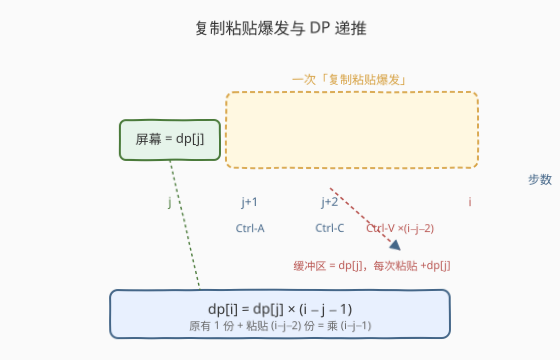
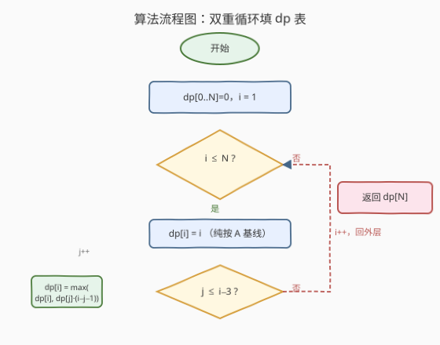
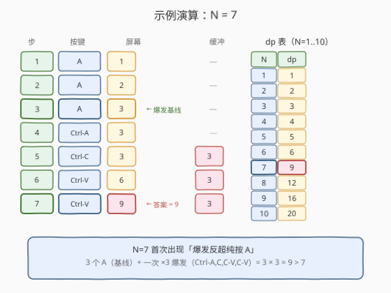
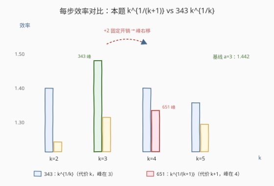

# 四个键的键盘

- **题目名称**：四个键的键盘
- **链接**：[651. 四个键的键盘](https://leetcode.cn/problems/4-keys-keyboard/)
- **难度**：中等
- **标签**：动态规划、数学、贪心

## 1. 题目概述

假设你有一个特殊的键盘，上面只有以下四个键：

- **键 1（A）**：在屏幕上打印一个 `'A'`。
- **键 2（Ctrl-A）**：选中屏幕上的全部字符。
- **键 3（Ctrl-C）**：把当前选中的内容复制到缓冲区。
- **键 4（Ctrl-V）**：把缓冲区的内容追加打印到屏幕上现有字符之后。

你**只能按键盘 `N` 次**（仅限上述四个键），求屏幕上最多能出现多少个 `'A'`。

**示例 1**：

```text
输入：3
输出：3
解释：连按三次 A，屏幕为 "AAA"。
```

**示例 2**：

```text
输入：7
输出：9
解释：A, A, A, Ctrl-A, Ctrl-C, Ctrl-V, Ctrl-V
      屏幕依次为 "A" → "AA" → "AAA" → 选中 → 缓冲=3 → "AAAAAA"(6) → "AAAAAAAAA"(9)
```

**约束条件**：

- `1 <= N <= 50`

> 💡 本题是 [343. 整数拆分](../0301-0400/343_整数拆分.md) 的「键盘版表亲」：两者本质都是**把一个总量切成若干段、各段因子相乘使乘积最大**。但本题里每个「复制粘贴爆发」的代价是「乘数 + 1」（Ctrl-A、Ctrl-C 外加若干 Ctrl-V），这使得最优因子从 343 的 **3** 漂移到 **4**——这是本题最优雅的洞察，也是第 5 节展开的核心。

---

## 2. 解题思路

### 2.1 暴力思路：枚举所有按键序列

每个按键位置有 4 种选择，长度为 `N` 的序列共 $4^N$ 种。$N=50$ 时 $4^{50}\approx 1.3\times10^{30}$，**完全不可行**。

> ⚠️ 暴力法的问题在于：屏幕状态（已有 A 数量 + 缓冲区内容）在不同按键序列里被反复到达——这是**重叠子问题**的信号。但状态含「缓冲区大小」，若直接以 `(步数, 屏幕数, 缓冲数)` 为状态会爆炸。需要先做**结构观察**，把状态压成一维。

### 2.2 核心观察：DP —— 最后一次「复制粘贴爆发」发生在哪里

**结构定理**：最优按键序列形如「先连按若干次 A，之后只做若干次『复制粘贴爆发』，绝不再按 A」。

> 💡 **为什么之后再按 A 不优？** 一旦完成第一次复制，缓冲区里至少有 1 个 A。此后每按一次 Ctrl-V 至少 +1（且往往远大于 1），而按一次 A 只 +1。所以 A 永远不会出现在复制之后。所有 A 都集中在最前面。

**一次「爆发」的结构**：在屏幕已有 $dp[j]$ 个 A 时（第 $j$ 步结束），依次按：

1. **Ctrl-A**（第 $j{+}1$ 步）：选中全部 $dp[j]$ 个 A；
2. **Ctrl-C**（第 $j{+}2$ 步）：缓冲区 $\leftarrow dp[j]$；
3. **Ctrl-V** 重复若干次（第 $j{+}3 \dots i$ 步）：每按一次屏幕 $+\,dp[j]$。

若第 $i$ 步是这次爆发的最后一次 Ctrl-V，则这次爆发消耗 $(i-j-2)$ 次 Ctrl-V，加上 Ctrl-A、Ctrl-C 共 2 步，从第 $j{+}1$ 到第 $i$ 步合计 $(i-j)$ 步。最终屏幕上 A 的数量为：

$$\underbrace{dp[j]}_{\text{原有}} + \underbrace{(i-j-2) \times dp[j]}_{\text{粘贴追加}} = dp[j] \times (i - j - 1)$$

> ⚠️ 这里的 $(i-j-1)$ 就是「乘数」= 1（原有）+ $(i-j-2)$（粘贴次数）。要保证至少有 1 次粘贴，即 $i - j - 2 \ge 1 \Rightarrow j \le i - 3$。

**核心递推**：

$$dp[i] = \max\Big(\;i,\;\;\max_{1 \le j \le i-3}\; dp[j] \times (i - j - 1) \;\Big)$$

- 项 $i$：全程只按 A（对 $i \le 6$ 最优）。
- 内层 $\max$：枚举「最后一次爆发的起点 $j$」，爆发把 $dp[j]$ 放大 $(i-j-1)$ 倍。



> 💡 **为什么 $dp[j]$ 和 $(i-j-1)$ 相乘？** 第 $j$ 步的屏幕 $dp[j]$ 是「独立的最优子结构」，爆发把它整份复制若干次——乘法原理。再对所有可能的爆发起点 $j$ 取 $\max$（互斥情况择优）。这与 [343. 整数拆分](../0301-0400/343_整数拆分.md) 的「枚举第一刀 $j$，剩余相乘」是**同构的切分思维**，区别仅在「乘数」的代价模型（见第 5 节）。

### 2.3 算法流程图

按 DP 四步法自底向上填表：

1. **状态定义**：$dp[i]$ = 恰好按 $i$ 次键时屏幕上最多的 A 数量。
2. **转移方程**：$dp[i] = \max\big(i,\; \max_{1\le j\le i-3} dp[j]\times(i-j-1)\big)$。
3. **初始条件**：$dp[0]=0$；$dp[i]=i$（$i\le 6$ 时纯按 A 即最优，爆发尚不划算）。
4. **计算顺序**：$i$ 从 $1$ 到 $N$，**自底向上**。



> ⚠️ **为何 $i\le 6$ 纯按 A？** 一次有意义的爆发至少需 3 步（Ctrl-A、Ctrl-C、Ctrl-V），且爆发前要先有 A。$i=7$ 时「3 个 A + 1 次完整爆发(4 步)」$= 3\times 3 = 9 > 7$，爆发才首次反超纯按 A。所以 $dp[1..6] = 1..6$ 是自然基线。

### 2.4 示例演算

以 $N=7$ 为例，逐键追踪屏幕与缓冲区：

| 步骤 | 按键 | 屏幕 | 缓冲区 | 说明 |
|------|------|------|--------|------|
| 1 | A | 1 | — | 打印 A |
| 2 | A | 2 | — | 打印 A |
| 3 | A | 3 | — | 打印 A（爆发前基线） |
| 4 | Ctrl-A | 3 | — | 全选 |
| 5 | Ctrl-C | 3 | 3 | 复制到缓冲区 |
| 6 | Ctrl-V | 6 | 3 | 追加 3 |
| 7 | Ctrl-V | 9 | 3 | 再追加 3 |



$N=1 \dots 10$ 的 DP 表（观察乘积结构）：

| N | 最优方案 | dp[N] | 因子分解 |
|---|---------|-------|----------|
| 1 | A | 1 | 1 |
| 2 | AA | 2 | 2 |
| 3 | AAA | 3 | 3 |
| 4 | AAAA | 4 | 4 |
| 5 | AAAAA | 5 | 5 |
| 6 | AAAAAA | 6 | 6 |
| 7 | AAA + 爆发(×3) | 9 | $3\times 3$ |
| 8 | AAA + 爆发(×4) | 12 | $3\times 4$ |
| 9 | AAAA + 爆发(×4) | 16 | $4\times 4$ |
| 10 | AAAAA + 爆发(×4) | 20 | $5\times 4$ |
| 11 | AAA + 爆发(×3) + 爆发(×3) | 27 | $3\times 3\times 3$ |
| 12 | AAA + 爆发(×3) + 爆发(×4) | 36 | $3\times 3\times 4$ |
| 13 | AAA + 爆发(×4) + 爆发(×4) | 48 | $3\times 4\times 4$ |
| 14 | AAAA + 爆发(×4) + 爆发(×4) | 64 | $4\times 4\times 4$ |

> 💡 **乘积规律**：从 $N=7$ 起，$dp[N]$ 几乎都是若干个 **3 或 4** 相乘——基线 A 数取 3，爆发乘数取 4。这与第 5 节的效率分析吻合：基线段效率 $a^{1/a}$ 在 $a=3$ 取峰，爆发段效率 $k^{1/(k+1)}$ 在 $k=4$ 取峰。注意 $N=11$ 出现 $3\times3\times3=27$ 而非含 4 的方案，正是因为余数凑整时 3 比 4 更省键（代价模型不同，见 5.2）。

---

## 3. 参考代码

### C++

```cpp
// 四个键的键盘.cpp —— DP：枚举最后一次爆发的起点 j
// 编译: g++ -O2 -std=c++17 四个键的键盘.cpp -o fourkeys
#include <vector>
using namespace std;

class Solution {
  public:
    int maxA(int n) {
        vector<int> dp(n + 1, 0);
        for (int i = 1; i <= n; ++i) {
            dp[i] = i;                               // 全程只按 A
            for (int j = 1; j <= i - 3; ++j) {
                // 第 j 步后做 Ctrl-A、Ctrl-C，剩余 i-j-2 次全按 Ctrl-V
                dp[i] = max(dp[i], dp[j] * (i - j - 1));
            }
        }
        return dp[n];
    }
};
```

### Python

```python
class Solution:
    def maxA(self, n: int) -> int:
        dp = list(range(n + 1))                     # dp[i] = i（纯按 A）
        for i in range(1, n + 1):
            for j in range(1, i - 2):               # j = 1..i-3，至少留 3 步给一次爆发
                dp[i] = max(dp[i], dp[j] * (i - j - 1))
        return dp[n]
```

> 💡 内层 $j$ 实际只需到 $i-3$（保证至少 1 次粘贴）。$j$ 到 $i-2$ 时乘数为 1（只选+复制不粘贴），无增益故舍去。$N\le 50$ 下 $O(N^2)=2500$ 次运算绰绰有余。$dp[50]=1\,327\,104=4^7\times 3^4$（4 与 3 混搭，印证 5.3 的余数权衡），远未溢出 32-bit `int`（上限约 $2.1\times10^9$，安全）。

---

## 4. 复杂度分析

| 维度 | 复杂度 | 说明 |
|------|--------|------|
| **时间复杂度** | `O(N²)` | 双重循环，$dp[i]$ 内层枚举 $j$ 约 $i-3$ 次，总计 $\sum_{i=1}^{N}(i-3) = O(N^2)$ |
| **空间复杂度** | `O(N)` | `dp` 数组长度 $N+1$；可滚动至 $O(N)$（需保留所有历史 $dp[j]$，无法压到 $O(1)$） |

> ⚠️ 本题**无法**像普通一维 DP 那样滚动成 $O(1)$：转移依赖所有历史 $dp[j]$（$j$ 任意），故必须保留整张表。这是「枚举切点」型 DP 的共性（参见 [343](../0301-0400/343_整数拆分.md)、[139](../0101-0200/139_单词拆分.md)）。

---

## 5. 扩展：数学洞察 —— 为什么最优因子是 4 而不是 3

### 5.1 结构定理与代价模型

由 2.2 的观察，最优序列 = 「基线 $a$ 次 A」+「若干次爆发，乘数 $k_1, k_2, \dots, k_m$」。代价与贡献：

- **基线段**：代价 $a$ 步，贡献因子 $a$。
- **爆发段**（乘数 $k$）：Ctrl-A + Ctrl-C + $(k-1)$ 次 Ctrl-V，代价 $k+1$ 步，贡献因子 $k$。

总步数 $= a + \sum (k_t + 1) = N$，答案 $= a \times \prod k_t$。

### 5.2 效率分析：$k^{1/(k+1)}$ 的峰值在 4

把每段视作「花 $c$ 步换 $\times f$ 倍」，定义**每步效率** $f^{1/c}$，最大化它即整体最优：

| 段类型 | 代价 $c$ | 因子 $f$ | 效率 $f^{1/c}$ |
|--------|---------|---------|----------------|
| 基线 $a=2$ | 2 | 2 | $\approx 1.414$ |
| **基线 $a=3$** | 3 | 3 | $\approx 1.442$ ← 基线最优 |
| 基线 $a=4$ | 4 | 4 | $\approx 1.414$ |
| 爆发 $k=2$ | 3 | 2 | $\approx 1.260$ |
| 爆发 $k=3$ | 4 | 3 | $\approx 1.316$ |
| **爆发 $k=4$** | 5 | 4 | $\approx 1.320$ ← 爆发最优 |
| 爆发 $k=5$ | 6 | 5 | $\approx 1.308$ |



> 💡 **与 343 的关键差异**：[343. 整数拆分](../0301-0400/343_整数拆分.md) 里每个因子 $k$ 的代价就是 $k$（把绳子切成段长 $k$），效率 $k^{1/k}$ 在 $k=3$ 取峰（$e\approx2.718$ 的最近整数）。**本题里每个爆发因子 $k$ 的代价是 $k+1$**（多出 Ctrl-A、Ctrl-C 两步「开销量」），效率变成 $k^{1/(k+1)}$，峰值右移到 $k=4$。这是「固定开销 $+2$」把最优因子从 3 推到 4 的根因。

### 5.3 为什么不直接写贪心？

理论上可用「尽量多安排 $k=4$ 的爆发、基线取 3、余数微调」得到 $O(\log N)$ 贪心。但余数处理**比 343 更棘手**：

- 343 的余数只有 $r\in\{0,1,2\}$（除以 3），且「余 1 凑 4」一条规则即可。
- 本题除以 5（$k=4$ 对应代价 5），余数 $r\in\{0,1,2,3,4\}$，且**基线段 $a$ 与爆发段 $k$ 代价模型不同**（$a$ vs $k+1$），微调时要在「调基线」与「换爆发」之间权衡。例如 $N=11$：$3+4+4$（基线 3 + 两个 $\times3$ 爆发）$=27$，胜过任何含 $\times4$ 的凑法（$3+5+3$ 余 2 浪费 $\to 12$）。

> ⚠️ 给定 $N\le 50$，DP 仅 2500 次运算，**直接 DP 是最务实选择**。贪心仅在 $N$ 极大（如 $10^9$）且需取模时才有价值，此时可参考 [剑指 Offer 14-II. 剪绳子 II](https://leetcode.cn/problems/jian-sheng-zi-ii-lcof/) 的快速幂思路。

---

## 6. 面试要点

1. **为什么最优序列里所有 A 都在最前面，复制之后不再按 A？**

   - 一旦完成首次复制，缓冲区 $\ge 1$。此后每次 Ctrl-V 至少 $+1$（通常远大于 1），而按 A 恒为 $+1$。Ctrl-V 严格不劣于 A，故 A 永远不会出现在复制之后——所有 A 集中在最前面，结构化为「基线 A 段 + 若干爆发段」。

2. **转移方程 $dp[i] = \max(i,\; \max_{j\le i-3} dp[j]\times(i-j-1))$ 里各项含义？**

   - $i$：纯按 A 的基线方案。内层：在第 $j$ 步触发最后一次爆发——Ctrl-A、Ctrl-C 占 2 步，剩余 $i-j-2$ 步全按 Ctrl-V，每步 $+dp[j]$，总计 $dp[j]\times(1 + i-j-2) = dp[j]\times(i-j-1)$。$j\le i-3$ 保证至少 1 次粘贴（乘数 $\ge 2$）。

3. **为什么 $i\le 6$ 时纯按 A 最优，$i=7$ 才反超？**

   - 一次有意义爆发至少 3 步（Ctrl-A、Ctrl-C、Ctrl-V），且爆发前要先有 A。最小有效组合是 $i=7$：3 个 A（3 步）+ 一次 $\times3$ 爆发（Ctrl-A、Ctrl-C、Ctrl-V、Ctrl-V，4 步）$=3\times3=9>7$。$i\le 6$ 时爆发要么不够步数，要么乘积 $\le i$。

4. **本题与 343 整数拆分的最优因子为何不同（4 vs 3）？**

   - 343 中因子 $k$ 代价 $=k$，效率 $k^{1/k}$ 峰值在 3（$e\approx2.718$ 最近整数）。本题中爆发因子 $k$ 代价 $=k+1$（Ctrl-A、Ctrl-C 的 $+2$ 固定开销分摊到每个因子），效率 $k^{1/(k+1)}$ 峰值右移到 4。本质是「固定开销拉高了有效单位成本」，把最优因子推向更大值。

5. **为什么本题不能像普通一维 DP 那样滚动到 $O(1)$ 空间？**

   - 转移 $dp[i] = \max_j dp[j]\times(\cdots)$ 依赖**所有**历史 $dp[j]$（$j$ 从 1 到 $i-3$ 任意），而非仅 $dp[i-1]$。这是「枚举切点」型 DP 的共性：每个切点都是合法决策，必须保留整张表。$O(N)$ 空间已是下界。

> 💡 **一句话总结**：651 是「带固定开销的切分型 DP」——$dp[i]=\max_j dp[j]\times(i-j-1)$，结构上与 343 同构，但爆发代价 $k+1$ 把最优因子从 3 推到 4。$N\le50$ 直接 DP，面试追问时亮出效率分析 $k^{1/(k+1)}$ 与 343 的 $k^{1/k}$ 对比，是「同模板不同代价模型」思维深度的完美体现。

---

## 7. 同类练习题

- [343. 整数拆分](https://leetcode.cn/problems/integer-break/)（[题解](../0301-0400/343_整数拆分.md)）：同构的切分型 DP，$dp[i]=\max(j\times dp[i-j])$；代价模型为 $k$（非 $k+1$），最优因子为 3，对比本题的 4
- [650. 2 个键的键盘](https://leetcode.cn/problems/2-keys-keyboard/)：本题的「两键版」姐妹题，求得到 $n$ 个 A 的**最少**操作数，最优解是 $n$ 的质因数分解之和（因子相乘→因子相加的对偶视角）
- [剑指 Offer 14-II. 剪绳子 II](https://leetcode.cn/problems/jian-sheng-zi-ii-lcof/)：343 的大数取模变体，DP 会溢出须用贪心 + 快速幂；当本题 $N$ 放大到需取模时可借鉴
- [279. 完全平方数](https://leetcode.cn/problems/perfect-squares/)（[题解](../0201-0300/279_完全平方数.md)）：同为「枚举切点」型 DP，枚举平方数作为一段求最少段数，对照本题枚举爆发起点求最大乘积
