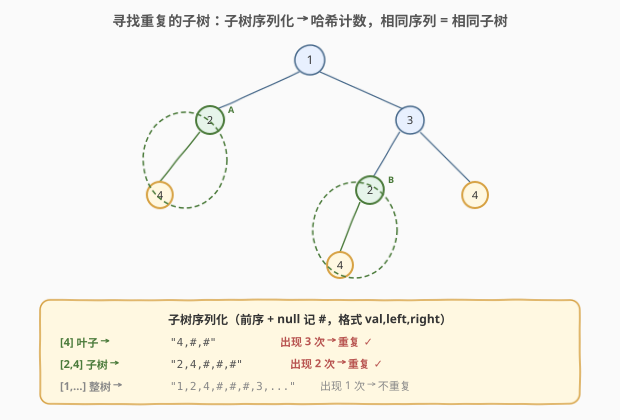
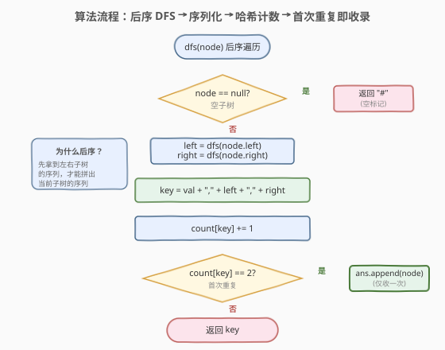
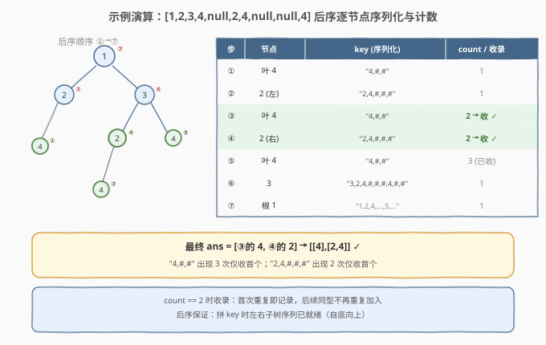

# 寻找重复的子树

- **题目名称**：寻找重复的子树
- **链接**：[652. 寻找重复的子树](https://leetcode.cn/problems/find-duplicate-subtrees/)
- **难度**：中等
- **标签**：树、二叉树、深度优先搜索、后序遍历、哈希表、序列化

## 1. 题目概述

给定一棵二叉树的根节点 `root`，返回树中**所有重复的子树**。对于同一类重复子树，只需返回**任意一个**根节点即可。

> **重复子树**：两棵子树具有**相同的结构**且**所有对应节点值相同**。

**示例 1**：

```text
输入：root = [1,2,3,4,null,2,4,null,null,4]
输出：[[2,4],[4]]

        1
       / \
      2   3
     /   / \
    4   2   4
       /
      4
```

两组重复子树：
- `[2,4]`：根为 `2`（左下）、左孩子为 `4` 的子树出现两次（根的左子，以及节点 `3` 的左子）；
- `[4]`：值为 `4` 的叶子节点出现三次。

**示例 2**：

```text
输入：root = [2,1,1]
输出：[[1]]
```

根的左右孩子各是一棵值为 `1` 的叶子，结构相同 → 重复。

**示例 3**：

```text
输入：root = [2,2,2,3,null,3,null]
输出：[[2,3],[3]]
```

**约束条件**：

- 树中节点数目范围 `[1, 5000]`
- `-200 <= Node.val <= 200`

> 💡 本题的本质是「**子树同构判定 + 去重收集**」。直接两两比较子树是 $O(n^2)$ 起步；把每棵子树**序列化成一个哈希键**，一次后序遍历即可在 $O(n)$ 内统计出所有重复——这是树形「**结构指纹**」套路的招牌题。

---

## 2. 解题思路

### 2.1 暴力思路：两两比较子树

最直观的做法：枚举所有节点对 `(u, v)`，调用 `isSameTree(u, v)` 判定两棵子树是否同构。节点对共 $O(n^2)$ 个，每次比较 $O(n)$，总时间 $O(n^3)$。即使加剪枝（同值才比）也至少 $O(n^2)$，且代码繁杂。**完全没利用「相同子树会出现多次」这一特性**——若三棵子树同构，两两比较会重复比对多次。

### 2.2 核心观察：子树序列化 + 哈希计数



**关键洞察**：如果能把**每棵子树映射成一个唯一指纹**（同一棵子树→同一指纹，不同子树→不同指纹），那么「找重复子树」就退化成「**统计出现次数 ≥ 2 的指纹**」——经典的哈希计数问题。

> 一棵子树的结构 + 节点值，可以被一段**带空位标记的遍历序列**唯一编码。这与 [297. 二叉树的序列化](../0201-0300/297_二叉树的序列化与反序列化.md) 同源：前序/后序遍历 **显式记录 `null`**，序列就能无损还原树形。

**指纹构造**（后序，`#` 表示空）：

$$
\text{serial}(node) =
\begin{cases}
\text{"\#"} & node = \text{null} \\
\text{val},\text{serial}(left),\text{serial}(right) & \text{otherwise}
\end{cases}
$$

> ⚠️ **必须记录 `null`**：若只写值不写空位，`[1,2]`（2 为左子）与 `[1,null,2]`（2 为右子）的值序列都是 `1,2`，无法区分结构。`#` 把空子树的位置显式编码，序列才与子树一一对应。

**为何用后序？** 拼当前节点的指纹需要**先拿到左右子树的指纹**——这是天然的后序（自底向上）结构。一次后序 DFS 即可为所有子树生成指纹，每个节点的指纹由其孩子指纹 $O(1)$ 拼接而成。

### 2.3 算法流程图



**DFS 完整步骤**（函数 `dfs(node)` 返回该子树的序列化字符串 `key`）：

1. **空节点**：返回 `"#"`；
2. **后序递归**：`left = dfs(node.left)`，`right = dfs(node.right)`；
3. **拼指纹**：`key = str(val) + "," + left + "," + right`；
4. **计数**：`count[key] += 1`；
5. **收录**：若 `count[key] == 2`（首次重复），把 `node` 加入答案；
6. **返回** `key` 供父节点拼接。

> 💡 **为什么是 `== 2` 而非 `>= 2`？** 题目要求同一类重复子树只返回一个根节点。第一次遇到（`count` 变 1）时还不知道是否重复；第二次遇到（`count` 变 2）时确认重复，立即收录这一个；第三次及以后（`count ≥ 3`）不再重复加入。用 `==` 天然实现「每类只收一次」。

### 2.4 示例演算

以 `root = [1,2,3,4,null,2,4,null,null,4]` 为例，后序遍历顺序与计数过程：



| 步 | 节点 | key（序列化） | count | 收录？ |
|----|------|---------------|-------|--------|
| ① | 叶 4（左下） | `4,#,#` | 1 | 否 |
| ② | 节点 2（左） | `2,4,#,#,#` | 1 | 否 |
| ③ | 叶 4（3 的左子的左子） | `4,#,#` | **2** | ✅ 收 `4` |
| ④ | 节点 2（3 的左子） | `2,4,#,#,#` | **2** | ✅ 收 `2` |
| ⑤ | 叶 4（3 的右子） | `4,#,#` | 3 | 否（已收） |
| ⑥ | 节点 3 | `3,2,4,#,#,#,4,#,#` | 1 | 否 |
| ⑦ | 根 1 | `1,2,4,#,#,#,3,...` | 1 | 否 |

最终 `ans = [③的 4, ④的 2]`，即 `[[4],[2,4]]` ✓。

> 💡 **观察「自底向上」的威力**：步骤 ② 拼 `2,4,#,#,#` 时，左子树指纹 `4,#,#`（步骤 ① 已算好）直接可用，无需重新遍历。这正是后序传递避免重复扫描的关键——与 [250. 统计同值子树](../0201-0300/250_统计同值子树.md) 的「布尔返回值传递」同构，只是这里传递的是**结构指纹字符串**而非布尔值。

---

## 3. 参考代码

### C++

```cpp
class Solution {
  public:
    unordered_map<string, int> cnt;
    vector<TreeNode*> ans;

    vector<TreeNode*> findDuplicateSubtrees(TreeNode* root) {
        dfs(root);
        return ans;
    }

    string dfs(TreeNode* node) {
        if (!node) return "#";
        string left  = dfs(node->left);
        string right = dfs(node->right);
        string key = to_string(node->val) + "," + left + "," + right;
        if (++cnt[key] == 2) ans.push_back(node);
        return key;
    }
};
```

### Python

```python
class Solution:
    def findDuplicateSubtrees(self, root: Optional[TreeNode]) -> List[Optional[TreeNode]]:
        cnt = defaultdict(int)
        ans = []

        def dfs(node: Optional[TreeNode]) -> str:
            if not node:
                return "#"
            left = dfs(node.left)
            right = dfs(node.right)
            key = f"{node.val},{left},{right}"
            cnt[key] += 1
            if cnt[key] == 2:
                ans.append(node)
            return key

        dfs(root)
        return ans
```

> 💡 两版等价。`dfs` 同时承担「生成指纹」与「计数收录」两职——返回值是子树指纹字符串供父节点拼接，副作用 `cnt[key]++` 与 `ans.append` 记录结果。这是树形「**返回值驱动父节点 + 副作用收集答案**」模板的又一实例，与 [250. 统计同值子树](../0201-0300/250_统计同值子树.md) 的「布尔返回 + 计数」骨架完全同形。

---

## 4. 复杂度分析

| 维度 | 复杂度 | 说明 |
|------|--------|------|
| 时间复杂度 | $O(n^2)$ | 每个节点访问一次；但拼指纹时字符串长度可达 $O(n)$（退化链状时指纹随深度线性增长），故最坏 $O(n^2)$。实测在 $n \le 5000$ 下可 AC |
| 空间复杂度 | $O(n^2)$ | 哈希表存所有子树指纹，单条指纹最长 $O(n)$，合计最坏 $O(n^2)$；递归栈 $O(h)$ |
| 常见情况 | 接近 $O(n)$ | 树较平衡时指纹长度 $O(\log n)$ 量级，哈希总开销接近线性 |

> ⚠️ **字符串拼接的隐藏开销**：`f"{val},{left},{right}"` 生成新字符串时需复制 `left`/`right` 的内容，长度随子树规模增长。退化链状树下，第 $i$ 层指纹长约 $O(i)$，总拼接成本 $\sum i = O(n^2)$。若要严格 $O(n)$，见第 5 节的 **UID 优化**。

---

## 5. 扩展：UID 优化到严格 $O(n)$

字符串指纹的 $O(n^2)$ 病根在于「**指纹本身随子树增长**」。换一种指纹表示——给每棵**独特的子树**分配一个整数 ID，则每个节点的指纹变成定长的 `(val, left_id, right_id)` 三元组，拼接 $O(1)$，总体严格 $O(n)$。

```python
class Solution:
    def findDuplicateSubtrees(self, root: Optional[TreeNode]) -> List[Optional[TreeNode]]:
        trees = {}        # (val, left_id, right_id) -> uid
        cnt = defaultdict(int)
        ans = []
        next_uid = [1]    # 可变计数器，uid 从 1 起（0 留给空子树）

        def dfs(node: Optional[TreeNode]) -> int:
            if not node:
                return 0                       # 空子树 uid = 0
            left_id  = dfs(node.left)
            right_id = dfs(node.right)
            triple = (node.val, left_id, right_id)
            if triple not in trees:
                trees[triple] = next_uid[0]
                next_uid[0] += 1
            uid = trees[triple]
            cnt[uid] += 1
            if cnt[uid] == 2:
                ans.append(node)
            return uid

        dfs(root)
        return ans
```

```cpp
class Solution {
  public:
    struct Triple {
        int val, l, r;
        bool operator==(const Triple& o) const {
            return val == o.val && l == o.l && r == o.r;
        }
    };
    struct TripleHash {
        size_t operator()(const Triple& t) const {
            return hash<long long>()(((long long)t.val << 34) ^ ((long long)t.l << 17) ^ t.r);
        }
    };

    unordered_map<Triple, int, TripleHash> trees;
    unordered_map<int, int> cnt;
    vector<TreeNode*> ans;
    int next_uid = 1;

    vector<TreeNode*> findDuplicateSubtrees(TreeNode* root) {
        dfs(root);
        return ans;
    }

    int dfs(TreeNode* node) {
        if (!node) return 0;
        int l = dfs(node->left);
        int r = dfs(node->right);
        Triple t{node->val, l, r};
        auto it = trees.find(t);
        int uid;
        if (it == trees.end()) {
            uid = next_uid++;
            trees[t] = uid;
        } else {
            uid = it->second;
        }
        if (++cnt[uid] == 2) ans.push_back(node);
        return uid;
    }
};
```

**核心思路**：

- 用 `(val, left_uid, right_uid)` 三元组作为子树指纹——左右子树用它们的 **UID**（而非整段字符串）表示；
- 哈希表 `trees` 维护「三元组 → UID」映射，首次见到的三元组分配新 UID；
- 空子树约定 UID = 0；
- 每个 `dfs(node)` 返回定长 int，三元组查询/插入 $O(1)$，**总体严格 $O(n)$ 时间、$O(n)$ 空间**。

> 💡 **UID 的本质是「结构共享」**：相同子树共享同一个 UID，父节点只存孩子 UID 而非孩子的完整序列——这是把「重复出现的子结构」压缩成单点引用的思想，与后缀自动机 / 字典树压缩的内在一致。面试中先讲字符串版（直观），再主动提 UID 版作为优化，是典型的加分点。

> ⚠️ C++ 版需自定义 `Triple` 的 `==` 与哈希函数（自定义结构体做 `unordered_map` 键时必须）。Python 版直接用元组作键，元组哈希天然支持。

---

## 6. 面试要点

1. **为什么要记录 `null`？不记会怎样？**

   > 不记 `null` 时，空子树的位置信息丢失，`[1,2]`（2 为左子）与 `[1,null,2]`（2 为右子）的值序列相同，无法区分结构。显式用 `#` 编码空位，序列与子树一一对应——这与 [297. 序列化二叉树](../0201-0300/297_二叉树的序列化与反序列化.md) 必须记录 `null` 的道理完全一致。

2. **为什么用后序而不是前序？**

   > 拼当前节点的指纹需要先拿到左右子树的指纹，这是「子问题结果决定父问题」的典型后序结构。前序在处理父节点时孩子指纹尚未生成，无法在一次遍历内完成拼接。这与 [250. 统计同值子树](../0201-0300/250_统计同值子树.md)「后序传递子树同值性」是同一套模板。

3. **为什么 `count == 2` 时才收录，而不是 `>= 2`？**

   > 题目要求同一类重复子树只返回一个根节点。第一次见到指纹时 `count` 变 1，尚不知是否重复；第二次 `count` 变 2 确认重复，立即收录；第三次及以后 `count ≥ 3`，若用 `>= 2` 会重复加入。用 `== 2` 天然实现「每类只收一次」，无需额外去重集合。

4. **字符串版 $O(n^2)$ 的瓶颈在哪？UID 版如何做到 $O(n)$？**

   > 字符串版拼 `val,left,right` 时需复制 `left`/`right` 全文，退化链状树下指纹长度随深度线性增长，总拼接成本 $\sum O(i) = O(n^2)$。UID 版用 `(val, left_id, right_id)` 三元组替代字符串——左右子树用定长整数 ID 表示，相同子树共享 ID，每个节点拼接 $O(1)$，总体严格 $O(n)$。本质是把「重复子结构」压缩成共享引用。

5. **如果题目改为「返回每类重复子树的所有根节点」怎么改？**

   > 把 `== 2` 改为 `>= 2`：每次遇到重复指纹（含第二、三、…次）都把当前 `node` 加入答案。或者在哈希表里存「指纹 → 节点列表」，最后筛出长度 ≥ 2 的列表展开。前者更简洁，后者适合需要按类分组返回的场景。

> 💡 **一句话总结**：652 的灵魂是「**子树结构指纹 + 哈希计数**」——后序遍历把每棵子树序列化成唯一指纹，哈希表统计出现次数，`count == 2` 时首次确认重复即收录。字符串版直观、UID 版严格线性，二者体现了「树形结构同构判定」从朴素 $O(n^3)$ 到 $O(n)$ 的完整优化链。

---

## 7. 同类练习题

- [297. 二叉树的序列化与反序列化](https://leetcode.cn/problems/serialize-and-deserialize-binary-tree/)（[题解](../0201-0300/297_二叉树的序列化与反序列化.md)）：前序 + `null` 标记唯一确定树形，是本题「子树序列化即指纹」的理论基础
- [250. 统计同值子树](https://leetcode.cn/problems/count-univalue-subtrees/)（[题解](../0201-0300/250_统计同值子树.md)）：同套「后序 DFS + 返回值驱动父节点 + 副作用收集答案」骨架，传递布尔而非字符串
- [572. 另一棵树的子树](https://leetcode.cn/problems/subtree-of-another-tree/)（[题解](../0501-0600/572_另一棵树的子树.md)）：单棵子树同构判定（KMP / 树哈希），是本题「两两同构判定」的单点版
- [508. 出现次数最多的子树元素和](https://leetcode.cn/problems/most-frequent-subtree-sum/)（[题解](../0501-0600/508_出现次数最多的子树元素和.md)）：后序 DFS 传递子树和 + 哈希计数找众数，同套「后序生成指纹 + 哈希统计」模板
- [449. 序列化和反序列化 BST](https://leetcode.cn/problems/serialize-and-deserialize-bst/)：利用 BST 性质可压缩空位，序列化思想的进阶变体
