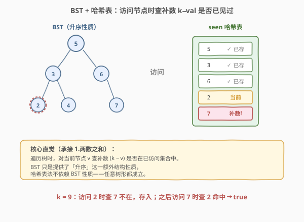
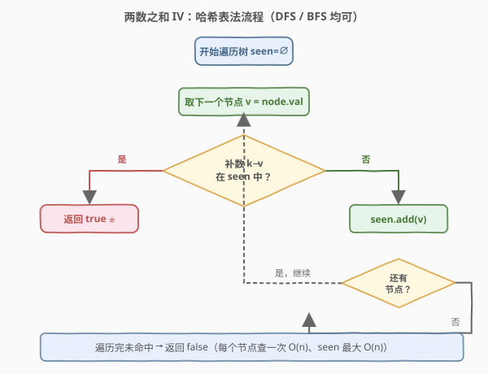
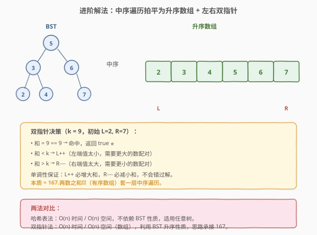

# 两数之和 IV - 输入 BST

- **题目名称**：两数之和 IV - 输入 BST
- **链接**：[653. 两数之和 IV - 输入 BST](https://leetcode.cn/problems/two-sum-iv-input-is-a-bst/)
- **难度**：简单
- **标签**：树、二叉搜索树、哈希表、双指针、DFS

## 1. 题目概述

给定一棵**二叉搜索树（BST）** 的根节点 `root` 和一个整数 `k`，判断 BST 中是否存在**两个不同节点**，它们的值之和等于 `k`。存在返回 `true`，否则返回 `false`。

**示例 1**：

```text
输入：root = [5,3,6,2,4,null,7], k = 9
输出：true
解释：节点 2 和节点 7 的值之和等于 9（2 + 7 = 9）。
```

**示例 2**：

```text
输入：root = [5,3,6,2,4,null,7], k = 28
输出：false
解释：不存在两节点之和等于 28。
```

**约束条件**：

- 二叉树的节点个数为 `[1, 10^4]`
- `-10^4 <= Node.val <= 10^4`
- `root` 为合法 BST
- `-10^5 <= k <= 10^5`

> ⚠️ 注意：虽然节点值可能重复（BST 一般定义为允许等值，本题数据范围内值不重复是常见约定），但**不能使用同一个节点两次**——即两个节点必须是不同的实例，不是「两个下标」而是「两棵子树上的节点」。

---

## 2. 解题思路

### 2.1 暴力思路：枚举所有节点对

两层 DFS 嵌套，对每对节点 `(a, b)` 判断 `a.val + b.val == k`。时间 $O(n^2)$，对 $10^4$ 节点约 $10^8$ 次操作，会超时。

问题本质：对每个节点 `v`，找「另一个值等于 `k − v`」的节点用了 $O(n)$ 线性扫描——这正是**哈希表**能优化到 $O(1)$ 的地方，和 [1. 两数之和](../0001-0100/1_两数之和.md) 完全同构。

### 2.2 核心观察：哈希表查补数，遍历顺序无关



关键直觉：要在树中找两个节点 `a + b = k`，当我们访问到 `a` 时，需要的"另一半" `b = k − a`（**补数**）是确定的。问题转化为：`b` **是否在之前已经访问过？**

用哈希表 `seen` 记录「已经访问过的节点值」，每次访问新节点 `v` 时，先查 `k − v` 是否在 `seen` 中：

- 在 → 找到答案，返回 `true`。
- 不在 → 把 `v` 存入 `seen`，继续访问其他节点。

> 💡 **BST 的升序性质在本解法里是"多余信息"**：哈希表法对任意二叉树（甚至任意数据结构）都成立，不依赖 BST 的有序性。这道题之所以给 BST，是为了引导读者想到第 5 节的「中序 + 双指针」进阶解法。面试时先说哈希表法（通用、最快），再主动提「BST 还能利用有序性做双指针」展示对数据结构的敏感度。

> ⚠️ **"先查后存"的顺序同样关键**：必须先查补数再存当前值。若先存后查，当 `k − v == v`（即 `k = 2v`）时会查到自己刚存入的值，错误地返回 `true`（实际上需要两个不同的节点）。先查后存保证查的时候表里只有"之前"访问过的节点。

### 2.3 算法流程图



整个流程是单次遍历：取节点 → 算补数 → 查哈希 → 命中返回 `true` / 未命中存入并继续。每个节点只被查一次、存一次，总时间 $O(n)$。遍历方式任意（DFS 前序/中序/后序、BFS 层序均可），效果相同。

### 2.4 示例演算

![示例演算 root=[5,3,6,2,4,null,7], k=9](../images/twosum_bst_walkthrough.svg)

以 `root = [5,3,6,2,4,null,7]`、`k = 9` 为例，按前序遍历顺序逐步演算：

| 步 | 访问节点 v | 查补数 9−v | seen（查之前） | 动作 |
|----|-----------|-----------|----------------|------|
| 1 | 5 | 4 ∈ ∅ ? | ∅ | 未命中，存入 {5} |
| 2 | 3 | 6 ∈ {5} ? | {5} | 未命中，存入 {5,3} |
| 3 | 2 | 7 ∈ {5,3} ? | {5,3} | 未命中，存入 {5,3,2} |
| 4 | 4 | 5 ∈ {5,3,2} ? | {5,3,2} | **命中** ⭐ → 返回 `true` |

> 💡 注意步骤 4 命中时，补数 `5` 是**根节点**的值，根节点先于 `4` 被访问并存入。无论遍历顺序如何（前序/中序/层序），「先访问的那个先入表，后访问的必能查到」这一不变式始终成立，所以解法与遍历顺序无关。

---

## 3. 参考代码

### C++（DFS + 哈希表）

```cpp
class Solution {
  public:
    bool findTarget(TreeNode* root, int k) {
        unordered_set<int> seen;
        return dfs(root, k, seen);
    }
  private:
    bool dfs(TreeNode* node, int k, unordered_set<int>& seen) {
        if (node == nullptr) return false;
        if (seen.count(k - node->val)) return true;   // 先查补数
        seen.insert(node->val);                        // 后存当前
        return dfs(node->left, k, seen) || dfs(node->right, k, seen);
    }
};
```

### Python（BFS + 哈希表，迭代版）

```python
class Solution:
    def findTarget(self, root: Optional[TreeNode], k: int) -> bool:
        seen = set()
        q = deque([root])
        while q:
            node = q.popleft()
            if k - node.val in seen:          # 先查补数
                return True
            seen.add(node.val)                # 后存当前
            if node.left:
                q.append(node.left)
            if node.right:
                q.append(node.right)
        return False
```

> 💡 两种写法等价：DFS 用递归栈（系统栈 $O(h)$），BFS 用队列（$O(w)$ 最大宽度）。整体空间仍以 `seen` 集合的 $O(n)$ 为主。Python 版用 BFS 避免递归栈过深（极端链状树 $h = 10^4$ 可能触达默认递归上限）。

---

## 4. 复杂度分析

| 维度 | 复杂度 | 说明 |
|------|--------|------|
| 时间复杂度 | $O(n)$ | 每个节点访问一次，每次哈希表查/插均摊 $O(1)$ |
| 空间复杂度 | $O(n)$ | `seen` 集合最坏存入 $n-1$ 个值（答案在最后两个节点）；DFS 额外递归栈 $O(h)$，BFS 额外队列 $O(w)$，均被 $O(n)$ 吸收 |

> ⚠️ BST 平衡时 $h = O(\log n)$，链状退化为 $O(n)$。本题 $n \le 10^4$，递归深度上限可控；若 $n$ 更大（如 $10^5$）且树可能链状，建议用 BFS 迭代版。

---

## 5. 扩展：中序遍历 + 双指针（利用 BST 升序性质）



既然输入是 BST，**中序遍历**会得到一个**升序数组**，于是问题归约为 [167. 两数之和 II - 输入有序数组]：在有序数组上用左右双指针 $O(n)$ 找两数之和。

**算法**：
1. 中序遍历 BST，收集节点值到升序数组 `arr`（$O(n)$ 时间、$O(n)$ 空间）。
2. 左指针 `L = 0`，右指针 `R = n−1`：
   - `arr[L] + arr[R] == k` → 命中，返回 `true`。
   - 和 `< k` → `L++`（左端太小，需要更大的数）。
   - 和 `> k` → `R−−`（右端太大，需要更小的数）。
3. `L >= R` 时未命中，返回 `false`。

### Python（中序 + 双指针）

```python
class Solution:
    def findTarget(self, root: Optional[TreeNode], k: int) -> bool:
        arr = []
        def inorder(node):
            if not node:
                return
            inorder(node.left)
            arr.append(node.val)
            inorder(node.right)
        inorder(root)

        l, r = 0, len(arr) - 1
        while l < r:
            s = arr[l] + arr[r]
            if s == k:
                return True
            elif s < k:
                l += 1
            else:
                r -= 1
        return False
```

**两种解法对比**：

| 解法 | 时间 | 空间 | 是否依赖 BST | 思路承接 |
|------|------|------|--------------|----------|
| 哈希表 | $O(n)$ | $O(n)$ | 否（任意树均可） | 1. 两数之和 |
| 中序+双指针 | $O(n)$ | $O(n)$ | 是（需升序） | 167. 两数之和 II |

> 💡 两种解法时间空间同为 $O(n)$，但**哈希表法更通用**（任意树形、甚至图、链表都行），**双指针法更"贴合 BST"**（展示对数据结构性质的利用）。面试时先给哈希表法（快、稳），再补一句「BST 还能中序拍平后用 167 题的双指针」，体现思路的层次。

> ⚠️ 还存在第三种解法：用两个迭代器（一个 `next` 取最小、一个 `prev` 取最大）边遍历边双指针，空间可降到 $O(h)$。这是 [173. 二叉搜索树迭代器] 的进阶应用，思路优雅但代码较长，面试一般讲到思路即可，本题 $n \le 10^4$ 不必追求 $O(h)$ 空间。

---

## 6. 面试要点

1. **这题和 1. 两数之和 有什么关系？**

   - 完全同构。1 题在数组里找两数之和，本题在树里找——核心都是「遍历时查补数 `k − v` 是否已见过」。差别仅是遍历方式：数组用 `for` 循环，树用 DFS/BFS。哈希表的「先查后存」逻辑一字不改地搬过来。

2. **为什么说哈希表法没有用上 BST 的性质？**

   - 哈希表法只依赖「能遍历所有节点」+「补数查找 $O(1)$」，与节点是否有序无关。换成普通二叉树、甚至链表、数组，算法照常工作。BST 的升序性质是为「中序 + 双指针」解法准备的，哈希表法把它当普通树处理。

3. **"先查后存"在这里为什么同样重要？**

   - 当 `k = 2v`（即某节点值恰好是 `k` 的一半）时，若先存后查，会查到自己刚存入的值，错误返回 `true`（实际只有一个这样的节点，不能和自己配对）。先查后存保证查的时候 `seen` 里只有「之前」访问过的节点，避免自配。这与 1 题的处理完全一致。

4. **中序 + 双指针为什么成立？单调性如何保证不漏解？**

   - BST 中序遍历得升序数组。升序数组上，`arr[L] + arr[R]` 随 `L++` 单调增、随 `R−−` 单调减。所以「和太小就 `L++`、和太大就 `R−−`」是**贪心最优**：每次移动都朝着更接近 `k` 的方向走，不会跳过任何可行解。这正是 167 题的核心证明。

5. **能否做到 $O(h)$ 空间？**

   - 可以。用两个 BST 迭代器：一个按中序正序（`next` 吐最小），一个按中序逆序（`prev` 吐最大），各自只维护 $O(h)$ 的栈。双指针比较两迭代器当前值之和，按和与 `k` 的关系推进其中一个迭代器。这样空间从 $O(n)$ 降到 $O(h)$，是 173 题 BST 迭代器的双指针延伸。本题 $n \le 10^4$，$O(n)$ 已足够，$O(h)$ 方案作为思路扩展了解即可。

6. **如果树中存在重复值（如两个节点都是 5，k = 10），算法还正确吗？**

   - 正确。哈希表存的是「值是否出现过」，不存具体节点。第一个 5 访问时查 `5 ∈ ∅` 未命中、存入；第二个 5 访问时查 `5 ∈ {5}` 命中 → 返回 `true`，对应两个不同的节点实例。关键仍是「先查后存」：第二个 5 查的时候表里只有第一个 5，不会自配。

---

## 7. 同类练习题

- [1. 两数之和](https://leetcode.cn/problems/two-sum/)（[题解](../0001-0100/1_两数之和.md)）：哈希表查补数的母题，本题是其「树形版」
- [167. 两数之和 II - 输入有序数组](https://leetcode.cn/problems/two-sum-ii-input-array-is-sorted/)：有序数组双指针，本题中序+双指针解法直接归约于此
- [173. 二叉搜索树迭代器](https://leetcode.cn/problems/binary-search-tree-iterator/)（[题解](../0101-0200/173_二叉搜索树迭代器.md)）：受控中序遍历，是 $O(h)$ 空间双指针解法的基础
- [121. 买卖股票的最佳时机](https://leetcode.cn/problems/best-time-to-buy-and-sell-stock/)（[题解](../0101-0200/121_买卖股票的最佳时机.md)）：同样用「遍历时维护已见集合/最值」的单遍扫描思路
- [15. 三数之和](https://leetcode.cn/problems/3sum/)（[题解](../0001-0100/15_三数之和.md)）：两数之和的扩展，排序 + 双指针去重，承接本题双指针思路
