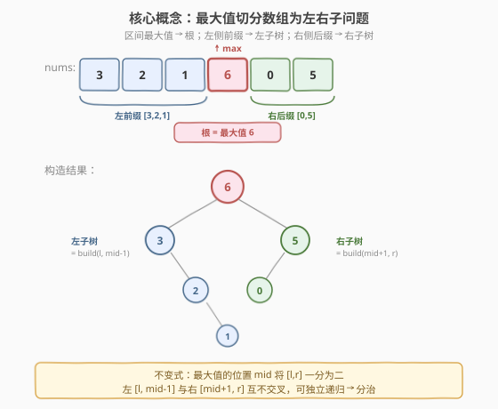
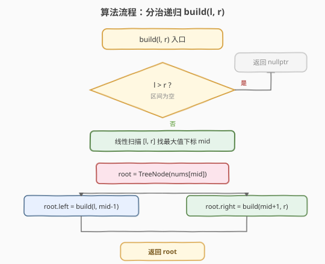
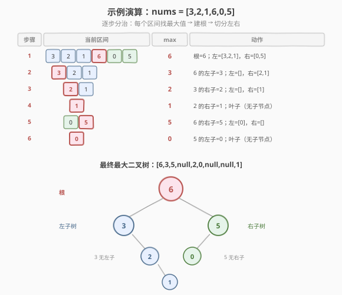

# 最大二叉树

- **题目名称**：最大二叉树
- **链接**：[654. 最大二叉树](https://leetcode.cn/problems/maximum-binary-tree/)
- **难度**：中等
- **标签**：树、二叉树、分治、递归、单调栈

## 1. 题目概述

给定一个**不重复**的整数数组 `nums`，用以下算法递归地构建**最大二叉树**：

1. 创建一个根节点，其值为 `nums` 中的**最大值**；
2. 递归地在最大值**左边**的子数组前缀上构建左子树；
3. 递归地在最大值**右边**的子数组后缀上构建右子树。

返回由 `nums` 构建的最大二叉树的根节点。

**示例 1**：

```text
输入：nums = [3,2,1,6,0,5]
输出：[6,3,5,null,2,0,null,null,1]
解释：递归调用如下：
- [3,2,1,6,0,5] 中最大值是 6，左部分 [3,2,1]，右部分 [0,5]
  - [3,2,1] 中最大值是 3，左部分 []，右部分 [2,1]
    - 空数组 → 无子节点
    - [2,1] 中最大值是 2，左部分 []，右部分 [1]
      - 空数组 → 无子节点
      - [1] → 叶子节点 1
  - [0,5] 中最大值是 5，左部分 [0]，右部分 []
    - [0] → 叶子节点 0
    - 空数组 → 无子节点
```

**示例 2**：

```text
输入：nums = [3,2,1]
输出：[3,null,2,null,1]
```

**约束条件**：

- `1 <= nums.length <= 1000`
- `0 <= nums[i] <= 1000`
- `nums` 中的所有整数**互不相同**

> 💡 「互不相同」是关键保证——它意味着每个子区间的最大值唯一，分治的划分点确定，不存在歧义。这也是后续单调栈解法成立的前提。

---

## 2. 解题思路

### 2.1 暴力思路：分治 + 线性扫描找最大值

最直观的做法是**直接模拟题目描述的算法**：对当前区间 `[l, r]` 线性扫描找出最大值及其下标 `mid`，以 `nums[mid]` 为根，再对 `[l, mid-1]` 和 `[mid+1, r]` 递归构造左右子树。

问题在于：每层递归都要 $O(\text{区间长})$ 找最大值，若数组已排序（如 `[1,2,3,4,5]`），每层只切出一个元素、递归深度 $n$，整体退化为 $O(n^2)$。对 $n \le 1000$ 尚可接受，但存在 $O(n)$ 的更优解法（见第 5 节）。

### 2.2 核心观察：最大值切分 — 分治递归构造



本题的本质是一个**分治**问题，其结构由一条不变式驱动：

> **当前区间的最大值就是当前子树的根；最大值所在位置将区间一分为二，左侧前缀递归出左子树，右侧后缀递归出右子树。**

这条不变式之所以成立，是因为「最大值切分」与「子树管辖的子数组」严格对应：

| 观察 | 说明 |
|------|------|
| **根 = 区间最大值** | 最大值比左右子数组所有元素都大，必然先于它们成为根 |
| **左子树管辖 `[l, mid-1]`** | 最大值左侧的前缀中，所有元素都小于根，它们构成根的左子树 |
| **右子树管辖 `[mid+1, r]`** | 最大值右侧的后缀同理 |
| **子问题独立** | 左右子数组互不交叉，可独立递归——满足分治的最优子结构 |

> 💡 **为什么元素互不相同很重要？** 若有重复最大值，切分点不唯一，子树结构产生歧义。题目保证互不相同，使得每个区间的最大值下标唯一，分治划分确定。

### 2.3 算法流程图



**完整步骤**：

1. **基准情形**：若 `l > r`（空区间），返回 `nullptr`。
2. **找最大值**：在 `[l, r]` 内线性扫描，记录最大值 `maxVal` 及其下标 `mid`。
3. **建根节点**：`root = TreeNode(maxVal)`。
4. **递归左子树**：`root->left = build(l, mid - 1)`。
5. **递归右子树**：`root->right = build(mid + 1, r)`。
6. 返回 `root`。

### 2.4 示例演算

以 `nums = [3,2,1,6,0,5]` 为例，分治逐步展开：



| 步骤 | 当前区间 | 最大值 | 划分 | 左子区间 | 右子区间 |
|------|----------|--------|------|----------|----------|
| 1 | [3,2,1,6,0,5] | 6 (idx=3) | 根=6 | [3,2,1] | [0,5] |
| 2 | [3,2,1] | 3 (idx=0) | 6 的左子=3 | [] | [2,1] |
| 3 | [2,1] | 2 (idx=1) | 3 的右子=2 | [] | [1] |
| 4 | [1] | 1 (idx=0) | 2 的右子=1 | — | — |
| 5 | [0,5] | 5 (idx=1) | 6 的右子=5 | [0] | [] |
| 6 | [0] | 0 (idx=0) | 5 的左子=0 | — | — |

最终树结构：`6` 左子 `3`、右子 `5`；`3` 右子 `2`（左子空）；`2` 右子 `1`（左子空）；`5` 左子 `0`（右子空）。层序序列 `[6,3,5,null,2,0,null,null,1]` 与示例一致。

> 💡 观察步骤 2：`[3,2,1]` 最大值 `3` 在最左端，左区间为空，所以 `3` 没有左子——这正是「最大值切分」的直接体现，左子树由空区间递归返回 `nullptr`。

---

## 3. 参考代码

### C++

```cpp
// 最大二叉树.cpp —— 分治递归：线性找最大值 + 切分左右子区间
// 编译: g++ -O2 -std=c++17 最大二叉树.cpp -o maxbintree
#include <vector>
using namespace std;

struct TreeNode {
    int val;
    TreeNode* left;
    TreeNode* right;
    TreeNode() : val(0), left(nullptr), right(nullptr) {}
    TreeNode(int x) : val(x), left(nullptr), right(nullptr) {}
    TreeNode(int x, TreeNode* l, TreeNode* r) : val(x), left(l), right(r) {}
};

class Solution {
public:
    TreeNode* constructMaximumBinaryTree(vector<int>& nums) {
        return build(nums, 0, (int)nums.size() - 1);
    }
private:
    TreeNode* build(vector<int>& nums, int l, int r) {
        if (l > r) return nullptr;
        int mid = l;
        for (int i = l + 1; i <= r; ++i) {
            if (nums[i] > nums[mid]) mid = i;
        }
        TreeNode* root = new TreeNode(nums[mid]);
        root->left  = build(nums, l, mid - 1);
        root->right = build(nums, mid + 1, r);
        return root;
    }
};
```

### Python

```python
class Solution:
    def constructMaximumBinaryTree(self, nums: List[int]) -> Optional[TreeNode]:
        def build(l: int, r: int) -> Optional[TreeNode]:
            if l > r:
                return None
            mid = l
            for i in range(l + 1, r + 1):
                if nums[i] > nums[mid]:
                    mid = i
            root = TreeNode(nums[mid])
            root.left = build(l, mid - 1)
            root.right = build(mid + 1, r)
            return root
        return build(0, len(nums) - 1)
```

> 💡 递归体只传递**区间边界** `l, r`，不拷贝子数组——每次切分只是收窄边界，空间零开销。`mid` 的初始值设为 `l`（而非 `-1`），保证扫描从 `l+1` 起比较时 `mid` 始终落在 `[l, r]` 内，即使区间只有一个元素也正确。

---

## 4. 复杂度分析

| 维度 | 复杂度 | 说明 |
|------|--------|------|
| 时间复杂度 | $O(n^2)$ 最坏 / $O(n \log n)$ 平均 | 每层找最大值 $O(\text{区间长})$；最坏（已排序）每层只切出一个元素、深度 $n$；平均类似快排，每层近似对半切、深度 $\log n$ |
| 空间复杂度 | $O(n)$ | 递归栈深度最坏 $n$（链状树）；无额外数组开销 |

> ⚠️ 最坏情况发生在数组**已排序**时（升序或降序），每次最大值在端点，子区间长度只减 1，退化为 $n + (n-1) + \dots + 1 = O(n^2)$。对 $n = 1000$ 约 $10^6$ 次比较，尚在可接受范围。若需 $O(n)$，见第 5 节单调栈解法。

---

## 5. 扩展：单调栈 O(n) 解法

分治解法的瓶颈在于「每层线性找最大值」。一个不那么显然但极其优雅的观察可以把整体降到 **$O(n)$**。

### 5.1 核心观察：父节点 = 左右最近更大值中较小的那个

对任意元素 `nums[i]`，定义：

- **左侧最近更大值** `L`：`nums[i]` 左边第一个比它大的元素（不存在则为 $+\infty$）；
- **右侧最近更大值** `R`：`nums[i]` 右边第一个比它大的元素（不存在则为 $+\infty$）。

则 `nums[i]` 在最大二叉树中的**父节点**是 $\min(L, R)$（取实际存在者中较小的一个）：

| 情况 | 父节点 | `nums[i]` 是父的 | 解释 |
|------|--------|------------------|------|
| `L < R`（或 `R` 不存在） | `L` | **右孩子** | `L` 先作为某层最大值切分，`nums[i]` 落入 `L` 的右侧后缀 |
| `R < L`（或 `L` 不存在） | `R` | **左孩子** | `R` 先切分，`nums[i]` 落入 `R` 的左侧前缀 |
| 两者都不存在 | — | `nums[i]` 是根 | 全局最大值 |

> 💡 **直觉理解**：分治切分时，最大值最先成为根。对 `nums[i]` 而言，离它「最近的两个更大值」中，**较小**的那个会先在递归中成为包含 `nums[i]` 的子区间的最大值（较大的那个在更外层才切分）。所以较小者就是 `nums[i]` 的直接父节点。

### 5.2 单调栈实现

用**单调递减栈**（栈底到栈顶递减）一次从左到右扫描即可同时确定每个元素的父节点：

```python
class Solution:
    def constructMaximumBinaryTree(self, nums: List[int]) -> Optional[TreeNode]:
        stack = []                       # 单调递减栈，存 TreeNode
        for x in nums:
            node = TreeNode(x)
            last = None                   # 记录最后一个被弹出的节点
            while stack and stack[-1].val < x:
                last = stack.pop()        # 这些元素的「右侧最近更大值」= x
            if last:                      # last 是 x 左侧比 x 小的最大者 → x 的左孩子
                node.left = last
            if stack:                     # 栈顶是 x 左侧第一个更大者 → x 是栈顶的右孩子
                stack[-1].right = node
            stack.append(node)
        return stack[0]                   # 栈底是全局最大值 = 根
```

**两个关键赋值的含义**：

1. `node.left = last`：弹出的最后一个节点 `last` 是 `x` 左侧最大的「比 `x` 小」的元素。`last` 的右侧最近更大值是 `x`，且 `x` 小于 `last` 的左侧最近更大值（仍在栈中），所以 `last` 的父是 `x`，作为 `x` 的**左孩子**。
2. `stack[-1].right = node`：栈顶是 `x` 的左侧最近更大值。此时 `x` 的右侧最近更大值尚未出现，故 `x` 的父是栈顶，作为栈顶的**右孩子**。（注意：若栈顶此前已有右孩子，会被覆盖——但被覆盖的那个恰好成了 `x` 的左孩子 `last`，指针没有丢失。）

### 5.3 示例演算（单调栈）

以 `nums = [3,2,1,6,0,5]` 为例：

| 步骤 | 当前元素 | 栈操作 | 弹出 | `node.left` | 栈顶.right | 栈（底→顶） |
|------|----------|--------|------|-------------|------------|-------------|
| 1 | 3 | 无弹出 | — | — | — | [3] |
| 2 | 2 | 3>2 不弹 | — | — | 3.right=2 | [3, 2] |
| 3 | 1 | 2>1 不弹 | — | — | 2.right=1 | [3, 2, 1] |
| 4 | 6 | 弹 1,2,3 | 3 | 6.left=3 | — | [6] |
| 5 | 0 | 6>0 不弹 | — | — | 6.right=0 | [6, 0] |
| 6 | 5 | 弹 0 | 0 | 5.left=0 | 6.right=5 | [6, 5] |

最终：`6` 左子 `3`、右子 `5`；`3` 右子 `2`（步骤 2 设定，步骤 4 中 3 成为 6 的左孩子后保留）；`2` 右子 `1`；`5` 左子 `0`。与分治结果完全一致。

> ⚠️ 步骤 6 中 `6.right` 从 `0` 被覆盖为 `5`，但 `0` 在弹出时已成为 `5.left`，指针未丢失——这是单调栈解法最精妙的一步，也是容易写错的地方。

### 5.4 复杂度

| 维度 | 复杂度 | 说明 |
|------|--------|------|
| 时间 | $O(n)$ | 每个元素入栈、出栈各至多一次，均摊 $O(1)$ |
| 空间 | $O(n)$ | 栈最多存 $n$ 个节点 |

---

## 6. 面试要点

1. **为什么最大值的位置能确定切分点？**

   - 最大值比当前区间所有元素都大，它必然先成为该区间的根。它左侧的所有元素构成左子数组（前缀），右侧构成右子数组（后缀），两者互不交叉，可独立递归——这是分治最优子结构的直接体现。

2. **元素互不相同这个条件重要吗？**

   - 重要。若有重复最大值，切分点不唯一（取哪个作为根？），子树结构产生歧义。互不相同保证每个子区间最大值唯一，分治划分确定。单调栈解法也依赖此条件（否则「最近更大值」需改为「最近更大或相等」并约定取法）。

3. **最坏时间复杂度何时出现？**

   - 数组已排序时。升序数组 `[1,2,...,n]` 每次最大值在右端点，左子区间长度只减 1，递归深度 $n$，总比较数 $n+(n-1)+\dots+1 = O(n^2)$。降序同理（最大值在左端点）。对 $n=1000$ 仍可通过，但面试中应主动提出单调栈优化。

4. **单调栈解法中，为什么 `node.left = last`（最后弹出的）而不是第一个弹出的？**

   - 栈是递减的，弹出顺序从栈顶（最小）到栈底。最后弹出的是弹出的元素中**最大的**，即 `x` 左侧「比 `x` 小」的元素里最大的那一个——它正是 `x` 的左子树的根（左侧前缀的最大值）。第一个弹出的是最小的，不满足「左子树根 = 左侧前缀最大值」。

5. **单调栈解法中，`stack[-1].right = node` 会覆盖原有右孩子吗？会出错吗？**

   - 会覆盖，但不会出错。被覆盖的旧右孩子正是上一轮设为栈顶右孩子的那个节点，而它在本轮被弹出并成为 `node.left`（即 `last`）。所以指针只是从「栈顶.right」迁移到「node.left」，没有丢失。这一步是单调栈解法最难理解的地方，务必用示例演算说明。

> 💡 **一句话总结**：654 的分治解法直接模拟题意——「最大值切分数组」是最自然的不变式；进阶的单调栈解法把「找最大值」转化为「找左右最近更大值」，用一次扫描确定所有父子关系，把 $O(n^2)$ 降到 $O(n)$。

---

## 7. 同类练习题

- [105. 从前序与中序遍历序列构造二叉树](https://leetcode.cn/problems/construct-binary-tree-from-preorder-and-inorder-traversal/)（[题解](../0101-0200/105_从前序与中序遍历序列构造二叉树.md)）：同为「遍历序列 → 树」的分治构造，用哈希定位根
- [106. 从中序与后序遍历序列构造二叉树](https://leetcode.cn/problems/construct-binary-tree-from-inorder-and-postorder-traversal/)（[题解](../0101-0200/106_从中序与后序遍历序列构造二叉树.md)）：105 的镜像题，根在后序末尾
- [998. 最大二叉树 II](https://leetcode.cn/problems/maximum-binary-tree-ii/)：654 的续作，在末尾追加一个元素后重建，可用单调栈思想 $O(n)$ 解决
- [503. 下一个更大元素 II](https://leetcode.cn/problems/next-greater-element-ii/)（[题解](../0501-0600/503_下一个更大元素 II.md)）：单调栈找「右侧最近更大值」的母题，654 单调栈解法的核心组件
- [739. 每日温度](https://leetcode.cn/problems/daily-temperatures/)（[题解](../0701-0800/739_每日温度.md)）：单调栈经典应用，理解 654 单调栈解法的基础
