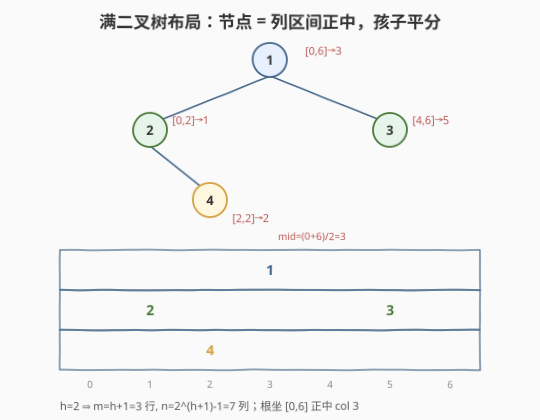
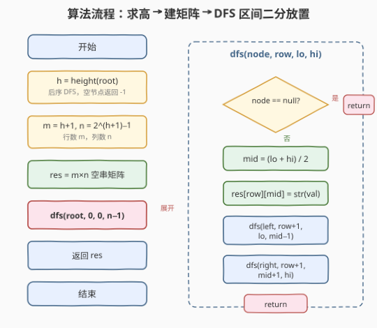
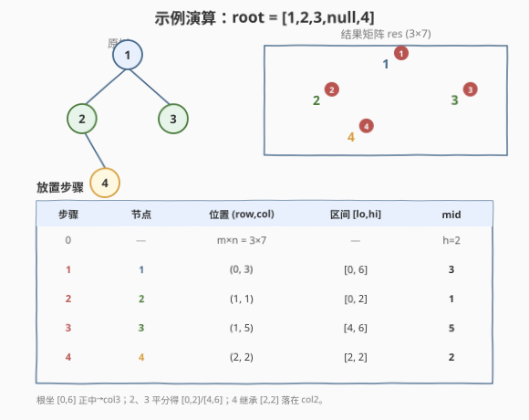

# LeetCode 输出二叉树 题解

## 1. 题目概述

- **标题 / 题号**：输出二叉树（#655，medium）
- **链接**：https://leetcode.cn/problems/print-binary-tree/
- **难度**：中等
- **标签**：树、二叉树、深度优先搜索（DFS）、递归

**题意**：给你一棵二叉树的根节点 `root`，请你构造一个下标从 0 开始、大小为 `m x n` 的字符串矩阵 `res`，用以表示树的**格式化布局**。构造规则：

1. 树的**高度**为 `height`，矩阵**行数** `m = height + 1`。
2. 矩阵**列数** `n = 2^(height+1) - 1`。
3. **根节点**放置在顶行正中间，即 `res[0][(n-1)/2]`。
4. 对每个已放置节点 `res[r][c]`，其**左子节点**放在 `res[r+1][c - 2^(height-r-1)]`，**右子节点**放在 `res[r+1][c + 2^(height-r-1)]`。
5. 任意空单元格填空字符串 `""`。

返回构造得到的矩阵 `res`。

**示例 1**：

```text
输入：root = [1,2]
输出：[["","1",""],
       ["2","",""]]
解释：树高 height = 1，m = 2 行，n = 2^2 - 1 = 3 列。
      根 1 放 (0,1)；左子 2 放 (1, 1 - 2^0) = (1,0)。
```

**示例 2**：

```text
输入：root = [1,2,3,null,4]
输出：[["","","","1","","",""],
       ["","2","","","","3",""],
       ["","","4","","","",""]]
解释：树高 height = 2，m = 3 行，n = 2^3 - 1 = 7 列。
      根 1 放 (0,3)；2 放 (1,1)、3 放 (1,5)；4 放 (2,2)。
```

**约束**：

- 树中节点数在范围 `[1, 2^10]` 内
- `-99 <= Node.val <= 99`
- 树的深度在范围 `[1, 10]` 内

> 💡 关键约束是**深度 ≤ 10**：它保证列数 $n = 2^{h+1}-1 \le 2^{11}-1 = 2047$，整个矩阵至多约 $11 \times 2047 \approx 2.2\times10^4$ 个单元格，规模很小。深度上限是「满二叉树布局」不会爆炸的根本保证——若深度无界，列数会指数增长。

## 2. 解题思路

### 2.1 直接思路：照搬题面偏移公式

最直白的做法是**逐字翻译题面**：先用一次 DFS 求出树高 `h`，算出 `m = h+1`、`n = 2^(h+1)-1`，初始化全 `""` 矩阵；再从根出发，按公式 `左 = (r+1, c - 2^(h-r-1))`、`右 = (r+1, c + 2^(h-r-1))` 递归放置每个节点。

这个做法正确且高效，但有一个不太优雅的地方：偏移量 $2^{h-r-1}$ 是个**外加的「魔法数」**，要靠「记住题面公式」才能写对，不容易从直觉上理解为什么偏偏是它。下面用一个更自然的视角重新推导，会发现那个公式其实是个**必然结果**。

### 2.2 核心观察：满二叉树布局 — 区间二分放置



把矩阵的列想象成「补全成满二叉树后的下标」。给每个节点分配一段**专属列区间 `[lo, hi]`**，它代表「这棵子树在满二叉树中占据的列范围」。放置规则只有一条：

> **节点坐在自己区间的正中 `mid = (lo + hi) / 2`；左子树继承左半区间 `[lo, mid-1]`，右子树继承右半区间 `[mid+1, hi]`。**

这条规则自带三重好处：

| 观察 | 说明 |
|------|------|
| **根区间 = 整行** | 根的区间是 `[0, n-1]`，正中 `(n-1)/2` 恰是题面规定的根列 |
| **孩子区间 = 父区间的一半** | 每放一层，区间宽度减半，所以孩子相对父的列偏移恰好是 $2^{h-r-1}$——题面公式不证自得 |
| **空位天然出现** | 没有左/右孩子时，对应半区间无人继承，自动留作 `""`，无需显式补空 |

> 💡 **为什么这就是「满二叉树布局」？** 因为「区间二分」等价于「在补全后的满二叉树里按位置填值」：每一层把可用的列对半劈，左子树用左半、右子树用右半。缺失的子树对应的半区间没有节点去填，于是那些列保持 `""`——这正是题面要求的「空单元格填空串」。偏移公式 $2^{h-r-1}$ 不过是「父区间宽度的一半」的闭式表达。

### 2.3 算法流程图



**完整步骤**：

1. **求树高**：后序 DFS，`height(node) = 1 + max(height(left), height(right))`，**空节点返回 `-1`**（这样叶子高度为 `0`，单节点树 `h=0`）。
2. **定矩阵尺寸**：`m = h + 1`，`n = (1 << (h + 1)) - 1`；初始化 `m × n` 全 `""`。
3. **DFS 放置** `dfs(node, row, lo, hi)`：
   - `node` 为空 → 直接返回；
   - `mid = (lo + hi) / 2`，`res[row][mid] = str(node->val)`；
   - `dfs(node->left,  row+1, lo, mid-1)`；
   - `dfs(node->right, row+1, mid+1, hi)`。
4. **入口调用**：`dfs(root, 0, 0, n-1)`，返回 `res`。

### 2.4 示例演算

以 `root = [1,2,3,null,4]` 为例，`h = 2`，`m = 3`，`n = 7`：



| 步骤 | 节点 | 位置 (row, col) | 区间 [lo, hi] | mid |
|------|------|-----------------|---------------|-----|
| 0 | — | m×n = 3×7 | — | h=2 |
| 1 | 1（根） | (0, 3) | [0, 6] | 3 |
| 2 | 2（1 的左子） | (1, 1) | [0, 2] | 1 |
| 3 | 3（1 的右子） | (1, 5) | [4, 6] | 5 |
| 4 | 4（2 的右子） | (2, 2) | [2, 2] | 2 |

> 💡 注意步骤 4：节点 `2` 的区间是 `[0,2]`，它**没有左子**，所以左半区间 `[0,0]` 无人继承、保持空串；**右子 4** 继承右半区间 `[2,2]`，`mid = 2`，落在 `col 2`。这正是示例输出第 3 行 `["","","4","","","",""]` 的由来——空位由「无人继承的半区间」自然产生，无需任何特判。

## 3. 参考代码

### C++

```cpp
// 输出二叉树.cpp —— 求高 + DFS 区间二分放置
// 编译: g++ -O2 -std=c++17 输出二叉树.cpp -o printbintree
#include <vector>
#include <string>
#include <algorithm>
using namespace std;

struct TreeNode {
    int val;
    TreeNode* left;
    TreeNode* right;
    TreeNode() : val(0), left(nullptr), right(nullptr) {}
    TreeNode(int x) : val(x), left(nullptr), right(nullptr) {}
    TreeNode(int x, TreeNode* l, TreeNode* r) : val(x), left(l), right(r) {}
};

class Solution {
public:
    vector<vector<string>> printTree(TreeNode* root) {
        int h = height(root);                    // 树高（边数），单节点为 0
        int n = (1 << (h + 1)) - 1;              // 列数 = 2^(h+1) - 1
        vector<vector<string>> res(h + 1, vector<string>(n, ""));
        dfs(root, 0, 0, n - 1, res);
        return res;
    }
private:
    int height(TreeNode* node) {
        if (!node) return -1;                    // 空节点贡献 -1，使叶子高度为 0
        return 1 + max(height(node->left), height(node->right));
    }
    void dfs(TreeNode* node, int row, int lo, int hi, vector<vector<string>>& res) {
        if (!node) return;
        int mid = (lo + hi) / 2;
        res[row][mid] = to_string(node->val);
        dfs(node->left,  row + 1, lo,      mid - 1, res);
        dfs(node->right, row + 1, mid + 1, hi,      res);
    }
};
```

### Python

```python
from typing import Optional, List


class Solution:
    def printTree(self, root: Optional[TreeNode]) -> List[List[str]]:
        def height(node: Optional[TreeNode]) -> int:
            if not node:
                return -1                    # 空节点贡献 -1，使叶子高度为 0
            return 1 + max(height(node.left), height(node.right))

        h = height(root)
        n = (1 << (h + 1)) - 1               # 列数 = 2^(h+1) - 1
        res = [[""] * n for _ in range(h + 1)]

        def dfs(node: Optional[TreeNode], row: int, lo: int, hi: int) -> None:
            if not node:
                return
            mid = (lo + hi) // 2
            res[row][mid] = str(node.val)
            dfs(node.left,  row + 1, lo,      mid - 1)
            dfs(node.right, row + 1, mid + 1, hi)

        dfs(root, 0, 0, n - 1)
        return res
```

> 💡 递归体只传**区间边界** `lo, hi`，不传「当前列」——列由 `mid = (lo+hi)/2` 当场算出。这样左右两个递归调用天然携带各自的子区间，无需在外层维护额外坐标。`height` 里空节点返回 `-1` 是个小技巧：它让「叶子高度 = 0」与「单节点树 `h=0`、`m=1`、`n=1`」自洽，根落 `(0,0)`，边界无需特判。

## 4. 复杂度分析

| 维度 | 复杂度 | 说明 |
|------|--------|------|
| 时间复杂度 | $O(h \cdot 2^h)$ | 初始化 `m×n` 矩阵需 $O((h+1)(2^{h+1}-1))$；DFS 访问每个节点一次 $O(\text{节点数}) \le O(2^{h+1})$，被矩阵初始化主导 |
| 空间复杂度 | $O(h \cdot 2^h)$ | 输出矩阵本身占 $O((h+1)(2^{h+1}-1))$；额外递归栈 $O(h)$，可忽略 |

> ⚠️ 复杂度由**输出矩阵的尺寸**决定，而非节点数。这正是深度上限 $\le 10$ 至关重要的原因：它把 $2^{h+1}$ 钉死在 $\le 2048$，矩阵规模可控。若深度无界，一棵退化成链的树深度 $h$ 也会让列数 $2^{h+1}$ 指数爆炸——本题用约束直接规避了这点。不计输出矩阵的话，辅助空间仅 $O(h)$ 递归栈。

## 5. 扩展：BFS 层序 + 偏移公式

DFS 区间二分用 `[lo, hi]` 隐式表达了偏移；若想**直接复刻题面公式**，可用 BFS 层序放置——队列里携带 `(节点, 行, 列)`，每弹出一个节点，按公式算出孩子列偏移 $2^{h-r-1}$ 后入队：

```python
from collections import deque
from typing import Optional, List


class Solution:
    def printTree(self, root: Optional[TreeNode]) -> List[List[str]]:
        def height(node: Optional[TreeNode]) -> int:
            if not node:
                return -1
            return 1 + max(height(node.left), height(node.right))

        h = height(root)
        m, n = h + 1, (1 << (h + 1)) - 1
        res = [[""] * n for _ in range(m)]
        q = deque([(root, 0, (n - 1) // 2)])          # (节点, 行, 列)
        while q:
            node, r, c = q.popleft()
            res[r][c] = str(node.val)
            offset = 1 << (h - r - 1)                 # 该层孩子列偏移 = 2^(h-r-1)
            if node.left:
                q.append((node.left, r + 1, c - offset))
            if node.right:
                q.append((node.right, r + 1, c + offset))
        return res
```

**两种写法等价性**：BFS 里的 `offset = 2^(h-r-1)` 正是 DFS 里「父区间宽度的一半」——父区间宽度为 `hi - lo + 1 = 2^(h-r+1)`（根在 `r=0` 时宽度 `2^(h+1)-1 ≈ 2^(h+1)`），一半即 `2^(h-r)`，对应到**孩子所在的下一层** `r+1` 的偏移 `2^(h-(r+1)) = 2^(h-r-1)`。殊途同归。BFS 版无需传区间、按层处理直观；DFS 版无需算幂、代码更短，两者皆为 $O(h \cdot 2^h)$。

> 💡 选型上，DFS 区间二分是更推荐的「主解」——它把偏移公式还原成「区间二分」的几何直觉，写出错的可能性更低；BFS 版则适合在面试中作为「我也能直接用题面公式实现」的对照，体现对两种遍历的掌控。

## 6. 面试要点

1. **树高怎么定义？为什么空节点返回 -1？**

   - 本题的 `height` 是「最长根到叶路径的**边数**」，单节点树 `h = 0`。后序递归定义为 `h(node) = 1 + max(h(left), h(right))`，空节点返回 `-1`，使叶子 `1 + max(-1,-1) = 0`，与定义自洽。由此 `m = h+1` 行、`n = 2^(h+1)-1` 列：单节点时 `m=1, n=1`，根落 `(0,0)`，边界天然正确，无需特判。

2. **为什么用「区间二分」而不是直接套题面的偏移公式？**

   - 偏移 $2^{h-r-1}$ 是个「魔法数」，记错就全盘错。区间二分把它还原成几何：节点坐区间正中，孩子继承左/右半区间。偏移变成「父区间宽度的一半」这个**必然结果**而非外加公式，更难写错，也更好向面试官解释。两者数学等价。

3. **空单元格需要特判吗？**

   - 不需要。这是区间二分的核心优势：节点缺失时，对应半区间无人继承，那些列保持初始化的 `""`。代码里 `if (!node) return;` 只挡住「递归进入空子树」，不会去写任何单元格——空位自动留空。题面要求的「空单元格填空串」由初始化 + 不覆盖天然满足。

4. **矩阵规模由什么决定？深度无界会怎样？**

   - 由树高 $h$ 决定：列数 $n = 2^{h+1}-1$ 指数增长。题目约束深度 $\le 10$，故 $n \le 2047$，矩阵至多约 $2.2\times 10^4$ 格，完全可控。若深度无界，即便树退化成链（节点数线性），列数仍会 $2^{h+1}$ 指数爆炸，内存不可承受——所以本题的复杂度由**输出尺寸**而非节点数主导，这是和一般树题最大的不同。

5. **DFS 和 BFS 两种实现怎么选？**

   - 两者时间、空间同为 $O(h \cdot 2^h)$。DFS 区间二分代码短、无需算幂、直觉清晰，作主解；BFS 层序 + 偏移公式直接对应题面描述，适合作对照。面试中先讲 DFS 的「区间二分」洞察，再说明它等价于题面偏移公式，最后提 BFS 版作为另一种遍历选择，层次分明。

> 💡 **一句话总结**：655 的灵魂是「**把树补全成满二叉树，每个节点坐自己区间的正中，孩子平分剩余**」。区间二分让题面那个看起来任意的偏移公式 $2^{h-r-1}$ 成为几何必然，空位由「无人继承的半区间」自然产生——无需特判、无需补空，递归体只传 `[lo, hi]` 即可。

## 同类练习题

| # | 题目 | 与本题的关联 |
|---|------|-------------|
| 662 | [二叉树最大宽度](https://leetcode.cn/problems/maximum-width-of-binary-tree/)（[题解](../0601-0700/662_二叉树最大宽度.md)） | 同属「满二叉树位置/编号」体系，用 `左=2i+1, 右=2i+2` 编号还原空位跨度，与本题「列位置 = 满二叉树下标」同源 |
| 958 | [二叉树的完全性检验](https://leetcode.cn/problems/check-completeness-of-a-binary-tree/) | 层序 + 编号判空洞，完全性等价于编号连续无缺——编号思想的另一应用 |
| 222 | [完全二叉树的节点个数](https://leetcode.cn/problems/count-complete-tree-nodes/)（[题解](../0201-0300/222_完全二叉树的节点个数.md)） | 利用完全二叉树编号性质 + 二分，同属「编号体系」应用 |
| 104 | [二叉树的最大深度](https://leetcode.cn/problems/maximum-depth-of-binary-tree/)（[题解](../0101-0200/104_二叉树的最大深度.md)） | 本题先求 `height` 的基础，后序 DFS 求高度模板的母题 |
| 102 | [二叉树的层序遍历](https://leetcode.cn/problems/binary-tree-level-order-traversal/)（[题解](../0101-0200/102_二叉树的层序遍历.md)） | 第 5 节 BFS 扩展解法的 `while + for(size)` 骨架来源 |
