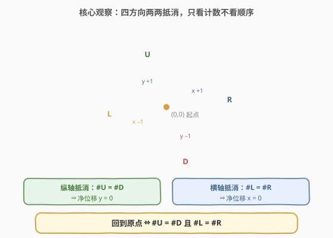
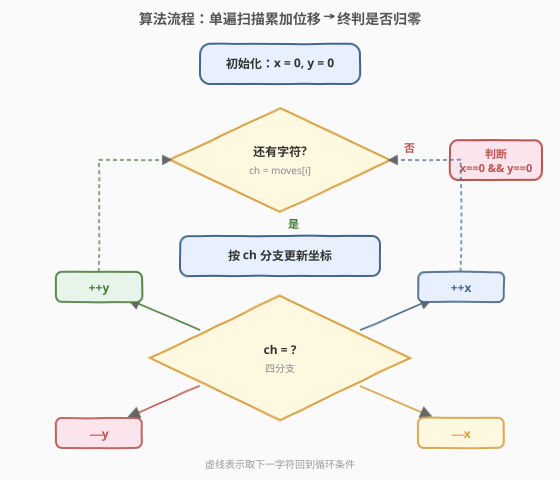
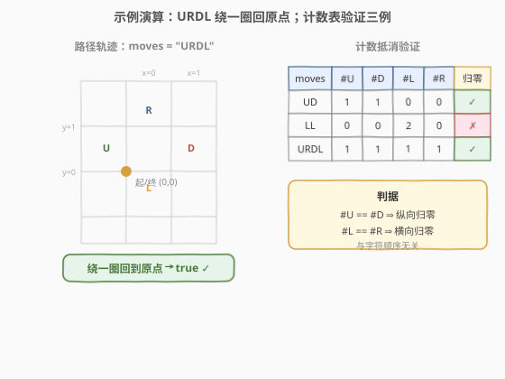

# LeetCode 机器人能否返回原点 题解

## 1. 题目概述

- **标题 / 题号**：机器人能否返回原点（#657，easy）
- **链接**：https://leetcode.cn/problems/robot-return-to-origin/
- **难度**：简单
- **标签**：字符串、计数、模拟

**题意**：在二维平面上，机器人从原点 $(0, 0)$ 出发。给定一个由字符 `'U'`、`'D'`、`'L'`、`'R'` 组成的字符串 `moves`，依次表示机器人每次移动的方向：

- `'U'`：向上（$y + 1$）
- `'D'`：向下（$y - 1$）
- `'L'`：向左（$x - 1$）
- `'R'`：向右（$x + 1$）

执行完所有移动后，若机器人**回到原点** $(0, 0)$，返回 `true`；否则返回 `false`。

**示例 1**：

```text
输入：moves = "UD"
输出：true
解释：U 上移到 (0,1)，D 下移回 (0,0)，回到原点。
```

**示例 2**：

```text
输入：moves = "LL"
输出：false
解释：L 左移到 (−1,0)，再 L 左移到 (−2,0)，未回原点。
```

**约束**：

- $1 \leq \text{moves.length} \leq 2 \times 10^4$
- `moves[i]` 仅包含字符 `'U'`、`'D'`、`'L'`、`'R'`

> 💡 **关键观察**：四个方向两两共线且互为逆运算——`U` 与 `D` 都沿纵轴、方向相反；`L` 与 `R` 都沿横轴、方向相反。由于**加法可交换**，移动顺序不影响最终落点，只看每个方向的**出现次数**能否成对抵消。本题是「计数抵消判定」的最简形态，与 [242. 有效的字母异位词](../0201-0300/242_有效的字母异位词.md) 的「频次相等即同构」同构。

## 2. 解题思路

### 2.1 暴力思路：逐步模拟坐标

最直观的做法：维护坐标 $(x, y)$，遍历 `moves`，按字符更新坐标，最后判断 $(x, y) == (0, 0)$。

```text
x = 0, y = 0
for ch in moves:
    if ch == 'U': y += 1
    elif ch == 'D': y -= 1
    elif ch == 'L': x -= 1
    elif ch == 'R': x += 1
return x == 0 and y == 0
```

时间 $O(n)$，空间 $O(1)$——复杂度已经最优。但它在思路上**把每一步都当独立状态变化**，没有利用「方向可成对抵消」的结构。

> ⚠️ 瓶颈不在复杂度，而在**视角**：逐字符改坐标把问题看成「时序轨迹」，忽略了「移动可交换」这一不变量。换上「计数」视角，问题立刻退化成「两组数是否相等」的判定。

### 2.2 核心观察：四方向两两抵消，只看计数不看顺序



关键观察有两点：

1. **方向两两共线且互逆**：`U` 与 `D` 都作用在 $y$ 轴上、符号相反，一个 `U` 必被一个 `D` 抵消；`L` 与 `R` 同理作用在 $x$ 轴上。最终位置只取决于「净计数」：$y_{\text{净}} = \#U - \#D$，$x_{\text{净}} = \#R - \#L$。
2. **顺序无关（交换律）**：由于各方向位移是**向量的加法**，而向量加法满足交换律，`"UD"`、`"DU"`、`"U...D..."` 的最终落点完全相同。因此**不必模拟轨迹**，只需统计四个字符的出现次数。

由此得到判据：

$$
\text{回到原点} \iff \#U = \#D \;\text{且}\; \#L = \#R
$$

> 💡 **与逐字符模拟的关系**：两者复杂度同为 $O(n)/O(1)$，但计数视角揭示了问题的代数结构——这是一道披着「模拟」外衣的「计数抵消」题。该视角还能直接写出「数次数」的紧凑实现（见第 3 节 Python 一行版），且为后续「能否提前剪枝」「为何不能提前返回」的讨论（第 5 节）提供理论依据。

### 2.3 算法流程图



**完整步骤**：

1. **初始化**：`x = 0`，`y = 0`。
2. **遍历** `moves` 中每个字符 `ch`：
   - `'U'`：`++y`
   - `'D'`：`--y`
   - `'L'`：`--x`
   - `'R'`：`++x`
3. **终止判定**：返回 `x == 0 && y == 0`。

> 💡 也可以维护两个「净计数」变量 `v = #U - #D`、`h = #R - #L`，与维护 `(x, y)` 等价——都是把同轴方向合并成一个累加器。本质上是把 4 个计数压缩成 2 个带符号的差值，省去最后做减法。

### 2.4 示例演算

以 `moves = "URDL"` 为例（绕一圈回到原点）：



| 步骤 | 字符 | 动作 | 坐标 (x, y) |
|------|------|------|-------------|
| 初始 | — | — | (0, 0) |
| 1 | U | y += 1 | (0, 1) |
| 2 | R | x += 1 | (1, 1) |
| 3 | D | y -= 1 | (1, 0) |
| 4 | L | x -= 1 | (0, 0) |

最终 $(0, 0)$，返回 `true` ✓。计数视角验证：$\#U=1=\#D$、$\#L=1=\#R$，两轴均归零。

再看 `moves = "LL"`：$\#L=2$、$\#R=0$，横轴净位移 $x = -2 \ne 0$，返回 `false` ✗。

> 💡 注意 `"URDL"` 虽中途偏离原点到 $(1,1)$，但最终仍回归——这正说明**中间轨迹无关紧要**，只有终点净计数说了算，也印证了「为何不能在遍历中提前返回」（见 5.1）。

## 3. 参考代码

### C++

```cpp
// 机器人能否返回原点.cpp —— 计数抵消：维护两个净计数 v/h
// 编译: g++ -O2 -std=c++17 机器人能否返回原点.cpp -o robotorigin
#include <string>
class Solution {
  public:
    bool judgeCircle(const std::string& moves) {
        int v = 0, h = 0;          // v: 纵向 #U-#D，h: 横向 #R-#L
        for (char ch : moves) {
            if (ch == 'U')      ++v;
            else if (ch == 'D') --v;
            else if (ch == 'R') ++h;
            else if (ch == 'L') --h;
        }
        return v == 0 && h == 0;   // 两轴净计数皆零即回原点
    }
};
```

### Python

```python
class Solution:
    def judgeCircle(self, moves: str) -> bool:
        v = h = 0                   # v: #U-#D, h: #R-#L
        for ch in moves:
            if ch == 'U':
                v += 1
            elif ch == 'D':
                v -= 1
            elif ch == 'R':
                h += 1
            elif ch == 'L':
                h -= 1
        return v == 0 and h == 0
```

> 💡 **Python 一行版**（直接套判据，4 次 `count` 遍历，$n \le 2\times10^4$ 完全可接受）：
> ```python
> class Solution:
>     def judgeCircle(self, moves: str) -> bool:
>         return moves.count('U') == moves.count('D') and moves.count('L') == moves.count('R')
> ```
> 该写法把「计数抵消」判据写得最直白，代价是 4 趟扫描。单遍扫描版把 4 个计数压成 2 个带符号累加器，一趟搞定，更省常数。

## 4. 复杂度分析

| 维度 | 复杂度 | 说明 |
|------|--------|------|
| 时间复杂度 | $O(n)$ | 单遍扫描 `moves`，每个字符 $O(1)$ 分支更新；$n = \text{moves.length}$ |
| 空间复杂度 | $O(1)$ | 仅用 `v`/`h`（或 `x`/`y`）两个整数累加器 |

> 💡 本题最优解：时间已达下界 $O(n)$（必须至少读一遍输入），空间为常数。Python 一行版虽 4 趟 `count` 仍为 $O(n)$，常数大 4 倍但在 $n \le 2\times10^4$ 下毫无压力。

## 5. 扩展：为什么顺序无关？能否提前剪枝？

### 5.1 为什么不能在遍历中提前返回 `true`？

一个自然设想：「若中途回到 $(0,0)$，是否就能提前返回 `true`？」**不能**。反例：`moves = "UDRL"` —— 第 2 步 `UD` 后已回到原点，但后续 `RL` 会再次把机器人移到 $(-1, 1)$，最终不归零。

根本原因：**是否回到原点取决于「整段序列的净位移」，而非任一前缀**。前缀归零只说明「已抵消的部分」净值为零，后续未读字符仍可能引入新的非零位移。因此必须读完整串、看终态净计数，无法安全提前终止。

> ⚠️ 唯一能提前返回的是 `false` 吗？也不行：即便当前某轴净计数已很大，后续字符仍可能恰好抵消（如 `moves = "UUUDDDD"`，前缀 `UUU` 后 $y=3$ 险象环生，但最终归零）。故正反两方向都不能基于前缀剪枝，**必须扫到尾**。

### 5.2 顺序无关的代数本质：交换群

把每个移动看作二维向量：$U=(0,1)$、$D=(0,-1)$、$L=(-1,0)$、$R=(1,0)$。机器人的终点为所有向量的和：

$$
\vec{P} = \sum_{i} \vec{m_i}
$$

向量加法满足**交换律与结合律**，故求和结果与顺序无关，只取决于「每种向量出现几次」。更进一步，$\{U, D\}$ 互为逆元、$\{L, R\}$ 互为逆元，整个移动集合在向量加法下构成一个**交换群**（准确地说是 $\mathbb{Z}^2$ 的一个子集生成的群）。回到原点 ⇔ 总和在群中等于单位元 $\vec{0}$ ⇔ 每对互逆元素的计数相等。

> 💡 这一视角解释了为何计数抵消成立：互逆元素成对出现时必然相消，与排列无关。它也是 [242. 有效的字母异位词](../0201-0300/242_有效的字母异位词.md)「频次相等即字母异位」的同构——两者本质都是「多集合相等判定」。

| 视角 | 表述 | 适用场景 |
|------|------|----------|
| 模拟 | 逐字符改 $(x, y)$，看终态 | 通用，方向带障碍/转向时仍可用（如 [874. 模拟行走机器人](https://leetcode.cn/problems/walking-robot-simulation/)） |
| 计数抵消 | $\#U=\#D$ 且 $\#L=\#R$ | 仅当方向固定、无障碍、无转向时（本题） |
| 群论 | 互逆元素计数相等 ⇒ 总和为单位元 | 揭示本质，便于推广到带斜向移动的变体 |

## 6. 面试要点

1. **为什么只统计计数就够了？**
   - 四个方向位移是向量加法，满足交换律，最终位置只取决于各方向出现次数，与顺序无关。`U` 与 `D` 在 $y$ 轴上互逆、`L` 与 `R` 在 $x$ 轴上互逆，故 $\#U=\#D$ 且 $\#L=\#R$ 即回原点。

2. **逐字符模拟和计数法复杂度有区别吗？**
   - 都是 $O(n)$ 时间、$O(1)$ 空间。区别在视角与常数：计数法把 4 个方向压成 2 个带符号累加器（`v=#U-#D`、`h=#R-#L`），一趟扫描即可；Python 一行版用 4 次 `count` 仍是 $O(n)$ 但常数大 4 倍。本题数据量小，任一写法都通过。

3. **能否在中途回到原点时提前返回 `true`？**
   - 不能。前缀归零不代表整段归零，后续字符可能再次偏离（如 `"UDRL"` 第 2 步已归零但最终不归零）。是否回原点只取决于整段净位移，必须扫到尾。

4. **能否在净位移很大时提前返回 `false`？**
   - 也不能。即便中途某轴净计数很大，后续字符仍可能恰好抵消（如 `"UUUDDDD"`）。正反两向都无法基于前缀安全剪枝。

5. **如果加入「斜向移动」（如 `↗` 同时改 x、y）思路还成立吗？**
   - 仍成立，但每个方向需同时更新两个累加器（如 `↗` 使 `++v, ++h`）。判据仍是「所有累计归零」，只是分支增多。群论视角下，只要新增向量可被现有方向线性组合表示，仍属于同一交换群结构。

## 同类练习题

| # | 题目 | 与本题的关联 |
|---|------|-------------|
| 242 | [有效的字母异位词](https://leetcode.cn/problems/valid-anagram/)（[题解](../0201-0300/242_有效的字母异位词.md)） | 频次计数判定两串字母构成相同，与本题「计数相等即抵消」同构，多集合相等判定的招牌题 |
| 383 | [赎金信](https://leetcode.cn/problems/ransom-note/)（[题解](../0301-0400/383_赎金信.md)） | 字符频次计数判定包含关系，计数抵消的另一面（不等变为包含） |
| 874 | [模拟行走机器人](https://leetcode.cn/problems/walking-robot-simulation/) | 机器人带转向指令与障碍物，方向不再固定、需维护朝向向量，本题的「带障碍+转向」升级版（计数法失效，回到模拟） |
| 2069 | [模拟行走机器人 II](https://leetcode.cn/problems/walking-robot-simulation-ii/) | 带环面边界与方向状态的有返回值行走模拟，进一步复杂化（仍需逐步模拟，无法纯计数） |
