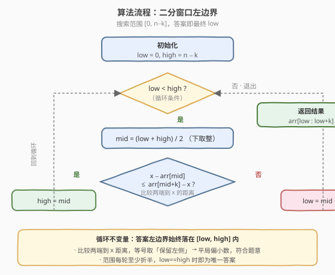

# LeetCode 找到 K 个最接近的元素 题解

## 1. 题目概述

- **标题 / 题号**：找到 K 个最接近的元素（#658，medium）
- **链接**：https://leetcode.cn/problems/find-k-closest-elements/
- **难度**：中等
- **标签**：二分查找、数组、双指针

**题意**：给定一个**升序排序**的整数数组 `arr`，以及两个整数 `k` 和 `x`。从数组中找出**最接近 `x`** 的 `k` 个整数，并按**升序**返回。

「接近度」判定规则：整数 `a` 比 `b` 更接近 `x`，当且仅当 $|a - x| < |b - x|$，或 $|a - x| = |b - x|$ 且 $a < b$（**平局取较小数**）。

**示例 1**：

```text
输入：arr = [1,2,3,4,5], k = 4, x = 3
输出：[1,2,3,4]
解释：4 个最接近 3 的数。5 距 3 为 2，与 1 距 3 为 2 平局，平局取较小数 → 取 1 而非 5。
```

**示例 2**：

```text
输入：arr = [1,2,3,4,5], k = 4, x = -1
输出：[1,2,3,4]
解释：x=-1 在数组左侧之外，最接近的 4 个数即数组最小的 4 个。
```

**约束**：

- $1 \le k \le \text{arr.length} \le 10^4$
- `arr` 已按**升序**排列
- $-10^4 \le \text{arr[i]}, x \le 10^4$

> 💡 这是一道经典「**二分窗口左边界**」题，在字节、阿里面经中常作为二分查找的进阶追问出现。核心观察是：**最终答案一定是数组中一段长度为 `k` 的连续子数组**——因为数组有序，距离 `x` 最近的 `k` 个数必然聚集在 `x` 附近，不会出现"跳过中间、取两端"的情况。于是问题从"挑 k 个数"降为"找一个长度为 `k` 的窗口的起点"。这与 [410. 分割数组的最大值](../0401-0500/410_分割数组的最大值.md)「二分答案 + 单调验证」同属二分套路家族，但本题的二分对象是**下标位置**而非答案值域。

## 2. 解题思路

### 2.1 暴力思路：排序后取前 k 个

最直白的做法：把数组每个元素按「与 `x` 的距离」为第一关键字、元素本身为第二关键字排序，取前 `k` 个，再对这 `k` 个升序排序输出。

```python
def findClosestElements(arr, k, x):
    arr.sort(key=lambda v: (abs(v - x), v))
    return sorted(arr[:k])
```

注意 `arr` 本身已升序，第一轮排序会破坏原序。整体复杂度 $O(n \log n)$，在 $n = 10^4$ 下虽能 AC，但**完全没有利用数组有序这一关键条件**。

> ⚠️ 暴力法的浪费在于"全局排序"。但数组有序意味着：距离 `x` 最近的 `k` 个数必然**连续相邻**，我们只需定位一段长 `k` 的窗口，无需对全量元素排序。破局思路：**二分窗口的左边界**。

### 2.2 核心观察：二分长度为 k 的窗口左边界

**关键转换**：答案是 `arr` 中某个长度恰为 `k` 的连续子数组 `arr[l \,..\, l+k-1]`。我们二分的对象是这个窗口的**左边界 `l`**，取值范围为 $[0,\, n-k]$。

对候选左边界 `mid`，窗口 `arr[mid .. mid+k-1]` 与"右移一格"的窗口 `arr[mid+1 .. mid+k]` 相比，唯一区别是：左窗包含 `arr[mid]` 而不含 `arr[mid+k]`，右窗反之。**该选 `arr[mid]` 还是 `arr[mid+k]`？** 只需比较两者到 `x` 的距离：

- 若 $x - \text{arr[mid]} \le \text{arr[mid+k]} - x$：`arr[mid]` 至少与 `arr[mid+k]` 一样接近（甚至更近，或平局），应**保留 `arr[mid]`**，即答案左边界 $\le mid$，于是 `high = mid`。
- 否则：`arr[mid+k]` 更近，必须**舍弃 `arr[mid]`**，左边界 $> mid$，于是 `low = mid + 1`。

> ⚠️ 注意这里用 `x - arr[mid]` 而非 `abs`，是因为 `arr` 升序、`arr[mid] ≤ arr[mid+k]`，两者的「相对位置」已隐含符号。当 `arr[mid] ≤ x ≤ arr[mid+k]` 时两段距离都非负；当 `x` 落在窗口左侧（`x < arr[mid]`）时，`x - arr[mid]` 为负、`arr[mid+k] - x` 为正，负 ≤ 正恒成立 → 自然判为「保留左端」，符合"x 在左边时左边界应尽量靠左"的直觉。这就是**无需分类讨论 `x` 与窗口位置关系**的精妙之处。

![核心：长度 k 的窗口，比较两端 arr[mid] 与 arr[mid+k] 到 x 的距离](../images/closestk_concept.svg)

**为什么满足二段性（可二分）？**

定义判定函数 $g(l) = (x - \text{arr}[l]) - (\text{arr}[l+k] - x)$。由于 `arr` 升序，随 $l$ 增大，`arr[l]` 与 `arr[l+k]` 同步右移：$x - \text{arr}[l]$ **单调不增**，$\text{arr}[l+k] - x$ **单调不减**，故 $g(l)$ **单调不增**。即存在某个阈值位置 $l^*$，使得：

- $l \le l^*$ 时 $g(l) \le 0$（应保留左端，答案在左半）
- $l > l^*$ 时 $g(l) > 0$（应舍弃左端，答案在右半）

这正是标准二分要求的二段性，可以用 `low < high` 模板在 $[0, n-k]$ 上二分。

### 2.3 算法流程图



**完整步骤**：

1. **初始化**：`low = 0`，`high = n - k`（左边界合法取值的闭区间两端）
2. **二分循环**（`while low < high`）：
   - `mid = (low + high) // 2`（下取整，避免死循环）
   - 若 $x - \text{arr[mid]} \le \text{arr[mid+k]} - x$：`high = mid`（保留 `arr[mid]`，答案不超过 `mid`）
   - 否则：`low = mid + 1`（`arr[mid+k]` 更优，左边界必大于 `mid`）
3. **返回**：`arr[low : low+k]`（此时 `low == high` 为唯一答案）

### 2.4 示例演算

以 `arr = [1,2,3,4,5,6,7,8,9,10]`，`k = 4`，`x = 5` 为例（$n=10$，$n-k=6$，左边界范围 $[0,6]$）：

![示例演算：3 轮二分锁定左边界 low=2，返回 [3,4,5,6]](../images/closestk_example_walkthrough.svg)

| 轮次 | low | high | mid | arr[mid] | arr[mid+k] | x−arr[mid] | arr[mid+k]−x | 判定 | 动作 |
|------|-----|------|-----|----------|------------|------------|--------------|------|------|
| 1 | 0 | 6 | 3 | 4 | 8 | 1 | 3 | $1 \le 3$ ✓ | `high = 3` |
| 2 | 0 | 3 | 1 | 2 | 6 | 3 | 1 | $3 \le 1$ ✗ | `low = 2` |
| 3 | 2 | 3 | 2 | 3 | 7 | 2 | 2 | $2 \le 2$ ✓（平局取左） | `high = 2` |

`low == high == 2`，返回 `arr[2:6] = [3,4,5,6]`。

> 💡 **验证**：各数到 `x=5` 的距离为 `3→2, 4→1, 5→0, 6→1, 7→2`。`3` 与 `7` 同为距离 `2` 形成平局，按题意取较小数 `3`，故窗口起点为下标 `2`，结果 `[3,4,5,6]` 正确。**第 3 轮的平局判定**正是「等号取保留左端」规则的体现——若写成严格 `<`，会在平局处误判为「舍弃左端」，导致窗口整体右移一格，错误地包含 `7` 而丢掉 `3`。

## 3. 参考代码

### C++

```cpp
// 找到K个最接近的元素.cpp —— 二分窗口左边界
// 编译: g++ -O2 -std=c++17 找到K个最接近的元素.cpp -o closestK
#include <vector>
using namespace std;

class Solution {
  public:
    vector<int> findClosestElements(vector<int>& arr, int k, int x) {
        int n = arr.size();
        int low = 0, high = n - k;          // 左边界合法范围 [0, n-k]
        while (low < high) {
            int mid = (low + high) / 2;
            // 比较 arr[mid] 与 arr[mid+k] 到 x 的距离
            if (x - arr[mid] <= arr[mid + k] - x) {
                high = mid;                 // 保留 arr[mid]，答案 ≤ mid
            } else {
                low = mid + 1;              // arr[mid+k] 更近，左边界 > mid
            }
        }
        return vector<int>(arr.begin() + low, arr.begin() + low + k);
    }
};
```

### Python

```python
class Solution:
    def findClosestElements(self, arr: list[int], k: int, x: int) -> list[int]:
        low, high = 0, len(arr) - k        # 左边界合法范围 [0, n-k]
        while low < high:
            mid = (low + high) // 2
            # 比较 arr[mid] 与 arr[mid+k] 到 x 的距离
            if x - arr[mid] <= arr[mid + k] - x:
                high = mid                 # 保留 arr[mid]，答案 ≤ mid
            else:
                low = mid + 1              # arr[mid+k] 更近，左边界 > mid
        return arr[low:low + k]
```

> 💡 **三个易错点**：① 比较的是 `arr[mid]` 与 `arr[mid+k]`（窗口外右侧第一个），不是 `arr[mid]` 与 `arr[mid+k-1]`（窗口内右端）；② 等号必须取 `<=`（保留左端）以匹配「平局取较小数」；③ `mid` 下取整，配合 `high = mid` / `low = mid + 1` 避免死循环，这是闭区间二分的标准写法（参见 [704. 二分查找](../0701-0800/704_二分查找.md)）。

## 4. 复杂度分析

| 维度 | 复杂度 | 说明 |
|------|--------|------|
| **时间复杂度** | $O(\log(n-k) + k)$ | 二分在 $[0, n-k]$ 上进行，约 $\log(n-k)$ 轮；最后切片输出 $O(k)$ |
| **空间复杂度** | $O(1)$ | 仅常数指针 `low`/`high`/`mid`（不含输出数组） |
| **最优时间** | $O(\log(n-k) + k)$ | 输出 $k$ 个数是下界，二分部分已达对数下界 |

> ⚠️ 当 $k \approx n$ 时 $\log(n-k) \to 0$，复杂度退化为 $O(k) = O(n)$，符合直觉（窗口几乎占满数组，无需二分）。当 $k \ll n$ 时退化为 $O(\log n)$，是本题的最优形态。

## 5. 扩展：双指针收缩法

二分法是最优解，但面试中常被追问「能不能不用二分？」或「思路更直观的写法」。此时可用**双指针从两端收缩**。

**思路**：维护窗口 `[left, right]` 初始为 `[0, n-1]`，当窗口长度 `right - left + 1 > k` 时，比较两端 `arr[left]` 与 `arr[right]` 谁离 `x` 更远，**舍弃较远的一端**：

- 若 `x - arr[left] <= arr[right] - x`：右端更远（或平局），`right -= 1`
- 否则：左端更远，`left += 1`

收缩至窗口长度恰为 `k` 时，`[left, right]` 即答案。

```python
class Solution:
    def findClosestElements(self, arr: list[int], k: int, x: int) -> list[int]:
        left, right = 0, len(arr) - 1
        while right - left + 1 > k:
            if x - arr[left] <= arr[right] - x:
                right -= 1          # 舍弃右端
            else:
                left += 1           # 舍弃左端
        return arr[left:left + k]
```

**与二分法的关系**：双指针每次只缩小一格，需 $n - k$ 轮，复杂度 $O(n)$；二分法每轮折半，复杂度 $O(\log(n-k))$。**双指针是二分法的"线性退化版"**——两者比较的对象相同（都是窗口两端到 `x` 的距离），只是收缩策略不同：双指针逐格试探，二分直接跳到区间中点。当 $k$ 接近 $n$ 时两者接近，当 $k$ 较小时二分显著更优。

| 解法 | 时间 | 空间 | 思路 | 适用场景 |
|------|------|------|------|----------|
| 二分窗口左边界 | $O(\log(n-k) + k)$ | $O(1)$ | 二分 `l`，比较 `arr[mid]` 与 `arr[mid+k]` | 最优解，$k \ll n$ 时优势明显 |
| 双指针两端收缩 | $O(n)$ | $O(1)$ | 每次舍较远端，收缩至长 `k` | 思路直观，$k \approx n$ 时不劣 |
| 全量排序取前 k | $O(n \log n)$ | $O(n)$ | 按距离排序后取前 k | 未利用有序性，仅作对照 |

> 💡 **面试建议**：先讲二分法（点明「答案是一段长 k 连续子数组」这一关键观察，再解释二段性），再用双指针法作为「更易想到的线性版本」对照。若被追问「为什么答案是连续的」——因为数组有序，若答案中存在 `arr[i]` 与 `arr[j]`（$i < j$）但跳过了中间的 `arr[t]`（$i < t < j$），则 `arr[t]` 到 `x` 的距离必介于两者之间（有序性的传递性），矛盾。这是把"挑 k 个"降为"找窗口"的根本依据。

## 6. 面试要点

1. **为什么答案一定是连续的 k 个数？**

   - 数组升序。若答案含 `arr[i]`、`arr[j]`（$i<j$）却跳过中间 `arr[t]`（$i<t<j$），由有序性 `arr[i] ≤ arr[t] ≤ arr[j]`，`arr[t]` 到 `x` 的距离必不超过 `max(|arr[i]-x|, |arr[j]-x|)`，可替换入答案不更差——矛盾。故答案连续。

2. **为什么二分对象是左边界 `l` 而非某个值？**

   - 答案是长 `k` 的窗口，完全由左边界 `l` 决定（窗口 `[l, l+k-1]`）。二分 `l` 在 $[0, n-k]$ 上，每轮用 `arr[mid]` vs `arr[mid+k]` 判定收缩方向，是对「位置」的二分，区别于二分答案中对「值域」的二分。

3. **为什么用 `x - arr[mid]` 而非 `abs`？**

   - `arr[mid] ≤ arr[mid+k]`（升序）。当 `x` 落在窗口内时两段距离都非负；当 `x` 在窗口左侧时 `x - arr[mid]` 为负、`arr[mid+k] - x` 为正，负 ≤ 正自动判为「保留左端」，无需对「x 在左/在右/在内」分类讨论。这是写法简洁的关键。

4. **等号为什么取 `<=`（保留左端）？**

   - 题目规定平局取较小数。`arr[mid] < arr[mid+k]`，平局（距离相等）时应保留较小的 `arr[mid]`，对应 `high = mid`。若用严格 `<`，平局会误判为「舍弃左端」，窗口整体右移，错误丢掉较小数。

5. **`mid` 为什么下取整？会不会死循环？**

   - `mid = (low + high) // 2` 配合 `high = mid` / `low = mid + 1`：每轮要么 `high` 严格减小（`mid < high`），要么 `low` 严格增大（`mid + 1 > low`），区间必缩。若改成上取整 `mid = (low + high + 1) // 2`，则需配合 `high = mid - 1` / `low = mid`，否则 `low, high` 相邻时会死循环。

> 💡 **一句话总结**：本题是「二分位置」的招牌题——答案是一段长 `k` 的连续子数组，二分其左边界 `l ∈ [0, n-k]`，每轮比较 `arr[mid]` 与 `arr[mid+k]` 到 `x` 的距离决定收缩方向，等号取保留左端以匹配「平局取较小数」。核心观察「答案连续」+「距离差单调」是可二分的两大支柱。

## 同类练习题

| # | 题目 | 与本题的关联 |
|---|------|-------------|
| 704 | [二分查找](https://leetcode.cn/problems/binary-search/) | 闭区间二分母题，本题 `low < high` / `high = mid` / `low = mid + 1` 模板即源于此 |
| 35 | [搜索插入位置](https://leetcode.cn/problems/search-insert-position/) | 二分找下界，与本题「二分一个位置」同构，可对照练习边界写法 |
| 410 | [分割数组的最大值](https://leetcode.cn/problems/split-array-largest-sum/) | 二分答案 + 贪心验证，对照「二分值域」与本题「二分位置」的差异 |
| 719 | [找出第 K 小的数对距离](https://leetcode.cn/problems/find-k-th-smallest-pair-distance/) | 二分答案 + 双指针计数，同为「有序 + 二分 + 双指针」家族的进阶题 |
| 278 | [第一个错误的版本](https://leetcode.cn/problems/first-bad-version/) | 单调布尔序列找首个 true，是理解二分二段性判定函数的入门对照 |
