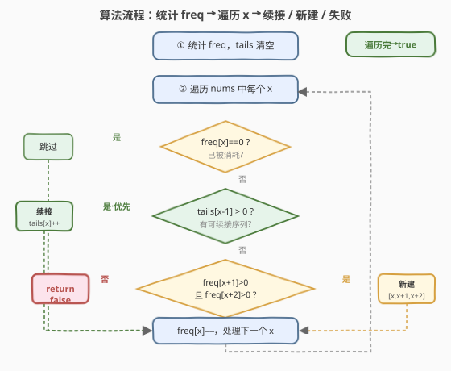
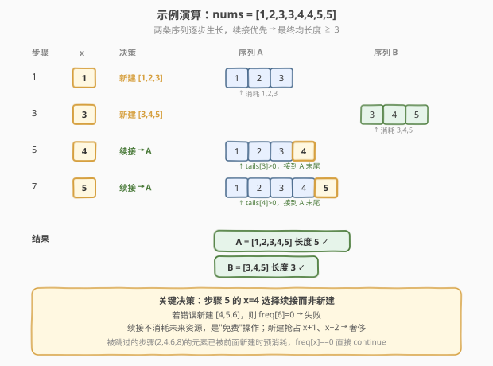

# LeetCode 分割数组为连续子序列 题解

## 1. 题目概述

- **标题 / 题号**：分割数组为连续子序列（#659，medium）
- **链接**：https://leetcode.cn/problems/split-array-into-consecutive-subsequences/
- **难度**：中等
- **标签**：贪心、数组、哈希表、堆（优先队列）

**题意**：给定一个**升序排序**的整数数组 `nums`，判断是否可以将其分割为**一个或多个**子序列，使得每个子序列满足：

1. 由**连续递增**的整数组成（即相邻元素差为 1）；
2. 长度**至少为 3**。

每个元素必须恰好归入一个子序列，不可重复使用。返回 `true` 表示可以分割，`false` 表示不能。

**示例 1**：

```text
输入：nums = [1,2,3,3,4,5]
输出：true
解释：可分割为 [1,2,3] 和 [3,4,5]
  · [1,2,3]：1→2→3 连续递增，长度 3 ✓
  · [3,4,5]：3→4→5 连续递增，长度 3 ✓
```

**示例 2**：

```text
输入：nums = [1,2,3,3,4,4,5,5]
输出：true
解释：可分割为 [1,2,3,4,5] 和 [3,4,5]
  · [1,2,3,4,5]：长度 5 ✓
  · [3,4,5]：长度 3 ✓
```

**示例 3**：

```text
输入：nums = [1,2,3,4,4,5]
输出：false
解释：无法分割。前 5 个数 [1,2,3,4,5] 成一组后，剩下的 4 无处安放：
  · [1,2,3,4] + [4,5] → 第二组长度只有 2 ✗
  · [1,2,3] + [4,4,5] → 第二组 4,4 不连续 ✗
```

**约束**：

- $1 \le \text{nums.length} \le 10^4$
- $-1000 \le \text{nums[i]} \le 1000$
- `nums` 已按**升序**排列

> 💡 这是一道经典的**贪心 + 哈希**题，在字节跳动、腾讯面经中出现频率很高。它考察的核心直觉是「**能续接就续接，不要轻易开新序列**」——因为续接已有序列能让其更容易达到长度 3，而新建序列会额外消耗后续两个连续数字，是一种更"奢侈"的选择。这与 [621. 任务调度器](../0601-0700/621_任务调度器.md) 的贪心直觉（先安排高频任务）异曲同工，但本题的关键决策在于**续接 vs 新建的优先级**。

## 2. 解题思路

### 2.1 暴力思路：回溯枚举每种归属

最直接的做法：对每个元素尝试把它放入所有可能的已有子序列，或新建一个子序列，递归搜索所有方案。

```text
def backtrack(i, sequences):
    if i == n: return all(len(s) >= 3 for s in sequences)
    x = nums[i]
    # 选择1：放入某个末尾为 x-1 的子序列
    for s in sequences where s[-1] == x-1:
        s.append(x); if backtrack(i+1): return True; s.pop()
    # 选择2：新建子序列 [x]
    sequences.append([x])
    if backtrack(i+1): return True
    sequences.pop()
    return False
```

最坏情况每个元素有 $O(k)$ 种选择（$k$ 为当前子序列数），总复杂度可达 $O(k^n)$，`n=10^4` 时完全不可行。且存在大量重复子问题——同一时刻"以各数字结尾的子序列各有多少条"这一状态被反复计算。

> ⚠️ 暴力法的瓶颈在于「关心每条子序列的具体身份」。但本题只问**能否**分割，不关心具体分法。破局思路：**只统计"以数字 x 结尾的子序列有多少条"**，用两个哈希表代替具体序列列表，把指数级搜索压缩为线性扫描。

### 2.2 核心观察：贪心 + 哈希表（续接优先）

**关键转换**：用两个哈希表维护状态，无需记录具体子序列：

- `freq[x]`：数字 `x` **尚未使用**的剩余个数
- `tails[x]`：以 `x` **结尾**的子序列条数（即这些序列下一步需要 `x+1`）

**贪心策略**——遍历 `nums` 中每个数字 `x`（按升序），对每个尚未用完的 `x` 做如下决策：

1. **优先续接**：若 `tails[x-1] > 0`（存在以 `x-1` 结尾、正等待 `x` 的子序列），则把 `x` 续接上去：`tails[x-1]--`，`tails[x]++`
2. **否则新建**：若没有可续接的序列，尝试新建一个长度为 3 的子序列 `[x, x+1, x+2]`：需要 `freq[x+1] > 0` 且 `freq[x+2] > 0`，成功则 `freq[x+1]--`，`freq[x+2]--`，`tails[x+2]++`
3. **否则失败**：既不能续接又不能新建，返回 `false`

![核心：能续接就续接，贪心优先把 x 接到 tails[x-1] 的序列上](../images/split_subseq_greedy_concept.svg)

**为什么「续接优先」是正确的？**

这是本题最核心的贪心证明。续接优先的正确性来自两个观察：

- **续接是"免费"的**：续接 `x` 到已有序列只需消耗 `x` 本身，不额外占用后续数字。而新建 `[x, x+1, x+2]` 要额外消耗 `x+1` 和 `x+2` 两个"未来"数字。
- **新建序列更"危险"**：新建的序列初始长度为 3，已满足要求；但被它消耗的 `x+1`、`x+2` 本可能用于续接其他更短的序列。换言之，新建会**抢占**后续资源。

> 💡 **反证法**：假设存在一个合法分割方案 $A$，其中某数字 `x` 被**新建**为新序列的开头，但同时存在以 `x-1` 结尾的序列 $s$。把 `x` 从新序列移到 $s$ 的末尾续接，新序列释放出的 `x+1`、`x+2` 可归还给后续使用——这不会破坏合法性（$s$ 变更长更安全，新序列释放的资源可补回它可能影响的序列）。因此「续接优先」不会错过任何合法方案。这是经典的**贪心交换论证（Exchange Argument）**。

### 2.3 算法流程图



**完整步骤**：

1. **统计频率**：遍历 `nums`，建立 `freq` 哈希表记录每个数字出现次数；`tails` 初始为空
2. **遍历决策**：对 `nums` 中每个 `x`（升序保证处理顺序自然）：
   - 若 `freq[x] == 0`：已被前面消耗，跳过
   - 若 `tails[x-1] > 0`：**续接**。`tails[x-1]--`，`tails[x]++`，`freq[x]--`
   - 否则若 `freq[x+1] > 0` 且 `freq[x+2] > 0`：**新建** `[x, x+1, x+2]`。`freq[x+1]--`，`freq[x+2]--`，`tails[x+2]++`，`freq[x]--`
   - 否则：返回 `false`
3. 全部处理完返回 `true`

### 2.4 示例演算

以 `nums = [1,2,3,3,4,4,5,5]` 为例（对应示例 2）：



| 步骤 | x | freq[x] | tails[x-1] | 决策 | 动作 | tails 变化 | 结果 |
|------|---|---------|------------|------|------|------------|------|
| 1 | 1 | 1→0 | 0 | 新建 | 消耗 1,2,3 | tails[3]=1 | 开序列 [1,2,3] |
| 2 | 2 | 0 | — | 跳过 | 已被步骤 1 消耗 | — | — |
| 3 | 3 | 1→0 | tails[2]=0 | 新建 | 消耗 3,4,5 | tails[3]=1, tails[5]=1 | 开序列 [3,4,5] |
| 4 | 3 | 0 | — | 跳过 | 已被步骤 1、3 消耗 | — | — |
| 5 | 4 | 1→0 | tails[3]=1 | **续接** | 接到 [1,2,3] 后 | tails[3]=0, tails[4]=1 | [1,2,3,4] |
| 6 | 4 | 0 | — | 跳过 | 已被步骤 3、5 消耗 | — | — |
| 7 | 5 | 1→0 | tails[4]=1 | **续接** | 接到 [1,2,3,4] 后 | tails[4]=0, tails[5]=2 | [1,2,3,4,5] |
| 8 | 5 | 0 | — | 跳过 | 已被步骤 3、7 消耗 | — | — |

**最终**：两条序列 `[1,2,3,4,5]`（长度 5）和 `[3,4,5]`（长度 3），均 $\ge 3$，返回 `true`。

> 💡 **步骤 5 的关键决策**：`x=4` 时 `tails[3]=1`（来自步骤 1 的 `[1,2,3]`），贪心选择续接而非新建。若此时错误地新建 `[4,5,6]`，会发现 `freq[6]=0` 导致失败——这正体现了「续接优先」的必要性：续接不消耗未来资源，新建会。

## 3. 参考代码

### C++

```cpp
// 分割数组为连续子序列.cpp —— 贪心 + 哈希表（续接优先）
// 编译: g++ -O2 -std=c++17 分割数组为连续子序列.cpp -o splitSubseq
#include <vector>
#include <unordered_map>
using namespace std;

class Solution {
  public:
    bool isPossible(vector<int>& nums) {
        unordered_map<int, int> freq;   // 剩余可用个数
        unordered_map<int, int> tails;  // 以 x 结尾的子序列条数

        for (int x : nums) freq[x]++;   // ① 统计频率

        for (int x : nums) {            // ② 遍历决策
            if (freq[x] == 0) continue; // 已被消耗，跳过

            if (tails[x - 1] > 0) {     // 优先续接
                tails[x - 1]--;
                tails[x]++;
                freq[x]--;
            } else if (freq[x + 1] > 0 && freq[x + 2] > 0) { // 否则新建
                freq[x + 1]--;
                freq[x + 2]--;
                tails[x + 2]++;
                freq[x]--;
            } else {
                return false;           // 既不能续接也不能新建
            }
        }
        return true;
    }
};
```

### Python

```python
class Solution:
    def isPossible(self, nums: list[int]) -> bool:
        from collections import Counter
        freq = Counter(nums)          # ① 剩余可用个数
        tails = Counter()             # 以 x 结尾的子序列条数

        for x in nums:                # ② 遍历决策
            if freq[x] == 0:
                continue              # 已被消耗，跳过

            if tails[x - 1] > 0:      # 优先续接
                tails[x - 1] -= 1
                tails[x] += 1
                freq[x] -= 1
            elif freq[x + 1] > 0 and freq[x + 2] > 0:  # 否则新建
                freq[x + 1] -= 1
                freq[x + 2] -= 1
                tails[x + 2] += 1
                freq[x] -= 1
            else:
                return False          # 既不能续接也不能新建
        return True
```

> 💡 **为什么遍历 `nums` 而非遍历 `freq` 的 key？** 因为 `nums` 已升序，遍历它天然保证 `x` 从小到大处理，`tails[x-1]` 一定在 `x` 之前被计算过。同时，已被消耗的 `x`（`freq[x]==0`）直接跳过，不会重复决策。若改成遍历去重后的 key，需额外排序——既然 `nums` 本身有序，直接用最简洁。

## 4. 复杂度分析

| 维度 | 复杂度 | 说明 |
|------|--------|------|
| **时间复杂度** | $O(n)$ | 统计频率 $O(n)$ + 遍历决策 $O(n)$（每个元素被处理一次，哈希表操作均摊 $O(1)$） |
| **空间复杂度** | $O(n)$ | 两个哈希表 `freq`、`tails`，最坏各存 $O(n)$ 个不同数字 |
| **最优时间** | $O(n)$ | 哈希表解法已是下界（至少要读一遍数组） |

> ⚠️ 由于 `nums` 元素范围 $[-1000, 1000]$ 很小，也可用数组代替哈希表（偏移 1000），常数更小但本质复杂度不变。哈希表写法更通用，不受值域限制。

## 5. 扩展：最小堆解法

贪心 + 哈希表是最优解，但面试中常被追问「如果不要求数组有序怎么做？」或「如何输出具体子序列？」。此时可用**最小堆**维护每条子序列的长度，按结尾数字分组。

**思路**：用哈希表 `x → 最小堆`，堆中存储以 `x` 结尾的各子序列**长度**。对每个 `x`：

- 若 `x-1` 的堆非空，弹出**最短**的子序列长度 `len`，续接为 `len+1`，压入 `x` 的堆
- 否则新建长度为 1 的子序列，压入 `x` 的堆

最后检查所有堆中的长度是否 $\ge 3$。

```python
class Solution:
    def isPossible(self, nums: list[int]) -> bool:
        import heapq
        tails_heap: dict[int, list[int]] = {}  # x -> 最小堆(各子序列长度)

        for x in nums:
            if x not in tails_heap:
                tails_heap[x] = []
            # 尝试续接到以 x-1 结尾的最短子序列
            if x - 1 in tails_heap and tails_heap[x - 1]:
                length = heapq.heappop(tails_heap[x - 1])  # 弹最短
                heapq.heappush(tails_heap[x], length + 1)   # 续接
            else:
                heapq.heappush(tails_heap[x], 1)            # 新建长度 1
            # 清理空堆
            if x - 1 in tails_heap and not tails_heap[x - 1]:
                del tails_heap[x - 1]

        return all(length >= 3 for heap in tails_heap.values() for length in heap)
```

**为什么弹最短？** 续接最短子序列能让它尽快达到长度 3，降低最终失败风险——这与哈希表解法「续接优先」的直觉一致。时间 $O(n \log k)$（$k$ 为同一结尾的子序列数），空间 $O(n)$。

| 解法 | 时间 | 空间 | 思路 | 适用场景 |
|------|------|------|------|----------|
| 贪心 + 哈希表 | $O(n)$ | $O(n)$ | `freq` + `tails` 计数，续接优先 | 数组有序，最优解 |
| 最小堆 | $O(n \log k)$ | $O(n)$ | 按结尾分组的最小堆，弹最短续接 | 可处理无序输入，易改造为输出具体子序列 |

> 💡 **面试建议**：先讲哈希表贪心解法（简洁高效），再引出最小堆解法作为「不依赖有序」的通用版本。面试官追问「输出具体子序列」时，最小堆解法天然记录了每条序列的长度与结尾，稍加改造（堆中存 `(长度, 序列引用)`）即可输出——这是从判定问题升级为构造问题的常见路径。

## 6. 面试要点

1. **为什么贪心「续接优先」是正确的？**

   - 续接只消耗 `x` 本身，不占用后续数字；新建 `[x,x+1,x+2]` 要额外消耗 `x+1`、`x+2`。
   - 用**交换论证**：若某合法方案中 `x` 被新建而存在可续接的 `tails[x-1]`，把 `x` 移去续接，释放的 `x+1`、`x+2` 归还后续——不破坏合法性。故续接优先不会错过任何合法方案。

2. **`freq` 和 `tails` 两个哈希表分别作用？**

   - `freq[x]` 记录 `x` 尚未使用的个数，防止同一元素被多次决策。
   - `tails[x]` 记录以 `x` 结尾、等待 `x+1` 的序列条数，是续接决策的依据。
   - 两者配合把"具体子序列身份"抽象为"计数"，是线性化的关键。

3. **为什么遍历原数组 `nums` 而不是去重排序后的 key？**

   - `nums` 已升序，遍历它天然按 `x` 从小到大处理，保证 `tails[x-1]` 先于 `x` 计算。
   - 已消耗的 `x`（`freq[x]==0`）直接跳过，逻辑等价于遍历去重 key 但无需额外排序。

4. **示例 3 `[1,2,3,4,4,5]` 为什么返回 false？**

   - `x=1` 新建 `[1,2,3]`，`x=4` 新建 `[4,5,?]`——第二个 `4` 到来时 `tails[3]` 为 0（前面 `[1,2,3]` 未续接到 4），只能新建 `[4,5,6]`，但 `freq[6]=0`，失败。
   - 本质是两个 `4` 中至少一个无法安放：续接无门、新建缺资源。

5. **如果输入无序怎么做？**

   - 哈希表解法依赖升序（`tails[x-1]` 需先算）。无序时先排序 $O(n \log n)$，或用最小堆解法 $O(n \log k)$——堆解法不依赖处理顺序，每个 `x` 独立查 `x-1` 的堆即可。

> 💡 **一句话总结**：分割数组为连续子序列是「贪心 + 哈希计数」的招牌题——用 `freq` 跟踪剩余、`tails` 跟踪待续接序列数，对每个数字执行「能续接就续接、否则新建三连、再否则失败」的贪心决策。核心直觉「续接优先」用交换论证证明不劣于任何合法方案，是面试中最需要讲清的点。

## 同类练习题

| # | 题目 | 与本题的关联 |
|---|------|-------------|
| 621 | [任务调度器](https://leetcode.cn/problems/task-scheduler/) | 贪心 + 计数，先安排高频任务填充冷却期，与本题「优先满足最紧迫需求」的贪心直觉相通 |
| 763 | [划分字母区间](https://leetcode.cn/problems/partition-labels/) | 贪心区间划分，按每个字母最后出现位置切分，与本题「连续序列分段」的分割思想对照 |
| 846 | [一手顺子](https://leetcode.cn/problems/hand-of-straights/) | 几乎与本题同构——将数组分成若干长度为 `k` 的连续顺子，贪心 + 哈希（有序遍历，每张牌作为顺子开头消耗后续 k-1 张），是本题的"固定长度"变体 |
| 1296 | [划分数组为连续数字的集合](https://leetcode.cn/problems/divide-array-in-sets-of-k-consecutive-numbers/) | 与 846 完全相同，划分成长度 `k` 的连续集合，贪心 + TreeMap 模板 |
| 358 | [K 距离间隔重排字符串](https://leetcode.cn/problems/rearrange-string-k-distance-apart/)（Premium） | 贪心 + 哈希 + 堆，按频率间隔放置字符，与本题贪心调度思想一脉相承 |
