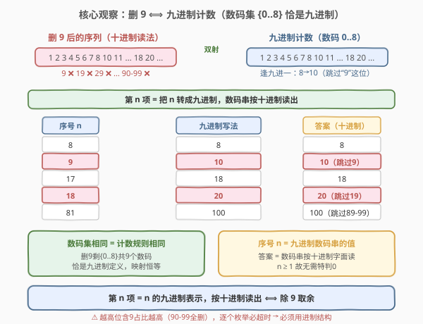
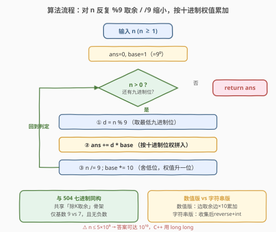
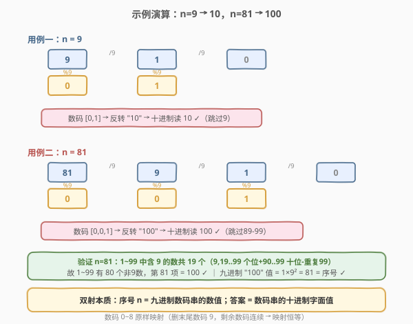

# 移除 9

- **题目名称**：移除 9
- **链接**：[660. 移除 9](https://leetcode.cn/problems/remove-9/)
- **难度**：困难
- **标签**：数学、进制转换

## 1. 题目概述

从整数 `1` 开始，**移除所有十进制表示中包含数字 `9` 的整数**，得到一个新序列。返回该序列中第 `n` 个整数（`n` 从 1 开始计数）。

换言之，序列为 `1, 2, 3, 4, 5, 6, 7, 8, 10, 11, 12, 13, 14, 15, 16, 17, 18, 20, 21, ...`——凡是含有 `9` 的数（如 `9, 19, 29, ..., 90, 91, ..., 99, 109, ...`）都被跳过。

**示例 1**：

```text
输入：n = 9
输出：10
解释：跳过 9 后，序列前 9 项为 1,2,3,4,5,6,7,8,10，第 9 项是 10。
```

**示例 2**：

```text
输入：n = 10
输出：11
解释：序列前 10 项为 1,2,3,4,5,6,7,8,10,11，第 10 项是 11。
```

**约束条件**：

- $1 \le n \le 5 \times 10^9$

> ⚠️ $n$ 可达 $5 \times 10^9$，这意味着序列里的目标数可能远超 $5 \times 10^9$（因为越往后被跳过的含 `9` 数越多）。任何「从 1 逐个枚举、跳过含 9 的数、数到第 n 个」的模拟都会超时——含 `9` 的数在高位区间占比极高（如 $90 \sim 99$ 整段 10 个全含 9）。必须从**进制结构**切入，把「跳过含 9 的数」重新解读为一个等价的**计数系统**。

> 💡 本题是「进制转换」家族中视角最巧妙的一员：它不像 [504. 七进制数](../0501-0600/504_七进制数.md) 那样直接让你「把数转成 7 进制」，而是把进制转换**伪装成一个删除问题**。核心洞察是——「不用数字 9」恰好等价于「只用数码 $0 \sim 8$」，而这正是**九进制**的定义。

---

## 2. 解题思路

### 2.1 暴力思路：逐个枚举跳过含 9 的数

最直白的做法：从 `1` 起逐个整数检查是否含数字 `9`，不含则计入序列，数到第 `n` 个返回。

```text
cnt = 0
x = 0
while cnt < n:
    x += 1
    if '9' not in str(x):
        cnt += 1
return x
```

问题：$n = 5 \times 10^9$ 时，目标数 $x$ 远大于 $n$（高位含 9 的占比急升），要枚举的整数多达数十亿，且每个都要做字符串扫描，时间 $O(x \log x)$ 远超时限。

> 💡 暴力法的浪费在于：它把「跳过含 9 的数」当成一个个**离散事件**来处理，丢失了「跳过的数本身有结构」这一信息。换视角：与其问「第 n 个非 9 数是多少」，不如问「如果只用数码 $0 \sim 8$ 来计数，第 n 个数怎么写」——这正是九进制。

### 2.2 核心观察：删 9 ⟺ 九进制计数



破局点是看清「不含数字 9 的十进制数」与「九进制数」之间的**双射**。

**为什么「删 9」等价于「九进制」？**

十进制数用 $10$ 个数码 $0 \sim 9$，逢十进一；删去数码 $9$ 后只剩 $0 \sim 8$ 共 $9$ 个数码。把计数规则相应改为「逢九进一」，就得到九进制。两者的计数序列逐项对应：

| 序号 n | 九进制写法 | 对应十进制数（不含 9） |
|--------|-----------|----------------------|
| 1 | `1` | 1 |
| 2 | `2` | 2 |
| ... | ... | ... |
| 8 | `8` | 8 |
| 9 | `10` | 10（跳过 9） |
| 10 | `11` | 11 |
| 17 | `18` | 18 |
| 18 | `20` | 20（跳过 19） |
| 80 | `88` | 88 |
| 81 | `100` | 100（跳过 89~99） |

> 💡 **关键直觉**：把「不含 9 的十进制数」**读作字符串**，它恰好就是「九进制数的字符串」。例如九进制数 `10`（值为 $1 \times 9 + 0 = 9$）的字符串 `"10"`，作为十进制读出来就是整数 $10$——而 $10$ 正好是删去 $9$ 后的第 $9$ 项。这不是巧合：九进制的第 $n$ 个数（从 $1$ 起）写成数码串后，**逐字解读为十进制整数**，就得到「删 9 序列」的第 $n$ 项。

**因此**：求「删 9 序列」的第 $n$ 项 ⟺ 把 $n$ 转换成九进制，再把得到的数码串当作十进制整数读出。

> ⚠️ **注意起点对齐**：九进制表示中数值 $0$ 写作 `"0"`，但题目序列从 $1$ 开始（第 $1$ 项是 $1$，不是 $0$）。因此转换时直接对 $n$ 做「除 9 取余」（$n \ge 1$ 恒成立，无需像 [504](../0501-0600/504_七进制数.md) 那样特判 $0$），得到的数码串天然从 $1$ 起编号。

### 2.3 算法流程图



整体只有一个循环：对 $n$ 反复「`d = n % 9` 取余 → 追加数码字符 → `n /= 9` 缩小」，直到 $n = 0$；最后把低位先产出的数码序列**反转**成高位在前，即为答案。由于 $n \ge 1$，循环条件 `n > 0` 必然至少执行一次，不会产出空串。

**与 [504. 七进制数](../0501-0600/504_七进制数.md) 的同构**：两者共享「除 K 取余」骨架，差别仅在基数（$9$ vs $7$）与无需处理负数（$n \ge 1$）。可把本题视作 504 的「去掉符号处理、换基数」的精简版。

### 2.4 示例演算



**用例一：`n = 9` → `10`**

| 轮次 | `n`（进入时） | `n % 9` | 数码 | `n /= 9` 后 |
|------|--------------|---------|------|------------|
| 1 | 9 | 0 | `0` | 1 |
| 2 | 1 | 1 | `1` | 0 |
| 3 | 0 | — | 停止 | — |

产出序列 `['0','1']`，反转得 `"10"`，作为十进制读出即 $10$ ✓。这正是删去 $9$ 后的第 $9$ 项。

**用例二：`n = 81` → `100`**

| 轮次 | `n`（进入时） | `n % 9` | 数码 | `n /= 9` 后 |
|------|--------------|---------|------|------------|
| 1 | 81 | 0 | `0` | 9 |
| 2 | 9 | 0 | `0` | 1 |
| 3 | 1 | 1 | `1` | 0 |
| 4 | 0 | — | 停止 | — |

产出序列 `['0','0','1']`，反转得 `"100"`，读作 $100$ ✓。验证：$90 \sim 99$（10 个）和 $9$（1 个）共 $11$ 个含 $9$ 的数被跳过，序列第 $81$ 项应为 $81 + 11 = 92$？

> ⚠️ 等等——这里需要更仔细的核对。$1 \sim 99$ 中含 $9$ 的数有：个位为 9 的 $9,19,...,99$（10 个）+ 十位为 9 的 $90,...,99$（10 个）− 重复的 $99$（1 个）= $19$ 个。故 $1 \sim 99$ 中不含 9 的数有 $99 - 19 = 80$ 个。因此第 $81$ 个不含 9 的数是 $100$ ✓（恰好在跳过 $89 \sim 99$ 后落到 $100$）。九进制 `100` = $1 \times 81 = 81$，对应序号 $81$ ✓。

> 💡 **这个验证揭示了进制对齐的本质**：九进制下 `100` 表示的数值是 $81$（$1 \times 9^2$），而它作为「删 9 序列」第 $81$ 项读出的十进制整数是 $100$。**序号 $n$ 等于九进制数码串的数值，答案等于该数码串的十进制字面值**——这正是双射的体现。

---

## 3. 参考代码

### C++

```cpp
// 移除9.cpp —— 删 9 ⟺ 九进制计数，把 n 转成九进制数码串读回
// 编译: g++ -O2 -std=c++17 移除9.cpp -o remove9
using ll = long long;

class Solution {
  public:
    ll newInteger(int n) {
        ll ans = 0, base = 1;          // base = 9^k，从低位往高位累加
        while (n > 0) {
            int d = n % 9;             // 取最低九进制位
            ans += (ll)d * base;       // 作为十进制的一位拼入结果
            n /= 9;                    // 舍掉最低位
            base *= 10;                // 下一位权值 ×10（十进制读法）
        }
        return ans;
    }
};
```

### Python

```python
class Solution:
    def newInteger(self, n: int) -> int:
        ans = 0
        base = 1                        # base = 9^k，从低位往高位累加
        while n > 0:
            d = n % 9                    # 取最低九进制位
            ans += d * base              # 作为十进制的一位拼入结果
            n //= 9                      # 舍掉最低位（务必用 //）
            base *= 10                   # 下一位权值 ×10（十进制读法）
        return ans
```

> 💡 **两种等价写法**：上面的「边取余边按十进制权值累加」是**数值版**（直接得到整数答案）；也可写成**字符串版**——收集数码字符后 `reverse` 再 `int()`，与 [504](../0501-0600/504_七进制数.md) 完全同构。数值版免去字符串反转与转换，常数更小，且天然支持 $n$ 很大时的 `long long` 累加。两种写法本质相同：都是从低位到高位产出数码，再按十进制位权合成。

> ⚠️ **数据范围与溢出**：$n \le 5 \times 10^9$，九进制下约 $10$ 位（$9^{10} \approx 3.5 \times 10^9$），读作十进制整数最大约 $10^{10}$ 量级，超出 32 位 `int` 上界（$\approx 2.1 \times 10^9$）。故 C++ 须用 `long long` 存答案；Python 原生大整数无此顾虑。

---

## 4. 复杂度分析

| 维度 | 复杂度 | 说明 |
|------|--------|------|
| **时间复杂度** | $O(\log_9 n)$ | 每轮 $n$ 缩小到 $1/9$，循环次数即九进制位数；$n \le 5 \times 10^9$ 时最多 $\lceil\log_9(5 \times 10^9)\rceil = 11$ 轮 |
| **空间复杂度** | $O(1)$ | 数值版只用 `ans`、`base` 两个变量；字符串版结果长度 $O(\log_9 n)$，不计输出则 $O(1)$ |
| **最优时间** | $O(\log_9 n)$ | 九进制转换是问题的信息论下界——必须确定 $n$ 的每一位九进制数码 |

> 💡 $n \le 5 \times 10^9$ 给出常数上界 $11$ 轮，故时间与空间均可视为 $O(1)$。但按位数增长的渐进界 $O(\log_9 n)$ 是更本质的刻画，便于推广：若删的是数码 $d$，则等价于 $d$ 进制（$d=9$ 时即九进制，$d=2$ 时即「只用 0/1」的二进制）。

---

## 5. 扩展：推广到「删任意数码」与「数码集合」

本题的洞察可推广为一条通用定理：

**定理**：在十进制计数中删去数码集合 $S$（$S \subseteq \{0,1,\dots,9\}$，且 $0 \notin S$，保证剩余数码仍含 $0$ 以支持进位），剩余序列的第 $n$ 项 ⟺ 把 $n$ 转成 $K$ 进制（$K = 10 - |S|$），再把数码串按剩余数码表的顺序映射后读回十进制。

| 删去的数码 | 剩余数码个数 $K$ | 等价进制 | 第 $n$ 项求法 |
|-----------|----------------|---------|--------------|
| $\{9\}$ | $9$ | 九进制 | $n$ 转 9 进制，数码 $0\sim8$ 原样读 |
| $\{8,9\}$ | $8$ | 八进制 | $n$ 转 8 进制，数码 $0\sim7$ 原样读 |
| $\{0\}$（特例） | $9$ | 九进制（1-indexed） | 退化为「不含前导零」的九进制，需额外处理 |
| $\{4\}$（中间数码） | $9$ | 九进制（带数码平移） | $n$ 转 9 进制，数码 $\ge 4$ 者 $+1$ 跳过被删数码 |

> ⚠️ 当删去的数码**不是末尾连续段**（如删 $4$）时，剩余数码集 $\{0,1,2,3,5,6,7,8,9\}$ 仍按升序对应 $0\sim8$ 的九进制位，但映射时需「跳过被删数码」：九进制位 $0,1,2,3$ 映射 $0,1,2,3$，位 $4$ 映射 $5$（跳过 $4$），位 $5$ 映射 $6$，依此类推。这与 [168. Excel表列名称](https://leetcode.cn/problems/excel-sheet-column-title/) 的「1-indexed 平移」同源——本质都是**数码表的偏移映射**。

**更一般的视角**：这其实是「受限数码计数」的一个实例。只要剩余数码集关于计数顺序构成一个**封闭的进位系统**（即逢 $K$ 进一、数码按升序排列），删数码问题就能转化为 $K$ 进制转换 + 数码表映射。本题是 $S=\{9\}$ 的最简特例——剩余数码 $\{0,\dots,8\}$ 恰好是连续的 $0\sim K-1$，映射退化为恒等。

---

## 6. 面试要点

1. **为什么「删 9」等价于「九进制」？**

   > 十进制用 $0\sim9$ 共 $10$ 个数码，删去 $9$ 后剩 $0\sim8$ 共 $9$ 个。把「逢十进一」改为「逢九进一」即九进制。两者的计数序列逐项相同：九进制第 $n$ 个数的数码串，逐字读作十进制整数，正是「不含 9 的数」序列的第 $n$ 项。故求第 $n$ 项 ⟺ $n$ 转 9 进制。

2. **如何用一句话向面试官解释这个转换？**

   > 「不含数字 9 的十进制数，其数码串本身就是九进制表示」——因为可用数码恰好是 $0\sim8$ 这 $9$ 个，与九进制数码集完全一致。所以序列第 $n$ 项就是 $n$ 的九进制写法当作十进制读出。

3. **`n = 9` 时为什么结果是 `10` 而不是 `9`？**

   > $9$ 含数码 $9$ 被跳过，序列第 $9$ 项是 $10$。九进制视角：$9 = 1 \times 9 + 0$，即九进制 `"10"`，读作十进制 $10$ ✓。这正是「逢九进一」——数码 $0\sim8$ 用尽后进位，从 `"8"` 跳到 `"10"`，对应十进制从 $8$ 跳到 $10$（跳过 $9$）。

4. **为什么不需要像 504 那样特判 `n = 0`？**

   > 题目保证 $n \ge 1$，循环条件 `n > 0` 至少执行一次，不会产出空串。504 需要特判是因为 `num = 0` 合法输入且应返回 `"0"`，而 `abs(0) = 0` 会让循环零次执行。本题无此边界。

5. **答案为什么要用 `long long`？**

   > $n \le 5 \times 10^9$，九进制约 $10$ 位，读作十进制整数可达 $10^{10}$ 量级，超出 32 位 `int`（$\approx 2.1 \times 10^9$）。故 C++ 用 `long long` 累加答案；Python 无此问题。

6. **如果删的是数码 `8` 而非 `9`，做法有何不同？**

   > 仍等价于九进制（剩余 $9$ 个数码），但数码映射非恒等：剩余数码 $\{0,1,\dots,7,9\}$ 按升序对应九进制位 $0\sim8$，其中九进制位 $8$ 映射到十进制数码 $9$（跳过被删的 $8$）。即先转九进制，再把所有 $\ge 8$ 的位 $+1$。本题删 $9$ 恰好是剩余数码连续的特例，映射退化为恒等。

> 💡 **一句话总结**：660 是「进制转换伪装成删除问题」的招牌题——删去数码 $9$ 后剩余数码 $\{0\sim8\}$ 恰是九进制数码集，故第 $n$ 项即 $n$ 的九进制写法按十进制读出。用「除 9 取余」一趟扫完，$O(\log_9 n)$/O(1)。核心洞察是识别「删末尾数码 ⟺ 降一进制」的双射，与 [504. 七进制数](../0501-0600/504_七进制数.md) 共享「除 K 取余」骨架但无需处理符号。

---

## 7. 同类练习题

- [504. 七进制数](https://leetcode.cn/problems/base-7/)（[题解](../0501-0600/504_七进制数.md)）：进制转换家族母题，「除 7 取余」抠位 + 符号单独处理，与本题共享「除 K 取余」骨架，是本题不含伪装的直白版
- [168. Excel表列名称](https://leetcode.cn/problems/excel-sheet-column-title/)：1-indexed 26 进制分解，数码 $1\sim26$ 不含 0 须先减 1 平移，与本题「数码集偏移映射」的推广情形同源
- [400. 第 N 位数字](https://leetcode.cn/problems/nth-digit/)（[题解](../0301-0400/400_第N位数字.md)）：按位数分层定位第 n 位数字，与本题同为「用进制/位数结构取代逐个枚举」的数学定位题
- [172. 阶乘后的零](https://leetcode.cn/problems/factorial-trailing-zeroes/)（[题解](../0101-0200/172_阶乘后的零.md)）：勒让德公式数质因子个数，与本题共享「用进制/因数结构洞察计数问题」的数学思维
- [9. 回文数](https://leetcode.cn/problems/palindrome-number/)（[题解](../0001-0100/9_回文数.md)）：`% 10 / 10` 弹出末位的十进制原版，是本题 `% 9 / 9` 抠位的基底模板
