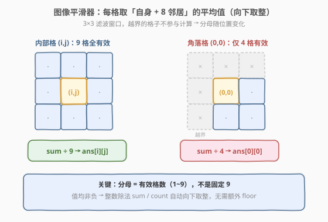
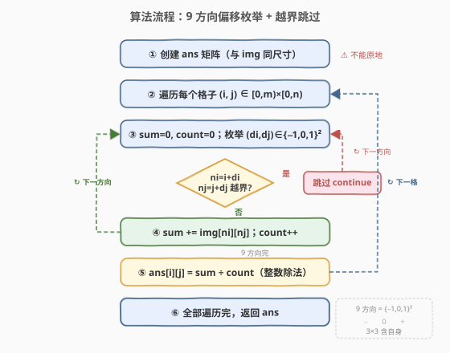
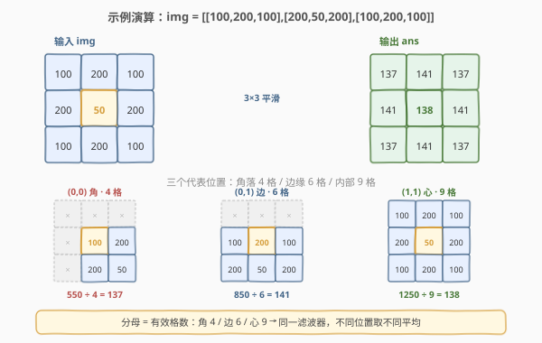

# LeetCode 图片平滑器 题解

## 1. 题目概述

- **标题 / 题号**：图片平滑器（#661，easy）
- **链接**：https://leetcode.cn/problems/image-smoother/
- **难度**：简单
- **标签**：数组、矩阵、模拟

**题意**：给定一个 $m \times n$ 的整数矩阵 `img`，表示图像每个像素的灰度。**图像平滑器**是一个 $3 \times 3$ 的过滤器：对每个单元格，取**它自身及周围 8 个邻居**（共至多 9 格）的平均灰度，结果**向下取整**，作为该单元格平滑后的新值。

位于边界/角落的单元格，其 $3 \times 3$ 窗口会有格子**越界缺失**——这些缺失格**不参与**求和与计数（分母只算实际存在的格数）。

**示例 1**：

```text
输入：img = [[1,1,1],[1,0,1],[1,1,1]]
输出：[[0,0,0],[0,0,0],[0,0,0]]
解释：
角格 (0,0) 等 4 角：周围仅 4 格，和 3 → 3/4 = 0
边格 (0,1) 等 4 边：周围 6 格，和 5 → 5/6 = 0
中心 (1,1)：9 格全计，和 8 → 8/9 = 0
```

**示例 2**：

```text
输入：img = [[100,200,100],[200,50,200],[100,200,100]]
输出：[[137,141,137],[141,138,141],[137,141,137]]
解释：
角格：(100+200+200+50)/4 = 137
边格：(200+100+200+50+200+100)/6 = 141
中心：(50+200×4+100×4)/9 = 138
```

**约束**：

- $m == \text{img.length}$
- $n == \text{img[i].length}$
- $1 \leq m, n \leq 200$
- $0 \leq \text{img[i][j]} \leq 255$

> 💡 **关键点**：分母不是固定 9，而是**该位置 $3 \times 3$ 窗口内实际存在的格数**（角落 4、边缘 6、内部 9）。值均非负，整数除法 `sum / count` 天然等价于向下取整。

## 2. 解题思路

### 2.1 暴力思路

对每个单元格 $(i, j)$，逐一检查其 $3 \times 3$ 窗口内的 9 个候选位置 $(i+di, j+dj)$（$di, dj \in \{-1, 0, 1\}$），若位置在矩阵内则累加并计数，最后取 `sum / count` 写入结果。

这其实**已经是最优解**：必须为每个单元格计算一次结果，每格最多看 9 个邻居，总计 $O(m \cdot n \cdot 9) = O(m \cdot n)$，与输入规模同阶，无法再快。本题的考点不在「优化复杂度」，而在**两个易错细节**：

1. **不能原地修改**：新值依赖邻居的**原始值**。若边算边写回 `img`，后续格子读到的就是已被平滑的值，结果全错。必须开一个独立的结果矩阵 `ans`。
2. **分母随位置变化**：不能写死 `/ 9`，要用实际计数的 `count` 做除数。

### 2.2 核心观察：9 方向偏移枚举 + 越界跳过



把 $3 \times 3$ 窗口抽象成 **9 个固定方向偏移** $(di, dj) \in \{-1, 0, 1\}^2$，对每个候选邻居统一做「越界判定 → 累加」：

- **内部格**：9 个方向全部命中，分母 9；
- **角落格**：只有 4 个方向命中（自身 + 右 + 下 + 右下），分母 4；
- **边缘格**：6 个方向命中，分母 6。

这套写法把「角落/边缘/内部」三种情况**统一**进同一个循环——无需 `if` 特判边界类型，越界判定 `0 <= ni < m and 0 <= nj < n` 自然把缺失格筛掉。

> 💡 **方向数组技巧**：把 9 个偏移写成一个常量数组 `dirs = [(-1,-1),(-1,0),...,(1,1)]`，循环枚举。这是**所有「网格邻居」类问题**（岛屿 DFS、扫雷、生命游戏…）的通用模板，比手写 9 行累加更不易漏方向。

### 2.3 算法流程图



维护变量（对每个 $(i,j)$）：

- `sum`：窗口内有效格的灰度之和；
- `count`：窗口内有效格的数量（1~9）。

**步骤**：

1. 创建与 `img` 同尺寸的 `ans` 矩阵（**不能原地**，否则后续格子读到已平滑的值）。
2. 遍历每个 $(i, j) \in [0,m) \times [0,n)$：
   - 初始化 `sum = 0`、`count = 0`；
   - 枚举 9 个方向 $(di, dj)$：令 $ni = i+di$、$nj = j+dj$，若越界则 `continue`，否则 `sum += img[ni][nj]`、`count++`；
   - 令 `ans[i][j] = sum / count`（整数除法 = 向下取整）。
3. 返回 `ans`。

> ⚠️ **为什么必须用副本？** 平滑是「读旧值、写新值」的全局并行操作。一旦在 `img` 上原地写，左上角的邻居被改写后，右下角格子读到的就是新值而非原始值——平滑器会「反复平滑」产生滚雪球式误差。开 `ans` 把读写分离是最直接的解法；进阶可用位运算压缩实现 $O(1)$ 额外空间（见第 5 节）。

### 2.4 示例演算

以 `img = [[100,200,100],[200,50,200],[100,200,100]]` 为例，看三种代表位置如何取不同分母：



| 位置 | 类型 | 有效格数 | 求和 | 平均（向下取整） |
|------|------|----------|------|------------------|
| (0,0) | 角落 | 4 | $100+200+200+50 = 550$ | $550 \div 4 = 137$ |
| (0,1) | 边缘 | 6 | $200+100+100+200+50+200 = 850$ | $850 \div 6 = 141$ |
| (1,1) | 内部 | 9 | $50 + 200\times4 + 100\times4 = 1250$ | $1250 \div 9 = 138$ |

最终 `ans = [[137,141,137],[141,138,141],[137,141,137]]`。可以看到：同一张图，角落偏暗（受 4 格平均拉低）、中心保留原值附近（9 格平均最均衡），平滑器起到了**按位置自适应降噪**的效果。

## 3. 参考代码

### C++

```cpp
class Solution {
public:
    vector<vector<int>> imageSmoother(vector<vector<int>>& img) {
        int m = img.size(), n = img[0].size();
        // 9 个方向偏移：自身 + 8 邻居
        const int dirs[9][2] = {{-1,-1},{-1,0},{-1,1},
                                 { 0,-1},{ 0,0},{ 0,1},
                                 { 1,-1},{ 1,0},{ 1,1}};
        vector<vector<int>> ans(m, vector<int>(n));
        for (int i = 0; i < m; ++i) {
            for (int j = 0; j < n; ++j) {
                int sum = 0, cnt = 0;
                for (auto& d : dirs) {
                    int ni = i + d[0], nj = j + d[1];
                    if (ni >= 0 && ni < m && nj >= 0 && nj < n) {
                        sum += img[ni][nj];
                        ++cnt;
                    }
                }
                ans[i][j] = sum / cnt;   // 值非负，整数除法即向下取整
            }
        }
        return ans;
    }
};
```

### Python

```python
class Solution:
    def imageSmoother(self, img: List[List[int]]) -> List[List[int]]:
        m, n = len(img), len(img[0])
        dirs = [(-1,-1),(-1,0),(-1,1),
                ( 0,-1),( 0,0),( 0,1),
                ( 1,-1),( 1,0),( 1,1)]
        ans = [[0] * n for _ in range(m)]
        for i in range(m):
            for j in range(n):
                total = cnt = 0
                for di, dj in dirs:
                    ni, nj = i + di, j + dj
                    if 0 <= ni < m and 0 <= nj < n:
                        total += img[ni][nj]
                        cnt += 1
                ans[i][j] = total // cnt   # // 即向下取整
        return ans
```

> 💡 **Python 的 `//` 对正数即向下取整**，与题意一致。注意若值可能为负（本题不会），`//` 会向负无穷取整，那时需改用 `int(total / cnt)` 或 `math.floor`。C++ 整数除法对非负数也是截断（即向下取整），本题安全。

## 4. 复杂度分析

| 维度 | 复杂度 | 说明 |
|------|--------|------|
| 时间复杂度 | $O(m \cdot n)$ | 每格枚举 9 个方向（常数），共 $m \cdot n$ 格，与输入规模同阶 |
| 空间复杂度 | $O(m \cdot n)$ | 额外开 `ans` 矩阵存放结果；不计输出则为 $O(1)$ |

> ⚠️ 不要误把 $O(m \cdot n \cdot 9)$ 当成更高阶——9 是常数，渐进复杂度仍是 $O(m \cdot n)$。即便 $m=n=200$，总操作约 $200 \times 200 \times 9 = 3.6 \times 10^5$，毫秒级完成。

## 5. 扩展：原地位运算压缩（$O(1)$ 额外空间）

若面试官追问「能否不开新矩阵、$O(1)$ 额外空间」，可利用**像素值 $\leq 255$ 只占 8 位**这一约束，把平滑后的新值塞进原 `int` 的高位，两趟遍历完成：

1. **第一趟**：对每个 $(i,j)$，照常读 9 邻居**原始值**（取低 8 位 `img[ni][nj] & 0xFF`）求平均，把结果写进**高 8 位**：`img[i][j] |= (avg << 8)`。此时每个 `int` 的低 8 位是旧值、高 8 位是新值，互不干扰。
2. **第二趟**：遍历把高 8 位右移回来：`img[i][j] >>= 8`，丢弃旧值，留下平滑结果。

```cpp
class Solution {
public:
    vector<vector<int>> imageSmoother(vector<vector<int>>& img) {
        int m = img.size(), n = img[0].size();
        const int dirs[9][2] = {{-1,-1},{-1,0},{-1,1},
                                 { 0,-1},{ 0,0},{ 0,1},
                                 { 1,-1},{ 1,0},{ 1,1}};
        for (int i = 0; i < m; ++i) {
            for (int j = 0; j < n; ++j) {
                int sum = 0, cnt = 0;
                for (auto& d : dirs) {
                    int ni = i + d[0], nj = j + d[1];
                    if (ni >= 0 && ni < m && nj >= 0 && nj < n) {
                        sum += img[ni][nj] & 0xFF;   // 只取低 8 位旧值
                        ++cnt;
                    }
                }
                img[i][j] |= (sum / cnt) << 8;      // 新值写进高 8 位
            }
        }
        for (int i = 0; i < m; ++i)
            for (int j = 0; j < n; ++j)
                img[i][j] >>= 8;                    // 取回新值，丢弃旧值
        return img;
    }
};
```

> 💡 此法把「读写分离」从「另开矩阵」换成「同一段内存的高低字节」，是 [289. 生命游戏](https://leetcode.cn/problems/game-of-life/) 同款原地压缩套路。前提是值域有限（本题 $0\sim255$ 完美 8 位）。若值域超 16 位则高位不够用，此法失效——开副本反而更稳。

## 6. 面试要点

1. **为什么不能原地修改？**
   - 平滑是「读旧值、写新值」的并行操作。原地写后，后续格子读到的邻居已是新值，等于把平滑器级联放大，结果错误。必须用独立结果矩阵，或用位运算把新旧值压在同一段内存的不同位。

2. **分母为什么不是固定 9？**
   - 边界格的 $3 \times 3$ 窗口有格越界缺失，题目要求「不考虑缺失格」。角落 4 格、边缘 6 格、内部 9 格——分母随位置变。用 `count` 计数而非写死 9，统一处理。

3. **整数除法 `sum / count` 等价于向下取整吗？**
   - 本题值非负，C++/Python 对非负整数 `//` 均为向下取整，与 `floor` 一致，无需额外处理。若值可能为负则需注意语言语义差异。

4. **方向数组相比手写 9 行累加有什么好处？**
   - 不易漏方向、易扩展（如改成 4 向 / 8 向只需改数组），且把「越界判定」统一进循环，免去角落/边缘特判。是网格邻居问题的通用模板。

5. **$O(1)$ 空间的位运算法在什么条件下成立？**
   - 值域有限且能塞进 `int` 的高位不溢出。本题 $0\sim255$ 占 8 位，新值也 $\leq 255$，高低各 8 位共 16 位，`int` 32 位绰绰有余。若值域超 16 位则失效。

6. **复杂度能比 $O(m \cdot n)$ 更优吗？**
   - 不能。输出本身就是 $m \cdot n$ 个值，每个值必须计算，下界 $\Omega(m \cdot n)$。常数 9 已是最小邻居数。

## 同类练习题

| # | 题目 | 与本题的关联 |
|---|------|-------------|
| 289 | [生命游戏](https://leetcode.cn/problems/game-of-life/) | 同样的「读旧值写新值」网格并行更新，经典位运算原地压缩套路（第 5 节扩展的直接来源） |
| 200 | [岛屿数量](https://leetcode.cn/problems/number-of-islands/)（[题解](../0101-0200/200_岛屿数量.md)） | 4 向 / 8 向邻居 DFS 遍历网格，方向数组模板的招牌应用 |
| 994 | [腐烂的橘子](https://leetcode.cn/problems/rotting-oranges/)（[题解](../0901-1000/994_腐烂的橘子.md)） | 4 向邻居多源 BFS，同样是「枚举邻居 + 越界跳过」骨架 |
| 542 | [01 矩阵](https://leetcode.cn/problems/01-matrix/) | 4 向邻居多源 BFS 求距离，对比「窗口聚合」与「图遍历」对邻居枚举的不同用法 |
| 1252 | [奇数值单元格的数目](https://leetcode.cn/problems/cells-with-odd-values-in-a-row-and-column/) | 矩阵单元格更新与统计，同属矩阵模拟入门题 |
