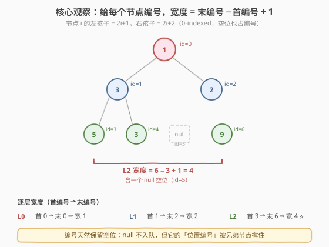
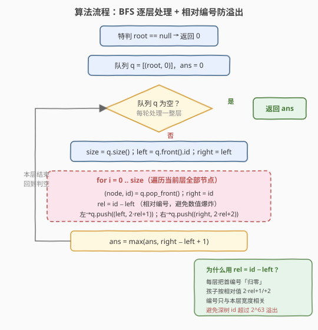
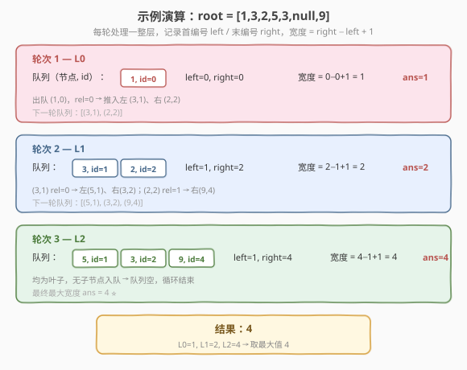

# LeetCode 二叉树最大宽度 题解

## 1. 题目概述

- **标题 / 题号**：二叉树最大宽度（#662，medium）
- **链接**：https://leetcode.cn/problems/maximum-width-of-binary-tree/
- **难度**：中等
- **标签**：树、二叉树、广度优先搜索（BFS）

**题意**：给定一棵二叉树的根节点 `root`，返回树的**最大宽度**。某一层的**宽度**定义为该层**最左**和**最右**两个非空节点（即两端节点）之间的长度，**两端节点之间的 `null` 节点也计入长度**。

**示例 1**：

```text
输入：root = [1,3,2,5,3,null,9]
输出：4
解释：第 2 层（最底层）节点为 [5,3,null,9]，最左 5、最右 9，
      中间隔 1 个空位，宽度 = 4。
```

**示例 2**：

```text
输入：root = [1,3,2,5,null,null,9,6,null,null,null,null,7]
输出：8
解释：最底层 [6,null,null,null,null,null,null,7]，两端之间含 6 个空位，宽度 = 8。
```

**示例 3**：

```text
输入：root = [1,3,2,4]
输出：2
```

**约束**：

- 树中节点数目范围 `[1, 3000]`
- `-100 <= Node.val <= 100`
- 答案保证在 32 位有符号整数范围内

> 💡 本题的关键坑点在于「宽度」**不是**「该层非空节点个数」，而是**两端节点之间的位置跨度**——中间的 `null` 要算进去。因此不能简单地统计每层入队节点数，需要给每个节点一个**位置编号**来还原「满二叉树」的位置结构。

## 2. 解题思路

### 2.1 暴力思路：补全成满二叉树再数

最直观的想法是：把缺失的 `null` 节点也当作真实节点塞进队列里，逐层 BFS 统计每层长度。问题是**最坏情况下中间层会爆炸**——例如一棵退化成链的树深度达 3000，某层若按满二叉树补全会产生 $2^{3000}$ 个虚拟节点，内存与时间都不可接受。

> ⚠️ 「补 null 入队」只在层很浅时可行，深度一大就会指数爆炸。必须找到一种**只保留位置信息、不实际创建空节点**的方法。

### 2.2 核心观察：节点编号 + 逐层首末差



借鉴**满二叉树下标体系**：把二叉树想象成「补全后的满二叉树」，每个节点都有一个**位置编号**（0-indexed）：

- 根节点编号为 `0`；
- 编号为 `i` 的节点，其**左孩子**编号为 $2i + 1$，**右孩子**编号为 $2i + 2$。

这样，**某一层的宽度**就等于该层**最右节点编号 − 最左节点编号 + 1**：

$$
\text{width}(\text{level}) = \text{id}_{\text{rightmost}} - \text{id}_{\text{leftmost}} + 1
$$

> 💡 **为什么编号能保留空位？** 因为编号体系本质是「满二叉树的座标」。即使某个位置是 `null`（不入队），它的编号仍被**兄弟分支的子节点**撑住。例如示例 1 第 2 层节点编号为 `3, 4, _, 6`：`id=5` 那个空位虽然没节点，但 `id=6` 的节点 9 存在，于是宽度 `6 − 3 + 1 = 4` 自动把空位算进去了。**编号只跟着真实节点走，却天然记下了空位的跨度。**

### 2.3 算法流程图



**关键技巧——相对编号防溢出**：朴素编号在深度 $d$ 的节点处会达到 $2^d$，深树（$d$ 可达 3000）必然溢出 `long long`。解决办法是**每层把首编号「归零」**：处理一层时，记 `left` 为该层最左节点的编号，对层内每个节点用 `rel = id − left` 作为相对编号，再给孩子编号 `2·rel + 1` / `2·rel + 2`。这样每层编号只与本层宽度相关，数值始终被压在「本层节点数」量级，不会指数膨胀。

**完整步骤**：

1. **特判**：`root == null` 返回 0（题目保证至少 1 节点，仍保留防御）。
2. **初始化**：队列 `q = [(root, 0)]`，`ans = 0`。
3. **while 队列非空**（每轮处理一整层）：
   - `size = q.size()`，`left = q.front().id`，`right = left`；
   - `for i in 0..size`：弹出 `(node, id)`，`right = id`，`rel = id − left`；若有左/右孩子，按 `2·rel + 1` / `2·rel + 2` 入队；
   - `ans = max(ans, right − left + 1)`。
4. 返回 `ans`。

### 2.4 示例演算

以 `root = [1,3,2,5,3,null,9]` 为例，BFS 共 3 轮：



| 轮次 | 层 | 队列（节点, 编号） | left | right | 宽度 | ans |
|------|----|--------------------|------|-------|------|-----|
| 1 | L0 | (1,0) | 0 | 0 | 0−0+1 = 1 | 1 |
| 2 | L1 | (3,1), (2,2) | 1 | 2 | 2−1+1 = 2 | 2 |
| 3 | L2 | (5,1), (3,2), (9,4) | 1 | 4 | 4−1+1 = 4 | **4** ⭐ |

> 💡 注意第 3 轮：节点 9 的编号是 4（而非 6），因为第 2 轮用了**相对编号**——`(2,2)` 的 `rel = 2−1 = 1`，右孩子编号 `2·1 + 2 = 4`。但层内首末差 `4 − 1 + 1 = 4` 与朴素编号结果一致，**相对编号不改变宽度，只压缩数值**。

## 3. 参考代码

### C++

```cpp
// 二叉树最大宽度.cpp —— BFS + 相对编号（防溢出）
// 编译: g++ -O2 -std=c++17 二叉树最大宽度.cpp -o maxwidth
#include <queue>
#include <algorithm>
using namespace std;

struct TreeNode {
    int val;
    TreeNode* left;
    TreeNode* right;
    TreeNode() : val(0), left(nullptr), right(nullptr) {
    }
    TreeNode(int x) : val(x), left(nullptr), right(nullptr) {
    }
    TreeNode(int x, TreeNode* l, TreeNode* r) : val(x), left(l), right(r) {
    }
};

class Solution {
  public:
    int widthOfBinaryTree(TreeNode* root) {
        if (root == nullptr)
            return 0;
        // 队列存「节点指针 + 编号」，用 unsigned long long 防止极端用例溢出
        queue<pair<TreeNode*, unsigned long long>> q;
        q.push({root, 0});
        int ans = 0;
        while (!q.empty()) {
            int size = q.size();
            unsigned long long left = q.front().second; // 本层最左编号
            unsigned long long right = left;            // 本层最右编号
            for (int i = 0; i < size; ++i) {
                auto [node, id] = q.front();
                q.pop();
                right = id;
                unsigned long long rel = id - left;     // 相对编号，把首编号归零
                if (node->left)
                    q.push({node->left, 2 * rel + 1});
                if (node->right)
                    q.push({node->right, 2 * rel + 2});
            }
            ans = max(ans, (int)(right - left + 1));
        }
        return ans;
    }
};
```

### Python

```python
from collections import deque
from typing import Optional


class Solution:
    def widthOfBinaryTree(self, root: Optional[TreeNode]) -> int:
        if not root:
            return 0
        # 队列存 (节点, 编号)；Python 大整数天然不溢出，相对编号仅为统一写法
        q = deque([(root, 0)])
        ans = 0
        while q:
            size = len(q)
            left = q[0][1]          # 本层最左编号
            right = left            # 本层最右编号
            for _ in range(size):
                node, idx = q.popleft()
                right = idx
                rel = idx - left    # 相对编号
                if node.left:
                    q.append((node.left, 2 * rel + 1))
                if node.right:
                    q.append((node.right, 2 * rel + 2))
            ans = max(ans, right - left + 1)
        return ans
```

> 💡 **结构化绑定 `auto [node, id] = ...`** 需 C++17。注意 `q.front().second` 取本层**首**编号作为 `left`——因为 BFS 按从左到右入队，队首即本层最左节点。每轮 `for` 跑完后 `right` 自然落在本层最右节点上。

## 4. 复杂度分析

| 维度 | 复杂度 | 说明 |
|------|--------|------|
| 时间复杂度 | $O(n)$ | 每个节点入队、出队各一次，仅做常数操作 |
| 空间复杂度 | $O(n)$ | 队列最多存一层节点；最宽层可达约 $n/2$（满二叉树底层） |

> ⚠️ 相对编号技巧**不影响复杂度**，只影响数值范围。没有它，深树编号可达 $2^{3000}$，远超 64 位整数上限；加了之后每层编号 $\le$ 本层节点数，安全落在 `unsigned long long` 内。Python 大整数无需此技巧也能 AC，但保留统一写法便于跨语言对照。

## 5. 扩展：DFS 前序 + 层最左编号

本题也可用 **DFS** 解决：前序遍历（根→左→右）天然「从左到右」访问，于是**每层第一个被访问到的节点就是该层最左节点**。用一个哈希表 `leftmost[depth]` 记录每层首次访问的编号，后续节点用 `id − leftmost[depth] + 1` 更新答案：

```python
class Solution:
    def widthOfBinaryTree(self, root: Optional[TreeNode]) -> int:
        self.ans = 0
        leftmost = {}                       # depth -> 该层最左节点编号

        def dfs(node, depth, idx):
            if not node:
                return
            if depth not in leftmost:       # 前序保证：首次到访即最左
                leftmost[depth] = idx
            self.ans = max(self.ans, idx - leftmost[depth] + 1)
            dfs(node.left, depth + 1, 2 * idx + 1)
            dfs(node.right, depth + 1, 2 * idx + 2)

        dfs(root, 0, 0)
        return self.ans
```

> ⚠️ DFS 版**没有相对编号归零**，深树仍可能产生极大编号。Python 大整数无碍，但 C++ 用此写法需注意溢出（实际测试用例深度有限，`unsigned long long` 多数能过）。若要严格防爆，BFS + 相对编号是更稳妥的选择。DFS 的优势是**无需队列、代码更短**，且能体现「前序 = 从左到右」的性质。

## 6. 面试要点

1. **本题的「宽度」和层序遍历统计每层节点数有什么不同？**

   - 普通层序遍历统计的是「该层**非空**节点个数」；本题宽度是「两端节点之间的**位置跨度**」，**中间的 `null` 要算进去**。所以不能只数节点，必须给每个节点一个**位置编号**，用「末编号 − 首编号 + 1」还原跨度。

2. **为什么用满二叉树编号 `左=2i+1, 右=2i+2`？**

   - 这套编号本质是「补全成满二叉树后的下标」。它让 `null` 节点虽不入队，却**保留了位置**——因为兄弟分支的子节点编号会「跨过」那个空位。于是两端编号之差天然把空位算进了宽度。

3. **深树编号会溢出吗？怎么处理？**

   - 会。深度 $d$ 处编号可达 $2^d$，$d=3000$ 时远超 64 位整数上限。解决办法：**每层把首编号归零**——`rel = id − left`，孩子按 `2·rel + 1 / +2` 入队。这样每层编号只与本层宽度相关，数值始终 $\le$ 本层节点数，安全落在 64 位内。Python 大整数天然不溢出，但保留此写法可统一跨语言逻辑。

4. **BFS 和 DFS 两种解法怎么选？**

   - 两者时间都是 $O(n)$。BFS 用队列显式按层处理，配合相对编号**严格防爆**，最稳妥；DFS 前序利用「从左到右首访即最左」的性质，代码更短，但 C++ 版无相对归零时深树有溢出风险。面试中先讲 BFS + 编号为主解，再提 DFS 作为变体，能体现对两种遍历的掌控。

5. **为什么入队顺序必须是「左孩子在前，右孩子在后」？**

   - 因为「最左 / 最右」是按**满二叉树位置**定义的，而满二叉树里左孩子编号小于右孩子。只有始终「左先入队、右后入队」，BFS 队列里同层节点才按编号升序排列，**队首即最左、队尾即最右**，`left = q.front().id` 才成立。若颠倒入队顺序，首末就错了。

> 💡 **一句话总结**：662 的核心是「**用编号还原满二叉树位置，用首末差算宽度**」。难点不在 BFS 骨架，而在想到「编号」这个抽象——一旦给节点编上号，`null` 的空位就被自动记录。再配一个「每层归零」的相对编号技巧，深树溢出问题也一并解决。

## 同类练习题

| # | 题目 | 与本题的关联 |
|---|------|-------------|
| 102 | [二叉树的层序遍历](https://leetcode.cn/problems/binary-tree-level-order-traversal/)（[题解](../0101-0200/102_二叉树的层序遍历.md)） | BFS `while + for(size)` 模板的母题，本题骨架来源 |
| 958 | [二叉树的完全性检验](https://leetcode.cn/problems/check-completeness-of-a-binary-tree/) | 层序遍历判空节点，与「编号」思想互补——完全性等价于编号连续无空洞 |
| 222 | [完全二叉树的节点个数](https://leetcode.cn/problems/count-complete-tree-nodes/) | 利用完全二叉树编号性质 + 二分，同属「编号体系」应用 |
| 199 | [二叉树的右视图](https://leetcode.cn/problems/binary-tree-right-side-view/)（[题解](../0101-0200/199_二叉树的右视图.md)） | 复用 BFS 每层取最右节点，模板同源 |
