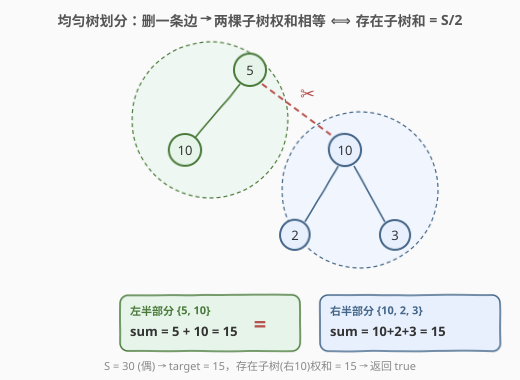
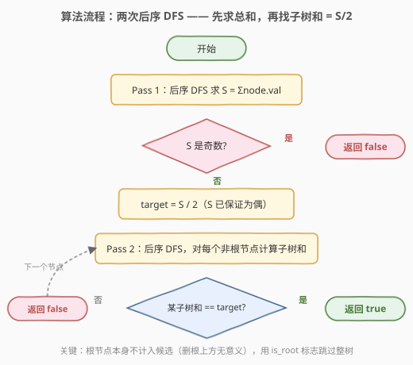
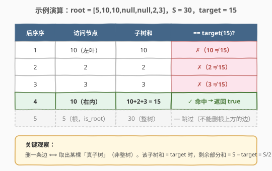

# 均匀树划分

- **题目名称**：均匀树划分
- **链接**：[663. 均匀树划分](https://leetcode.cn/problems/equal-tree-partition/)
- **难度**：中等
- **标签**：树、二叉树、深度优先搜索（DFS）、后序遍历

## 1. 题目概述

给定一棵二叉树的根节点 `root`，判断能否通过**删除树中恰好一条边**，使得断开后的**两棵子树**各自节点值之和**相等**。两棵子树都必须非空（即被删除的边连接的是父节点与某个孩子，被切下的那一侧至少含一个节点）。

**示例 1**：

```text
输入：root = [5,10,10,null,null,2,3]
输出：true
解释：
        5
       / \
      10  10
         / \
        2   3
全树和 S = 5+10+10+2+3 = 30。
删除 5 与右孩子 10 之间的边：
  左半 {5, 10}        和 = 15
  右半 {10, 2, 3}     和 = 15
两半相等 → 返回 true。
```

**示例 2**：

```text
输入：root = [1,2,3,null,null,4,5]
输出：false
解释：
        1
       / \
      2   3
         / \
        4   5
全树和 S = 1+2+3+4+5 = 15，奇数，无法等分 → 返回 false。
```

**示例 3**：

```text
输入：root = [0,0,0]
输出：true
解释：S = 0，target = 0。左子树（单节点 0）和 = 0 == target，
      删除根与左孩子的边后两半和均为 0 → true。
```

**约束条件**：

- 树中节点数目范围 `[2, 10^4]`
- `-10^5 <= Node.val <= 10^5`
- 节点值可能为负，故全树和可能为 0 或负数

> 💡 本题的题眼在于把「删一条边使两半权和相等」翻译成代数条件：若被切下的子树和为 $x$，则剩余部分和为 $S - x$，要求 $x = S - x$，即 $x = S/2$。于是问题归约为：**是否存在某棵真子树（非整树）的权和等于 $S/2$**。

---

## 2. 解题思路

### 2.1 暴力思路：枚举每条边

最直白的想法是：枚举树中每一条父-子边，切掉它后分别 DFS 求两侧子树和，判断是否相等。共 $n-1$ 条边，每条边求和 $O(n)$，总复杂度 $O(n^2)$。节点数到 $10^4$ 时 $10^8$ 量级操作，常数大时易超时。

> ⚠️ 枚举边的根本问题是**重复计算**——同一段子树和被反复求。事实上每棵子树只需求一次和即可参与判定，关键是把「求和」与「判定」解耦。

### 2.2 核心观察：子树和 = S/2



设全树权和为 $S$。删一条边等价于把树拆成「某棵子树 $T$」与「剩余部分」两部分。设 $T$ 的权和为 $x$，则剩余部分和为 $S - x$。要求相等：

$$
x = S - x \;\Longrightarrow\; 2x = S \;\Longrightarrow\; x = \frac{S}{2}
$$

于是得到三个关键结论：

1. **$S$ 必须为偶数**（含 $0$）。$S$ 为奇数直接返回 `false`。
2. **目标值唯一**：$\text{target} = S / 2$，只需在所有子树和中查找是否存在 `target`。
3. **整树不算**：被切下的必须是「真子树」（删的是某条父-子边，切下的那一侧以该孩子为根）。整棵树（以原根为根）不能作为候选——否则相当于「不删边」，与题意矛盾。

> 💡 **为什么用后序遍历？** 后序（左→右→根）天然「先算孩子再算父亲」，每个节点的子树和 = 自身值 + 左子树和 + 右子树和，一遍 DFS 即可算出所有子树和，且计算顺序保证孩子先于父亲就绪。这与求和、判定需求完美契合。

### 2.3 算法流程图



**完整步骤**：

1. **Pass 1（求总和）**：后序 DFS 计算 $S = \sum \text{node.val}$。
2. **奇偶剪枝**：若 $S \bmod 2 \neq 0$，返回 `false`。
3. **定目标**：$\text{target} = S / 2$（此时 $S$ 必为偶数，整数除法安全）。
4. **Pass 2（找子树）**：再次后序 DFS，对每个节点计算以其为根的子树和 $s$；若该节点**非整树根**且 $s = \text{target}$，立即返回 `true`。
5. 全部访问完未命中，返回 `false`。

**实现细节——`is_root` 标志**：第二次 DFS 从原根出发，根节点本身对应的子树和就是 $S$（整树），不能作为候选。用一个布尔参数 `is_root` 标记当前节点是否为整树根，根节点处跳过判定（但仍需返回其子树和供上层使用）。

### 2.4 示例演算

以 `root = [5,10,10,null,null,2,3]` 为例，$S = 30$，$\text{target} = 15$。后序访问顺序为：左叶 10 → 叶 2 → 叶 3 → 右内 10 → 根 5。



| 后序序 | 访问节点 | 子树和 | == target(15)? |
|--------|----------|--------|----------------|
| 1 | 10（左叶） | 10 | ✗ |
| 2 | 2 | 2 | ✗ |
| 3 | 3 | 3 | ✗ |
| 4 | 10（右内） | 10+2+3 = 15 | ✓ 命中 → 返回 true |
| 5 | 5（根，跳过） | 30（整树） | — is_root，不判定 |

> 💡 第 4 步命中后即可短路返回，无需访问根节点。即便继续访问，根节点也因 `is_root` 标志被跳过——这正是处理 $S = 0$ 的关键：当全树和为 0 时，根节点子树和也是 0 = target，但必须排除它，否则单节点树（无任何边可删）会被误判为 true。

---

## 3. 参考代码

### C++

```cpp
// 均匀树划分.cpp —— 两次后序 DFS：先求总和，再找子树和 = S/2
// 编译: g++ -O2 -std=c++17 均匀树划分.cpp -o eqtree
struct TreeNode {
    int val;
    TreeNode* left;
    TreeNode* right;
    TreeNode() : val(0), left(nullptr), right(nullptr) {
    }
    TreeNode(int x) : val(x), left(nullptr), right(nullptr) {
    }
    TreeNode(int x, TreeNode* l, TreeNode* r) : val(x), left(l), right(r) {
    }
};

class Solution {
    long long target = 0;     // 用 long long 防 S/2 在极端正负值累加后越界
    bool found = false;

    // 后序求子树和
    long long sumDfs(TreeNode* node) {
        if (!node) return 0;
        return (long long)node->val + sumDfs(node->left) + sumDfs(node->right);
    }

    // 后序：边算子树和边判定；is_root 标记整树根，跳过判定
    long long checkDfs(TreeNode* node, bool isRoot) {
        if (!node) return 0;
        long long s = (long long)node->val
                      + checkDfs(node->left, false)
                      + checkDfs(node->right, false);
        if (!isRoot && s == target) found = true;
        return s;
    }

  public:
    bool checkEqualTree(TreeNode* root) {
        long long total = sumDfs(root);
        if (total % 2 != 0) return false;        // 奇数无法等分
        target = total / 2;
        checkDfs(root, true);
        return found;
    }
};
```

### Python

```python
from typing import Optional


class TreeNode:
    def __init__(self, val=0, left=None, right=None):
        self.val = val
        self.left = left
        self.right = right


class Solution:
    def checkEqualTree(self, root: Optional[TreeNode]) -> bool:
        # Pass 1: 后序求全树总和
        def tree_sum(node):
            if not node:
                return 0
            return node.val + tree_sum(node.left) + tree_sum(node.right)

        total = tree_sum(root)
        if total % 2 != 0:                  # 奇数无法等分（Python % 对负数也只在偶时为 0）
            return False

        target = total // 2
        self.found = False

        # Pass 2: 后序，边算子树和边判定；is_root 跳过整树根
        def dfs(node, is_root):
            if not node:
                return 0
            s = node.val + dfs(node.left, False) + dfs(node.right, False)
            if not is_root and s == target:
                self.found = True
            return s

        dfs(root, True)
        return self.found
```

> 💡 **奇偶判断对负数的安全性**：Python 中 `-4 % 2 == 0`、`-3 % 2 == 1`，与正数行为一致，`total % 2 != 0` 能正确判出「奇数」（含负奇数）。C++ 中 `-3 % 2 == -1`，同样满足 `!= 0`。两端逻辑等价且安全。`total // 2` 对偶数（含负偶数）做地板除恰好等于精确除，无精度问题。

---

## 4. 复杂度分析

| 维度 | 复杂度 | 说明 |
|------|--------|------|
| 时间复杂度 | $O(n)$ | 两次后序 DFS，每个节点访问两次，每次常数操作 |
| 空间复杂度 | $O(h)$ | 递归栈深度 = 树高 $h$；平衡树 $h = O(\log n)$，退化为链时 $h = O(n)$ |

> ⚠️ 节点值范围 $[-10^5, 10^5]$、节点数最多 $10^4$，全树和 $S$ 最多约 $\pm 10^9$，落在 32 位 `int` 内。但 C++ 中为防御极端用例，子树和用 `long long` 累加更稳妥；Python 整数无此顾虑。

---

## 5. 扩展：单遍 DFS + 子树和列表

两次 DFS 中 Pass 1 仅用于求 $S$，其实可以合并：后序遍历时把每个节点的子树和追加到一个列表 `sums`，**最后追加的就是整树根的和 $S$**（后序根最后访问）。判定时只需检查 `target = S / 2` 是否出现在 `sums[:-1]`（排除整树）中：

```python
class Solution:
    def checkEqualTree(self, root: Optional[TreeNode]) -> bool:
        sums = []

        def dfs(node):
            if not node:
                return 0
            s = node.val + dfs(node.left) + dfs(node.right)
            sums.append(s)            # 后序：根的子树和（=整树和 S）最后入列
            return s

        dfs(root)
        total = sums[-1]              # 整树和
        if total % 2 != 0:
            return False
        target = total // 2
        # 排除整树（列表最后一个），查是否有子树和 == target
        return any(s == target for s in sums[:-1])
```

> ⚠️ 此写法**不能用频次表简单地判断 `target in counter`**——必须排除整树那一项。`sums[-1]` 恰为整树和，用切片 `sums[:-1]` 排除即可。若用 `collections.Counter`，需在加入根节点和时不计数，或最后给整树那一项的计数减 1。列表法更直观且 $O(n)$ 空间可接受（$n \le 10^4$）。

两种写法复杂度同为 $O(n)$ 时间、$O(n)$ 空间（列表法多存一份 $n$ 长度和数组，递归栈另算）。两遍 DFS 版**逻辑分层清晰**（求和 / 判定各司其职），单遍版**代码更短**但依赖「后序根最后入列」这一隐式不变式，面试中按个人偏好二选一即可。

---

## 6. 面试要点

1. **「删一条边使两半权和相等」如何转化为可判定条件？**

   - 设被切下的子树和为 $x$，剩余部分和为 $S - x$。要求 $x = S - x$，即 $2x = S$，故 $x = S/2$。于是问题归约成：**是否存在某棵真子树，其权和等于 $S/2$**。这是个干净的代数翻译，是本题的核心思维跳跃。

2. **为什么 $S$ 是奇数可以直接返回 false？**

   - 节点值都是整数，任意子树和都是整数。若 $S$ 为奇数，$S/2$ 不是整数，不可能有任何整数子树和等于它。这是 $O(1)$ 的强剪枝。注意 $0$ 也是偶数（$S = 0$ 时 target $= 0$），不能误剪。

3. **整树根为什么不能作为候选子树？**

   - 题目要求「删除一条边」，而被删的边必然是某条父-子边，切下的子树以该孩子为根。整树根上方没有边可删，把整树当作候选相当于「不删边」，与题意矛盾。代码用 `is_root` 标志在根节点处跳过判定。这点在 $S = 0$ 时尤其关键——否则单节点树会被误判为 true。

4. **节点值可能为负，对实现有什么影响？**

   - 负值使 $S$ 可能为负或为 $0$。奇偶判断需对负数也成立：Python `%` 在负数下与正数一致（偶数才返回 $0$），C++ `%` 对负奇数返回 $-1$，`!= 0` 同样能识别。`target = S / 2` 对负偶数用整数除法（Python `//`、C++ `/`）恰好等于精确除，无精度问题。子树和用 `long long` 累加防御极端累加越界。

5. **两遍 DFS 与单遍列表法各有什么取舍？**

   - 两遍 DFS 把「求总和」与「查找子树」分离，**职责清晰、易讲易调试**，且第二遍可在命中时短路返回；单遍列表法利用「后序根最后入列」一次遍历收集所有子树和，**代码更短**，但必须显式排除整树（`sums[:-1]`），且无法短路（需遍历完整棵树才能拿到 $S$）。两者时间同为 $O(n)$，面试中两遍 DFS 更稳妥。

> 💡 **一句话总结**：663 的核心是「**删边等分 ⟺ 找子树和 = S/2**」这一代数翻译，配上「**后序遍历天然先算孩子**」的求和顺序，再加上「**排除整树根**」的边界处理。三件齐备，$O(n)$ 一遍 DFS 即可解决。

---

## 7. 同类练习题

- [124. 二叉树中的最大路径和](https://leetcode.cn/problems/binary-tree-maximum-path-sum/)（[题解](../0101-0200/124_二叉树中的最大路径和.md)）：同样后序 DFS 计算子树和并向上返回，区别在于「向上贡献」与「全局最优」的取舍，模板同源
- [437. 路径总和 III](https://leetcode.cn/problems/path-sum-iii/)：树上路径和问题，前缀和 + 哈希 + 回溯撤销，与本题「子树和」思路互补（子树 vs 任意路径）
- [687. 最长同值路径](https://leetcode.cn/problems/longest-univalue-path/)：后序 DFS 返回子树贡献长度，同样依赖「孩子先于父亲就绪」的后序性质
- [508. 出现次数最多的子树元素和](https://leetcode.cn/problems/most-frequent-subtree-sum/)：后序 DFS 求所有子树和并统计频次，是本题「收集子树和」操作的直接母题
- [543. 二叉树的直径](https://leetcode.cn/problems/diameter-of-binary-tree/)（[题解](../0501-0600/543_二叉树的直径.md)）：后序 DFS 返回深度并在节点处合并左右子树信息更新全局答案，后序「向上聚合」范式的招牌题
