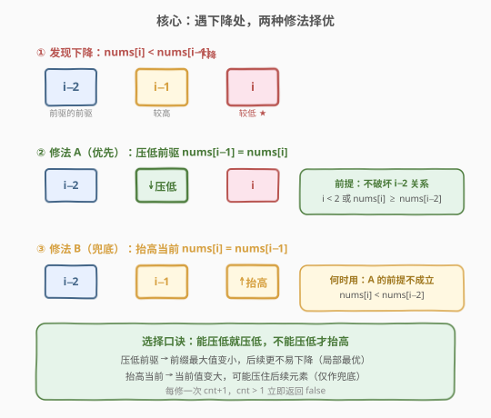
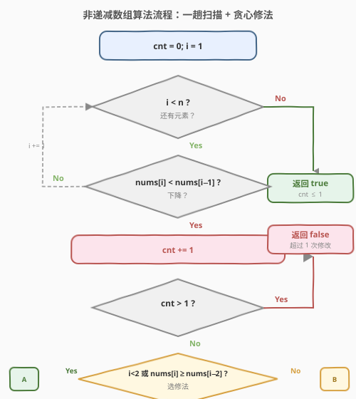

# LeetCode 非递减数组 题解

## 1. 题目概述

- **标题 / 题号**：非递减数组（#665，medium）
- **链接**：https://leetcode.cn/problems/non-decreasing-array/
- **难度**：中等
- **标签**：数组、贪心

**题意**：给你一个长度为 `n` 的整数数组 `nums`，判断它是否能在**最多修改 1 个元素**的前提下变成**非递减**数组。

所谓非递减，即对每个下标 `i`（$0 \leq i < n-1$）都满足 $\text{nums}[i] \leq \text{nums}[i+1]$。

**示例 1**：

```text
输入：nums = [4,2,3]
输出：true
解释：把 4 改成 1（或 2），数组变为 [1,2,3]，非递减。
```

**示例 2**：

```text
输入：nums = [4,2,1]
输出：false
解释：无论改哪个元素都无法一次修复，至少需改两次。
```

**示例 3**：

```text
输入：nums = [3,4,2,3]
输出：false
解释：4>2 是一处下降；即便修好此处，2(或4) 与后面 3 仍会再下降一次。
```

**约束**：

- $1 \leq n \leq 10^4$
- $-10^5 \leq \text{nums}[i] \leq 10^5$

> 💡 **关键约束**：「最多改 1 个」意味着我们只对**下降次数**感兴趣，且每次下降必须能被**局部贪心修复**而不连累前后的单调性。这正是贪心一趟扫描的招牌场景。

## 2. 解题思路

### 2.1 暴力思路：枚举改谁

对每个位置尝试「不改 / 改成邻居值」并验证整段是否非递减，时间 $O(n^2)$。当 $n = 10^4$ 时约 $10^8$ 次操作，勉强但常数大、易超时。

> ⚠️ 暴力法暴露一个事实：我们并不需要真的「改」——只需**在发现下降时，贪心地选择一种修复方式并就地修正数组**，让后续扫描继续基于修正后的值判断即可。下降次数超过 1 即可立即判否。

### 2.2 核心观察：遇降即修，两种修法择优



扫描到 `i` 时若发现 $\text{nums}[i] < \text{nums}[i-1]$（一处下降），必须修改其一。有**两种修法**，择优选取：

1. **修法 A（优先）——压低前驱**：令 $\text{nums}[i-1] = \text{nums}[i]$。
   - 把前驱压低能让「已扫过的前缀」尽量小，给后续留出更大空间。
   - **前提**：压低后仍需满足 $\text{nums}[i-2] \leq \text{nums}[i-1]$，即 $i < 2$（无前驱的前驱）或 $\text{nums}[i] \geq \text{nums}[i-2]$。

2. **修法 B（兜底）——抬高当前**：令 $\text{nums}[i] = \text{nums}[i-1]$。
   - 当修法 A 的前提不成立（$\text{nums}[i] < \text{nums}[i-2]$）时，压低前驱会破坏 $i-2$ 与 $i-1$ 的关系，只能反过来抬高当前。

> 💡 **为什么优先压低前驱？** 前缀的最大值越小，后面越不容易再出现下降。抬高当前则会让当前值变大，可能压住后续元素造成新的下降。因此「能压低就压低，不能压低才抬高」是局部最优选择，且不会让全局更差（详见第 6 节面试要点 Q3 的交换论证）。

### 2.3 算法流程图



算法步骤：

1. 初始化 `cnt = 0`（已用修改次数）。
2. `i` 从 $1$ 扫到 $n-1$：
   - 若 $\text{nums}[i] < \text{nums}[i-1]$：`cnt += 1`；若 `cnt > 1` 直接返回 `false`。
   - 判断修法：若 $i < 2$ 或 $\text{nums}[i] \geq \text{nums}[i-2]$，执行修法 A（`nums[i-1] = nums[i]`）；否则执行修法 B（`nums[i] = nums[i-1]`）。
3. 扫描结束未返回 `false`，则返回 `true`。

> ⚠️ **就地修改的必要性**：修法会改写 `nums[i-1]` 或 `nums[i]`，后续扫描依赖这个修正后的值来判断是否产生新下降。若只计数不改值，会误判后续关系。这也是本题区别于「只数下降次数」朴素想法的关键——[3,4,2,3] 只有 1 处下降（4>2），但修好后 2 与后继 3 仍会下降，必须靠修正值暴露第二处。

### 2.4 示例演算

以 `nums = [3,4,2,3]` 为例，看贪心如何暴露「两处下降」从而判否：

![示例演算：[3,4,2,3] 贪心修复全过程](../images/nondecreasing_example_walkthrough.svg)

| 步骤 | i | nums[i-1] | nums[i] | 判定 | 修法 | 修正后数组 | cnt |
|------|---|-----------|---------|------|------|------------|-----|
| 初始 | — | — | — | — | — | [3,4,2,3] | 0 |
| 1 | 1 | 3 | 4 | 4≥3 正常 | — | [3,4,2,3] | 0 |
| 2 | 2 | 4 | 2 | 2<4 下降 ★ | nums[2]=2 < nums[0]=3 → 修法 B | [3,4,**4**,3] | 1 |
| 3 | 3 | 4 | 3 | 3<4 下降 ★ | cnt=2 → 立即返回 false | — | 2 |

对照 `nums = [4,2,3]`（返回 `true`）：

| 步骤 | i | nums[i-1] | nums[i] | 判定 | 修法 | 修正后数组 | cnt |
|------|---|-----------|---------|------|------|------------|-----|
| 1 | 1 | 4 | 2 | 2<4 下降 ★ | i<2 → 修法 A | [**2**,2,3] | 1 |
| 2 | 2 | 2 | 3 | 3≥2 正常 | — | [2,2,3] | 1 |
| 结束 | — | — | — | — | — | cnt=1 ≤ 1 → true | — |

> 💡 对比两组示例：`[4,2,3]` 下降处在**数组头部**（$i=1$，无 $i-2$ 约束），修法 A 直接压低前驱即可，后续不再下降；`[3,4,2,3]` 下降处在**中部**且 $\text{nums}[i] < \text{nums}[i-2]$，只能抬高当前，但抬高的 4 又压住了后继 3，暴露出第二处下降——这正是「修法选择」与「就地修改」共同作用的精妙之处。

## 3. 参考代码

### C++

```cpp
class Solution {
public:
    bool checkPossibility(vector<int>& nums) {
        int cnt = 0;
        for (int i = 1; i < (int)nums.size(); ++i) {
            if (nums[i] < nums[i - 1]) {
                if (++cnt > 1) return false;
                if (i < 2 || nums[i] >= nums[i - 2]) {
                    nums[i - 1] = nums[i];   // 修法 A：压低前驱
                } else {
                    nums[i] = nums[i - 1];   // 修法 B：抬高当前
                }
            }
        }
        return true;
    }
};
```

### Python

```python
class Solution:
    def checkPossibility(self, nums: List[int]) -> bool:
        cnt = 0
        for i in range(1, len(nums)):
            if nums[i] < nums[i - 1]:
                cnt += 1
                if cnt > 1:
                    return False
                if i < 2 or nums[i] >= nums[i - 2]:
                    nums[i - 1] = nums[i]   # 修法 A：压低前驱
                else:
                    nums[i] = nums[i - 1]   # 修法 B：抬高当前
        return True
```

> 💡 **不修改输入的写法**：若面试官要求不改 `nums`，可用两个变量 `prev`（前一个最终值）和 `prev2`（再前一个值）滚动维护，逻辑同上。但就地改写更简洁、不易错，是默认推荐写法。

## 4. 复杂度分析

| 维度 | 复杂度 | 说明 |
|------|--------|------|
| 时间复杂度 | $O(n)$ | 单趟扫描，每个元素 $O(1)$ 判定 + 最多一次修法 |
| 空间复杂度 | $O(1)$ | 仅 `cnt`、`i` 常数变量；就地修改输入数组 |

> 💡 本题已达时间下界 $O(n)$（必须至少看一遍相邻关系），空间为常数。核心代价是**破坏输入数组**——若不允许修改，改为滚动变量 `prev/prev2` 即可，复杂度不变。

## 5. 扩展：允许最多修改 K 次

若把「最多改 1 个」推广为「最多改 $K$ 个」，该如何判断？

- **朴素推广**：仍是一趟扫描 + 下降计数，把 `cnt > 1` 改为 `cnt > K` 即可。修法 A/B 的选择逻辑不变。
- **复杂度**：$O(n)$ 时间、$O(1)$ 空间，与 $K$ 无关（每次下降仍只需 $O(1)$ 贪心修复）。

> ⚠️ 这个推广**对吗**？——当 $K$ 较大时，贪心「遇降即修」不一定全局最优：一次「抬高当前」可能引发连锁下降，而换一种修法或许能避免。但对 $K=1$，每次下降后只有一种合理修法（且无后续连锁的余地讨论），贪心正确。$K > 1$ 的严格解需用 DP 或区间贪心，超出了本题范围。本题之所以是经典，正因为 $K=1$ 时贪心既简洁又正确。

## 6. 面试要点

1. **为什么优先「压低前驱」而非「抬高当前」？**
   - 前缀的最大值越小，后续元素越不容易比它小，从而越少产生新的下降。抬高当前会让当前值变大，可能压住后续元素造成新下降。因此「能压低就压低」是局部最优。

2. **什么时候必须「抬高当前」？**
   - 当 $\text{nums}[i] < \text{nums}[i-2]$ 时：若压低前驱到 $\text{nums}[i]$，会破坏 $i-2$ 与 $i-1$ 的非递减关系（$\text{nums}[i-2] > \text{nums}[i-1]_{\text{新}}$），引入新的下降。此时只能抬高当前到 $\text{nums}[i-1]$，保住前缀。

3. **贪心「遇降即修」为什么正确，不需要回溯？**
   - **交换论证**：设某下降处有两种修法 A（压低前驱）和 B（抬高当前）。若 A 可行（不破坏 $i-2$ 关系），则 A 修正后的前缀最大值 $\leq$ B 修正后的前缀最大值，故 A 不会比 B 引发更多后续下降。若 A 不可行则只能选 B。因此每一步的局部最优选择不会让全局更差，无需回溯。

4. **为什么不能只数下降次数（`nums[i] < nums[i-1]` 的个数）？**
   - `[3,4,2,3]` 原始只有 1 处下降（4>2），但修法 B 把 2 抬成 4 后，4 与后继 3 产生**新**的下降。只数原始下降会误判为 `true`。就地修改让后续扫描基于修正值，才能暴露这种「修复引发的连锁下降」。

5. **`n <= 2` 要特判吗？**
   - 不用。$n=1$ 循环不执行直接返回 `true`；$n=2$ 最多 1 处下降，`cnt` 最多到 1，也返回 `true`。代码天然处理。

## 同类练习题

| # | 题目 | 与本题的关联 |
|---|------|-------------|
| 80 | [删除有序数组中的重复项 II](https://leetcode.cn/problems/remove-duplicates-from-sorted-array-ii/)（[题解](../0001-0100/80_删除有序数组中的重复项II.md)） | 同为「允许至多 K 次」的一趟扫描 + 计数容差模式（K=2 重复 vs K=1 修改），快慢双指针的容忍预算与本题 `cnt` 同构 |
| 605 | [种花问题](https://leetcode.cn/problems/can-place-flowers/)（[题解](605_种花问题.md)） | 贪心一趟扫描 + 局部就地决策（能种就种 vs 遇降即修），同为「局部贪心不改更差」的范式 |
| 645 | [错误的集合](https://leetcode.cn/problems/set-mismatch/)（[题解](645_错误的集合.md)） | 数组一趟扫描 + 两个判据，同为「扫描中就地修改暴露信息」的技巧 |
| 611 | [有效三角形的个数](https://leetcode.cn/problems/valid-triangle-number/)（[题解](611_有效三角形的个数.md)） | 排序后一趟扫描 + 局部贪心判定，同为「利用有序性做局部最优选择」的数组贪心 |
| 977 | [有序数组的平方](https://leetcode.cn/problems/squares-of-a-sorted-array/)（[题解](../0901-1000/977_有序数组的平方.md)） | 一趟扫描处理数组的单调性结构，对比本题「维护单调性」的不同视角 |
