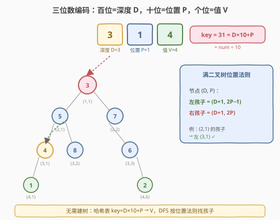
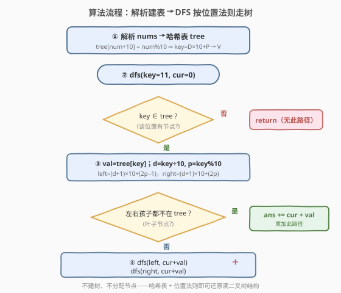
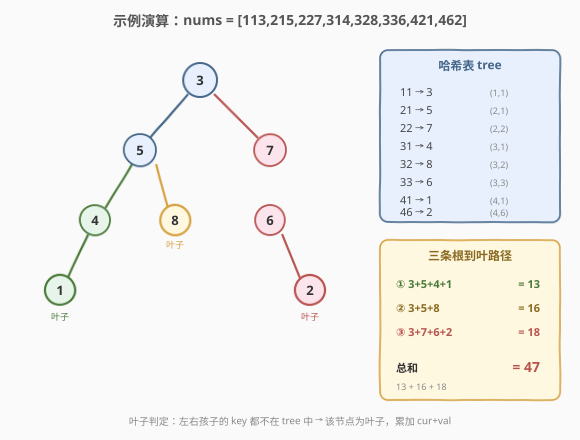

# 路径总和 IV

- **题目名称**：路径总和 IV
- **链接**：[666. 路径总和 IV](https://leetcode.cn/problems/path-sum-iv/)
- **难度**：中等
- **标签**：树、二叉树、深度优先搜索、哈希表

## 1. 题目概述

若一棵二叉树的深度小于 5，则这棵树可以用一个**三位整数数组**表示。数组中每个三位整数编码如下：

- **百位**表示该节点的深度 $D$，$1 \le D \le 4$；
- **十位**表示该节点在其所在层中的位置 $P$，$1 \le P \le 8$，位置编号方式与**满二叉树**一致；
- **个位**表示该节点的值 $V$，$0 \le V \le 9$。

给定一个**按 $(D, P)$ 升序排列**的三位整数数组，求所有「从根节点到叶子节点」路径上节点值之和的总和。

> 💡 **叶子节点**：没有孩子的节点。位置编号遵循满二叉树规则——深度 $D$ 处位置 $P$ 的节点，其左孩子在 $(D+1,\ 2P-1)$，右孩子在 $(D+1,\ 2P)$。若某个位置在数组中不存在，说明该位置没有节点。

**示例 1**：

```text
输入：nums = [113, 215, 221]
输出：12
解释：
  113 → D=1, P=1, V=3（根）
  215 → D=2, P=1, V=5（左孩子）
  221 → D=2, P=2, V=1（右孩子）
  树：
      3
     / \
    5   1
  两条根到叶路径：3+5=8，3+1=4，总和 = 12
```

**示例 2**：

```text
输入：nums = [113, 221]
输出：4
解释：
  113 → D=1, P=1, V=3（根）
  221 → D=2, P=2, V=1（右孩子，左孩子位置 (2,1) 不存在）
  树：
      3
       \
        1
  一条根到叶路径：3+1=4，总和 = 4
```

**约束条件**：

- 数组长度范围 $[1, 15]$（深度 $\le 4$ 的满二叉树最多 $1+2+4+8=15$ 个节点）
- 每个元素是三位整数，百位 $D \in [1, 4]$，十位 $P \in [1, 8]$，个位 $V \in [0, 9]$
- 数组按 $(D, P)$ 升序给出
- 数组表示一棵**合法**的二叉树（每个非根节点的父节点都存在）
- 答案保证在 32 位有符号整数范围内

> 💡 本题是 [112. 路径总和](../0101-0200/112_路径总和.md) 系列的变体：112 直接给你 `TreeNode*` 树根，而 666 把树「压缩」成一个三位数编码数组。核心难点不在路径和本身（那是 112/129 的老套路），而在**如何从编码还原树结构**——而这恰好与 [662. 二叉树最大宽度](662_二叉树最大宽度.md) 的满二叉树编号体系一脉相承。

---

## 2. 解题思路

### 2.1 暴力思路：先建树再 DFS

最直观的做法分两步：先把数组解析成一棵真正的 `TreeNode` 二叉树，再套用 [112](../0101-0200/112_路径总和.md) / [129](../0101-0200/129_求根节点到叶节点数字之和.md) 的 DFS 路径和模板。

建树需要：对每个节点 $(D, P, V)$，找到它的父节点 $(D-1,\ \lceil P/2 \rceil)$ 并挂上去。这需要先遍历一遍建表、再遍历一遍连接父子指针，代码量不小且要处理 `TreeNode` 的内存分配。

> ⚠️ 建树方案完全可行，但**多分配了一整棵树的节点对象**，且父子查找逻辑容易写错（反向算父节点位置比正向算孩子位置更绕）。本题的编码其实已经把树结构「编码」进了 key 里，建树是多余的中间步骤。

### 2.2 核心观察：哈希表 + 位置法则，不建树直接走



关键观察有二：

**观察一：$D \times 10 + P$ 是天然的唯一键。** 每个三位数 `num` 的前两位恰好是 $D \times 10 + P$（即 `num / 10`），个位是 $V$（即 `num % 10`）。于是只需一次遍历就能把数组压成哈希表 `tree`，键为 $D \times 10 + P$、值为 $V$：

$$
\text{tree}[\text{num} \div 10] = \text{num} \bmod 10
$$

例如 `314` → `tree[31] = 4`，即深度 3、位置 1 的节点值为 4。这个 key 既唯一又可直接从 num 算出，无需额外构造。

**观察二：满二叉树位置法则给出父子关系。** 深度 $D$、位置 $P$ 的节点，其左右孩子的位置遵循满二叉树编号：

$$
\text{左孩子} = (D+1,\ 2P - 1), \qquad \text{右孩子} = (D+1,\ 2P)
$$

对应的哈希键为：

$$
\text{key}_{\text{left}} = (D+1) \times 10 + (2P - 1), \qquad \text{key}_{\text{right}} = (D+1) \times 10 + 2P
$$

> 💡 **为什么这套编号有效？** 满二叉树的位置编号天然编码了父子关系——左孩子位置 $= 2P-1$、右孩子 $= 2P$ 是「左奇右偶、父 $P$ 对应子 $2P-1$ 与 $2P$」的标准映射。即使树不是满的（某些位置缺失），编号体系依然成立：**缺失的位置只是不在哈希表里**，DFS 查不到就自然跳过。这与 [662](662_二叉树最大宽度.md) 用编号还原满二叉树位置的思想完全同源——编号跟着真实节点走，却天然记下了结构关系。

于是，**DFS 不需要 `TreeNode*` 指针，只需要一个 `key`**：从根 `key = 11`（$D=1, P=1$）出发，每步用位置法则算出左右孩子的 key，查哈希表判断是否存在，存在就递归走下去。

### 2.3 算法流程图



**DFS 递归逻辑** `dfs(key, cur)`——`key` 是当前节点的 $D \times 10 + P$，`cur` 是从根到当前节点**父节点**的累计和：

| 情况 | 处理 |
|------|------|
| `key` 不在 `tree` 中 | `return`（该位置无节点，此路径不存在） |
| 算出 `val = tree[key]`，更新 `d, p`，计算左右孩子 key | — |
| 左右孩子都不在 `tree` 中（叶子） | `ans += cur + val`（累加完整路径和） |
| 否则（至少有一个孩子） | `dfs(left, cur + val)`；`dfs(right, cur + val)` |

> ⚠️ **叶子判定不能只看 `node == null`。** 与 112/129 不同，本题没有真实的 `null` 指针。叶子的定义是「左右孩子的 key 都不在 `tree` 中」——这等价于「该节点没有任何孩子」。若只判一个孩子不存在就累加，会把只有一个孩子的内部节点误判为叶子。必须**两个都不在**才算叶子。

> 💡 **`cur` 按值传递、天然免回溯。** 与 [129](../0101-0200/129_求根节点到叶节点数字之和.md) 的 `cur × 10 + val` 一样，本题的 `cur + val` 也是不可变整数参数。每次递归调用 `dfs(child, cur + val)` 时，子调用拿到新值，当前层的 `cur` 不受影响——无需手动回溯。

### 2.4 示例演算

以 `nums = [113, 215, 227, 314, 328, 336, 421, 462]` 为例：



**第一步——解析建表**：

| num | key (num÷10) | V (num%10) | (D, P) |
|-----|-------------|-----------|--------|
| 113 | 11 | 3 | (1,1) |
| 215 | 21 | 5 | (2,1) |
| 227 | 22 | 7 | (2,2) |
| 314 | 31 | 4 | (3,1) |
| 328 | 32 | 8 | (3,2) |
| 336 | 33 | 6 | (3,3) |
| 421 | 41 | 1 | (4,1) |
| 462 | 46 | 2 | (4,6) |

**第二步——DFS 从根 key=11 出发**，追踪三条根到叶路径：

| 路径 | 节点序列 | cur 演变（逐层 +val） | 叶子处路径和 |
|------|---------|----------------------|-------------|
| ① | 3 → 5 → 4 → 1 | 0→**3**→**8**→**12**→**13** | 13 |
| ② | 3 → 5 → 8 | 0→3→**8**→**16** | 16 |
| ③ | 3 → 7 → 6 → 2 | 0→**3**→**10**→**16**→**18** | 18 |

三条路径全部走完后，总和 $13 + 16 + 18 = 47$。

> 💡 注意路径 ① 和 ② 共享前缀 `3 → 5`：DFS 在节点 `(2,1)=5` 处算出左孩子 key=31（存在）、右孩子 key=32（存在），于是**两次递归分别走左、右**。左路 `cur=8` 下传给 `(3,1)=4`，右路 `cur=8` 下传给 `(3,2)=8`——两路的 `cur` 互不干扰，这正是按值传递的好处。路径 ③ 走 `(2,2)=7` 分支，与 ①② 完全独立。

> ⚠️ 路径 ① 的叶子 `(4,1)=1` 深度为 4，路径 ② 的叶子 `(3,2)=8` 深度为 3，路径 ③ 的叶子 `(4,6)=2` 深度为 4——**叶子可以出现在不同深度**。只要某节点的两个孩子 key 都不在 `tree` 中，它就是叶子，无论它在第几层。

---

## 3. 参考代码

### C++

```cpp
// 路径总和 IV.cpp —— 哈希表 + DFS（不建树）
// 编译: g++ -O2 -std=c++17 路径总和IV.cpp -o pathsum4
#include <vector>
#include <unordered_map>
using namespace std;

class Solution {
    unordered_map<int, int> tree;   // key = D*10+P -> V
    int ans = 0;

    void dfs(int key, int cur) {
        if (tree.find(key) == tree.end()) return;          // 该位置无节点
        int val = tree[key];
        int d = key / 10, p = key % 10;
        int left  = (d + 1) * 10 + (2 * p - 1);            // 左孩子 key
        int right = (d + 1) * 10 + (2 * p);                // 右孩子 key
        if (tree.find(left) == tree.end()
            && tree.find(right) == tree.end()) {            // 叶子：累加完整路径和
            ans += cur + val;
        } else {                                            // 内部节点：下传 cur+val
            dfs(left, cur + val);
            dfs(right, cur + val);
        }
    }

  public:
    int pathSum(vector<int>& nums) {
        tree.clear();
        ans = 0;
        for (int num : nums) {
            tree[num / 10] = num % 10;                      // key=D*10+P, V
        }
        dfs(11, 0);                                         // 根固定在 (1,1)
        return ans;
    }
};
```

### Python

```python
class Solution:
    def pathSum(self, nums: List[int]) -> int:
        tree = {num // 10: num % 10 for num in nums}   # key=D*10+P -> V
        self.ans = 0

        def dfs(key: int, cur: int) -> None:
            if key not in tree:                         # 该位置无节点
                return
            val = tree[key]
            d, p = key // 10, key % 10
            left = (d + 1) * 10 + (2 * p - 1)           # 左孩子 key
            right = (d + 1) * 10 + (2 * p)               # 右孩子 key
            if left not in tree and right not in tree:  # 叶子：累加完整路径和
                self.ans += cur + val
            else:                                        # 内部节点：下传 cur+val
                dfs(left, cur + val)
                dfs(right, cur + val)

        dfs(11, 0)                                       # 根固定在 (1,1)
        return self.ans
```

> 💡 代码的核心技巧是**把「节点指针」替换成「哈希键」**：`dfs(key, cur)` 的 `key` 就是 $D \times 10 + P$，它同时编码了深度和位置。从 key 可以拆出 $d = \text{key} \div 10$、$p = \text{key} \bmod 10$，再用位置法则算出孩子的 key。整个 DFS 没有任何 `TreeNode` 对象——树结构完全隐含在哈希表的键值对中。

---

## 4. 复杂度分析

| 维度 | 复杂度 | 说明 |
|------|--------|------|
| **时间复杂度** | $O(n)$ | 每个节点在 DFS 中至多被访问一次（加上一次哈希表建表）；每个节点做 $O(1)$ 的哈希查找与算术运算 |
| **空间复杂度** | $O(n)$ | 哈希表存 $n$ 个键值对；递归栈深度 $=$ 树高 $h \le 4$（深度不超过 4），栈开销为 $O(1)$ 量级 |

> 💡 本题树深 $\le 4$，递归栈极浅，完全无需担心栈溢出。空间开销几乎全在哈希表上。若改用「建树 + DFS」方案，空间同样是 $O(n)$（$n$ 个 `TreeNode` 对象），但常数更大且代码更长——哈希表方案在空间和简洁性上都更优。

---

## 5. 扩展：反向建树法

若面试官要求「还原出真实的二叉树」，可用如下思路建树后再做路径和：

```python
class Solution:
    def pathSum(self, nums: List[int]) -> int:
        # 建表：key -> (val, node)
        tree = {}
        for num in nums:
            d, p, v = num // 100, (num // 10) % 10, num % 10
            key = d * 10 + p
            tree[key] = v

        # DFS 用 key 代替指针，逻辑与上面主解完全一致
        # 区别仅在于：也可在此处真正 new TreeNode 并连接父子指针
        # 但对路径和而言，建树是多余的——哈希表已隐含全部结构

        self.ans = 0

        def dfs(key, cur):
            if key not in tree:
                return
            v = tree[key]
            d, p = key // 10, key % 10
            left = (d + 1) * 10 + (2 * p - 1)
            right = (d + 1) * 10 + (2 * p)
            if left not in tree and right not in tree:
                self.ans += cur + v
            else:
                dfs(left, cur + v)
                dfs(right, cur + v)

        dfs(11, 0)
        return self.ans
```

> ⚠️ 真正建 `TreeNode` 树需要先对所有节点排序（按 $D$ 升序），再对每个非根节点用 $P_{\text{parent}} = \lceil P / 2 \rceil$ 反算父节点 key 并连接指针。反向算父比正向算孩子更易出错（要处理奇偶），且建树后路径和逻辑与 [129](../0101-0200/129_求根节点到叶节点数字之和.md) 完全雷同，没有新的训练价值。面试中**推荐哈希表方案为主解**，提一句「也可建树但更繁琐」即可。

---

## 6. 面试要点

1. **为什么用 $D \times 10 + P$ 作为哈希键？**

   - 因为三位数 `num` 的前两位恰好是 $D \times 10 + P$（即 `num / 10`），个位是 $V$（即 `num % 10`）。这个 key 既能唯一标识节点（$D \in [1,4]$、$P \in [1,8]$ 保证无冲突），又能直接从 `num` 算出，无需额外构造。更妙的是，从 key 还能拆回 $d = \text{key} \div 10$、$p = \text{key} \bmod 10$，用于计算孩子 key——一个 key 同时承担了「标识」与「定位」双重职责。

2. **为什么不建真实的 `TreeNode` 树？**

   - 编码已经把树结构压缩进了 key 里。建树意味着把隐式结构显式化成 $n$ 个对象，既费内存又增加代码复杂度（要处理父子指针连接）。哈希表方案用 $O(n)$ 空间存键值对、$O(1)$ 查找判断存在性，完全等价且更简洁。建树只在题目后续要求「返回树根」时才必要——本题只要路径和，建树是多余中间步。

3. **位置法则 `左=(D+1, 2P−1), 右=(D+1, 2P)` 的依据是什么？**

   - 满二叉树的标准编号：第 $D$ 层有 $2^{D-1}$ 个位置，第 $D$ 层位置 $P$ 的节点的左孩子在第 $D+1$ 层的第 $2P-1$ 位、右孩子在第 $2P$ 位。这是因为满二叉树中每个节点恰好分裂为两个子位置，左在前（奇数）、右在后（偶数）。这与 [662](662_二叉树最大宽度.md) 的 `左=2i+1, 右=2i+2`（0-indexed）是同一套编号的 1-indexed 变体。

4. **叶子判定为什么是「两个孩子都不在 `tree` 中」？**

   - 本题没有真实的 `null` 指针，「没有孩子」等价于「左右孩子的 key 都不在哈希表中」。若只判一个孩子不存在就累加，会把只有一个孩子的内部节点误判为叶子——例如示例 2 中根 `(1,1)` 只有右孩子没有左孩子，但根不是叶子。必须**两个都不在**才累加，否则只下传 `cur + val` 继续递归。

5. **DFS 和 BFS 在本题有何区别？**

   - 两者时间都是 $O(n)$。DFS 的优势是 `cur`（路径累计和）作为参数随递归自然下传，到叶子直接累加 `cur + val`，无需额外状态管理。BFS 则需为队列中每个节点额外存「从根到该节点的累计和」，代码更繁琐。此外，本题树深 $\le 4$，DFS 栈深极浅，没有递归溢出风险，是天然首选。

> 💡 **一句话总结**：666 的核心是「**用 $D \times 10 + P$ 当哈希键隐式存树，用满二叉树位置法则算父子关系，用 DFS 累计路径和**」。它把 [662](662_二叉树最大宽度.md) 的编号体系与 [112](../0101-0200/112_路径总和.md) / [129](../0101-0200/129_求根节点到叶节点数字之和.md) 的路径和模板缝合在一起——编号负责还原结构，DFS 负责走路径，哈希表负责判断存在性。三者合一，无需建树即可解题。

---

## 7. 同类练习题

- [112. 路径总和](https://leetcode.cn/problems/path-sum/)：路径和 DFS 的判定版（`||` 短路），666 的路径积累逻辑直接来源于此（[题解](../0101-0200/112_路径总和.md)）
- [129. 求根节点到叶节点数字之和](https://leetcode.cn/problems/sum-root-to-leaf-numbers/)：路径和 DFS 的求和版，`cur` 参数下传 + 叶子累加，与 666 的 `cur + val` 同构（[题解](../0101-0200/129_求根节点到叶节点数字之和.md)）
- [662. 二叉树最大宽度](https://leetcode.cn/problems/maximum-width-of-binary-tree/)：满二叉树编号体系的招牌题，666 的位置法则（左 $2P-1$、右 $2P$）正是其 1-indexed 变体（[题解](662_二叉树最大宽度.md)）
- [958. 二叉树的完全性检验](https://leetcode.cn/problems/check-completeness-of-a-binary-tree/)：层序遍历判位置连续性，与满二叉树编号思想互补——完全性等价于编号无空洞（[题解](../0901-1000/958_二叉树的完全性检验.md)）
- [437. 路径总和 III](https://leetcode.cn/problems/path-sum-iii/)：路径和系列的进阶版，任意起点任意终点，升级为树上前缀和 + 哈希计数（[题解](../0401-0500/437_路径总和III.md)）
