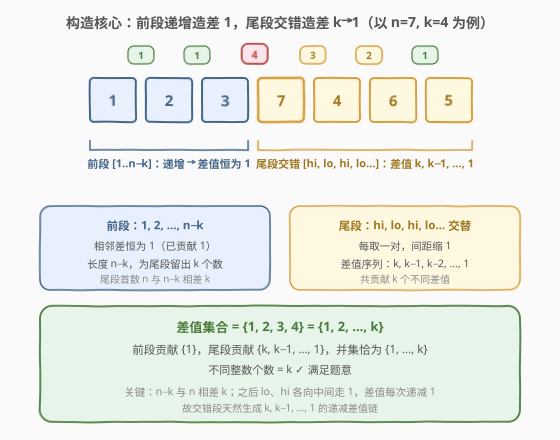
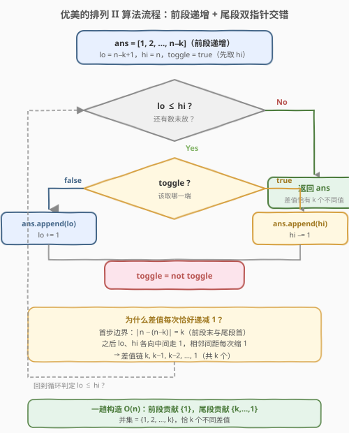

# LeetCode 优美的排列 II 题解

## 1. 题目概述

- **标题 / 题号**：优美的排列 II（#667，medium）
- **链接**：https://leetcode.cn/problems/beautiful-arrangement-ii/
- **难度**：中等
- **标签**：数组、贪心、构造、双指针、数学

**题意**：给你两个整数 `n` 和 `k`，请你构造一个列表 `answer`，包含从 `1` 到 `n` 的 `n` 个**不同正整数**，且满足：

- 设 `answer = [a1, a2, …, an]`，则相邻差值列表 `[|a1−a2|, |a2−a3|, …, |a_{n−1}−a_n|]` 中**有且仅有 `k` 个不同整数**。

返回任意一种满足条件的 `answer`。

**示例 1**：

```text
输入：n = 3, k = 1
输出：[1, 2, 3]
解释：[1, 2, 3] 含 1–3 的不同整数；相邻差 [1, 1] 有且仅有 1 个不同整数：1
```

**示例 2**：

```text
输入：n = 3, k = 2
输出：[1, 3, 2]
解释：[1, 3, 2] 含 1–3 的不同整数；相邻差 [2, 1] 有 2 个不同整数：1 和 2
```

**约束**：

- $1 \le k < n \le 10^4$

> 💡 **关键约束**：只要 `k` 个不同差值，**不要求**差值必须是 $\{1,2,\dots,k\}$；且只要返回**任意一种**合法排列。这暗示本题是**构造题**而非搜索题——存在一个简洁的、对所有 $1 \le k < n$ 通用的构造公式，无需回溯。

## 2. 解题思路

### 2.1 暴力思路：枚举排列 + 校验

枚举 $1 \sim n$ 的所有排列，对每个排列算出相邻差值集合，集合大小等于 $k$ 即返回。时间 $O(n! \cdot n)$，$n=10^4$ 时完全不可行。

> ⚠️ 暴力法暴露一个事实：本题解空间巨大但**合法解极多**，盲搜毫无意义。真正要问的是——**能否直接“设计”出一个差值集合恰为某个 $k$ 元集合的排列？** 答案是能，而且构造极其规整。

### 2.2 核心观察：前段递增造差 1，尾段交错造差 k→1



把数组拆成**两段**：

**第一段（前段递增）**：`[1, 2, …, n−k]`，长度 $n-k$。它的相邻差值恒为 $1$，向差值集合中**贡献** $\{1\}$。

**第二段（尾段交错）**：把剩余的 $k$ 个数 $\{n-k+1, \dots, n\}$ 用**双指针交错**摆放——先取 `hi=n`，再取 `lo=n−k+1`，再取 `hi=n−1`，再取 `lo=n−k+2`……如此 `hi, lo, hi, lo` 交替。这一段的相邻差值依次为：

$$
k,\; k-1,\; k-2,\; \dots,\; 1
$$

即恰好贡献 $\{1, 2, \dots, k\}$。

> 💡 **两段并集**：前段贡献 $\{1\}$，尾段贡献 $\{1, 2, \dots, k\}$，并集 $= \{1, 2, \dots, k\}$，**恰有 $k$ 个不同整数**。注意 $\{1\}$ 已被尾段覆盖，前段只是“把数组长度撑到 $n$”而不引入新的差值种类。

**为什么尾段差值恰好是 $k, k-1, \dots, 1$？** 看两个衔接点：

1. **边界差**：前段最后一个数是 $n-k$，尾段第一个数是 $hi=n$，二者之差 $|n - (n-k)| = k$。
2. **此后每次缩 1**：交错时 `lo` 与 `hi` 各自从两端向中间走一步（`lo += 1`、`hi −= 1`），于是相邻两个被取出的数之间的间距**每次恰好减少 1**——得到 $k, k-1, k-2, \dots$，直到 `lo` 与 `hi` 相遇，最后一个差值落到 $1$。

这条递减差值链长度恰为 $k$（$k$ 个差值对应尾段 $k+1$ 个数？不——尾段 $k$ 个数产生 $k-1$ 个内部差，加上与前段衔接的 $1$ 个边界差，共 $k$ 个差值，正好是 $k, k-1, \dots, 1$）。详见 2.4 示例演算的逐差验证。

> ⚠️ **`k = 1` 的退化**：此时前段为 `[1, 2, …, n−1]`，尾段只剩一个数 `n`，无交错。整个数组 `[1, 2, …, n]` 差值恒为 $1$，集合 $\{1\}$ 大小为 $1 = k$ ✓。构造公式无需特判，天然成立。

### 2.3 算法流程图



算法步骤：

1. `ans = [1, 2, …, n−k]`（前段递增，直接 `range` 生成）。
2. 初始化双指针 `lo = n−k+1`，`hi = n`，标志位 `toggle = True`（先取 `hi` 以制造最大边界差 $k$）。
3. 当 `lo ≤ hi` 循环：
   - `toggle == True`：`ans.append(hi)`，`hi −= 1`。
   - `toggle == False`：`ans.append(lo)`，`lo += 1`。
   - `toggle = not toggle`（交替）。
4. `lo > hi` 时退出，返回 `ans`。

> 💡 **为什么先取 `hi` 而非 `lo`？** 因为前段最后一个数是较小的 $n-k$，先接上较大的 $hi=n$ 才能制造最大差 $k$；若先取 `lo=n−k+1`，边界差只有 $1$，无法启动 $k \to 1$ 的递减链。先取 `hi` 是构造成立的关键。

### 2.4 示例演算

以 `n = 5, k = 3` 为例，逐步追踪双指针交错如何生成差值链：

![示例演算：n=5, k=3 构造 [1,2,5,3,4]](../images/ba2_example_walkthrough.svg)

| 步骤 | 操作（toggle） | lo / hi | 数组状态 | 新增差值 |
|------|---------------|---------|---------|---------|
| 0 | 前段 `[1..n−k]` | 3 / 5 | [1, 2] | $\|2−1\|=1$ |
| 1 | true → 取 hi=5 | 3 / 4 | [1, 2, 5] | $\|5−2\|=3$ ★ |
| 2 | false → 取 lo=3 | 4 / 4 | [1, 2, 5, 3] | $\|3−5\|=2$ ★ |
| 3 | true → 取 hi=4 | 4 / 3 | [1, 2, 5, 3, 4] | $\|4−3\|=1$ |
| 结束 | lo=4 > hi=3 停止 | — | [1, 2, 5, 3, 4] | — |

最终差值序列 `[1, 3, 2, 1]` → 集合 $\{1, 2, 3\}$，大小 $3 = k$ ✓。

> 💡 对比示例 2（`n=3, k=2`）：前段 `[1]`，尾段 `lo=2, hi=3` 交错 → 取 `hi=3`、取 `lo=2` → `[1, 3, 2]`，差值 `[2, 1]` → $\{1, 2\}$ ✓。与官方示例输出完全一致。再看 `k=1`（`n=3`）：前段 `[1, 2]`，尾段只剩 `3` → `[1, 2, 3]`，差值 `[1, 1]` → $\{1\}$ ✓，亦与示例 1 一致。

## 3. 参考代码

### C++

```cpp
class Solution {
public:
    vector<int> constructArray(int n, int k) {
        vector<int> ans;
        ans.reserve(n);
        // 前段递增 [1, 2, ..., n-k]，贡献差值 {1}
        for (int i = 1; i <= n - k; ++i) ans.push_back(i);
        // 尾段双指针交错：先取 hi 制造边界差 k，之后差值每次递减 1
        int lo = n - k + 1, hi = n;
        bool toggle = true;
        while (lo <= hi) {
            if (toggle) ans.push_back(hi--);
            else        ans.push_back(lo++);
            toggle = !toggle;
        }
        return ans;
    }
};
```

### Python

```python
class Solution:
    def constructArray(self, n: int, k: int) -> List[int]:
        ans = list(range(1, n - k + 1))   # 前段递增，贡献差值 {1}
        lo, hi = n - k + 1, n              # 尾段剩余 k 个数，双指针交错
        toggle = True                      # 先取 hi，制造边界差 k
        while lo <= hi:
            if toggle:
                ans.append(hi)
                hi -= 1
            else:
                ans.append(lo)
                lo += 1
            toggle = not toggle
        return ans
```

> 💡 **更紧凑的写法**：交错段可用一个标志位 `i` 在 `lo + (k-1)//2` 与 `hi` 间切换；但 `toggle` 布尔版可读性最佳，且 `O(n)` 已达下界，无需压榨常数。若面试官追求“无分支”，可改为按步数奇偶性直接计算下一个数，但收益甚微。

## 4. 复杂度分析

| 维度 | 复杂度 | 说明 |
|------|--------|------|
| **时间复杂度** | $O(n)$ | 前段 $n-k$ 次 `push` + 尾段 $k$ 次 `push`，合计恰好 $n$ 次，每次 $O(1)$ |
| **空间复杂度** | $O(1)$ | 仅 `lo/hi/toggle` 常数变量；返回数组不计入额外空间（若计入则为 $O(n)$ 输出空间） |

> 💡 本题是**构造题**的典型范本：不搜索、不 DP，直接用 $O(n)$ 一趟生成答案。时间已达下界（至少要写出 $n$ 个数），空间为常数。对比暴力 $O(n! \cdot n)$，构造法的价值在于洞察“差值集合可被主动设计”而非被动校验。

## 5. 扩展：构造的另一种等价视角

还有一种常见的等价写法——不显式分两段，而是用**单指针 + 方向反转**：

```python
class Solution:
    def constructArray(self, n: int, k: int) -> List[int]:
        ans = [1]
        step, sign = k, 1            # 先 +k 跳到 1+k，再 −(k−1)，再 +(k−2)…
        for _ in range(k):
            ans.append(ans[-1] + sign * step)
            step -= 1
            sign *= -1
        # 前 k+1 个数已生成差值 k, k−1, …, 1；再补全剩余递增
        for x in range(k + 2, n + 1):
            ans.append(x)
        return ans
```

这其实与主解同构：`ans[-1] + sign*step` 等价于在 `lo/hi` 之间交替取数，只是把“双指针”换成了“单指针 + 变步长”。`step` 从 $k$ 递减到 $1$，对应差值链 $k, k-1, \dots, 1$；之后从 `k+2` 起顺序补全，差值恒为 $1$（已存在）。

> ⚠️ 该写法的“补全段”从 `k+2` 起，意味着前 $k+1$ 个数已经用掉了 $\{1, 2, \dots, k+1\}$（通过 `1, 1+k, 2, k, 3, k-1, …` 的来回跳）。这与主解的“前段 `[1..n-k]` + 尾段交错”是同一排列的两种拆分视角，生成的数组可能不同但都合法。面试中**主解（双指针）更直观、更不易写错下标**，推荐为主。

## 6. 面试要点

1. **为什么这是构造题而不是搜索/DP 题？**

   - 题目只要“任意一种”合法排列，且约束 $1 \le k < n$ 对所有取值都存在解。这种“保证有解 + 任意解均可”的措辞是构造题的典型信号。搜索（回溯/DP）在 $n=10^4$ 下不可行，而构造法 $O(n)$ 一趟搞定。

2. **为什么差值集合恰为 $\{1, 2, \dots, k\}$ 而非任意 $k$ 个值？**

   - 因为构造刻意让差值链取 $k, k-1, \dots, 1$——这是最规整的 $k$ 个不同正整数。题目并不要求差值必须是 $\{1,\dots,k\}$（任意 $k$ 个不同值都行），但这条递减链最容易构造且天然无重复，故选之。换别的 $k$ 元集合也能造，但构造公式会复杂得多。

3. **为什么前段长度是 $n-k$ 而不是别的？**

   - 尾段需要 $k$ 个数来产生 $k$ 个差值（$k$ 个数 + 与前段的 $1$ 个衔接 = $k$ 个差值，对应 $k, k-1, \dots, 1$）。剩余 $n-k$ 个数放进前段递增，只产生差值 $1$（已被尾段覆盖），不引入新种类。若前段更长，会多出无意义的差值 $1$（无妨但不必要）；更短则尾段不够 $k$ 个数。故 $n-k$ 是精确的分界。

4. **`toggle` 必须先为 `True`（先取 `hi`）吗？反过来行不行？**

   - 必须先取 `hi`。前段末尾是较小的 $n-k$，只有先接上较大的 $hi=n$ 才能产生最大边界差 $k$，启动 $k \to 1$ 的递减链。若先取 `lo=n-k+1`，边界差仅 $1$，后续交错也只会产生 $1$ 附近的差值，凑不齐 $k$ 个不同值。

5. **$k = n-1$（最大值）时构造退化成什么？**

   - 前段长度 $n - (n-1) = 1$，即只有 `[1]`；尾段交错摆放 $\{2, \dots, n\}$，差值链 $n-1, n-2, \dots, 1$，集合 $\{1, \dots, n-1\}$ 恰 $n-1 = k$ 个。这是“锯齿形”排列 `[1, n, 2, n−1, 3, n−2, …]`，差值取满所有可能值。极端情况验证构造的鲁棒性。

> 💡 **一句话总结**：667 的核心是「**前段递增撑长度贡献 $\{1\}$，尾段双指针交错贡献 $\{k, k-1, \dots, 1\}$，并集恰为 $k$ 个不同差值**」。它把“设计差值集合”这一抽象目标，落成了“让 `lo/hi` 各向中间走 1 步”这一具体动作——间距每次缩 1，差值链自然递减。构造题的招牌：用结构换搜索。

## 同类练习题

| # | 题目 | 与本题的关联 |
|---|------|-------------|
| 667 | [优美的排列 II](https://leetcode.cn/problems/beautiful-arrangement-ii/) | 本题本身，构造题招牌（差值集合可主动设计） |
| 526 | [优美的排列](https://leetcode.cn/problems/beautiful-arrangement/)（[题解](../0501-0600/526_优美的排列.md)） | 同名系列的前作，但 526 是“计数”而非“构造”，需状态压缩 DP；对比理解“构造 vs 计数”的难度差异 |
| 31 | [下一个排列](https://leetcode.cn/problems/next-permutation/)（[题解](../0001-0100/31_下一个排列.md)） | 同为“主动设计排列结构”的构造题，双指针从尾扫描找升序对，与本题双指针交错形成对照 |
| 60 | [第 k 个排列](https://leetcode.cn/problems/permutation-sequence/)（[题解](../0001-0100/60_第k个排列.md)） | 用康托尔展开“解码”出第 k 个排列，构造视角的另一种范式——按位定候选而非按差值设计 |
| 942 | [增减字符串匹配](https://leetcode.cn/problems/di-string-match/) | 给定相邻增减关系构造排列，双指针贪心摆放（`I` 取 `lo`、`D` 取 `hi`），与本题交错双指针同源 |
