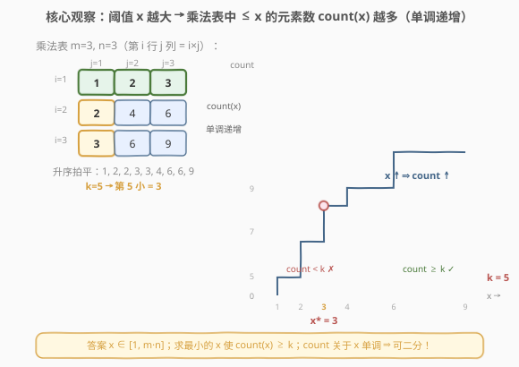
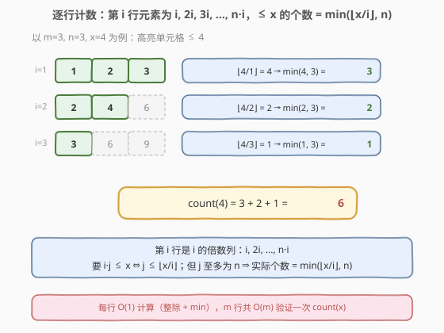
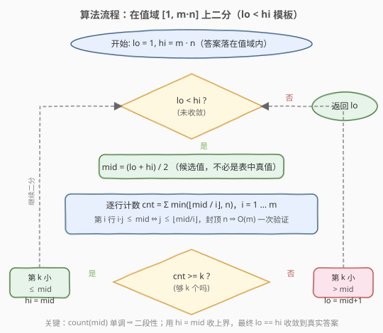
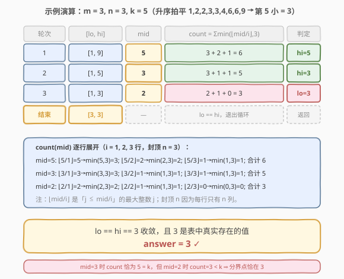

# 乘法表中第k小的数

- **题目名称**：乘法表中第k小的数
- **链接**：[668. 乘法表中第k小的数](https://leetcode.cn/problems/kth-smallest-number-in-a-multiplication-table/)
- **难度**：困难
- **标签**：二分查找、数学、计数

## 1. 题目概述

给定高度 `m`、宽度 `n` 的一张 `m * n` 乘法表：第 `i` 行第 `j` 列的元素为 `i * j`（`i` 从 `1` 到 `m`，`j` 从 `1` 到 `n`，均为 1-indexed）。再给定正整数 `k`，返回表中**第 `k` 小**的数字（按升序排列后的第 `k` 个，重复元素分别计数）。

**示例 1**：

```text
输入：m = 3, n = 3, k = 5
输出：3
解释：乘法表为
  1 2 3
  2 4 6
  3 6 9
升序拍平为 [1,2,2,3,3,4,6,6,9]，第 5 个是 3。
```

**示例 2**：

```text
输入：m = 2, n = 3, k = 6
输出：6
解释：乘法表为
  1 2 3
  2 4 6
升序拍平为 [1,2,2,3,4,6]，第 6 个是 6。
```

**约束条件**：

- $1 \le m, n \le 3 \times 10^4$
- $1 \le k \le m \cdot n$

> ⚠️ 注意：`m * n` 最多约 $9 \times 10^8$，**无法显式构造整张表**（必然 MLE/TLE）。题目求「第 k 小」而非「第 k 个不同值」，重复元素（如 `2`、`3`、`6` 各出现多次）分别占位计数。

---

## 2. 解题思路

### 2.1 暴力思路

把 `m * n` 个元素全部生成、排序后取第 `k` 个。时间和空间都是 $O(mn)$，`mn \approx 9 \times 10^8` 直接超内存超时，不可行。

换个角度：答案一定落在 $[1,\ m \cdot n]$ 之间。能否**不枚举元素，而是枚举值**？对每个候选值 `x`，只需统计「表中 $\le x$ 的元素有多少个」。若从 1 到 $m \cdot n$ 逐个试，每次统计 $O(mn)$，整体依然超时。

> 💡 **关键转化**：把「求第 k 小的值」变成「求最小的 `x`，使表中 $\le x$ 的元素数 $\ge k$」——这是**二分答案**的标准信号。只要 `count(x)` 关于 `x` 单调，就能在值域上二分，把 $O(mn)$ 次验证降到 $O(\log(mn))$ 次。

### 2.2 核心观察：二分答案 + 逐行计数



注意到「表中 $\le x$ 的元素数 `count(x)`」关于 `x` **单调递增**：

- `x` 越大（阈值越宽），满足条件的元素越多。
- `x = 0` 时 `count = 0`；`x = m·n` 时整张表都算入，`count = m·n`。

于是存在一个**分界点** `x*`：

```text
x < x* → count(x) < k    (不够 k 个，阈值太小)
x >= x* → count(x) >= k  (够 k 个，阈值够大)
```

这正是二分查找所需的**二段性**。在 $[1,\ m \cdot n]$ 上二分，每次 $O(m)$ 统计 `count(mid)`，可行（`cnt >= k`）就把上界收到 `mid`，不可行（`cnt < k`）就把下界抬到 `mid + 1`。

> 💡 **识别信号**：题目求「第 k 小」且能高效统计「$\le$ 某值的元素个数」→ 想「二分答案」。本题与 [719. 找出第 K 小的数对距离](../0701-0800/719_找出第K小的数对距离.md)、[378. 有序矩阵中第 K 小的元素](../0301-0400/378_有序矩阵中第K小的元素.md) 同骨架，只是 `count()` 换成了「乘法表逐行整除计数」。

> ⚠️ **为什么 `count(mid) >= k` 就把 `hi = mid` 而非 `hi = mid - 1`？** 因为我们二分的是「值域」，`mid` 未必是表中真实存在的值（例如 `m=3,n=3` 时 `mid=5` 不在表中）。`cnt >= k` 只能断定「第 k 小 $\le$ mid」，需把上界收到 `mid` 继续逼近；最终 `lo == hi` 收敛时才落到真实答案。这与 719（`mid` 是真实距离值）使用 `hi = mid - 1` 的写法形成对照。

### 2.3 计数函数：每行 O(1) 整除 + min



关键在于 `count(x)` 能否 $O(m)$ 求出。观察第 `i` 行的元素：

$$
i \cdot 1,\ i \cdot 2,\ i \cdot 3,\ \dots,\ i \cdot n
$$

它们是 `i` 的倍数列，**天然升序**。要统计其中 $\le x$ 的个数，等价于求最大的 `j` 使 $i \cdot j \le x$，即 $j \le \lfloor x / i \rfloor$。但每行最多只有 `n` 列，故实际个数为：

$$
\text{row}_i(x) = \min\!\left(\left\lfloor \frac{x}{i} \right\rfloor,\ n\right)
$$

累加所有行即得：

$$
\text{count}(x) = \sum_{i=1}^{m} \min\!\left(\left\lfloor \frac{x}{i} \right\rfloor,\ n\right)
$$

每行 $O(1)$（一次整除 + 一次 `min`），`m` 行共 $O(m)$。

> 💡 **为什么 `⌊x/i⌋` 需要封顶 `n`？** 当 `i` 较小（如 `i=1`）而 `x` 较大时，`⌊x/i⌋` 可能超过 `n`。例如 `m=3, n=3, x=9`：第 1 行 `⌊9/1⌋ = 9`，但该行只有 3 个元素（`1,2,3`），实际贡献 `min(9, 3) = 3`。封顶 `n` 防止把「虚拟列」算入。

> ⚠️ **小优化**：当 `i > x` 时 `⌊x/i⌋ = 0`，后续更大的 `i` 也都为 0，可提前 `break`。但由于 `i` 只到 `m`，且 `⌊x/i⌋` 计算本身 $O(1)$，是否 break 对总复杂度影响极小，代码可省略以保持简洁。

### 2.4 算法流程图



采用 `lo < hi` + `hi = mid` 的「值域二分」模板：判定为「可行」时上界收到 `mid`（不跳过 `mid`，因为 `mid` 可能就是答案），不可行时下界抬到 `mid + 1`。循环结束时 `lo == hi`，收敛到「使 `count >= k` 的最小值」，即第 k 小。

> ⚠️ **模板选择**：值域二分（`mid` 未必是真实值）用 `lo < hi` + `hi = mid`；候选集二分（`mid` 必为真实值，如 719 的距离值）用 `lo <= hi` + `hi = mid - 1`。两者都能 AC，但前者在「`mid` 可能为虚值」时更安全，无需额外记录 `ans` 变量。

### 2.5 示例演算



以 `m = 3, n = 3, k = 5` 为例，在 `[1, 9]` 上二分：

- **第 1 轮** `[1,9]`，`mid = 5`。逐行计数：`min(⌊5/1⌋,3)=3`、`min(⌊5/2⌋,3)=2`、`min(⌊5/3⌋,3)=1`，`count = 6 ≥ 5` ✓ → `hi = 5`。
- **第 2 轮** `[1,5]`，`mid = 3`。计数：`min(3,3)=3`、`min(1,3)=1`、`min(1,3)=1`，`count = 5 ≥ 5` ✓ → `hi = 3`。
- **第 3 轮** `[1,3]`，`mid = 2`。计数：`min(2,3)=2`、`min(1,3)=1`、`min(0,3)=0`，`count = 3 < 5` ✗ → `lo = 3`。
- **结束** `lo = 3 == hi = 3`，退出循环，返回 `3`。

> 💡 观察第 2 轮：`mid=3` 时 `count` 恰为 `k=5`，但答案仍可能是更小的值——只有当更小的 `mid` 的 `count` 仍 $\ge k$ 时才能继续收缩。第 3 轮证明 `mid=2` 时 `count=3 < 5`，故 3 就是分界点。注意 `mid=4` 时 `count=6`（同样 $\ge 5$），但因为第 1 轮已把 `hi` 收到 5、第 2 轮收到 3，`4` 被「跳过」——这正是 `hi = mid` 而非 `hi = mid - 1` 的好处：不必担心跳过真实答案，单调性保证收敛。

---

## 3. 参考代码

### C++

```cpp
class Solution {
  public:
    int findKthNumber(int m, int n, int k) {
        int lo = 1, hi = m * n;
        while (lo < hi) {
            int mid = lo + (hi - lo) / 2;
            // 逐行统计表中 <= mid 的元素数
            int cnt = 0;
            for (int i = 1; i <= m; ++i) {
                cnt += min(mid / i, n);
            }
            if (cnt >= k) hi = mid;       // 够 k 个，第 k 小 <= mid，收上界
            else          lo = mid + 1;   // 不够 k 个，第 k 小 > mid，抬下界
        }
        return lo;
    }
};
```

### Python

```python
class Solution:
    def findKthNumber(self, m: int, n: int, k: int) -> int:
        lo, hi = 1, m * n
        while lo < hi:
            mid = (lo + hi) // 2
            # 逐行统计表中 <= mid 的元素数
            cnt = sum(min(mid // i, n) for i in range(1, m + 1))
            if cnt >= k:
                hi = mid        # 够 k 个，第 k 小 <= mid，收上界
            else:
                lo = mid + 1    # 不够 k 个，第 k 小 > mid，抬下界
        return lo
```

> ⚠️ **三个易错点**：
> 1. **值域上下界**：`lo = 1`（最小元素是 `1·1=1`，不是 0），`hi = m * n`（最大元素）。注意 `m * n` 在 `int` 范围内（$\le 9 \times 10^8$），无需 `long`，但 Python 无此顾虑。
> 2. **封顶 `n`**：`min(mid / i, n)` 中的 `n` 不可漏。漏掉会高估小 `i` 行的贡献（如 `i=1` 行算出 `mid` 个而非 `n` 个），导致 `count` 偏大，二分提前收敛到错误的小值。
> 3. **判定用 `cnt >= k` 而非 `==`**：乘法表中有大量重复值（如 `6 = 2·3 = 3·2 = 1·6`），`count` 会跳跃式增长，`cnt == k` 可能永不成立。用 `>=` 才能正确处理平台期，与 719 同理。

---

## 4. 复杂度分析

| 维度 | 复杂度 | 说明 |
|------|--------|------|
| 时间复杂度 | $O(m \log(mn))$ | 二分 $O(\log(mn))$ 次，每次逐行计数 $O(m)$；$m \le 3 \times 10^4$、$mn \le 9 \times 10^8$，$\log_2(9 \times 10^8) \approx 30$，总计 $\approx 9 \times 10^5$ 次整除 |
| 空间复杂度 | $O(1)$ | 仅 `lo/hi/mid/cnt` 常数变量，不显式构造表 |

> 💡 **优化提示**：若 `m > n`，可交换 `m` 与 `n`（乘法表对称：`i·j = j·i`），让外层循环遍历较小的维度，计数变为 $O(\min(m, n))$。本题 $m, n$ 同阶且上界相同，收益有限，但在 `m` 与 `n` 量级悬殊的变体中有意义。

> ⚠️ 对比暴力 $O(mn)$：本题 $mn \approx 9 \times 10^8$，暴力必然超时；二分将「验证一次」从 $O(mn)$ 降到 $O(m)$，是能否 AC 的分水岭。**面试首选二分答案 + 逐行整除计数**。

---

## 5. 扩展：二分第 k 小的通用框架

本题是「**二分答案求第 k 小**」的经典范式。更一般地，当题目满足：

1. 答案落在已知的连续/离散区间 $[L, R]$ 上；
2. 存在高效的 `count(x)` 统计「$\le x$ 的元素个数」，且 `count` 关于 `x` 单调；
3. 求「第 k 小/大」或「最小的最大值/最大的最小值」。

即可套用：找最小的 `x` 使 $\text{count}(x) \ge k$。不同题目的差异只在 `count()` 的实现：

| 题目 | `count(x)` 实现 | 单次验证 |
|------|-----------------|----------|
| 本题 668 | 乘法表逐行 `min(⌊x/i⌋, n)` | $O(m)$ |
| [719. 找出第 K 小的数对距离](../0701-0800/719_找出第K小的数对距离.md) | 排序 + 双指针数对计数 | $O(n)$ |
| [378. 有序矩阵中第 K 小元素](../0301-0400/378_有序矩阵中第K小的元素.md) | 矩阵左下角双指针计数 | $O(n)$ |
| [410. 分割数组的最大值](../0401-0500/410_分割数组的最大值.md) | 贪心划段数 $\le$ 段数上限 | $O(n)$ |

> 💡 **模板选择速查**：若 `mid` 必为候选集中的真实值（如 719 的距离、410 的段和），可用 `lo <= hi` + `hi = mid - 1` + 记录 `ans`；若 `mid` 是值域中的任意整数、未必真实存在（如本题的 `mid=5`、`mid=4` 不在表中），用 `lo < hi` + `hi = mid`，让上下界自然收敛到真实值，无需 `ans` 变量。

---

## 6. 面试要点

1. **为什么能二分？二段性体现在哪？**

   - `count(x)`（表中 $\le x$ 的元素数）随 `x` 单调递增。存在分界点 `x*`，使 `x < x*` 时 `count < k`（不合法）、`x >= x*` 时 `count >= k`（合法）。这种「左不合法 / 右合法」的结构就是二段性，可用二分定位 `x*`。

2. **`count(x)` 为什么是 O(m)？公式怎么来的？**

   - 第 `i` 行元素是 `i, 2i, …, n·i`，是 `i` 的倍数列且升序。`i·j ≤ x ⇔ j ≤ ⌊x/i⌋`，但 `j` 至多为 `n`，故该行贡献 `min(⌊x/i⌋, n)`。累加 `m` 行，每行 $O(1)$，总 $O(m)$。整除把「数有多少个 ≤ x」变成「算最大下标」，是乘法表计数的核心技巧。

3. **为什么 `min` 里要封顶 `n`？漏掉会怎样？**

   - 当 `i` 小而 `x` 大时 `⌊x/i⌋` 会超过 `n`。例如 `m=3, n=3, x=9`，第 1 行 `⌊9/1⌋=9`，但该行只有 3 列，实际只有 3 个元素。漏掉封顶会把虚拟列算入，`count` 偏大，二分会过早收缩到错误的小值。

4. **为什么用 `lo < hi` + `hi = mid` 而不是 `lo <= hi` + `hi = mid - 1`？**

   - 二分的是「值域」，`mid` 未必是表中真实存在的值（如 `mid=5` 不在 `m=3,n=3` 的表中）。`cnt >= k` 只能保证「第 k 小 $\le$ mid」，故上界收到 `mid` 而非 `mid - 1`（`mid` 仍可能是答案）。最终 `lo == hi` 收敛到真实值。若改用 `lo <= hi` + `hi = mid - 1` + 记录 `ans` 也能 AC，但 `lo < hi` 写法更简洁、无需 `ans` 变量。

5. **`mid` 不是表中真实值时，最终为什么能收敛到真实值？**

   - 单调性保证：所有 `count(x) >= k` 的 `x` 构成上段，其下界 `x*` 就是答案。`hi = mid` 持续把上界压向 `x*`，`lo = mid + 1` 持续把下界抬离「`count < k`」的区域。由于 `count` 只在真实值处发生变化（虚值与左侧最近真实值 `count` 相同），最终 `lo == hi` 必落在使 `count` 首次 $\ge k$ 的最小真实值上。

> 💡 **一句话总结**：668 的核心是「**值域二分 + 逐行整除计数**」——把「数 $\le x$ 的元素」转化为「每行算 `min(⌊x/i⌋, n)`」，让 $O(mn)$ 验证降为 $O(m)$，再靠 `count` 的单调性二分压缩到 $O(m \log(mn))$。它是「二分答案求第 k 小」家族中 `count()` 最数学化的一员。

---

## 7. 同类练习题

- [719. 找出第 K 小的数对距离](https://leetcode.cn/problems/find-k-th-smallest-pair-distance/)（[题解](../0701-0800/719_找出第K小的数对距离.md)）：同骨架二分答案，`count` 换成排序 + 双指针数对计数，`mid` 是真实距离值可用 `hi = mid - 1`
- [378. 有序矩阵中第 K 小的元素](https://leetcode.cn/problems/kth-smallest-element-in-a-sorted-matrix/)（[题解](../0301-0400/378_有序矩阵中第K小的元素.md)）：二分值域 + 左下角双指针计数，与本题同为「值域二分 + `hi = mid`」模板
- [410. 分割数组的最大值](https://leetcode.cn/problems/split-array-largest-sum/)（[题解](../0401-0500/410_分割数组的最大值.md)）：二分答案 + 贪心划段验证，求「最小的最大段和」
- [1011. 在 D 天内送达包裹的能力](https://leetcode.cn/problems/capacity-to-ship-packages-within-d-days/)：二分运载能力，`check` 贪心按天装货
- [644. 子数组最大平均数 II](https://leetcode.cn/problems/maximum-average-subarray-ii/)（[题解](../0601-0700/644_子数组最大平均数II.md)）：二分答案 + 前缀和判定，求「最大的最小平均值」，二分答案在「最值优化」维度的延伸
