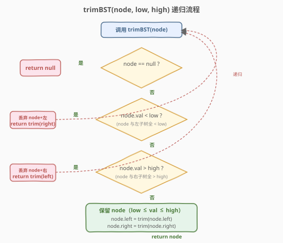

# LeetCode 修剪二叉搜索树 题解

## 1. 题目概述

- **标题 / 题号**：修剪二叉搜索树（#669，medium）
- **链接**：https://leetcode.cn/problems/trim-a-binary-search-tree/
- **难度**：中等
- **标签**：树、二叉搜索树、递归、DFS

**题意**：给你**二叉搜索树（BST）**的根节点 `root`，同时给定最小边界 `low` 和最大边界 `high`。通过修剪 BST，使得**所有节点的值落在 $[\text{low}, \text{high}]$ 中**。修剪**不应改变**保留在树中的元素的相对结构（即未被移除的节点之间原有的父子关系应当保留）。可以证明存在**唯一答案**。返回修剪后的 BST 新的根节点。

> **BST 性质回顾**：对任意节点，左子树所有值 $<$ 根值 $<$ 右子树所有值；左右子树也各自是 BST。

二叉树节点定义：

```python
class TreeNode:
    def __init__(self, val=0, left=None, right=None):
        self.val = val
        self.left = left
        self.right = right
```

**示例 1**：

```text
输入：root = [1,0,2], low = 1, high = 2
输出：[1,null,2]

      1                1
     / \     →          \
    0   2                2
节点 0 < low=1，被删；节点 1、2 在区间内保留，2 接到 1 的右侧。
```

**示例 2**：

```text
输入：root = [3,0,4,null,2,null,null,1], low = 1, high = 3
输出：[3,2,null,1]

        3                  3
       / \                /
      0   4      →       2
       \                /
        2              1
       /
      1
节点 0 < low（连同其空左子树丢弃），其右子树 2 修剪后顶替 0 的位置；
节点 4 > high，整子树丢弃；1、2 在区间内，父子关系原样保留。
```

**约束**：

- 树中节点数在 $[1, 10^4]$ 范围内
- $0 \le \text{Node.val} \le 10^4$
- 树中每个节点的值**唯一**
- 输入保证是一棵合法的 BST
- $0 \le \text{low} \le \text{high} \le 10^4$

> 💡 本题是 [450. 删除二叉搜索树中的节点](../0401-0500/450_删除二叉搜索树中的节点.md) 的"批量删除"变体——把所有越界节点一次性删掉。但 450 删单节点要处理"两个孩子"的棘手情况（找中序后继替换），而 669 借助 BST 有序性可以**整子树丢弃**：越界节点某一侧的子树必然整体越界，直接跳过即可，反而比 450 更简单。突破口是**利用 BST 有序性做单边递归**。

## 2. 解题思路

### 2.1 暴力思路：遍历 + 逐个删除

先遍历收集所有越界节点，再对每个越界节点调用 450 的 `deleteNode`。问题是 450 的删除本身就要处理"两个孩子找后继"的复杂分支，连删多次不仅代码冗长，且每次删除都可能触发子树重排，效率低下。更糟的是，删一个节点后树结构变化，后续节点的路径也要重新走，容易出错。

> ⚠️ 这条路把简单问题复杂化了。669 的本质是"按值域裁剪"，BST 的有序性允许我们**一次性判断整子树去留**，根本不需要逐个删除。

### 2.2 核心观察：BST 有序性 → 整子树丢弃 + 单边递归

![核心观察：按 node.val 与 [low, high] 的关系分三种情况](../images/trimbst_concept.svg)

对任意节点 `node`，其值与区间 $[\text{low}, \text{high}]$ 的关系只有三种，每种都能利用 BST 有序性做出"整子树级"的决策：

**情况 ①：`node.val < low`**

由 BST 性质，`node` 的**左子树所有值** $<$ `node.val` $<$ `low`，即整个左子树都越下界。于是 `node` 及其左子树**全部丢弃**，只需递归修剪右子树并返回：

$$\text{trim}(node) = \text{trim}(node.\text{right})$$

**情况 ②：`node.val > high`**

对称地，`node` 的**右子树所有值** $>$ `node.val` $>$ `high`，整个右子树都越上界。`node` 及其右子树全部丢弃，只需递归修剪左子树并返回：

$$\text{trim}(node) = \text{trim}(node.\text{left})$$

**情况 ③：`low ≤ node.val ≤ high`**

`node` 保留。但它的左右子树中仍可能有越界节点，需要**两侧都递归修剪**，再把修剪结果接回：

$$\text{trim}(node) = \text{node},\quad node.\text{left} = \text{trim}(node.\text{left}),\quad node.\text{right} = \text{trim}(node.\text{right})$$

> 💡 **为什么越界时只需递归一侧？** 这是本题的灵魂。BST 的有序性把"删除一个越界节点"简化为"跳过它并接上另一侧"——因为越界节点某一侧的子树必然**整体越界**，无需访问即可判定丢弃。这避免了 450 中"两个孩子找后继"的复杂重排：669 永远只把**另一侧**（可能合法的那侧）递归修剪后顶上来，结构变更最小、代码极简。
>
> ⚠️ **"不应改变相对结构"如何保证？** 情况 ③ 中保留的节点，其左右子树只做"递归修剪后原位接回"——子树内部的父子关系不被打乱。情况 ①② 中被丢弃的是整片越界子树，剩下的合法节点经递归修剪后仍保持原有的父子链路。因此保留节点间的相对结构与原树一致，答案唯一。

### 2.3 算法流程图



**完整步骤**（递归函数 `trimBST(node, low, high)`）：

1. **判空**：`node == null` → 返回 `null`（空子树修剪后仍为空）。
2. **越下界**：`node.val < low` → 返回 `trimBST(node.right, low, high)`（丢弃 `node` 与左子树，递归右子树顶替）。
3. **越上界**：`node.val > high` → 返回 `trimBST(node.left, low, high)`（丢弃 `node` 与右子树，递归左子树顶替）。
4. **在区间内**：`low ≤ node.val ≤ high` → 保留 `node`，令 `node.left = trimBST(node.left)`、`node.right = trimBST(node.right)`，返回 `node`。
5. **入口**：`return trimBST(root, low, high)`。

> ⚠️ **步骤 2、3 的返回值直接是递归结果**——没有"先删再接"的中间动作，递归天然把另一侧修剪好的子树作为返回值顶上来。这种"递归返回值即新子树根"的写法是树形结构修改题的通用范式，与 [617. 合并二叉树](./617_合并二叉树.md) 中"一侧为空直接返回另一侧"同源。

### 2.4 示例演算

以示例 2 `root = [3,0,4,null,2,null,null,1]`、`low = 1`、`high = 3` 为例：

![示例演算：root=[3,0,4,null,2,null,null,1]，low=1，high=3](../images/trimbst_walkthrough.svg)

原始树结构：

```text
        3
       / \
      0   4
       \
        2
       /
      1
```

递归调用栈自顶向下展开：

| 步骤 | 调用 | 判定 | 动作 |
|------|------|------|------|
| ① | `trim(3)` | $1 \le 3 \le 3$ 在区间 | 保留；`left = trim(0)`、`right = trim(4)` |
| ② | `trim(0)` | $0 < 1$ 越下界 | 丢弃 0 与左子树(空)；**返回 `trim(右=2)`** |
| ③ | `trim(2)` | $1 \le 2 \le 3$ 在区间 | 保留；`left = trim(1)`、`right = trim(null)` |
| ④ | `trim(1)` | $1 \le 1 \le 3$ 在区间 | 保留；左右皆空，返回节点 1 |
| ⑤ | `trim(4)` | $4 > 3$ 越上界 | 丢弃 4 与右子树(空)；**返回 `trim(左=null) = null`** |

**回溯组装**（自底向上）：

| 回溯 | 返回值 | 接回位置 |
|------|--------|----------|
| ④ → ③ | 节点 1 | `2.left = 1` |
| ③ → ② | 节点 2（左=1，右=null） | 即 `trim(0)` 的返回值 |
| ② → ① | 节点 2 | `3.left = 2` |
| ⑤ → ① | `null` | `3.right = null` |

最终结果：

```text
    3
   /
  2
 /
1
```

即 `[3,2,null,1]`。节点 0 被删但其右子树（2→1）经修剪后顶替了 0 的位置，2 与 1 的父子关系原样保留；节点 4 越界整子树丢弃。

> 💡 **看步骤 ② 的妙处**：`trim(0)` 返回的不是 `null`，而是 `trim(2)` 的结果。节点 0 虽被丢弃，但它"合法的那一侧"（右子树 2）经递归修剪后被**原样顶上来**接给父节点 3 的 `left`。这就是"单边递归顶替"——越界节点不留痕，但其另一侧的合法子树完整接续。这正是 669 比 450 简单的根本原因。

## 3. 参考代码

### C++

```cpp
// 修剪二叉搜索树.cpp —— 递归 + BST 有序性整子树丢弃
// 编译: g++ -O2 -std=c++17 修剪二叉搜索树.cpp -o trimbst
struct TreeNode {
    int val;
    TreeNode *left, *right;
    TreeNode(int x = 0, TreeNode *l = nullptr, TreeNode *r = nullptr)
        : val(x), left(l), right(r) {}
};

class Solution {
public:
    TreeNode* trimBST(TreeNode* root, int low, int high) {
        if (root == nullptr) return nullptr;             // 空子树 → 空
        if (root->val < low) return trimBST(root->right, low, high);  // 越下界：丢左+node，递归右
        if (root->val > high) return trimBST(root->left, low, high);  // 越上界：丢右+node，递归左
        root->left  = trimBST(root->left, low, high);    // 在区间：保留，两侧递归修剪
        root->right = trimBST(root->right, low, high);
        return root;
    }
};
```

### Python

```python
class Solution:
    def trimBST(self, root: Optional[TreeNode], low: int, high: int) -> Optional[TreeNode]:
        if not root:
            return None                                     # 空子树 → 空
        if root.val < low:
            return self.trimBST(root.right, low, high)      # 越下界：丢左+node，递归右
        if root.val > high:
            return self.trimBST(root.left, low, high)       # 越上界：丢右+node，递归左
        root.left = self.trimBST(root.left, low, high)      # 在区间：保留，两侧递归修剪
        root.right = self.trimBST(root.right, low, high)
        return root
```

> 💡 **代码极简的根源**：三种情况的优先级天然互斥（一个值不可能同时 $<$ low 又 $>$ high 又在区间内），用三个 `if` 顺序判定即可。越界分支**直接 `return` 递归结果**，省去"先删后接"的中间变量；在区间分支**就地改 `left`/`right` 指针**后返回。整段代码无额外数据结构、无后继查找、无指针重排，是 BST 有序性红利的最纯粹体现。

## 4. 复杂度分析

| 维度 | 复杂度 | 说明 |
|------|--------|------|
| **时间** | $O(n)$ | 每个节点至多访问一次：越界节点的"丢弃侧"子树整体跳过（不递归），只在"保留侧"继续深入；最坏情况（所有节点都在区间内或恰好构成单链）访问全部 $n$ 个节点 |
| **空间** | $O(h)$ | 递归栈深度 = 树高 $h$；平衡树 $h = \log n$，链状退化 $h = n$；题目 $n \le 10^4$ 时栈深安全 |

> ⚠️ **时间复杂度的精细分析**：虽然越界分支只递归一侧看似能"省一半"，但最坏情况下（如整棵树都在区间内，或是一条全越界的单链），每个节点仍要访问一次。因此上界仍是 $O(n)$，常数因子小于普通遍历但同阶。实际运行中，越界节点越多，跳过的子树越大，常数收益越明显。

> 关于约束规模：$n \le 10^4$，递归深度最坏 $10^4$，Python 默认递归上限 1000 可能触发 `RecursionError`。若担心栈溢出，可改用第 5 节的迭代写法，或调高 `sys.setrecursionlimit`。C++ 无此限制。

## 5. 扩展：迭代写法

递归本质是沿着树向下"找合法根"，遇到越界就跳到另一侧。这个过程可以用迭代模拟——用一个**哑节点** `dummy` 作为新根的"父"，沿左/右脊向下搜索第一个在区间内的节点作为新根，再对每个保留节点的左右孩子做同样的"找合法顶替者"操作。

```python
class Solution:
    def trimBST(self, root: Optional[TreeNode], low: int, high: int) -> Optional[TreeNode]:
        # 1. 找新根：沿脊向下，跳过所有越界节点
        while root and (root.val < low or root.val > high):
            if root.val < low:
                root = root.right       # 越下界，整左丢弃，跳右
            else:
                root = root.left        # 越上界，整右丢弃，跳左
        if not root:
            return None                 # 全树越界
        # 2. 处理左子树：左孩子若越下界，整片丢左、用其右子树顶替，重复直到合法
        node = root
        while node:
            while node.left and node.left.val < low:
                node.left = node.left.right   # 左孩子越下界 → 用其右子树顶替
            node = node.left
        # 3. 处理右子树：右孩子若越上界，整片丢右、用其左子树顶替，重复直到合法
        node = root
        while node:
            while node.right and node.right.val > high:
                node.right = node.right.left  # 右孩子越上界 → 用其左子树顶替
            node = node.right
        return root
```

> 💡 **迭代版的难点在于"左子树只可能越下界、右子树只可能越上界"**。因为根 `root` 已在区间内，其左子树值 $<$ `root.val` $\le$ `high`，不会越上界，只需检查下界；右子树对称。因此左、右各用一层循环即可，无需双向检查。这种"分治后单方向收紧"的思路与递归版的三分支判定等价，但避免了栈开销，适合极深树或受限环境。

## 6. 面试要点

1. **为什么越界节点可以直接丢弃某一侧整子树？**

   > BST 有序性保证：若 `node.val < low`，则 `node` 的左子树所有值 $<$ `node.val` $<$ `low`，**整体越下界**，无需逐个检查即可判定丢弃。对称地，`node.val > high` 时右子树整体越上界。这是 669 比 450 简单的根本原因——450 删单节点时被删节点可能有两个孩子，需找中序后继替换；而 669 的越界节点某一侧必然整体非法，直接跳到另一侧即可。

2. **本题和 450（删除 BST 中的节点）有何区别？**

   > 450 删**指定值**的单个节点，被删节点可能有两个孩子，必须找中序后继（或前驱）替换并递归删除后继，分支复杂。669 删**所有越界值**的节点，但借助 BST 有序性可整子树丢弃：越界节点的某一侧必然整体越界，只需递归另一侧顶替，**永远不会遇到"两个孩子都要保留"的情况**。可以说 669 是"批量删除"，但因有序性反而更简单。

3. **"不应改变相对结构"在代码中如何体现？**

   > 情况 ③（在区间内）只做"递归修剪左右子树后**原位接回**"——`node.left = trim(node.left)`、`node.right = trim(node.right)`，子树内部父子关系不被打乱。情况 ①② 中被丢弃的是整片越界子树，合法节点经递归修剪后仍沿原链路接续。因此保留节点间的相对结构与原树一致，这也是题目强调"唯一答案"的依据。

4. **递归返回值为什么能直接当新子树根？**

   > 越界分支 `return trimBST(node.right)` 把"修剪好的右子树"作为本层返回值上交——父节点接到这个返回值后直接作为它的新孩子（如 `3.left = trim(0)` 得到节点 2）。这种"递归返回值即新子树根"的写法避免了显式维护父指针和重连操作，是树形修改题的通用范式，与 [617. 合并二叉树](./617_合并二叉树.md) 的"一侧为空返回另一侧"同源。

5. **空间复杂度是 $O(n)$ 还是 $O(\log n)$？需要改迭代吗？**

   > 由递归栈深度 = 树高 $h$ 决定：平衡树 $O(\log n)$，链状退化 $O(n)$。题目 $n \le 10^4$，C++ 无栈溢出风险；Python 默认递归上限 1000，链状树可能触发 `RecursionError`，可调高 `sys.setrecursionlimit` 或用第 5 节的迭代版。面试先答 $O(h)$ 最坏 $O(n)$，再主动提"深树可改迭代"。

> 💡 **一句话总结**：669 的灵魂是"**BST 有序性 → 整子树丢弃 + 单边递归顶替**"——越界节点的某一侧必然整体越界，只需递归另一侧并直接返回作为新子树根。三个 `if` 顺序判定、越界分支直接 `return trim(另一侧)`，代码极简却完美保留合法节点的相对结构。

## 同类练习题

| # | 题目 | 与本题的关联 |
|---|------|-------------|
| 450 | [删除二叉搜索树中的节点](https://leetcode.cn/problems/delete-node-in-a-bst/)（[题解](../0401-0500/450_删除二叉搜索树中的节点.md)） | 删单个指定值节点，需处理"两个孩子找后继"的复杂分支——对照理解为何 669 的"批量删除"反而更简单 |
| 617 | [合并二叉树](https://leetcode.cn/problems/merge-two-binary-trees/)（[题解](./617_合并二叉树.md)） | 同为"递归返回值即新子树根"的树形修改范式，"一侧为空直接返回另一侧"与 669 的"越界直接返回另一侧修剪结果"同源 |
| 814 | [二叉树剪枝](https://leetcode.cn/problems/binary-tree-pruning/) | 后序 DFS 剪掉全 0 子树，结构同样是"递归修剪后接回 + 空则丢弃"，但判定条件是"子树是否全 0"而非"值域"，对比两种"剪枝"语义 |
| 108 | [将有序数组转换为二叉搜索树](https://leetcode.cn/problems/convert-sorted-array-to-binary-search-tree/) | BST 构造题，与 669 的"修剪保持 BST 性质"互为构造/裁剪两面 |
| 98 | [验证二叉搜索树](https://leetcode.cn/problems/validate-binary-search-tree/)（[题解](../0101-0200/98_验证二叉搜索树.md)） | BST 有序性判定题，理解"左<根<右"传递性是做 669 整子树丢弃判定的前提 |
