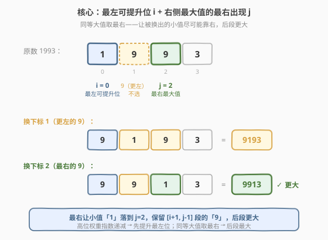
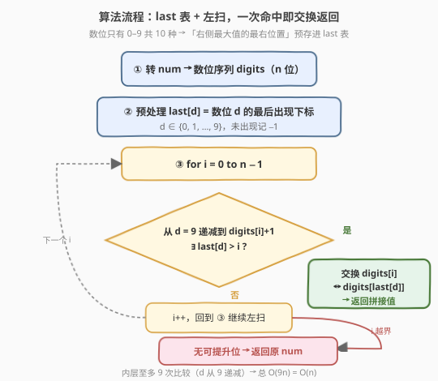
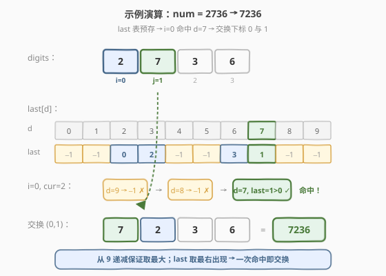

# LeetCode 最大交换 题解

## 1. 题目概述

- **标题 / 题号**：最大交换（#670，medium）
- **链接**：https://leetcode.cn/problems/maximum-swap/
- **难度**：中等
- **标签**：贪心、数组、数学

**题意**：给定一个非负整数 `num`，你**最多**可以交换其中的两个数字（数位）一次，使得交换后得到的数字最大。返回能得到的最大值。

**示例 1**：

```text
输入：num = 2736
输出：7236
解释：交换数字 2 与数字 7，得到 7236。
```

**示例 2**：

```text
输入：num = 9973
输出：9973
解释：无需交换，已是最大值。
```

**约束**：

- `0 <= num <= 10^8`

> 💡 这是 [面试经典 150 题](https://leetcode.cn/studyplan/top-interview-150/) 中的贪心招牌题。题面虽小，却藏着两个关键细节：**「交换最左的可提升位」**与**「同等大值取最右」**。它与 [556. 下一个更大元素 III](https://leetcode.cn/problems/next-greater-element-iii/) 是一对——前者求「最大排列」，后者求「下一个更大排列」，二者都靠「定位交换位 + 后段处理」的骨架，但贪心方向相反。

## 2. 解题思路

### 2.1 暴力思路：枚举所有数位对交换

把 `num` 转成数位序列 `digits`（长度 $n \le 9$，因为 `num ≤ 10^8`）。枚举所有下标对 $(i, j)$（$i < j$），交换后求值，取最大。

```text
best = num
for i in 0..n:
    for j in i+1..n:
        swap(digits, i, j)
        best = max(best, value(digits))
        swap(digits, i, j)   // 换回
return best
```

时间复杂度 $O(n^3)$（$n^2$ 个对，每对求值 $O(n)$）。$n \le 9$ 时约 $729$ 次操作，**能过**但浪费——完全没有利用「怎样交换才能最大」的结构。

> ⚠️ 暴力法的瓶颈在于「盲目尝试」。破局思路：想清楚**最优交换长什么样**——高位的权重远大于低位（十进制下第 $i$ 位权重是 $10^{n-1-i}$），所以应优先**提升最左边能被提升的位**。

### 2.2 核心观察：贪心——最左可提升位 + 右侧最大值的最右出现

**关键定义**：从左到右找到**第一个**位置 $i$，使得它右侧存在比 `digits[i]` **更大**的数位。在 $[i+1, n-1]$ 中选出**最大的**数位 $d$；若 $d$ 出现多次，取**最右**的那一个 $j$。交换 `digits[i]` 与 `digits[j]`，即为答案。



**为什么是「最左可提升位」？** 十进制高位权重指数级大于低位。把一个更大的数位放到尽可能左的位置，收益远超在低位做任何交换。所以**第一个能被提升的位**就是最优着力点——它左边的位都已是「右侧没有更大的」，无法再提升。

**为什么同等大值取「最右」？** 位置 $i$ 放进去的值是固定的（右侧的最大值 $d$），但「被换出去的 `digits[i]`」落在哪个位置会影响后段。把 `digits[i]`（一个比 $d$ 小的值）丢到**尽可能靠右**的位置，能让 $[i+1, j-1]$ 这一段保持原样（其中可能还有其他 $d$），后段更大。例：`1993` 的最左可提升位是 $i=0$（值 `1`），右侧最大值 `9` 出现在下标 `1` 和 `2`。换下标 `1` 得 `9193`，换下标 `2`（最右）得 `9913`——后者更大。

> 💡 **与下一个更大元素的区别**：[556. 下一个更大元素 III](https://leetcode.cn/problems/next-greater-element-iii/) 是找「**仅大于**原数的排列」，需要从右向左找第一个升位、再在右侧找**仅大于**它的最小值，换完后还要把后段**升序排序**（变成最小排列）。本题是找「**最大**排列」，方向相反：从左找可提升位、取右侧**最大**值、换完即停——所以本题不需要排序后段。

### 2.3 算法流程图



**用「数位最后出现位置」表实现 $O(n)$**：数位只有 `0..9` 共 10 种。预处理 `last[d]` = 数位 $d$ 最后一次出现的下标。然后对每个位置 $i$，从 $d=9$ **递减**到 `digits[i]+1`：若 `last[d] > i`，说明右侧存在比当前位更大的 $d$，直接交换 `i` 与 `last[d]` 并返回。

**完整步骤**：

1. **转数位**：`num` 转成数位序列 `digits`（长度 $n$）
2. **预处理 last 表**：`last[d]` = 数位 $d$ 的最后出现下标（$d \in 0..9$）
3. **左扫找交换位**：对 $i$ 从 $0$ 到 $n-1$：
   - 从 $d=9$ **递减**到 `digits[i] + 1`：
     - 若 `last[d] > i`：交换 `digits[i]` 与 `digits[last[d]]`，立即返回拼接结果
4. **无需交换**：返回原 `num`

> ⚠️ **从 9 递减**保证取到右侧「最大」的数位；**`last[d] > i`** 保证它在 $i$ 右侧；用 `last`（最后出现）而非首次出现，天然实现「同等大值取最右」——三个条件一次满足。

### 2.4 示例演算

以 `num = 2736` 为例，`digits = [2, 7, 3, 6]`：



| 步骤 | i | digits[i] | d 从 9 递减 | last[d] > i? | 动作 |
|------|---|-----------|------------|--------------|------|
| 1 | 0 | 2 | 9,8 → 无 | last[9]=last[8]=−1 | 继续递减 |
| 2 | 0 | 2 | 7 | last[7]=1 > 0 ✓ | 交换下标 0 与 1，得 `[7,2,3,6]` |
| 3 | — | — | — | — | 返回 `7236` |

再以 `num = 9973` 为例，`digits = [9,9,7,3]`，`last[9]=1, last[7]=2, last[3]=3`：

| 步骤 | i | digits[i] | d 从 9 递减 | last[d] > i? | 动作 |
|------|---|-----------|------------|--------------|------|
| 1 | 0 | 9 | 9..10 → 无 | digits[i]=9 已是最大 | i++ |
| 2 | 1 | 9 | 9..10 → 无 | last[9]=1 不 > 1 | i++ |
| 3 | 2 | 7 | 9,8 → 无 | last[9]=1<2, last[8]=−1 | i++ |
| 4 | 3 | 3 | 9..4 → 无 | 全部 last < 3 | 结束 |
| 5 | — | — | — | — | 返回原值 `9973` |

> 💡 `9973` 的每个位右侧都没有更大的数位，所以无需交换——这正是「最左可提升位」找不到的情形，贪心自然返回原值。

## 3. 参考代码

### C++

```cpp
// 最大交换.cpp —— 贪心 + 数位最后出现位置表
// 编译: g++ -O2 -std=c++17 最大交换.cpp -o maxswap
#include <string>
using namespace std;

class Solution {
  public:
    int maximumSwap(int num) {
        string s = to_string(num);
        int n = s.size();

        // ① last[d] = 数位 d 的最后出现下标
        int last[10] = {0};
        for (int i = 0; i < n; ++i) {
            last[s[i] - '0'] = i;
        }

        // ② 左扫找最左可提升位
        for (int i = 0; i < n; ++i) {
            int cur = s[i] - '0';
            // 从 9 递减到 cur+1，找右侧最大的可换数位
            for (int d = 9; d > cur; --d) {
                if (last[d] > i) {                 // 右侧存在更大的 d
                    swap(s[i], s[last[d]]);        // 交换后立即返回
                    return stoi(s);
                }
            }
        }
        // ③ 无可提升位
        return num;
    }
};
```

### Python

```python
class Solution:
    def maximumSwap(self, num: int) -> int:
        s = list(str(num))
        n = len(s)

        # ① last[d] = 数位 d 的最后出现下标
        last = {int(d): i for i, d in enumerate(s)}

        # ② 左扫找最左可提升位
        for i in range(n):
            cur = int(s[i])
            # 从 9 递减到 cur+1，找右侧最大的可换数位
            for d in range(9, cur, -1):
                if last.get(d, -1) > i:            # 右侧存在更大的 d
                    j = last[d]
                    s[i], s[j] = s[j], s[i]        # 交换后立即返回
                    return int("".join(s))
        # ③ 无可提升位
        return num
```

> 💡 **细节**：`last` 用「最后出现」而非首次出现，是「同等大值取最右」的关键——一次预处理就把择优规则内置进去。C++ 用数组 `int last[10]`，未出现的数位 `last[d]` 默认为 `0`，但 `last[d] > i` 的判断中 `i` 从 `0` 起，故 `last[d]=0` 只在 `i=0` 时可能误判；为此初始化为 `0` 后，对未出现的数位 `last[d]=0`，当 `i=0` 时 `0 > 0` 为假，安全。Python 用 `dict.get(d, -1)` 更直观。

## 4. 复杂度分析

| 维度 | 复杂度 | 说明 |
|------|--------|------|
| **时间复杂度** | $O(n)$ | 预处理 `last` 表 $O(n)$ + 左扫 $n$ 位 × 内层至多 9 次比较 = $O(9n) = O(n)$ |
| **空间复杂度** | $O(n)$ | 数位序列 `s`；`last` 表固定 $O(10) = O(1)$ |

> ⚠️ $n \le 9$（`num ≤ 10^8`），所以任何 $O(n^2)$ 解法都能过。但 $O(n)$ 的 `last` 表解法把「右侧最大值的最右位置」三个条件一次预处理，是面试中最能体现「数位只有 0–9 共 10 种」这一常数特性被利用的优雅写法。

## 5. 扩展：$O(n^2)$ 直观解法与暴力对比

不用 `last` 表，直接对每个位置 $i$ 在 $[i+1, n-1]$ 中**线性扫一遍**找最大值（同等大值取最右）也能过：

```python
class Solution:
    def maximumSwap(self, num: int) -> int:
        s = list(str(num))
        n = len(s)
        for i in range(n):
            # 在 [i+1, n-1] 中找最大值，同等取最右
            j = i
            for k in range(i + 1, n):
                if s[k] >= s[j]:   # >= 保证同等大值取最右
                    j = k
            if j != i and s[j] > s[i]:
                s[i], s[j] = s[j], s[i]
                return int("".join(s))
        return num
```

时间 $O(n^2)$，空间 $O(n)$。`>=` 而非 `>` 是「同等大值取最右」的体现——遇到相等也更新 $j$，最终 $j$ 落在最大值的最右出现。

| 解法 | 时间 | 空间 | 思路 |
|------|------|------|------|
| 暴力枚举对 | $O(n^3)$ | $O(n)$ | 枚举所有 $(i,j)$ 交换求值取最大 |
| 线性扫最大值 | $O(n^2)$ | $O(n)$ | 最左可提升位 + 右侧线性找最大（取最右） |
| **last 表** | $O(n)$ | $O(n)$ | 数位只有 10 种，预处理最后出现位置 |

> 💡 **面试建议**：先讲贪心思路（最左可提升位 + 右侧最大取最右），写出 $O(n^2)$ 线性扫版本；再点出「数位只有 0–9」优化为 `last` 表 $O(n)$。这条「$O(n^3) \to O(n^2) \to O(n)$」的渐进优化，比直接写 `last` 表更能体现思维过程。

## 6. 面试要点

1. **为什么交换「最左可提升位」而非任意位？**

   - 十进制高位权重是 $10^{n-1-i}$，指数级递减。提升最左位的收益远超任何低位交换。
   - 最左可提升位以左的各位，其右侧都没有更大的数位，已经无法提升——所以第一个「右侧有更大值」的位就是最优着力点。

2. **为什么同等大值取「最右」出现？**

   - 位置 $i$ 放入的值固定为右侧最大值 $d$。被换出去的 `digits[i]`（比 $d$ 小）落点越靠右，$[i+1, j-1]$ 这段保持原状（含其他 $d$）的范围越大，后段越大。
   - 例：`1993` 换最右的 `9`（下标 2）得 `9913`，换下标 1 的 `9` 只得 `9193`。

3. **`last` 表为什么是 $O(n)$ 而非 $O(n^2)$？**

   - 内层循环看似嵌套，但 $d$ 只从 9 递减，至多 9 次比较——常数。外层 $n$ 位，总 $O(9n) = O(n)$。
   - 关键是「数位只有 0–9 共 10 种」这一常数特性，让「找右侧最大值」从线性扫描降为常数次查表。

4. **与 556. 下一个更大元素 III 有何异同？**

   - 同：都是「定位交换位 + 在右侧找目标数位 + 交换」的骨架，都在数位序列上操作。
   - 异：本题求「最大排列」——从左找可提升位、取右侧**最大**值、换完即停；556 求「**仅大于**原数的排列」——从右找第一个升位、取右侧**仅大于它的最小**值、换完还要把后段**升序排序**（变最小排列）。贪心方向相反。

5. **`num = 0` 或已最大时怎么处理？**

   - `num = 0`：`digits = ['0']`，长度 1，左扫无右侧，返回 `0`，正确。
   - 已最大（如 `9973`）：每个位右侧无更大值，`last[d] > i` 永不命中，返回原值，正确。无需特判——贪心的「找不到可提升位」自然兜底。

> 💡 **一句话总结**：最大交换是「数位贪心」的招牌题——抓住「高位权重指数级递减」定位最左可提升位，再用「数位只有 0–9」把「右侧最大值的最右位置」预存进 `last` 表，一次扫描 $O(n)$ 完成。它与 [556. 下一个更大元素 III](https://leetcode.cn/problems/next-greater-element-iii/) 同骨架异方向：一个求最大排列（取最大、换完即停），一个求下一个更大排列（取仅大于、换完排序后段）。

## 同类练习题

| # | 题目 | 与本题的关联 |
|---|------|-------------|
| 556 | [下一个更大元素 III](https://leetcode.cn/problems/next-greater-element-iii/) | 同骨架异方向，求「仅大于原数的排列」，需排序后段 |
| 31 | [下一个排列](https://leetcode.cn/problems/next-permutation/) | 下一个排列的数组版，定位升位 + 找仅大于 + 反转后段 |
| 739 | [每日温度](../0701-0800/739_每日温度.md) | 「找右侧下一个更大」的单调栈母题，对比本题「找右侧最大值」的贪心 |
| 9 | [回文数](../0001-0100/9_回文数.md) | 数位序列操作的基础题，反向取数位 |
