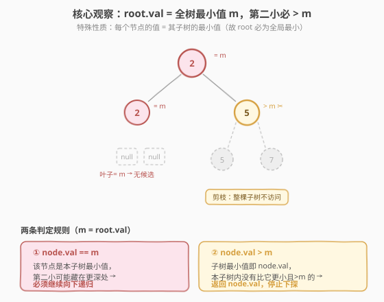
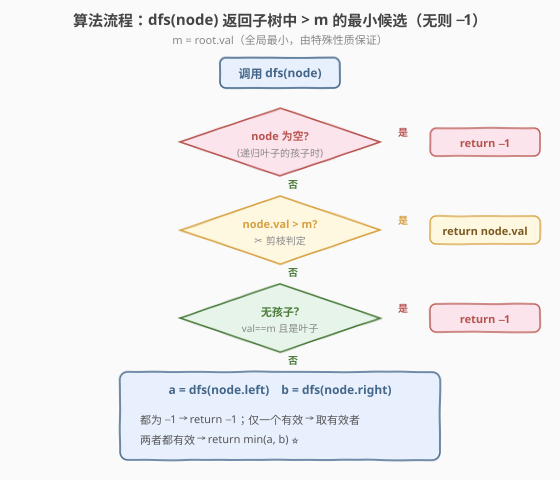
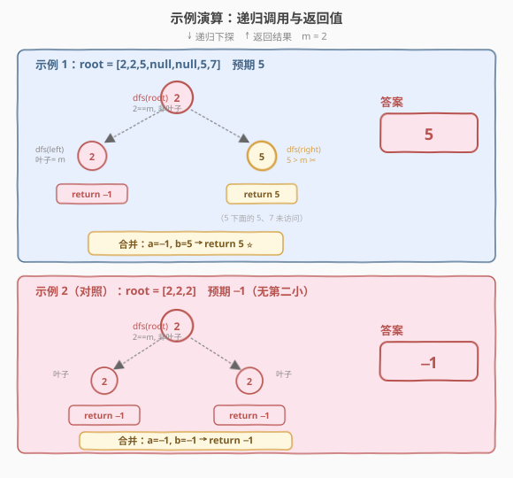

# LeetCode 二叉树中第二小的节点 题解

## 1. 题目概述

- **标题 / 题号**：二叉树中第二小的节点（#671，medium）
- **链接**：https://leetcode.cn/problems/second-minimum-node-in-a-binary-tree/
- **难度**：中等
- **标签**：树、二叉树、DFS、递归

**题意**：给定一棵**非空特殊二叉树**，节点值均为非负整数。这棵树有两个特殊性质：

1. **每个节点要么没有孩子，要么恰好有两个孩子**（即「满二叉树 / full binary tree」性质，不存在只有单孩子的节点）；
2. **每个节点的值等于其子树中所有节点值的最小值**（即 `node.val = min(子树所有值)`）。

由此立刻推得：**根节点的值就是全树的最小值**。请返回这棵树中**第二小的值**——即严格大于全树最小值的那些值里最小的一个。若所有节点值都相同（不存在第二小），返回 `−1`。

**示例 1**：

```text
输入：root = [2,2,5,null,null,5,7]
输出：5
解释：全树最小值 m = 2（根）。严格大于 2 的值有 {5, 5, 7}，其中最小的是 5。
```

**示例 2**：

```text
输入：root = [2,2,2]
输出：-1
解释：全树所有值都是 2，没有严格大于 m 的值，返回 -1。
```

**约束**：

- 树中节点数目范围 `[1, 25]`
- `1 <= Node.val <= 25`
- 每个节点的值等于其子树的最小值（题目给出的特殊保证）

> 💡 本题的题眼在于「**特殊性质 2**」：`node.val = 子树最小值`。它意味着根是全局最小、且每个非叶节点的值至少等于其某个孩子的值。若不利用这条性质，暴力遍历虽能 AC（数据只有 25 个节点），但体会不到这题作为「**利用树性质剪枝**」教学题的精髓。

## 2. 解题思路

### 2.1 暴力思路：遍历收集 + 集合去重

最直接的做法：DFS/BFS 把所有节点值塞进一个集合（去重），再排序取**严格大于最小值**的下一个。数据规模只有 25，完全可行。

```python
vals = set()
def dfs(n):
    if not n: return
    vals.add(n.val)
    dfs(n.left); dfs(n.right)
dfs(root)
mn = min(vals)
ans = min((v for v in vals if v > mn), default=-1)
```

问题：**它完全无视了题目的特殊性质**——每个节点都无条件访问，空间 $O(n)$ 开了一个额外集合。当节点规模放大到 $10^5$ 时虽仍是 $O(n)$，但失去了「**靠性质剪掉整棵子树**」的机会，体现不出本题的设计意图。

> ⚠️ 暴力法把题目当成「普通二叉树求第二小」来做，丢弃了性质 2 这条最强的线索。正确姿势是：**让特殊性质替我们决定要不要往下走**。

### 2.2 核心观察：根即全局最小，遇更大值即剪枝



记 $m = \text{root.val}$，由性质 2，$m$ 就是**全树最小值**。所求「第二小」必须满足**严格大于 $m$**。于是关键观察是：

> 💡 对于任意节点 $x$，**若 $x.\text{val} > m$**，则 $x$ 的整棵子树里**不可能存在比 $x.\text{val}$ 更小且仍 $> m$ 的值**——因为性质 2 告诉我们 $x.\text{val}$ 已经是这棵子树的最小值。所以 $x.\text{val}$ 本身就是「该子树对全局第二小的最佳贡献」，**直接返回 $x.\text{val}$ 并停止下探**。

反之，**若 $x.\text{val} = = m$**，则 $x$ 是「子树最小值的承载者」，第二小可能藏在它的某个孩子里，**必须继续递归**。

把这两条规则合起来就得到剪枝策略：

| 情况 | 处理 | 原因 |
|------|------|------|
| $x.\text{val} > m$ | 返回 $x.\text{val}$，**剪枝** | $x.\text{val}$ 是本子树最小值，本子树无更优候选 |
| $x.\text{val} == m$ 且 $x$ 是叶子 | 返回 $−1$ | 叶子无孩子，本子树除 $m$ 外无其它值 |
| $x.\text{val} == m$ 且 $x$ 有孩子 | 递归左右孩子后合并 | 第二小可能藏在更深处的某个 $> m$ 节点 |

> ⚠️ 「**有孩子**」在本题等价于「**有两个孩子**」——性质 1 保证了不存在单孩子节点，所以递归时不必判断「只有左 / 只有右」，直接 `dfs(left)` + `dfs(right)` 即可。这是性质 1 的隐性收益。

### 2.3 算法流程图



**合并两个孩子返回值 $a, b$ 的规则**（三者取一）：

- 若 $a = -1$ 且 $b = -1$：本子树无候选 → 返回 $-1$；
- 若仅一方为 $-1$：返回另一方（唯一候选）；
- 若两者都有效：返回 $\min(a, b)$（取更小者作为本子树最佳候选）。

### 2.4 示例演算

以 `root = [2,2,5,null,null,5,7]`（$m = 2$）为主例，对照 `root = [2,2,2]`（全同值）：



| 调用 | 节点值 | 判定 | 动作 | 返回 |
|------|--------|------|------|------|
| `dfs(root)` | 2 | $== m$，有孩子 | 递归左右后合并 | $\min(\text{左}, \text{右}) = \min(-1, 5) = 5$ |
| `dfs(root.left)` | 2 | $== m$，叶子 | 无候选 | $-1$ |
| `dfs(root.right)` | 5 | $> m$ ✂ | **剪枝**，直接返回 | $5$ |
| ——（`root.right` 的孩子 5、7） | —— | —— | **未访问** | —— |

> 💡 关键看 `dfs(root.right)`：节点 5 一旦命中 `val > m`，它下面还挂着的 5 和 7 **根本不会被访问**——因为性质 2 保证了 5 已是那棵子树的最小值，再往下找不可能找到比 5 更优（$> m$ 且更小）的候选。这正是剪枝的威力。

对照示例 2：`root = [2,2,2]`，三个节点都等于 $m$，左右孩子都是叶子 → 各返回 $-1$，合并得 $-1$，正确。

## 3. 参考代码

### C++

```cpp
// 二叉树中第二小的节点.cpp —— 利用「根即最小」性质剪枝 DFS
// 编译: g++ -O2 -std=c++17 二叉树中第二小的节点.cpp -o secondmin
#include <algorithm>
#include <climits>
using namespace std;

struct TreeNode {
    int val;
    TreeNode* left;
    TreeNode* right;
    TreeNode() : val(0), left(nullptr), right(nullptr) {
    }
    TreeNode(int x) : val(x), left(nullptr), right(nullptr) {
    }
    TreeNode(int x, TreeNode* l, TreeNode* r) : val(x), left(l), right(r) {
    }
};

class Solution {
  public:
    int findSecondMinimumValue(TreeNode* root) {
        if (root == nullptr) return -1;
        return dfs(root, root->val);   // m = root->val（全局最小）
    }

  private:
    // 返回以 node 为根的子树中「严格大于 m 的最小值」，不存在则返回 -1
    int dfs(TreeNode* node, int m) {
        if (node == nullptr) return -1;
        // 性质 2：node->val 是本子树最小值。
        // 若已 > m，则本子树无更优候选，直接返回 node->val（剪枝）
        if (node->val > m) return node->val;
        // node->val == m：若为叶子，本子树除 m 外无其它值
        if (node->left == nullptr) return -1;   // 性质1：无孩子==有两个孩子，判一侧即可
        // 有两个孩子：递归取两侧候选，合并
        int a = dfs(node->left, m);
        int b = dfs(node->right, m);
        if (a == -1) return b;          // b 可能为 -1，正好表示「都无候选」
        if (b == -1) return a;
        return min(a, b);
    }
};
```

### Python

```python
class Solution:
    def findSecondMinimumValue(self, root: Optional[TreeNode]) -> int:
        if not root:
            return -1
        m = root.val                     # 全局最小（由性质 2 保证）

        def dfs(node: Optional[TreeNode]) -> int:
            if not node:
                return -1
            # 命中更大值：本子树最小值即 node.val，剪枝返回
            if node.val > m:
                return node.val
            # node.val == m 且为叶子：无候选
            if not node.left:            # 性质1：无孩子==两孩子都在，判一侧即可
                return -1
            a = dfs(node.left)
            b = dfs(node.right)
            if a == -1:
                return b                 # b 若也 -1 则自然返回 -1
            if b == -1:
                return a
            return min(a, b)

        return dfs(root)
```

> 💡 两个细节：(1) `m` 作为外层闭包变量（Python）或参数（C++）传入 `dfs`，避免重复访问 `root`；(2) 判叶子只看 `node->left`——因为性质 1 保证「有左必有右」，单侧判空就够，比 `!left && !right` 更简洁且语义等价。

## 4. 复杂度分析

| 维度 | 复杂度 | 说明 |
|------|--------|------|
| 时间复杂度 | $O(n)$ 最坏 / 平均更优 | 最坏情况（全树值都等于 $m$，如示例 2）需访问所有节点；一旦遇到 $> m$ 的节点立即剪枝，平均访问数远小于 $n$ |
| 空间复杂度 | $O(h)$ | 递归栈深度 = 树高 $h$；最坏链状 $O(n)$，平衡 $O(\log n)$。性质 1（满二叉树）让 $h \le \log_2 n + 1$，实际栈深对数级 |

> ⚠️ 剪枝**不改变最坏复杂度**——构造「根一路传 $m$、直到最后一个叶子才出现 $> m$」的用例仍会访问 $n$ 个节点。它的价值在**平均大幅减少访问**：示例 1 中 7 个节点只访问了 3 个。题目数据规模虽小（$n \le 25$），但此剪枝思想可平移到 $n = 10^5$ 量级的同类问题。

## 5. 扩展：暴力法作为对照基准

暴力法虽然没用特殊性质，但作为「**保底正确解**」值得了解，面试时可先写暴力再优化：

```python
class Solution:
    def findSecondMinimumValue(self, root: Optional[TreeNode]) -> int:
        vals = set()
        def dfs(n):
            if not n: return
            vals.add(n.val)
            dfs(n.left)
            dfs(n.right)
        dfs(root)
        vals.discard(min(vals))          # 去掉最小值
        return min(vals) if vals else -1
```

> 💡 注意 `set.discard(min(vals))` 只删**一个**最小值实例（集合里本就只存一个），等价于「在去重后值域里去掉 $m$」。若题目改成「第二小允许并列」（即第二大、不要求严格大于），则需用排序数组而非集合，逻辑会不同——这正是 671 要求「**严格大于**」的细节坑点。

**两种解法对比**：

| 维度 | 暴力收集法 | 性质剪枝法 |
|------|-----------|-----------|
| 时间 | $O(n)$（恒定访问全部） | $O(n)$ 最坏，平均更优 |
| 空间 | $O(n)$（额外集合） | $O(h)$（仅递归栈） |
| 利用性质 | 否 | 是（性质 1 + 2 全用上） |
| 可扩展性 | 数据放大仍 $O(n)$ 空间 | 放大后剪枝收益显著 |
| 面试定位 | 保底正确解 | 主推最优解 |

## 6. 面试要点

1. **题目里的「特殊性质」分别用在哪？**

   - **性质 2**（`node.val = 子树最小值`）是核心：它保证根是全局最小 $m$，并支撑「`val > m` 即剪枝」的判定——因为该节点的整棵子树最小值就是 `val`，不可能藏更优候选。
   - **性质 1**（满二叉树，0 或 2 孩子）是辅助：它让判叶子只需看单侧（`!node->left` 等价于「两孩子都空」），且递归合并时不必处理「只有左 / 只有右」的第三种分支，代码更简洁。

2. **为什么遇到 `val > m` 的节点可以直接返回，不必再递归它的孩子？**

   - 性质 2 保证该节点的值是**它整棵子树的最小值**。既然它已经 $> m$，子树里所有值都 $\ge$ 它的值 $\ge$ 当前候选，不可能再冒出「比它更小且仍 $> m$」的值。所以该节点值就是这棵子树对全局第二小的最佳贡献，继续递归只会得到 $\ge$ 它的结果，纯属浪费。

3. **最坏情况下剪枝法还比暴力快吗？**

   - 不一定。最坏用例是「全树值都等于 $m$」（如示例 2 的 `[2,2,2]` 推广到 $n$ 节点），此时没有任何节点命中 `val > m`，剪枝法要访问全部 $n$ 个节点，时间仍是 $O(n)$，且比暴力还多一层递归合并开销。剪枝的价值在**平均情形**与**空间**（不额外开集合）。

4. **合并两个孩子返回值时，为什么 `if a == -1: return b` 一行就能处理两种情况？**

   - 当 $a = -1$：若 $b$ 也 $= -1$，返回 $-1$（都无候选）；若 $b$ 有效，返回 $b$（唯一候选）。利用 $-1$ 作为「无效哨兵」的穿透性，省掉一个分支。下一行 `if b == -1: return a` 同理，处理 $a$ 有效而 $b$ 无效的情况；两者都有效才走 `min(a, b)`。

5. **如果题目改成「求第 $k$ 小」会怎样？**

   - 性质 2 的剪枝是**专门针对「第二小」**的——它依赖「根即最小」这个一阶信息。求第 $k$ 小时根只提供「最小」这一阶，更高阶候选无法靠单点 `val` 判定剪掉整棵子树，需要更复杂的多路归并或堆。这解释了为何 671 题面特意限定「第二小」——它是性质 2 能精确刻画的边界。

> 💡 **一句话总结**：671 的精髓是「**让树的自性质替你决定走不走**」。根即最小给出了基准 $m$，每个节点拿自己的 `val` 和 $m$ 比一下：相等就继续探、更大就剪枝返回。两行判定把暴力 $O(n)$ 空间压到 $O(h)$，平均访问数也大幅下降——这是「利用输入特殊结构」做剪枝的经典小课。

## 同类练习题

| # | 题目 | 与本题的关联 |
|---|------|-------------|
| 104 | [二叉树的最大深度](https://leetcode.cn/problems/maximum-depth-of-binary-tree/)（[题解](../0101-0200/104_二叉树的最大深度.md)） | DFS 后序合并左右子树结果的基础模板，本题递归骨架来源 |
| 530 | [二叉搜索树的最小绝对差](https://leetcode.cn/problems/minimum-absolute-difference-in-bst/)（[题解](../0501-0600/530_二叉搜索树的最小绝对差.md)） | 利用 BST「中序单调」性质做剪枝/优化，与本题「利用满二叉树性质剪枝」同属「靠树性质省工作」 |
| 230 | [二叉搜索树中第 K 小的元素](https://leetcode.cn/problems/kth-smallest-element-in-a-bst/) | BST 中序遍历提前终止，对照本题「DFS 命中即剪枝返回」的提前终止思想 |
| 111 | [二叉树的最小深度](https://leetcode.cn/problems/minimum-depth-of-binary-tree/) | DFS 合并左右子结果 + 叶子判定，结构与本题 `dfs` 高度相似，可作为练手 |
