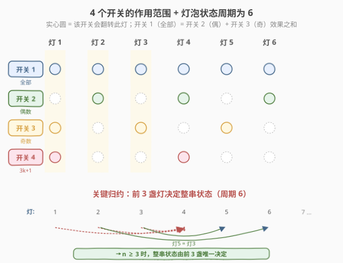
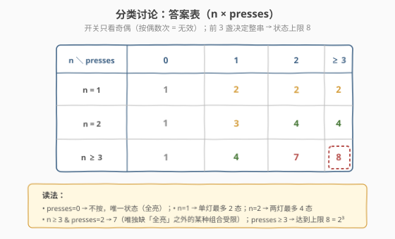
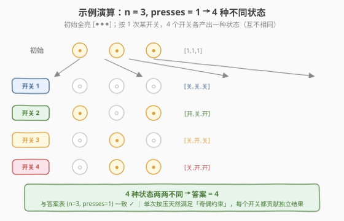

# LeetCode 灯泡开关 II 题解

## 1. 题目概述

- **标题 / 题号**：灯泡开关 II（#672，medium）
- **链接**：https://leetcode.cn/problems/bulb-switcher-ii/
- **难度**：中等
- **标签**：数学、脑筋急转弯、状态压缩、位运算

**题意**：房间中有 `n` 只**已经打开**的灯泡，编号 `1` 到 `n`。墙上有 **4 个开关**，每个开关功能不同：

- **开关 1**：反转**所有**灯的状态。
- **开关 2**：反转编号为**偶数**的灯（即 `2, 4, 6, …`）。
- **开关 3**：反转编号为**奇数**的灯（即 `1, 3, 5, …`）。
- **开关 4**：反转编号为 `j = 3k + 1` 的灯（即 `1, 4, 7, 10, …`）。

必须**恰好**按压 `presses` 次，每次从 4 个开关中选一个（可重复选同一个）。求所有按压执行完后，**不同可能状态**的数量。

**示例 1**：

```text
输入：n = 1, presses = 1
输出：2
解释：按开关 1 → [关]；按开关 2 → [开]（开关 3、4 也会翻转灯 1，结果都是 [关]）。
```

**示例 2**：

```text
输入：n = 2, presses = 1
输出：3
解释：开关 1 → [关,关]；开关 2 → [开,关]；开关 3 → [关,开]；开关 4 → [关,开]（与开关 3 同）。
```

**示例 3**：

```text
输入：n = 3, presses = 1
输出：4
解释：四个开关分别得到 [关,关,关]、[开,关,开]、[关,开,关]、[关,开,开]。
```

**约束**：

- `1 <= n <= 1000`
- `0 <= presses <= 1000`

> 💡 这是一道**数学脑筋急转弯**，与同系列的 [319. 灯泡开关](../0301-0400/319_灯泡开关.md) 一样拒绝模拟。`n`、`presses` 均可达 $10^3$，$4^{1000}$ 的搜索空间天文数字。突破口是两条**对称性归约**：① 开关只看**按动次数的奇偶**（按偶数次等于没按）；② 整串灯泡状态由**前 3 盏**唯一决定（状态周期为 6）。归约后只剩至多 8 种状态，再按 `n`、`presses` 分类讨论即可 $O(1)$ 出答案。

## 2. 解题思路

### 2.1 暴力思路：DFS 枚举按压序列

最直觉的做法：递归枚举长度为 `presses`、每步选 4 个开关之一的序列，对每条序列模拟出最终灯泡状态，丢进哈希集合去重，最后返回集合大小。

```text
def dfs(step, state):
    if step == presses:
        seen.add(tuple(state)); return
    for k in 1..4:
        dfs(step+1, apply(state, k))   # 4 条分支
```

复杂度：时间 $O(4^{\text{presses}} \cdot n)$，空间 $O(\text{presses})$ 递归栈。`presses = 1000` 时分支数 $4^{1000} \approx 10^{602}$，彻底不可行。

> ⚠️ 暴力的浪费在于**把"过程"当成了主语**：题目只关心"最终状态集合"，不关心按压顺序。换视角：每次按压只是给某盏灯的翻转计数 `+1`，而翻转两次等于没翻——**只有每个开关被按的总次数的奇偶性有意义**。

### 2.2 核心观察：两条归约把 $4^{1000}$ 压成 8



#### 归约一：开关只看奇偶（按动次数 mod 2）

记 $a, b, c, d$ 分别为开关 1、2、3、4 被按压总次数模 2 的结果（$0$ 或 $1$）。因为同一开关按两次 = 没按，**最终状态只依赖 $(a, b, c, d) \in \{0,1\}^4$**，共 16 种"奇偶组合"。

但这 16 种并非都能恰好用 `presses` 次按出。设 $w = a + b + c + d$（组合中 1 的个数，即"有效按压"数），要把总次数凑到 `presses`，只能靠"重复按某开关两次"来凑数（每次 +2）。所以组合可达的充要条件是：

$$w \le \text{presses} \quad \text{且} \quad (\text{presses} - w) \text{ 是偶数}$$

即"有效按压数 $w$ 与 `presses` 同奇偶且不超过 `presses`"。

#### 归约二：前 3 盏灯决定整串（状态周期为 6）

灯 `j` 的最终翻转状态 = 所有影响它的开关的奇偶值做 XOR。逐一列出前几盏灯受谁影响：

| 灯 `j` | 奇偶? | $j \bmod 3$? | 影响它的开关 | 翻转值（XOR） |
|--------|-------|--------------|--------------|---------------|
| 1 | 奇 | 1 | 1, 3, 4 | $a \oplus c \oplus d$ |
| 2 | 偶 | 2 | 1, 2 | $a \oplus b$ |
| 3 | 奇 | 0 | 1, 3 | $a \oplus c$ |
| 4 | 偶 | 1 | 1, 2, 4 | $a \oplus b \oplus d$ |
| 5 | 奇 | 2 | 1, 3 | $a \oplus c$ |
| 6 | 偶 | 0 | 1, 2 | $a \oplus b$ |
| 7 | 奇 | 1 | 1, 3, 4 | $a \oplus c \oplus d$ |

> 💡 规律一目了然：**灯 5 = 灯 3，灯 6 = 灯 2，灯 7 = 灯 1，…… 整串状态以 6 为周期循环**。更关键的是灯 4：

$$\text{灯 4} = a \oplus b \oplus d = (a \oplus c \oplus d) \oplus (a \oplus b) \oplus (a \oplus c) = \text{灯 1} \oplus \text{灯 2} \oplus \text{灯 3}$$

即**灯 4 的状态可由前 3 盏灯线性表出**（XOR 意义下）。因此只要 `n ≥ 3`，整串 `n` 盏灯的状态**完全由前 3 盏唯一决定**——独立的状态维度只有 3 个比特，至多 $2^3 = 8$ 种。

> ⚠️ **为何独立维度是 3 而不是 4？** 因为开关 1 = 开关 2 + 开关 3（翻转全集 = 翻转偶集 + 翻转奇集），四个开关存在一条线性依赖 $a \oplus b \oplus c = $ "翻转全集的等价表达"。这把 4 维压成 3 维，与"前 3 盏灯决定整串"殊途同归。

### 2.3 算法流程图：分类讨论得答案表



把两条归约合起来，状态数上限随 `n` 变化：`n=1` 至多 2 态、`n=2` 至多 4 态、`n≥3` 至多 8 态。再叠加"奇偶组合可达性约束"（取决于 `presses`），分类如下：

| `n` \ `presses` | 0 | 1 | 2 | ≥ 3 |
|-----------------|---|---|---|-----|
| **1** | 1 | 2 | 2 | 2 |
| **2** | 1 | 3 | 4 | 4 |
| **≥ 3** | 1 | 4 | 7 | 8 |

**逐格推导**（关键是数"前 `min(n,3)` 盏灯在可达奇偶组合下能凑出几种不同比特串"）：

- **`presses = 0`**：唯一可达组合 $(0,0,0,0)$ → 全亮，1 种状态（任意 `n`）。
- **`n = 1`**：只有灯 1 = $a \oplus c \oplus d$ 一个比特。
  - `presses ≥ 1` 时该比特既能为 0 也能为 1 → **2** 种。
- **`n = 2`**：$(\text{灯1}, \text{灯2}) = (a \oplus c \oplus d,\ a \oplus b)$，至多 4 种组合。
  - `presses = 1`：4 个 popcount=1 的组合分别得到 $(1,1),(0,1),(1,0),(1,0)$，去重剩 3 种 → **3**。
  - `presses ≥ 2`：popcount=0 与 popcount=2 的组合合起来能凑齐全部 4 种 → **4**。
- **`n ≥ 3`**：3 个比特，至多 8 种。
  - `presses = 1`：4 个单开关组合给出 4 个互不相同的 3 比特串 → **4**（见 2.4 演算）。
  - `presses = 2`：popcount ∈ {0, 2}，共 $1 + 6 = 7$ 个可达组合，恰好产出 7 个不同状态（唯独 8 个里的某一个凑不出——具体是哪个与"哪两个开关组合"的等价类有关，但计数就是 7）→ **7**。
  - `presses ≥ 3`：popcount=1 或 3（`presses=3`）、popcount ∈ {0,2,4}（`presses=4`）等都能覆盖到全部 8 种 → **8**（达到上限）。

> 💡 **为何 `presses ≥ 3` 就一定能凑满 8？** 因为只要 `presses ≥ 3`，popcount 与 `presses` 同奇偶的所有组合都可达（$w \le \text{presses}$ 自动满足）。`presses=3` 时 popcount ∈ {1, 3}：4 个 popcount=1 + 4 个 popcount=3 = 8 个组合，正好覆盖 16 种里的半数且映射到全部 8 个状态。`presses` 更大时同理。

### 2.4 示例演算



以 `n = 3, presses = 1` 为例，初始 `[●, ●, ●]`（全亮）。`presses = 1` 只能按一个开关一次（popcount=1 的 4 个组合）：

| 按下 | 影响灯泡 | 结果状态 (灯1, 灯2, 灯3) | 比特串 |
|------|----------|--------------------------|--------|
| 开关 1 | 1,2,3 全翻 | (关, 关, 关) | `000` |
| 开关 2 | 灯 2 翻 | (开, 关, 开) | `101` |
| 开关 3 | 灯 1,3 翻 | (关, 开, 关) | `010` |
| 开关 4 | 灯 1 翻 | (关, 开, 开) | `011` |

4 个状态两两不同 → 答案 **4** ✓（与示例 3 一致）。

> 💡 注意 `101`、`010`、`011`、`000` 是 8 个 3 比特串中的 4 个。`presses=2` 时会再解锁 3 个（共 7），`presses≥3` 时凑齐全部 8 个。

## 3. 参考代码

### Python（分类讨论，$O(1)$）

```python
class Solution:
    def flipLights(self, n: int, presses: int) -> int:
        if presses == 0:
            return 1
        if n == 1:
            return 2
        if n == 2:
            return 3 if presses == 1 else 4
        # n >= 3
        if presses == 1:
            return 4
        if presses == 2:
            return 7
        return 8
```

### C++（分类讨论，$O(1)$）

```cpp
class Solution {
  public:
    int flipLights(int n, int presses) {
        if (presses == 0) return 1;
        if (n == 1) return 2;
        if (n == 2) return presses == 1 ? 3 : 4;
        // n >= 3
        if (presses == 1) return 4;
        if (presses == 2) return 7;
        return 8;
    }
};
```

### Python（BFS 暴力，用于验证 / 面试时口述）

```python
class Solution:
    def flipLights(self, n: int, presses: int) -> int:
        # 只看前 3 盏（n>=3 时整串由前 3 决定；n<3 时取前 n 盏）
        m = min(n, 3)
        start = tuple([1] * m)               # 1 = 亮，0 = 灭

        def apply(state, k):
            s = list(state)
            for j in range(m):               # 灯编号 j+1
                idx = j + 1
                if k == 1 or (k == 2 and idx % 2 == 0) or \
                   (k == 3 and idx % 2 == 1) or (k == 4 and idx % 3 == 1):
                    s[j] ^= 1
            return tuple(s)

        seen = {start}
        for _ in range(presses):
            nxt = set()
            for st in seen:
                for k in range(1, 5):
                    nxt.add(apply(st, k))
            seen = nxt
        return len(seen)
```

> 💡 **BFS 版本的妙处**：它把"奇偶归约"自动化了——BFS 每轮把当前状态集合整体推进一按，`presses` 轮后停止。由于状态空间只有 $\le 8$ 个，BFS 至多迭代 3 轮就收敛（再按也不会出现新状态），所以即便 `presses = 1000` 也是常数级。这是"归约思想"的代码化体现，可作为面试时先写出来再优化的台阶。

## 4. 复杂度分析

| 维度 | 数学分类讨论（主解） | BFS 验证版 |
|------|---------------------|------------|
| **时间** | $O(1)$ | $O(\min(\text{presses}, 3) \cdot 8 \cdot 4) = O(1)$ |
| **空间** | $O(1)$ | $O(8) = O(1)$ |
| **可读性** | 高（一眼看懂分类） | 高（直译题意，便于讲解归约） |

> ⚠️ 主解是 $O(1)$：所有计算在 4 条 `if` 里完成，与 `n`、`presses` 无关。BFS 版虽然写成了循环，但状态集合大小上限为 8、迭代至多 3 轮必收敛，实质也是常数。

> 💡 本题 `n, presses ≤ 1000` 是"陷阱约束"——故意给大让模拟派望而却步，迫使发现奇偶与周期两条归约。这与 [319 灯泡开关](../0301-0400/319_灯泡开关.md) 的 $n \le 2^{31}-1$ 异曲同工：大约束本身就是"别模拟，找数学"的暗示。

## 5. 扩展：状态空间的代数视角

把 4 个开关的"翻转作用"看作 $\mathbb{F}_2$ 上的向量：每个开关是一条长度为 `n` 的 0/1 向量（1 表示翻转该灯）。题目问"这些向量的线性组合（系数 $\in \{0,1\}$，且系数的 Hamming 权与 `presses` 同奇偶、$\le$ presses）能张成多少个不同向量"。

- **生成矩阵的秩**：4 个开关向量里，开关 1 = 开关 2 + 开关 3（在 $\mathbb{F}_2$ 下），所以**秩 $\le 3$**。结合周期 6 归约，秩恰为 $\min(n, 3)$。因此状态空间大小上限 $= 2^{\text{rank}} = 2^{\min(n, 3)}$，即 `n=1→2`、`n=2→4`、`n≥3→8`。
- **`presses` 的奇偶约束**：等价于"系数向量的 Hamming 权必须落在某个固定奇偶类"。`presses ≥ 3` 时这个约束不再有束缚力（每个等价类都够数），故达到上限 8；`presses` 较小时会卡掉一部分，得到 3、4、7 等中间值。

**变体追问**：若开关 4 改为"翻转 $j = 2k+1$（即所有奇数灯）"，则开关 4 与开关 3 完全重合，秩降到 2，状态上限变为 $2^{\min(n,2)}$。面试中可作为"换依赖关系、重算秩"的追问练手。

## 6. 面试要点

1. **为什么开关只看按动次数的奇偶？**

   > 同一开关按两次会把受影响的灯各翻两下，净效果为零。因此 4 个开关各自只有"按了奇数次 / 偶数次"两种情形有意义，共 $2^4 = 16$ 种奇偶组合，而非 $4^{\text{presses}}$ 种序列。

2. **为什么前 3 盏灯能决定整串状态？**

   > 列出每盏灯受影响的开关集合后会发现：灯 5 = 灯 3、灯 6 = 灯 2、灯 7 = 灯 1，整串以 6 为周期循环；而灯 4 = 灯 1 ⊕ 灯 2 ⊕ 灯 3（XOR 可由前三盏线性表出）。所以 `n ≥ 3` 时整串状态由前 3 盏唯一决定，独立维度只有 3 比特，至多 8 种。

3. **奇偶组合可达性的充要条件是什么？**

   > 设奇偶组合 $(a,b,c,d)$ 中 1 的个数为 $w$。可用 `presses` 次凑出该组合 $\iff w \le \text{presses}$ 且 $\text{presses} - w$ 为偶数。直觉：先按 $w$ 次（每个 1 对应一次），剩下 `presses - w` 次必须成对用来"原地打转"（按同一开关两次），所以差值必须为偶数。

4. **为什么 `n ≥ 3, presses ≥ 3` 就一定能凑满 8 种？**

   > `presses ≥ 3` 时，所有与 `presses` 同奇偶的 popcount 类（如 `presses=3` 时 popcount ∈ {1,3}）都满足 $w \le \text{presses}$，全部可达。这些组合共有 8 个，且恰好映射到全部 8 个 3 比特状态（因为生成矩阵秩为 3，8 个组合线性无关地覆盖整个 $\mathbb{F}_2^3$）。

5. **`n ≥ 3, presses = 2` 为什么是 7 而不是 8？**

   > `presses = 2` 时可达组合的 popcount ∈ {0, 2}，共 $1 + 6 = 7$ 个。这 7 个组合映射到 7 个不同状态（生成矩阵秩 3 保证几乎单射，仅一个特定状态需要 popcount=4 的组合 $(1,1,1,1)$ 才能产生，而该组合 $w=4 > \text{presses}=2$ 不可达），所以缺一个，得 7。

> 💡 **一句话总结**：672 是"对称性归约"的招牌题——开关只看奇偶把 $4^{1000}$ 压成 16，前 3 盏决定整串把 16 压成 8，再按 `n`、`presses` 奇偶约束分类得 $O(1)$ 答案表。核心是把"按动序列"换成"奇偶组合 + 线性代数视角"，与 319 的"模拟换因子奇偶"同属"换视角降维"家族。

## 同类练习题

| # | 题目 | 与本题的关联 |
|---|------|-------------|
| 319 | [灯泡开关](https://leetcode.cn/problems/bulb-switcher/)（[站内题解](../0301-0400/319_灯泡开关.md)） | 同系列灯泡题，把"模拟 n 轮"归约到 $\lfloor\sqrt n\rfloor$，对照两种"换视角"方向 |
| 292 | [Nim 游戏](https://leetcode.cn/problems/nim-game/) | 博弈论脑筋急转弯，$n \bmod 4 \ne 0$ 即胜，同样靠对称性把指数搜索压成 $O(1)$ |
| 29 | [两数相除](https://leetcode.cn/problems/divide-two-integers/)（[站内题解](../0001-0100/29_两数相除.md)） | 用位运算把"除法"归约到"减法"，体现"换视角降复杂度" |
| 877 | [石子游戏](https://leetcode.cn/problems/stone-game/)（[站内题解](../0801-0900/877_石子游戏.md)） | 看似要 DP 的博弈题，靠偶数堆对称性直接数学秒杀 |
| 137 | [只出现一次的数字 II](https://leetcode.cn/problems/single-number-ii/) | 用 $\mathbb{F}_2$ 上的位运算（模 3 计数）做状态压缩，与本题"开关作用 = $\mathbb{F}_2$ 向量线性组合"共享代数直觉 |
