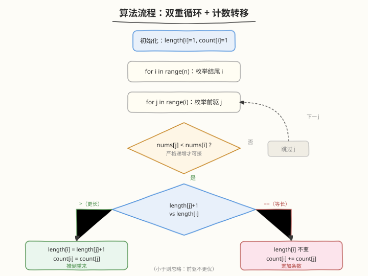

# 最长递增子序列的个数

- **题目名称**：最长递增子序列的个数
- **链接**：[673. 最长递增子序列的个数](https://leetcode.cn/problems/number-of-longest-increasing-subsequence/)
- **难度**：中等
- **标签**：动态规划

## 1. 题目概述

给定一个未排序的整数数组 `nums`，找到其中**最长严格递增子序列**的**个数**。子序列不要求连续，但必须保持原顺序。

**示例 1**：

```text
输入：nums = [1,3,5,4,7]
输出：2
解释：有两个最长递增子序列，分别是 [1,3,5,7] 和 [1,3,4,7]，长度均为 4。
```

**示例 2**：

```text
输入：nums = [2,2,2,2,2]
输出：1
解释：严格递增不允许相等，最长长度为 1，只有 [2] 这一种，故个数为 1。
```

**约束条件**：

- `1 <= nums.length <= 2000`
- `-10^6 <= nums[i] <= 10^6`
- 题目保证答案在 32 位整数范围内。

> ⚠️ **与 300 题的区别**：[300. 最长递增子序列](../0201-0300/300_最长递增子序列.md) 只求最长**长度**；本题求最长长度的**条数**。光有长度不够，还要"分门别类地数出来"。

---

## 2. 解题思路

### 2.1 暴力思路（枚举所有子序列）

枚举全部 `2^n` 个子序列，逐一检查严格递增并记录最长长度与条数。`n=2000` 时不可行。

### 2.2 核心观察：双数组 DP O(n²)

![双数组 DP：length[] 记长度，count[] 记条数](../images/lis_count_concept.svg)

承接 300 题的 DP 思路——`dp[i]` 表示以 `nums[i]` 结尾的 LIS 长度。本题要把"长度"和"条数"两件事拆开，**用两个数组分别维护**：

- `length[i]`：以 `nums[i]` **结尾**的最长递增子序列的**长度**。
- `count[i]`：以 `nums[i]` **结尾**、长度恰好为 `length[i]` 的子序列**条数**。

**初始化**：`length[i] = 1`、`count[i] = 1`（每个元素自身就是长度为 1 的子序列，唯一一条）。

**转移**（对每个 `i`，枚举 `j < i` 且 `nums[j] < nums[i]`）：

> 💡 关键直觉：把 `i` 接在某个前驱 `j` 后面。前驱 `j` 给出的候选长度是 `length[j] + 1`。我们要拿这个候选和 `i` 当前已知的最佳比较——分两种情况。

| 情况 | 条件 | 操作 | 直觉 |
|------|------|------|------|
| **更优** | `length[j] + 1 > length[i]` | `length[i] = length[j] + 1`；`count[i] = count[j]` | 发现了更长的接法，之前的条数作废，**推倒重来**，承接这个新前驱的条数 |
| **等长** | `length[j] + 1 == length[i]` | `length[i]` 不变；`count[i] += count[j]` | 又一个前驱也能凑出同样长度，**累加**它的条数 |
| **次优** | `length[j] + 1 < length[i]` | 忽略 | 前驱不够长，跳过 |

> ⚠️ **易错点**：必须在"枚举完所有 `j`"之后再决定最终 `length[i]`/`count[i]`。两个数组是**协同更新**的——先比长度，长度相等才累加 count；切勿看到 `nums[j] < nums[i]` 就盲目 `count[i] += count[j]`，那会把次优前驱也算进去。

**答案**：先求 `maxLen = max(length)`，再对**所有** `length[i] == maxLen` 的 `i` 求和 `count[i]`。

> 💡 **为什么答案要汇总所有 `i`**？因为最长子序列可能以不同位置结尾（300 题里答案也是 `max(dp)` 而非 `dp[n-1]`）。每个达到 `maxLen` 的位置都贡献了自己的一份条数。

### 2.3 算法流程图



### 2.4 示例演算

![示例演算：nums = [1, 3, 5, 4, 7]](../images/lis_count_walkthrough.svg)

以 `nums = [1,3,5,4,7]` 为例，逐步填写两个数组：

| i | x | 转移细节 | length[i] | count[i] |
|---|---|----------|-----------|----------|
| 0 | 1 | 初始化 | 1 | 1 |
| 1 | 3 | j=0(1<3)：1+1=2 > 1 → 规则一 | 2 | 1 |
| 2 | 5 | j=0→len=2；j=1(3<5)：2+1=3 > 2 → 规则一 | 3 | 1 |
| 3 | 4 | j=0→len=2；j=1(3<4)：2+1=3 > 2 → 规则一；j=2(5<4 假)跳过 | 3 | 1 |
| 4 | 7 | j=0,1,2 逐步推进：j=2(5<7)时 3+1=4>3 → 规则一 length=4,cnt=1；j=3(4<7)时 3+1=4==4 → 规则二 cnt+=1=2 | 4 | 2 |

最终 `length = [1,2,3,3,4]`、`count = [1,1,1,1,2]`。`maxLen = 4`，只有 `i=4` 达到该长度，`ans = count[4] = 2` ✓。

对应两条子序列：`[1,3,5,7]`（经 `j=0,1,2` 接到 7）与 `[1,3,4,7]`（经 `j=0,1,3` 接到 7）。

---

## 3. 参考代码

### C++

```cpp
class Solution {
public:
    int findNumberOfLIS(vector<int>& nums) {
        int n = nums.size();
        vector<int> length(n, 1), count(n, 1);
        int maxLen = 1;
        for (int i = 1; i < n; i++) {
            for (int j = 0; j < i; j++) {
                if (nums[j] < nums[i]) {
                    if (length[j] + 1 > length[i]) {
                        length[i] = length[j] + 1;
                        count[i] = count[j];
                    } else if (length[j] + 1 == length[i]) {
                        count[i] += count[j];
                    }
                }
            }
            maxLen = max(maxLen, length[i]);
        }
        int ans = 0;
        for (int i = 0; i < n; i++) {
            if (length[i] == maxLen) ans += count[i];
        }
        return ans;
    }
};
```

### Python

```python
def findNumberOfLIS(nums):
    n = len(nums)
    length = [1] * n
    count = [1] * n
    max_len = 1
    for i in range(1, n):
        for j in range(i):
            if nums[j] < nums[i]:
                if length[j] + 1 > length[i]:
                    length[i] = length[j] + 1
                    count[i] = count[j]
                elif length[j] + 1 == length[i]:
                    count[i] += count[j]
        max_len = max(max_len, length[i])
    return sum(c for l, c in zip(length, count) if l == max_len)
```

---

## 4. 复杂度分析

| 维度 | 复杂度 | 说明 |
|------|--------|------|
| **时间** | `O(n²)` | 双重循环，外层 `n` 次、内层最多 `n` 次；末尾汇总 `O(n)` |
| **空间** | `O(n)` | `length` 与 `count` 两个长度为 `n` 的数组 |

> 💡 `n <= 2000`，`O(n²) = 4×10⁶` 完全可接受。若 `n` 更大（如 `10⁵`），需用树状数组/线段树按值域维护"每个长度对应的 (长度, 条数) 最值"，可做到 `O(n log n)`，但实现复杂，面试中能讲清 DP 即可。

---

## 5. 扩展：O(n log n) 树状数组解法（思路）

将"以值 `v` 结尾、长度为 `k` 的最优（最长长度 + 该长度条数）"用**权值树状数组**按 `nums[i]` 的值域组织。每插入一个 `x`，查询值域 `[0, x-1]` 内"长度最大者及其条数之和"，再更新 `x` 位置。要点：

- 树状数组每个桶存 `(maxLen, totalCount)` 二元组。
- 合并两个桶时复用本题的"更长则替换、等长则累加"规则。
- 值域大时先**离散化**到 `[1, n]`。

该法把内层 `j` 循环的 `O(n)` 降为 `O(log n)`，适合 `n` 很大的变体。

---

## 6. 面试要点

1. **为什么 `count[i]` 要在"更长"时直接赋值，而不是累加？**

   - 出现更长的前驱意味着此前所有"较短接法"都不再是最优解，以 `i` 结尾的最长长度被刷新，对应的条数应**只统计**这条新最优链路派生出的子序列数，即 `count[j]`。旧条数作废。

2. **如果只统计"长度恰好等于全局最长"的条数，会不会漏掉中途达到最长但被后续刷新的位置？**

   - 不会。`length[i]` 一旦在枚举 `j` 过程中被刷新就只增不减，最终值就是以 `i` 结尾的真实最长长度。即便某个 `i` 在中途达到全局最长后被更大的 `j` 进一步拉长，它的最终 `length[i]` 仍会反映真实情况。汇总时按**最终** `length[i] == maxLen` 筛选即可。

3. **本题与 300 题的关系？**

   - 300 题 `dp[i]` = 以 `i` 结尾的最长**长度**，只取 `max`。本题把 `dp` 拆成 `length`/`count` 双数组，在求长度的同时"分类计数"。**计数型 DP** 的通用套路：先定义最优值，再维护达到该最优值的方案数，转移时按"更优则替换、等优则累加"分支处理。

4. **为什么不能用 300 题的贪心 + 二分直接数？**

   - 贪心法维护的 `tails` 数组在"替换"时会破坏子序列的真实结构，只能得长度、无法还原方案数。计数必须保留每条合法链路，故回到 `O(n²)` DP（或借助树状数组加速）。

5. **答案汇总时，为什么是"对所有 `length[i]==maxLen` 求和"而不是只看末尾？**

   - 最长子序列的结尾位置不唯一。比如 `[1,3,5,4,7]` 中最长长度 4 只在 `i=4` 达到，但换一组数据可能多个位置并列达到 `maxLen`，每个位置都贡献自己结尾的条数，需全部累加。

---

## 7. 同类练习题

- [300. 最长递增子序列](https://leetcode.cn/problems/longest-increasing-subsequence/)（[题解](../0201-0300/300_最长递增子序列.md)）：本题的母题，只求长度；掌握后再加 count 数组即得本题
- [354. 俄罗斯套娃信封问题](https://leetcode.cn/problems/russian-doll-envelopes/)（[题解](../0301-0400/354_俄罗斯套娃信封问题.md)）：二维 LIS，排序降维后套 LIS 模板
- [1673. 找出最具竞争力的子序列](https://leetcode.cn/problems/find-the-most-competitive-subsequence/)：定长子序列的贪心单调栈，与 LIS 的"末尾最小"思想同源
- [2407. 最长递增子序列 II](https://leetcode.cn/problems/longest-increasing-subsequence-ii/)：值域树状数组/线段树加速的 LIS，对应本文扩展解法
