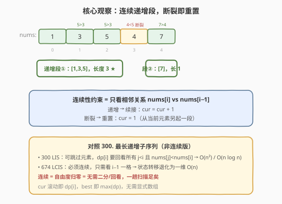
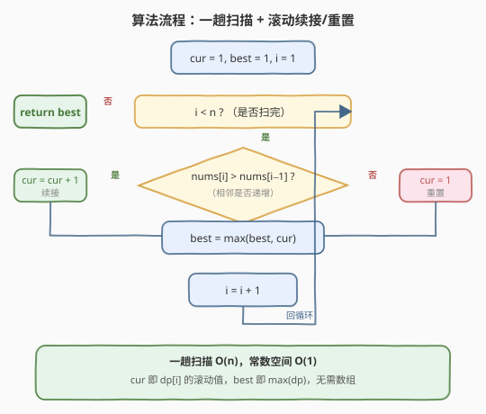

# 最长连续递增序列

- **题目名称**：最长连续递增序列
- **链接**：[674. 最长连续递增序列](https://leetcode.cn/problems/longest-continuous-increasing-subsequence/)
- **难度**：简单
- **标签**：数组、动态规划、贪心

## 1. 题目概述

给定一个**未经排序**的整数数组 `nums`，找到最长且 **连续递增的子序列**，并返回该序列的长度。

**连续递增的子序列**由两个下标 `l` 和 `r`（`l < r`）确定：若对每个 `l <= i < r` 都有 `nums[i] < nums[i + 1]`，则子数组 `[nums[l], nums[l+1], ..., nums[r]]` 即为连续递增子序列。

**示例 1**：

```text
输入：nums = [1,3,5,4,7]
输出：3
解释：最长连续递增序列是 [1,3,5]，长度为 3。
尽管 [1,3,5,7] 也是升序的子序列，但它不是连续的，因为 5 和 7 在原数组里被 4 隔开。
```

**示例 2**：

```text
输入：nums = [2,2,2,2,2]
输出：1
解释：最长连续递增序列是 [2]，长度为 1。
```

**约束条件**：

- $1 \leq \text{nums.length} \leq 10^4$
- $-10^9 \leq \text{nums}[i] \leq 10^9$

> 💡 **关键约束**：「连续」二字是题眼——子序列必须是数组中一段**紧挨着的连续子数组**，不能跳过任何元素。这一约束把问题从 [300. 最长递增子序列](../0201-0300/300_最长递增子序列.md) 的 $O(n^2)$/$O(n\log n)$ 一下子退化成 $O(n)$ 一趟扫描。

---

## 2. 解题思路

### 2.1 暴力思路

枚举所有连续子数组 `[l, r]`，逐个检查其内部是否严格递增（即对每个 `i ∈ [l, r)` 验证 `nums[i] < nums[i+1]`），记录满足条件的最大长度。共 $O(n^2)$ 个子数组，每个检查 $O(n)$，总复杂度 $O(n^3)$；即便用「以每个起点向右延伸到不能再递增为止」的早停优化，仍是 $O(n^2)$，$n = 10^4$ 时约 $10^8$ 次比较，常数大、易超时。

> ⚠️ 暴力法暴露一个事实：我们并不需要真的「枚举每段」——因为**相邻关系是局部的**，一段是否递增完全由相邻两两的 `nums[i] < nums[i+1]` 决定。把这些局部信息沿下标串起来，一趟扫描即可得到所有递增段的长度。

### 2.2 核心观察：连续性 = 只看相邻一格



由于必须连续，当前元素 `nums[i]` 能否续接到前一段递增序列上，**只取决于它和前一个元素 `nums[i-1]` 的大小关系**——无需像 [300 LIS](../0201-0300/300_最长递增子序列.md) 那样回看所有 `j < i`。

- 若 `nums[i] > nums[i-1]`：递增关系成立，当前递增段长度 `cur = cur + 1`（续接）。
- 若 `nums[i] <= nums[i-1]`：递增关系断裂，当前元素**另起一段**，`cur = 1`（重置）。

过程中用 `best` 记录所有 `cur` 的最大值即为答案。

> 💡 **与 300 的本质差异**：300 的状态转移 $\text{dp}[i] = \max_{j<i,\,\text{nums}[j]<\text{nums}[i]}(\text{dp}[j]+1)$ 需要回看整个前缀，所以是 $O(n^2)$；674 加了「连续」约束后，合法的 `j` 只剩 $i-1$ 一个，转移退化为 $\text{dp}[i] = \text{dp}[i-1]+1$（递增时）或 $1$（断裂时）。**自由度从 $n$ 归零为一格，复杂度随之从 $O(n^2)$ 降到 $O(n)$**。

### 2.3 算法流程图



维护变量：

- `cur`：以 `nums[i-1]` 结尾的当前连续递增段长度（即 $\text{dp}[i-1]$ 的滚动值）；
- `best`：已扫过部分中 `cur` 的最大值（即 $\max \text{dp}$）。

**步骤**：

1. 初始化 `cur = 1`、`best = 1`（单个元素天然是长度为 1 的递增段），`i = 1`。
2. 从 `i = 1` 扫到 `n-1`：
   - 若 `nums[i] > nums[i-1]`：`cur += 1`（续接）；
   - 否则：`cur = 1`（重置，从当前元素另起一段）。
   - `best = max(best, cur)`。
3. 返回 `best`。

> ⚠️ **重置为 1 而非 0**：断裂时当前元素 `nums[i]` 自身就是一段新的长度为 1 的递增序列，因此 `cur` 直接置 1，而非 0 后再加 1。这一点在写代码时容易出错。

### 2.4 示例演算

以 `nums = [1,3,5,4,7]` 为例（初始 `cur = best = 1`）：

![示例演算：[1,3,5,4,7] 扫描全过程](../images/lcis_example_walkthrough.svg)

| 步骤 | i | 比较 | 动作 | cur | best |
|------|---|------|------|-----|------|
| 初始 | — | — | cur=best=1 | 1 | 1 |
| 1 | 1 | 3 > 1 递增 | 续接 +1 | 2 | 2 |
| 2 | 2 | 5 > 3 递增 | 续接 +1 | 3 | 3 ★ |
| 3 | 3 | 4 < 5 断裂 | 重置 =1 | 1 | 3 |
| 4 | 4 | 7 > 4 递增 | 续接 +1 | 2 | 3 |

最终 `best = 3`，对应递增段 `[1, 3, 5]`。

> 💡 注意 `[1,3,5,7]` 虽然整体升序，但 5 与 7 之间隔着 4，**不连续**，所以不计入——这正是「连续」约束与 300 LIS 的根本区别。

对照 `nums = [2,2,2,2,2]`：每一步都是 `2 == 2`（不满足严格 `>`），全部重置 `cur = 1`，`best` 始终为 1，返回 1。

---

## 3. 参考代码

### C++

```cpp
class Solution {
public:
    int findLengthOfLCIS(vector<int>& nums) {
        int cur = 1, best = 1;
        for (int i = 1; i < (int)nums.size(); ++i) {
            if (nums[i] > nums[i - 1]) {
                cur += 1;
            } else {
                cur = 1;
            }
            best = max(best, cur);
        }
        return best;
    }
};
```

### Python

```python
class Solution:
    def findLengthOfLCIS(self, nums: List[int]) -> int:
        cur = best = 1
        for i in range(1, len(nums)):
            if nums[i] > nums[i - 1]:
                cur += 1
            else:
                cur = 1
            best = max(best, cur)
        return best
```

> 💡 **更 Pythonic 的写法**：用 `itertools.pairwise` 配合生成器，但面试中手写循环更显基本功，且常数更小：
>
> ```python
> def findLengthOfLCIS(self, nums: List[int]) -> int:
>     best = cur = 1
>     for a, b in pairwise(nums):
>         cur = cur + 1 if b > a else 1
>         best = max(best, cur)
>     return best
> ```

---

## 4. 复杂度分析

| 维度 | 复杂度 | 说明 |
|------|--------|------|
| 时间复杂度 | $O(n)$ | 单趟扫描，每个元素仅与左邻做一次比较 + 一次 `max` 更新 |
| 空间复杂度 | $O(1)$ | 仅 `cur`/`best` 两个变量，与输入规模无关 |

> 💡 本题已达时间下界 $O(n)$（至少要看一遍相邻关系才能确定递增性），空间为常数。`cur` 即 $\text{dp}[i]$ 的滚动值，`best` 即 $\max \text{dp}$，无需显式 DP 数组——这是「状态只依赖前一个」时滚动变量的标准优化。

---

## 5. 扩展：DP 数组写法与输出具体序列

### 5.1 显式 DP 数组

若把滚动变量展开为 DP 数组，状态定义与 300 LIS 完全平行，只是转移只看 $i-1$：

$$\text{dp}[i] = \begin{cases} \text{dp}[i-1] + 1, & \text{nums}[i] > \text{nums}[i-1] \\ 1, & \text{否则} \end{cases}$$

答案为 $\max_i \text{dp}[i]$。空间从 $O(1)$ 升到 $O(n)$，**不推荐**，仅用于帮助理解状态转移的来源。

```cpp
int findLengthOfLCIS(vector<int>& nums) {
    int n = nums.size();
    vector<int> dp(n, 1);
    int best = 1;
    for (int i = 1; i < n; ++i) {
        if (nums[i] > nums[i - 1]) dp[i] = dp[i - 1] + 1;
        best = max(best, dp[i]);
    }
    return best;
}
```

### 5.2 输出最长连续递增序列本身

若面试官要求返回具体的序列而非长度，只需在更新 `best` 时记录终点 `end = i`，最后截取 `nums[end - best + 1 .. end]` 即可：

```cpp
int end = 0;                       // 单元素时 best=1, end=0
for (int i = 1; i < (int)nums.size(); ++i) {
    if (nums[i] > nums[i - 1]) cur += 1;
    else cur = 1;
    if (cur > best) { best = cur; end = i; }
}
// 序列 = nums[end - best + 1 .. end]
```

---

## 6. 面试要点

1. **674 和 300 的核心区别是什么？**
   - 674 要求子序列**连续**（是子数组），状态只依赖 $i-1$ 一格，$O(n)$；300 允许跳过元素，状态依赖所有 $j<i$ 且 $\text{nums}[j]<\text{nums}[i]$，$O(n^2)$ 或贪心+二分 $O(n\log n)$。连续约束把自由度从 $n$ 归零，复杂度随之骤降。

2. **断裂时 `cur` 为什么重置为 1 而不是 0？**
   - 断裂时当前元素 `nums[i]` 自身就是一段新的长度为 1 的递增序列，所以 `cur` 直接置 1。若置 0 再加 1 也能对，但多一步且语义不清，容易在边界（如全等数组）出错。

3. **「严格递增」用 `>` 还是 `>=`？**
   - 题目要求 `nums[i] < nums[i+1]`（严格），所以判断续接用 `nums[i] > nums[i-1]`（严格大于）。若写成 `>=`，会把相等元素也算进递增段，对 `[2,2,2,2,2]` 错误地返回 5。

4. **初始化 `cur = best = 1` 是否对所有 `n` 都成立？**
   - 是。$n \geq 1$（约束保证），单个元素天然是长度 1 的递增段，`best` 至少为 1。循环从 `i=1` 开始，$n=1$ 时循环不执行，直接返回 1，无需特判。

5. **能否用滑动窗口（双指针）求解？**
   - 可以，本质等价：`left` 固定递增段起点，`right` 向右扩展直到 `nums[right] <= nums[right-1]`，记录 `right - left + 1`，然后 `left = right` 重开新段。这与「`cur` 续接/重置」是同一过程的两种表述——`cur` 即隐式的 `right - left + 1`，滚动变量更省事。

---

## 7. 同类练习题

- [300. 最长递增子序列](https://leetcode.cn/problems/longest-increasing-subsequence/)（[题解](../0201-0300/300_最长递增子序列.md)）：去掉「连续」约束的母题，对比 $O(n)$ vs $O(n^2)$/$O(n\log n)$ 的复杂度差异根源
- [53. 最大子数组和](https://leetcode.cn/problems/maximum-subarray/)（[题解](../0001-0100/53_最大子数组和.md)）：同为「连续子数组 + 一趟扫描 + 续接/重置」的 Kadane 范式，把「和」换成「长度」即本题
- [209. 长度最小的子数组](https://leetcode.cn/problems/minimum-size-subarray-sum/)（[题解](../0201-0300/209_长度最小的子数组.md)）：变长滑窗求最值，对比本题「窗口起点随断裂重置」的滑窗视角
- [673. 最长递增子序列的个数](https://leetcode.cn/problems/number-of-longest-increasing-subsequence/)：300 的计数变体（非连续），对比连续版若求「最长连续递增序列的个数」只需数 `cur == best` 出现次数
- [228. 汇总区间](https://leetcode.cn/problems/summary-ranges/)：同样扫描连续段（连续整数），把「记录长度」换成「输出区间字符串」，一趟扫描思想的迁移
