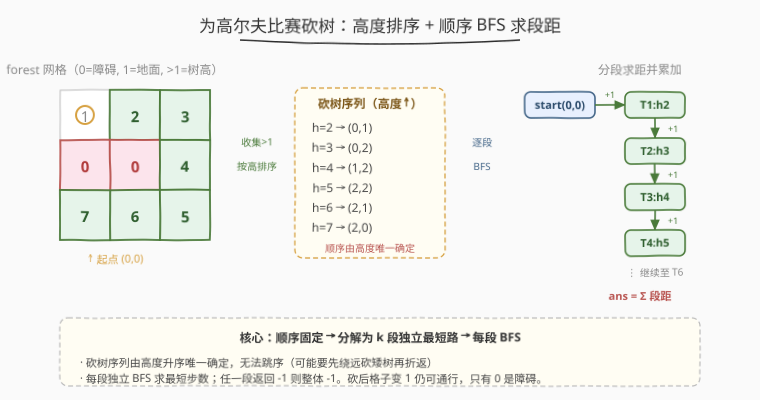
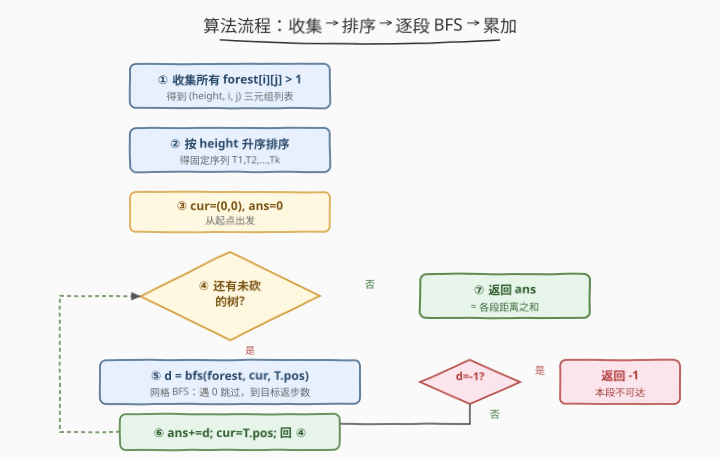
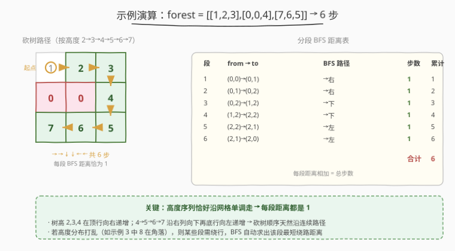

# LeetCode 为高尔夫比赛砍树 题解

## 1. 题目概述

- **标题 / 题号**：为高尔夫比赛砍树（#675，hard）
- **链接**：https://leetcode.cn/problems/cut-off-trees-for-golf-event/
- **难度**：困难
- **标签**：广度优先搜索、数组、矩阵

**题意**：你被请来给一个要举办高尔夫比赛的树林砍树。树林由一个 $m \times n$ 的矩阵表示，每一格的含义如下：

- `0` 表示障碍，**无法触碰**；
- `1` 表示地面，可通行（无树）；
- 大于 `1` 的整数表示一棵树，其数值即树的高度，**该格可通行**。

你从 $(0, 0)$ 出发，每一步可向上、下、左、右移动一格。**必须按树的高度从低到高依次砍倒所有树**；每砍过一棵树，该格值变为 `1`（变为地面，仍可通行）。砍树动作本身不消耗步数，只有移动消耗步数。返回砍完所有树所需的**最少总步数**；若无法砍完所有树，返回 `-1`。

> 💡 题目保证**没有两棵树高度相同**，且至少需要砍倒一棵树——因此按高度排序得到的砍树序列是唯一确定的。

**示例 1**：

```text
输入：forest = [[1,2,3],[0,0,4],[7,6,5]]
输出：6
解释：沿顶行向右、右列向下、底行向左的路径，用 6 步按从矮到高的顺序砍完所有树。
```

**示例 2**：

```text
输入：forest = [[1,2,3],[0,0,0],[7,6,5]]
输出：-1
解释：中间一整行是障碍，上半部分与下半部分不连通，无法砍到下排的树。
```

**示例 3**：

```text
输入：forest = [[2,3,4],[0,0,5],[8,7,6]]
输出：6
解释：起点 (0,0) 本身就是最矮的树（高度 2），可直接砍去不算步数；
后续高度沿同一条 6 步路径递增排列，与示例 1 同路径。
```

**约束**：

- $m = \text{forest.length}$，$n = \text{forest}[i].\text{length}$
- $1 \le m, n \le 50$
- $0 \le \text{forest}[i][j] \le 10^9$

## 2. 解题思路

### 2.1 暴力思路

朴素地想「枚举砍树的所有排列顺序，对每种顺序算总距离取最小」——但这违背了题目硬约束：砍树顺序**必须**按高度升序，不可任意排列。所以排列枚举在本题是错的方向。

退一步，正确的「朴素」做法其实已经是最优做法的雏形：先把所有树按高度排序得到固定序列，再对相邻两棵树求最短距离并累加。真正的难点不在「能不能想到排序」，而在**为什么必须分段独立 BFS，而不能用一次 BFS 走完所有树**——因为砍树顺序由高度决定，可能要先绕远去砍一棵矮树再折返砍高树，单源最短路无法保证按序经过所有目标。

### 2.2 核心观察：高度排序 + 顺序 BFS 求段距



关键洞察有两层：

**观察一：砍树顺序由高度唯一确定。** 收集所有 $\text{forest}[i][j] > 1$ 的格子，按高度升序排序，得到固定序列 $T_1, T_2, \dots, T_k$。你必须依次走 $\text{start} \to T_1 \to T_2 \to \dots \to T_k$，无法跳序。

**观察二：每段最短距离独立用 BFS 求解。** 每次只能上下左右走一格、无法穿越值为 `0` 的障碍，于是相邻两棵树之间的最少步数就是**无权网格上的最短路径长度**，而 BFS 天然能在无权图上求单源最短路。总步数为各段距离之和：

$$
\text{ans} = \sum_{i=0}^{k-1} \text{bfs}(\text{from}_i,\ \text{to}_{i+1})
$$

其中 $\text{from}_0 = (0,0)$，$\text{from}_i = T_i$，$\text{to}_{i+1} = T_{i+1}$。任一段 BFS 返回 $-1$（不可达），整体即返回 $-1$。

> 💡 **为什么不能「一次 BFS 走完所有树」？** BFS 求的是单源到单终点的最短路，而按高度排序的树序列并不构成一条最短路径——可能要先绕远去砍矮树，再折返砍高树。所以必须**分段 BFS**，每段独立求最短距离后累加。这与一次 BFS 到单一终点的题（如 [1293. 网格的最短通路](https://leetcode.cn/problems/shortest-path-in-a-grid-with-obstacles-elimination/)）有本质区别。

> ⚠️ **砍树后格子仍可通行。** 题目说砍完后该格值变为 `1`（地面），而 `1` 和 `>1` 的格子都是可通行的，**只有值为 `0` 的格子是障碍**。常见误读是以为砍完树格子变 `0`——不是。因此 BFS 时的可达性判定只看 `forest[nr][nc] != 0`，全程无需修改网格。

### 2.3 算法流程图



1. **收集**：遍历网格，收集所有 $\text{forest}[i][j] > 1$ 的 `(height, i, j)` 三元组。
2. **排序**：按 `height` 升序排序，得固定序列 `trees = [T_1, ..., T_k]`。
3. **初始化**：`cur = (0, 0)`，`ans = 0`。
4. **逐段循环**：对 `trees` 中每棵树 `T`：
   - `d = bfs(forest, cur, T.pos)`
   - 若 `d == -1`：返回 `-1`（本段不可达，整体无解）。
   - `ans += d`；`cur = T.pos`（移动到刚砍的树位置，作为下一段起点）。
5. **返回** `ans`。

**`bfs(forest, src, dst)`**：标准网格 BFS。队列存 `(行, 列, 步数)`，`visited` 矩阵标记已访问；四方向扩展时跳过越界、已访问、`forest[nr][nc] == 0` 的格子；到达 `dst` 返回步数，队列耗尽仍未到达返回 `-1`。若 `src == dst` 直接返回 `0`（起点即目标，如示例 3 的第一棵树）。

### 2.4 示例演算

以 `forest = [[1,2,3],[0,0,4],[7,6,5]]` 为例：



先收集并按高度排序得到砍树序列：

| 序号 | 高度 | 位置 |
|------|------|------|
| $T_1$ | 2 | $(0,1)$ |
| $T_2$ | 3 | $(0,2)$ |
| $T_3$ | 4 | $(1,2)$ |
| $T_4$ | 5 | $(2,2)$ |
| $T_5$ | 6 | $(2,1)$ |
| $T_6$ | 7 | $(2,0)$ |

从 `cur = (0,0)` 出发逐段 BFS：

| 段 | from → to | BFS 路径 | 步数 | 累计 |
|----|-----------|---------|------|------|
| 1 | $(0,0) \to (0,1)$ | →右 | 1 | 1 |
| 2 | $(0,1) \to (0,2)$ | →右 | 1 | 2 |
| 3 | $(0,2) \to (1,2)$ | →下 | 1 | 3 |
| 4 | $(1,2) \to (2,2)$ | →下 | 1 | 4 |
| 5 | $(2,2) \to (2,1)$ | →左 | 1 | 5 |
| 6 | $(2,1) \to (2,0)$ | →左 | 1 | 6 |

> 💡 本例树高恰好沿「顶行向右 → 右列向下 → 底行向左」单调递增，所以每段 BFS 距离都是 1，总步数 6。若高度分布打乱（如示例 3 中高度 8 在底行左角），某些段会需要绕行，BFS 会自动求出该段的最短绕路距离——这正是「分段独立求距」的威力：**不关心高度如何分布，只管每段最短路**。

> ⚠️ 示例 2 中间整行是障碍，从上半部分到下半部分的任何一段 BFS 都会返回 `-1`，整体立即返回 `-1`，无需把所有段都跑完。

## 3. 参考代码

### C++

```cpp
class Solution {
    int m, n;
    int dx[4] = {0, 0, 1, -1};
    int dy[4] = {1, -1, 0, 0};

    // 网格 BFS：从 (sr,sc) 到 (tr,tc) 的最短步数，不可达返回 -1
    int bfs(vector<vector<int>>& forest, int sr, int sc, int tr, int tc) {
        if (sr == tr && sc == tc) return 0;          // 起点即目标
        vector<vector<char>> visited(m, vector<char>(n, 0));
        queue<pair<int,int>> q;
        q.push({sr, sc});
        visited[sr][sc] = 1;
        int steps = 0;
        while (!q.empty()) {
            int sz = q.size();
            steps++;
            while (sz--) {
                auto [r, c] = q.front(); q.pop();
                for (int d = 0; d < 4; d++) {
                    int nr = r + dx[d], nc = c + dy[d];
                    if (nr < 0 || nr >= m || nc < 0 || nc >= n) continue;
                    if (visited[nr][nc] || forest[nr][nc] == 0) continue;
                    if (nr == tr && nc == tc) return steps;
                    visited[nr][nc] = 1;
                    q.push({nr, nc});
                }
            }
        }
        return -1;
    }
public:
    int cutOffTree(vector<vector<int>>& forest) {
        m = forest.size();
        n = forest[0].size();
        vector<tuple<int,int,int>> trees;            // (height, r, c)
        for (int i = 0; i < m; i++)
            for (int j = 0; j < n; j++)
                if (forest[i][j] > 1)
                    trees.push_back({forest[i][j], i, j});
        sort(trees.begin(), trees.end());            // 按高度升序

        int sr = 0, sc = 0, ans = 0;
        for (auto& [h, tr, tc] : trees) {
            int d = bfs(forest, sr, sc, tr, tc);
            if (d == -1) return -1;
            ans += d;
            sr = tr; sc = tc;                        // 下一段从这里出发
        }
        return ans;
    }
};
```

### Python

```python
from collections import deque

class Solution:
    def cutOffTree(self, forest: List[List[int]]) -> int:
        m, n = len(forest), len(forest[0])
        # 收集所有树并按高度升序排序
        trees = sorted((forest[i][j], i, j)
                       for i in range(m) for j in range(n)
                       if forest[i][j] > 1)
        dirs = [(0, 1), (0, -1), (1, 0), (-1, 0)]

        def bfs(sr: int, sc: int, tr: int, tc: int) -> int:
            if (sr, sc) == (tr, tc):
                return 0
            visited = [[False] * n for _ in range(m)]
            q = deque([(sr, sc, 0)])
            visited[sr][sc] = True
            while q:
                r, c, steps = q.popleft()
                for dr, dc in dirs:
                    nr, nc = r + dr, c + dc
                    if 0 <= nr < m and 0 <= nc < n \
                       and not visited[nr][nc] and forest[nr][nc] != 0:
                        if (nr, nc) == (tr, tc):
                            return steps + 1
                        visited[nr][nc] = True
                        q.append((nr, nc, steps + 1))
            return -1

        sr = sc = ans = 0
        for h, tr, tc in trees:
            d = bfs(sr, sc, tr, tc)
            if d == -1:
                return -1
            ans += d
            sr, sc = tr, tc
        return ans
```

> 💡 代码的两个细节：① `bfs` 开头特判 `src == dst` 返回 `0`，覆盖「起点本身就是最低树」（示例 3）以及「相邻两棵树位置相同」的退化情形；② `trees` 用 `tuple(height, r, c)` 直接 `sort`，由于题目保证高度互异，无需额外去重或稳定排序。

## 4. 复杂度分析

| 维度 | 复杂度 | 说明 |
|------|--------|------|
| **时间复杂度** | $O(T \cdot M \cdot N)$ | 共 $T$ 棵树，每段 BFS 最坏遍历全网格 $O(M \cdot N)$；最坏 $T = M \cdot N$，总体最坏 $O((M \cdot N)^2)$ |
| **空间复杂度** | $O(M \cdot N)$ | BFS 的 `visited` 矩阵与队列开销；排序额外 $O(T \log T)$ |

> 💡 本题 $M, N \le 50$，最坏 $50 \times 50 \times 50 \times 50 \approx 6.25 \times 10^6$ 次操作，完全在时限内。若网格更大且障碍稀疏，可用 A\* 替代每段 BFS 以减少扩展数（见第 5 节）。

## 5. 扩展：A\* 优化大网格

当网格很大且障碍稀疏时，朴素 BFS 每段都遍历几乎全网格，开销显著。可用 **A\* 算法**替代每段 BFS：

- **估价函数**：以曼哈顿距离 $h(n) = |n_r - t_r| + |n_c - t_c|$ 作为启发式（在四方向无权网格中，曼哈顿距离 $\le$ 实际最短路，满足可采纳性）。
- **优先队列**：按 $f(n) = g(n) + h(n)$ 出队，$g(n)$ 为已走步数。
- **效果**：障碍少时 A\* 几乎沿直线扩展到目标，扩展数远小于全网格；最坏情况（障碍迫使绕远）仍为 $O(M \cdot N)$，与 BFS 持平。

```python
import heapq

def astar(forest, sr, sc, tr, tc, m, n):
    if (sr, sc) == (tr, tc):
        return 0
    def h(r, c):
        return abs(r - tr) + abs(c - tc)
    visited = [[False] * n for _ in range(m)]
    pq = [(h(sr, sc), 0, sr, sc)]
    visited[sr][sc] = True
    while pq:
        f, g, r, c = heapq.heappop(pq)
        if (r, c) == (tr, tc):
            return g
        for dr, dc in [(0,1),(0,-1),(1,0),(-1,0)]:
            nr, nc = r + dr, c + dc
            if 0 <= nr < m and 0 <= nc < n \
               and not visited[nr][nc] and forest[nr][nc] != 0:
                visited[nr][nc] = True
                heapq.heappush(pq, (g + 1 + h(nr, nc), g + 1, nr, nc))
    return -1
```

> ⚠️ A\* 的 `visited` 标记需谨慎：由于 A\* 按启发式优先扩展，第一次弹出某格时不一定是其最短 $g$ 值。上面写法用「入队即标记」是近似做法（曼哈顿距离可采纳时仍正确，因为四方向网格中相邻格 $g$ 单调递增 1）。严格 A\* 应在「弹出时」判定目标并允许重复入队。面试中提到 A\* 思路与曼哈顿启发式即可，不必过度展开实现细节。

## 6. 面试要点

1. **为什么必须分段 BFS，不能一次 BFS 走完所有树？**

   - 砍树顺序由高度固定，不是按位置就近。可能要先绕远砍一棵矮树、再折返砍高树，单源 BFS 到「最后一个目标」无法保证按序经过中间所有树。把问题分解为「起点→$T_1$」「$T_1$→$T_2$」…「$T_{k-1}$→$T_k$」共 $k$ 段独立最短路，每段 BFS 求解后累加，是唯一正确的分解方式。

2. **砍完一棵树后，那个格子还能走吗？**

   - 能。题目明确「砍过后该格值变为 `1`（地面）」，而 `1` 和 `>1` 的格子都可通行，**只有值为 `0` 的格子是障碍**。BFS 的可达性判定只看 `forest[nr][nc] != 0`，全程无需修改网格。常见误读是以为砍完树格子变 `0`——这会错误地把已砍树当成障碍。

3. **起点 $(0,0)$ 本身是障碍（值为 `0`）怎么办？**

   - 第一段 BFS 从 $(0,0)$ 出发，由于其值为 `0`，四方向扩展要么越界要么也是障碍，队列很快耗尽返回 `-1`，整体返回 `-1`。代码无需特判，BFS 自然处理。题目虽保证至少有一棵树要砍，但未保证起点非障碍，需留意。

4. **起点本身就是最低的树怎么办？**

   - 第一段 `bfs((0,0), (0,0))` 返回 `0`（代码特判 `src == dst`），不消耗步数。示例 3 即此情形：起点高度 2 是最低树，砍它不算步数，后续 5 步砍完剩余树，总步数 6。

5. **复杂度最坏 $O((M \cdot N)^2)$，会超时吗？如何优化？**

   - $M, N \le 50$ 时最坏约 $6 \times 10^6$ 次 BFS 扩展，远在时限内。若网格更大（如 $500 \times 500$），可改用 A\* 配曼哈顿启发式替代每段 BFS，在障碍稀疏时大幅减少扩展数；或用双向 BFS（从起点和目标同时扩展，中间相遇）。但本题数据规模下朴素分段 BFS 足矣。

> 💡 **一句话总结**：675 的核心是「**把固定顺序的多目标访问问题，分解为相邻目标间的独立最短路，每段用 BFS 求解后累加**」。难点不在 BFS 本身，而在识别出「顺序固定 → 可分段」这一结构，并避开「砍后变障碍」「一次 BFS 走完」两类常见误读。

## 同类练习题

| # | 题目 | 与本题的关联 |
|---|------|-------------|
| 1926 | [迷宫中离入口最近的出口](https://leetcode.cn/problems/nearest-exit-from-entrance-in-maze/) | 网格单源 BFS 最短路基础，675 每一段的 BFS 即此模板 |
| 1293 | [网格的最短通路](https://leetcode.cn/problems/shortest-path-in-a-grid-with-obstacles-elimination/) | BFS + 状态扩展（可消除 $k$ 个障碍），对比 675 的「一次 BFS 到单终点」与 675 的「分段 BFS」 |
| 994 | [腐烂的橘子](https://leetcode.cn/problems/rotting-oranges/) | 多源 BFS 逐层扩散，对比 675 的单源逐段 BFS（[题解](../0901-1000/994_腐烂的橘子.md)） |
| 1091 | [二进制矩阵中的最短路径](https://leetcode.cn/problems/shortest-path-in-binary-matrix/) | 八方向 BFS 求最短路，巩固网格 BFS 模板 |
| 417 | [太平洋大西洋水流问题](https://leetcode.cn/problems/pacific-atlantic-water-flow/) | 反向多源 BFS 求可达集，与 675 的正向单源 BFS 互补（[题解](../0401-0500/417_太平洋大西洋水流问题.md)） |
