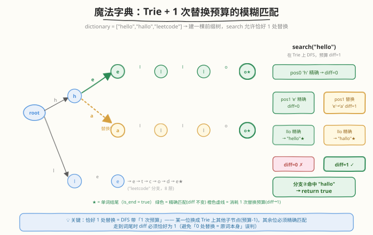
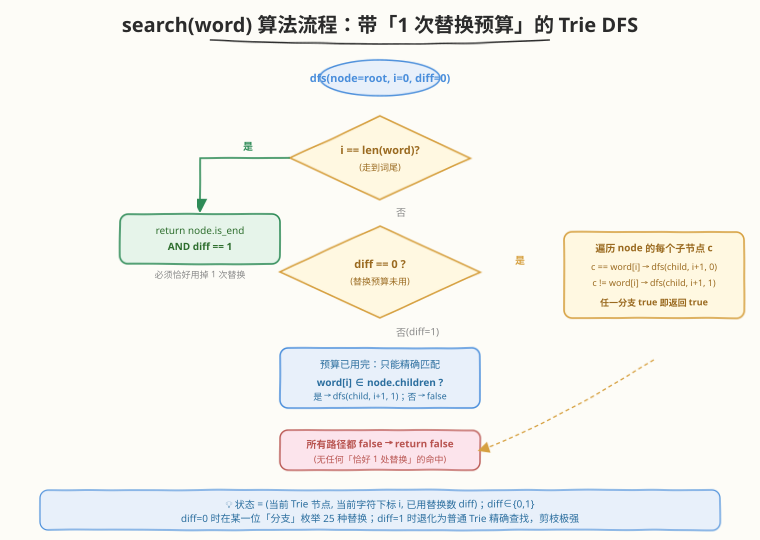
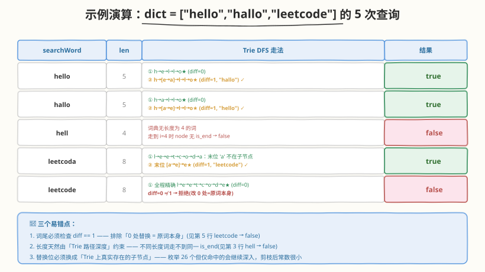

# LeetCode 实现一个魔法字典 题解

## 1. 题目概述

- **标题 / 题号**：实现一个魔法字典（#676，medium）
- **链接**：https://leetcode.cn/problems/implement-magic-dictionary/
- **难度**：中等
- **标签**：字典树、深度优先搜索、哈希表、字符串、设计

**题意**：设计一个 **MagicDictionary**：先调用 `buildDict(dictionary)` 把一批**互不相同**的单词存进去；之后 `search(searchWord)` 判断——能否把 `searchWord` **恰好一个字符**替换成另一个小写字母，使所得字符串命中字典里的某个单词。

需实现以下接口：

- `MagicDictionary()`：初始化
- `void buildDict(vector<string> dictionary)`：用一组**互不相同**的字符串建立字典（整个生命周期内最多调用一次）
- `bool search(string searchWord)`：是否存在某个字典词，与 `searchWord` **长度相同**且**恰好有一位字符不同**

**示例 1**：

```text
输入：
  MagicDictionary();
  buildDict(["hello", "leetcode"]);
  search("hello");     // false —— "hello" 本身就是字典词，但要求「恰好改 1 位」命中「另一个」词，改 0 位不算
  search("hhllo");     // true  —— 把第 1 位 'h' 换成 'e' 得 "hello"
  search("hell");      // false —— 长度 4，字典里没有长度 4 的词
  search("leetcoded"); // false —— 长度 9，字典里没有长度 9 的词
输出：[null, null, false, true, false, false]
```

**示例 2**：

```text
输入：
  MagicDictionary();
  buildDict(["hello","hallo","leetcode"]);
  search("hello");     // true  —— 第 1 位 'e' 换成 'a' 得 "hallo"
  search("hallo");     // true  —— 第 1 位 'a' 换成 'e' 得 "hello"
  search("leetcode");  // false —— 字典里长度 8 的只有它自己，改 1 位得不到另一个字典词
输出：[null, null, true, true, false]
```

**约束**：

- $1 \le \text{dictionary.length} \le 100$
- $1 \le \text{dictionary[i].length} \le 100$
- `dictionary[i]` 仅由小写英文字母组成
- `dictionary` 中所有字符串**互不相同**
- $1 \le \text{searchWord.length} \le 100$
- `searchWord` 仅由小写英文字母组成
- `buildDict` 在所有 `search` 之前**最多调用一次**
- 最多调用 `100` 次 `search`

> 💡 本题是 [208. 实现 Trie](../0201-0300/208_实现Trie.md) 的「模糊匹配」变体：不再是「精确查 / 前缀查」，而是允许**恰好 1 位字符替换**。把字典建成一棵 Trie 后，搜索时带一个「1 次替换预算」做 DFS——某一位换成 Trie 上其他子节点（预算 −1），其余位必须精确匹配，走到词尾时预算恰好用完才算命中。

## 2. 解题思路

### 2.1 暴力思路：逐词比较字符差异数

`search` 时遍历整个 `dictionary`，对每个长度相同的候选词 `w`，逐位统计 `w` 与 `searchWord` 的不同字符数 `cnt`；若存在某个 `w` 使 `cnt == 1` 则返回 `true`。

```text
search(word):
    for w in dictionary:
        if len(w) != len(word): continue
        cnt = 0
        for i in range(len(w)):
            if w[i] != word[i]: cnt += 1
            if cnt > 1: break
        if cnt == 1: return true
    return false
```

时间复杂度 $O(N \cdot L)$ 每次 `search`（$N$ 个字典词 × 每词 $L$ 位比较）。本题 $N, L, Q \le 100$，最坏 $100 \times 100 \times 100 = 10^6$，**能过**但毫无设计感。

> ⚠️ 暴力法的问题：没有复用字典词之间的**共享前缀**。若字典含 `hello`/`hallo`/`helps`/`helms` 等同前缀簇，每次 `search` 都对每个候选从头逐位比较，重复扫描相同的头部。而且题目定位是「设计题」，用线性扫描等于没设计。

### 2.2 核心观察：Trie + 1 次替换预算的 DFS



承接 [208](../0201-0300/208_实现Trie.md) 与 [648 单词替换](../0601-0700/648_单词替换.md) 的 Trie 模板，把 `dictionary` 建成一棵前缀树。关键洞察是：**「恰好 1 位替换」可建模为带预算的 Trie DFS**——状态 $(node, i, diff)$ 表示「当前在 Trie 节点 `node`、待匹配 `word[i]`、已用 `diff` 次替换」：

| `diff` | 含义 | 在位置 `i` 的选择 |
|--------|------|-------------------|
| `0` | 替换预算未用 | ① 沿 `word[i]` 精确子节点走（`diff` 仍 `0`）；② 沿**任意其他**子节点走（消耗预算，`diff → 1`） |
| `1` | 预算已用完 | 只能沿 `word[i]` 精确子节点走；走不通即此路失败 |

**终止条件**：走到 `i == len(word)` 时，返回 `node.is_end && diff == 1`。

##### 为什么词尾必须检查 `diff == 1`？

「恰好 1 位替换」要求结果与 `searchWord` **不同**。若全程精确匹配（`diff == 0`）就走到某个 `is_end`，说明 `searchWord` 本身就是字典词——改了 0 位，不算命中（见示例 1 的 `search("hello")` 返回 `false`）。因此 `diff == 1` 是「恰好转过一次」的硬约束，避免把原词本身误判为命中。

##### 长度约束为何自动满足？

Trie 的路径深度即单词长度。`searchWord` 走到 `i == len(word)` 时能命中 `is_end`，意味着 Trie 里存在一条长度恰为 `len(word)` 且（除替换位外）逐位匹配的路径——长度不同的字典词根本走不到同一 `is_end`。所以**无需单独判长度**，深度天然约束（见示例 1 的 `search("hell")` 返回 `false`）。

> 💡 **预算法是 k-错配匹配的通用范式**：把 `diff == 1` 换成 `diff <= k`、把「替换」扩展为「替换/插入/删除」，就升级成编辑距离 ≤ k 的模糊检索。本题是这套范式的最小可用版本（k=1，仅替换），先吃透它再去看更复杂的模糊匹配会非常顺。

### 2.3 算法流程



```
buildDict(dictionary):
    root = new TrieNode()
    for w in dictionary: insert(root, w)     # 逐词插入, 末位标 is_end

dfs(node, word, i, diff):
    if i == len(word):
        return node.is_end and diff == 1      # 必须走到词尾且恰好用掉 1 次替换
    idx = word[i] - 'a'
    if diff == 0:
        for c in 0..25 where node.children[c] exists:
            nd = (c == idx) ? 0 : 1            # 精确走 / 在此位消耗预算
            if dfs(node.children[c], word, i+1, nd): return true
        return false
    else:                                      # diff == 1, 预算用完, 只能精确
        if node.children[idx] exists:
            return dfs(node.children[idx], word, i+1, 1)
        return false

search(word): return dfs(root, word, 0, 0)
```

**关键不变量**：

- `diff == 0` 分支枚举的是 **Trie 上真实存在的子节点**（`if !children[c] continue`），不存在的字母直接跳过——这是相对于「26 个全试」的关键剪枝，常见 Trie 节点分支数远小于 26。
- 替换位一旦确定（`diff → 1`），后续退化为普通 Trie 精确查找，路径唯一，无再分支。
- `diff` 只增不减（0 → 1），状态空间小，递归深度 ≤ `L`。

### 2.4 示例演算

以 `dictionary = ["hello","hallo","leetcode"]` 为例，Trie 形如 `root → {h, l} → ...`，其中 `h` 节点有两个子节点 `e`/`a`。对 5 个查询逐一 DFS：



| `searchWord` | 走法要点 | 命中 | 结果 |
|--------------|----------|------|------|
| `hello` | ① 精确 `h→e→l→l→o★` diff=0（原词本身，拒）；② 第 1 位 `e→a` 替换，`h→a→l→l→o★` diff=1 命中 `"hallo"` | ✓ | `true` |
| `hallo` | ① 精确 `h→a→l→l→o★` diff=0（拒）；② 第 1 位 `a→e` 替换，命中 `"hello"` | ✓ | `true` |
| `hell` | 长度 4，Trie 无深度 4 的 `is_end`，走到 `i=4` 时 `node` 非 `is_end` | ✗ | `false` |
| `leetcoda` | 末位 `a` 不在 `d` 的子节点；改末位 `a→e`，`l→e→e→t→c→o→d→e★` diff=1 命中 `"leetcode"` | ✓ | `true` |
| `leetcode` | 全程精确到 `e★` 但 diff=0 ≠ 1；长度 8 的字典词只有它自己，无处替换 | ✗ | `false` |

> 💡 对比第 1 行与第 5 行：两者都能精确走到某个 `is_end`，区别在 `diff`——`hello` 还有一条「换第 1 位」的替换路径命中 `hallo`，而 `leetcode` 长度 8 的字典词独此一条，替换任一位都走不到 `is_end`。这正是「词尾检查 `diff == 1`」与「Trie 路径剪枝」协同的结果。

## 3. 参考代码

### C++（数组版 Trie，26 叉）

```cpp
class MagicDictionary {
    struct TrieNode {
        TrieNode* children[26] = {nullptr};
        bool is_end = false;
    };
    TrieNode* root = new TrieNode();

    void insert(const string& word) {
        TrieNode* node = root;
        for (char ch : word) {
            int idx = ch - 'a';
            if (!node->children[idx]) {
                node->children[idx] = new TrieNode();
            }
            node = node->children[idx];
        }
        node->is_end = true;
    }

    // 在 node 处匹配 word[i..], diff 为已用替换次数(0 或 1)
    bool dfs(TrieNode* node, const string& w, int i, int diff) {
        if (i == (int)w.size()) {
            return node->is_end && diff == 1;   // 走到词尾且恰好用掉 1 次替换
        }
        int idx = w[i] - 'a';
        if (diff == 0) {
            // 预算未用: 可精确走, 也可在此位换成其他存在的子节点
            for (int c = 0; c < 26; ++c) {
                if (!node->children[c]) continue;
                int nd = (c == idx) ? 0 : 1;     // 精确 / 消耗预算
                if (dfs(node->children[c], w, i + 1, nd)) {
                    return true;
                }
            }
            return false;
        }
        // 预算已用: 只能精确匹配
        if (!node->children[idx]) return false;
        return dfs(node->children[idx], w, i + 1, 1);
    }

  public:
    MagicDictionary() {}

    void buildDict(vector<string> dictionary) {
        for (const string& w : dictionary) {
            insert(w);
        }
    }

    bool search(string searchWord) {
        return dfs(root, searchWord, 0, 0);
    }
};
```

### Python（dict 版 Trie，按需开子节点）

```python
class TrieNode:
    __slots__ = ("children", "is_end")
    def __init__(self):
        self.children: dict[str, "TrieNode"] = {}
        self.is_end = False


class MagicDictionary:
    def __init__(self):
        self.root = TrieNode()

    def _insert(self, word: str) -> None:
        node = self.root
        for ch in word:
            node = node.children.setdefault(ch, TrieNode())
        node.is_end = True

    def buildDict(self, dictionary: list[str]) -> None:
        for w in dictionary:
            self._insert(w)

    def _dfs(self, node: TrieNode, w: str, i: int, diff: int) -> bool:
        if i == len(w):
            return node.is_end and diff == 1
        ch = w[i]
        if diff == 0:
            for c, child in node.children.items():
                if self._dfs(child, w, i + 1, 0 if c == ch else 1):
                    return True
            return False
        if ch not in node.children:
            return False
        return self._dfs(node.children[ch], w, i + 1, 1)

    def search(self, searchWord: str) -> bool:
        return self._dfs(self.root, searchWord, 0, 0)
```

> ⚠️ **易错点**：
> - **词尾的 `diff == 1` 检查**：很容易写成只判 `node.is_end`，那样会把「原词本身」（`diff == 0`）误判为命中。务必同时要求 `diff == 1`。
> - **`diff == 0` 分支不要只走 `word[i]`**：必须在某一位「分支」尝试其他子节点，否则永远只能精确匹配，退化成普通 Trie `search`，所有查询都返回 `false`（除非原词本身在字典，那又该返回 `false`）。
> - **`diff == 1` 分支必须只走精确**：预算用完后不能再替换第二位，否则变成「至多 1 位」而非「恰好 1 位」，会误命中（如字典 `["abc","abd"]` 查 `"xbc"` 应 `true`，但查 `"abc"` 应 `false`；若 `diff` 能到 2 会把 `"abc"` 自身当命中）。

## 4. 复杂度分析

| 维度 | 复杂度 | 说明 |
|------|--------|------|
| `buildDict` 时间 | $O\bigl(\sum_i \|\text{dict}_i\|\bigr)$ | 每个字典词逐字符插入一次 |
| `search` 时间 | $O(26 \cdot L^2)$ 最坏，实际接近 $O(26 \cdot L)$ | `diff=0` 的精确脊骨长 $L$（共享一次）；每个位置至多枚举 25 个替换子节点，每个替换后走一条长度 $\le L$ 的精确路径。Trie 仅枚举**存在**的子节点，剪枝后常数很小 |
| 空间复杂度 | $O\bigl(\sum_i \|\text{dict}_i\| \cdot \|\Sigma\|\bigr)$ | Trie 节点数 $\le \sum_i \|\text{dict}_i\|$；C++ 数组版每节点 26 指针（$\|\Sigma\|=26$），Python `dict` 版仅存出现字符 |

> 💡 本题规模极小（$N, L, Q \le 100$），`search` 最坏约 $26 \times 100 \times 100 \approx 2.6 \times 10^5$ 次操作，100 次查询共 $\sim 2.6 \times 10^7$，远在时限内。复杂度的工程意义大于性能意义——选 Trie 是为了展示「带预算的模糊匹配」这一可扩展范式。

## 5. 扩展：泛化邻居哈希法（$O(L)$ 查询的巧解）

若不追求 Trie 的可扩展性，只求最简洁高效的查询，可用**泛化邻居（generalized neighbors）**哈希法。核心思想：两个等长字符串「恰好一位不同」$\iff$ 它们在某一位上的**通配模式**相同且该位字母不同。

- **建表**：对每个字典词 `w`，枚举每位 `i`，生成通配模式 `pattern = w[:i] + '*' + w[i+1:]`，记录 `pat[pattern].add(w[i])`（该位上出现过的字母集合）。
- **查询**：对 `searchWord` 每位 `i` 生成同样的 `pattern`，查 `pat[pattern]`；若集合中存在某个字母 $\ne$ `searchWord[i]`，说明字典里有词与它恰好这一位不同，返回 `true`。

```python
from collections import defaultdict

class MagicDictionary:
    def __init__(self):
        self.pat: dict[str, set[str]] = defaultdict(set)

    def buildDict(self, dictionary: list[str]) -> None:
        self.pat = defaultdict(set)
        for w in dictionary:
            for i in range(len(w)):
                self.pat[w[:i] + "*" + w[i+1:]].add(w[i])

    def search(self, searchWord: str) -> bool:
        for i in range(len(searchWord)):
            chars = self.pat.get(searchWord[:i] + "*" + searchWord[i+1:])
            if chars and any(c != searchWord[i] for c in chars):
                return True
        return False
```

### C++

```cpp
class MagicDictionary {
    unordered_map<string, unordered_set<char>> pat;

  public:
    void buildDict(vector<string>& dictionary) {
        pat.clear();
        for (const string& w : dictionary) {
            for (int i = 0; i < (int)w.size(); ++i) {
                string key = w;
                key[i] = '*';
                pat[key].insert(w[i]);
            }
        }
    }

    bool search(string searchWord) {
        for (int i = 0; i < (int)searchWord.size(); ++i) {
            string key = searchWord;
            key[i] = '*';
            auto it = pat.find(key);
            if (it == pat.end()) continue;
            for (char c : it->second) {
                if (c != searchWord[i]) return true;
            }
        }
        return false;
    }
};
```

| 对比维度 | Trie + 预算 DFS | 泛化邻居哈希 |
|----------|------------------|--------------|
| `buildDict` | $O(\sum\|\text{dict}_i\|)$ | $O(\sum\|\text{dict}_i\|)$（每词生成 $L$ 个模式） |
| `search` | $O(26 \cdot L^2)$ 最坏，剪枝后接近 $O(26 \cdot L)$ | $O(L)$（$L$ 次哈希查询，每次集合内字母数 $\le 26$） |
| 空间 | Trie 节点，共享前缀压缩 | 每词 $L$ 个模式串，**不压缩**前缀 |
| 可扩展性 | 强：`diff <= k`、增删字符都易扩展 | 弱：换 $k$ 或编辑操作需重新设计 |
| 长度处理 | Trie 深度天然约束 | 模式串长度天然约束 |
| 面试推荐 | 展示 Trie + DFS 模糊匹配功底 | 求最快 AC / 强调 $O(L)$ 查询 |

> 💡 泛化邻居法的精妙在于：把「字符串距离 = 1」这个**逐位比较**问题，转化为「**共享一个通配模式**」这个**哈希分桶**问题——同桶且字母不同即距离 1。一次哈希查询替代一次 Trie 深度遍历，常数极小。代价是空间不压缩（同前缀簇如 `hello`/`hallo`/`helps` 在 Trie 里共享 `h` 子树，在哈希法里各存各的模式串）。

## 6. 面试要点

1. **为什么词尾要检查 `diff == 1` 而不是 `diff >= 1`？**

   > 题目要求「恰好改变一个字符」。`diff` 在 DFS 中只可能为 0 或 1（一旦替换就从 0 变 1 且不再回 0），所以 `diff == 1` 等价于「恰好替换过一次」。若写成 `diff >= 1`，在本题实现里语义相同（`diff` 最大就是 1），但显式写 `== 1` 能强调「恰好一次」的语义，避免日后扩展到 `k` 次预算时把 `<=` 误写成允许 0 次。关键是**不能写成只判 `is_end`**——那会把「原词本身」（`diff == 0`）误判命中。

2. **`diff == 0` 分支为什么要枚举所有子节点，而不是只走 `word[i]`？**

   > 「恰好 1 位替换」意味着某一位可以换成不同于 `word[i]` 的字母。若 `diff == 0` 时只走精确子节点，那 `diff` 永远是 0，到词尾必因 `diff == 1` 不满足而返回 `false`——退化成「永远查不到」。正确做法是在 `diff == 0` 时枚举 Trie 上**所有存在的子节点**：等于 `word[i]` 的那个继续保 `diff=0`（替换位可能在更后面），其余的消耗预算 `diff → 1`（替换就在此位）。

3. **长度不同的字典词会被误匹配吗？**

   > 不会。Trie 的路径深度 = 单词长度。`searchWord` 走到 `i == len(word)` 时能命中 `is_end`，意味着 Trie 里存在一条长度恰为 `len(word)` 的路径。长度不同的字典词要么在中途因子节点不存在而断掉，要么走不到 `i == len(word)` 时的 `is_end`。所以**长度约束由 Trie 深度天然保证**，无需单独判断。

4. **Trie 法相比泛化邻居哈希法，优势在哪？**

   > ① **共享前缀压缩空间**：同前缀簇在 Trie 里共享子树，哈希法各存各的模式串。② **可扩展性**：把 `diff` 预算从 1 改成 $k$、把「替换」扩展为「替换/插入/删除」，Trie DFS 框架几乎不动，泛化邻居法需重新设计模式生成规则。③ **展示功底**：Trie + 带预算 DFS 是「模糊匹配 / k-错配检索」的标准范式，面试中比哈希巧解更能体现对数据结构的掌握。哈希法的优势是查询 $O(L)$、实现极简，适合追求最快 AC。

5. **如果 `search` 调用非常频繁（远多于 `buildDict`），该选哪种实现？**

   > 选泛化邻居哈希法。`buildDict` 一次性预处理后，每次 `search` 仅 $O(L)$ 次哈希查询，常数极小；Trie 法每次 `search` 最坏 $O(26 L^2)$（虽有剪枝）。预处理代价可摊销时，哈希法的查询优势显著。反之若 `buildDict` 与 `search` 交替频繁、或字典频繁变动，Trie 增量插入更友好（哈希法需重建全部模式）。

> 💡 **一句话总结**：676 是 Trie 在「模糊匹配」场景的入门题——把字典建成 Trie，`search` 带一个「1 次替换预算」做 DFS，某一位换成其他子节点（预算 −1）、其余位精确匹配，词尾要求预算恰好用完。这套「带预算的 Trie DFS」是 k-错配检索的通用范式，与 [208](../0201-0300/208_实现Trie.md) / [648](../0601-0700/648_单词替换.md) 共用节点结构，是 Trie 模板从「精确 / 前缀」走向「模糊」的关键一步。

## 同类练习题

| # | 题目 | 与本题的关联 |
|---|------|-------------|
| 208 | [实现 Trie (前缀树)](https://leetcode.cn/problems/implement-trie-prefix-tree/)（[题解](../0201-0300/208_实现Trie.md)） | Trie 基础模板，`insert`/`search`/`startsWith` 三件套，本题直接复用其节点结构与 `insert`，先做 208 再做 676 零增量 |
| 648 | [单词替换](https://leetcode.cn/problems/replace-words/)（[题解](../0601-0700/648_单词替换.md)） | Trie 在「批量前缀精确匹配」场景的招牌题，对照「遇 `is_end` 即短路」的精确匹配与本题「带预算的模糊匹配」两种 Trie 查询范式 |
| 212 | [单词搜索 II](https://leetcode.cn/problems/word-search-ii/)（[题解](../0201-0300/212_单词搜索II.md)） | Trie + DFS 回溯在二维网格中搜词，同样是「一次建树、多次 DFS 查询」的典型场景，体会 Trie DFS 的回溯剪枝 |
| 720 | [词典中最长的单词](https://leetcode.cn/problems/longest-word-in-dictionary/) | Trie + 排序/逐步建表，对照「逐步精确构造」与本题「允许 1 位替换」的不同查询语义 |
| 1858 | [最大单词长度乘积](https://leetcode.cn/problems/maximum-length-of-a-product-of-two-words/) | 用位掩码 + 哈希处理「字符串两两无公共字符」的查询，与本文扩展节的「泛化模式哈希」同为「把字符差异转化为哈希键」的巧解思路 |
