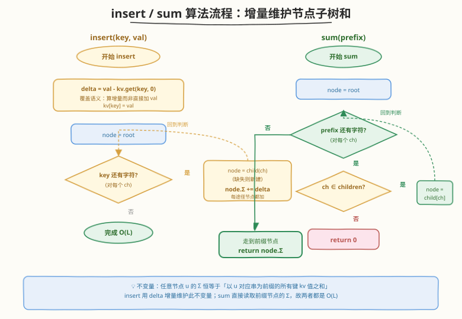
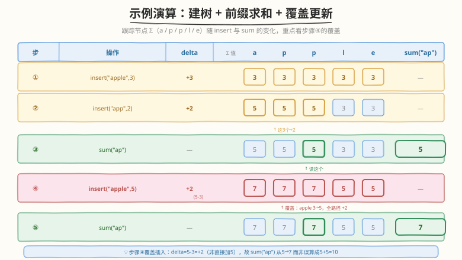

# 键值映射

- **题目名称**：键值映射
- **链接**：[677. 键值映射](https://leetcode.cn/problems/map-sum-pairs/)
- **难度**：中等
- **标签**：字典树、设计、哈希表、字符串

## 1. 题目概述

设计一个 **MapSum** 数据结构，支持两个操作：

- `insert(key, val)`：插入键值对 `(key, val)`。若 `key` **已存在**，则用新值**覆盖**原值（是覆盖，不是累加）。
- `sum(prefix)`：返回所有以 `prefix` 为前缀的 `key` 的 `val` 之和。

**示例 1**：

```text
输入：
  MapSum();
  insert("apple", 3);
  sum("ap");           // 3   —— 只有 "apple"=3
  insert("app", 2);
  sum("ap");           // 5   —— "apple"=3 + "app"=2
输出：[null, null, 3, null, 5]
```

**示例 2**（覆盖语义是最大坑点）：

```text
insert("apple", 3);   sum("ap") = 3
insert("apple", 2);   sum("ap") = 2   ← 覆盖，不是 3+2=5
insert("app", 2);     sum("ap") = 4   ← 2(apple 被覆盖为 2) + 2(app) = 4
```

**约束条件**：

- $1 \le \text{key.length}, \text{prefix.length} \le 50$
- `key` 和 `prefix` 仅由小写英文字母组成
- $1 \le \text{val} \le 1000$
- 最多调用 $50$ 次 `insert` 和 `sum`

> 💡 本题是 [208. 实现 Trie](../0201-0300/208_实现Trie.md) 的「带权前缀聚合」变体——不再只问「前缀是否存在」，而是问「该前缀下所有键的权值之和」。把每个 Trie 节点挂一个 `sum` 字段，记录**经过该节点的所有键值之和**，即可让 `insert` 与 `sum` 都是 $O(L)$。真正难点在 `insert` 的**覆盖语义**：直接沿路径累加会把覆盖误算成累加。

---

## 2. 解题思路

### 2.1 暴力思路：哈希表 + 前缀扫描

维护一个哈希表 `kv: key → val`。`insert` 直接 `kv[key] = val`（天然覆盖）；`sum(prefix)` 遍历 `kv` 中所有键，累加以 `prefix` 开头者。

```text
insert(key, val): kv[key] = val
sum(prefix):
    ans = 0
    for k, v in kv:
        if k startsWith prefix: ans += v
    return ans
```

时间：`insert` $O(1)$，`sum` $O(N \cdot L)$（$N$ 个键各做一次 $O(L)$ 前缀比较）。本题 $N, Q \le 50$、$L \le 50$，最坏 $50 \times 50 \times 50 \approx 1.25 \times 10^5$，**能过**。

> ⚠️ 暴力法的问题：每次 `sum` 都扫描**全体**键做前缀比较——大量无关键被重复检查，且共享前缀的键（如 `apple`/`app`/`april`）各自独立比较相同的头部。Trie 的价值正是**按前缀组织数据**：走一条 $O(L)$ 的路径直达前缀节点，即可拿到该前缀下所有键的聚合值。

### 2.2 核心观察：Trie + 节点子树和缓存


承接 [208](../0201-0300/208_实现Trie.md) 的 Trie 模板，在**每个节点**上挂一个 `sum` 字段，语义为「**经过该节点的所有键的 val 之和**」（即该节点子树里所有完整键的权值总和）。这样两个操作都退化成沿 Trie 走一条路径：

| 操作 | 走法 | 复杂度 |
|------|------|--------|
| `insert(key, val)` | 沿 `key` 逐字符下行，**每个途径节点的 `sum` 都加 `delta`** | $O(L)$ |
| `sum(prefix)` | 沿 `prefix` 下行到对应节点，**直接返回 `node.sum`**（路径不存在则 0） | $O(L)$ |

##### 为什么 `sum` 能 $O(1)$ 读取，无需 DFS 收集子树？

因为 `sum` 字段在 `insert` 时就**沿路径增量维护**好了——每插入一个键，它路径上的每个节点都「知道」自己子树里多了这个键的值。前缀节点 `p` 的 `sum`，正是所有以 `p` 对应串为前缀的键的 val 之和，正是 `sum(prefix)` 要的答案。这是典型的**以空间换时间**：把 `sum` 时的 $O(\text{子树大小})$ 收集，摊到 `insert` 时的 $O(L)$ 增量更新。

##### 覆盖语义的关键：用 `delta = val - old_val` 而非直接加 `val`

这是本题最大坑点。若 `insert` 每次沿路径加 `val`，则重复插入同一键会累加：

```text
insert("apple", 3)  → 路径 sum 各 +3
insert("apple", 2)  → 路径 sum 各 +2  ← 错！此时 "apple" 应为 2，不是 5
```

正确做法是维护一个全局 `kv: key → val` 记录每个键的当前值，插入时算 **增量** `delta = val - kv.get(key, 0)`，再沿路径加 `delta`，最后更新 `kv[key] = val`。这样覆盖语义自然成立：

```text
insert("apple", 3)  → delta = 3-0 = 3,   路径各 +3,  kv["apple"]=3
insert("apple", 2)  → delta = 2-3 = -1,  路径各 -1,  kv["apple"]=2   ← 净效果=覆盖
```

> 💡 **`delta` 法是「带覆盖的增量维护」通用范式**：凡是要在树/索引上维护「子树权值和」又允许覆盖更新的场景，先查旧值算 delta 再增量更新，比「先减旧值再加新值」两次遍历更省。本题先吃透它，[432. 全 O(1) 数据结构](https://leetcode.cn/problems/all-oone-data-structure/) 等带权设计题同理。

### 2.3 算法流程



```
MapSum():
    root = new TrieNode()        # sum 字段初值 0
    kv = {}                       # key -> 当前 val（覆盖检测用）

insert(key, val):
    delta = val - kv.get(key, 0)   # 关键：算增量而非直接加 val
    kv[key] = val
    node = root
    for ch in key:
        if ch not in node.children:
            node.children[ch] = new TrieNode()
        node = node.children[ch]
        node.sum += delta          # 每个途径节点都加 delta

sum(prefix):
    node = root
    for ch in prefix:
        if ch not in node.children: return 0   # 前缀路径不存在
        node = node.children[ch]
    return node.sum
```

**关键不变量**：

- 对任意节点 `u`，`u.sum` 恒等于「以 `u` 对应字符串为前缀的所有键的 `kv` 值之和」。`insert` 的 `delta` 增量更新保证此不变量在每次插入后仍成立。
- `kv` 表与 Trie 叶节点（`is_end` 标记位）的 val 是同一份事实的两份视图：`kv` 供 `insert` 算 delta，Trie 节点 `sum` 供 `sum` 读取。两者必须同步更新。
- `sum` 走到前缀对应节点后**无需再下探**——子树和已缓存在该节点，$O(1)$ 读取。

### 2.4 示例演算

以 `insert("apple",3)` → `insert("app",2)` → `sum("ap")` → `insert("apple",5)`（覆盖）→ `sum("ap")` 为例，观察 Trie 节点 `sum` 的变化（节点标注 `字符:sum`）：



| 步骤 | 操作 | delta | 路径节点 sum 变化 | kv | sum("ap") |
|------|------|-------|-------------------|----|-----------|
| ① | `insert("apple",3)` | $3-0=3$ | `a:0→3, p:0→3, p:0→3, l:0→3, e:0→3` | `{apple:3}` | — |
| ② | `insert("app",2)` | $2-0=2$ | `a:3→5, p:3→5, p:3→5`（`l,e` 不动） | `{apple:3, app:2}` | — |
| ③ | `sum("ap")` | — | 读 `ap` 对应节点（第二个 `p`）的 sum | 同上 | **5** |
| ④ | `insert("apple",5)` | $5-3=2$ | `a:5→7, p:5→7, p:5→7, l:3→5, e:3→5` | `{apple:5, app:2}` | — |
| ⑤ | `sum("ap")` | — | 读 `ap` 节点 sum | 同上 | **7** |

> 💡 **对比步骤③与⑤**：两者都读同一个 `ap` 节点的 `sum`，结果却从 5 变 7——因为步骤④的覆盖插入把 `"apple"` 从 3 改成 5，`delta=+2` 沿 `apple` 路径加到了 `a/p/p` 上（`l/e` 也同步更新）。若步骤④错误地直接加 `val=5`（而非 delta=2），`ap` 节点会变成 $5+5=10$，把覆盖误算成累加。这正是 `delta` 法的核心价值。

> ⚠️ **易错点**：`"app"` 是 `"apple"` 的前缀，插入 `"app"` 时只更新 `a-p-p` 三个节点，**不动 `l`/`e`**。因此 `l`/`e` 节点的 `sum` 仍是 3（只含 `apple` 的贡献）。若 `sum("appl")` 会被查询，走到 `l` 节点读到 3，正确。这体现了「节点 sum = 该节点子树的键值和」的局部性——每个节点只对自己负责的前缀负责。

---

## 3. 参考代码

### C++（数组版 Trie，26 叉）

```cpp
class MapSum {
    struct TrieNode {
        TrieNode* children[26] = {nullptr};
        int sum = 0;                       // 经过本节点的所有键值之和
    };
    TrieNode* root = new TrieNode();
    unordered_map<string, int> kv;         // key -> 当前 val（覆盖检测）

  public:
    MapSum() {}

    void insert(string key, int val) {
        int delta = val - kv[key];          // 旧值不存在时 kv[key] 默认 0
        kv[key] = val;
        TrieNode* node = root;
        for (char ch : key) {
            int idx = ch - 'a';
            if (!node->children[idx]) {
                node->children[idx] = new TrieNode();
            }
            node = node->children[idx];
            node->sum += delta;             // 每个途径节点都加增量
        }
    }

    int sum(string prefix) {
        TrieNode* node = root;
        for (char ch : prefix) {
            int idx = ch - 'a';
            if (!node->children[idx]) return 0;   // 前缀路径不存在
            node = node->children[idx];
        }
        return node->sum;
    }
};
```

### Python（dict 版 Trie，按需开子节点）

```python
class TrieNode:
    __slots__ = ("children", "sum")
    def __init__(self):
        self.children: dict[str, "TrieNode"] = {}
        self.sum = 0


class MapSum:
    def __init__(self):
        self.root = TrieNode()
        self.kv: dict[str, int] = {}

    def insert(self, key: str, val: int) -> None:
        delta = val - self.kv.get(key, 0)   # 关键：算增量而非直接加 val
        self.kv[key] = val
        node = self.root
        for ch in key:
            node = node.children.setdefault(ch, TrieNode())
            node.sum += delta               # 每个途径节点都加增量

    def sum(self, prefix: str) -> int:
        node = self.root
        for ch in prefix:
            if ch not in node.children:
                return 0                    # 前缀路径不存在
            node = node.children[ch]
        return node.sum
```

> ⚠️ **C++ 细节**：`kv[key]` 在 `key` 不存在时会默认插入并返回 0，所以 `val - kv[key]` 等价于 `val - kv.get(key, 0)`，无需先 `count`。但务必**先算 delta 再赋值** `kv[key] = val`，否则 `kv[key]` 已被改成新值，delta 恒为 0。
>
> ⚠️ **Python 细节**：用 `setdefault(ch, TrieNode())` 一行完成「取子节点 / 不存在则新建」，比 `if ch not in ... : ...[ch] = ...` 更紧凑。注意 `setdefault` 的第二参数每次都会被求值（即使无需新建），但 `TrieNode()` 很轻量，可接受。

---

## 4. 复杂度分析

| 维度 | 复杂度 | 说明 |
|------|--------|------|
| `insert` 时间 | $O(L)$ | 沿 `key` 走 $L$ 步，每步 $O(1)$（哈希查旧值 + 更新节点 `sum`）；$L = \|\text{key}\|$ |
| `sum` 时间 | $O(L)$ | 沿 `prefix` 走 $L$ 步直达前缀节点，$O(1)$ 读取 `sum`；$L = \|\text{prefix}\|$ |
| 空间复杂度 | $O\bigl(\sum_i \|\text{key}_i\|\bigr)$ | Trie 节点数 $\le \sum_i \|\text{key}_i\|$（共享前缀压缩）；额外 `kv` 表存 $N$ 个键值对 |

> 💡 本题规模极小（$N, Q, L \le 50$），Trie 与暴力哈希扫描都能 AC。选 Trie 的意义在于**展示「带权前缀聚合」范式**——当 $N$、$Q$ 放大到 $10^5$ 级时（如 [642. 设计搜索自动补全系统](642_设计搜索自动补全系统.md)），Trie 的 $O(L)$ 查询相对暴力的 $O(NL)$ 是数量级优势。

---

## 5. 扩展：前缀哈希法（$O(1)$ 查询的巧解）

若不追求 Trie 的可扩展性，只求 `sum` 最快，可用**前缀哈希法**。核心思想：维护 `prefix_sum: prefix → val 之和`，`insert` 时枚举 `key` 的所有前缀并加 delta，`sum` 直接哈希查询。

```python
from collections import defaultdict

class MapSum:
    def __init__(self):
        self.prefix_sum: dict[str, int] = defaultdict(int)
        self.kv: dict[str, int] = {}

    def insert(self, key: str, val: int) -> None:
        delta = val - self.kv.get(key, 0)
        self.kv[key] = val
        for i in range(1, len(key) + 1):        # 枚举 key 的所有前缀
            self.prefix_sum[key[:i]] += delta

    def sum(self, prefix: str) -> int:
        return self.prefix_sum[prefix]           # O(1) 查询
```

### C++

```cpp
class MapSum {
    unordered_map<string, int> prefix_sum;
    unordered_map<string, int> kv;

  public:
    void insert(string key, int val) {
        int delta = val - kv[key];
        kv[key] = val;
        for (int i = 1; i <= (int)key.size(); ++i) {
            prefix_sum[key.substr(0, i)] += delta;
        }
    }

    int sum(string prefix) {
        return prefix_sum[prefix];
    }
};
```

| 对比维度 | Trie + 节点 sum | 前缀哈希法 |
|----------|------------------|------------|
| `insert` | $O(L)$ | $O(L)$（生成 $L$ 个前缀串，每串 $O(L)$ 拷贝，实为 $O(L^2)$；用滚动切片可降） |
| `sum` | $O(L)$（走前缀路径） | $O(1)$（一次哈希查询） |
| 空间 | Trie 节点，共享前缀压缩 | 每键 $L$ 个前缀串，**不压缩** |
| 前缀不存在判定 | 走路径时子节点缺失即返回 0 | 哈希默认返回 0，天然成立 |
| 可扩展性 | 强：可加 `is_end`、子树 DFS、模糊匹配 | 弱：换查询语义需重建 |
| 面试推荐 | 展示 Trie + 增量维护功底 | 求最快 `sum` / 代码极简 |

> 💡 前缀哈希法的精妙在于：把「前缀求和」从「**在 Trie 上走路径找节点**」转化为「**直接哈希查前缀串**」——牺牲空间（不压缩共享前缀）换 `sum` 从 $O(L)$ 降到 $O(1)$。与 [676](676_实现一个魔法字典.md) 的「泛化邻居哈希」、[642](642_设计搜索自动补全系统.md) 的「暴力哈希扫描」同属「把树形查询拍平成哈希查询」的巧解家族。代价是 `insert` 要生成 $L$ 个前缀串，空间随键长平方膨胀。

---

## 6. 面试要点

1. **为什么 `insert` 要用 `delta = val - old_val` 而不是直接沿路径加 `val`？**

   > 题目要求覆盖语义——同一键重复插入时新值替换旧值，不是累加。若直接加 `val`，`insert("apple",3)` 后再 `insert("apple",2)` 会让路径 `sum` 变成 5，而正确答案应是 2。用 `delta = val - kv.get(key, 0)` 算增量，覆盖自然转化为「减旧加新」的净效果：第二次插入 `delta = 2 - 3 = -1`，路径 `sum` 从 3 变 2。务必**先算 delta 再更新 `kv[key]`**，否则 `kv[key]` 已是新值，delta 恒为 0。

2. **`sum` 为什么能 $O(1)$ 读取，不用 DFS 收集子树？**

   > 每个 Trie 节点的 `sum` 字段在 `insert` 时就沿路径增量维护好了——每插入一键，路径上每个节点都「知道」自己子树多了这个键的值。前缀节点的 `sum` 恰是该前缀下所有键的 val 之和，正是 `sum(prefix)` 的答案。这是「以空间换时间」：把查询时的 $O(\text{子树大小})$ 收集摊到插入时的 $O(L)$ 增量。

3. **`"app"` 是 `"apple"` 的前缀，插入 `"app"` 会影响 `apple` 路径上的 `l`/`e` 节点吗？**

   > 不会。插入 `"app"` 只沿 `a-p-p` 三个节点走，`delta` 只加到这三个节点上，`l`/`e` 不动。因此 `l`/`e` 的 `sum` 仍只含 `apple` 的贡献。若查 `sum("appl")`，走到 `l` 节点读到的是 `apple` 的值，正确。这体现「节点 sum = 该节点子树的键值和」的**局部性**：每个节点只对自己负责的前缀负责，前缀更长的查询会走到更深的节点读各自的 sum。

4. **Trie 法相比前缀哈希法，优势在哪？**

   > ① **共享前缀压缩空间**：同前缀簇（`apple`/`app`/`april`）在 Trie 里共享 `a-p` 子树，前缀哈希法各存各的前缀串。② **可扩展性**：Trie 节点可加 `is_end`、子树 DFS、模糊匹配（如 [676](676_实现一个魔法字典.md) 的带预算 DFS），前缀哈希法换查询语义需重建。③ **展示功底**：Trie + 增量维护是「带权前缀聚合」的标准范式。前缀哈希法的优势是 `sum` $O(1)$、代码极简，适合追求最快查询。

5. **如果 `sum` 调用远多于 `insert`，该选哪种实现？**

   > 选前缀哈希法。`insert` 一次性枚举所有前缀后，每次 `sum` 仅 $O(1)$ 哈希查询，常数极小；Trie 法每次 `sum` 需 $O(L)$ 走路径。预处理代价可摊销时，前缀哈希法的查询优势显著。反之若 `insert` 与 `sum` 交替频繁、或键长很大（前缀串空间膨胀），Trie 增量更新更友好。

> 💡 **一句话总结**：677 是 Trie 在「带权前缀聚合」场景的入门题——每个节点挂 `sum` 字段缓存子树权值和，`insert` 沿路径加 `delta`（覆盖用 `val - old_val`），`sum` 读前缀节点 $O(1)$ 返回。这套「节点缓存子树聚合 + 增量维护」范式与 [642](642_设计搜索自动补全系统.md) 的节点 `freq` 表同构，是 Trie 从「存在性查询」走向「聚合查询」的关键一步。

---

## 7. 同类练习题

- [208. 实现 Trie (前缀树)](https://leetcode.cn/problems/implement-trie-prefix-tree/)（[题解](../0201-0300/208_实现Trie.md)）：Trie 基础模板，`insert`/`search`/`startsWith` 三件套，本题直接复用其节点结构与 `insert`，先做 208 再做 677 零增量
- [642. 设计搜索自动补全系统](https://leetcode.cn/problems/design-search-autocomplete-system/)（[题解](642_设计搜索自动补全系统.md)）：Trie 节点挂 `freq` 表缓存前缀下句子热度，与本题「节点挂 `sum` 缓存前缀权值和」同构，对照「Top-K 排序」与「求和」两种聚合
- [676. 实现一个魔法字典](https://leetcode.cn/problems/implement-magic-dictionary/)（[题解](676_实现一个魔法字典.md)）：Trie + 带预算 DFS 做模糊匹配，对照「节点挂额外字段做不同查询」的设计思路，与本题的 `sum` 字段并列
- [648. 单词替换](https://leetcode.cn/problems/replace-words/)（[题解](648_单词替换.md)）：Trie 前缀精确匹配的最短词根，同属「前缀驱动查询」系列，对照「遇 `is_end` 短路」与「读节点 `sum`」两种前缀查询出口
- [1804. 实现 Trie II（前缀树）](https://leetcode.cn/problems/implement-trie-ii-prefix-tree/)：Trie 增强版，支持 `countWordsEqualTo`/`countWordsStartingWith`，与本题同为「节点挂计数/求和字段」的带权 Trie 设计
