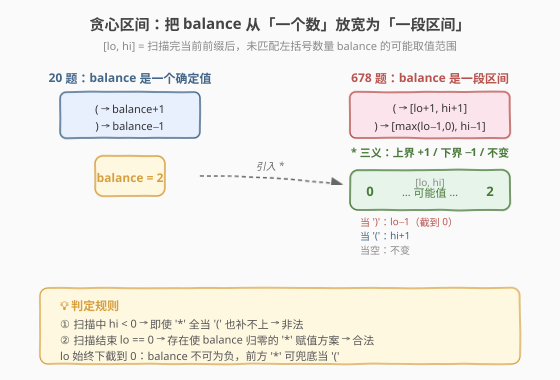
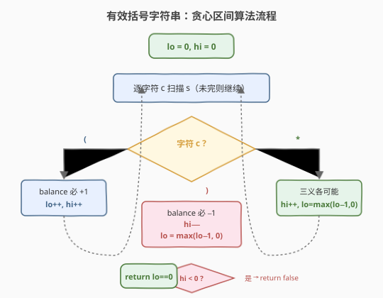
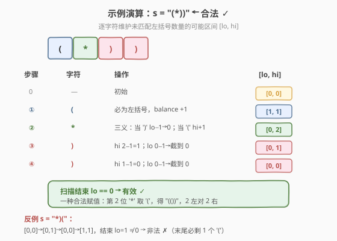

# 有效的括号字符串

- **题目名称**：有效的括号字符串
- **链接**：[678. 有效的括号字符串](https://leetcode.cn/problems/valid-parenthesis-string/)
- **难度**：中等
- **标签**：栈、贪心、动态规划、字符串

## 1. 题目概述

给定一个只包含 `'('`、`')'` 和 `'*'` 的字符串 `s`，判断它是否为**有效字符串**。其中 `'*'` 可以被视作单个右括号 `')'`、单个左括号 `'('` 或一个空字符串 `""`。

**有效** 字符串符合如下规则：

- 任何左括号 `'('` 必须有相应的右括号 `')'`。
- 任何右括号 `')'` 必须有相应的左括号 `'('`。
- 左括号 `'('` 必须在对应的右括号 `')'` 之前。
- `'*'` 可以被视为 `'('`、`')'` 或 `""`。

**示例 1**

```text
输入：s = "()"
输出：true
```

**示例 2**

```text
输入：s = "(*)"
输出：true
```

**示例 3**

```text
输入：s = "(*))"
输出：true
```

**约束条件**：

- `1 <= s.length <= 100`
- `s[i]` 为 `'('`、`')'` 或 `'*'`

## 2. 解题思路

### 2.1 暴力思路

对每个 `'*'` 枚举三种选择（左括号 / 右括号 / 空），递归回溯所有组合后用 20 题「有效括号」的单栈判定。设共有 $k$ 个 `'*'`，则组合数为 $3^k$，每次判定 $O(n)$，总复杂度 $O(3^k \cdot n)$，$n=100$ 时几乎不可行。

### 2.2 核心观察：贪心维护「未匹配左括号数量的可能区间」



本题相对 20 题唯一的变化是 `'*'` 的**多义性**。暴力思路的浪费在于：我们并不关心每个 `'*'` 具体选了什么，只关心**到当前位置为止，未匹配的左括号数量 `balance` 可能取哪些值**。

> 💡 **关键转化**：把 `balance` 从「一个确定的数」放宽为「一个可能取值集合」。又因该集合在每一步都**连续**（是一段整数区间），只需维护区间下界 `lo` 与上界 `hi`。

设 `[lo, hi]` 表示扫描完当前前缀后，`balance` 可能落入的整数区间：

- `lo`：**最少**还剩多少个未匹配的左括号（尽量把 `'*'` 当 `')'` 或空用掉）
- `hi`：**最多**还能剩多少个未匹配的左括号（尽量把 `'*'` 当 `'('` 累积）

**核心策略**：逐字符更新 `[lo, hi]`，一旦 `hi < 0` 说明即使把所有 `'*'` 都当 `'('` 也补不上当前 `')'`，直接判非法；最终 `lo == 0` 说明存在一种选择让 `balance` 恰好归零。

### 2.3 算法流程



```
1. 初始化 lo = 0, hi = 0
2. 逐字符扫描 s：
   a. 若 '(' → balance 必 +1
        lo++, hi++
   b. 若 ')' → balance 必 −1
        hi−−；若 hi < 0 → return false
        lo = max(lo − 1, 0)      // balance 不能为负，下界不低于 0
   c. 若 '*' → 三种选择各可能
        hi++                     // 当 '(' 用：上界 +1
        lo = max(lo − 1, 0)      // 当 ')' 用：下界 −1（不低于 0）；当空用：不变
3. 扫描结束：return lo == 0      // 存在使 balance 归零的选择
```

> ⚠️ **两个易错点**：
> 1. `lo` 必须**下取到 0**：`balance` 在任何合法前缀中都不能为负，负值代表出现了无法补救的 `')'`，但因为我们总能把前面的 `'*'` 解释成 `'('` 来兜底，所以「最小可能值」不能低于 0。
> 2. **`hi < 0` 才是真非法**：只有当即便把所有 `'*'` 都当 `'('` 仍然不够用时（`hi < 0`），才确定无解；`lo` 变成 0 不代表非法，只代表「最少也得把一些 `'*'` 当 `')'`/空用掉」。

### 2.4 示例演算



以 `s = "(*))"` 为例（对应示例 3）：

| 步骤 | 字符 | 操作 | `[lo, hi]` | 说明 |
|------|------|------|-----------|------|
| 0 | — | 初始 | `[0, 0]` | 空串 balance=0 |
| ① | `(` | 必为左括号 | `[1, 1]` | balance +1 |
| ② | `*` | 三义 | `[0, 2]` | 下界可当 `')'` 抵消至 0；上界可当 `'('` 升至 2 |
| ③ | `)` | 必为右括号 | `[0, 1]` | hi 2−1=1，lo 0−1→截到 0 |
| ④ | `)` | 必为右括号 | `[0, 0]` | hi 1−1=0，lo 0−1→截到 0 |

扫描结束 `lo == 0` → **有效** ✓

对应的合法赋值：`'('` `'('` `')'` `')'` `')'`（第 2 位 `'*'` 取 `'('`，共 2 个左对 2 个右）。

再以 `s = "*)("` 为反例：

| 步骤 | 字符 | 操作 | `[lo, hi]` | 说明 |
|------|------|------|-----------|------|
| 0 | — | 初始 | `[0, 0]` | — |
| ① | `*` | 三义 | `[0, 1]` | lo 截到 0 |
| ② | `)` | 必为右括号 | `[0, 0]` | hi 1−1=0 |
| ③ | `(` | 必为左括号 | `[1, 1]` | balance +1 |

扫描结束 `lo = 1 ≠ 0` → **非法** ✗（末尾必剩一个未匹配的 `'('`）。

## 3. 参考代码

### C++

```cpp
class Solution {
public:
    bool checkValidString(string s) {
        int lo = 0, hi = 0;  // 未匹配左括号数量的可能区间 [lo, hi]
        for (char c : s) {
            if (c == '(') {
                lo++; hi++;
            } else if (c == ')') {
                hi--;
                if (hi < 0) return false;   // 即便 '*' 全当 '(' 也补不上
                lo = max(lo - 1, 0);
            } else { // c == '*'
                hi++;                       // 当 '('
                lo = max(lo - 1, 0);        // 当 ')' 或空
            }
        }
        return lo == 0;
    }
};
```

### Python

```python
class Solution:
    def checkValidString(self, s: str) -> bool:
        lo = hi = 0  # 未匹配左括号数量的可能区间 [lo, hi]
        for c in s:
            if c == '(':
                lo += 1
                hi += 1
            elif c == ')':
                hi -= 1
                if hi < 0:          # 即便 '*' 全当 '(' 也补不上
                    return False
                lo = max(lo - 1, 0)
            else:  # c == '*'
                hi += 1             # 当 '('
                lo = max(lo - 1, 0) # 当 ')' 或空
        return lo == 0
```

## 4. 复杂度分析

| 维度 | 复杂度 | 说明 |
|------|--------|------|
| **时间** | `O(n)` | 单趟扫描，每个字符 $O(1)$ 更新 `lo`/`hi` |
| **空间** | `O(1)` | 仅维护两个整型变量，无栈无 DP 表 |

## 5. 扩展：双栈与动态规划解法

### 5.1 双栈法

维护两个栈：`left` 存 `'('` 的下标，`star` 存 `'*'` 的下标。遇 `')'` 时优先用 `left` 栈顶匹配，否则用 `star` 栈顶匹配，两者皆空则非法。扫描结束后，逐一弹出 `left` 栈顶，要求存在一个**下标更大**的 `star` 栈顶与之配对（保证 `'*'` 充当 `')'` 时位于该 `'('` 之后）。时间 $O(n)$，空间 $O(n)$，思路直观但常数与代码量大于贪心区间法。

### 5.2 区间动态规划

定义 `dp[i][j]` 表示子串 `s[i..j]` 是否合法。转移分两类：

- `s[i] == '(' 且 s[j] == ')'`（或 `s[j] == '*'` 当 `')'`）且 `dp[i+1][j-1]` 为真；
- 存在切点 $k$ 使 `dp[i][k] 且 dp[k+1][j]`。

边界：`dp[i][i]` 为真当且仅当 `s[i] == '*'`（单字符只能由 `'*'` 当空串）。时间 $O(n^3)$，空间 $O(n^2)$，$n \le 100$ 可过，但远不如贪心优雅，适合作为「DP 思维训练」。

## 6. 面试要点

**Q1：为什么维护区间而不是精确的 balance 值？**
> `'*'` 的多义性让 balance 在每一步不再唯一，而是一个可能取值集合。该集合始终连续，故用 `[lo, hi]` 两端点即可刻画，避免回溯枚举 $3^k$ 种组合。

**Q2：`lo` 为什么要 `max(·, 0)` 截断？**
> balance 在任何合法前缀中都不能为负（负值即出现无法匹配的 `')'`）。由于前面的 `'*'` 总能被解释成 `'('` 来兜底，所以「最小可能 balance」不会低于 0；截到 0 表示「我们有余量把 balance 维持非负」。

**Q3：为什么 `hi < 0` 才判非法，而 `lo` 变化不判非法？**
> `hi` 表示「把所有 `'*'` 都当 `'('`」后的最大 balance。连它都降到负数，说明这个 `')'` 无论如何都补不上，必然非法。`lo` 只反映「最少还剩多少左括号」，它取 0 不代表无解，只代表需要把部分 `'*'` 当 `')'`/空用掉。

**Q4：最终为什么是 `lo == 0` 而不是 `lo <= 0`？**
> `lo` 始终被截断在 $\ge 0$，故只需判 `lo == 0`：说明存在一种 `'*'` 赋值方案使末尾 balance 恰好为 0，即所有左括号都被闭合。

**Q5：贪心法与双栈法各自的优势？**
> 贪心法空间 $O(1)$、代码最短，是面试首选。双栈法空间 $O(n)$，但思路更接近 20 题单栈，便于延伸到「需要还原具体匹配方案」的变体。

## 7. 同类练习题

- [20. 有效的括号](https://leetcode.cn/problems/valid-parentheses/)（[题解](../0001-0100/20_有效括号.md)）：本题的基础版，无 `'*'`，单栈匹配
- [32. 最长有效括号](https://leetcode.cn/problems/longest-valid-parentheses/)（[题解](../0001-0100/32_最长有效括号.md)）：在合法判定上求最长合法子串，栈或 DP
- [2116. 判断一个括号字符串是否有效](https://leetcode.cn/problems/check-if-a-parentheses-string-can-be-valid/)：部分位置被锁定不可改的括号串判定，仍是贪心区间思想的延伸
- [636. 函数的独占时间](https://leetcode.cn/problems/exclusive-time-of-functions/)：单栈模拟括号配对并统计区间，栈语义的另一种应用
