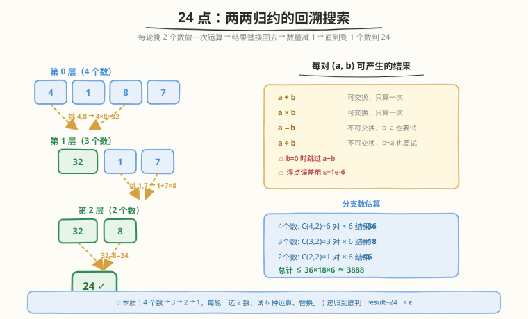
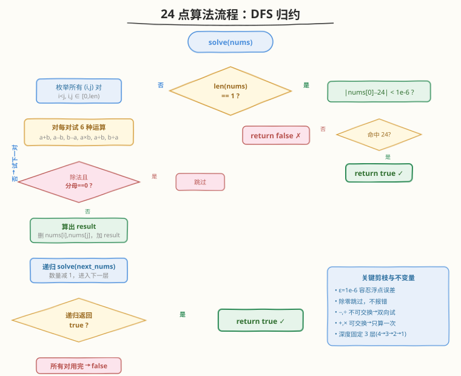

# LeetCode 24 点游戏 题解

## 1. 题目概述

- **标题 / 题号**：24 点游戏（#679，hard）
- **链接**：https://leetcode.cn/problems/24-game/
- **难度**：困难
- **标签**：数组、回溯

**题意**：给定 4 张写有数字的卡片（每个数字在 $1$ 到 $9$ 之间，可能有重复），判断能否通过 `+`、`-`、`*`、`/` 四则运算及括号的**任意组合**，使最终结果恰好等于 $24$。

**规则**：

- 每张卡片**必须且只能使用一次**
- 运算顺序任意（括号任意嵌套）
- 除法是**实数除法**（非整数除法），如 $5 / 2 = 2.5$
- 允许中间结果为任意实数（包括负数、小数、零）

**示例 1**：

```text
输入：cards = [1, 2, 3, 4]
输出：true
解释：(1 + 2 + 3) * 4 = 24，或 1 * 2 * 3 * 4 = 24
```

**示例 2**：

```text
输入：cards = [1, 2, 1, 2]
输出：false
解释：穷举所有运算组合，均无法得到 24
```

**约束**：

- $\text{cards.length} == 4$
- $1 \le \text{cards}[i] \le 9$

> 💡 本题与 [46 全排列](../0001-0100/46_全排列.md)、[39 组合总和](../0001-0100/39_组合总和.md) 同属回溯家族，但决策对象从「选元素」变成「选两个数做运算」——每次决策将列表长度缩减 1，从 4 个数层层归约到 1 个数再判 24。核心是**两两归约**的递归框架。

## 2. 解题思路

### 2.1 暴力思路：枚举所有表达式

最朴素的想法是穷举所有可能的表达式树：4 个数有 $4! = 24$ 种排列，每两个数之间选 3 个运算符共 $4^3 = 64$ 种，再配合 5 种括号方式——总组合数虽不算大，但手动枚举括号结构极易遗漏或重复。

更系统的做法是**不关心括号怎么加**，而是把「加括号」等价为「运算顺序」：任意带括号的表达式都对应一种「两两合并」的次序。例如 $(1+2)\times(3+4)$ 等价于先合并 $1+2 \to 3$、再合并 $3+4 \to 7$、最后 $3 \times 7 \to 21$。于是问题转化为：**不断从当前数列表中挑两个做运算、用结果替换它们，直到剩一个数判 24**。

> ⚠️ 这种「两两归约」等价覆盖了所有括号嵌套方式。任意表达式树的自底向上归约顺序就对应一条「挑对→运算→替换」的路径，不会遗漏任何表达式。

### 2.2 核心观察：两两归约的回溯搜索



关键洞察是**将 4 个数逐步归约为 1 个数**，每步从当前列表中任选 2 个数 $a, b$，尝试以下 6 种运算结果（用结果替换 $a, b$，列表长度减 1）：

| 运算 | 结果 | 说明 |
|------|------|------|
| $a + b$ | $a + b$ | 加法可交换，只算一次 |
| $a \times b$ | $a \times b$ | 乘法可交换，只算一次 |
| $a - b$ | $a - b$ | 减法不可交换，**还需试** $b - a$ |
| $b - a$ | $b - a$ | 同上，反向 |
| $a \div b$ | $a / b$ | 除法不可交换，**还需试** $b / a$（$b \ne 0$） |
| $b \div a$ | $b / a$ | 同上，反向（$a \ne 0$） |

**递归终止**：列表只剩 1 个数时，判断 $|\text{result} - 24| < \varepsilon$（$\varepsilon = 10^{-6}$）。

> 💡 **为什么要 6 种而非 4 种？** 加法 $a+b$ 和乘法 $a \times b$ 满足交换律，$a$ 在前 $b$ 在后与反过来结果相同，各算一次即可。减法和除法不满足交换律（$a-b \ne b-a$，$a/b \ne b/a$），必须两个方向都试。因此每对 $(a, b)$ 产生 $2 + 2\times2 = 6$ 个候选结果。

> ⚠️ **浮点误差是本题最大陷阱**。除法会产生无限小数（如 $8/3 = 2.666\ldots$），经过多步运算误差会累积。因此最终判定**绝不能用 `==`** 比较浮点数，必须用 $|\text{result} - 24| < \varepsilon$。一般取 $\varepsilon = 10^{-6}$ 即可。

##### 分支数估算

| 层数 | 列表长度 | 选对数 $\text{C}(n,2)$ | 每对结果数 | 本层分支 |
|------|----------|------------------------|------------|----------|
| 0 | 4 | $\text{C}(4,2)=6$ | 6 | $36$ |
| 1 | 3 | $\text{C}(3,2)=3$ | 6 | $18$ |
| 2 | 2 | $\text{C}(2,2)=1$ | 6 | $6$ |

总分支 $\le 36 \times 18 \times 6 = 3888$，规模极小，暴力回溯轻松 AC。

### 2.3 算法流程



```
solve(nums):
    if len(nums) == 1:
        return |nums[0] - 24| < 1e-6

    for i in range(len(nums)):
        for j in range(len(nums)):
            if i == j: continue
            a, b = nums[i], nums[j]
            next = [nums[k] for k in range(len(nums)) if k != i and k != j]
            # 加法 / 乘法（可交换，只需一个方向）
            for r in [a+b, a*b]:
                if solve(next + [r]): return true
            # 减法（不可交换，两个方向）
            if solve(next + [a-b]): return true
            # 除法（不可交换，两个方向，判除零）
            if abs(b) > 1e-6 and solve(next + [a/b]): return true
    return false

judgePoint24(cards): return solve(list(cards))
```

**关键不变量**：

- 每轮从 `nums` 中选 2 个数，把其余数 + 运算结果组成新列表递归——列表长度严格减 1，递归深度固定为 3（$4 \to 3 \to 2 \to 1$）。
- `next` 列表排除了被选中的 $i, j$ 两个位置，保留剩余数原样传递，避免索引错位。
- 任一分支命中即短路返回 `true`，无需搜索全部空间。

> 💡 **两种代码写法**：上面伪代码用 `for i, for j, i!=j` 枚举**有序对**，减法只写 $a-b$（因为 $(i,j)$ 和 $(j,i)$ 都会被枚举到，$a-b$ 覆盖了 $b-a$）。另一种写法用 `for i<j` 枚举**无序对**，减法和除法各写两个方向。两种等价，前者代码稍简洁，后者分支数显式为 6。下面的参考代码采用前者。

### 2.4 示例演算

以 `cards = [1, 2, 3, 4]` 为例，展示一条成功路径与一条失败回溯分支：

![示例演算：[1,2,3,4]](../images/24game_example_walkthrough.svg)

**成功路径**：

| 层 | 列表 | 选对 | 运算 | 结果列表 |
|----|------|------|------|----------|
| 0 | $[1, 2, 3, 4]$ | $2, 3$ | $2 \times 3 = 6$ | $[1, 6, 4]$ |
| 1 | $[1, 6, 4]$ | $1, 6$ | $1 \times 6 = 6$ | $[6, 4]$ |
| 2 | $[6, 4]$ | $6, 4$ | $6 \times 4 = 24$ | $[24]$ |
| 3 | $[24]$ | — | $|24 - 24| < 10^{-6}$ | ✓ `true` |

等价表达式：$1 \times 2 \times 3 \times 4 = 24$。

**失败回溯分支**：

| 层 | 列表 | 选对 | 运算 | 结果列表 |
|----|------|------|------|----------|
| 0 | $[1, 2, 3, 4]$ | $1, 2$ | $1 + 2 = 3$ | $[3, 3, 4]$ |
| 1 | $[3, 3, 4]$ | $3, 3$ | $3 - 3 = 0$ | $[0, 4]$ |
| 2 | $[0, 4]$ | $0, 4$ | $0+4, 0-4, 4-0, 0\times4, 0/4$ 均非 24；$4/0$ 跳过 | ✗ 回溯 |

> 💡 失败分支会在 `solve([0, 4])` 处穷尽 6 种运算都不命中 24，返回 `false`，触发回溯到上一层继续尝试其他选对/运算。DFS 自动管理回溯，无需手动撤销。

> ⚠️ `cards = [1, 2, 1, 2]` 返回 `false`：虽然看似能凑出不少中间值，但穷举所有 $\le 3888$ 种归约路径均无法命中 24。这正说明「暴力穷举」的必要性——没有巧妙剪枝能替代完整搜索。

## 3. 参考代码

### C++

```cpp
class Solution {
    const double EPS = 1e-6;

    bool solve(vector<double>& nums) {
        int n = nums.size();
        if (n == 1) {
            return abs(nums[0] - 24.0) < EPS;
        }
        // 枚举有序对 (i, j), i != j
        for (int i = 0; i < n; ++i) {
            for (int j = 0; j < n; ++j) {
                if (i == j) continue;
                double a = nums[i], b = nums[j];
                vector<double> next;
                for (int k = 0; k < n; ++k) {
                    if (k != i && k != j) next.push_back(nums[k]);
                }
                // 加法、乘法（可交换，有序对已覆盖两方向，只算一次）
                for (double r : {a + b, a * b}) {
                    next.push_back(r);
                    if (solve(next)) return true;
                    next.pop_back();
                }
                // 减法
                next.push_back(a - b);
                if (solve(next)) return true;
                next.pop_back();
                // 除法（判除零）
                if (abs(b) > EPS) {
                    next.push_back(a / b);
                    if (solve(next)) return true;
                    next.pop_back();
                }
            }
        }
        return false;
    }

  public:
    bool judgePoint24(vector<int>& cards) {
        vector<double> nums(cards.begin(), cards.end());
        return solve(nums);
    }
};
```

### Python

```python
class Solution:
    EPS = 1e-6

    def _solve(self, nums: list[float]) -> bool:
        if len(nums) == 1:
            return abs(nums[0] - 24) < self.EPS
        n = len(nums)
        for i in range(n):
            for j in range(n):
                if i == j:
                    continue
                a, b = nums[i], nums[j]
                nxt = [nums[k] for k in range(n) if k != i and k != j]
                # 加法、乘法
                for r in (a + b, a * b):
                    if self._solve(nxt + [r]):
                        return True
                # 减法
                if self._solve(nxt + [a - b]):
                    return True
                # 除法（判除零）
                if abs(b) > self.EPS:
                    if self._solve(nxt + [a / b]):
                        return True
        return False

    def judgePoint24(self, cards: List[int]) -> bool:
        return self._solve([float(x) for x in cards])
```

> ⚠️ **易错点**：
> - **浮点比较**：终止条件必须用 `abs(nums[0] - 24) < EPS`，绝不能写 `nums[0] == 24`。除法产生的无限小数经过多步运算，浮点误差可能使结果变成 `23.999999` 或 `24.000001`。
> - **除零保护**：除法前必须检查 `abs(b) > EPS`。虽然题目说数字在 1-9 之间，但中间结果（如 $3 - 3 = 0$）可能为零，除以零会产生 `inf` 或 `NaN`，导致后续比较出错。
> - **加法/乘法不要重复试两方向**：代码用有序对 $(i, j)$ 枚举，$(i,j)$ 和 $(j,i)$ 都会出现，因此 $a+b$ 只需算一次（否则白白多搜一倍）。若用无序对 $i < j$，则减法和除法各需写 $a-b, b-a, a/b, b/a$ 四行。
> - **`next` 列表必须排除 $i, j$**：构造新列表时只保留未被选中的数，否则会导致同一数被重复使用，违反「每张卡片只用一次」。

## 4. 复杂度分析

| 维度 | 复杂度 | 说明 |
|------|--------|------|
| **时间复杂度** | $O(1)$ | 固定 4 个数，分支数 $\le 36 \times 18 \times 6 = 3888$，每步常数操作，总量为常数级 |
| **空间复杂度** | $O(1)$ | 递归深度固定 3 层，每层列表 $\le 4$ 元素，调用栈与临时列表均 $O(1)$ |

> 💡 严格说时间复杂度是 $O(1)$（与输入规模无关，4 个数固定）。若推广到 $n$ 个数，复杂度为 $O\bigl(\text{C}(n,2)^2 \cdot 6^{n-1} \cdot n!\bigr)$ 量级——指数级，但本题 $n=4$ 足够小。实际运行中由于短路返回（找到一条路径即停），平均情况远小于 3888。

## 5. 扩展：n 个数凑 24 点

若将题目推广到 $n$ 个数凑目标值 $\text{target}$，算法框架完全不变，只需：

1. 把 `solve` 的终止条件改为 `abs(nums[0] - target) < EPS`
2. 枚举有序对 $(i, j)$ 的循环自动适配 `n = len(nums)`

```python
def can_make(nums: list[float], target: float, eps: float = 1e-6) -> bool:
    if len(nums) == 1:
        return abs(nums[0] - target) < eps
    n = len(nums)
    for i in range(n):
        for j in range(n):
            if i == j:
                continue
            a, b = nums[i], nums[j]
            rest = [nums[k] for k in range(n) if k != i and k != j]
            for r in (a + b, a * b, a - b):
                if can_make(rest + [r], target, eps):
                    return True
            if abs(b) > eps and can_make(rest + [a / b], target, eps):
                return True
    return False
```

> ⚠️ $n$ 增大时分支数指数爆炸（$n=5$ 约 $10^4$，$n=6$ 约 $10^6$）。实际 24 点游戏中 $n$ 通常 $\le 4$，本框架足够。若需优化，可加**剪枝**：如中间结果绝对值过大（$> 10^4$）或过小（$< 10^{-4}$ 且非零）时剪掉，但效果有限且可能误剪，需谨慎。

> 💡 另一种等价实现是**表达式枚举法**：枚举 4 个数的排列（$4! = 24$）、3 个运算符（$4^3 = 64$）、5 种括号结构，共 $24 \times 64 \times 5 = 7680$ 种表达式逐一求值。此法思路直白但需手动枚举括号结构（如 `((a∘b)∘c)∘d`、`(a∘(b∘c))∘d`、`(a∘b)∘(c∘d)`、`a∘((b∘c)∘d)`、`a∘(b∘(c∘d))`），易遗漏。两两归约法将括号结构隐含在归约顺序中，更优雅且不易出错。

## 6. 面试要点

1. **为什么两两归约能覆盖所有括号嵌套？**

   > 任意带括号的四则运算表达式都对应一棵**表达式树**（运算符为内部节点，操作数为叶子）。对这棵树自底向上归约——每合并两个子树的结果就对应一次「选 2 数做运算」——最终根节点即整个表达式的值。因此穷举所有归约顺序 = 穷举所有表达式树 = 穷举所有括号嵌套方式，不会遗漏。

2. **为什么必须用浮点误差 $\varepsilon$ 而不能直接 `==` 比较？**

   > 除法会产生无限循环小数（如 $1/3 = 0.333\ldots$），浮点存储有截断。多步运算后误差累积，最终结果可能是 $23.9999998$ 或 $24.000001$ 而非精确的 24。用 `abs(result - 24) < 1e-6` 容忍这种误差。一般 $\varepsilon$ 取 $10^{-6}$ 即可平衡精度与容错。

3. **为什么除法要检查除零，加法/减法/乘法不用？**

   > 题目说输入数字在 1-9 之间，但**中间结果**可能为零（如 $3 - 3 = 0$）。除以零在 IEEE 754 中产生 `inf`/`NaN`，后续比较 `abs(inf - 24) < EPS` 会得到 `false`（不会报错但浪费搜索）。更危险的是 `NaN` 参与运算会传播，可能掩盖本该命中的路径。因此除法前必须检查 `abs(b) > EPS`。加/减/乘不会产生非法值，无需检查。

4. **有序对 $(i, j)$ 和无序对 $i < j$ 两种写法有什么区别？**

   > **有序对**（`for i, for j, i != j`）：$(i,j)$ 和 $(j,i)$ 都出现，因此减法 $a - b$ 只写一次（$(j,i)$ 时自动覆盖 $b - a$）。加法/乘法也只写一次但会被重复搜索一次（$a+b$ 和 $b+a$ 等价），有少量冗余。**无序对**（`for i < j`）：每对只出现一次，减法/除法各需写两个方向。两者等价，分支数前者约 $12 \times 6 = 72$（4个数有序对 $4\times3=12$），后者 $6 \times 6 = 36$。无序对分支更少但代码多几行；有序对代码简洁但多搜一倍。本题规模小，两种都秒过。

5. **能否加剪枝优化？**

   > 可以，但效果有限且需谨慎。常见剪枝：① 中间结果绝对值过大（如 $> 10^4$）时剪掉——因为后续运算很难把它拉回 24；② 中间结果为极小非零值（如 $< 10^{-4}$）时剪掉——后续乘法放大后误差不可控。但这些剪枝可能误剪合法路径（如 $8 / (3 - 8/3)$ 这种经典 24 点解中 $3 - 8/3 = 1/3$ 很小但合法），因此不建议在面试中主动加。短路返回（找到即停）已是最有效的「剪枝」。

> 💡 **一句话总结**：679 的核心是「**把带括号的四则运算转化为两两归约的回溯搜索**」——每轮选 2 个数、试 6 种运算结果、用结果替换原数、列表长度减 1，递归到底判 $|\text{result} - 24| < \varepsilon$。难点不在算法框架，而在浮点误差比较、除零保护、交换律去重三个工程细节。

## 同类练习题

| # | 题目 | 与本题的关联 |
|---|------|-------------|
| 46 | [全排列](https://leetcode.cn/problems/permutations/)（[题解](../0001-0100/46_全排列.md)） | 回溯模板入门，「选-递归-撤销」三步法，679 的选对归约是其变体（选 2 数而非 1 数） |
| 39 | [组合总和](https://leetcode.cn/problems/combination-sum/)（[题解](../0001-0100/39_组合总和.md)） | 回溯 + 剪枝，候选集可重复选，对比 679 的「每数只用一次」约束 |
| 22 | [括号生成](https://leetcode.cn/problems/generate-parentheses/)（[题解](../0001-0100/22_括号生成.md)） | 回溯生成合法括号串，与 679 的「运算顺序即括号嵌套」思想互补——前者显式构造括号，后者隐式归约等价括号 |
| 282 | [表达式添加运算符](https://leetcode.cn/problems/expression-add-operators/) | 给数字串插入 $+/-/*$ 使表达式等于目标值，同样是「回溯枚举运算符」但需处理乘法优先级与拼接数字，难度更高 |
| 247 | [中心对称数 II](https://leetcode.cn/problems/strobogrammatic-number-ii/) | 回溯构造满足对称性的数字串，另一种「每步做选择、递归到底收集结果」的回溯应用 |
