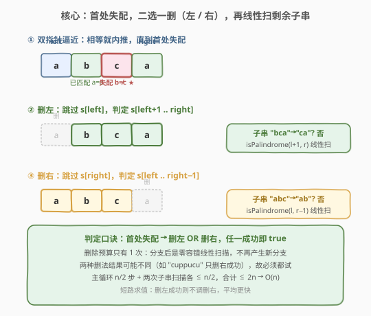
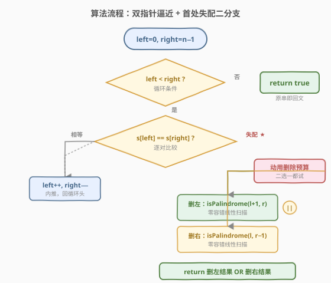
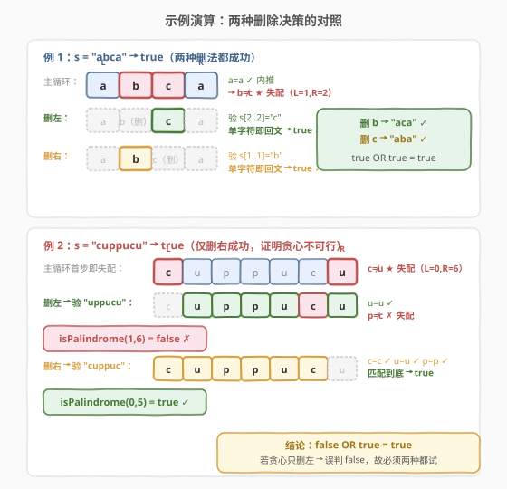

# LeetCode 验证回文串 II 题解

## 1. 题目概述

- **标题 / 题号**：验证回文串 II（#680，easy）
- **链接**：https://leetcode.cn/problems/valid-palindrome-ii/
- **难度**：简单
- **标签**：双指针、字符串、贪心

**题意**：给你一个字符串 `s`，**最多可以删除其中的一个字符**，判断是否能把它变成**回文串**。

回文串即正读反读都相同的字符串。本题是 [125. 验证回文串](https://leetcode.cn/problems/valid-palindrome/) 的进阶版：允许「擦掉」一个字符再判定。

**示例 1**：

```text
输入：s = "aba"
输出：true
解释：本身已是回文，无需删除。
```

**示例 2**：

```text
输入：s = "abca"
输出：true
解释：删除字符 'b'（或 'c'），得到 "aca"（或 "aba"），都是回文。
```

**示例 3**：

```text
输入：s = "abc"
输出：false
解释：删任意一个字符都得不到回文（"bc"/"ac"/"ab" 均非回文）。
```

**约束**：

- $1 \leq \text{s.length} \leq 10^5$
- `s` 由小写英文字母组成

> 💡 **关键约束**：「最多删 1 个」给了我们**一次容错机会**。朴素回文判定用左右双指针向中间逼近，遇到首对不等的字符即判否；本题允许在「首对不等」处**二选一删掉一个**，再继续判定剩余子串是否回文。注意：只有**第一次失配**才有资格动用这次删除——之后不再有容错预算。

## 2. 解题思路

### 2.1 暴力思路：枚举删谁

对每个下标 `i`，删掉 `s[i]` 后用双指针判定剩余子串是否回文。共 $n$ 个候选，每次判定 $O(n)$，总时间 $O(n^2)$。当 $n = 10^5$ 时约 $10^{10}$ 次操作，**必然超时**。

> ⚠️ 暴力法暴露一个事实：绝大多数删除位置根本「轮不到」被尝试。回文判定是从两端向中间逼近的，**只有失配处附近的那一两个字符才值得删**——前面已匹配的部分无需改动。这把 $n$ 个候选压缩到了**最多 2 个**。

### 2.2 核心观察：首处失配，二选一删



用左右双指针 `left`、`right` 从两端向中间逼近：

- 若 `s[left] == s[right]`：正常向内推进 `left++`、`right--`。
- 若 `s[left] != s[right]`：这是**首处失配**，动用唯一一次删除预算，**两种删法**各试一次：
  1. **删左**：跳过 `s[left]`，判定子串 `s[left+1 .. right]` 是否回文。
  2. **删右**：跳过 `s[right]`，判定子串 `s[left .. right-1]` 是否回文。
- 只要两种删法中有一种得到回文，即返回 `true`；都失败则 `false`。

> 💡 **为什么只需在「首处失配」分支，后续不必再递归尝试？** 因为删除预算只有 1 次，用掉之后子串的回文判定就退化为普通的「零容错」回文检查——一对失配即判否。所以分支后是一条**线性的双指针扫描**，不再产生新的分支。这正是把 $O(n^2)$ 压成 $O(n)$ 的关键。

> ⚠️ **能不能只试一种删法（贪心）？** 不能。反例 `s = "cuppucu"`：首处失配在 `c`（左）与 `u`（右）。若只删左得到 `"uppucu"` 非回文，但删右得到 `"cuppuc"` 是回文。两种删法结果不同，必须**都试**。详见第 6 节面试要点 Q2。

### 2.3 算法流程图



算法步骤：

1. 初始化 `left = 0`、`right = n - 1`。
2. 循环 `while left < right`：
   - 若 `s[left] == s[right]`：`left++`、`right--`，继续。
   - 若 `s[left] != s[right]`：返回 `isPalindrome(s, left+1, right) || isPalindrome(s, left, right-1)`。
3. 循环正常结束（未出现失配），返回 `true`（原串本身回文）。

其中 `isPalindrome(s, l, r)` 是普通的零容错双指针回文判定：逐对比较，遇失配即返回 `false`，全部匹配返回 `true`。

### 2.4 示例演算

以 `s = "abca"` 为例，看双指针如何在首处失配处二选一删法得到 `true`：



| 步骤 | left | right | s[left] | s[right] | 判定 | 动作 |
|------|------|-------|---------|----------|------|------|
| 初始 | 0 | 3 | a | a | 相等 | left=1, right=2 |
| 2 | 1 | 2 | b | c | 失配 ★ | 动用删除预算，二选一 |
| 删左 | — | — | — | — | 验 s[2..2]="c" | 单字符即回文 → true ✓ |
| 删右 | — | — | — | — | 验 s[1..1]="b" | 单字符即回文 → true ✓ |

两种删法都得到回文（删 `b` 得 `"aca"`，删 `c` 得 `"aba"`），返回 `true`。注意：外层 `a==a` 已匹配，失配后只需验证中间剩余的 1 个字符。

对照反例 `s = "cuppucu"`（验证「必须二选一都试」）：

| 步骤 | left | right | s[left] | s[right] | 判定 | 动作 |
|------|------|-------|---------|----------|------|------|
| 初始 | 0 | 6 | c | u | 失配 ★ | 动用删除预算，二选一 |
| 删左 | 1 | 6 | u | u | 验 "uppucu" | u=u ✓，再 p≠c 失配 → false |
| 删右 | 0 | 5 | c | c | 验 "cuppuc" | c=c, u=u, p=p 匹配到底 → true ✓ |

> 💡 对比两组示例：`"abca"` 两种删法**都**成功（删谁无所谓）；`"cuppucu"` 只有删右成功——若贪心只删左会误判为 `false`。这就是「二选一都试」不可省的原因。

## 3. 参考代码

### C++

```cpp
class Solution {
public:
    bool validPalindrome(string s) {
        int left = 0, right = (int)s.size() - 1;
        while (left < right) {
            if (s[left] != s[right]) {
                return isPalindrome(s, left + 1, right)
                    || isPalindrome(s, left, right - 1);
            }
            ++left;
            --right;
        }
        return true;
    }
private:
    bool isPalindrome(const string& s, int l, int r) {
        while (l < r) {
            if (s[l++] != s[r--]) return false;
        }
        return true;
    }
};
```

### Python

```python
class Solution:
    def validPalindrome(self, s: str) -> bool:
        left, right = 0, len(s) - 1
        while left < right:
            if s[left] != s[right]:
                return self.is_palindrome(s, left + 1, right) \
                    or self.is_palindrome(s, left, right - 1)
            left += 1
            right -= 1
        return True

    def is_palindrome(self, s: str, l: int, r: int) -> bool:
        while l < r:
            if s[l] != s[r]:
                return False
            l += 1
            r -= 1
        return True
```

> 💡 **短路求值的妙处**：`||`（Python 中 `or`）自带短路——若 `isPalindrome(s, left+1, right)` 已为 `true`，则不再调用第二个分支。平均情况下常能少跑一次扫描，但最坏仍按两次计。

## 4. 复杂度分析

| 维度 | 复杂度 | 说明 |
|------|--------|------|
| 时间复杂度 | $O(n)$ | 主循环最多走 $n/2$ 步到首处失配；失配后两次子串扫描各 $\leq n/2$，合计 $\leq 2n$ 次字符比较 |
| 空间复杂度 | $O(1)$ | 仅 `left`、`right` 等指针变量；`isPalindrome` 用下标参数而非切片，无额外字符串分配 |

> 💡 本题已达时间下界 $O(n)$（必须至少扫一遍字符才能判定回文），空间为常数。注意 Python 若图省事用切片 `s[l:r+1] == s[l:r+1][::-1]` 判定子串回文，会引入 $O(n)$ 空间和额外拷贝开销，面试中应改用下标双指针的 `is_palindrome` 辅助函数。

## 5. 扩展：允许最多删除 K 个字符

若把「最多删 1 个」推广为「最多删 $K$ 个」字符仍能成回文，该如何判断？

- **$K=1$（本题）**：首处失配二分支，分支后线性扫描，$O(n)$。
- **$K$ 较小**：失配处需递归尝试「删左 / 删右」两分支，深度受 $K$ 限制，最多 $2^K$ 个叶子，每叶子一条 $O(n)$ 扫描。朴素递归 $O(2^K \cdot n)$，带记忆化可降到 $O(Kn)$。
- **$K$ 较大（接近 $n/2$）**：等价于求「最少删除数使成回文」，即 $n - \text{LPS}$（LPS = 最长回文子序列长度）。用区间 DP 求 LPS：$O(n^2)$ 时间、$O(n^2)$ 空间，答案为 `n - LPS <= K`。

> ⚠️ 对 $K=1$，递归会退化为「一个分支立刻到底」，正是本题 $O(n)$ 的来源。本题之所以是经典，正因为 $K=1$ 时二分支结构既简洁又是最优。

## 6. 面试要点

1. **为什么只在「首处失配」分支，后续不再递归？**

   - 删除预算只有 1 次。一旦在首处失配动用掉（删左或删右），剩余子串的判定就退化为零容错回文检查——再遇到失配直接判否，没有第二次分支的机会。因此主循环 + 一次二分支 + 两条线性扫描即可，无需递归树。

2. **能不能贪心只删一边？为什么必须两种都试？**

   - 不能。反例 `s = "cuppucu"`：首处失配 `c`（左）与 `u`（右）。删左得 `"uppucu"`（非回文），删右得 `"cuppuc"`（回文）。只删左会误判为 `false`。失配时左、右两侧的「剩余结构」不对称，无法预先知道删哪边更优，必须两种都试，取或。

3. **两次 `isPalindrome` 调用会不会让复杂度退化到 $O(n^2)$？**

   - 不会。主循环到首处失配最多走 $n/2$ 步；之后两次 `isPalindrome` 各自最坏 $n/2$ 步，但**它们不嵌套**——是并列的两次线性扫描，总比较次数 $\leq n/2 + n/2 + n/2 \leq 2n$，仍为 $O(n)$。关键在于分支后**不再产生新分支**。

4. **Python 用切片判定子串回文有什么坑？**

   - `s[l:r+1] == s[l:r+1][::-1]` 写法简洁，但每次切片都拷贝一段 $O(n)$ 空间的子串，且 `[::-1]` 再拷贝一次，最坏 $O(n)$ 空间、常数大。改用下标双指针辅助函数 `is_palindrome(s, l, r)` 就地比较，空间 $O(1)$，更符合面试对「不额外开字符串」的期待。

5. **空串和单字符串怎么处理？**

   - 代码天然处理。`n=0` 或 `n=1` 时主循环 `left < right` 不成立，直接返回 `true`——空串和单字符本身都是回文，无需删除。

## 同类练习题

| # | 题目 | 与本题的关联 |
|---|------|-------------|
| 125 | [验证回文串](https://leetcode.cn/problems/valid-palindrome/) | 零容错回文判定的母题，过滤非字母数字后双指针逼近，是本题「不删除」的基础版 |
| 9 | [回文数](https://leetcode.cn/problems/palindrome-number/)（[题解](../0001-0100/9_回文数.md)） | 数字版回文判定，半量反转技巧，与本题同为「双端对称比较」家族 |
| 647 | [回文子串](https://leetcode.cn/problems/palindromic-substrings/)（[题解](647_回文子串.md)） | 中心扩展法统计所有回文子串，从「判定一个」升级到「枚举所有」，双指针向两侧扩展 |
| 665 | [非递减数组](https://leetcode.cn/problems/non-decreasing-array/)（[题解](665_非递减数组.md)） | 同为「最多修改 1 个」的容错判定，遇失配处二选一贪心修复，与本题「首处失配二分支」结构高度同构 |
| 1312 | [让字符串成为回文串的最少操作次数](https://leetcode.cn/problems/minimum-insertion-steps-to-make-a-string-palindrome/) | 求最少插入/删除使成回文，即 $n - \text{LPS}$ 的区间 DP，本题「最多删 1」是其 $K=1$ 的判定特例 |
